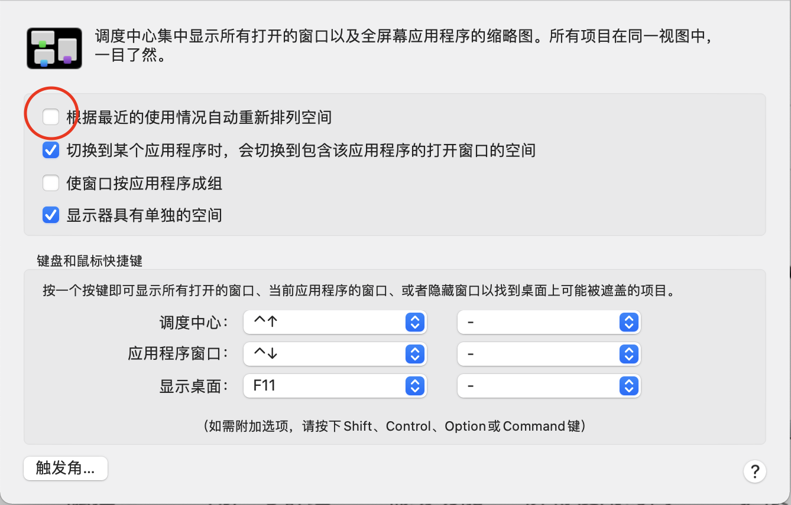
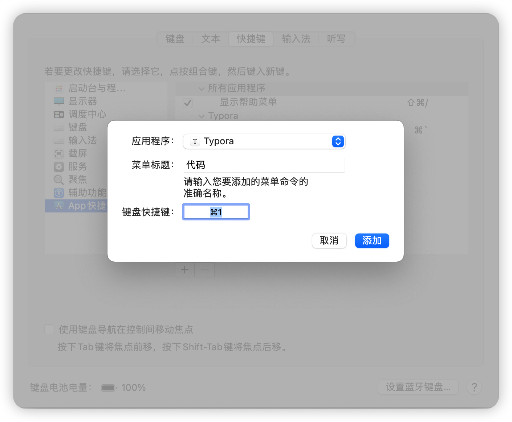
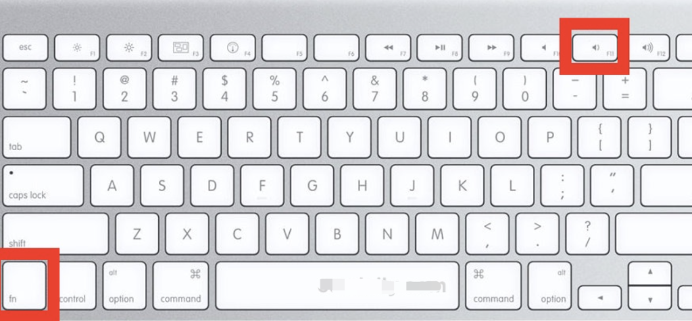

# 常用网站

https://sysin.org


# 重装系统


## 调整鼠标方向

打开“系统偏好设置”中的“鼠标”，将”滚动方向“前的钩去掉。


## 更改主机名与共享


## 登陆iCloud账户


## 设置系统时间

使用24小时制


## 菜单栏显示蓝牙


## 设置系统启动项


## 防止空间重排

进入 “调度中心“ 不要勾选 ”根据最近的使用情况自动重排列空间“




## 浏览器设置

在“通用“中更改主页和个人收藏显示


## 百度翻译设置


## ClashX设置


## 百度网盘设置


## 群晖同步设置


macOS 中的 iCloud 文件夹的路径如下：

```shell
~/Library/Mobile\ Documents/com~apple~CloudDocs
```


## QQ音乐设置


## 登陆Office账号


## 登陆远程桌面

配置win10服务器


# 快捷键


## 自定义菜单快捷键

打开“系统偏好设置”中的键盘


点击 “快捷键” 选项卡、点击左侧的 “App快捷键”，点击下方的 “+” 按钮


在应用程序选项中选择你要设置的应用程序

在菜单标题输入框中输入应用程序菜单栏中的菜单全名

在键盘快捷键输入框中添加快捷键。




## 显示桌面快捷键


返回桌面的快捷键是 Fn + F11 或 command+F3




## 命令行快捷键

- 这里是列表文本将光标移动到行首：control + a
- 将光标移动到行尾：control + e
- 清除屏幕：control + l
- 搜索以前使用命令：control + r
- 清除当前行：control + u
- 清除至当前行尾：control + k
- 单词为单位移动：option + 方向键


## 显示隐藏文件

shift+cmmand+.


# 系统设置


## 安装Homebrew

[Homebrew官网](https://brew.sh)地址，MacOS上安装命令如下：

```shell
/bin/bash -c "$(curl -fsSL https://raw.githubusercontent.com/Homebrew/install/HEAD/install.sh)"
```


