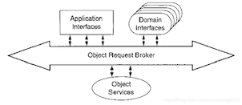

# LDAP协议

轻型目录访问协议（Lightweight Directory Access Protocol）是一个开放、中立、工业标准的应用软件协议。

通过IP协议提供访问控制和维护分布式信息的目录信息；

LDAP由互联网工程任务组（IETF）的文档RFC定义，使用了描述语言ASN.1定义。最新的版本是版本3，由RFC 4511所定义；

LDAP基于X.500标准的子集。因为这个关系，LDAP有时被称为X.500-lite；

？？？

# CORBA技术

- 基本概念

  CORBA，断句成C-ORB-A，译为通用对象请求代理结构。CORBA是较早的中间件技术，作为对象总线的功能体现在ORB一词中；

  

  CORBA的底层结构是基于面向对象模型的，由OMG接口描述语言(OMG Interface Definition Language，OMG IDL)、对象请求代理(Objec tRequest Broker，ORB)和IIOP标准协议（Internet Inter­ ORB Protocol，也称网络ORB交换协议）3个关键模块组成。

- IDL

  接口定义语言（IDL）用来定义CORBA对象使用的、应用组件之间的接口。它不是过程语言，它只能定义接口，而不是去实现某个接口。

  IDL独立于任何编程语言，用IDL编译器可以将它映射为其它常用的语言，如C++,C,JAVA,COBOL等等。

  IDL框架主要包括四种元素：1）模块 2）接口 3）操作 4）数据类型；

- ORB

  对象请求代理（ORB），它是CORBA的基础，是分布环境下，CORBA应用使用的、基于对象模型的软件。它的基本职责是解决对象引用的请求和建立应用对象之间的联结，

  通过标准接口，使这种联结独立于所使用的硬件和软件的平台，从而保证了对平台的透明性以及对操作系统、网络协议和编程语言的透明性。

  ORB的核心作用：

  - 第一步
    - 当客户激活一个调用操作时，操作中指出的目标对象的对象引用经码根传递ORB核心。ORB核心代表客户自动寻找对应的服务器；
    - 找到服务器后，ORB要确保该服务器做好接受请求的准备工作；
  - 第二步
    - 客户端的ORB核心接受被调用操作的参数，并将它组码为网络可接收的格式；
    - 服务端的ORB核心将来自网络的操作参数进行解组，然后送给服务器，并启动服务器执行所调用的操作；
  - 第三步
    - 执行操作后，如有返回参数，ORB核心将它组码后传入网络。客户端ORB核心对它进行解码，并将操作结果返回客户；

- IIOP

  GIOP：General Inter ORB Protocol,通用ORB间协议，是一类抽象的协议，指定了转换语法和消息格式的标准集，运行独立开发的ORB可以在任何一个面向连接的传递中进行通信；

  GIOP包括三个要素：编码方式，消息格式，对底层网络传输的要求；

  IIOP：Internet Inter-ORB Protocol,因特网ORB间协议，指定GIOP如何在TCP/IP上实现；

？？？

# JSSE

[Java安全套接字扩展](https://blog.csdn.net/cusi77914/article/details/107111684/)

英文 Java Secure Sockets Extension，支持安全的 Internet通信。提供了TLS和DTLS协议的一个框架和 Java版本的实现，包括数据加密、服务器认证、消息完整性、和客户端认证功能；

JSSE支持下列安全协议：

- DTLS：1.0和1.2版本
- TLS：1.0、1.1、1.2和1.3版本
- SSL：3.0版本

# JAAS

Java身份验证和授权服务

# JGSS

Java通用安全服务

# CertPath API

[Java认证路径API](https://blog.csdn.net/cusi77914/article/details/107111684/)

# 数据访问技术实现

| 数据访问技术 | 实现                         |
| ------------ | ---------------------------- |
| JDBC         | DataSourceTransactionManager |
| JPA          | JpaTransactionManager        |
| Hibernate    | Hibernate TransactionManager |
| JDO          | JdoTransactionManager        |
| 分布式事务   | JtaTransactionManager        |

