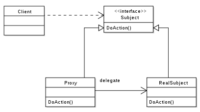
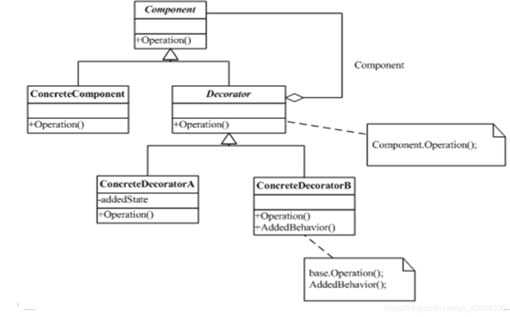
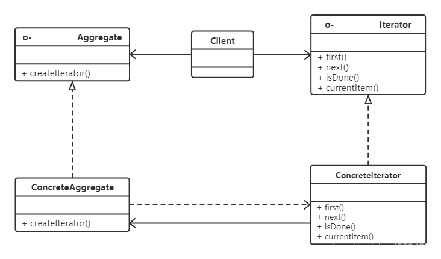

# 代理模式

英文 Proxy Pattern，通过 Proxy 创建一个目标对象的代理对象。

目标对象（Subject）：被代理的对象；

代理（Proxy）：代理接口；

实际代理对象（RealSubject）：实际生成的代理对象；

# 观察者模式

英文 Observer Pattern，由主题、主题目标、观察者接口、具体观察者组成，当具体目标中调用主题中通知方法，主题会便利所有观察者，并逐个通知。

- 抽象主题（Subject）：也叫抽象目标类，提供了一个用于保存观察者对象的聚集类和增加、删除观察者对象的方法，以及通知所有观察者的抽象方法；
- 具体目标（Concrete  Subject）：也叫具体目标类，实现抽象目标中的通知方法，当具体主题的内部状态发生改变时，通知所有注册过的观察者对象；
- 观察者接口（Observer）：是一个抽象类或接口，它包含了一个更新自己的抽象方法，当接到具体主题的更改通知时被调用；
- 具体观察者（Concrete Observer）：实现抽象观察者中定义的抽象方法，以便在得到目标的更改通知时更新自身的状态；

# 中介者模式

**在现实生活中，常常会出现好多对象之间存在复杂的交互关系，这种交互关系常常是“网状结构”，它要求每个对象都必须知道它需要交互的对象。例如，每个人必须记住他（她）所有朋友的电话；而且，朋友中如果有人的电话修改了，他（她）必须告诉其他所有的朋友修改，这叫作“牵一发而动全身”，非常复杂。**

如果把这种“网状结构”改为“星形结构”的话，将大大降低它们之间的“耦合性”，这时只要找一个“中介者”就可以了。如前面所说的“每个人必须记住所有朋友电话”的问题，只要在网上建立一个每个朋友都可以访问的“通信录”就解决了。这样的例子还有很多，例如，你刚刚参力口工作想租房，可以找“房屋中介”；或者，自己刚刚到一个陌生城市找工作，可以找“人才交流中心”帮忙。

在软件的开发过程中，这样的例子也很多，例如，在 MVC 框架中，控制器（C）就是模型（M）和视图（V）的中介者；还有大家常用的 QQ 聊天程序的“中介者”是 QQ 服务器。所有这些，都可以采用“中介者模式”来实现，它将大大降低对象之间的耦合性，提高系统的灵活性。

模式的定义与特点

中介者（Mediator）模式的定义：定义一个中介对象来封装一系列对象之间的交互，使原有对象之间的耦合松散，且可以独立地改变它们之间的交互。中介者模式又叫调停模式，它是迪米特法则的典型应用。

中介者模式是一种对象行为型模式，其主要优点如下。

1. 降低了对象之间的耦合性，使得对象易于独立地被复用。
2. 将对象间的一对多关联转变为一对一的关联，提高系统的灵活性，使得系统易于维护和扩展。

# 备忘录模式

英文 Memento Pattern，由发起人、备忘录、管理者组成，发起人创建一个备忘录对象，将备忘录交给管理者维护。

- 发起人（Originator）：记录当前时刻的内部状态信息，提供创建备忘录和恢复备忘录数据的功能，实现其他业务功能，可以访问备忘录里的所有信息；
- 备忘录（Memento）：负责存储发起人的内部状态，在需要的时候提供这些内部状态给发起人；
- 管理者（Caretaker）：对备忘录进行管理，提供保存与获取备忘录的功能，但其不能对备忘录的内容进行访问与修改；

# 策略模式

由一个策略接口（Strategy）、多个策略实现类（ConcreteStrategy）、环境上下文类（Context）组成，根据环境上下文中的条件选择不同的策略实现类。

# 外观模式

英文 Facade Pattern，由一个外观接口（Facade）、多个子系统（Sub System）组成，其他程序通过外观接口访问子系统的功能。

# 桥接模式

英文 Bridge Pattern，由实现接口（Implementor）、具体实现（Concrete Implementor）、抽象化（Abstraction）、扩展抽象化（Refined  Abstraction），通过 Abstraction 接口方法的实现调用 Implementor 的具体实现方法。

# 命令模式

英文 Command Pattern，由命令接口、命令种类、命令实现、调用者组成，调用者发送命令种类，调用者执行对应的命令实现。

- 命令接口（Command）：声明执行命令的接口，拥有执行命令的抽象方法 execute()。
- 命令种类（Concrete  Command）角色：是抽象命令类的具体实现类，它拥有接收者对象，并通过调用接收者的功能来完成命令要执行的操作。
- 命令的实现者/接收者（Receiver）角色：执行命令功能的相关操作，是具体命令对象业务的真正实现者。
- 调用者/请求者（Invoker）角色：是请求的发送者，通常拥有很多的命令对象，并通过访问命令对象来执行相关请求，不直接访问接收者。

# 模板方法模式

模板方法的本质其实就是类的继承。

# 责任链模式

英文 Chain of Responsibility，也叫职责链模式，将所有请求的处理者通过前一对象记住其下一个对象的引用而连成一条链；当有请求发生时，可将请求沿着这条链传递，直到有对象处理为止，所以责任链将请求的发送者和请求的处理者解耦了。

模式结构：

- 抽象处理者（Handler）角色：定义一个处理请求的接口，包含抽象处理方法和一个后继连接。
- 具体处理者（Concrete Handler）角色：实现抽象处理者的处理方法，判断能否处理本次请求，如果可以处理请求则处理，否则将该请求转给它的后继者。
- 客户类（Client）角色：创建处理链，并向链头的具体处理者对象提交请求，它不关心处理细节和请求的传递过程。

# 状态模式

英文 State Pattern，由环境上下文信息、状态、状态的实现组成，根据对象中状态变化，让对象的行为也发生变化。

- 环境（Context）角色：也称为上下文，它定义了客户感兴趣的接口，维护一个当前状态，并将与状态相关的操作委托给当前状态对象来处理；
- 抽象状态（State）角色：定义一个接口，用以封装环境对象中的特定状态所对应的行为；
- 具体状态（Concrete  State）角色：实现抽象状态所对应的行为；

# 不可变模式

英文 immutability Pattern，就是对象创建之后对象中的字段就不会变化。

# 适配器模式

使用适配器将二个完全无关的接口或系统结合起来使用。

- 目标抽象类：Target，该角色把其他类转换为我们期望的接口，可以是一个抽象类或接口，也可以是具体类；
- 被适配者: Adaptee ，原有的接口，也是希望被适配的接口；
- 适配器： Adapter, 将被适配者和目标抽象类组合到一起的类；

# 创建型模式

## 工厂模式

英文 Facotry Pattern，有一个工厂接口，对应多个工厂接口的实现。

## 简单工厂模式

英文 Simple Facotry Pattern，有一个产品接口与一个工厂类，根据参数返回对应产品的实例。

## 抽象工厂模式

多个接口对应多个工厂类，每个工厂类都要创建所有产品的实例，相比于工厂模式，抽象工厂则用于创建一系列产品，所以产品分类成了抽象工厂的重点。

## 单例模式

英文 Single Pattern，单例模式可以确保某个类只有一个实例，且自行实例化并向整个系统提供这个实例。

## 原型模式

英文 Prototype Pattern，是用于创建重复的对象，同时又能保证性能，提供了一种创建对象的最佳方式。

## 建造者模式

英文 Bulider Pattern，由调用者、产品、建造接口、具体建造者组成，由调用者决定使用那个具体的建造者，再调用具体建造者中的方法创建产品。

- 产品角色（Product）：它是包含多个组成部件的复杂对象，由具体建造者来创建其各个滅部件；
- 抽象建造者（Builder）：它是一个包含创建产品各个子部件的抽象方法的接口，通常还包含一个返回复杂产品的方法 getResult()；
- 具体建造者(Concrete Builder）：实现 Builder 接口，完成复杂产品的各个部件的具体创建方法；
- 调用者（Director）：调用建造者对象中的部件构造与装配方法完成复杂对象的创建，在指挥者中不涉及具体产品的信息；

# 装饰器模式

英文 Decorator Pattern，装饰器实现接口，且可以输入接口的实现类，在调用实现类方法前执行一些自定义的装饰代码。

- Component（接口）：定义一个抽象接口以规范准备接收附加责任的对象；

- ConcreteComponent（接口实现）：接口的实现类；
- Decorator（装饰类）：实现了接口，在接口实现中实现装饰代码；
- ConcreteDecorator（被装饰的接口实现类）：实现了接口，但是需要将对象交给装饰器执行接口中的方法；

# 迭代器模式

英文 Iterator Pattern

- 抽象聚合（Aggregate）角色：创建迭代器的接口；
- 具体聚合（ConcreteAggregate）角色：实现了 Aggregate 接口；
- 抽象迭代器（Iterator）角色：迭代器接口，通常包含 hasNext()、first()、next() 等方法；
- 具体迭代器（Concrete lterator）角色：迭代器接口的具体实现；

