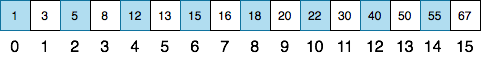
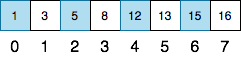
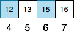
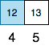
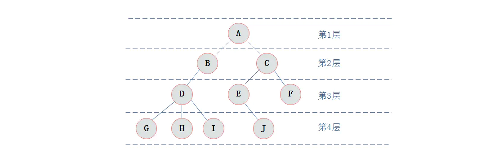
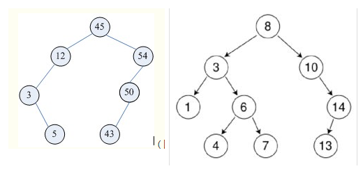
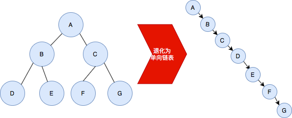
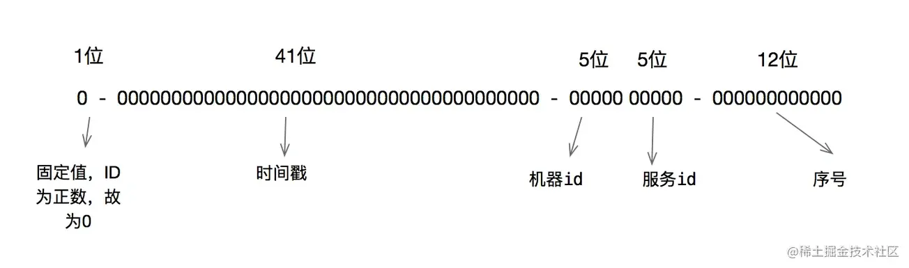

| 表达式                | 显示效果             |
| --------------------- | -------------------- |
| \$ {4ac \over b} $    | $ {4ac \over b} $    |
| \$ {b-c} \over {2a} $ | $ {b-c} \over {2a} $ |
| \$ \frac{a-b}{bc} $   | $ \frac{a-b}{bc} $   |
| \$ \frac ba $         | $ \frac ba $         |

# 时间复杂度

O(1) 表示一次操作即可直接取得目标元素（比如字典或哈希表）；

O(n) 表示要检查过 n 个元素后才能找到目标元素；

在最好情况下二分搜索的时间复杂度是 O(1)，最坏情况下是 O($\log{n}$) ；

如下图所示，要在有16个元素的有序数组中查找数字13

第一步：选中间的元素作为中心点（长度的一半）；

第二步：13 小于中心点，所以不用考虑数组的后一半；

第三步：重复这个过程，每次都寻找子数组的中间元素；

每次和中间元素比较都会使搜索范围减半；

为了从 16 个元素中找到目标元素，要把数组平均分割 4 次，时间复杂度公式：$16*(\frac 12)^4=1$

如果按有n个元素来推导公式：$ n*(\frac 12)^k=1 \longrightarrow n*\frac 1{2^k}=1 \longrightarrow n=2^k \longrightarrow k=\log2^n \longrightarrow \log n$（与底数无关）

> $\log$ 是对数符号，右边写底数（下面）和真数（上面），是在幂函数的基础上衍生的（例如 $3^2=9$ 可得 $\log3^9=2$ 即以3为底9的对数等于2，也可理解为3的多少次幂等于9）；
>
> 常用对数：底数为10，可简写为 $\lg$，$\log10^X$= $\lg{X}$
>
> 自然对数：底数为e，可简写为 $\ln$，$\log{e^X}$=$\ln{X}$
>
> 算法中 $\log$ 级别的时间复杂度都是由于使用了分治思想，这个底数直接由分治的复杂度决定，如果采用二分法，那么底数就是2，三分法底数就是3，以此类推；
>
> 例如：二分法与三分法的时间复杂度比值是 $\log 2^n / \log 3^n \longrightarrow \frac {\ln n}{\ln 2} / \frac {\ln n}{\ln 3} \longrightarrow \ln3 / \ln2$，意思是在n趋于无穷大的时候，这个比值是一个常数，所以从研究算法的角度上看 $\log$ 的底数不重要，可以忽略不写；

# 树

树是由n（n>=0）个节点构成的有限集合，n=0时称为空树，特征如下：

1. 树只能有一个根节点； 

2. 子树之间互不相交；

3. 节点：包含数据元素及若干指向子树的分支信息；

4. 结点关系：孩子结点、双亲结点、兄弟结点；

5. 节点度数：节点下子节点的个数；

   

6. 树的度数：树中节点的最大度数；

7. 叶子：度为0的节点，又被称为终端节点；

8. 分支节点：度大于0的节点。除了叶子，都是分支节点；

9. 内部节点：除了树根和叶子，都是内部节点；

10. 结点层次

  从根开始定义起，根为第一层，根的子节点为第二层，以此类推，如下所示；

  

11. 树的深度

    树中结点的最大层次，如上图所示，树的深度为4；

# 二叉树

二叉树如上图所示，其特征如下：

- 每个结点最多拥有2个子树，即左子树与右子树；
- 左子树和右子树有顺序，次序不能任意颠倒；

## 完美二叉树

又叫**满二叉树**，是指所有叶子都在同一层上的二叉树，每层都被完全填充，如下图所示；

## 完全二叉树

对一颗具有n个结点的二叉树按层编号，如果编号为i（1<=i<=n）的结点与同样深度的满二叉树中编号为i的结点在二叉树中位置完全相同，则这棵二叉树称为完全二叉树，编号跟满二叉树一样的，如下图所示；

满二叉树一定是完全二叉树，但反过来不一定成立；

## 完满二叉树

除了叶子节点之外的每一个节点都有两个孩子节点；

## 存储结构

- 顺序存储

  二叉树的顺序存储结构就是使用一维数组存储二叉树中的结点，并且结点的存储位置，就是数组的下标索引；

  

  采用顺序存储方式为：

  

  当二叉树不为完全二叉树时，该顺序存储结构又是如何？

  

  其中浅色结点表示结点不存在，那么其存储结构为：

  

  但是在左斜树、右斜树这些极端情况下，采用顺序存储十分浪费空间。因此，顺序存储一般适用于完全二叉树；

- 链表存储

  是指将节点数据结构定义为数据和两个指针域，如下所示；

  

  如下图所示，由多个节点构成了一个二叉树链表；

  

## 遍历操作

- **先序遍历**

  所谓的前序遍历就是先访问根节点，再访问左节点，最后访问右节点，即**根-左-右**遍历（前序）；

- **中序遍历**

  所谓的中序遍历就是先访问左节点，再访问根节点，最后访问右节点，即**左-根-右**遍历；

- **后序遍历**

  所谓的后序遍历就是先访问左节点，再访问右节点，最后访问根节点。即**左-右-根**遍历；

- 查找最小值

  沿着根节点的左子树一路查找，直到最后一个不为空的节点，该节点就是当前这个树的最小节点；

- 查找最大值

  沿着根节点的右子树一路查找，直到最后一个不为空的节点，该节点就是当前这个树的最大节点；

## 删除节点

本质上是找前驱节点或者后继节点来替代；

查找前驱节点：小于当前节点的最大值；

查找后继节点：大于当前节点的最小值；

- 叶子节点直接删除；

- 只有一个子节点的用子节点替代（本质上就是找的前驱节点或者后继节点，左节点就是前驱节点，右节点就是后继节点）；
- 有两个子节点的，需要找到替代节点（替代节点就是前驱节点或者后继节点）；

# 二叉搜索树（BST）

全称Binary Search Tree，简称BST，又叫**二叉查找树**、**二叉排序树**，特征如下：

- 拥有二叉树的所有特征；
- 任何一个结点都大于其左孩子结点，小于其右孩结点；
- 没有键值相等的节点；

但BST可能会退化成一个单向链表，如下图所示；

# 平衡二叉树（AVL）

全称Balanced Binary Search Tree，从名字可看出其本质还是一个BST，因为**平衡二叉树**是苏联数学家**Adelson-Velsky**和**Landis**发现的，所以可简称为**AVL**，AVL是为了解决了BST可能退化成单向链表的问题，AVL在插入和删除节点的时候，会通过旋转操作将树的高度维持在O(logn)；，特征如下：

1. 拥有BST的所有特征；
2. 平衡因子又名高度差，即**平衡因子=右子树的高度-左子树的高度**，一定要保证其范围[-1,0,1]；

# 红黑树（RBT）

全称Red Black Tree，简称RBT，特征如下：

- 拥有AVL的所有特征；
- 节点的颜色只能是**红色**或**黑色**，**根节点**必须是**黑色**；
- 红色节点的父节点、左孩子结点、右孩子节点都是黑色，即黑红相间；



# B-树

全称Balance Tree，也叫B树，又称**多路平衡查找树**，B树中所有结点的孩子结点数的最大值成为B树的阶；

一颗m阶B树或为空树，或为满足以下特性的m叉树：

- 结点只能是 2-结点、3-结点、4-结点之一；
  - 2-结点：包含 1 个元素的节点，有 2 个子节点；
  - 3-结点：包含 2 个元素的节点，有 3 个子节点；
  - 4-结点：包含 3 个元素的节点，有 4 个子节点；
- 所有叶子都拥有相同的深度；
- 所有结点必须至少包含1个元素；
- 结点有多个元素时，元素是有序的，其中每个元素大于其左子结点，小于其右子结点；

# B+树

B+数是B树的一种变形形式，特征如下：

- 拥有B树的所有特征；
- 叶子结点之间有指针；
- 非叶子节点上的元素都在叶子节点上冗余了，即叶子节点中存储了所有元素，且是有序的；

Mysql索引使用的是B+树，因为索引是用来加快查询速度的，而B+树通过对数据进行排序所以是可以提高查询速度的，而且B+树可以通过节点可以存储多个元素，从而使得B+树的高度不会太高，在Mysql中一个Innodb页就是一个B+树节点，一个Innodb页默认为16KB，所以一般情况下二层的B+树可以存储2000万行左右的数据，然后利用叶子节点间有指针且存储了所有数据（有序的）的特点，可以很好的支持全表扫描，范围查找等功能；

# 工作窃取算法

是指把一个大任务分割为若干个互不依赖的子任务，为了减少线程间的竞争，把这些子任务分别放到不同的队列里，并为每个队列创建一个单独的线程来执行队列里的任务，线程和队列一一对应。其中某个线程会先把自己队列里的任务执行完毕，而其他线程的队列里还有任务待处理。干完活的线程与其等着，不如帮其他线程干活，于是就去其他线程的队列里窃取一个任务来执行。这时2个线程可能会同步访问同一个队列，所以为了减少窃取任务线程和被窃取任务线程之间的竞争，通常会使用双端队列，被窃取任务线程永远从双端队列的头部拿任务执行，而窃取任务线程永远从双端队列的尾部拿任务执行。

# 雪花算法

SnowFlake 中文意思为雪花，故称为雪花算法。最早是 Twitter 公司在其内部用于分布式环境下生成唯一 ID。

雪花算法的原理就是生成一个的 64 位比特位的 long 类型的唯一 id。

最高 1 位固定值 0，因为生成的 id 是正整数，如果是 1 就是负数了。

1）接下来是 41 位存储毫秒级时间戳，2^41^/(1000*60*60*24*365)=69，大概可以使用 69 年。但是雪花算法依赖服务器时间，服务器时钟回拨时可能会生成重复 id。算法中可通过记录最后一个生成 id 时的时间戳来解决，每次生成 id 之前比较当前服务器时钟是否被回拨，避免生成重复 id。

2）接下来是 10 位机器码，最多可以部署 2^10^=1024 台机器。例如数据中心+机器号、机房号+机器号、机器号+服务号等。

3）最后 12 位存储序列号。同一毫秒时间戳时，通过这个递增的序列号来区分。即对于同一台机器而言，同一毫秒时间戳下，可以生成 2^12^=4096 个不重复 id。

# 工具

[数据结构可视化网站](https://www.cs.usfca.edu/~galles/visualization/Algorithms.html)

