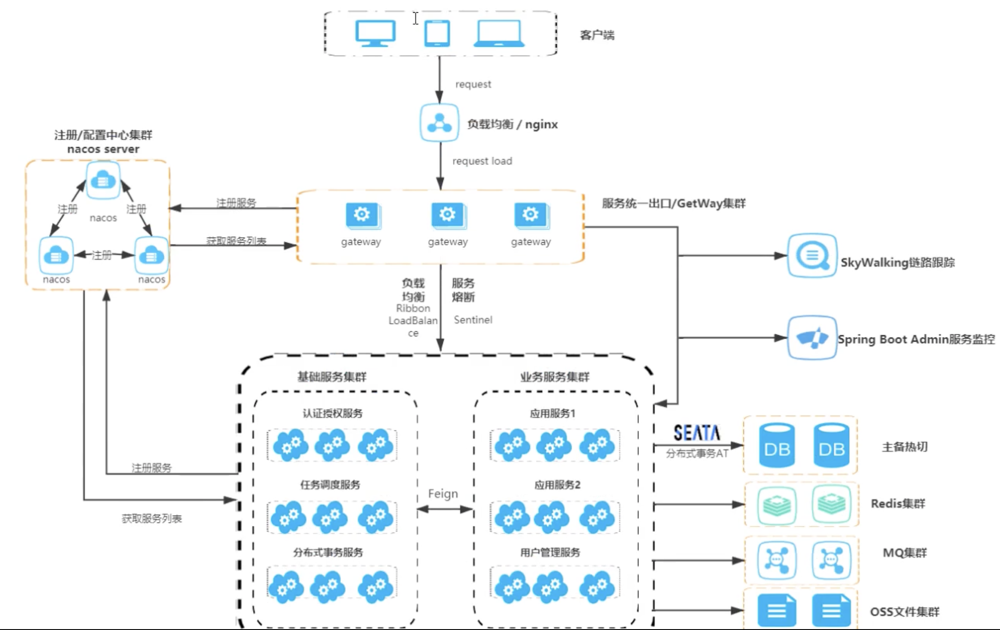
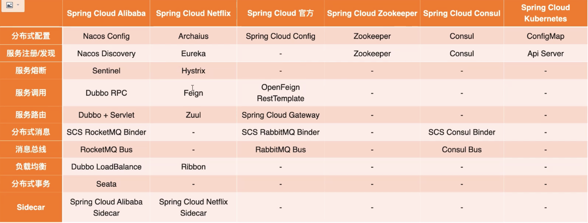
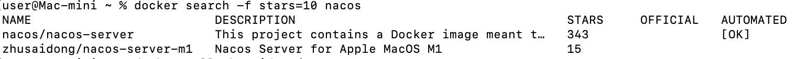
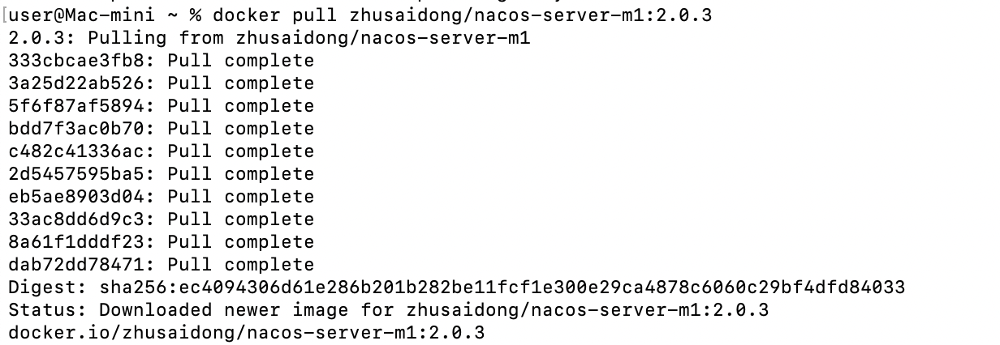
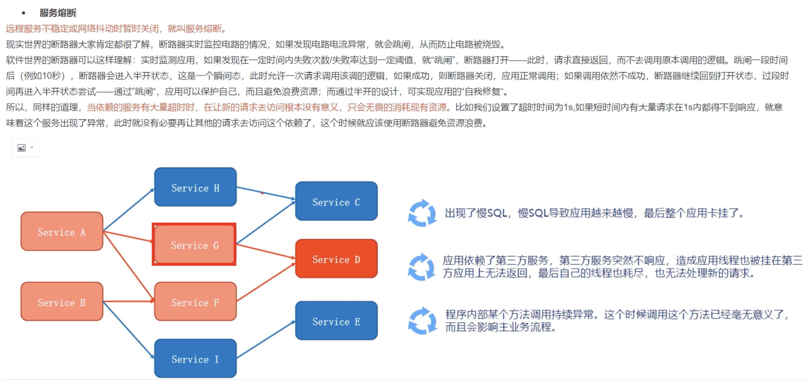

# 简介

微服务是一种架构风格
一个应用拆分为一组小型服务
每个服务运行在白己的进程内，也就是可独立部罢和升级
服务之间使用轻量级HTTP交互
服务围绕业务功能拆分
可以由全自动部署机制独立部署
去中心化，服务自治。服务可以使用不同的语言、不同的存储技术。


# 分布式困难

- 远程调用
- 服务发现
- 负载均衡
- 服务容错
- 配置管理
- 服务监控
- 链路追踪
- 日志管理
- 任务调度





# CAP理论

C（Consistency）一致性，主从架构，之间互相同步，保持一致。

A（Availability）可用性，集群中，一台挂掉，其他还可以用。

P（Partition tolerance）分区容错。

CAP 原则指的是，这三个要素最多只能同时实现两点，不可能三者兼顾。


# 版本




| Spring Cloud Alibaba Version        | Spring Cloud Version        | Spring Boot Version |
| ----------------------------------- | --------------------------- | ------------------- |
| 2.2.10-RC1*                         | Spring Cloud Hoxton.SR12    | 2.3.12.RELEASE      |
| 2.2.9.RELEASE                       | Spring Cloud Hoxton.SR12    | 2.3.12.RELEASE      |
| 2.2.8.RELEASE                       | Spring Cloud Hoxton.SR12    | 2.3.12.RELEASE      |
| 2.2.7.RELEASE                       | Spring Cloud Hoxton.SR12    | 2.3.12.RELEASE      |
| 2.2.6.RELEASE                       | Spring Cloud Hoxton.SR9     | 2.3.2.RELEASE       |
| 2.2.1.RELEASE                       | Spring Cloud Hoxton.SR3     | 2.2.5.RELEASE       |
| 2.2.0.RELEASE                       | Spring Cloud Hoxton.RELEASE | 2.2.X.RELEASE       |
| 2.1.4.RELEASE                       | Spring Cloud Greenwich.SR6  | 2.1.13.RELEASE      |
| 2.1.2.RELEASE                       | Spring Cloud Greenwich      | 2.1.X.RELEASE       |
| 2.0.4.RELEASE（停止维护，建议升级） | Spring Cloud Finchley       | 2.0.X.RELEASE       |
| 1.5.1.RELEASE（停止维护，建议升级） | Spring Cloud Edgware        | 1.5.X.RELEASE       |


## 组件版本关系

每个 Spring Cloud Alibaba 版本及其自身所适配的各组件对应版本如下表所示（注意，Spring Cloud Dubbo 从 2021.0.1.0 起已被移除出主干，不再随主干演进）：

| Spring Cloud Alibaba Version                              | Sentinel Version | Nacos Version | RocketMQ Version | Dubbo Version | Seata Version |
| --------------------------------------------------------- | ---------------- | ------------- | ---------------- | ------------- | ------------- |
| 2.2.10-RC1                                                | 1.8.6            | 2.2.0         | 4.9.4            | ~             | 1.6.1         |
| 2022.0.0.0-RC1                                            | 1.8.6            | 2.2.1-RC      | 4.9.4            | ~             | 1.6.1         |
| 2.2.9.RELEASE                                             | 1.8.5            | 2.1.0         | 4.9.4            | ~             | 1.5.2         |
| 2021.0.4.0                                                | 1.8.5            | 2.0.4         | 4.9.4            | ~             | 1.5.2         |
| 2.2.8.RELEASE                                             | 1.8.4            | 2.1.0         | 4.9.3            | ~             | 1.5.1         |
| 2021.0.1.0                                                | 1.8.3            | 1.4.2         | 4.9.2            | ~             | 1.4.2         |
| 2.2.7.RELEASE                                             | 1.8.1            | 2.0.3         | 4.6.1            | 2.7.13        | 1.3.0         |
| 2.2.6.RELEASE                                             | 1.8.1            | 1.4.2         | 4.4.0            | 2.7.8         | 1.3.0         |
| 2021.1 or 2.2.5.RELEASE or 2.1.4.RELEASE or 2.0.4.RELEASE | 1.8.0            | 1.4.1         | 4.4.0            | 2.7.8         | 1.3.0         |
| 2.2.3.RELEASE or 2.1.3.RELEASE or 2.0.3.RELEASE           | 1.8.0            | 1.3.3         | 4.4.0            | 2.7.8         | 1.3.0         |
| 2.2.1.RELEASE or 2.1.2.RELEASE or 2.0.2.RELEASE           | 1.7.1            | 1.2.1         | 4.4.0            | 2.7.6         | 1.2.0         |
| 2.2.0.RELEASE                                             | 1.7.1            | 1.1.4         | 4.4.0            | 2.7.4.1       | 1.0.0         |
| 2.1.1.RELEASE or 2.0.1.RELEASE or 1.5.1.RELEASE           | 1.7.0            | 1.1.4         | 4.4.0            | 2.7.3         | 0.9.0         |
| 2.1.0.RELEASE or 2.0.0.RELEASE or 1.5.0.RELEASE           | 1.6.3            | 1.1.1         | 4.4.0            | 2.7.3         | 0.7.1         |


# nacos


## 注册中心

服务注册中心，服务检测中心，服务管理中心（提供管理页面）

支持CP+AP，支持ribbion和loadbalance，有健康检查，可对抗雪崩，每隔5秒发送一次心跳，超过15秒服务端没有接收到心跳，会将健康状态设置为 false，客户端会定时拉取服务列表（会过滤健康状态为false的服务），如果超30秒还没有收到心跳，会将服务剔除掉。

支持命名空间，用来做配置隔离，默认将服务添加到 public 的保留空间中，比如可以分为开发环境和生产环境、测试环境

分组：在命名空间内对相同特征的服务进行再归类分组，默认所有的配置集都属于：DEFAULT_GROUP

雪崩保护：健康实例数/总实例数<保护阀值时，会把健康+不健康的实例都提给客户端使用，这样会牺牲部分流量，但能保护部分流量

保护阀值：0到1之间的浮点数表示百分比，默认是0，也就是没有开启雪崩保护机制。

元数据：key和value键值对，在获取服务列表的时候，可以得到自定义的元数据配置信息。

权重：0到1之间的浮点数表示权重，通常结合负载均衡策略使用，值越大，分配的流量越大。

健康状态：临时实例的心跳检测状态。

下线：服务就不会被使用了。

永久实例：spring.cloud.nacos.discovery.ephemeral=false，没有心跳检测，即使服务宕机，也不会删除实例。服务端会主动推送服务列表给永久实例。

临时实例：使用心跳检测机制

隐藏空间服务：可以隐藏实例数为零的服务，可以创建一个空服务出来，等待真实例服务来注册。

集群：集群名称

网卡名：客户端注册到注册中心的IP地址，如果有多个网卡默认取第一个网卡的IP地址，spring.cloud.nacos.discovery.network-interface

注册IP地址：指定注册中心的IP地址，spring.cloud.nacos.discovery.ip

注册IP端口：指定注册中心的IP端口，spring.cloud.nacos.discovery.port

是否继承ribbon：ribbon.nacos.enabled=true 表示开启负载均衡器

是否开启nacos watch：spring.cloud.nacos.discovery.watch.enabled=true 默认开启，用于发布心跳事件


## 配置中心

比Springcloud配置中心要高级，支持前台页面管理参数，速度优于SpringCloud的配置中心。

新建配置

Data ID：通常使用 java 包方式命名，保证名称全局唯一。


## 与Eureka差异

接口方式：都对外使用Rest风格的接口，用来实现服务注册与发现功能；

实例类型：Nacos 有永久实例和临时实例，Eureka支持临时实例；

健康检测：Nacos 临时使用使用心跳检测，永久实例采用主动检测机制，Nacos 临时实例心跳不正常会被剔除，永久实例不会被剔除，Eureka只支持心跳检测；

服务发现：Nacos 支持订阅推送和定时拉取二种模式，Eureka只支持定时拉取模式；

CAP理论：Nacos 默认使用 AP 模式，永久实例采用 CP 模式，Eureka只支持AP模式；


## @RefreshScope注解

如果在Bean中使用@Value方式获取nacos配置中心配置的属性值，可以配合@RefreshScope注解使用，在配置中心中更新属性值后会自动刷新到@Value注解标准的变量上。

```java
@RestController
@RefreshScope
public class TestController {
  
  @Value("${common.user}")
  private String user;
  
  ...
}
```


## 在docker上安装


搜索nacos镜像，选择支持M1版本的nacos镜像

```shell
docker search nacos
```



查看镜像版本

```java
https://hub.docker.com/r/zhusaidong/nacos-server-m1/tags
```

拉取镜像

```shell
docker pull zhusaidong/nacos-server-m1:2.0.3
```



启动容器

```shell
docker run -d -p 8848:8848 --env MODE=standalone  --name nacos zhusaidong/nacos-server-m1:2.0.3
```

登陆系统

[http://localhost:8848/nacos/](http://localhost:8848/nacos/) 

账号/密码：nacos/nacos


# Ribbon

负载均衡器，分为2类：

- 集中式负载均衡器，在消费者和服务提供商中间，使用独立的代理方式实现负载均衡，有硬件的f5、软件的nginx
- 客户端负载均衡器，根据客户端自己的请求情况做负载均衡，ribbon属于客户端负载均衡器。

nacos默认使用ribbon作为负载均衡器，不需要单独添加依赖。

使用方式：使用LoadBalance 注解添加到RestTemplate 的Bean上，表示开启负载均衡器

负载均衡策略接口 IRule，其实现类有：

RandomRule：随机策略

RoundRobinRule：轮询策略，默认值。

RetryRule：在轮询的基础上，进行重试。 如果请求服务失败且没有请求超时，则继续尝试使用其他服务执行，直到请求成功或超时为止。 

WeightedResponseTimeRule：是基于权重的策略，与nacos中配置的权重不同，是指服务器响应的事件越短权重越大，被选中执行的概率也越大。

NacosRule：是指在nacos中配置权重值的负载均衡策略。

BestAvaliableRule：过滤掉失效的实例，顺序找出并发请求最小的实例来执行请求。

ZoneAvoidanceRule：基于区域进行过滤，之后在采用轮询的策略来执行。

AvailabilityFilteringRule：现过滤掉故障实例，再选择并发压力最小的实例

配置方式：

全局配置：是指给所有的微服务统一设置负载均衡策略。

局部配置：是指调用指定的微服务时，使用指定的负载均衡策略。

```yaml
server_name:
  ribbon:
    NFLoadBalancerRuleClassName: com.alibaba.cloud.nacos.ribbon.NacosRule
```

自定义配置： 实现 IRule接口中的choose方法或继承抽象类AbstractLoadBalancerRule。

开启饥饿加载：

```yaml
ribbon:
  eager-load:
    enabled: true
    clients: serverName1,serverName2 # 开启饥饿加载的服务名，用逗号分隔
```

SpringCloud LoadBalancer 是SpringCloud官方提供的负载均衡器，用于替换不再更新的ribbon。


# loadbalance

目前这个负载均衡器的策略比较单一，不建议使用。


# feign

feign原来是neflix开源，现在已经是闭源的了，SpringCloud官方推出了openfeign开源组件，平时所说的feign指的就是openfeign。

## 引入依赖

```xml
<dependency>
  <groupId>org.springframework.cloud</groupId>
  <artifactId>spring-cloud-starter-openfeign</artifactId>
</dependency>
```


## @EnabledFeignClients注解

将注解 @EnabledFeignClients 用在 SpringBoot 启动类上，表示开启扫描 @FeignClient  注解


## @FeignClient注解

@FeignClient 注解用在接口上，表示接口是一个 Feign 接口。

name参数用于指定微服务名

path参数与在 Controller 类上的 @RequestMapping("/test") 注解中 test 路径相同

在接口中的方法上可以使用SpringMVC的 @RequestMapping 注解用于指定方法绑定远程请求路径的 uri

```java
@FeignClient(value="serviceName", path="/test")
public interface Test {
  
  @RequestMappiung("/print/{str}")
  public String printHello(@PathVariable("str") str);
}
```


## 日志配置

OpenFeign 的日志级别默认使用 SpringMVC 的日志级别，即 logging.level 属性指定的日志级别

```yaml
logging:
  level:
    indi.lvzhaojun.xx.openfeign.xx=debug
```

可以配置一个 Bean 来控制 feign 的日志输出范围：

NONE：不显示日志，性能最佳，适用于生产环境；

BASIC：适用于生产环境中的问题追踪，仅记录请求方法、URL、响应状态代码以及执行时间；

HEADERS：在BASIC基础上记录请求和响应的headers；

FULL：适用于开发和测试环境，需要debug机制级别，记录请求和响应的header、body、元数据；

```java
@Configuration
public class OpenFeignConfig {

	@Bean
  public feign.Logger.Level getOpenFeignLevel() {
    return feign.Logger.Level.FULL;
  }
}
```


## 局部配置

1）可以在 @FeignClient 注解中指定使用的配置类

```java
public class OpenFeignSingleConfig {

	@Bean
  public feign.Logger.Level getOpenFeignLevel() {
    return feign.Logger.Level.FULL;
  }
}
```

```java
@FeignClient(name="serviceName", path="/test", configuration="OpenFeignSingleConfig")
```

2）可以在yml配置文件中指定某各类使用输出指定范围的日志

```yaml
feign:
  client:
    config:
      serviceName:
        loggerLevel: BASIC
```


## 契约配置

可以通过契约配置，让 Open Feign 支持原生 Feign 的注解。

1. 在配置类中，开启原生 Feign 的支持

   ```java
   @Bean
   public Contract feignContract() {
   	return new Contract.Default();
   }
   ```

   修改契约配置后，不再支持SpringMVC注解，需要使用原生 Feign 注解。

2. 使用原生 Feign 的注解

   ```java
   @FeignClient(value="serviceName", path="/test")
   public interface Test {
     
     @RequestLine("GET /print/{str}")
     public String printHello(@Param("str") str);
   }
   ```

3. 也可以通过 yml 配置契约

   ```yaml
   feign:
     client:
       config:
         serviceName:
           loggerLevel: BASIC
           contract: feign.contract.Default # 表示使用原生契约配置
   ```


## 超时时间

通过 Request.Options 可以配置连接超时时间与读取超时时间，Options 的第一个参数是连接超时时间（单位ms），默认是2s；第二个参数是请求处理的超时时间（单位ms），默认是5s。

Feign默认使用ribbon，但超时时间以Feign配置为准

### 全局配置

```java
@Configuration
public class OpenFeignConfig2() {
	
  @Bean
  public Request.Options options() {
    return new Request.Options(5000, 10000);
  }
}
```


### 单独配置

在 yml 中单独配置

```yaml
feign:
  client:
    config:
      serviceName:
        loggerLevel: BASIC
        contract: feign.contract.Default # 表示使用原生契约配置
        connectTimeout: 5000
        readTimeout: 10000 
```


##  自定义拦截器

自定义一个拦截器，并实现拦截器接口 RequestInterceptor。

```java
public class CustomFeignInterceptor implements RequestInterceptor {

	public void apply(RequestTemplate t) {
    t.header("Authorization", UUID.randomUUID().toString()); // 自定义拦截器实现用户认证
  }
}
```

将拦截器注册到 Spring 容器中。

```java
@Configuration
public class OpenFeignConfig2() {
	
  @Bean
  public Request.Options options() {
    return new Request.Options(5000, 10000);
  }
  
  // 自定义拦截器Bean
  @Bean 
  public CustomFeignInterceptor customFeignInterceptor() {
    return new CustomFeignInterceptor();
  }
}
```

也可以在 yml 配置文件中配置拦截器

```yaml
feign:
  client:
    config:
      serviceName:
        loggerLevel: BASIC
        contract: feign.contract.Default # 表示使用原生契约配置
        connectTimeout: 5000
        readTimeout: 10000 
        requestInterceptor[0]: # 拦截器数组配置
          xx.xx.CustomFeignInterceptor
```


# 熔断器


## sentinel

提供服务限流、服务降级，用来解决服务雪崩、流量激增、不稳定服务依赖等问题。

服务雪崩：因服务提供者的不可用导致服务调用者的不可用，并将不可用逐渐放大的过程。

慢SQL查询卡爆连接池，第三方不相应卡满线程池，业务调用持续出现异常，产生大量副作用。

激增流量打垮冷系统（数据库连接池未创建，缓存未遇热）。

消息投递速度过快，导致消息处理积压。





------


# 分布式事务


## seata

是一款开源的分布式事务解决方案，致力于提供高性能和简单易用的分布式事务服务，seata 将为用户提供 AT、TCC、SAGA、XA 事务模式，为用户打造一站式的分布式解决方案。AT模式是阿里首推的模型，阿里云上有商用版本的GTS（Global Transaction Service 全局事务服务）。

官网：http://seata.io/zh-cn/index.html

源码：https://github.com/seata/seata


## TC（Transacion Coordinator）事务协调者

维护全局和分支事务的状态，驱动全局事务的提交和回滚。


## TM（Transacion Manager）事务管理器

定义全局事务的范围：开始全局事务、提交或回滚全局事务。


## RM（Resource Manager）资源管理器

管理分支事务处理的资源，与TC交谈以注册分支事务和报告分支事务的状态，并驱动分支事务提交和回滚。

其中，TC 为单独部署的 Server 服务端，TM 和 RM 为嵌入的应用中的 Client 客户端。


# 链路跟踪

## Skywalking


# 分布式锁

## redis


# 分布式缓存


# 分布式网关


## zuul

是netflix贡献的一个基于servlet机制的网关服务。


## Spring Cloud Gateway

Spring Cloud Gateway 作为 Spring Cloud 生态中的第二代网关，目的是替代 Netflix zuul（性能上比 zuul 要高出1.6倍）。

Spring Cloud Gateway 是官方基于 Spring5.0、SpringBoot2.0、Project Reactor 实现的响应式网关。

Spring Cloud Gateway 旨在为微服务架构提供简单有效的 API 路由的管理方式，基于过滤器链方式提供网关的基本功能，例如：安全认证、监控/埋点、限流等。

Spring Cloud Gateway 是基于WebFlux、Netty的响应式开发模式（不能使用servlet容器，不能构建war包）。

动态路由：能够匹配任何请求属性。

可以继承 nacos、Eruka注册中心。

可以继承流控降级功能（Sentinel、Hystrix）。

可以对路由指定易于编写的断言和过滤器。


### 特性

- 全局性流控
- 日志统计
- 防止SQL注入
- 防止WEB攻击
- 屏蔽工具扫描
- 黑白IP名单
- 证书/加解密处理


### 核心概念


#### 路由

route，是网关最基础的作用，路由信息由一个ID、一个目的URL、一组断言工厂和一组Filter组成。如果断言为真，则说明请求URL和配置的路由匹配。


#### 断言

predicates，java8中的断言函数，Spring Cloud Gateway中的断言函数输入类型是 Spring5.0 框架中的 ServerWebExchange。Spring Cloud Gateway中的断言函数允许开发者去定义匹配来自 Http Request 中的任何信息，比如请求头和参数。

[官方提供的断言工厂](https://docs.spring.io/spring-cloud-gateway/docs/3.1.4/reference/html/#the-before-route-predicate-factory)

自定义路由断言工厂

- 必须是Spring中的组件
- 类名以 RoutePredicateFactory 结尾
- 类必须继承 AbstractRoutePredicateFactory 类
- 在断言工厂中必须定义一个内部静态类，用于接收配置文件中的断言信息，必须要有 set get 方法
- 需要结合 shortcutFieldOrder 进行绑定，通过 apply 方法进行逻辑判断，true表示匹配成功，false失败

```java
@Component
@Slf4j
public class CheckAuthRoutePredicateFactory extends AbstractRoutePredicateFactory<CheckAuthRoutePredicateFactory.Config> {
	...
}
```


#### 过滤器

filter，一个标准的 Spring webFilter，Spring Cloud Gateway 中的 Filter 分为两种类型，分别是 Gateway Filter 和 Global Filter。过滤器 Filter 可以对请求和响应进行处理。


### 环境搭建


#### 引入依赖

```xml
<dependency>
  <groupId>org.springframework.cloud</groupId>
  <artifactId>spring-cloud-starter-gateway</artifactId>
</dependency>
```


#### 配置启动类

```java
@SpringBootApplication
public class WebRptBoot {
	private static Class<WebRptBoot> applicationClass = WebRptBoot.class;
	
	public static void main(String[] args) {
		SpringApplication.run(applicationClass, args);
	}	
}
```


#### 编写配置文件

集成 nacos 配置

```yaml
server:
  port: 9000
spring:
  application:
    name: api-gateway-server # 服务名
  cloud:
    gateway:
      routes:
        - id: product-service # 路由的唯一标识
          uri: lb://product-service
          predicates:
            - Path=/product-serv/product/** # 路由断言工厂 Route Predicates Factories
            # http://127.0.0.1:9001/product-service/product/add
          filters:
            - StripPrefix=1 # 转发之前，删除请求uri的第一个前缀，过滤 product-service
```


```yaml
server:
  port: 9000
spring:
  application:
    name: api-gateway-server # 服务名
  cloud:
    gateway:
      discovery:
        locator:
          enabled: true
    nacos:
      discovery:
        server-addr: xxx.xxx.xxx.xxx:xxxx
        username: nacos
        password: nacos
```


### 动态路由


### 路由配置


### 统一鉴权


### 网关限流


### 网关的高可用


1、@EnableEurekaServer

用在springboot启动类上，表示这是一个eureka服务注册中心；

2、@EnableDiscoveryClient

用在springboot启动类上，表示这是一个服务，可以被注册中心找到；

3、@LoadBalanced

开启负载均衡能力；

4、@EnableCircuitBreaker

用在启动类上，开启断路器功能；

5、@HystrixCommand(fallbackMethod=”backMethod”)

用在方法上，fallbackMethod指定断路回调方法；

6、@EnableConfigServer

用在启动类上，表示这是一个配置中心，开启Config Server；

7、@EnableZuulProxy

开启zuul路由，用在启动类上；

8、@SpringCloudApplication

@SpringBootApplication
@EnableDiscovertyClient
@EnableCircuitBreaker
分别是SpringBoot注解、注册服务中心Eureka注解、断路器注解。对于SpringCloud来说，这是每一微服务必须应有的三个注解，所以才推出了@SpringCloudApplication这一注解集合。

9、@ConfigurationProperties

（1）@ConfigurationProperties注解简介

Spring源码中大量使用了ConfigurationProperties注解，比如server.port就是由该注解获取到的，通过与其他注解配合使用，能够实现Bean的按需配置。 

该注解有一个prefix属性，通过指定的前缀，绑定配置文件中的配置，该注解可以放在类上，也可以放在方法上。

```
spring.datasource.url=jdbc:mysql://127.0.0.1:8888/test?useUnicode=false&autoReconnect=true&characterEncoding=utf-8
spring.datasource.username=root
spring.datasource.password=root
spring.datasource.driver-class-name=com.mysql.jdbc.Driver
spring.datasource.type=com.alibaba.druid.pool.DruidDataSource
```


```
@ConfigurationProperties(prefix = "spring.datasource")
@Component
public class DatasourcePro {
    private String url;
    private String username;
    private String password;
    // 配置文件中是driver-class-name, 转驼峰命名便可以绑定成
    private String driverClassName;
    private String type;
 
    ...
}
```


以上代码就实现了通过配置文件对属性的赋值。

（3）注意事项

@ConfigurationProperties 和 @value 有着相同的功能，但是 @ConfigurationProperties的写法更为方便；
@ConfigurationProperties 的 POJO类的命名比较严格,因为它必须和prefix的后缀名要一致, 不然值会绑定不上, 特殊的后缀名是“driver-class-name”这种带横杠的情况,在POJO里面的命名规则是 下划线转驼峰 就可以绑定成功，所以就是 “driverClassName”。

