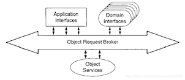

# JDK日志接口

依照JDK提供的标准(java.util.logging.Level)将日志划分为从高到低九个级别：

- OFF：主要用于JRE日志输出控制，表示不输出任何信息；
- SEVERE：严重级别程序运行事件，能够让人清晰地了解到底发生了什么事情；
- WARNING：警告，指示系统存在潜在问题的事件；
- INFO：
- CONFIG：描述可以辅助调试解决问题的静态配置信息。譬如CPU类型、操作系统类型、内存容量、系统语言等等；
- FINE：略细，输出开发人员广泛关注的信息。包括小的可恢复的故障，潜在的性能问题、数据源连接不足、服务超时等；
- FINER：较细，描述比FINE级别更详细的信息。包括进入/返回方法调用，抛出了一个异常等信息；
- FINEST：最细，描述更详细的调试信息。包括方法内调试信息，即某些日志分级系统中定义的DEBUG级别信息。
- ALL：主要用于JRE日志输出控制，表示输出所有日志信息；


# Attach机制

是一种JVM进程间通信的能力，能让一个进程传命令给另外一个进程，并让其执行内部的一些操作。

比如说为了让另外一个jvm进程把线程dump出来，启动了一个jstack的进程，然后传了个pid的参数，告诉要哪个进程进行线程dump，既然是两个进程，那肯定涉及到进程间通信，以及传输协议的定义，比如要执行什么操作，传了什么参数等。

Attach机制可以对目标进程收集很多信息，比如内存dump，线程dump，类信息统计（比如加载的类及大小以及实例个数等），动态加载agent（使用过btrace的应该不陌生），动态设置`vm flag`（但是并不是所有的flag都可以设置的，因为有些flag是在jvm启动过程中使用的，是一次性的），打印`vm flag`，获取系统属性等，这些对应的源码（AttachListener.cpp）如下。

```java
static AttachOperationFunctionInfo funcs[] = {
  { "agentProperties",  get_agent_properties },
  { "datadump",         data_dump },
  { "dumpheap",         dump_heap },
  { "load",             JvmtiExport::load_agent_library },
  { "properties",       get_system_properties },
  { "threaddump",       thread_dump },
  { "inspectheap",      heap_inspection },
  { "setflag",          set_flag },
  { "printflag",        print_flag },
  { "jcmd",             jcmd },
  { NULL,               NULL }
};
```


# javaagent

叫 Java代理、探针，是在 JDK1.5 引入的一种可以动态修改 Java 字节码的技术，是依附于java应用程序（JVM）Instrumentation API与虚拟机交互。

实际上是一种虚拟机级别的 **AOP** 机制。能实现对一些框架或是技术的采集点进行字节码修改，以实现对应用进行监控，对执行指定方法或接口添加额外操作（打印日志、打印方法执行时间、采集方法的入参和结果等）。

很多APM监控系统就是基于此实现的，例如：Arthas、SkyWalking。

**使用场景**

- 对class文件加密
- 实现应用性能监控(APM)
- JAVA程序的调试
- 热加载


## JVMTI

javaagent 是由`JVMTI`机制实现，JVM tool interface（JVMTI）是供工具使用的JVM编程接口。提供了一种检查状态和控制Java虚拟机（JVM）中运行的应用程序执行的方法。JVMTI支持需要访问JVM状态的各种工具，包括但不限于：分析、调试、监视、线程分析和覆盖率分析工具。


## 功能

- 可以在加载java文件之前进行拦截，修改字节码；
- 可以在运行期间修改已经加载的类的字节码；
- javaagent结合javassist功能更强大：可以创建类、方法、变量等；
- 获取所有已经被加载过的类；
- 获取所有已经被初始化过了的类（执行过了clinit方法，是上面的一个子集）；
- 获取某个对象的大小；
- 将某个jar加入到bootstrapclasspath里作为高优先级被bootstrapClassloader加载；
- 将某个jar加入到classpath里供AppClassload去加载；
- 设置某些native方法的前缀，主要在查找native方法的时候做规则匹配；


## 使用方式

- 在 Java 程序（带有 main 函数的 Java 类）运行时，通过 -javaagent 选项指定 jar 文件（包含 Instrumentation 代理）来启动 Instrumentation 的代理程序。

  -javaagent 选项的个数是不限的，如果指定了多个，则会按指定的先后执行，执行完各个 agent 后，才会执行主程序的 main 方法。

- 在一个普通 Java 程序（带有 main 函数的 Java 类）运行时，通过 Java Tool API 中的 attach 方式指定进程id和特定jar包地址，启动 Instrumentation 的代理程序。


## 静态启动

当在JVM启动时，来指定代理。需要实现的方法`premain()`

```java
//优先执行
public static void premain(String agentArgs, Instrumentation inst)

public static void premain(String agentArgs)
```

**实例**

```shell
$ java  -javaagent:/data/gitlab/test-demo/agent/target/agent.jar -jar example-1.0-SNAPSHOT.jar
```

创建并初始化 JPLISAgent；

监听VMInit事件，在JVM初始化完成之后做下面的事情：

- 创建InstrumentationImpl对象；

- 监听ClassFileLoadHook事件；
- 调用InstrumentationImpl的loadClassAndCallPremain方法，在这个方法里会去调用javaagent中MANIFEST.MF里指定的Premain-Class类的premain方法 ；

解析`javaagent`中`MANIFEST.MF`文件的参数，并根据这些参数来设置`JPLISAgent`里的一些内容；


## 动态启动（Attach模式）

当在JVM启动一段时间后，来指定代理。基于动态attach模式，需要实现方法 agentmain。

```JAVA
// 优先执行
// agentArgs: java agent启动指定的传入的参数，如： java -agentlib:/data/agent.jar=opt1,opt2
// inst:它提供了向现有编译的Java类添加字节码的能力
public static void agentmain(String agentArgs, Instrumentation inst);
public static void agentmain(String agentArgs)
```

需要通过VirtualMachine将加载agent的jar，插装到需要代理的JVM进程中，来实现代理操作。

```JAVA
public class AttachAgent {
  public static void main(String[] args) {
      String pid = args[0];
      String agentJar = args[1];
      VirtualMachine virtualMachine = VirtualMachine.attach(pid);
      virtualMachine.loadAgent(agentJar);
      virtualMachine.detach();
  }
}
```

启动agent命令，因为要依赖java toos.jar，需要显示指定classpath。

```SHELL
java -classpath .:$CLASS_PATH:/data/gitlab/test-demo/agent/target/agent.jar com.vhicool.demo.AttachAgent  65887 /data/gitlab/test-demo/agent/target/agent.jar
```

在resources/META-INF/MANIFREST.MF文件加入如下配置

```properties
Manifest-Version: 1.0 
Premain-Class: com.vhicoo.HelloAgent
Agent-Class: com.vhicoo.HelloAgent
Can-Redefine-Classes: true 
Can-Retransform-Classes: true 
Build-Jdk-Spec: 1.8 
Created-By: Maven Jar Plugin 3.2.0
```

参数释义

Premain-Class：包含premain方法的类名，当在JVM静态启动时指定代理时，需要此属性；

Agent-Class：包含agentmain方法的类。当在JVM动态启动时指定代理时，需要此属性；

Boot-Class-Path：引导类加载器要搜索的路径列表。路径表示目录或库（在许多平台上通常称为JAR或zip库）。在查找类的平台特定机制失败后，引导类加载器会搜索这些路径。列表中的路径由一个或多个空格分隔。路径采用层次URI的路径组件的语法。如果路径以斜杠字符（“/”）开头，则路径为绝对路径，否则路径为相对路径。根据代理JAR文件的绝对路径解析相对路径。忽略格式不正确和不存在的路径。当在VM启动后某个时间启动代理时，将忽略不表示JAR文件的路径。此属性是可选的。

Can-Redefine-Classes：重新定义此代理所需的类的能力。返回：true/false，默认false；

Can-Retransform-Classes：是否能够重新转换此代理所需的类。返回：true/false，默认false；

Can-Set-Native-Method-Prefix：是否设置此代理所需的本机方法前缀的能力。返回：true/false，默认false；

通过maven定义agent配置

```XML
<build> 
    <finalName>HelloAgent</finalName> 
    <plugins> 
        <plugin> 
            <groupId>org.apache.maven.plugins</groupId> 
            <artifactId>maven-jar-plugin</artifactId> 
            <version>3.2.0</version> 
            <configuration> 
                <archive> 
                    <!--META-INF/MANIFEST.MF --> 
                    <manifest> 
                        <addClasspath>true</addClasspath> 
                    </manifest> 
                    <manifestEntries> 
                        <Premain-Class>com.vhicoo.HelloAgent</Premain-Class> 
                        <Agent-Class>com.vhicoo.HelloAgent</Agent-Class> 
                        <Can-Redefine-Classes>true</Can-Redefine-Classes> 
                        <Can-Retransform-Classes>true</Can-Retransform-Classes> 
                    </manifestEntries> 
                </archive> 
            </configuration> 
        </plugin> 
    </plugins> 
</build>
```

在main运行之后运行的Agent（JDK1.6以后提供）；


## Instrumentation


### transformer

所有满足ClassFileTransformers的类，在初始化过程中，都会调用转换器（除了任何注册的转换器所依赖的类的定义）。转换器可以修改目标类的字节码，从而达到重新定义类功能的能力。对于已经加载的类，需要借助retransform来实现重新触发类转换

### retransform

注册的Transformer会在类初始化过程中，一个一个去将满足条件的类进行转换。retransfrom是JVM重复执行这个过程的能力。Instrumentation#retransformClasses方法只提供类，不通过类字节码，它是通过将已经注册的具有转换能力的ClassFileTransformers,提供实际字节码，来达到修改目标类的能力。使用场景是在目标类已经加载（如agent attach模式），对目标类进行修改。

### redefine

代理类可以在任何时候，通过指定目标类和类字节码，将来达到修改目标类，redefineClasses更改现有（和已加载）类的实际定义


## 卸载Agent

在javaagent不管是通过agent模式还是通过attach模式，都将本身agent代码也加载到目标JVM中。在我们不需要对目标JVM代理，想要使目标class恢复到代理之前应该如果去操作呢？首先卸载javaagent包括如下途径。当然最快的卸载agent方式是直接将目标JVM进程重启，但是这种方式对于高可用业务场景，可能会带来风险

### 卸载Transform

如果我们是通过定义Transformer来实现javaagent，那么可以使用retransform将Transformer移除，并且将被代理class恢复。

在premain或者agentmain中，注册Transformer

```java
HelloTransformer helloTransformer = new HelloTransformer();
inst.addTransformer(helloTransformer, true);
```

触发retransform使类重新加载，从而修改目标class字节码，生成新的被代理class。其中clazz变量是被代理类对象

```java
inst.retransformClasses(clazz);
```

通过removeTransformer移除已经注册的Transformer，并且再次触发retransform，使被代理class字节码还原到代理之前。其中helloTransformer必须是第一步定义的Transformer对象引用。

```java
inst.removeTransformer(helloTransformer);
inst.retransformClasses(clazz);
```

通过热部署能力实现还原目标代理类

通过redefine，直接将代码进行重新加载，达到类覆盖的目的。实现方式为`Instrumentation#redefineClasses(ClassDefinition classDefinition)`方法，通过提供的类字节码，重新定义类。这种方法不仅能够还原被代理的类，同时也能实现代理依赖的类，根据指定的类直接吗，重新加载为新的class，这样就可以实现agent.jar的热部署


## 实例

定义Agent代理类：HelloAgent

通过mainAgent代理类，实现类扩展功能，默认只能生效修改还未加载的类。但是一般我们在对程序类进行代理时，大多已经运行一段时间，处理代码已经完成加载。在这个时候，需要将已经加载的类进行替换，在attach到目标进程后，通过调用Instrumentation#redefineClasses让jvm重新加载指定类，这样就完成已加载类型字节码修改

```java
package com.vhicool.demo.agent;
import java.lang.instrument.Instrumentation;

/**
 * <p> agent代理类入口，同时支持静态、动态启动 </p>
 *
 * @author vhicool
 **/
public class HelloAgent {

	public static void premain(String agentArgs, Instrumentation inst){
		inst.addTransformer(new HelloTransformer(),true);
		System.out.println("Premain HelloAgent success");
	}
	public static void agentmain(String agentArgs, Instrumentation inst) {
		inst.addTransformer(new HelloTransformer());
    for (String clazz : HelloTransformer.INJECTED_CLASS) {
			System.out.println("Retransform classes : " + clazz);
			inst.retransformClasses(Class.forName(clazz));
		}
		System.out.println("Attach HelloAgent success");
	}
}
```

定义类转换器：Transformer，可以重新需要代理的类

```java
package com.vhicool.demo.agent;

import javassist.*;

import java.io.IOException;
import java.lang.instrument.ClassFileTransformer;
import java.lang.instrument.IllegalClassFormatException;
import java.security.ProtectionDomain;
import java.util.ArrayList;
import java.util.List;

/**
 * <p> 定义转换器，在代理的方法执行前，输出日志 </p>
 *
 * @author vhicool
 **/
public class HelloTransformer implements ClassFileTransformer {

	public static final List<String> INJECTED_CLASS = new ArrayList<String>();

	static {
    //被代理的类
		INJECTED_CLASS.add("com.vhicool.test.example.ProcessTest");
	}

	@Override
	public byte[] transform(ClassLoader loader, String className, Class<?> classBeingRedefined, ProtectionDomain protectionDomain, byte[] classfileBuffer) throws IllegalClassFormatException {
		String realClassName = className.replace("/", ".");
		try {
			if (INJECTED_CLASS.contains(realClassName)) {
				System.out.println("Agent class : " + realClassName);
				ClassPool classPool = ClassPool.getDefault();
				CtClass ctClass = classPool.get(realClassName);
				CtMethod[] declaredMethods = ctClass.getDeclaredMethods();

				for (CtMethod ctMethod : declaredMethods) {
					String method = ctMethod.getName();
					ctMethod.insertBefore(String.format("System.out.println(\"Process method :  + %s\");", method));
				}
				return ctClass.toBytecode();
			}
		} catch (NotFoundException | CannotCompileException | IOException e) {
			e.printStackTrace();
		}
		return classfileBuffer;
	}

}
```

定义Agent注入入口（动态启动，静态启动不需要定义此类）

```java
package com.vhicool.demo;

import com.sun.tools.attach.AgentInitializationException;
import com.sun.tools.attach.AgentLoadException;
import com.sun.tools.attach.AttachNotSupportedException;
import com.sun.tools.attach.VirtualMachine;

import java.io.IOException;

/**
 * <p> 这个类是将代理程序插入到目标代理程序进程 </p>
 *
 * @author vhicool
 * @date 2023/1/16
 * @since 1.0.0
 **/
public class AttachAgent {

	public static void main(String[] args) throws IOException, AttachNotSupportedException, AgentLoadException, AgentInitializationException {
		String pid = args[0];
		String jvmJar = args.length > 1 ? args[1] : System.getProperty("user.dir") + "/agent.jar";
		System.out.println("Agent :" + jvmJar + " ,attach Pid :" + pid);
		VirtualMachine virtualMachine = VirtualMachine.attach(pid);
		virtualMachine.loadAgent(jvmJar);
		virtualMachine.detach();
	}
}
```

pom依赖

`javassist`是一个用来处理 Java 字节码的类库，可以在一个已经编译好的类中添加新的方法，或者是修改已有的方法。

`maven-shade-plugin` 会将项目依赖打到jar中

```xml
    <dependencies>
        <dependency>
            <groupId>org.javassist</groupId>
            <artifactId>javassist</artifactId>
            <version>3.28.0-GA</version>
        </dependency>
        <dependency>
            <groupId>jdk.tools</groupId>
            <artifactId>jdk.tools</artifactId>
            <version>1.8</version>
            <scope>system</scope>
            <systemPath>${env.JAVA_HOME}/lib/tools.jar</systemPath>
        </dependency>
    </dependencies>
    <build>
        <plugins>
            <plugin>
                <groupId>org.apache.maven.plugins</groupId>
                <artifactId>maven-compiler-plugin</artifactId>
                <version>3.5.1</version>
                <configuration>
                    <source>8</source>
                    <target>8</target>
                </configuration>
            </plugin>
            <plugin>
                <groupId>org.apache.maven.plugins</groupId>
                <artifactId>maven-jar-plugin</artifactId>
                <version>3.2.0</version>
                <configuration>
                    <archive>
                        <!--META-INF/MANIFEST.MF -->
                        <manifest>
                            <addClasspath>true</addClasspath>
                        </manifest>
                        <manifestEntries>
                            <Agent-Class>com.vhicool.demo.agent.HelloAgent</Agent-Class>
                            <Premain-Class>com.vhicool.demo.agent.HelloAgent</Premain-Class>
                            <Can-Redefine-Classes>true</Can-Redefine-Classes>
                            <Can-Retransform-Classes>true</Can-Retransform-Classes>
                        </manifestEntries>
                    </archive>
                </configuration>
            </plugin>
            <plugin>
                <groupId>org.apache.maven.plugins</groupId>
                <artifactId>maven-shade-plugin</artifactId>
                <executions>
                    <execution>
                        <phase>package</phase>
                        <goals>
                            <goal>shade</goal>
                        </goals>
                        <configuration combine.self="override">
                            <createDependencyReducedPom>false</createDependencyReducedPom>
                            <shadedArtifactAttached>false</shadedArtifactAttached>
                            <finalName>agent</finalName>
                            <transformers>
                                <transformer
                                    <resource>reference.conf</resource>
                                </transformer>
                                <transformer implementation="org.apache.maven.plugins.shade.resource.ServicesResourceTransformer"/>
                                <transformer implementation="org.apache.maven.plugins.shade.resource.ApacheNoticeResourceTransformer">
                                    <projectName>agent</projectName>
                                    <encoding>UTF-8</encoding>
                                </transformer>
                            </transformers>
                        </configuration>
                    </execution>
                </executions>
            </plugin>
        </plugins>
    </build>
```

被注入程序

```java
package com.vhicool.test.example;

/**
 *
 * @author vhicool
 **/
public class HelloMain {
	public static void main(String[] args) throws InterruptedException {
		ProcessTest helloMain = new ProcessTest();
		for (int i = 0; ; i++) {
			helloMain.process(i + "");
			Thread.sleep(1000);
		}
	}
}

public class ProcessTest {
	public void process(String s) {
		System.out.println("输出 ：" + s);
	}
}
```

### 静态启动

javaagent（静态启动方式）

静态启动是随着java主程序一起启动，伴随jvm的生命周期

```shell
java  -javaagent:/data/gitlab/test-demo/agent/target/agent.jar -jar example-1.0-SNAPSHOT.jar
```

输出：

```properties
Process method :  + process
输出 ：0
Process method :  + process
输出 ：1
Process method :  + process
输出 ：2
```


### 动态启动

启动主程序，此时程序正常输出结果

```shell
java -jar example.jar
```

其中需要先查看`example.jar` 的 pid。com.vhicool.demo.AttachAgent是启动程序，agent.jar 是代理程序

```SHELL
java -classpath .:$CLASS_PATH:/data/gitlab/test-demo/agent/target/agent.jar com.vhicool.demo.AttachAgent  57092 /data/gitlab/test-demo/agent/target/agent.jar
```

输出:

```properties
输出 ：39
Transform classes : com.vhicool.test.example.ProcessTest
Agent class : com.vhicool.test.example.ProcessTest
Attach HelloAgent success
Process method :  + process
输出 ：40
Process method :  + process
输出 ：41
```


# LDAP协议

轻型目录访问协议（Lightweight Directory Access Protocol）是一个开放、中立、工业标准的应用软件协议。

通过IP协议提供访问控制和维护分布式信息的目录信息；

LDAP由互联网工程任务组（IETF）的文档RFC定义，使用了描述语言ASN.1定义。最新的版本是版本3，由RFC 4511所定义；

LDAP基于X.500标准的子集。因为这个关系，LDAP有时被称为X.500-lite；

？？？


# CORBA技术

- 基本概念

  CORBA，断句成C-ORB-A，译为通用对象请求代理结构。CORBA是较早的中间件技术，作为对象总线的功能体现在ORB一词中；

  

  CORBA的底层结构是基于面向对象模型的，由OMG接口描述语言(OMG Interface Definition Language，OMG IDL)、对象请求代理(Objec tRequest Broker，ORB)和IIOP标准协议（Internet Inter­ ORB Protocol，也称网络ORB交换协议）3个关键模块组成。

- IDL

  接口定义语言（IDL）用来定义CORBA对象使用的、应用组件之间的接口。它不是过程语言，它只能定义接口，而不是去实现某个接口。

  IDL独立于任何编程语言，用IDL编译器可以将它映射为其它常用的语言，如C++,C,JAVA,COBOL等等。

  IDL框架主要包括四种元素：1）模块 2）接口 3）操作 4）数据类型；

- ORB

  对象请求代理（ORB），它是CORBA的基础，是分布环境下，CORBA应用使用的、基于对象模型的软件。它的基本职责是解决对象引用的请求和建立应用对象之间的联结，

  通过标准接口，使这种联结独立于所使用的硬件和软件的平台，从而保证了对平台的透明性以及对操作系统、网络协议和编程语言的透明性。

  ORB的核心作用：

  - 第一步
    - 当客户激活一个调用操作时，操作中指出的目标对象的对象引用经码根传递ORB核心。ORB核心代表客户自动寻找对应的服务器；
    - 找到服务器后，ORB要确保该服务器做好接受请求的准备工作；
  - 第二步
    - 客户端的ORB核心接受被调用操作的参数，并将它组码为网络可接收的格式；
    - 服务端的ORB核心将来自网络的操作参数进行解组，然后送给服务器，并启动服务器执行所调用的操作；
  - 第三步
    - 执行操作后，如有返回参数，ORB核心将它组码后传入网络。客户端ORB核心对它进行解码，并将操作结果返回客户；

- IIOP

  GIOP：General Inter ORB Protocol,通用ORB间协议，是一类抽象的协议，指定了转换语法和消息格式的标准集，运行独立开发的ORB可以在任何一个面向连接的传递中进行通信；

  GIOP包括三个要素：编码方式，消息格式，对底层网络传输的要求；

  IIOP：Internet Inter-ORB Protocol,因特网ORB间协议，指定GIOP如何在TCP/IP上实现；

？？？


# JSSE

[Java安全套接字扩展](https://blog.csdn.net/cusi77914/article/details/107111684/)

英文 Java Secure Sockets Extension，支持安全的 Internet通信。提供了TLS和DTLS协议的一个框架和 Java版本的实现，包括数据加密、服务器认证、消息完整性、和客户端认证功能；

JSSE支持下列安全协议：

- DTLS：1.0和1.2版本
- TLS：1.0、1.1、1.2和1.3版本
- SSL：3.0版本


# JAAS

Java身份验证和授权服务


# JGSS

Java通用安全服务


# CertPath API

[Java认证路径API](https://blog.csdn.net/cusi77914/article/details/107111684/)


# 数据访问技术实现

| 数据访问技术 | 实现                         |
| ------------ | ---------------------------- |
| JDBC         | DataSourceTransactionManager |
| JPA          | JpaTransactionManager        |
| Hibernate    | Hibernate TransactionManager |
| JDO          | JdoTransactionManager        |
| 分布式事务   | JtaTransactionManager        |

