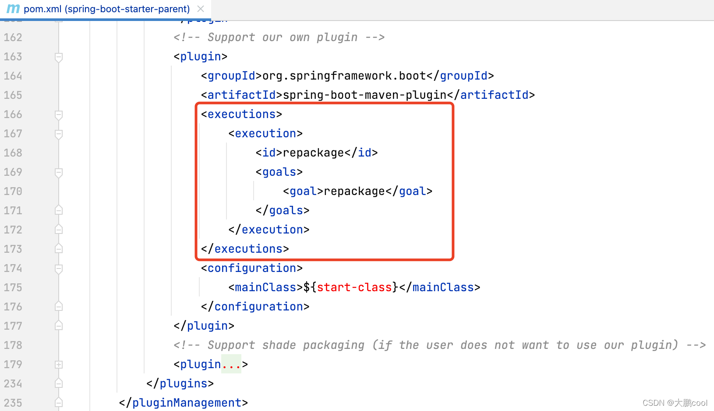

# 简介

SpringBoot 是 Spring 技术栈的快速开发脚手架，通过约定大于配置，优化了混乱的依赖管理，和复杂的配置，简化了WEB程序开发，它也是SpringCloud构建微服务分布式系统的基础设施。

约定优于配置思想：配置基本都可以走默认值。配置基本都是SpringBoot自动完成。

[SpringBoot官网]:https://spring.io/projects/spring-boot/
[SpringBoot中文社区]:https://springboot.io


# 版本

| 版本          | 说明                                                         |
| ------------- | ------------------------------------------------------------ |
| SpringBoot1.x | 配置的拦截器对静态资源是默认放行的                           |
| SpringBoot2.0 | 基于Spring5 和 JDK8 <br/>配置变更，参数名等 <br/>插件版本有变化 <br/>配置中的中文可以直接读取，不用转码 <br/>Actuator有变化 <br/>CacheManager 有变化 <br>对静态资源也会拦截，必须排除静态资源的请求路径。<br>WebMvcConfigurerAdapter抽象类已经过时。直接继承WebMvcConfigurer 接口然后实现他的default方法即可。<br>WebMvcConfigurerAdapter 可以用 WebMvcConfigurationSupport 替代，但是不推荐使用WebMvcConfigurationSupport这个类会全面接管对 SpringMVC 的配置。即SpringBoot对SpringMVC的自动配置全部失效，只使用用户对SpringMVC的配置。<br> |
| SpringBoot2.1 | 支持Java11并且兼容Java8<br>优化应用程序启动速度，启动时占用的内存更少<br>在Spring Data JPA中设置spring.data. JPA . repositori.bootstrap .bootstrap-mode=deferred时，Hibernate将在单独的线程启动，而应用程序的其余组件将会并行启动<br>提供了应用程序缓存管理信息<br>提供Spring集成组件的图表信息 |
| SpringBoot2.2 | 支持 Java 13，同时仍与 Java 11 和 8 兼容 <br>Spring Boot 2.2.0 的性能获得了很大的提升，应用程序启动速度更快，并且消耗的内存更少<br>现在可以通过 spring.main.lazy-initialization 属性启用全局延迟初始化，以减少启动时间。但是在进行任何延迟的初始化时，HTTP 请求的处理可能需要更长的时间；通常在启动时会发生的故障时启用。<br>配置属性现在支持基于构造函数的绑定，该绑定使 @ConfigurationProperties 注释的类不可变。<br>可以通过使用 @ConstructorBinding 注释 @ConfigurationProperties 类或其构造函数之一来启用基于构造函数的绑定。可以在配置属性绑定提供的构造函数参数上使用 @DefaultValue 和 @DateTimeFormat 之类的注释。 |
| SpringBoot2.3 | 可以优雅停机<br>分成 jar 包 <br>需要手动添加 spring-boot-starter-validation 启动器（因为校验包被独立成了一个`starter`组件，而`2.3`之前版本只需要引入 web 依赖就可以了。）<br>添加了对 Java 14 的支持。也支持 Java 8 和 11。<br>Native Elasticsearch transport 已被删除，默认使用Elasticsearch 7.5+。<br>升级到到 mongodb4 <br>Spring Data JDBC 2.0 现在默认引用标识符 <br>升级到 jackson2.11，主要是date格式变更 <br>添加了部分功能用来帮助将 Spring Boot 应用直接打包到 Docker 镜像。<br>支持配置文件的通配符位置 <br>镜像打包分层 Jar<br>R2DBC 支持<br>Web 应用程序中的日期时间转换<br>Spring Cloud 连接器启动器已被删除<br>活力和准备情况探针<br>依赖升级 |
| SpringBoot2.4 | 支持Java 15。支持的最低版本仍然是 Java 8。<br>版本控制方案更改<br>解除默认加载 bootstratp 配置文件<br>配置数据项迁移指南<br>配置文件属性获取新增 @Name <br>移除了 JUnit 5’s Vintage 引擎 <br>回滚配置属性<br>默认 Servlet 注册<br>默认情况下，HTTP 跟踪不再包含 cookie 标头<br>Docker 支持升级<br>Redis Cache Metrics<br>R2DBC<br>新增启动端点<br>新增起源链（Origin Chains）<br>依赖升级 |
| SpringBoot2.5 | Java 16 进行了测试。Spring Boot 2.5 仍然与 Java 8 兼容。<br>最低要求变更<br>Spring Data JPA<br>Spring Data Solr<br>环境变量前缀<br>基于 TCP 的 HTTP/2 (h2c)<br>War 分层<br>MongoDB 指标<br>Groovy 3<br>Hibernate Validator 6.2<br>Jetty 10 Support<br>使用 R2DBC 初始化数据库<br>Docker 镜像构建支持<br>依赖升级 |
| SpringBoot2.6 | 默认禁止的循环引用 <br>端点新增运行时 Java 信息<br>默认禁用执行器环境信息<br>Redis 连接池<br>启动信息新增指标<br>磁盘空间指标<br>SpringMVC 默认路径匹配策略<br>构建信息个性化<br>移除 2.4 中的属性<br>支持配置 Cookie SameSite <br>网络资源配置<br>支持自定义脱敏规则<br>Elasticsearch 属性整合<br>Docker 镜像构建支持<br>依赖升级 |
| SpringBoot2.7 | 新的 @AutoConfiguration 注解 <br>自动配置注册<br>OkHttp 4<br>Flyway<br>spring.mongodb.embedded.features配置属性已删除<br>MongoDB 属性优先级<br>对 Elasticsearch 的 RestHighLevelClient 的支持已弃用<br>R2DBC 驱动程序更改<br>支持 RabbitStreamTemplate<br>@SpringBootTest 属性源优先级<br>Docker 镜像构建<br>依赖升级 |
| SpringBoot3.0 | 支持Spring Framework 6.0 <br/>最低Java 17，兼容Java 19 <br/>支持使用 GraalVM 生成本机映像，取代实验性的Spring Native 项目<br/> 改进监控功能 Micrometer 和 Micrometer Tracing <br/> 最低 Java EE 9 和 Jakarta EE 10 <br/> 依赖从 Java EE 迁移到 Jakarta EE API <br/> Graal 22.3 和 Native Build Tools Plugin 0.9.17 以上版本<br/> TomCat 10 |


# 优缺点

| 优点                                             | 缺点                                 |
| ------------------------------------------------ | ------------------------------------ |
| 快速创建独立Spring应用，极大提高了开发和部署效率 | 人称版本帝，迭代快，需要时刻关注变化 |
| 内嵌web服务器                                    | 封装太深，内部原理复杂，不容易精通   |
| 自动starter依赖，简化构建配置                    |                                      |
| 自动配置Spring以及第三方框架功能                 |                                      |
| 提供生产级别的应用监控、健康检查及外部化配置     |                                      |
| 无代码生成、无需编写XML                          |                                      |
| 项目可独立运行，无需外置容器                     |                                      |
| 与云计算、微服务天然集成                         |                                      |


# 特点

| 特点     | 说明                                                         |
| -------- | ------------------------------------------------------------ |
| 起步依赖 | 父项目做依赖管理<br/>开发引入 starter 场景启动器<br/>无需关注版本号，自动版本仲裁<br/>可以修改版本号 |
| 自动配置 | 自动配好Tomcat<br/>自动配好SpringMVC（不需要我们在xml中配置。 <br>比如配置前端控制器DispatcherServlet、配置视图解析器、配置静态资源访问、处理器映射器、处理器适配器等一系列组件） <br/>自动配好web常见功能，如：字符编码问题 <br/>默认的包结构 <br/>各种配置拥有默认值 <br/>按需加载所有自动配置项<br/>... |


# 场景启动器

在SpringBoot 中，官方提供的场景启动器都遵循类似的命名规则：`spring-boot-starter-*` ，非官方的场景启动器命名规则：`*-spring-boot-starter`。

例如，如果要使用Spring和JPA进行数据库访问，则需要在我们的 pom.xml 文件中添加 spring-boot-starter-data-jpa 依赖项。

在 org.springframework.boot 组下提供了以下启动器。

| 启动器名称                             | 说明                                                         |
| -------------------------------------- | ------------------------------------------------------------ |
| spring-boot-starter-thymeleaf          | 它用于使用Thymeleaf视图构建MVC Web应用程序。                 |
| spring-boot-starter-data-couchbase     | 它用于Couchbase面向文档的数据库和Spring Data Couchbase。     |
| spring-boot-starter-artemis            | 它用于使用Apache Artemis进行JMS消息传递。                    |
| spring-boot-starter-web-services       | 它用于Spring Web Services。                                  |
| spring-boot-starter-mail               | 它用于支持Java Mail和Spring Framework的电子邮件发送。        |
| spring-boot-starter-data-redis         | 用于Spring Data Redis和Jedis客户端的Redis键值数据存储。      |
| spring-boot-starter-web                | 它用于构建Web应用程序，包括使用Spring MVC的RESTful应用程序。它使用Tomcat作为默认的嵌入式容器。 |
| spring-boot-starter-data-gemfire       | 它用于GemFire分布式数据存储和Spring Data GemFire。           |
| spring-boot-starter-activemq           | 它用于使用Apache ActiveMQ的JMS消息传递中。                   |
| spring-boot-starter-data-elasticsearch | 它用于Elasticsearch搜索和分析引擎以及Spring Data Elasticsearch。 |
| spring-boot-starter-integration        | 它用于Spring集成。                                           |
| spring-boot-starter-test               | 它用于测试带有JUnit，Hamcrest和Mockito等库的Spring Boot应用程序。 |
| spring-boot-starter-jdbc               | 它用于具有Tomcat JDBC连接池的JDBC。                          |
| spring-boot-starter-mobile             | 它用于使用Spring Mobile构建Web应用程序。                     |
| spring-boot-starter-validation         | 它用于通过Hibernate Validator进行Java Bean验证。             |
| spring-boot-starter-hateoas            | 它用于通过Spring MVC和Spring HATEOAS构建基于超媒体的RESTful Web应用程序。 |
| spring-boot-starter-jersey             | 它用于使用JAX-RS和Jersey构建RESTful Web应用程序。代替spring-boot-starter-web。 |
| spring-boot-starter-data-neo4j         | 用于Neo4j图形数据库和Spring Data Neo4j。                     |
| spring-boot-starter-data-ldap          | 它用于Spring Data LDAP。                                     |
| spring-boot-starter-websocket          | 它用于构建WebSocket应用程序。它使用Spring Framework的WebSocket支持。 |
| spring-boot-starter-aop                | 它用于使用Spring AOP和AspectJ进行面向方面的编程。            |
| spring-boot-starter-amqp               | 它用于Spring AMQP和Rabbit MQ。                               |
| spring-boot-starter-data-cassandra     | 用于Cassandra分布式数据库和Spring Data Cassandra。           |
| spring-boot-starter-social-facebook    | 它用于Spring Social Facebook。                               |
| spring-boot-starter-jta-atomikos       | 它用于使用Atomikos进行JTA交易。                              |
| spring-boot-starter-security           | 它用于Spring Security。                                      |
| spring-boot-starter-mustache           | 它用于使用Mustache视图构建MVC Web应用程序。                  |
| spring-boot-starter-data-jpa           | 它用于带有Hibernate的Spring Data JPA。                       |
| spring-boot-starter                    | 它用于核心启动器，包括自动配置支持，日志记录和YAML。         |
| spring-boot-starter-groovy-templates   | 它用于使用Groovy模板视图构建MVC Web应用程序。                |
| spring-boot-starter-freemarker         | 它用于使用FreeMarker视图构建MVC Web应用程序。                |
| spring-boot-starter-batch              | 它用于Spring Batch。                                         |
| spring-boot-starter-social-linkedin    | 它用于Spring Social LinkedIn。                               |
| spring-boot-starter-cache              | 它用于Spring框架的缓存支持。                                 |
| spring-boot-starter-data-solr          | 它用于带有Spring Data Solr的Apache Solr搜索平台。            |
| spring-boot-starter-data-mongodb       | 它用于MongoDB面向文档的数据库和Spring Data MongoDB。         |
| spring-boot-starter-jooq               | 它用于jOOQ访问SQL数据库。代替spring-boot-starter-data-jpa或spring-boot-starter-jdbc。 |
| spring-boot-starter-jta-narayana       | 它用于Spring Boot Narayana JTA Starter。                     |
| spring-boot-starter-cloud-connectors   | 用于Spring Cloud Connector，可简化与Cloud Foundry和Heroku等云平台中服务的连接。 |
| spring-boot-starter-jta-bitronix       | 它用于使用Bitronix的JTA交易。                                |
| spring-boot-starter-social-twitter     | 它用于Spring Social Twitter。                                |
| spring-boot-starter-data-rest          | 它用于使用Spring Data REST在REST上公开Spring Data存储库。    |


## 生产入门版

| 名称                             | 说明                                                         |
| -------------------------------- | ------------------------------------------------------------ |
| spring-boot-starter-actuator     | 它用于Spring Boot的Actuator，提供了生产就绪功能，可帮助您监视和管理应用程序。 |
| spring-boot-starter-remote-shell | 它用于CRaSH远程shell通过SSH监视和管理您的应用程序。从1.5开始不推荐使用。 |


## 技术入门版

| 名称                         | 说明                                                         |
| ---------------------------- | ------------------------------------------------------------ |
| spring-boot-starter-undertow | 用于Undertow，作为嵌入式servlet容器。代替spring-boot-starter-tomcat。 |
| spring-boot-starter-jetty    | 它用于Jetty作为嵌入式servlet容器。代替spring-boot-starter-tomcat。 |
| spring-boot-starter-logging  | 它用于使用Logback进行日志记录。默认的日志启动器。            |
| spring-boot-starter-tomcat   | 它用于Tomcat，作为嵌入式servlet容器。 spring-boot-starter-web使用的默认servlet容器启动器。 |
| spring-boot-starter-log4j2   | 用于Log4j2进行日志记录。代替spring-boot-starter-logging。    |


## spring-boot-starter-parent


### 简介

是一个特殊的 starter，其内置了许多springboot默认的maven依赖。使用spring-boot-starter-parent后，可以省去version标签，方便维护统一的版本，同时为应用程序提供了默认配置，可以在自己工程中引入如下配置：

```xml
<parent>
  <groupId>org.springframework.boot</groupId>
  <artifactId>spring-boot-starter-parent</artifactId>
  <version>1.4.0.RELEASE</version>
</parent>
```


### 环境配置

`spring-boot-starter-parent` 添加了一些默认的配置，如：

- 指定了使用的 JDK 版本号为 1.8；
- 编译时使用 UTF-8 编码方式；
- Maven 资源过滤使用 @ 作为占位符；

```xml
<properties>
  <java.version>1.8</java.version>
  <resource.delimiter>@</resource.delimiter> 
  <project.build.sourceEncoding>UTF-8</project.build.sourceEncoding>
  <project.reporting.outputEncoding>UTF-8</project.reporting.outputEncoding>
  <maven.compiler.source>${java.version}</maven.compiler.source>
  <maven.compiler.target>${java.version}</maven.compiler.target>
</properties>
```


### 资源过滤

`spring-boot-starter-parent` 指定了编译资源文件时将 `**/application*.properties`、`**/application*.yml` 和 `**/application*.yaml` 中的 maven 占位符替换为具体的属性值，具体如下。如果没有引入 `spring-boot-starter-parent`，需要在 `application.properties` 文件中使用 `maven` 占位符时切记要手动配置 `resource`

```xml
<resource>
	<directory>${basedir}/src/main/resources</directory>
	<filtering>true</filtering>
	<includes>
		<include>**/application*.yml</include>
        <include>**/application*.yaml</include>
        <include>**/application*.properties</include>
	</includes>
</resource>
```


### 插件管理

spring -boot-starter-parent 指定了许多插件的默认配置，包括 maven-failsafe-plugin，maven-jar-plugin ，maven-surefire-plugin。

```xml
<plugin>
  <groupId>org.apache.maven.plugins</groupId>
  <artifactId>maven-failsafe-plugin</artifactId>
  <executions>
    <execution>
      <goals>
        <goal>integration-test</goal>
        <goal>verify</goal>
      </goals>
    </execution>
  </executions>
</plugin>
<plugin>
    <groupId>org.apache.maven.plugins</groupId>
    <artifactId>maven-jar-plugin</artifactId>
    <configuration>
      <archive>
      <manifest>
        <mainClass>${start-class}</mainClass> 
        <addDefaultImplementationEntries>true</addDefaultImplementationEntries>
      </manifest>
      </archive>
    </configuration>
</plugin>
<plugin>
    <groupId>org.apache.maven.plugins</groupId>
    <artifactId>maven-surefire-plugin</artifactId>
    <configuration>
    <includes>
      <include>**/*Tests.java</include>
      <include>**/*Test.java</include>
    </includes>
    <excludes>
    	<exclude>**/Abstract*.java</exclude>
    </excludes>
  	</configuration>
</plugin>
```

`spring-boot-maven-plugin` 插件 `repackage` 属性默认绑定 maven 声明周期中的 package 阶段，这样当打包后这个插件就会进一步将所有依赖的 jar 包以及当前项目的代码打包到一个 jar 包中，从而支持使用 `java -jar xxx.jar` 方式启动项目。



由于 maven 只支持单继承，如果自己的项目没有继承 spring-boot-starter-parent，则只能用 dependencyManagement 来获取SpringBoot的依赖树：

```xml
<dependencyManagement>
  <dependencies>
    <dependency>
      <groupId>org.springframework.boot</groupId>
      <artifactId>spring-boot-dependencies</artifactId>
      <version>2.2.7.RELEASE</version>
      <type>pom</type>
      <scope>import</scope>
    </dependency>
  </dependencies>
</dependencyManagement>
```


### 版本仲裁

因为 spring-boot-starter-parent 依赖了 spring-boot-dependencies，最后由 spring-boot-dependencies 统一实现版本管理，这就是SpringBoot的版本仲裁中心，如果版本仲裁中心中没有配置依赖的版本号，我们就需要手动配置。

```xml
<parent>
		<groupId>org.springframework.boot</groupId>
		<artifactId>spring-boot-dependencies</artifactId>
		<version>1.5.10.RELEASE</version>
		<relativePath>../../spring-boot-dependencies</relativePath>
</parent> 
```

所有的版本依赖列表：[Dependency versions Appendix](https://docs.spring.io/spring-boot/docs/2.6.7/reference/htmlsingle/#dependency-versions-properties)

下面是 spring-boot-dependencies 中版本仲裁中心：

```xml
<properties>
		<!-- Dependency versions -->
		<activemq.version>5.14.5</activemq.version>
		<antlr2.version>2.7.7</antlr2.version>
		<appengine-sdk.version>1.9.60</appengine-sdk.version>
		<artemis.version>1.5.5</artemis.version>
		<aspectj.version>1.8.13</aspectj.version>
		<assertj.version>2.6.0</assertj.version>
		<atomikos.version>3.9.3</atomikos.version>
		<bitronix.version>2.1.4</bitronix.version>
		<caffeine.version>2.3.5</caffeine.version>
		<cassandra-driver.version>3.1.4</cassandra-driver.version>
		<classmate.version>1.3.4</classmate.version>
		<commons-beanutils.version>1.9.3</commons-beanutils.version>
		<commons-collections.version>3.2.2</commons-collections.version>
		<commons-codec.version>1.10</commons-codec.version>
		<commons-dbcp.version>1.4</commons-dbcp.version>
		<commons-dbcp2.version>2.1.1</commons-dbcp2.version>
		<commons-digester.version>2.1</commons-digester.version>
		<commons-pool.version>1.6</commons-pool.version>
		<commons-pool2.version>2.4.3</commons-pool2.version>
		<couchbase-client.version>2.3.7</couchbase-client.version>
		<couchbase-cache-client.version>2.1.0</couchbase-cache-client.version>
		<crashub.version>1.3.2</crashub.version>
		<derby.version>10.13.1.1</derby.version>
		<dom4j.version>1.6.1</dom4j.version>
		<dropwizard-metrics.version>3.1.5</dropwizard-metrics.version>
		<ehcache.version>2.10.4</ehcache.version>
		<ehcache3.version>3.2.3</ehcache3.version>
		<embedded-mongo.version>1.50.5</embedded-mongo.version>
		<flyway.version>3.2.1</flyway.version>
		<freemarker.version>2.3.27-incubating</freemarker.version>
		<elasticsearch.version>2.4.6</elasticsearch.version>
		<gemfire.version>8.2.8</gemfire.version>
		<glassfish-el.version>3.0.0</glassfish-el.version>
		<gradle.version>2.9</gradle.version>
		<groovy.version>2.4.13</groovy.version>
		<gson.version>2.8.2</gson.version>
		<h2.version>1.4.196</h2.version>
		<hamcrest.version>1.3</hamcrest.version>
		<hazelcast.version>3.7.8</hazelcast.version>
		<hazelcast-hibernate4.version>3.7.1</hazelcast-hibernate4.version>
		<hazelcast-hibernate5.version>1.1.3</hazelcast-hibernate5.version>
		<hibernate.version>5.0.12.Final</hibernate.version>
		<hibernate-validator.version>5.3.6.Final</hibernate-validator.version>
		<hikaricp.version>2.5.1</hikaricp.version>
		<hikaricp-java6.version>2.3.13</hikaricp-java6.version>
		<hikaricp-java7.version>2.4.13</hikaricp-java7.version>
		<hsqldb.version>2.3.5</hsqldb.version>
		<htmlunit.version>2.21</htmlunit.version>
		<httpasyncclient.version>4.1.3</httpasyncclient.version>
		<httpclient.version>4.5.5</httpclient.version>
		<httpcore.version>4.4.9</httpcore.version>
		<infinispan.version>8.2.8.Final</infinispan.version>
		<jackson.version>2.8.10</jackson.version>
		<janino.version>2.7.8</janino.version>
		<javassist.version>3.21.0-GA</javassist.version> <!-- Same as Hibernate -->
		<javax-cache.version>1.0.0</javax-cache.version>
		<javax-mail.version>1.5.6</javax-mail.version>
		<javax-transaction.version>1.2</javax-transaction.version>
		<javax-validation.version>1.1.0.Final</javax-validation.version>
		<jaxen.version>1.1.6</jaxen.version>
		<jaybird.version>2.2.14</jaybird.version>
		<jboss-logging.version>3.3.1.Final</jboss-logging.version>
		<jboss-transaction-spi.version>7.6.0.Final</jboss-transaction-spi.version>
		<jdom2.version>2.0.6</jdom2.version>
		<jedis.version>2.9.0</jedis.version>
		<jersey.version>2.25.1</jersey.version>
		<jest.version>2.0.4</jest.version>
		<jetty.version>9.4.8.v20171121</jetty.version>
		<jetty-jsp.version>2.2.0.v201112011158</jetty-jsp.version>
		<jetty-el.version>8.0.33</jetty-el.version>
		<jms-api.version>1.1-rev-1</jms-api.version>
		<jmustache.version>1.13</jmustache.version>
		<jna.version>4.2.2</jna.version>
		<joda-time.version>2.9.9</joda-time.version>
		<jolokia.version>1.3.7</jolokia.version>
		<jooq.version>3.9.6</jooq.version>
		<json.version>20140107</json.version>
		<jsonassert.version>1.4.0</jsonassert.version>
		<json-path.version>2.2.0</json-path.version>
		<jstl.version>1.2</jstl.version>
		<jtds.version>1.3.1</jtds.version>
		<junit.version>4.12</junit.version>
		<liquibase.version>3.5.3</liquibase.version>
		<log4j2.version>2.7</log4j2.version>
		<logback.version>1.1.11</logback.version>
		<lombok.version>1.16.20</lombok.version>
		<mariadb.version>1.5.9</mariadb.version>
		<mssql-jdbc.version>6.1.0.jre7</mssql-jdbc.version>
		<mockito.version>1.10.19</mockito.version>
		<mongodb.version>3.4.3</mongodb.version>
		<mysql.version>5.1.45</mysql.version>
		<narayana.version>5.5.31.Final</narayana.version>
		<nekohtml.version>1.9.22</nekohtml.version>
		<neo4j-ogm.version>2.1.6</neo4j-ogm.version>
		<postgresql.version>9.4.1212.jre7</postgresql.version>
		<querydsl.version>4.1.4</querydsl.version>
		<reactor.version>2.0.8.RELEASE</reactor.version>
		<reactor-spring.version>2.0.7.RELEASE</reactor-spring.version>
		<selenium.version>2.53.1</selenium.version>
		<selenium-htmlunit.version>2.21</selenium-htmlunit.version>
		<sendgrid.version>2.2.2</sendgrid.version>
		<servlet-api.version>3.1.0</servlet-api.version>
		<simple-json.version>1.1.1</simple-json.version>
		<slf4j.version>1.7.25</slf4j.version>
		<snakeyaml.version>1.17</snakeyaml.version>
		<solr.version>5.5.5</solr.version>
		<spock.version>1.0-groovy-2.4</spock.version>
		<spring.version>4.3.14.RELEASE</spring.version>
		<spring-amqp.version>1.7.6.RELEASE</spring-amqp.version>
		<spring-cloud-connectors.version>1.2.5.RELEASE</spring-cloud-connectors.version>
		<spring-batch.version>3.0.8.RELEASE</spring-batch.version>
		<spring-data-releasetrain.version>Ingalls-SR10</spring-data-releasetrain.version>
		<spring-hateoas.version>0.23.0.RELEASE</spring-hateoas.version>
		<spring-integration.version>4.3.14.RELEASE</spring-integration.version>
		<spring-integration-java-dsl.version>1.2.3.RELEASE</spring-integration-java-dsl.version>
		<spring-kafka.version>1.1.7.RELEASE</spring-kafka.version>
		<spring-ldap.version>2.3.2.RELEASE</spring-ldap.version>
		<spring-loaded.version>1.2.8.RELEASE</spring-loaded.version>
		<spring-mobile.version>1.1.5.RELEASE</spring-mobile.version>
		<spring-plugin.version>1.2.0.RELEASE</spring-plugin.version>
		<spring-restdocs.version>1.1.3.RELEASE</spring-restdocs.version>
		<spring-retry.version>1.2.2.RELEASE</spring-retry.version>
		<spring-security.version>4.2.4.RELEASE</spring-security.version>
		<spring-security-jwt.version>1.0.9.RELEASE</spring-security-jwt.version>
		<spring-security-oauth.version>2.0.14.RELEASE</spring-security-oauth.version>
		<spring-session.version>1.3.1.RELEASE</spring-session.version>
		<spring-social.version>1.1.4.RELEASE</spring-social.version>
		<spring-social-facebook.version>2.0.3.RELEASE</spring-social-facebook.version>
		<spring-social-linkedin.version>1.0.2.RELEASE</spring-social-linkedin.version>
		<spring-social-twitter.version>1.1.2.RELEASE</spring-social-twitter.version>
		<spring-ws.version>2.4.2.RELEASE</spring-ws.version>
		<sqlite-jdbc.version>3.15.1</sqlite-jdbc.version>
		<statsd-client.version>3.1.0</statsd-client.version>
		<sun-mail.version>${javax-mail.version}</sun-mail.version>
		<thymeleaf.version>2.1.6.RELEASE</thymeleaf.version>
		<thymeleaf-extras-springsecurity4.version>2.1.3.RELEASE</thymeleaf-extras-springsecurity4.version>
		<thymeleaf-extras-conditionalcomments.version>2.1.2.RELEASE</thymeleaf-extras-conditionalcomments.version>
		<thymeleaf-layout-dialect.version>1.4.0</thymeleaf-layout-dialect.version>
		<thymeleaf-extras-data-attribute.version>1.3</thymeleaf-extras-data-attribute.version>
		<thymeleaf-extras-java8time.version>2.1.0.RELEASE</thymeleaf-extras-java8time.version>
		<tomcat.version>8.5.27</tomcat.version>
		<undertow.version>1.4.22.Final</undertow.version>
		<unboundid-ldapsdk.version>3.2.1</unboundid-ldapsdk.version>
		<webjars-hal-browser.version>9f96c74</webjars-hal-browser.version>
		<webjars-locator.version>0.32-1</webjars-locator.version>
		<wsdl4j.version>1.6.3</wsdl4j.version>
		<xml-apis.version>1.4.01</xml-apis.version>
		<!-- Plugin versions -->
		<build-helper-maven-plugin.version>1.10</build-helper-maven-plugin.version>
		<exec-maven-plugin.version>1.5.0</exec-maven-plugin.version>
		<git-commit-id-plugin.version>2.2.3</git-commit-id-plugin.version>
		<maven-antrun-plugin.version>1.8</maven-antrun-plugin.version>
		<maven-assembly-plugin.version>2.6</maven-assembly-plugin.version>
		<maven-clean-plugin.version>2.6.1</maven-clean-plugin.version>
		<maven-compiler-plugin.version>3.1</maven-compiler-plugin.version>
		<maven-dependency-plugin.version>2.10</maven-dependency-plugin.version>
		<maven-deploy-plugin.version>2.8.2</maven-deploy-plugin.version>
		<maven-eclipse-plugin.version>2.10</maven-eclipse-plugin.version>
		<maven-enforcer-plugin.version>1.4</maven-enforcer-plugin.version>
		<maven-failsafe-plugin.version>2.18.1</maven-failsafe-plugin.version>
		<maven-install-plugin.version>2.5.2</maven-install-plugin.version>
		<maven-invoker-plugin.version>1.10</maven-invoker-plugin.version>
		<maven-help-plugin.version>2.2</maven-help-plugin.version>
		<maven-jar-plugin.version>2.6</maven-jar-plugin.version>
		<maven-javadoc-plugin.version>2.10.4</maven-javadoc-plugin.version>
		<maven-resources-plugin.version>2.7</maven-resources-plugin.version>
		<maven-shade-plugin.version>2.4.3</maven-shade-plugin.version>
		<maven-site-plugin.version>3.5.1</maven-site-plugin.version>
		<maven-source-plugin.version>2.4</maven-source-plugin.version>
		<maven-surefire-plugin.version>2.18.1</maven-surefire-plugin.version>
		<maven-war-plugin.version>2.6</maven-war-plugin.version>
		<versions-maven-plugin.version>2.2</versions-maven-plugin.version>
</properties>
```


## spring-boot-starter-web


### 简介

是web场景启动器，引入的依赖 pom 内容如下：

```xml
<dependencies>
		<dependency>
			<groupId>org.springframework.boot</groupId>
			<artifactId>spring-boot-starter</artifactId>
		</dependency>
		<dependency>
			<groupId>org.springframework.boot</groupId>
			<artifactId>spring-boot-starter-tomcat</artifactId>
		</dependency>
		<dependency>
			<groupId>org.hibernate</groupId>
			<artifactId>hibernate-validator</artifactId>
		</dependency>
		<dependency>
			<groupId>com.fasterxml.jackson.core</groupId>
			<artifactId>jackson-databind</artifactId>
		</dependency>
		<dependency>
			<groupId>org.springframework</groupId>
			<artifactId>spring-web</artifactId>
		</dependency>
		<dependency>
			<groupId>org.springframework</groupId>
			<artifactId>spring-webmvc</artifactId>
		</dependency>
</dependencies>
```


### 包含功能

- spring-boot-starter（核心启动器，包含了自动配置、日志和YAML）
- jackson（json工具包）
- spring-core （Spring框架核心）
- spring-mvc（MVC设计模式的轻量级Web框架）
- spring-boot-starter-tomcat（WEB容器）
- hibernate-validator（参数校验）


`spring-boot-starter-web`自动配置Web开发所需的以下各项：

- `Dispatcher Servlet`（调度程序Servlet）
- 错误页面
- 用于管理静态依赖项的Web JAR
- 嵌入式Servlet容器


### 使用方式

```xml
<dependency>
  <groupId>org.springframework.boot</groupId>
  <artifactId>spring-boot-starter-web</artifactId>
  <version>2.2.2.RELEASE</version>
</dependency>
```


## Spring-boot-devtools


### 简介

SpringBoot热部署开发工具，是对修改的类和配置文件进行重新加载，使得项目重新启动时速度极快。

spring-boot-devtools是基于shutdown钩子，应此不能将其设置为 false = SpringApplication.setRegisterShutdownHook(false)

SpringBoot 使用的自动重启技术涉及两个类加载器：

 一个是 baseclassloader ，用来加载不会变化的类，例如项目引用的第三方的 jar ；

一个是 restartclassloader ，用来加载开发者自己写的会变化的类。

项目中正在开发的类会被另一个 restartclassloader 加载，这样每次项目重启，其实是重新创建一个新的restart classloader来加载项目中产生的类文件，因此比一般的项目启动会快很多。


### 功能

- 自动重启

  当我们使用IDE（例如Eclipse、IDEA等）开发SpringBoot项目时，当spring-boot-devtools 检测到项目类路径下面有变化时会自动重启项目。

- 缓存禁用

  spring-boot-devtools 对于前端使用模板引擎的项目，能够自动禁用缓存，在页面修改后，只需要刷新浏览器器页面即可。

- 远程调试支持

  如果我们想开启SpringBoot项目的远程调试功能，需要在应用打包的时候把spring-boot-devtools一起打包进去（默认spring-boot-devtools是不会被一起打包的，它只是开发期间的一个辅助包），比如Maven项目，我们可以这样设置：

  ```xml
  <build>
      <plugins>
          <plugin>
              <groupId>org.springframework.boot</groupId>
              <artifactId>spring-boot-maven-plugin</artifactId>
              <configuration>
                  <excludeDevtools>false</excludeDevtools>
              </configuration>
          </plugin>
      </plugins>
  </build>
  ```

  启动本地应用的时候，需要选择main class为
  org.springframework.boot.devtools.RemoteSpringApplication并且设置Program Arguments为http://ip:port(远程服务的地址)

- 全局设置

  spring-boot-devtools 支持全局设置功能，默认位于 `$HOME/.config/spring-boot` 这个目录下的以下配置文件会被自动加载并且应用于这台机器上运行的所有SpringBoot项目：

  - spring-boot-devtools.properties
  - spring-boot-devtools.yaml
  - spring-boot-devtools.yml

- LiveRecord支持

  spring-boot-devtools内部集成了一个Live Record的服务，只要前端浏览器（例如Chrome, Firefox and Safari等）安装了Live Record插件，前端页面的修改就能够自动刷新到浏览器，这样对前端开发也是很友好的。


### 使用方式

引入依赖：

```xml
<dependency>
  <groupId>org.springframework.boot</groupId>
  <artifactId>spring-boot-devtools</artifactId>
  <optional>true</optional> <!-- optional=true,依赖不会传递，该项目依赖devtools；之后依赖该项目的项目如果想要使用devtools，需要重新引入 -->
  <scope>runtime</scope>
</dependency>
```


## 自定义场景启动器

- 创建一个Springboot工程

- 在pom.xml中引入 spring-boot-starter 依赖

  ```xml
  <dependency>
      <groupId>org.springframework.boot</groupId>
      <artifactId>spring-boot-starter</artifactId>
  </dependency>
  ```

- 编写Spring配置类

  可能会用到的注解有

  ```java
  @Configuration					// 指定该类是一个配置类
  @ConditionalOnXXX		    // 在指定条件成立的情况下自动配置类生效
  @AutoConfigureOrder     // 指定自动配置类的顺序
  @AutoConfigureAfter		  // 指定自动配置类的顺序
  @Bean									  // 给容器中添加组件
  @ConfigurationProperties(prefix = "") // 结合相关的xxxProperties类来绑定相关的配置
  @EnableConfigurationProperties				// 让xxxProperties生效加入到容器中
  ```

- 编写工厂文件

  自动配置类要能加载，必须将标注 `@Configuration` 的自动配置类放在 classpath 下 `META-INF/spring.factories` 文件中。

  ```ini
  org.springframework.boot.autoconfigure.EnableAutoConfiguration=\
  indi.lvzhaojun.XXXXXX
  ```

- 上传到Maven仓库

  https://cloud.tencent.com/developer/article/1929115

  https://www.cnblogs.com/zimug/p/16575819.html


# 插件


## spring-boot-maven-plugin

spring-boot-maven-plugin 插件会将依赖的 jar 包全部打包到 jar 或 war 中，不用这个插件是不会将该项目所依赖的 jar 包一起打进去，在使用 “java -jar” 命令启动项目时会报错，项目无法正常启动。

在工程中 pom.xml 配置如下插件：

```xml
<plugin>
  <groupId>org.springframework.boot</groupId>
  <artifactId>spring-boot-maven-plugin</artifactId>
  <configuration>
    <fork>true</fork>
    <jvmArguments>-Dfile.encoding=GBK</jvmArguments>
    <mainClass>com.hrbb.rpt.WebRptBoot</mainClass>
    <encoding>GBK</encoding>
    <includeSystemScope>true</includeSystemScope>
  </configuration>
</plugin>
```

我们只需要使用 `Maven` -> `build` 指令打包就会在 `target` 目录下生成对应的 `Jar` 包。


## maven-war-plugin

用于将SpringBoot项目打包成 war。

```xml
<plugin>
  <groupId>org.apache.maven.plugins</groupId>
  <artifactId>maven-war-plugin</artifactId>
  <configuration>
    <webResources>
    <resource>
      <directory>lib</directory>
      <targetPath>WEB-INF/lib/</targetPath>
      <includes>
      	<include>**/*.jar</include>
      </includes>
    </resource>
    </webResources>
    <warSourceExcludes>src/main/resources/**</warSourceExcludes>
    <warName>hrbb-rpt-web</warName>
  </configuration>
</plugin>
```


## maven-surefire-plugin

必须引入 maven-surefire-plugin 插件，否则无法使用 Maven 的测试功能。

maven-surefire-plugin 插件只支持 junit-jupiter-api 构件，不支持 junit 构件。

```xml
<plugin>
  <groupId>org.apache.maven.plugins</groupId>
  <artifactId>maven-surefire-plugin</artifactId>
  <configuration>
  	<skip>true</skip>
  </configuration>
</plugin>
```

需要在依赖中过滤掉test包中内容，防止打包时包含。

```xml
<dependency>
  <groupId>org.apache.maven.plugins</groupId>
  <artifactId>maven-surefire-plugin</artifactId>
  <version>2.18.1</version>
  <exclusions>
    <exclusion>
      <groupId>org.slf4j</groupId>
      <artifactId>slf4j-nop</artifactId>
    </exclusion>
    <exclusion>
      <groupId>org.slf4j</groupId>
      <artifactId>slf4j-jdk14</artifactId>
    </exclusion>
  </exclusions>
</dependency>
```

在 application.yml 中配置：

```yaml
spring:
  devtools:
    restart:
      enabled: true
      exclude: WEB-INF/**
```


# 容器管理


## 容器类型


### 内置容器（嵌入式容器）

**SpringBoot** 默认提供嵌入式服务器，WEB容器被嵌入到 jar 包中是应用程序的一部分。

代码如下：

```java
import org.springframework.boot.SpringApplication; 
importorg.springframework.boot.autoconfigure.SpringBootApplication; 

@SpringBootApplication 
public classApplication { 
	public static void main(String[] args) {
		SpringApplication.run(Application.class,args);
	} 
}
```


### 外置容器

**SpringBootServletInitializer** 是 **WebApplicationInitializer** 的扩展，相当于原有的 web.xml 文件的替代。

**WebApplicationInitializer** 是用传统 WAR 部署运行 SpringApplication 的接口。 它将 Servlet，Filter 和 ServletContextInitializer Bean 从应用上下文绑定到服务器。

因为使用了嵌入式Servlet，默认是不支持 JSP 技术。

例如想用 WAS启动工程，默认启动类要继承 **SpringBootServletInitiailzer** 类，并重写 **configure()** 方法。

```java
@MapperScan("com.xxx.rpt.plat.mapper.*")
@EnableTransactionManagement
@SpringBootApplication
@ServletComponentScan
public class WebRptBoot extends SpringBootServletInitializer {
	private static Class<WebRptBoot> applicationClass = WebRptBoot.class;
	
	public static void main(String[] args) {
		SpringApplication.run(applicationClass, args);
	}
	
	@Override
	protected SpringApplicationBuilder configure(SpringApplicationBuilder builder) {
		return builder.sources(applicationClass);
	}
}
```

**SpringBootServletInitializer** 的执行过程，简单来说就是通过 **SpringApplicationBuilder** 构建并封装 **SpringApplication** 对象，并最终调用 **SpringApplication** 的 **run()** 方法的过程。

如果将 SpringBootServletInitializer 与其他 WebApplicationInitializer 结合使用，您可能还需要添加 @Ordered 注释来配置特定的启动顺序。


### 容器区别

| 内置容器                                                     | 外置容器                                                     |
| ------------------------------------------------------------ | ------------------------------------------------------------ |
| 执行 **SpringBootApplication** 的 **run**方法 <br>启动 IOC 容器,然后创建嵌入式Servlet容器。 | 先是启动 Servlet 服务器，服务器启动 Springboot应用 (**springBootServletInitizer**), 然后启动IOC容器 |


## 容器种类

SpringBoot 默认支持三种容器：


### Tomcat

默认提供 Tomcat 作为嵌入式服务器。

默认使用 spring-boot-starter-tomcat 依赖，无需手动添加。

包含以下内容：

- core
- el 
- logging
- websocket 


### Jetty

它是一个HTTP服务器和Servlet容器，具有提供静态和动态内容的功能。

需要添加 spring-boot-starter-jetty 依赖，还需要排除默认的 Tomcat 服务器 spring-boot-starter-web。


### Undertow

它也是像Jetty这样的嵌入式Web服务器。它用Java编写，由JBoss管理和赞助

需要添加 spring-boot-starter-undertow 依赖，还需要排除默认的Tomcat服务器 spring-boot-starter-web 

优点：

- 支持HTTP/2 
- HTTP升级支持
- Websocket支持
- 提供对Servlet 4.0的支持
- 灵活可嵌入


### 如何选择

引用 ref：https://www.cnblogs.com/maybo/p/7784687.html

- 都是基于NIO实现的高并发轻量级服务器。
- 对于服务器端，我们关注的重点不是连接超时时间、socket超时时间以及任务执行超时时间的配置，而是线程池配置，包括工作线程和IO线程的分配。
- Jetty 使用全局的线程配置，最小8，最大200.
- Undertow 用于IO线程数同CPU 核数，工作线程数=IO*8
- 在负载小的情况下，三款服务器都有很好的性能。
- 在负载逐渐增大的时候，jetty 因为是全局的线程池配置，会出现阻塞情况。undertow 和 tomcat 表现良好。
- tomcat 的IO线程不可通过SpringBoot 调整，而Undertow 可配置。


# 配置


## 配置源

- 使用 **SpringApplication.setDefaultProperties** 方法设置属性

- 使用 @PropertySource 注解引用外部配置文件中的配置值

- JAVA properties 属性文件

- YAML文件

- 环境变量

- Java系统属性（System.getProperties()）

- 从  java:comp/env 读取的 JNDI 属性

- ServletContext 初始化参数

- ServletConfig 初始化参数

- SPRING_APPLICATION_JSON中的属性（内嵌在环境变量或系统属性中的JSON）

  如：**SpringBoot** 把一些属性包装成 JSON块。

  如：spring.application.json 或 SPRING_APPLICATION_JSON属性。

  ```shell
  #UN*X
  $ SPRING_APPLICATION_JSON='{"acme":{"name":"test"}}' java -jar myapp.jar
  
  $ java -Dspring.application.json='{"acme":{"name":"test"}}' -jar myapp.jar
  
  $ java -jar myapp.jar --spring.application.json='{"acme":{"name":"test"}}'
  
  # JNDI variable
  # 不懂
  java:comp/env/spring.application.json
  ```

- 命令行参数


## 配置文件位置

- classpath 根路径
- classpath 根路径下的 config 目录
- jar 包当前目录
- jar 包当前目录下的 config 目录
- /config 子目录的直接子目录

加载时按从上到下的顺序加载上面的配置文件，且下面配置文件中的配置会覆盖上面的同名的配置信息。


## 配置文件加载顺序

- 加载 bootstrap.properties 配置文件（属于 **SpringCloud** 框架的配置文件，boostrap 由父 ApplicationContext 加载的，
  比 applicaton 优先加载，且 boostrap 里面的属性不能被覆盖）
- 当前 jar 包内部的 application.properties 与 application.yml 
- 当前 jar 包内部的 application-{profile}.properties 与 application-{profile}.yml 
- 引用的外部 jar 包的 application.properties 与 application.yml 
- 引用的外部 jar 包的 application-{profile}.properties 与 application-{profile}.yml 

加载时按从上到下的顺序加载上面的配置文件，且下面配置文件中的配置会覆盖上面的同名的配置信息。


## 多环境配置

在 **application.properties** 同级目录下按不同环境用途（开发、测试、生产）配置多个配置文件，分环境配置文件中的属性会覆盖 **application.properties** 中的属性值。启动WEB容器时使用 `spring.profiles.active=dev` 来指定使用哪个分环境配置文件。

`spring.profiles.active` 属性用于激活指定的一个或多个 profile，而 `spring.profiles.include` 属性（可在 application.yml 或 application.properties 文件中的任意位置定义）用于在当前 profile 中引入其他 profile 的配置。

```java
// 开发
application-dev.properties 

// 测试
application-test.properties

// 生产
application-prod.properties
  
// 如果要激活多个profile可以使用逗号隔开
spring.profiles.active=dev,test
```


# 属性

因为 SpringBoot 具有自动配置功能，所以属性具有默认值。

也可以使用 @PropertySource 注解读取配置文件中的属性。

也可以使用 @ImportResource 注解导入老 **Spring** 项目 **xml** 配置文件。

SpringBoot官方配置属性详细说明：

https://springdoc.cn/spring-boot/application-properties#appendix.application-properties


## 类别

有 16个Spring Boot属性的类别如下:

- 核心属性
- 缓存属性
- 邮件属性
- JSON属性
- 数据属性
- 交易属性
- 数据迁移属性
- 集成属性
- 网络媒体资源模板属性
- 服务器属性
- 安全属性
- RSocket属性
- 执行器属性
- DevTools属性
- 测试属性


## 列表


**核心属性**

| 属性                                   | 默认值                                                       | 说明                                                         |
| -------------------------------------- | ------------------------------------------------------------ | ------------------------------------------------------------ |
| debug                                  | false                                                        | 它启用调试日志、开启/关闭调试模式。                          |
| spring.profiles.active                 |                                                              | ${profile} 对应上述的 dev、test、prod                        |
| spring.application.name                |                                                              | 它用来设置应用程序名称                                       |
| spring.application.index               |                                                              | 它用来设置应用程序索引                                       |
| spring.config.name                     | application                                                  | 配置文件名（默认为 application.yml ）                        |
| spring.config.location                 | **file: ./config/<br/>file: ./config/*/<br/>file: ./<br/>classpath: /config/<br/>classpath: /** | 配置文件的位置<br>设置后，只读取这个文件配置内容，不再读取其他地址的配置文件 |
| spring.config.additional-location      | **file: ./custom-config/<br/>classpath: custom-config/<br/>file: ./config/<br/>file: ./config/*/<br/>file: ./<br/>classpath: /config/<br/>classpath: /** | 追加配置文件<br>原有的 application.properties 或 application.yml 文件均有效 |
| server.address                         |                                                              | 指定绑定的地址                                               |
| server.display-name                    | application                                                  | 用于标记这个特定个web应用的名称                              |
| server.port                            | 8080                                                         | HTTP/HTTPS端口                                               |
| server.servlet-path                    | /                                                            | 设置 DispatcherServlet 的监听路径<br>springboot 2.0之前，配置为 server.context-path |
| server.context-path                    |                                                              | 设置应用上下文根 <br>http://localhost:8080/{server.context-path}<br>springboot 2.0之前，配置为 server.context-path |
| server.servlet.context-path            |                                                              | 设置应用上下文根 <br>http://localhost:8080/{server.context-path}<br/>springboot 2.0之后，配置为 server.servlet.context-path |
| server.context-parameters.*            |                                                              | 设置servlet context 参数，相当于：<br><context-param><br/><param-name>url</param-name><br/><param-value>jdbc:mysql://localhost:3306/mybatis</param-value>    </context-param> |
| server.servlet.encoding.charset        | UTF-8                                                        | HTTP请求和响应的字符集。                                     |
| server.servlet.encoding.enabled        | true                                                         | 是否启用http编码支持<br>让系统的CharacterEncdoingFilter生效  |
| server.servlet.encoding.force          |                                                              | 强制 request，response 都使用server.servlet.encoding.charset属性值 |
| server.servlet.encoding.force-request  |                                                              | 强制 request 都使用server.servlet.encoding.charset属性值<br>当未指定“force”时，默认为true。 |
| server.servlet.encoding.force-response |                                                              | 强制 response 都使用server.servlet.encoding.charset属性值    |
| server.servlet.encoding.mapping.*      |                                                              | Mapping of locale to charset for response encoding.          |

**异常类**

| 属性                                | 默认值 | 说明                                                         |
| ----------------------------------- | ------ | ------------------------------------------------------------ |
| server.error.path                   | /error | 用作错误页面 url 的一部分。<br>可以在`@RequestMapping("/error")` 中使用此属性。<br>但是你可以使用`"${server.error.path}"`而不是`"/error"` |
| server.error.whitelabel.enabled     |        | false 来关闭 SpringBoot 中自带的错误页面                     |
| server.error.include-exception      |        | true<br/>是否显示异常信息，例如: java.lang.ArchitechException |
| server.error.include-stacktrace     |        | 是否显示堆栈信息<br/>支持的值是 always，on-param和never      |
| server.error.include-binding-errors |        | 可以分别用于控制消息的包含和绑定错误。<br>支持的值是 always，on-param和never |
| server.error.include-message        |        | 是否显示异常信息，例如: “/ by zero”<br/>支持的值是 always，on-param和never |


**压缩**

| 属性                                    | 默认值                                 | 说明                                                         |
| --------------------------------------- | -------------------------------------- | ------------------------------------------------------------ |
| server.compression.enabled              | false                                  | false表示不开启压缩<br>true表示压缩请求返回的数据<br>同时开启 https 和 http ，Gzip 配置只对主端口生效！ |
| server.compression.excluded-user-agents | text/html,text/xml,text/plain,text/css | 指定不压缩的user-agent，以逗号分隔                           |
| server.compression.mime-types           |                                        | 指定压缩响应内容的类型<br>分大小写，以逗号分隔<br>text/html,<br/> text/xml, <br/>text/plain, <br/>text/css, <br/>text/javascript, <br/>application/javascript, <br/>application/json, <br/>application/xml |
|                                         |                                        |                                                              |
| server.compression.min-response-size    | 2KB                                    | 执行压缩的阈值，超过阈值时会启用压缩                         |


**日志**

| 属性              | 默认值 | 说明                                   |
| ----------------- | ------ | -------------------------------------- |
| logging.file      |        | 它用于设置日志文件名。例如，data.log。 |
| logging.file.path |        | 它配置日志文件的位置。                 |


**Spring.test**

| 属性                         | 默认值  | 说明                     |
| ---------------------------- | ------- | ------------------------ |
| Spring.test.database.replace | any     | 要替换的现有数据源的类型 |
| Spring.test.mockmvc.print    | default | MVC打印选项              |


**messages**

| 属性                          | 默认值   | 说明                                                         |
| ----------------------------- | -------- | ------------------------------------------------------------ |
| spring.messages.basename      | messages | 指定message的basename，多个以逗号分隔，如果不加包名的话，默认从classpath路径开始 |
| spring.messages.cache-seconds | -1       | 设定加载的资源文件缓存失效时间，-1的话为永不过期             |
| spring.messages.encoding      | UTF-8    | 设定Message=bundles的编码                                    |

**multipart**

| 属性                                      | 默认值 | 说明                                          |
| ----------------------------------------- | ------ | --------------------------------------------- |
| spring.http.multipart.enabled             | true   | 它用于启用对分段上传的支持。                  |
| spring.http.multipart.file-size-threshold | 0      | 设定文件写入磁盘的阈值，单位为MB或KB          |
| spring.http.multipart.location            |        | 指定文件上传路径.                             |
| spring.http.multipart.max-file-size       |        | 指定文件大小最大值，默认1MB                   |
| spring.http.multipart.max-request-size    |        | 指定每次请求的最大值，默认为10MB              |
| spring.servlet.multipart.max-file-size    | 1MB    | 用于设置最大文件大小。<br>在springboot2.0版本 |
| multipart.maxFileSize                     |        | 在springboot1.3版本中                         |
| spring.http.multipart.max-file-size       |        | 在springboot1.4与springboot1.5版本中          |


**JSP**

| 属性                                            | 默认值                               | 说明                                       |
| ----------------------------------------------- | ------------------------------------ | ------------------------------------------ |
| server.jsp-servlet.class-name                   | org.apache.jasper.servlet.JspServlet | 设定编译 JSP 用的 servlet                  |
| server.jsp-servlet.init-parameters.[param name] |                                      | 设置 **JSP servlet** 初始化参数            |
| server.jsp-servlet.registered                   | true                                 | 设定JSP servlet是否注册到内嵌的servlet容器 |

**mobile**

| 属性                                                       | 默认值  | 说明                           |
| ---------------------------------------------------------- | ------- | ------------------------------ |
| spring.mobile.devicedelegatingviewresolver.enable-fallback | false   | 是否支持fallback的解决方案     |
| spring.mobile.devicedelegatingviewresolver.enabled         | false   | 是否开始device=view=resolver   |
| spring.mobile.devicedelegatingviewresolver.mobile-prefix   | mobile/ | 设定mobile端视图的前缀         |
| spring.mobile.devicedelegatingviewresolver.mobile-suffix   |         | 设定mobile视图的后缀           |
| spring.mobile.devicedelegatingviewresolver.normal-prefix   |         | 设定普通设备的视图前缀         |
| spring.mobile.devicedelegatingviewresolver.normal-suffix   |         | 设定普通设备视图的后缀         |
| spring.mobile.devicedelegatingviewresolver.tablet-prefix   | tablet/ | 设定平板设备视图前缀           |
| spring.mobile.devicedelegatingviewresolver.tablet-suffix   |         | 设定平板设备视图后缀           |
| spring.mobile.sitepreference.enabled                       | true    | 是否启用 SitePreferenceHandler |

**resources**

| 属性                                            | 默认值                                                       | 说明                                     |
| ----------------------------------------------- | ------------------------------------------------------------ | ---------------------------------------- |
| spring.resources.add-mappings                   | true                                                         | 是否开启默认的资源处理                   |
| spring.resources.cache-period                   |                                                              | 设定资源的缓存时效，以秒为单位           |
| spring.resources.chain.cache                    | true                                                         | 是否开启缓存                             |
| spring.resources.chain.enabled                  | false                                                        | 是否开启资源=handling=chain              |
| spring.resources.chain.html-application-cache   | false                                                        | 是否开启h5应用的cache=manifest重写       |
| spring.resources.chain.strategy.content.enabled | false                                                        | 是否开启内容版本策略                     |
| spring.resources.chain.strategy.content.paths   | /**                                                          | 指定要应用的版本的路径，多个以逗号分隔   |
| spring.resources.chain.strategy.fixed.enabled   | false                                                        | 是否开启固定的版本策略                   |
| spring.resources.chain.strategy.fixed.paths     |                                                              | 指定要应用版本策略的路径，多个以逗号分隔 |
| spring.resources.chain.strategy.fixed.version   |                                                              | 指定版本策略使用的版本号                 |
| spring.resources.static-locations               | classpath:[<br>/META-INF/resources/,<br>/resources/, <br>/static/,  <br/>/public/, <br/>context:/ <br/>] | 指定静态资源路径                         |

**Tomcat**

| 属性                                      | 默认值                  | 说明                                                         |
| ----------------------------------------- | ----------------------- | ------------------------------------------------------------ |
| server.tomcat.access-log-enabled          | false                   | 是否开启access log                                           |
| server.tomcat.access-log-pattern          | common                  | 设定access logs的格式                                        |
| server.tomcat.accesslog.directory         | logs                    | 设定log的目录                                                |
| server.tomcat.accesslog.enabled           | false                   | 是否开启access log                                           |
| server.tomcat.accesslog.pattern           | common                  | 设定access logs的格式                                        |
| server.tomcat.accesslog.prefix            | access_log              | 设定Log 文件的前缀                                           |
| server.tomcat.accesslog.suffix            | .log                    | 设定Log 文件的后缀                                           |
| server.tomcat.background-processor-delay  | 30                      | 后台线程方法的Delay大小                                      |
| server.tomcat.basedir                     |                         | 设定Tomcat的base 目录，如果没有指定则使用临时目录            |
| server.tomcat.internal-proxies            | 10.d{1,3}.d{1,3}.d{1,3} | 设定信任的正则表达式                                         |
| server.tomcat.max-http-header-size        | 0                       | 设定http header的最小值                                      |
| server.tomcat.max-threads                 | 0                       | 设定tomcat的最大工作线程数                                   |
| server.tomcat.port-header                 |                         | 设定http header使用的，用来覆盖原来 port 的 value            |
| server.tomcat.protocol-header             |                         | 设定Header包含的协议，通常是 X-Forwarded-Proto<br>如果remoteIpHeader有值，则将设置为RemoteIpValve. |
| server.tomcat.protocol-header-https-value | https                   | 设定使用SSL的header的值                                      |
| server.tomcat.remote-ip-header            |                         | 设定remote IP的header<br>如果remoteIpHeader有值，则设置为RemoteIpValve |
| server.tomcat.uri-encoding                |                         | 设定URI的解码字符集                                          |
| server.connection-timeout                 |                         | 用于设置连接器在关闭连接之前将等待另一个HTTP请求的时间(以毫秒为单位)。 |

**SpringMVC**

| 属性                                        | 默认值 | 说明                                                         |
| ------------------------------------------- | ------ | ------------------------------------------------------------ |
| spring.mvc.async.request-timeout            |        | 它用于设置时间(以毫秒为单位)。                               |
| spring.mvc.ignore-default-model-on-redirect | true   | 在重定向时是否忽略默认model的内容                            |
| spring.mvc.message-codes-resolver-format    |        | 指定message=codes的格式化策略（PREFIX_ERROR_CODE,POSTFIX_ERROR_CODE） |
| spring.mvc.view.prefix                      |        | 指定mvc视图的前缀                                            |
| spring.mvc.view.suffix                      |        | 指定mvc视图的后缀                                            |
| spring.mvc.date-format                      |        | 用于设置日期格式。例如，dd/MM/yyyy。                         |
| spring.mvc.locale                           |        | 用于设置应用程序的语言环境。                                 |
| spring.mvc.favicon.enabled                  | true   | 是否支持favicon.ico                                          |

**freemarker**

| 属性                                          | 默认值                | 说明                                                         |
| --------------------------------------------- | --------------------- | ------------------------------------------------------------ |
| spring.freemarker.allow-request-override      |                       | 指定HttpServletRequest的属性是否可以覆盖controller的model的同名项 |
| spring.freemarker.allow-session-override      |                       | 指定HttpSession的属性是否可以覆盖controller的model的同名项   |
| spring.freemarker.cache                       |                       | 是否开启template caching.                                    |
| spring.freemarker.charset                     |                       | 设定Template的编码.                                          |
| spring.freemarker.check-template-location     |                       | 是否检查templates路径是否存在.                               |
| spring.freemarker.content-type                |                       | 设定Content-Type.                                            |
| spring.freemarker.enabled                     |                       | 是否允许mvc使用freemarker.                                   |
| spring.freemarker.expose-request-attributes   |                       | 设定所有request的属性在merge到模板的时候，是否要都添加到model中. |
| spring.freemarker.expose-session-attributes   |                       | 设定所有HttpSession的属性在merge到模板的时候，是否要都添加到model中. |
| spring.freemarker.expose-spring-macro-helpers |                       | 设定是否以springMacroRequestContext的形式暴露RequestContext给Spring’s macro library使用 |
| spring.freemarker.prefer-file-system-access   | true                  | 是否优先从文件系统加载 template，以支持热加载                |
| spring.freemarker.prefix                      |                       | 设定freemarker模板的前缀.                                    |
| spring.freemarker.request-context-attribute   |                       | 指定RequestContext属性的名.                                  |
| spring.freemarker.settings                    |                       | 设定FreeMarker keys.                                         |
| spring.freemarker.suffix                      |                       | 设定模板的后缀.                                              |
| spring.freemarker.template-loader-path        | classpath:/templates/ | 设定模板的加载路径，多个以逗号分隔                           |
| spring.freemarker.view-names                  |                       | 指定使用模板的视图列表.                                      |
| spring.freemaker.content-type                 | text/html             | 内容类型值                                                   |

**security**

| 属性                                         | 默认值                | 说明                     |
| -------------------------------------------- | --------------------- | ------------------------ |
| spring.security.filter.dispatcher-type       | async, error, request | 安全过滤器链调度程序类型 |
| spring.security.filter.order                 | -100                  | 安全过滤器链顺序         |
| spring.security.oauth2.client.registration.* |                       | OAuth客户端注册          |
| spring.security.oauth2.client.provider.*     |                       | OAuth提供者详细信息      |

**velocity**

| 属性                                        | 默认值                | 说明                                                         |
| ------------------------------------------- | --------------------- | ------------------------------------------------------------ |
| spring.velocity.allow-request-override      |                       | 指定HttpServletRequest的属性是否可以覆盖controller的model的同名项 |
| spring.velocity.allow-session-override      |                       | 指定HttpSession的属性是否可以覆盖controller的model的同名项   |
| spring.velocity.cache                       |                       | 是否开启模板缓存                                             |
| spring.velocity.charset                     |                       | 设定模板编码                                                 |
| spring.velocity.check-template-location     |                       | 是否检查模板路径是否存在.                                    |
| spring.velocity.content-type                |                       | 设定ContentType的值                                          |
| spring.velocity.date-tool-attribute         |                       | 设定暴露给velocity上下文使用的DateTool的名                   |
| spring.velocity.enabled                     |                       | 设定是否允许mvc使用velocity                                  |
| spring.velocity.expose-request-attributes   |                       | 是否在merge模板的时候，将request属性都添加到model中          |
| spring.velocity.expose-session-attributes   |                       | 是否在merge模板的时候，将HttpSession属性都添加到model中      |
| spring.velocity.expose-spring-macro-helpers |                       | 设定是否以springMacroRequestContext的名来暴露RequestContext给Spring’s macro类库使用 |
| spring.velocity.number-tool-attribute       |                       | 设定暴露给velocity上下文的NumberTool的名                     |
| spring.velocity.prefer-file-system-access   | true                  | 是否优先从文件系统加载模板以支持热加载                       |
| spring.velocity.prefix                      |                       | 设定velocity模板的前缀.                                      |
| spring.velocity.properties                  |                       | 设置velocity的额外属性.                                      |
| spring.velocity.request-context-attribute   |                       | 设定RequestContext attribute的名.                            |
| spring.velocity.resource-loader-path        | classpath:/templates/ | 设定模板路径                                                 |
| spring.velocity.suffix                      |                       | 设定velocity模板的后缀.                                      |
| spring.velocity.toolbox-config-location     |                       | 设定Velocity Toolbox配置文件的路径，比如 /WEB-INF/toolbox.xml. |
| spring.velocity.view-names                  |                       | 设定需要解析的视图名称.                                      |


**thymeleaf**

| 属性                                     | 默认值                | 说明                                                 |
| ---------------------------------------- | --------------------- | ---------------------------------------------------- |
| spring.thymeleaf.cache                   | true                  | 是否开启模板缓存                                     |
| spring.thymeleaf.check-template-location | true                  | 是否检查模板路径是否存在                             |
| spring.thymeleaf.content-type            | text/html             | 指定Content-Type                                     |
| spring.thymeleaf.enabled                 | true                  | 是否允许MVC使用Thymeleaf                             |
| spring.thymeleaf.encoding                | UTF-8                 | 指定模板的编码                                       |
| spring.thymeleaf.excluded-view-names     |                       | 指定不使用模板的视图名称，多个以逗号分隔.            |
| spring.thymeleaf.mode                    | HTML5                 | 指定模板的模式，具体查看StandardTemplateModeHandlers |
| spring.thymeleaf.prefix                  | classpath:/templates/ | 指定模板的前缀                                       |
| spring.thymeleaf.suffix                  | .html                 | 指定模板的后缀                                       |
| spring.thymeleaf.template-resolver-order | .                     | 指定模板的解析顺序                                   |
| spring.thymeleaf.view-names              |                       | 指定使用模板的视图名，多个以逗号分隔.                |


**mustcache**

| 属性                                    | 默认值                | 说明                         |
| --------------------------------------- | --------------------- | ---------------------------- |
| spring.mustache.cache                   |                       | 是否Enable template caching. |
| spring.mustache.charset                 |                       | 指定Template的编码.          |
| spring.mustache.check-template-location |                       | 是否检查默认的路径是否存在.  |
| spring.mustache.content-type            |                       | 指定Content-Type.            |
| spring.mustache.enabled                 |                       | 是否开启mustcache的模板支持. |
| spring.mustache.prefix                  | classpath:/templates/ | 指定模板的前缀               |
| spring.mustache.suffix                  | .html                 | 指定模板的后缀               |
| spring.mustache.view-names              |                       | 指定要使用模板的视图名.      |


**groovy模板**

| 属性                                                       | 默认值                | 说明                                                         |
| ---------------------------------------------------------- | --------------------- | ------------------------------------------------------------ |
| spring.groovy.template.allow-request-override              |                       | 指定HttpServletRequest的属性是否可以覆盖controller的model的同名项 |
| spring.groovy.template.allow-session-override              |                       | 指定HttpSession的属性是否可以覆盖controller的model的同名项   |
| spring.groovy.template.cache                               |                       | 是否开启模板缓存.                                            |
| spring.groovy.template.charset                             |                       | 指定Template编码.                                            |
| spring.groovy.template.check-template-location             |                       | 是否检查模板的路径是否存在.                                  |
| spring.groovy.template.configuration.auto-escape           | false                 | 是否在渲染模板时自动排查model的变量                          |
| spring.groovy.template.configuration.auto-indent           | false                 | 是否在渲染模板时自动缩进                                     |
| spring.groovy.template.configuration.auto-indent-string    | SPACES                | 如果自动缩进启用的话，是使用SPACES还是TAB                    |
| spring.groovy.template.configuration.auto-new-line         | false                 | 渲染模板时是否要输出换行                                     |
| spring.groovy.template.configuration.base-template-class   |                       | 指定template base class.                                     |
| spring.groovy.template.configuration.cache-templates       | true                  | 是否要缓存模板                                               |
| spring.groovy.template.configuration.declaration-encoding  |                       | 在写入declaration header时使用的编码                         |
| spring.groovy.template.configuration.expand-empty-elements | false                 | 是使用这种形式，还是这种展开模式                             |
| spring.groovy.template.configuration.locale                |                       | 指定template locale.                                         |
| spring.groovy.template.configuration.new-line-string       |                       | 当启用自动换行时，换行的输出，默认为系统的line.separator属性的值 |
| spring.groovy.template.configuration.resource-loader-path  | classpath:/templates/ | 指定groovy的模板路径                                         |
| spring.groovy.template.configuration.use-double-quotes     | false                 | 指定属性要使用双引号还是单引号                               |
| spring.groovy.template.content-type                        |                       | 指定Content-Type                                             |
| spring.groovy.template.enabled                             |                       | 是否开启groovy模板的支持                                     |
| spring.groovy.template.expose-request-attributes           |                       | 设定所有request的属性在merge到模板的时候，是否要都添加到model中 |
| spring.groovy.template.expose-session-attributes           |                       | 设定所有request的属性在merge到模板的时候，是否要都添加到model中 |
| spring.groovy.template.expose-spring-macro-helpers         |                       | 设定是否以springMacroRequestContext的形式暴露RequestContext给Spring’s macro library使用 |
| spring.groovy.template.prefix                              |                       | 指定模板的前缀                                               |
| spring.groovy.template.request-context-attribute           |                       | 指定RequestContext属性的名                                   |
| spring.groovy.template.resource-loader-path                | classpath:/templates/ | 指定模板的路径                                               |
| spring.groovy.template.suffix                              |                       | 指定模板的后缀                                               |
| spring.groovy.template.view-names                          |                       | 指定要使用模板的视图名称                                     |

**http**

| 属性                                          | 默认值 | 说明                                 |
| --------------------------------------------- | ------ | ------------------------------------ |
| spring.hateoas.apply-to-primary-object-mapper | true   | 设定是否对object mapper也支持HATEOAS |
| spring.http.converters.preferred-json-mapper  |        | 是否优先使用JSON mapper来转换.       |
| spring.http.encoding.charset                  | UTF-8  | 指定http请求和相应的Charset          |
| spring.http.encoding.enabled                  | true   | 是否开启http的编码支持               |
| spring.http.encoding.force                    | true   | 是否强制对http请求和响应进行编码     |

**json**

| 属性                                    | 默认值 | 说明                                                         |
| --------------------------------------- | ------ | ------------------------------------------------------------ |
| spring.jackson.date-format              |        | 指定日期格式，比如yyyy-MM-dd HH:mm:ss，或者具体的格式化类的全限定名 |
| spring.jackson.deserialization          |        | 是否开启Jackson的反序列化                                    |
| spring.jackson.generator                |        | 是否开启json的generators.                                    |
| spring.jackson.joda-date-time-format    |        | 指定Joda date/time的格式，比如yyyy-MM-dd HH:mm:ss). 如果没有配置的话，dateformat会作为backup |
| spring.jackson.locale                   |        | 指定json使用的Locale                                         |
| spring.jackson.mapper                   |        | 是否开启Jackson通用的特性.                                   |
| spring.jackson.parser                   |        | 是否开启jackson的parser特性.                                 |
| spring.jackson.property-naming-strategy |        | 指定PropertyNamingStrategy (CAMEL_CASE_TO_LOWER_CASE_WITH_UNDERSCORES)或者指定PropertyNamingStrategy子类的全限定类名. |
| spring.jackson.serialization            |        | 是否开启jackson的序列化.                                     |
| spring.jackson.serialization-inclusion  |        | 指定序列化时属性的inclusion方式，具体查看JsonInclude.Include枚举. |
| spring.jackson.time-zone                |        | 指定日期格式化时区，比如America/Los_Angeles或者GMT+10.       |


**jersey**

| 属性                       | 默认值 | 说明                                                     |
| -------------------------- | ------ | -------------------------------------------------------- |
| spring.jersey.filter.order | 0      | 指定Jersey filter的order                                 |
| spring.jersey.init         |        | 指定传递给Jersey的初始化参数.                            |
| spring.jersey.type         |        | 指定Jersey的集成类型，可以是servlet或者filter.server配置 |


**cookie、session配置**

| 属性                            | 默认值 | 说明                                     |
| ------------------------------- | ------ | ---------------------------------------- |
| server.session.cookie.comment   |        | 指定session cookie的comment              |
| server.session.cookie.domain    |        | 指定session cookie的domain               |
| server.session.cookie.http-only |        | 是否开启HttpOnly.                        |
| server.session.cookie.max-age   |        | 设定session cookie的最大age.             |
| server.session.cookie.name      |        | 设定Session cookie 的名称.               |
| server.session.cookie.path      |        | 设定session cookie的路径.                |
| server.session.cookie.secure    |        | 设定session cookie的“Secure” flag.       |
| server.session.persistent       | false  | 重启时是否持久化session                  |
| server.session.timeoutsession   |        | 超时时间                                 |
| server.session.tracking-modes   |        | 设定Session的追踪模式(cookie, url, ssl). |

**ssl配置**

| 属性                            | 默认值     | 说明                                                         |
| ------------------------------- | ---------- | ------------------------------------------------------------ |
| server.ssl.ciphers              | false      | 是否开启access log                                           |
| server.ssl.client-auth          | common     | 设定client authentication是wanted 还是 needed.               |
| server.ssl.enabled              | true       | 是否开启ssl                                                  |
| server.ssl.key-alias            | false      | 设定key store中key的别名.                                    |
| server.ssl.key-password         | common     | 访问key store中key的密码.                                    |
| server.ssl.key-store            | access_log | 设定持有SSL certificate的key store的路径<br/>通常是一个.jks文件 |
| server.ssl.key-store-password   | .log       | 设定访问key store的密码                                      |
| server.ssl.key-store-provider   |            | 设定key store的提供者                                        |
| server.ssl.key-store-type       |            | 设定key store的类型.                                         |
| server.ssl.protocol             | TLS        | 使用的SSL协议                                                |
| server.ssl.trust-store          | 0          | 持有SSL certificates的Trust store.                           |
| server.ssl.trust-store-password | 0          | 访问trust store的密码                                        |
| server.ssl.trust-store-provider |            | 设定trust store的提供者                                      |
| server.ssl.trust-store-type     |            | 指定trust store的类型                                        |

**undertow**

| 属性                               | 默认值 | 说明                           |
| ---------------------------------- | ------ | ------------------------------ |
| server.undertow.access-log-dir     | logs   | 设定Undertow access log 的目录 |
| server.undertow.access-log-enabled | false  | 是否开启access log             |
| server.undertow.access-log-pattern | common | 设定access logs的格式          |
| server.undertow.accesslog.dir      |        | 设定access log 的目录          |
| server.undertow.buffer-size        |        | 设定buffer的大小               |
| server.undertow.buffers-per-region |        | 设定每个region的buffer数       |
| server.undertow.direct-buffers     |        | 设定堆外内存                   |
| server.undertow.io-threads         |        | 设定I/O线程数.                 |
| server.undertow.worker-threads     |        | 设定工作线程数                 |

**datasource**

| 属性                                                | 默认值 | 说明                                                         |
| --------------------------------------------------- | ------ | ------------------------------------------------------------ |
| spring.dao.exceptiontranslation.enabled             |        | 是否开启PersistenceExceptionTranslationPostProcessor，默认为true |
| spring.datasource.abandon-when-percentage-full      |        | 设定超时被废弃的连接占到多少比例时要被关闭或上报             |
| spring.datasource.allow-pool-suspension             |        | 使用Hikari pool时，是否允许连接池暂停，默认为: false         |
| spring.datasource.alternate-username-allowed        |        | 是否允许替代的用户名.                                        |
| spring.datasource.auto-commit                       |        | 指定updates是否自动提交.                                     |
| spring.datasource.catalog                           |        | 指定默认的catalog.                                           |
| spring.datasource.commit-on-return                  |        | 设置当连接被归还时，是否要提交所有还未完成的事务             |
| spring.datasource.connection-init-sql               |        | 指定连接被创建，再被添加到连接池之前执行的sql.               |
| spring.datasource.connection-init-sqls              |        | 使用DBCP connection pool时，指定初始化时要执行的sql          |
| spring.datasource.connection-properties.[key]       |        | 在使用DBCP connection pool时指定要配置的属性                 |
| spring.datasource.connection-test-query             |        | 指定校验连接合法性执行的sql语句                              |
| spring.datasource.connection-timeout                |        | 指定连接的超时时间，毫秒单位.                                |
| spring.datasource.continue-on-error                 |        | 在初始化数据库时，遇到错误是否继续，默认false                |
| spring.datasource.data                              |        | 指定Data (DML)脚本                                           |
| spring.datasource.data-source-class-name            |        | 指定数据源的全限定名.                                        |
| spring.datasource.data-source-jndi                  |        | 指定jndi的地址                                               |
| spring.datasource.data-source-properties.[key]      |        | 使用Hikari connection pool时，指定要设置的属性               |
| spring.datasource.db-properties                     |        | 使用Tomcat connection pool，指定要设置的属性                 |
| spring.datasource.default-auto-commit               |        | 是否自动提交.                                                |
| spring.datasource.default-catalog                   |        | 指定连接默认的catalog.                                       |
| spring.datasource.default-read-only                 |        | 是否设置默认连接只读.                                        |
| spring.datasource.default-transaction-isolation     |        | 指定连接的事务的默认隔离级别.                                |
| spring.datasource.driver-class-name                 |        | 指定driver的类名，默认从jdbc url中自动探测.                  |
| spring.datasource.fair-queue                        |        | 是否采用FIFO返回连接.                                        |
| spring.datasource.health-check-properties.[key]     |        | 使用Hikari connection pool时，在心跳检查时传递的属性         |
| spring.datasource.idle-timeout                      |        | 指定连接多久没被使用时，被设置为空闲，默认为10ms             |
| spring.datasource.ignore-exception-on-pre-load      |        | 当初始化连接池时，是否忽略异常.                              |
| spring.datasource.init-sql                          |        | 当连接创建时，执行的sql                                      |
| spring.datasource.initial-size                      |        | 指定启动连接池时，初始建立的连接数量                         |
| spring.datasource.initialization-fail-fast          |        | 当创建连接池时，没法创建指定最小连接数量是否抛异常           |
| spring.datasource.initialize                        |        | 指定初始化数据源，是否用data.sql来初始化，默认: true         |
| spring.datasource.isolate-internal-queries          |        | 指定内部查询是否要被隔离，默认为false                        |
| spring.datasource.jdbc-interceptors                 |        | 使用Tomcat connection pool时，指定jdbc拦截器，分号分隔       |
| spring.datasource.jdbc-url                          |        | 指定JDBC URL.                                                |
| spring.datasource.jmx-enabled                       |        | 是否开启JMX，默认为: false                                   |
| spring.datasource.jndi-name                         |        | 指定jndi的名称.                                              |
| spring.datasource.leak-detection-threshold          |        | 使用Hikari connection pool时，多少毫秒检测一次连接泄露.      |
| spring.datasource.log-abandoned                     |        | 使用DBCP connection pool，是否追踪废弃statement或连接，默认为: false |
| spring.datasource.log-validation-errors             |        | 当使用Tomcat connection pool是否打印校验错误.                |
| spring.datasource.login-timeout                     |        | 指定连接数据库的超时时间.                                    |
| spring.datasource.max-active                        |        | 指定连接池中最大的活跃连接数.                                |
| spring.datasource.max-age                           |        | 指定连接池中连接的最大年龄                                   |
| spring.datasource.max-idle                          |        | 指定连接池最大的空闲连接数量.                                |
| spring.datasource.max-lifetime                      |        | 指定连接池中连接的最大生存时间，毫秒单位.                    |
| spring.datasource.max-open-prepared-statements      |        | 指定最大的打开的prepared statements数量.                     |
| spring.datasource.max-wait                          |        | 指定连接池等待连接返回的最大等待时间，毫秒单位.              |
| spring.datasource.maximum-pool-size                 |        | 指定连接池最大的连接数，包括使用中的和空闲的连接.            |
| spring.datasource.min-evictable-idle-time-millis    |        | 指定一个空闲连接最少空闲多久后可被清除.                      |
| spring.datasource.min-idle                          |        | 指定必须保持连接的最小值(For DBCP and Tomcat connection pools) |
| spring.datasource.minimum-idle                      |        | 指定连接维护的最小空闲连接数，当使用HikariCP时指定.          |
| spring.datasource.name                              |        | 指定数据源名.                                                |
| spring.datasource.num-tests-per-eviction-run        |        | 指定运行每个idle object evictor线程时的对象数量              |
| spring.datasource.password                          |        | 指定数据库密码.                                              |
| spring.datasource.platform                          |        | 指定schema要使用的Platform(schema-${platform}.sql)，默认为: all |
| spring.datasource.pool-name                         |        | 指定连接池名字.                                              |
| spring.datasource.pool-prepared-statements          |        | 指定是否池化statements.                                      |
| spring.datasource.propagate-interrupt-state         |        | 在等待连接时，如果线程被中断，是否传播中断状态.              |
| spring.datasource.read-only                         |        | 当使用Hikari connection pool时，是否标记数据源只读           |
| spring.datasource.register-mbeans                   |        | 指定Hikari connection pool是否注册JMX MBeans.                |
| spring.datasource.remove-abandoned                  |        | 指定当连接超过废弃超时时间时，是否立刻删除该连接.            |
| spring.datasource.remove-abandoned                  |        | -timeout指定连接应该被废弃的时间.                            |
| spring.datasource.rollback-on-return                |        | 在归还连接时，是否回滚等待中的事务.                          |
| spring.datasource.schema                            |        | 指定Schema (DDL)脚本.                                        |
| spring.datasource.separator                         |        | 指定初始化脚本的语句分隔符，默认: ;                          |
| spring.datasource.sql-script-encoding               |        | 指定SQL scripts编码.                                         |
| spring.datasource.suspect-timeout                   |        | 指定打印废弃连接前的超时时间.                                |
| spring.datasource.test-on-borrow                    |        | 当从连接池借用连接时，是否测试该连接.                        |
| spring.datasource.test-on-connect                   |        | 创建时，是否测试连接                                         |
| spring.datasource.test-on-return                    |        | 在连接归还到连接池时是否测试该连接.                          |
| spring.datasource.test-while-idle                   |        | 当连接空闲时，是否执行连接测试.                              |
| spring.datasource.time-between-eviction-runs-millis |        | 指定空闲连接检查、废弃连接清理、空闲连接池大小调整之间的操作时间间隔 |
| spring.datasource.transaction-isolation             |        | 指定事务隔离级别，使用Hikari connection pool时指定           |
| spring.datasource.url                               |        | 指定JDBC URL.                                                |
| spring.datasource.use-disposable-connection-facade  |        | 是否对连接进行包装，防止连接关闭之后被使用.                  |
| spring.datasource.use-equals                        |        | ==.                                                          |
| spring.datasource.use-lock                          |        | 是否对连接操作加锁                                           |
| spring.datasource.username                          |        | 指定数据库名.                                                |
| spring.datasource.validation-interval               |        | 指定多少ms执行一次连接校验.                                  |
| spring.datasource.validation-query                  |        | 指定获取连接时连接校验的sql查询语句.                         |
| spring.datasource.validation-query-timeout          |        | 指定连接校验查询的超时时间.                                  |
| spring.datasource.validation-timeout                |        | 设定连接校验的超时时间，当使用Hikari connection pool时指定   |
| spring.datasource.validator-class-name              |        | 用来测试查询的validator全限定名.                             |
| spring.datasource.xa.data-source-class-name         |        | 指定数据源的全限定名.                                        |
| spring.datasource.xa.properties                     |        | 指定传递给XA data source的属性                               |

**JPA**

| 属性                                 | 默认值 | 说明                                                         |
| ------------------------------------ | ------ | ------------------------------------------------------------ |
| spring.jpa.database                  |        | 指定目标数据库.                                              |
| spring.jpa.database-platform         |        | 指定目标数据库的类型.                                        |
| spring.jpa.generate-ddl              | false  | 是否在启动时初始化schema                                     |
| spring.jpa.hibernate.ddl-auto        |        | 指定DDL mode (none, validate, update, create, create-drop). 当使用内嵌数据库时<br>默认是，否则为none. |
| spring.jpa.hibernate.naming-strategy |        | 指定命名策略.                                                |
| spring.jpa.open-in-view              | true   | 是否注册OpenEntityManagerInViewInterceptor，绑定JPA EntityManager到请求线程中 |
| spring.jpa.properties                |        | 添加额外的属性到JPA provider.                                |
| spring.jpa.show-sql                  | false  | 是否开启 sql 的 log                                          |

**jooq**

| 属性                    | 默认值 | 说明                                    |
| ----------------------- | ------ | --------------------------------------- |
| spring.jooq.sql-dialect |        | 指定JOOQ使用的SQLDialect，比如POSTGRES. |

**h2**

| 属性                      | 默认值      | 说明           |
| ------------------------- | ----------- | -------------- |
| spring.h2.console.enabled | false       | 是否开启控制台 |
| spring.h2.console.path    | /h2-console | 指定控制台路径 |

**JTA**

| 属性                                                      | 默认值                                       | 说明                                                         |
| --------------------------------------------------------- | -------------------------------------------- | ------------------------------------------------------------ |
| spring.jta.allow-multiple-lrc                             | false                                        | 是否允许 multiple LRC                                        |
| spring.jta.asynchronous2-pc                               | false                                        | 指定两阶段提交是否可以异步                                   |
| spring.jta.background-recovery-interval                   | 1                                            | 指定多少分钟跑一次recovery process                           |
| spring.jta.background-recovery-interval-seconds           | 60                                           | 指定多久跑一次recovery process                               |
| spring.jta.current-node-only-recovery                     | true                                         | 是否过滤掉其他非本JVM的recovery，默认为:                     |
| spring.jta.debug-zero-resource-transaction                | false                                        | 是否追踪没有使用指定资源的事务，默认为:                      |
| spring.jta.default-transaction-timeout                    | 60                                           | 设定默认的事务超时时间，默认为                               |
| spring.jta.disable-jmx                                    | false                                        | 是否禁用jmx，默认为                                          |
| spring.jta.enabled                                        | true                                         | 是否开启JTA support，默认为:                                 |
| spring.jta.exception-analyzer                             |                                              | 设置指定的异常分析类                                         |
| spring.jta.filter-log-status                              | false                                        | 使用Bitronix Transaction Manager时，是否写mandatory logs，开启的话，可以节省磁盘空间，但是调试会复杂写，默认为 |
| spring.jta.force-batching-enabled                         | true                                         | 使用Bitronix Transaction Manager时，是否批量写磁盘，默认为.  |
| spring.jta.forced-write-enabled                           | true                                         | 使用Bitronix Transaction Manager时，是否强制写日志到磁盘，默认为 |
| spring.jta.graceful-shutdown-interval                     | 60                                           | 当使用Bitronix Transaction Manager，指定shutdown时等待事务结束的时间，超过则中断，默认为 |
| spring.jta.jndi-transaction-synchronization-registry-name | java:comp/TransactionSynchronizationRegistry | 当使用Bitronix Transaction Manager时，在JNDI下得事务同步registry，默认为: |
| spring.jta.jndi-user-transaction-name                     | java:comp/UserTransaction                    | 指定在JNDI使用Bitronix Transaction Manager的名称，默认:      |
| spring.jta.journal                                        | disk                                         | 当使用Bitronix Transaction Manager，指定The journal是否disk还是null还是一个类的全限定名，默认 |
| spring.jta.log-dirTransaction                             |                                              | logs directory.                                              |
| spring.jta.log-part1-filename                             | btm1.tlog                                    | 指定The journal fragment文件1的名字，默认:                   |
| spring.jta.log-part2-filename                             | btm2.tlog                                    | 指定The journal fragment文件2的名字，默认:                   |
| spring.jta.max-log-size-in-mb                             | 2M                                           | 指定journal fragments大小的最大值. 默认:                     |
| spring.jta.resource-configuration-filename                |                                              | 指定Bitronix Transaction Manager配置文件名.                  |
| spring.jta.server-id                                      |                                              | 指定Bitronix Transaction Manager实例的id.                    |
| spring.jta.skip-corrupted-logs                            | false                                        | 是否忽略corrupted log files文件，默认为                      |
| spring.jta.transaction-manager-id                         |                                              | 指定Transaction manager的唯一标识.                           |
| spring.jta.warn-about-zero-resource-transaction           | true                                         | 当使用Bitronix Transaction Manager时，是否对没有使用指定资源的事务进行警告，默认为: |

**cache**

| 属性                           | 默认值 | 说明                                                   |
| ------------------------------ | ------ | ------------------------------------------------------ |
| spring.cache.cache-names       |        | 指定要创建的缓存的名称，逗号分隔(若该缓存实现支持的话) |
| spring.cache.ehcache.config    |        | 指定初始化EhCache时使用的配置文件的位置指定.           |
| spring.cache.guava.spec        |        | 指定创建缓存要使用的spec，具体详见CacheBuilderSpec.    |
| spring.cache.hazelcast.config  |        | 指定初始化Hazelcast时的配置文件位置                    |
| spring.cache.infinispan.config |        | 指定初始化Infinispan时的配置文件位置.                  |
| spring.cache.jcache.config     |        | 指定jcache的配置文件.                                  |
| spring.cache.jcache.provider   |        | 指定CachingProvider实现类的全限定名.                   |
| spring.cache.type              |        | 指定缓存类型                                           |

**mongodb**

| 属性                             | 默认值 | 说明                        |
| -------------------------------- | ------ | --------------------------- |
| spring.mongodb.embedded.features |        | 指定要开启的特性，逗号分隔. |
| spring.mongodb.embedded.version  | 2.6.10 | 指定要使用的版本            |

**redis**

| 属性                         | 默认值    | 说明                                                         |
| ---------------------------- | --------- | ------------------------------------------------------------ |
| spring.redis.database        | 0         | 指定连接工厂使用的Database index                             |
| spring.redis.host            | localhost | 指定Redis server host                                        |
| spring.redis.password        |           | 指定Redis server的密码                                       |
| spring.redis.pool.max-active | 8         | 指定连接池最大的活跃连接数，-1表示无限                       |
| spring.redis.pool.max-idle   | 8         | 指定连接池最大的空闲连接数，-1表示无限                       |
| spring.redis.pool.max-wait   |           | 指定当连接池耗尽时，新获取连接需要等待的最大时间，以毫秒单位，-1表示无限等待 |
| spring.redis.pool.min-idle   | 0         | 指定连接池中空闲连接的最小数量                               |
| spring.redis.port            | 6379      | 指定redis服务端端口                                          |
| spring.redis.sentinel.master |           | 指定redis server的名称                                       |
| spring.redis.sentinel.nodes  |           | 指定sentinel节点，逗号分隔，格式为host:port.                 |
| spring.redis.timeout         | 0         | 指定连接超时时间，毫秒单位                                   |

**springdata**

| 属性                                           | 默认值                     | 说明                                                   |
| ---------------------------------------------- | -------------------------- | ------------------------------------------------------ |
| spring.data.elasticsearch.cluster-name         | elasticsearch              | 指定es集群名称                                         |
| spring.data.elasticsearch.cluster-nodes        |                            | 指定es的集群，逗号分隔，不指定的话，则启动client node. |
| spring.data.elasticsearch.properties           |                            | 指定要配置的es属性.                                    |
| spring.data.elasticsearch.repositories.enabled | true                       | 是否开启es存储                                         |
| spring.data.jpa.repositories.enabled           | true                       | 是否开启JPA支持                                        |
| spring.data.mongodb.authentication-database    |                            | 指定鉴权的数据库名                                     |
| spring.data.mongodb.database                   |                            | 指定mongodb数据库名                                    |
| spring.data.mongodb.field-naming-strategy      |                            | 指定要使用的FieldNamingStrategy.                       |
| spring.data.mongodb.grid-fs-database           |                            | 指定GridFS database的名称.                             |
| spring.data.mongodb.host                       |                            | 指定Mongo server host.                                 |
| spring.data.mongodb.password                   |                            | 指定Mongo server的密码.                                |
| spring.data.mongodb.port                       |                            | 指定Mongo server port.                                 |
| spring.data.mongodb.repositories.enabled       | true                       | 是否开启mongodb存储                                    |
| spring.data.mongodb.uri                        | mongodb://localhost/test   | 指定Mongo database URI                                 |
| spring.data.mongodb.username                   |                            | 指定登陆mongodb的用户名.                               |
| spring.data.rest.base-path                     |                            | 指定暴露资源的基准路径.                                |
| spring.data.rest.default-page-size             | 20                         | 指定每页的大小                                         |
| spring.data.rest.limit-param-name              | size                       | 指定limit的参数名                                      |
| spring.data.rest.max-page-size                 | 1000                       | 指定最大的页数                                         |
| spring.data.rest.page-param-name               | page                       | 指定分页的参数名                                       |
| spring.data.rest.return-body-on-create         | false                      | 当创建完实体之后，是否返回body                         |
| spring.data.rest.return-body-on-update         | false                      | 在更新完实体后，是否返回body                           |
| spring.data.rest.sort-param-name               | sort                       | 指定排序使用的key                                      |
| spring.data.solr.host                          | http://127.0.0.1:8983/solr | 指定Solr host，如果有指定了zk的host的话，则忽略。      |
| spring.data.solr.repositories.enabled          | true                       | 是否开启Solr repositories                              |
| spring.data.solr.zk-host                       |                            | 指定zk的地址，格式为HOST:PORT.                         |

**activemq**

| 属性                       | 默认值 | 说明                                                    |
| -------------------------- | ------ | ------------------------------------------------------- |
| spring.activemq.broker-url |        | 指定ActiveMQ broker的URL，默认自动生成                  |
| spring.activemq.in-memory  | true   | 是否是内存模式                                          |
| spring.activemq.password   |        | 指定broker的密码                                        |
| spring.activemq.pooled     | false  | 是否创建PooledConnectionFactory，而非 ConnectionFactory |
| spring.activemq.user       |        | 指定broker的用户                                        |

**artemis**

| 属性                                     | 默认值        | 说明                                               |
| ---------------------------------------- | ------------- | -------------------------------------------------- |
| spring.artemis.embedded.cluster-password |               | 指定集群的密码，默认是启动时随机生成               |
| spring.artemis.embedded.data-directory   |               | 指定Journal文件的目录.如果不开始持久化则不必要指定 |
| spring.artemis.embedded.enabled          | true          | 是否开启内嵌模式                                   |
| spring.artemis.embedded.persistent       | false         | 是否开启persistent store                           |
| spring.artemis.embedded.queues           | []            | 指定启动时创建的队列，多个用逗号分隔               |
| spring.artemis.embedded.server-id        |               | 指定Server ID. 默认是一个自增的数字，从0开始       |
| spring.artemis.embedded.topics           | []            | 指定启动时创建的topic，多个的话逗号分隔            |
| spring.artemis.host                      | localhost     | 指定 Artemis broker 的host                         |
| spring.artemis.mode                      | auto-detected | 指定 Artemis 的部署模式                            |
| spring.artemis.port                      | 61616         | 指定 Artemis broker 的端口                         |

**rabbitmq**

| 属性                                      | 默认值    | 说明                                                         |
| ----------------------------------------- | --------- | ------------------------------------------------------------ |
| spring.rabbitmq.addresses                 |           | 指定client连接到的server的地址，多个以逗号分隔               |
| spring.rabbitmq.dynamic                   | true      | 是否创建AmqpAdmin bean                                       |
| spring.rabbitmq.host                      | localhost | 指定RabbitMQ host                                            |
| spring.rabbitmq.listener.acknowledge-mode |           | 指定Acknowledge的模式.                                       |
| spring.rabbitmq.listener.auto-startup     | true      | 是否在启动时就启动mq                                         |
| spring.rabbitmq.listener.concurrency      |           | 指定最小的消费者数量                                         |
| spring.rabbitmq.listener.max-concurrency  |           | 指定最大的消费者数量                                         |
| spring.rabbitmq.listener.prefetch         |           | 指定一个请求能处理多少个消息，如果有事务的话，必须大于等于transaction数量 |
| spring.rabbitmq.listener.transaction-size |           | 指定一个事务处理的消息数量，最好是小于等于prefetch的数量     |
| spring.rabbitmq.password                  |           | 指定broker的密码                                             |
| spring.rabbitmq.port                      | 5672      | 指定RabbitMQ 的端口                                          |
| spring.rabbitmq.requested-heartbeat       |           | 指定心跳超时，0为不指定.                                     |
| spring.rabbitmq.ssl.enabled               | false     | 是否开始SSL )                                                |
| spring.rabbitmq.ssl.key-store             |           | 指定持有SSL certificate的key store的路径                     |
| spring.rabbitmq.ssl.key-store-password    |           | 指定访问key store的密码.                                     |
| spring.rabbitmq.ssl.trust-store           |           | 指定持有SSL certificates的Trust store.                       |
| spring.rabbitmq.ssl.trust-store-password  |           | 指定访问trust store的密码                                    |
| spring.rabbitmq.username                  |           | 指定登陆broker的用户名                                       |
| spring.rabbitmq.virtual-host              |           | 指定连接到broker的Virtual host.                              |

**hornetq**

| 属性                                     | 默认值        | 说明                                                    |
| ---------------------------------------- | ------------- | ------------------------------------------------------- |
| spring.hornetq.embedded.cluster-password |               | 指定集群的密码，默认启动时随机生成                      |
| spring.hornetq.embedded.data-directory   |               | 指定Journal file 的目录. 如果不开启持久化则不必指定     |
| spring.hornetq.embedded.enabled          | true          | 是否开启内嵌模式                                        |
| spring.hornetq.embedded.persistent       | false         | 是否开启persistent store                                |
| spring.hornetq.embedded.queues           | []            | 指定启动是创建的queue，多个以逗号分隔                   |
| spring.hornetq.embedded.server-id        |               | 指定Server ID. 默认使用自增数字，从0开始                |
| spring.hornetq.embedded.topics           | []            | 指定启动时创建的topic，多个以逗号分隔                   |
| spring.hornetq.host                      | localhost     | 指定HornetQ broker 的 host                              |
| spring.hornetq.mode                      | auto-detected | 指定HornetQ 的部署模式，也可以指定native 或者 embedded. |
| spring.hornetq.port                      | 5445          | 指定HornetQ broker 端口                                 |

**jms**

| 属性                                 | 默认值 | 说明                                                   |
| ------------------------------------ | ------ | ------------------------------------------------------ |
| spring.jms.jndi-name                 |        | 指定Connection factory JNDI 名称.                      |
| spring.jms.listener.acknowledge-mode |        | 指定ack模式，默认自动ack.                              |
| spring.jms.listener.auto-startup     | true   | 是否启动时自动启动jms                                  |
| spring.jms.listener.concurrency      |        | 指定最小的并发消费者数量.                              |
| spring.jms.listener.max-concurrency  |        | 指定最大的并发消费者数量.                              |
| spring.jms.pub-sub-domain            | false  | 是否使用默认的destination type来支持 publish/subscribe |

**security**

| 属性                                                  | 默认值   | 说明                                                         |
| ----------------------------------------------------- | -------- | ------------------------------------------------------------ |
| security.basic.authorize-mode                         |          | 要使用权限控制模式.                                          |
| security.basic.enabled                                | true     | 是否开启基本的鉴权                                           |
| security.basic.path                                   | /**      | 需要鉴权的path，多个的话以逗号分隔                           |
| security.basic.realm                                  | Spring   | HTTP basic realm 的名字                                      |
| security.enable-csrf                                  | false    | 是否开启cross-site request forgery校验                       |
| security.filter-order                                 | 0        | Security filter chain的order                                 |
| security.headers.cache                                | false    | 是否开启http头部的cache控制                                  |
| security.headers.content-type                         | false    | 是否开启X-Content-Type-Options头部                           |
| security.headers.frame                                | false    | 是否开启X-Frame-Options头部                                  |
| security.headers.hsts                                 |          | 指定HTTP Strict Transport Security (HSTS)模式(none, domain, all). |
| security.headers.xss                                  | false    | 是否开启cross-site scripting (XSS) 保护                      |
| security.ignored                                      |          | 指定不鉴权的路径，多个的话以逗号分隔.                        |
| security.oauth2.client.access-token-uri               |          | 指定获取access token的URI.                                   |
| security.oauth2.client.access-token-validity-seconds  |          | 指定access token失效时长.                                    |
| security.oauth2.client.additional-information.[key]   |          | 设定要添加的额外信息.                                        |
| security.oauth2.client.authentication-scheme          | header   | 指定传输不记名令牌(bearer token)的方式(form, header, none,query) |
| security.oauth2.client.authorities                    |          | 指定授予客户端的权限                                         |
| security.oauth2.client.authorized-grant-types         |          | 指定客户端允许的grant types                                  |
| security.oauth2.client.auto-approve-scopes            |          | 对客户端自动授权的scope                                      |
| security.oauth2.client.client-authentication-scheme   | header   | 传输authentication credentials的方式(form, header, none, query) |
| security.oauth2.client.client-id                      |          | 指定OAuth2 client ID.                                        |
| security.oauth2.client.client-secret                  |          | 指定OAuth2 client secret. 默认是一个随机的secret.            |
| security.oauth2.client.grant-type                     |          | 指定获取资源的access token的授权类型.                        |
| security.oauth2.client.id                             |          | 指定应用的client ID.                                         |
| security.oauth2.client.pre-established-redirect-uri   |          | 服务端pre-established的跳转URI.                              |
| security.oauth2.client.refresh-token-validity-seconds |          | 指定refresh token的有效期.                                   |
| security.oauth2.client.registered-redirect-uri        |          | 指定客户端跳转URI，多个以逗号分隔.                           |
| security.oauth2.client.resource-ids                   |          | 指定客户端相关的资源id，多个以逗号分隔.                      |
| security.oauth2.client.scopeclient                    |          | 的scope                                                      |
| security.oauth2.client.token-name                     |          | 指定token的名称                                              |
| security.oauth2.client.use-current-uri                | true     | 是否优先使用请求中URI，再使用pre-established的跳转URI        |
| security.oauth2.client.user-authorization-uri         |          | 用户跳转去获取access token的URI.                             |
| security.oauth2.resource.id                           |          | 指定resource的唯一标识.                                      |
| security.oauth2.resource.jwt.key-uri                  |          | JWT token的URI. 当key为公钥时，或者value不指定时指定.        |
| security.oauth2.resource.jwt.key-value                |          | JWT token验证的value. 可以是对称加密或者PEMencoded RSA公钥<br>可以使用URI作为value. |
| security.oauth2.resource.prefer-token-info            | true     | 是否使用token info                                           |
| security.oauth2.resource.service-id                   | resource | 指定service ID                                               |
| security.oauth2.resource.token-info-uritoken          |          | 解码的URI.                                                   |
| security.oauth2.resource.token-type                   |          | 指定当使用userInfoUri时，发送的token类型.                    |
| security.oauth2.resource.user-info-uri                |          | 指定user info的URI                                           |
| security.oauth2.sso.filter-order                      |          | 如果没有显示提供WebSecurityConfigurerAdapter时指定的Filter order. |
| security.oauth2.sso.login-path                        | /login   | 跳转到SSO的登录路径默认为                                    |
| security.require-ssl                                  | false    | 是否对所有请求开启SSL                                        |
| security.sessions                                     |          | 指定Session的创建策略(always, never, if_required, stateless). |
| security.user.name                                    | user     | 指定默认的用户名                                             |
| security.user.password                                |          | 默认的用户密码.                                              |
| security.user.role                                    |          | 默认用户的授权角色.                                          |

**flyway**

| 属性                                       | 默认值         | 说明                                                         |
| ------------------------------------------ | -------------- | ------------------------------------------------------------ |
| flyway.baseline-description                |                | 对执行迁移时基准版本的描述.                                  |
| flyway.baseline-on-migrate                 |                | 当迁移时发现目标schema非空，而且带有没有元数据的表时，是否自动执行基准迁移 |
| flyway.baseline-version                    | 1              | 开始执行基准迁移时对现有的schema的版本打标签                 |
| flyway.check-location                      | false          | 检查迁移脚本的位置是否存在                                   |
| flyway.clean-on-validation-error           | false          | 当发现校验错误时是否自动调用clean                            |
| flyway.enabled                             | true           | 是否开启flywary                                              |
| flyway.encoding                            | UTF-8          | 设置迁移时的编码                                             |
| flyway.ignore-failed-future-migration      | false          | 当读取元数据表时是否忽略错误的迁移                           |
| flyway.init-sqls                           |                | 当初始化好连接时要执行的SQL.                                 |
| flyway.locations                           | db/migration   | 迁移脚本的位置                                               |
| flyway.out-of-order                        | false          | 是否允许无序的迁移                                           |
| flyway.password                            |                | 目标数据库的密码                                             |
| flyway.placeholder-prefix                  | ${             | 设置每个placeholder的前缀                                    |
| flyway.placeholder-replacementplaceholders | true           | 是否要被替换                                                 |
| flyway.placeholder-suffix                  | }              | 设置每个placeholder的后缀                                    |
| flyway.placeholders.[placeholder           |                | name] 设置placeholder的value                                 |
| flyway.schemas                             |                | 设定需要flywary迁移的schema，大小写敏感，默认为连接默认的schema. |
| flyway.sql-migration-prefix                | V              | 迁移文件的前缀                                               |
| flyway.sql-migration-separator             | __             | 迁移脚本的文件名分隔符                                       |
| flyway.sql-migration-suffix                | .sql           | 迁移脚本的后缀                                               |
| flyway.tableflyway                         | schema_version | 使用的元数据表名                                             |
| flyway.target                              | latest version | 迁移时使用的目标版本                                         |
| flyway.url                                 |                | 迁移时使用的JDBC URL，如果没有指定的话，将使用配置的主数据源 |
| flyway.user                                |                | 迁移数据库的用户名                                           |
| flyway.validate-on-migrate                 | true           | 迁移时是否校验                                               |

**liquibase**（数据库迁移工具）

| 属性                                | 默认值                                           | 说明                                                      |
| ----------------------------------- | ------------------------------------------------ | --------------------------------------------------------- |
| liquibase.change-logChange          | classpath:/db/changelog/db.changelog-master.yaml | log 配置文件的路径                                        |
| liquibase.check-change-log-location | true                                             | 是否坚持change log的位置是否存在                          |
| liquibase.contexts                  |                                                  | 逗号分隔的运行时context列表                               |
| liquibase.default-schema            |                                                  | 默认的schema                                              |
| liquibase.drop-first                | false                                            | 是否首先drop schema                                       |
| liquibase.enabled                   | true                                             | 是否开启liquibase                                         |
| liquibase.password                  |                                                  | 目标数据库密码                                            |
| liquibase.url                       |                                                  | 要迁移的JDBC URL，如果没有指定的话，将使用配置的主数据源. |
| liquibase.user                      |                                                  | 目标数据用户名                                            |

**aop**

| 属性                              | 默认值 | 说明                             |
| --------------------------------- | ------ | -------------------------------- |
| spring.aop.auto                   | true   | 是否支持 @EnableAspectJAutoProxy |
| spring.aop.proxy-target-classtrue | false  | 为使用CGLIB代理，false为JDK代理  |

**application**

| 属性                              | 默认值                                                     | 说明                  |
| --------------------------------- | ---------------------------------------------------------- | --------------------- |
| spring.application.admin.enabled  | false                                                      | 是否启用admin特性     |
| spring.application.admin.jmx-name | org.springframework.boot:type=Admin,name=SpringApplication | 指定admin MBean的名称 |

**autoconfig**

| 属性                         | 默认值 | 说明                                    |
| ---------------------------- | ------ | --------------------------------------- |
| spring.autoconfigure.exclude |        | 配置要排除的Auto-configuration classes. |

**batch**

| 属性                             | 默认值                                                       | 说明                                  |
| -------------------------------- | ------------------------------------------------------------ | ------------------------------------- |
| spring.batch.initializer.enabled | true                                                         | 是否在必要时创建batch表               |
| spring.batch.job.enabled         | true                                                         | 是否在启动时开启batch job             |
| spring.batch.job.names           | 默认所有job都会被执行                                        | 指定启动时要执行的job的名称，逗号分隔 |
| spring.batch.schema              | classpath:org/springframework/batch/core/schema-@@platform@@.sql) | 指定要初始化的sql语句路径             |
| spring.batch.table-prefix        |                                                              | 指定批量处理的表的前缀                |

**jmx**

| 属性                      | 默认值      | 说明                      |
| ------------------------- | ----------- | ------------------------- |
| spring.jmx.default-domain |             | 指定JMX domain name.      |
| spring.jmx.enabled        | true        | 是否暴露jmx               |
| spring.jmx.server         | mbeanServer | 指定MBeanServer bean name |

**mail**

| 属性                         | 默认值 | 说明                               |
| ---------------------------- | ------ | ---------------------------------- |
| spring.mail.default-encoding | UTF-8  | 指定默认MimeMessage的编码          |
| spring.mail.host             |        | t指定SMTP server host              |
| spring.mail.port             |        | 指定SMTP server port               |
| spring.mail.username         |        | 指定SMTP server的用户名            |
| spring.mail.password         |        | 指定SMTP server登陆密码            |
| spring.mail.jndi-name        |        | 指定mail的jndi名称                 |
| spring.mail.properties       |        | 指定 JavaMail session 属性         |
| spring.mail.protocol         | smtp   | 指定 SMTP server 使用的协议        |
| spring.mail.test-connection  | false  | 指定是否在启动时测试邮件服务器连接 |
| spring.main.sources          |        | 它用于设置应用程序的来源           |

**sendgrid**

| 属性                       | 默认值 | 说明                     |
| -------------------------- | ------ | ------------------------ |
| spring.sendgrid.password   |        | 指定SendGrid password.   |
| spring.sendgrid.proxy.host |        | 指定SendGrid proxy host. |
| spring.sendgrid.proxy.port |        | 指定SendGrid proxy port. |
| spring.sendgrid.username   |        | 指定SendGrid username.   |

**social**

| 属性                                | 默认值 | 说明                               |
| ----------------------------------- | ------ | ---------------------------------- |
| spring.social.auto-connection-views | false  | 是否开启连接状态的视图             |
| spring.social.facebook.app-id       |        | 指定应用id                         |
| spring.social.facebook.app-secret   |        | 指定应用密码                       |
| spring.social.linkedin.app-id       |        | 指定应用id                         |
| spring.social.linkedin.app-secret   |        | 指定应用密码                       |
| spring.social.twitter.app-id        |        | 它用于设置应用程序的Twitter App ID |


## 获得属性方式

1）从Environment中获得

```JAVA
@SpringBootApplication  
public class SpringBoot01Application {  
    public static void main(String[] args) {  
        ConfigurableApplicationContext context=SpringApplication.run(SpringBoot01Application.class, args);  
        String str1=context.getEnvironment().getProperty("aaa");
        System.out.println(str1);  
    }  
}  
```

```java
import org.springframework.beans.factory.annotation.Autowired;  
import org.springframework.beans.factory.annotation.Value;  
import org.springframework.core.env.Environment;  
import org.springframework.stereotype.Component;  
  
@Component  
public class Student {  
    @Autowired  
    private Environment env;  
    public void speak() {  
        System.out.println("=========>" + env.getProperty("aaa"));  
  
    }
}
```

2）使用@value注解

在application.properties中配置中文值，读取时会出现中文乱码问题。因为Java默认会使用ISO-8859-1的编码方式来读取*.properties配置文件，而SpringBoot应用则以UTF-8的编码方式来读取，就导致产生了乱码问题。

```java
package com.example.demo.entity;    
    
import org.springframework.beans.factory.annotation.Value;    
import org.springframework.context.annotation.PropertySource;    
import org.springframework.stereotype.Component;    
 
 
 
//如果是application.properties，就不用写@PropertySource("application.properties")，其他名字用写 
@Component    
@PropertySource(value="classpath:jdbc.properties",ignoreResourceNotFound=true,encoding="UTF-8");   
public class Jdbc {    
        
    @Value("${jdbc.user}")  
    private String user;    
        
    @Value("${jdbc.password}")   
    private String password;    
        
    public void speack(){    
        System.out.println("username:"+user+"------"+"password:"+password);    
    }
}
```

3）实体类获取

```java
@Data
@Component
@ConfigurationProperties(prefix = "person")
public class Person {
    private String name;
    private String age;
    //private List<String> addr;
    private String[] address;
    @Override
    public String toString() {
        return "Person{" +
                "name='" + name + '\'' +
                ", age='" + age + '\'' +
                ", addr=" + address +
                '}';
    }
}
```


# 接口

## ApplicationRunner

若想在 springBoot项目启动后，直接执行某一段代码，就可以用 ApplicationRunner这个接口，并实现接口里面的run(ApplicationArguments args)方法，使用 @Component 注解，若有多个代码段需要执行，可用@Order注解设置执行的顺序。

```java
@Component
public class ConsumerRunner implements ApplicationRunner{
	public void run(ApplicationArgumers args) throws Exception{
		//代码
	}
}
```


## SpringApplicationRunListener

是用来在 SpringBoot 启动流程中接收不同执行点事件通知的监听者

```java
public interface SpringApplicationRunListener {

    //刚执行run方法时
    void started();
  
    //环境建立好时候
    void environmentPrepared(ConfigurableEnvironment environment);
    
    //上下文建立好的时候
    void contextPrepared(ConfigurableApplicationContext context);
    
    //上下文载入配置时候
    void contextLoaded(ConfigurableApplicationContext context);
    
    //上下文刷新完成后，run方法执行完之前
    void finished(ConfigurableApplicationContext context, Throwable exception);
}
```


# 创建工程


## 二种方式

### 1）Maven工程

新建 Maven 工程，手动在 pom.xml 中引入依赖：

spring-boot-starter-parent

spring-boot-starter-web

使用 Maven -> Update Project 下载依赖的 jar 包


### 2）Spring Initializr

http://start.spring.io/  登录该网站，填写项目信息，选择依赖后，点击 Generate Project，然后下载一个该项目的压缩包。下一步是将这个压缩包解压，然后在Idea中，File->New->Project from existing sources,选择好文件夹后， 点击OK，在Import Project中，选择Import project from external model， 默认是用Maven工程，选择Maven，点击Next，下面看情况，一路Next，JDK选择JDK8，到Finish，点击Finish。工程就建立好。 刚开始，可能会下载 很多依赖，稍等一会。这样工程就建立好了。

另一种方法，其实 Spring initializr 已经默认集成到 Idea 中了，直接 File->New->Project, 在左侧就能看到Spring initializr， 点击Next 就可以选择组件。 但是，由于某些原因，http://start.spring.io 这个网站上不去 ，所以，直接就超时失败了。

包括在用第一种方法http://start.spring.io 登录该网站时，可能也是需要科学上网的。


## 项目结构

```apl
+- src/
|   +- main/
|        +- java/
|        |   +- com
|        |       +- controller/
|        |       |   +- IndexController.class
|        |       +- Application.class
|        +- resources/
|            +- config/
|            |   +- application.properties
|            +- public/
|            |   +- error/
|            |   |   +- 404.html
|            |   +- favicon.ico
|            |   +- index.html
|            +- templates/
|                +- index.ftlh
+- test/
+- pom.xml
```


| 目录                          | 说明                                                         |
| ----------------------------- | ------------------------------------------------------------ |
| src/main/resources            | 资源根目录，配置文件 application.properties                  |
| src/main/resources/i18n/      | 存放国际化18n包                                              |
| src/main/resources/META-INF/  | spring.xml置于META-INF/spring文件夹下、spring.factories      |
| src/main/resources/static/    | 静态资源目录：用于存放html、css、js、图片等资源              |
| src/main/resources/templates/ | 视图模板目录：用于存放html,jsp、thymeleaf等模板文件          |
| src/main/resources/mapper/    | 用于存放 mybatis 配置文件                                    |
| src/main/resources/logback/   | 用于存放日志配置文件，可以存放开发、生产、测试区分不同测试文件。 |
| src/main/java                 | 程序开发以及主程序入口                                       |
| src/test/java                 | 测试程序                                                     |


# 启动流程


## 命令启动

进入 `jar` 包所在位置，在 `命令提示符` 中输入如下命令：

```shell
jar -jar xxx-0.0.1-SNAPSHOT.jar -D属性名=属性值
```


**SpringApplication.run()** 启动步骤：创建Ioc容器、加载资源配置类、加载并处理所有配置类、实例化所有单例bean、启动WEB服务器。

- 设置 **headless mode** 模式（Headless模式是系统的一种配置模式。在该模式下，系统缺少了显示设备、键盘或鼠标）；
- 使用 **SpringFactoriesLoader**  读取 **classpath** 上所有的 jar 包中的 **META-INF\spring.factories** 属性文件，保存到缓存里，实例化对象，排序对象；
- 读取工程中 **resources** 目录下的 **META-INF\spring.factories** 配置文件中的监听器类，并实例化后保存到 **SpringApplicationRunListeners**；
- 通过 **SpringApplicationRunListeners** 调用自定义监听器中的 **started**() 方法；
- 准备环境，根据不同的环境创建不同的 **Environment**；
- 执行自定义监听器的 **environmentPrepared**() 方法，并且环境信息作为参数；
- 准备，加载 **Spring** 上下文信息，为不同的环境选择不同的 **Spring** 上下文信息；
- 执行自定义监听器的 **contextPrepared**() 方法，且 Spring 上下文信息作为参数；
- 添加特定的引导单例 Bean；
- 然后加载资源，配置 Bean；
- 执行自定义监听器的 contextLoaded() 方法，且 Spring 上下文信息作为参数；
- 刷新 **Spring** 上下文信息；
- 调用 ApplicationRunner 与 CommandLineRunner （一些程序启动就要执行的的任务，包括spring.fatories中定义的key为EnableAutoConfiguration, 接口CommandLineRunner 的实现类等）
- 在执行自定义监听器的 finished() 方法，且 Spring 上下文信息作为参数；


## 自动配置

**SpringBoot** 中引入了自动配置，让开发者使用起来更加的简便、快捷。比如内嵌的tomcat端口默认配置是8080，这些都属于SpringBoot自动配置的范畴，mybatis 等框架的配置都提供了默认值，可根据需求在 application 配置文件中覆盖默认值。

**SpringBoot** 框架的神奇之处在于@EnableAutoConfiguration注释，此注释自动载入应用程序所需的所有Bean——这依赖于Spring Boot在类路径中的查找。

使用 @EnableAutoConfiguration 注解开启自动配置。


## 应用监听器

应用上下文 **ApplicationContext** 的事件机制是观察者设计模式的实现，通过 **ApplicationEvent** 类和 **ApplicationListener** 接口，可以实现 **ApplicationContext** 事件处理。当调用 **ApplicationContext.publishEvent()** 方法发布 **ApplicationEvent** 时，**ApplicationListener** 将自动被触发。

事件类型如下：

| 事件类型                  | 说明                                                         |
| ------------------------- | ------------------------------------------------------------ |
| **ContextRefreshedEvent** | **ApplicationContext** 被初始化或刷新时，该事件被发布。<br>这也可以在 **ConfigurableApplicationContext** 接口中使用 **refresh**() 方法来发生。<br>此处的初始化是指：所有的Bean被成功装载，后处理Bean被检测并激活，所有Singleton Bean 被预实例化，**ApplicationContext**容器已就绪可用。 |
| **ContextStartedEvent**   | 当使用 **ConfigurableApplicationContext** 接口中的 start() 方法启动 ApplicationContext 时，该事件被发布。<br>**ConfigurableApplicationContext** 接口是 **ApplicationContext** 子接口。<br>你可以调查你的数据库，或者你可以在接受到这个事件后重启任何停止的应用程序。 |
| **ContextStoppedEvent**   | 当使用 **ConfigurableApplicationContext** 接口中的 **stop**() 停止 **ApplicationContext** 时，发布这个事件。<br>你可以在接受到这个事件后做必要的清理的工作。 |
| **ContextClosedEvent**    | 当使用 **ConfigurableApplicationContext** 接口中的 **close**() 方法关闭 **ApplicationContext** 时，该事件被发布。<br>一个已关闭的上下文到达生命周期末端；<br>它不能被刷新或重启。 |
| **RequestHandledEvent**   | 这是一个 web-specific 事件，告诉所有 bean HTTP 请求已经被服务。<br>只能应用于使用 **DispatcherServlet** 的Web应用。<br>在使用 **Spring** 作为前端的 **MVC** 控制器时，当 **Spring** 处理用户请求结束后，系统会自动触发该事件。 |


## 运行时监听器

**SpringBoot** 通过 **SpringApplicationRunListener** 运行时监听器，在各个生命周期广播相应的事件。

**SpringApplicationRunListener** 运行时监听器接口如下：

```java
public interface SpringApplicationRunListener {
    // 刚执行run方法时
    void started();
    // 环境建立好时候
    void environmentPrepared(ConfigurableEnvironment environment);
    // 上下文建立好的时候
    void contextPrepared(ConfigurableApplicationContext context);
    // 上下文载入配置时候
    void contextLoaded(ConfigurableApplicationContext context);
    // 上下文刷新完成后，run方法执行完之前
    void finished(ConfigurableApplicationContext context, Throwable exception);
}
```


例如自定义一个监听器 **RptWebPlatRunListener** 并实现 **SpringApplicationRunListener** 接口，需要注意的是自定义监听器的构造方法需要有两个构造参数：

- **org.springframework.boot.SpringApplication**

- 参数数组 **String[] args**

```java
public class RptWebPlatRunListener implements SpringApplicationRunListener {

	public RptWebPlatRunListener(SpringApplication application, String[] args) {
	}
	
	@Override
	public void starting() {
	}
	
	@Override
	public void environmentPrepared(ConfigurableEnvironment environment) {
	}
	
	@Override
	public void contextPrepared(ConfigurableApplicationContext context) {
	}
	
	@Override
	public void contextLoaded(ConfigurableApplicationContext context) {
	}
	
	@Override
	public void finished(ConfigurableApplicationContext context, Throwable exception) {
	}	
}
```

然后在 **resources\META-INF\spring.factories** 配置文件中配置监听器：

```properties
org.springframework.boot.SpringApplicationRunListener=\
com.xxx.rpt.plat.listener.RptWebPlatRunListener,\
com.xxx.rpt.bhzx.listener.BhcAppListener
```


# 注解


## @SpringBootApplication

这个注解结合了 `@SpringBootConfiguration`、`@EnableAutoConfiguration` 和 `@ComponentScan`。

在主程序上使用这个注解，并且主程序下的所有包及其下面的所有子包里面的组件都会默认扫描进来，无需以前的包扫描配置。

| 属性                   | 说明                                                         |
| ---------------------- | ------------------------------------------------------------ |
| exclude                | 排除特定的自动配置类，使它们永远不会被应用。                 |
| excludeName            | 排除特定的自动配置类名称，使其永远不会被应用。               |
| scanBasePackages       | 用于扫描带注释组件的基础包。 使用 scanBasePackageClasses 作为基于字符串的包名称的类型安全替代方案。 |
| scanBasePackageClasses | 与scanBasePackages一样 ，用于指定要扫描带注释组件的包。 将扫描指定的每个类的包。<br/>考虑在每个包中创建一个特殊的无操作标记类或接口，除了被此属性引用之外没有其他用途。 |


### @SpringBootConfiguration

等同于 **@Configuration**，带有 **Spring** 的标志，是属于 **Spring** 的一个配置类；


### @EnableAutoConfiguration

这个注解的作用就是开启自动装配，应用程序启动时会从 **classpath** 中搜索所有 **jar** 包中的 **META-INF/spring.factories** 配置文件然后，将其中**org.springframework.boot.autoconfigure.EnableAutoConfiguration** 属性对应的配置项加载到 **Spring** 容器。

只有 **spring.boot.enableautoconfiguration** 为 true（默认为true）的时候，才启用自动配置。

**@EnableAutoConfiguration** 还可以进行排除操作，排除方式有二种：

1）是根据class来排除（exclude）；

2）是根据class name（excludeName）来排除；

其内部实现的关键点有：

1）**ImportSelector** 该接口的方法的返回值都会被纳入到spring容器管理中；

2）**SpringFactoriesLoader** 该类可以从classpath中搜索所有 **META-INF/spring.factories** 配置文件，并读取配置；

```java
import org.springframework.boot.autoconfigure.*;
import org.springframework.boot.autoconfigure.jdbc.*;
import org.springframework.context.annotation.*;

@Configuration
@EnableAutoConfiguration(exclude={DataSourceAutoConfiguration.class})
public class MyConfiguration {
}
```


### @ServletComponentScan

启用对 Servlet 组件（过滤器、servlet 和侦听器）的扫描，注意仅在使用嵌入式 Servlet 容器时执行扫描。

使用注解中的 value、basePackages 或 basePackageClasses 之一来控制要扫描组件的包。 

如果注解中未设置任何属性时，将默认扫描带有注释的类的包和其所有子包下的类。


## @AutoConfigurationPackage

将添加该注解的类所在的 package 作为自动配置 package 进行管理。

@ComponentScan 并不会把类所在的包注入到容器中，@ComponentScan只注入指定的包。类所在的包通过@AutoConfigurationPackage注入。


## @AutoConfigureBefore

在指定配置类初始化前加载


## @AutoConfigureAfter

在指定配置类初始化后加载


## @AutoConfigureOrder

指定配置类初始化顺序，越小初始化越早。

只有一个 value 属性，默认是 Ordered.LOWEST_PRECEDENCE，值越小优先级越高


## @InitBinder

可以作用在被@Controller注解的类的方法上，表示为当前控制器注册一个属性编辑器，用于对 **WebDataBinder** 进行初始化，且只对当前的 Controller 有效；

@InitBinder 标注的方法会被多次执行的，也就是说来一次请求就会执行一次 @InitBinder 注解方法的内容。

A. @InitBinder注解是在其所标注的方法执行之前被解析和执行；

B. @InitBinder的value属性，控制的是模型Model里的KEY，而不是方法名；

C. @InitBinder标注的方法也不能有返回值；

D. @InitBinder对@RequestBody这种基于消息转换器的请求参数是失效的。


## @ControllerAdvice

@ControllerAdvice，是Spring3.2提供的新注解,它是一个Controller增强器,可对controller中被 @RequestMapping注解的方法加一些逻辑处理。

主要作用有三种：

- 通过@ControllerAdvice注解可以将对于控制器的全局配置放在同一个位置；
- 注解了@ControllerAdvice的类的方法可以使用@ExceptionHandler、@InitBinder、@ModelAttribute注解到方法上；
- @ControllerAdvice注解将作用在所有注解了@RequestMapping的控制器的方法上；


## MVC相关


### @ResponseBody

表示该方法的返回结果直接写入`HTTP response body`中，返回数据的格式为`application/json`


### @RestController

包含 @Controller 与 @ResponseBody 的作用，且支持Restful风格的数据提交方式。


### @RequestMapping

注解提供了 **routing** （路由）信息。 它告诉Spring，任何带有 `/` 路径的HTTP请求都应该被映射到 `home` 方法。

RequestMapping是一个用来处理请求地址映射的注解，可用于类或方法上。用于类上，表示类中的所有响应请求的方法都是以该地址作为父路径；

| 属性     | 说明                                                         |
| -------- | ------------------------------------------------------------ |
| params   | 指定request中必须包含某些参数值是，才让该方法处理。          |
| headers  | 指定request中必须包含某些指定的header值，才能让该方法处理请求。 |
| value    | 指定请求的实际地址，指定的地址可以是URI Template 模式。      |
| method   | 指定请求的method类型， GET、POST、PUT、DELETE等。            |
| consumes | 指定处理请求的提交内容类型（Content-Type），如：application/json，text/html; |
| produces | 指定返回的内容类型，仅当request请求头中的（Accept）类型中包含该指定类型才返回。 |


### @PutMapping

用在方法上，表示只支持`put`方式的请求，通常表示更新某些资源的意思

```java
@PutMapping("put")
public ResponseEntity put(){
    return new ResponseEntity(HttpStatus.OK);
}
```


### @GetMapping

用于将HTTP get请求映射到特定处理程序的方法注解

注解简写：`@RequestMapping(value = “say”,method = RequestMethod.GET)` 等价于：`@GetMapping(value = “say”)`

```java
@GetMapping("get")
public ResponseEntity get(){
    return new ResponseEntity(HttpStatus.OK);
}
```


### @PostMapping

用于将HTTP post请求映射到特定处理程序的方法注解

是`@RequestMapping(method = RequestMethod.POST)`的缩写

```java
@PostMapping("post")
public ResponseEntity post(){
    return new ResponseEntity(HttpStatus.OK);
}
```


### @DeleteMapping

用在方法上，表示只支持`delete`方式的请求，通常表示删除某些资源的意思

```java
@DeleteMapping("delete")
public ResponseEntity delete(){
    return new ResponseEntity(HttpStatus.OK);
}
```


## HTTP相关


### @PathVariable

提取 uri 中的路径信息。支持 Servlet 环境中的 RequestMapping 注释处理程序方法。
如果方法参数是 Map<String，String> 或 MultiValueMap<String、String>，则映射将填充所有路径变量名称和值。

| 注解属性 | 说明                                                         |
| -------- | ------------------------------------------------------------ |
| value    | 要绑定到的路径变量的名称。                                   |
| name     | 要绑定到的路径变量的名称。                                   |
| required | 是否需要路径变量。<br/>默认值为true，如果传入请求中缺少路径变量，则会引发异常。 |

例如：

```java
@Controller
@RequestMapping("/User")
public class HelloWorldController {

    @RequestMapping("/getUser/{uid}")
    public String getUser(@PathVariable("uid") Integer id, Model model) {
        System.out.println("id:"+id);
        return "user";
    }
}
```


### @RequestHeader

把Request请求header部分的值绑定到方法的参数上。

注解的可选元素是名称，必填，值，defaultValue。

对于标题中的每个细节，我们应指定单独的注解。我们可以在同一个方法中多次使用它。

| 注解属性     | 说明                                                         |
| ------------ | ------------------------------------------------------------ |
| value        | header 属性名称                                              |
| name         | header 属性名称                                              |
| required     | 是否需要路径变量<br/>默认值为 true，如果传入请求中缺少路径变量，则会引发异常。 |
| defaultValue | 默认值 <br/>未提供 header 属性或 header 属性值为空时，作为默认值。 |

例如：

```java
@GetMapping("/num")
public Result getNumber(@RequestHeader("my-number") int myNumber) {
    return new Result(true, HttpStatus.OK.value(), String.valueOf(myNumber));
}
```

使用 Map 接收所有请求头：

```java
@GetMapping("/getHeaders")
public Result listAllHeaders(@RequestHeader Map<String, String> headers) {
    headers.forEach((key, value) -> {
        // 日志中输出所有请求头
        logger.info(String.format("Header '%s' = %s", key, value));
    });
    return new Result(true, HttpStatus.OK.value(), "");
}
```

使用 **HttpHeaders** 接收所用请求头：

```java
@GetMapping("/getBaseUrl")
public Result getBaseUrl(@RequestHeader HttpHeaders headers) {
    // 获取到了所有的请求头，这里只是使用Host请求头
    InetSocketAddress host = headers.getHost();
    String url = "http://" + host.getHostName() + ":" + host.getPort();
    return new Result(true, HttpStatus.OK.value(),url);
}
```


### @RequestParam

获取 **HTTP** 请求参数的值，支持 Servlet 和 Portlet 环境。

用来处理 **Content-Type**: 为 **application/x-www-form-urlencoded** 编码的内容。（在HTTP协议中，如不指定Content-Type，则默认参数就是application/x-www-form-urlencoded类型）

如果方法参数类型为Map，并且指定了请求参数名称，则假设有适当的转换策略可用，则将请求参数值转换为Map。

如果方法参数是**Map<String，String>**或**MultiValueMap<String、String>**，并且未指定参数名称，那么将使用所有请求参数名称和值填充Map参数。

| 注解属性     | 说明                                                         |
| ------------ | ------------------------------------------------------------ |
| value        | 参数名称                                                     |
| name         | 参数名称                                                     |
| required     | 是否需要路径变量。<br/>默认值为true，如果传入请求中缺少路径变量，则会引发异常。 |
| defaultValue | 默认值 <br/>未提供请求参数或请求参数值为空时，作为默认值。   |

例如：

```java
@RequestMapping("/getUser")
public String getUser(@RequestParam("uid")Integer id, Model model) {
    System.out.println("id:"+id);
    return "user";
}
```

```http
http://localhost:8080/User/getUser?uid=123
```


### @RequestBody

主要用来接收前端传递给后端的 **json** 字符串中的数据（即请求体中的数据的），会根据**json**字符串中的key来匹配对应实体类的属性，如果key匹配一致且属性类型匹配时，会调用实体类的 setter 方法将值赋给该属性。

例如：

```json
使用 ajax 访问且 Content-Type 设置为 application/json
json_data={"code":2,"message":"test"}
```

```java
@RequestMapping("doThis") 
public String doThis(HttpServletRequest request, @RequestBody TestEntity json_data)
```

注意事项：

- 一个请求最多只能有一个 @RequestBody 注解；
- 参数是放在请求体中，所以不能用 GET 方式，只能用 POST 方式；
- @RequestBody 与 @RequestParam 可以同时使用

- 对 **content-type** 的要求：
  - **application/json，application/xml**等，必须使用 @RequestBody 来处理；
  - **application/x-www-form-urlencoded**：不能使用 @RequestBody 注解；
  - **mutipart/form-data**：不能使用 @RequestBody 注解；

- 直接通过浏览器输入url时，@RequestBody 获取不到 **json** 对象，需要用java编程或者基于ajax的方法请求，将Content-Type设置为 **application/json**；

- @RequestBody 需要把所有请求参数作为 **json** 解析，因此，不能包含key=value这样的写法在请求**url**中，所有的请求参数都是一个**json**；


### @ResponseBody

这个注解是作用在方法上的，表示该方法的返回结果直接写入 **HTTP response body** 中，一般在异步获取数据时使用（也就是AJAX）。

```java
@RequestMapping("/login.do")
@ResponseBody
public Object login(String name, String password, HttpSession session) {
	user = userService.checkLogin(name, password);
	session.setAttribute("user", user);
	return new JsonResult(user);
}
```


### @RequestAttribute

用来标注在方法的的参数上，参数的值是从 **HTTP** 请求 request 的 **Attribute** 中的数值。

| 注解属性 | 说明                                                         |
| -------- | ------------------------------------------------------------ |
| value    | 指定request作用域中属性的名称                                |
| name     | 指定request作用域中属性的名称                                |
| required | 属性是不是必须的，如果是true，request中没有取到时，则会抛出异常<br>此时可以将required设置为false，或者使用java8中的Option类型来修饰参数解决 |

```java
@Controller
public class RequestAttributeController {
    
    @RequestMapping(value = "/requestattribute/test2", produces = "text/html;charset=UTF-8")
    @ResponseBody
    public String test2(@RequestAttribute("site") String site) {
        return site;
    }
}
```


### @CookieValue

用来标注在方法的的参数上，把 request header中关于cookie的值绑定到方法的参数上。

| 注解属性     | 说明                                                         |
| ------------ | ------------------------------------------------------------ |
| value        | 参数名称                                                     |
| required     | 属性是不是必须的，如果是true，request中没有取到时，则会抛出异常<br/>此时可以将required设置为false，或者使用java8中的Option类型来修饰参数解决 |
| defaultValue | 默认值                                                       |

```java
@GetMapping("verify")
public ResponseEntity<UserInfo> verifyUser(@CookieValue("LY_TOKEN") String token) {
    try {
        // 获取token信息
        UserInfo userInfo = JwtUtils.getInfoFromToken(token, prop.getPublicKey());
        // 成功后直接返回
        return ResponseEntity.ok(userInfo);
    } catch (Exception e) {
        // 抛出异常，证明token无效，直接返回401
        return ResponseEntity.status(HttpStatus.UNAUTHORIZED).body(null);
    }
}
```


### @SessionAttribute

只能标准在类上，将指定名字或类型的参数值添加到 **session** 作用域中。

```java
@SessionAttributes(types={User.class, Dept.class}) 会将 model 中所有类型为 User 和 Dept 的属性添加到会话中即session作用域中。
@SessionAttributes(value={“user1”, “user2”})       会将model中属性名为user1和user2的属性添加到会话中即session作用域中。
```

- 将参数添加到 session attributes 中需要满足两个条件：
  - 在 @SessionAttributes 注解中设置了参数的名字或者类型；
  - 在注解所在类的方法中将参数设置到了model 中；

- 通过 @SessionAttributes 注解设置的参数有三种用法：
  - 在视图中通过request.getAttribute或session.getAttribute获取
  - 在后面请求返回的视图中通过session.getAttribute或者从model中获取
  - 自动将参数设置到后面请求所对应处理器的Model类型参数或者有@ModelAttribute注释的参数里面。

```java
@Controller
@RequestMapping("/book")
@SessionAttributes(value ={"book","description"},types={Double.class})
public class RedirectController {
	@RequestMapping("/index")
	public String index(Model model){
		model.addAttribute("book", "金刚经");
		model.addAttribute("description","不擦擦擦擦擦擦擦车");
		model.addAttribute("price", new Double("1000.00"));
		//跳转之前将数据保存到book、description和price中，因为注解@SessionAttribute中有这几个参数
		return "redirect:get.action";
	}
 
	@RequestMapping("/get")
  public String get(@ModelAttribute ("book") String book, ModelMap model, SessionStatus sessionStatus) {
		//可以获得book、description和price的参数
		System.out.println(model.get("book")+";"+model.get("description")+";"+model.get("price"));
		sessionStatus.setComplete();
		return "redirect:complete.action";
	}
	
	@RequestMapping("/complete")
	public String complete(ModelMap modelMap) {
		//已经被清除，无法获取book的值
		System.out.println(modelMap.get("book"));
		modelMap.addAttribute("book", "妹纸");
		return "sessionAttribute";
	}
}
```


### @MatrixAttribute

注解可被应用在方法或方法参数上，HTTP请求获取矩阵变量允许我们采用特殊的规则在URL路径后加参数（分号区分不同参数，逗号为参数增加多个值）


### @PatchMapping

Patch方式是对put方式的一种补充，**put** 方式更新的是整体，**patch**是对局部更新。

下面的代码中，允许我们，只有当修改的内容非null时，才在本地数据库中的对应属性上修改，如果客户端没有改动，则属性不动，即对资源数据进行一个局部属性的更新，不会直接对整个实体进行更新。

```java
@PatchMapping(path="/{orderId}",consumes="application/json")
public Order patchOrder(@PathVariable("orderId") Long orderId,
                       @RequestBody Order patch){
    Order order = repo.findById(orderId).get();
    if(patch.getDeliveryName()!=null){
        order.setDeliveryName(patch.getDeliveryName());
    }
    ......   //下列都是类似的代码
    return repo.save(order);
}
```


### @ResponseStatus

从Spring3.0开始引入的注解，作用就是为了改变HTTP响应的状态码，比如一个本是200的请求可以通过@ResponseStatus 改成404/500等等。

只要有@ResponseStatus的 reason属性标注在 处理器Controller类或者方法上，比如响应状态码code设置为 404,reason设置为页面没找到 ，那 tomcat 展示界面是这样大概，展示信息就是我们写的reason属性.

@ResponseStatus(code=A, reason=B) 标注在 @RequestMapping方法上，作用效果与 response.sendError(A,B)（SendError方法简单来说就是会跳转到web.xml中配置的错误状态码对应的页面）是一样的。

所以 @ResponseStatus 建议这种方式下使用千万不要加 reason，就把 @ResponseStatus 当做一个用来改变响应状态码的方式！


- 标注在 @RequestMapping 方法上 

```java
@Controller
@RequestMapping("/simple")
public class SimpleController {
 
    @RequestMapping("/demo2")
    @ResponseBody
    @ResponseStatus(code = HttpStatus.OK)
    public String demo2(){
        return "hello world";
    }
}
```


- 标注在@ControllerAdvice

@ControllerAdvice标注初衷我想就是程序运行过程中发生异常，对异常如何处理？ 

而@ResponseStatus标注在@ControllerAdvice类或者该类下的@ExceptionHandler上，原来比如请求程序抛出异常，异常被捕获，走 @ExceptionHandler，正常走完状态码是200。

@ControllerAdvice或者 @ExceptionHandler标注了@ReponseStatus，那走完状态码就是500.


- 标准在自定义异常类

```java
@ResponseStatus(code = HttpStatus.INTERNAL_SERVER_ERROR,reason = "not  an error , just info")
public class MyException extends RuntimeException {
    public MyException() {
    }
 
    public MyException(String message) {
        super(message);
    }
}
```

 

### @ModelAttribute

注解可被应用在方法和方法参数上。

- **注解标注在方法上**

  说明该方法是用于添加一个或多个属性到 **model** 上。这样的方法能接受与 @RequestMapping 标注相同的参数类型，只不过不能直接被映射到具体的请求上。在同一个控制器中，标注了@ModelAttribute 的方法实际上会在 @RequestMapping 方法之前被调用。

```java
// Add one attribute
// The return value of the method is added to the model under the name "account"
// You can customize the name via @ModelAttribute("myAccount")
@ModelAttribute
public Account addAccount(@RequestParam String number) {
    return accountManager.findAccount(number);
}

// Add multiple attributes
@ModelAttribute
public void populateModel(@RequestParam String number, Model model) {
    model.addAttribute(accountManager.findAccount(number));
    // add more ...
}
```

- **标准在方法参数上**

  说明该方法参数的值将由 **model** 中取得。如果 **model** 中找不到，那么该参数会先被实例化，然后被添加到 **model** 中。在 **model** 中存在以后，请求中所有名称匹配的参数都会填充到该参数中。这在 **Spring MVC** 中被称为数据绑定，一个非常有用的特性，我们不用每次都手动从表格数据中转换这些字段数据。

```java
@RequestMapping(path = "/owners/{ownerId}/pets/{petId}/edit", method = RequestMethod.POST)
public String processSubmit(@ModelAttribute Pet pet) { }
```


## JPA相关


### @EnableJpaRepositories

注解用于 **Spring JPA** 的代码配置，用于取代 xml 形式的配置文件。

| 注解属性                        | 说明                                                         |
| ------------------------------- | ------------------------------------------------------------ |
| basePackage                     | 配置扫描Repositories所在的package及子package                 |
| basePackageClasses              | 指定 Repository 类<br>@EnableJpaRepositories(basePackageClasses = BookRepository.class) |
| includeFilters                  | 过滤器，该过滤区采用ComponentScan的过滤器类                  |
| excludeFilters                  | 不包含过滤器                                                 |
| repositoryImplementationPostfix | 实现类追加的尾部，比如ShopRepository，对应的为ShopRepositoryImpl |
| namedQueriesLocation            | named SQL存放的位置，默认为META-INF/jpa-named-queries.properties |
| queryLookupStrategy             | 构建条件查询的策略 <br>CREATE：按照接口名称自动构建查询  <br>USE_DECLARED_QUERY：用户声明查询  <br>CREATE_IF_NOT_FOUND：先搜索用户声明的，不存在则自动构建 <br>该策略针对如下通过接口名称自动生成查询的场景 |
| repositoryFactoryBeanClass      | 指定Repository的工厂类                                       |
| entityManagerFactoryRef         | 实体管理工厂引用名称，对应到@Bean注解对应的方法              |
| transactionManagerRef           | 事务管理工厂引用名称，对应到@Bean注解对应的方法              |

```
@EnableJpaRepositories("com.spr.repository")
@EnableJpaRepositories({"com.cshtong.sample.repository", "com.cshtong.tower.repository"})
```


### @Entity

声明这是一个实体类，JPA（*Java Persistence API的简称，中文名Java持久层API*）中的注解。


### @Table

@Table(name =“数据库表名”)

这个注解也注释在实体类上，对应数据库中相应的表。
@Id、@Column注解用于标注实体类中的字段，pk字段标注为@Id，其余@Column。


### @Id

将 Java 属性映射为一个数据库表主键字段。


### @Column

将 Java 属性映射为一个数据库表字段。


### @MappedSuperClass

基于代码复用和模型分离的思想，在项目开发中使用jpa的@MappedSuperClass注解，将实体类的多个属性分别封装到不同的非实体类中。例如，数据库表中都需要id来表示编号，id是这些映射实体类的通用属性，交给jpa统一生产主键id编号，那么使用一个父类来封装这些通用属性，并用@MappedSuperClass标识。

注意：

- 标注为@MappedSuperClass的类将不是一个完整的实体类，它将不会映射到数据库表，但是它的属性都映射到其子类的数据库字段中。
- 标注@MappedSuperClass的类不能再标注@#Entity或@Table注解，也无需实现序列化接口。


### @NoRepositoryBean

一般用做父类的repository，有这个注解，spring不会去实例化该repository。


### @Transient

表示该属性并非一个到数据库表的字段的映射，ORM框架将忽略该属性。

如果一个属性并非数据库表的字段映射，就务必将其标注为@Transient，否则，ORM框架默认将其注解为@Basic。


### @Basic

@Basic 是实体类与数据库字段映射时最简单的类型。

类型支持Java基本类型（byte、short、int、long、float、double、char、boolean），包装类，枚举类，以及实现了serializable接口的类型。

@basic注解有两个属性：

fetch用来指定属性的加载机制
有两个选项：EAGER（即时加载，默认值）和LAZY（懒加载），即时加载意味着当实例化对象的时候必须加载该属性值，懒加载是指当实例化对象时不加载该对象，只有当调用该属性时才加载。

optional用来指定属性是否可空

有两个选项：true（可空，默认值）和false

如果你的实体类上不加@Basic注解，它也会自动加上@Basic，并使用默认值。


### @OneToOne

相当于`hibernate`配置文件中的`一对一`配置，比如下面的客户地址表，通过客户 ID，实现客户信息的查询。

```java
@Entity
@Table(name="address")
public class AddressEO implements java.io.Serializable {

  @ManyToOne(cascade = { CascadeType.ALL })
  @JoinColumn(name="customer_id")
  private CustomerEO customer;

  //...get、set
}
```


### @OneToMany

相当于`hibernate`配置文件中的 `一对多`配置，比如下面的客户地址表，通过客户 ID，实现客户信息的查询。

```java
@Entity
@Table(name="address")
public class AddressEO implements java.io.Serializable {

  @ManyToOne(cascade = { CascadeType.ALL })
  @JoinColumn(name="customer_id")
  private CustomerEO customer;

  //...get、set
}
```


### @ManyToOne

相当于`hibernate`配置文件中的`多对一`配置，比如下面的客户地址表，通过客户 ID，实现客户信息的查询。

```java
@Entity
@Table(name="address")
public class AddressEO implements java.io.Serializable {

  @ManyToOne(cascade = { CascadeType.ALL })
  @JoinColumn(name="customer_id")
  private CustomerEO customer;

  //...get、set
}
```


### @GeneratedValue

表示主键的生成策略，有四个选项，分别如下：

- AUTO：表示由程序控制，是默认选项 ，不设置就是这个
- IDENTITY：表示由数据库生成，采用数据库自增长，Oracle 不支持这种方式
- SEQUENCE：表示通过数据库的序列生成主键ID，MYSQL 不支持
- Table：表示由特定的数据库产生主键，该方式有利于数据库的移植
- `@SequenceGeneretor`

用来定义一个生成主键的序列，它需要与`@GeneratedValue`联合使用才有效，以`TB_ROLE`表为例，对应的注解配置如下：

```java
@Entity
@Table(name = "TB_ROLE")
@SequenceGenerator(name = "id_seq", sequenceName = "seq_repair",allocationSize = 1)
public class Role implements Serializable {

    private static final long serialVersionUID = 1L;

    // 主键ID，采用【id_seq】序列函数自增长
    @Id
    @GeneratedValue(strategy = GenerationType.SEQUENCE,generator = "id_seq")
    private Long id;


    // 角色名称
    @Column(nullable = false)
    private String roleName;

    // 角色类型
    @Column(nullable = false)
    private String roleType;
}
```


### @JoinColumn

用于标注表与表之间关系的字段，通常与`@OneToOne`、`@OneToMany`搭配使用，例如如下

```java
@Entity
@Table(name = "tb_login_log")
public class LoginLog implements Serializable {

    /**
     * 查询登录的用户信息
     */
    @OneToOne
    @JoinColumn(name = "user_id")
    private User user;

    //...get、set
}
```


## 注入属性


### @EnableConfigurationProperties

启动 @ConfigurationProperties 功能


### @ConfigurationProperties

原文链接：https://blog.csdn.net/yanluandai1985/article/details/99446060

在 SpringBoot 中，想要获取到properties、yaml配置文件中的属性值时，除了可以用 Spring 自带的 @Value 注解外，SpringBoot 还提供了一种更加方便的方式：@ConfigurationProperties。只要在 Bean 上添加上了这个注解，指定好属性的前缀，那么对应的配置文件中属性值就会自动填充到 Bean 中。

例如:

先在配置类上使用注解 @EnableConfigurationProperties 开启功能。

在application.[properties](https://so.csdn.net/so/search?q=properties&spm=1001.2101.3001.7020)文件中有如下配置文件

```properties
config.username=jeremy
config.password=7
```

按照如下注解配置，username与password就会被自动注入值了。

```java
import org.springframework.boot.context.properties.ConfigurationProperties;
import org.springframework.stereotype.Component;

@Component
@ConfigurationProperties(prefix = "config")
public class TestBean {
    private String username;
    private String password;
}
```


### @DeprecatedConfigurationProperty

用在配置文件的getter()方法上，标记字段已经过期，并提示替换的字段。一般给spring-boot-configuration-processor使用。


### @NestedConfigurationProperty

标记在配置文件的字段上，提示spring-boot-configuration-processor，配置包含嵌套的配置。

spring-configuration-metadata.json 提供配置的元信息，在写properties配置时，会有语法提示。在项目中引入spring-boot-configuration-processor项目，会扫描@ConfigurationProperties注解，自动生成spring-configuration-metadata.json


## 导入配置文件


### @ImportResource

用于加载 **Spring** 容器的 XML 配置文件；

加载单文件可以不写 value 或 locations 属性：

引入单个xml配置文件：@ImportSource(“classpath : xxx/xxxx.xml”)

引入多个xml配置文件：@ImportSource(locations={“classpath : xxxx.xml” , “classpath : yyyy.xml”})

分为两种模式

- 相对路径

  @ImportResource("classpath: beans.xml")

  @ImportResource("classpath*: beans.xml") 

  [classpath:   ]	相当于 /WIN-INF/classes/xxxxx，表示只会到工程的 classes 路径中去查找文件；

  [classpath*: ]	表示不仅会在class路径中去查找文件，还会在工程中的 jar 中去查找文件；

  value和locations都可以使用相对路径 classpath 方式；

- 绝对路径：

  @ImportResource("file: /home/user/beans.xml") 

  @ImportSource(locations= {“file: d:/hellxz/application.xml” , “file: d:/hellxz/dubbo.xml”})

  [file:]	表示使用文件系统的方式寻找后面的文件（文件的完整路径）


## 异常相关


### @ControllerAdvice

@ControllerAdvice 注解定义全局异常处理类，通常组合使用`@ControllerAdvice`和`@ExceptionHandler`，用于处理全局异常，示例代码如下：

```java
@ControllerAdvice
@Configuration
@Slf4j
public class GlobalExceptionConfig {

    private static final Integer GLOBAL_ERROR_CODE = 500;

    @ExceptionHandler(value = Exception.class)
    @ResponseBody
    public void exceptionHandler(HttpServletRequest request, HttpServletResponse response, Exception e) throws Exception {
        log.error("【统一异常处理器】", e);
        ResultMsg<Object> resultMsg = new ResultMsg<>();
        resultMsg.setCode(GLOBAL_ERROR_CODE);
        if (e instanceof CommonException) {
            CommonException ex = (CommonException) e;
            if(ex.getErrCode() != 0) {
                resultMsg.setCode(ex.getErrCode());
            }
            resultMsg.setMsg(ex.getErrMsg());
        }else {
            resultMsg.setMsg(CommonErrorMsg.SYSTEM_ERROR.getMessage());
        }
        WebUtil.buildPrintWriter(response, resultMsg);
    }
}
```


### @ExceptionHandler

注解声明异常处理方法

```java
@ControllerAdvice
public class GlobalExceptionHandler {

    @ExceptionHandler(Exception.class)
    @ResponseBody
    String handleException(){
        return "Exception Deal!";
    }
}
```


## 条件选择器

### @Conditional

条件装配：满足Conditional指定的条件，则进行組件注入


### @ConditionalOnBean

仅当满足所有指定要求的 bean 已包含在BeanFactory中时才匹配的Conditional 。 必须满足所有要求才能匹配条件，但不必由同一个 bean 满足。


### @ConditionalOnClass

仅当指定的类在类路径上时才匹配的Conditional 。

可以在@Configuration类上安全地指定value() ，因为在加载类之前使用 ASM 解析注释元数据。 放置在@Bean方法上时需要格外小心，考虑将条件隔离在单独的Configuration类中，特别是如果方法的返回类型与value()中的值匹配。


### @ConditionalOnCloudPlatform

当指定的云平台处于活动状态时匹配的Conditional。 


### @ConditionalOnExpression

取决于 SpEL 表达式的值的条件元素的配置注解。


### @ConditionalOnJava

根据运行应用程序的 JVM 版本匹配的Conditional。


### @ConditionalOnJndi

基于 JNDI InitialContext的可用性和查找特定位置的能力匹配的Conditional。


### @ConditionalOnMissingBean

仅当BeanFactory中已不包含满足指定要求的 bean 时才匹配的Conditional 。 条件匹配不必满足任何要求，并且同一bean不必满足这些要求。


### @ConditionalOnMissingClass

仅当指定的类不在类路径上时才匹配的Conditional。


### @ConditionalOnNotWebApplication

仅在应用程序上下文不是 Web 应用程序上下文时匹配的Conditional。


### @ConditionalOnProperty

检查指定属性是否具有特定值的Conditional 。 默认情况下，属性必须存在于Environment中并且不等于false 。 havingValue()和matchIfMissing()属性允许进一步自定义。havingValue属性可用于指定属性应具有的值。如果该属性根本不包含在Environment中，则matchIfMissing()属性。 默认情况下，缺少的属性不匹配。


### @ConditionalOnResource

仅当指定资源在类路径上时才匹配的Conditional 。


### @ConditionalOnSingleCandidate

仅当指定类的 bean 已包含在BeanFactory中并且可以确定单个候选者时才匹配的Conditional 。

如果BeanFactory中已包含多个匹配的 bean 实例但已定义主要候选者，则条件也将匹配； 本质上，如果自动装配具有定义类型的 bean，则条件匹配将成功。

该条件只能匹配到目前为止已由应用程序上下文处理的 bean 定义，因此，强烈建议仅在自动配置类上使用此条件。 如果候选 bean 可能由另一个自动配置创建，请确保使用此条件的 bean 在之后运行。


### @ConditionalOnWebApplication

当应用程序是 Web 应用程序时匹配的Conditional 。 默认情况下，任何 Web 应用程序都会匹配，但可以使用type()属性缩小范围。


## 缓存


### @EnableCaching

开启缓存配置，支持子类代理或者AspectJ增强


### @CacheConfig

在一个类下，提供公共缓存配置


### @Cacheable

放着方法和类上，缓存方法或类下所有方法的返回值


### @CachePut

每次先执行方法，再将结果放入缓存


### @CacheEvict

删除缓存


### @Caching

可以配置@Cacheable、@CachePut、@CacheEvict


## 异步


### @EnableAsync

开启 bean 中方法的异步执行的能力，通过 **@Async** 或者自定义注解找到需要异步执行的方法。

| 属性             | 说明                                                         |
| ---------------- | ------------------------------------------------------------ |
| annotation       | 可以指定哪些注解是异步执行的，默认支持 **@Async** 注解和 EJB3.1 **@javax.EJB **<br/>可以自定义异步运行注解。 |
| proxyTargetClass | 默认值为 false <br/>**true** 表示基于**CGLIB** 方式实现代理；<br>**false **表示基于 **JDK** 接口方式实现代理；<br>仅当 **mode** 设置为 AdviceMode.PROXY 时 proxyTargetClass 生效。 |
| mode             | AdviceMode.PROXY（默认值，使用代理方式实现） <br>AdviceMode.ASPECTJ（使用 **AOP** 方式实现） |
| order            | 对应的AsyncAnnotationBeanPostProcessor的拦截顺序。<br/>默认值为 **Ordered.LOWEST_PRECEDENCE**，在所有其他处理器之后运行，必须是最后一个向对象添加代理。 |


### @Async

在 **bean** 类的方法上使用该 **@Async** 注解，表示该方法使用线程池异步执行。原理是通过 Spring AOP 动态代理的方式来实现的，容器初始化 bean 时，判断类中是否使用了 **@Async** 注解，如果使用了则为其创建切入点和切入点处理器，根据切入点创建代理，在调用被 **@Async** 注解标注的方法时会调用代理，执行切入点处理器 **invoke** 方法，将方法的执行提交给线程池中的一个线程来处理，从而实现了异步执行。

注意：

- 需要在启动类上配置 **@EnableAsync** 注解开启 **@Async** 注解功能；
- 已设置 **value** 属性值，表示该方法使用自定义线程池运行；
- 未设置 **value** 属性值，表示该方法使用默认线程池运行；（默认线程池详情可以查看本笔记中的 **“线程池”** 章节）
- 如果被 **@Async** 标注的 a 方法调用它同类中的被 **@Async** 标注的 b 方法时，这时 b 方法是不会异步执行的，因为不会进入代理类；

- 在异步执行的方法中的数据库操作将无法控制事务管理，解决方案如下：

   方法A，使用了**@Async** **@Transactional** 来标注，此时是无法使用事务管理的；
   方法B，使用了**@Async** 来标注，在方法 B 中调用了C、D方法，C和D分别使用 **@Transactional** 做了标注，这时是可实现数据库事务管理的；

- 被注解标注的方法的返回值只能是 **void** 或者使用 **Future** 包装一下，例如：

  ```java
  @Async("MyExecutor")
  public Future<Map<Long, List>> queryMap(List ids) {
      List<> result = businessService.queryMap(ids);
      ..............
      Map<Long, List> resultMap = Maps.newHashMap();
      ...
      return new AsyncResult<>(resultMap);
  }
  ```


编写自定义线程池

```java
@Configuration
@Data
public class ExecutorConfig{
    // 核心线程
    private int corePoolSize;
    // 最大线程
    private int maxPoolSize;
    // 队列容量
    private int queueCapacity;
    // 保持时间
    private int keepAliveSeconds;
    // 名称前缀
    private String preFix;
 
    @Bean("MyExecutor")
    public Executor myExecutor() {
        ThreadPoolTaskExecutor executor = new ThreadPoolTaskExecutor();
        executor.setCorePoolSize(corePoolSize);
        executor.setMaxPoolSize(maxPoolSize);
        executor.setQueueCapacity(queueCapacity);
        executor.setKeepAliveSeconds(keepAliveSeconds);
        executor.setThreadNamePrefix(preFix);
        executor.setRejectedExecutionHandler( new ThreadPoolExecutor.AbortPolicy());
        executor.initialize();
        return executor;
    }
}
```

通过 **@Async** 注解中的 **value** 属性指定自定义的线程池的名。

```java
@Component
public class MyAsyncTask {

    @Async("MyExecutor") //使用自定义的线程池(执行器)
    public void asyncCpsItemImportTask(Long platformId, String jsonList){
        //...具体业务逻辑
    }
}
```


## JSON相关


### @JsonProperty

这个注解是 Jackson 包中的注解，在序列化和反序列化时使用。

作用于属性上，作用是把该属性的名称序列化成另一个自己想要的名称。

```java
@JsonProperty("name") 
private String trueName; // 假如 trueName 最后为"小明"
// 转化为 json 后: {"name":"小明"}
```

| 注解属性     | 说明                                                         |
| ------------ | ------------------------------------------------------------ |
| value        | 把该属性的名称序列化成另一个自己想要的名称。                 |
| required     | true表示在反序列化期间需要属性的值 <br>false表示在反序列化期间不需要属性的值 |
| index        | 序列化的字段指定序列化的顺序，序号越小，越靠前。<br>@JsonProperty(value = "gender", index = 1)  private String sex;  <br>@JsonProperty(value = "cname", index = 2)  private String name; <br>序列化结果如下：<br>{   "gender" : "男",   "cname" : "小刘" } |
| defaultValue | 默认值                                                       |
| access       | 设置在什么情况下使用：<br>JsonProperty.Access.AUTO，默认值，自动确定是否在序列化和反序列化时，属性的可见性。 <br>JsonProperty.Access.READ_ONLY，反序列化时忽略属性<br>JsonProperty.Access.WRITE_ONLY，也就是序列化时忽略属性<br>JsonProperty.Access.READ_WRITE，在序列化和反序列化时都忽略属性 |


### @JsonPropertyOrder

@JsonPropertyOrder 主要提供在类上的直接，指定序列化的顺序。

@JsonPropertyOrder 注解中 alphabetic 设置为 true 的话，将按字母顺序排列。默认 false 表示顺序未定义。

例如：

```java
@AllArgsConstructor(staticName = "of")
@NoArgsConstructor
@JsonPropertyOrder({"unknown","cname","gender"})
class JsonPropertyPojo {
  @Getter
  @Setter
  @JsonProperty(value = "gender")
  private String sex;
  
  @Getter
  @Setter
  @JsonProperty(value = "cname")
  private String name;
  
  @JsonProperty(access = JsonProperty.Access.READ_WRITE)
  private String unknown;
}
```

序列化结果如下：

```json
{
  "unknown" : "some",
  "cname" : "小刘",
  "gender" : "男"
}
```


### @JsonAlias

这个注解只在反序列化时起作用，指定该java属性可以接受的更多名称


### @JsonIgnore

注解用于属性或者方法上，当序列化时忽略该注解标注的属性。

Bean实体中会有某些运维字段，返回信息给前台的时候，不希望将对应值一并返回。此时可以在对应属性上加上 @**JsonIgnore**，或者可以在User类上加上注解@JsonIgnoreProperties(value="{password}")


### @JsonIgnoreProperties

选择性忽略类中的属性，通常作用于类上。

```java
@JsonIngoreProperties(value={"name","sex"})
public class Person{
    private String name;
    private String pwd;
    private String sex;
    private Integer age;  
}
```


### @JsonFormat

**@JsonFormat **注解是一个时间格式化注解

比如我们存储在mysql中的数据是date类型的，当我们读取出来封装在实体类中的时候，就会变成英文时间格式，而不是yyyy-MM-dd HH:mm:ss这样的中文时间，可以用注解将数据库中的data类型的时间格式化为yyyy-MM-dd HH:mm:ss。

| 注解属性 | 说明                                                         |
| -------- | ------------------------------------------------------------ |
| shape    | 表示序列化后的类型，默认为JsonFormat.Shape.ANY <br>JsonFormat.Shape.STRING <br>JsonFormat.Shape.NUMBER |
| pattern  | 表示日期的格式                                               |
| timezone | 指定时区，默认是GMT，北京时间为：GMT+8                       |
| locale   | 根据位置序列化的一种格式，默认为本地的语言简称，中国的语言简称为zh_CN |

```java
@JsonFormat(shape = JsonFormat.Shape.STRING, pattern = "yyyy年MM月dd日 HH:mm:ss", timezone = "GMT+8")
private Date date;

@JsonFormat(shape = JsonFormat.Shape.NUMBER)
private Date date2;

@JsonFormat(locale = "zh_CN")
private Date date3;
```

```json
{"date":"2018年10月11日 21:47:48","date2":1539265668956,"date3":"2018-10-11T13:47:48.956+0000"}
```


### @JsonRawValue

当属性存在特殊的字符时，序列化时会添加转义字符，在属性上添加@JsonRawValue可以防止转义。


### @JsonSerialize

**JSON** 序列化注解，用于字段或**get**方法上，作用于**getter**()方法，将java对象序列化为json数据。

```java
public class MySerializerUtils extends JsonSerializer<Integer> {
    public void serialize(Integer status, JsonGenerator jsonGenerator, SerializerProvider serializerProvider) throws IOException, JsonProcessingException {
        String statusStr = "";
        switch (status) {
            case 0:
                statusStr = "暂存";
                break;
            case 1:
                statusStr = "待上报";
                break;
            case 2:
                statusStr = "待审核";
                break;
            case 3:
                statusStr = "已审";
                break;
            case 4:
                statusStr = "退回";
                break;
            case -1:
                statusStr = "已删";
                break;
            default:
                statusStr = "状态信息不符合";
        }
        jsonGenerator.writeString(statusStr);
    }
}
```

在实体类上需要装换的字段上加上注解：

```java
// 文字型状态值
@JsonSerialize(using = MySerializerUtils.class)
private int statusStr;
```

自定义一个类型转换器，实现步骤如下：

第一步，编写自定义 XXConverter，继承 StdDateConveter 实现 Converter 接口，它有两个泛型参数，第一个指源数据类型，第二个指目标数据类型。

```java
public class DateToString extends StdConverter<Date, String> {
	private SimpleDateFormat format = new SimpleDateFormat("yyyy-MM-dd");
  public String convert(Date date) {
  	return format.format(date);
  }
}
```

第二步，在属性上添加 @JsonSerialize (序列化) 或 @JsonDeSerialize（反序列化）注解。

第三步，设置 converter 属性为自定义的 XXConverter。

```java
@JsonSerialize(converter = DateToString.class)
private Date birthDate
```


### @JsonDeserialize

json反序列化注解，用于字段或set方法上，作用于setter()方法，将json数据反序列化为java对象。使用方法同@JsonSerialize类似。

```java
@JsonDeserialize(using = BudgetDeserializer.class)
private BigDecimal applyBudget;
```

```java
@Slf4j
public class BudgetDeserializer extends JsonDeserializer<BigDecimal> {
    @Override
    public BigDecimal deserialize(JsonParser jsonParser, DeserializationContext deserializationContext) throws IOException, JsonProcessingException {
        try {
            if (jsonParser == null || jsonParser.getText() == null) {
                return null;
            }
            String s = jsonParser.getText();
            BigDecimal format = new BigDecimal(StringUtils.isBlank(s) ? "0" : s);
 
            // 万元转元
            format = format.multiply(new BigDecimal("10000"));
            log.debug("万元格式化元：前 {}, 后 {}", s, format);
            return format;
        } catch (Exception e) {
            log.error(e.getMessage());
            throw new RuntimeException(e);
        }
    }
}
```

自定义一个类型转换器，实现 Converter 接口，可以参考 @JsonDeserialize 注解中的说明。


## 测试


### @ActiveProfiles

一般作用于测试类上， 用于声明生效的 Spring 配置文件，比如指定`application-dev.properties`配置文件。

- `@RunWith`和`@SpringBootTest`

一般作用于测试类上， 用于单元测试用，示例如下：

```java
@ActiveProfiles("dev")
@RunWith(SpringRunner.class)
@SpringBootTest
public class TestJunit {

    @Test
    public void executeTask() {
        //测试...
    }
}
```


# SpringMVC


## 简介

MVC是模型（Model），视图（View），控制器（Controller）的简写。

- 是将业务逻辑，数据，显示分离的方式来组织代码；
- MVC不是一种设计模式，MVC是一种架构模式，当然不同的MVC存在差异；
- MVC主要作用是降低了视图与业务逻辑间的双向耦合；


## 特点

- 轻量级，简单易学；
- 高效，基于请求响应的MVC框架；
- 与spring兼容性好，无缝结合；
- 约定大于配置；
- 功能强大：RESful（一个资源定位以及资源操作的风格）、数据验证，格式化，本地化，主题等；


## 组件

### DispatcherServlet（前端控制器）

DispatcherServlet  是一个 **Servelt** 实现类，也叫前端控制器，是 SpringMVC 与 WEB 项目集成的入口，用于从 web 容器中接受用户发送的 HTTP 请求，并返回相应结果，相当于转发器、中央处理器、是 Spring MVC 的控制中心。需要配置在 web.xml 中。

### MultipartResolver（文件处理器）

对应的初始化方法是 initMultipartResolver(context)，用于处理上传请求。处理方法是将普通的request包装成MultipartHttpServletRequest，后者可以直接调用getFile方法获取File。

### LocaleResolver（当前环境处理器）

对应的初始化方法是 initLocaleResolver(context)，这就相当于配置数据库的方言一样，有了这个就可以对不同区域的用户显示不同的结果。SpringMVC 主要有两个地方用到了Locale：一是 ViewResolver 视图解析的时候；二是用到国际化资源或者主题的时候。

### ThemeResolver（主题处理器）

对应的初始化方法是initThemeResolver(context)，用于解析主题。SpringMVC中一个主题对应一个properties文件，里面存放着跟当前主题相关的所有资源，如图片、css样式等。SpringMVC的主题也支持国际化。

### HandlerMapping（处理器映射器）

对应的初始化方法是 initHandlerMappings(context)，这就是根据用户请求的资源uri来查找Handler的。在SpringMVC中会有很多请求，每个请求都需要一个Handler处理，具体接收到一个请求之后使用哪个 Handler 进行处理呢。

### HandlerAdapters（处理器适配器）

对应的初始化方法是 initHandlerAdapters(context)，从名字上看，它就是一个适配器。Servlet需要的处理方法的结构却是固定的，都是以request和response为参数的方法。如何让固定的Servlet处理方法调用灵活的Handler来进行处理呢？这就是HandlerAdapters要做的事情。

### HandlerExceptionResolvers（异常处理器）

对应的初始化方法是initHandlerExceptionResolvers(context)，其它组件都是用来干活的。在干活的过程中难免会出现问题，出问题后怎么办呢？这就要有一个专门的角色对异常情况进行处理，在SpringMVC中就是HandlerExceptionResolver。

### RequestToViewNameTranslator（视图名称翻译器）

对应的初始化方法是initRequestToViewNameTranslator(context)，有的Handler处理完后并没有设置View也没有设置ViewName，这时就需要从request获取ViewName了，如何从request中获取ViewName就是RequestToViewNameTranslator要做的事情了。

### ModelAndView

添加模型数据用 addObject，设置视图 setViewName，ModelAndView 对象有两个作用： 

设置转向地址，这也是 ModelAndView 和 ModelMap 的主要区别.设置方式如下所示：

```java
ModelAndView view = new ModelAndView("path:student");
public void setViewName(String viewName){...}
```

将控制器方法中处理的结果数据传递到结果页面，也就是把在结果页面上需要的数据放到ModelAndView对象中即可，其作用类似于request对象的setAttribute方法的作用，用来在一个请求过程中传递处理的数据。通过以下方法向页面传递参数：

```java
public ModelAndView addObject(String attributeName, Object attributeValue){...}
public ModelAndView addObject(Object attributeValue){...}
```

在 **JSP** 中：也是可以通过el表达式语言 **attributeName** 或者 C 标签库 的 **attributeName** 或者C标签库的 **attributeName** 或者 C 标签库的 { name } 来获取并展示 **ModelAndView** 中的数据。

### ViewResolver（页面渲染处理器）

对应的初始化方法是initViewResolvers(context)，ViewResolver用来将String类型的视图名和Locale解析为View类型的视图。View是用来渲染页面的，也就是将程序返回的参数填入模板里，生成html（也可能是其它类型）文件。

### FlashMapManager（参数传递管理器）

对应的初始化方法是initFlashMapManager(context)，用来管理FlashMap的，FlashMap主要用在redirect重定向中传递参数。


## 结果跳转

通过 HttpServletResponse 进行输出

```java
rsp.getwriter().println("Hello,Spring BY servlet API");
```

通过 HttpServletResponse 实现重定向（重定向浏览器地址栏显示新的地址，转发地址栏不变）

```java
rsp.sendRedirect("/index.isp")
```

通过 HttpServletResponse 实现转发（重定向可以重定向别的网站，转发只能转发到本网站中的方法）

```java
rsp.getRequestDispatcherC"/WEB- INF/ jsp/test. jsp").forward(req, rsp)
```


## 处理流程

- 前端控制器（DispatcherServlet）接收到容器推送的 HTTP 请求；

- DispatcherServlet 对请求 URL 进行解析，得到请求资源标识符 URI；

- 然后根据 URI，调用 HandlerMapping 获得 Handler对象以及Handler对象对应的拦截器，最后以 HandlerExecutionChain 对象的形式返回；

- DispatcherServlet 根据获得的 Handler，选择一个合适的 HandlerAdapter；

  注意：如果成功获得 HandlerAdapter 后，此时将开始执行拦截器的preHandler(...) 方法。

- 提取 request 中的数据并填充到 Handler 入参， 开始执行 Handler（Controller)；

  在填充Handler的入参过程中，根据你的配置，Spring 将帮你做一些额外的工作：

  HttpMessageConveter： 将请求消息（如Json、xml等数据）转换成一个对象，将对象转换为指定的响应信息数据转换。

  对请求消息进行数据转换

  如String转换成Integer、Double等数据根式化：对请求消息进行数据格式化。 

  如将字符串转换成格式化数字或格式化日期等数据验证： 验证数据的有效性（长度、格式等）。

  验证结果存储到BindingResult或Error中。

- Handler 执行完成后，向 DispatcherServlet 返回一个 ModelAndView 对象；

- 根据 ModelAndView 选择一个适合的 ViewResolver（必须是已经注册到 Spring 容器中的 ViewResolver）返回给 DispatcherServlet ；

- ViewResolver 结合Model和View，来渲染视图；

- 将渲染结果返回给客户端浏览器；


## 拦截器

拦截器是 Spring MVC 框架提供的基于 AOP 的实现，用于拦截对控制层的请求，将多个控制器中的共有代码放入拦截器可以减少控制器代码冗余。

拦截器是在 **DispatcherServlet** 这个 **servlet** 中执行的，因此所有的请求最先进入 **Filter**，最后离开 **Filter**。

执行顺序如下：

`Filter >> Interceptor.preHandle >> Handler >> Interceptor.postHandle >> Interceptor.afterCompletion >> Filter`。

拦截器有两种：

- **HandlerInterceptor**

  **HandlerInterceptor** 是 **Spring MVC** 中的拦截器，它拦截的是 **Http** 请求的信息，优先于 **MethodInterceptor**。

  **preHandle()** 方法 return true，则继续后续处理。

  **postHandler()** 是请求结束执行的（preHandle方法返回true）。

  **afterCompletion()** 是整个请求处理完毕回调方法（同样需要preHandle返回true）。

- **MethodInterceptor**

  MethodInterceptor 拦截 **controller** 中的方法。

**注意：**

- 请求到达经过拦截器，响应回来也经过拦截器；
- 只能拦截控制器相关请求不能拦截 JSP 请求；
- 拦截器可以中断用户请求轨迹；

**使用场景：**

- 登录验证，判断用户是否登录；
- 权限验证，判断用户是否有权限访问资源，如校验token；
- 日志记录，记录请求操作日志（用户ip，访问时间等），以便统计请求访问量。
- 处理cookie、本地化、国际化、主题等；
- 性能监控，监控请求处理时长等；
- 通用行为：读取 cookie 得到用户信息并将用户对象放入请求，从而方便后续流程使用，还有如提取Locale、Theme信息等，只要是多个处理器都需要的即可使用拦截器实现）

**实现方式：**

- 实现 HandlerInterceptor 接口（或继承其实现类）或者实现实现 WebRequestInterceptor（或继承其实现类）。

  自定义拦截器：

  ```java
  @Component
  public class LoginInterceptor implements HandlerInterceptor {
  
      /**
       * 预处理回调方法，实现处理器的预处理
       * 返回值：true表示继续流程；false表示流程中断，不会继续调用其他的拦截器或处理器
       */
      @Override
      public boolean preHandle(HttpServletRequest request, HttpServletResponse response, Object handler) throws Exception {
          System.out.println("开始拦截.........");
          return false;
      }
   
      /**
       * 后处理回调方法，实现处理器（controller）的后处理，但在渲染视图之前
       * 此时我们可以通过modelAndView对模型数据进行处理或对视图进行处理
       */
      public void postHandle(HttpServletRequest request, HttpServletResponse response, Object handler, ModelAndView modelAndView) throws Exception {
      }
      
      /**
       * 整个请求处理完毕回调方法，即在视图渲染完毕时回调，
       * 如性能监控中我们可以在此记录结束时间并输出消耗时间，
       * 还可以进行一些资源清理，类似于try-catch-finally中的finally，
       * 但仅调用处理器执行链中
       */
      public void afterCompletion(HttpServletRequest request, HttpServletResponse response, Object handler, Exception ex) throws Exception {
      }
  }
  ```

  注册拦截器：

  创建配置类继承 **WebMVCConfigurerAdapter**，重写了 addInterceptors 这个方法配置拦截器，使用 addPathPatterns 该方法用于指定拦截路径，使用 excludePathPatterns 该方法用于排除拦截路径，即指定不需要被拦截器拦截的请求。

  ```java
  @Configuration 
  public class InterceptorConfig extends WebMvcConfigurerAdapter {
  
      @Override public void addInterceptors(InterceptorRegistry registry) {
          registry.addInterceptor(new LogCostInterceptor()).addPathPatterns("/**"); 
          super.addInterceptors(registry);
      }
  }
  ```

  拦截器不生效常见问题：

  - 是否有加 @Configuration
  - 拦截路径是否有问题 ** 和 *
  - 拦截器最后路径一定要 “/*”， 如果是目录的话则是 //

- XML 文件中配置拦截器：

  ```xml
  <servlet>
      <servlet-name>demo</servlet-name>
      <servlet-class>org.springframework.web.servlet.DispatcherServlet</servlet-class>
      <init-param>
          <param-name>contextConfigLocation</param-name>
          <param-value>classpath:spring-mvc.xml</param-value>
      </init-param>
      <load-on-startup>2</load-on-startup>
      <async-supported>true</async-supported>
  </servlet>
  <servlet-mapping>
      <servlet-name>demo</servlet-name>
      <!-- *.do的请求，会被DispatcherServlet处理 -->
      <url-pattern>*.do</url-pattern>
  </servlet-mapping>
  ```

  springmvc.xml 中加入自己定义的拦截器：

  ```xml
  <!--配置拦截器, 多个拦截器,顺序执行 -->  
  <mvc:interceptors>
      <bean class="org.springframework.web.servlet.i18n.LocaleChangeInterceptor"/>
      <mvc:interceptor>
          <!-- 匹配的是url路径， 如果不配置或/**,将拦截所有的Controller -->    
          <mvc:mapping path="/**"/>
          <mvc:exclude-mapping path="/resources/**"/>
          <bean class="com.wx.app.ygp.action.interceptor.LoginInterceptor"></bean>
      </mvc:interceptor>
      <!-- 当设置多个拦截器时，先按顺序调用preHandle方法，然后逆序调用每个拦截器的postHandle和afterCompletion方法 -->  
      <mvc:interceptor>
          <mvc:mapping path="/**"/>
          <mvc:exclude-mapping path="/resources/**"/>
          <!-- 自定义拦截器文件的路径 -->
          <bean class="**com.wx.app.ygp.action.interceptor.MessageInterceptor**"></bean> 
      </mvc:interceptor>
  </mvc:interceptors>
  ```

  自定义拦截器的具体代码：

  ```java
  public class MessageInterceptor extends HandlerInterceptorAdapter{
  
      /**
       * 需要拦截的URL
       */
      private static final String[] INTERCEPTOR_URL = {
              "/icCard/workCard.do?menuId=97",
              "/billManagement/counterPayment/show.do?menuId=2003",
              "/icCard/dailyBusiness.do?menuId=95",
              "/icCard/exceptionBusiness.do?menuId=96"
      };
  
      private static final String MESSAGE_URL = "/message/show.do";
      private final Logger logger = Logger.getLogger(MessageInterceptor.class);
  
      @Override
      public boolean preHandle(HttpServletRequest request, HttpServletResponse response, Object handler) throws Exception {
          //获取当前请求url:http://localhost:8080/ygp/icCard/workCard.do
          String url = request.getRequestURL().toString(); 
          String message = request.getParameter("message");
  
          //如果是需要短信验证的页面，则先跳转到短信验证页面
          for(String oneUrl : INTERCEPTOR_URL){
              if(url.contains(oneUrl.split("[?]")[0]) && message == null){
                  logger.info("该页面需要短信验证");
                  fowardMessage(request, response, oneUrl);
                  return false;
              }
          }
  
          logger.info("该页面不需要短信验证");
          return true;
      }
  
      // 跳转到短信验证页面
      private void fowardMessage(HttpServletRequest request,HttpServletResponse response, String menuUrl) throws ServletException, IOException{
          RequestDispatcher rd = request.getRequestDispatcher(MESSAGE_URL+"?menuUrl="+menuUrl);
          rd.forward(request, response);
      }
  }
  ```


## 配置

```xml
<servlet>
  <servlet-name>xxx-admin</servlet-name>
  <servlet-class>org.springframework.web.servlet.DispatcherServlet</servlet-class>
  <init-param>
    <param-name>contextConfigLocation</param-name>
    <param-value>classpath:conf/spring/spring-servlet.xml</param-value>
  </init-param>
  <load-on-startup>1</load-on-startup>
</servlet>

<!--处理器适配器-->
<bean class="org.springframework.web.servlet.handler.BeanNameUrlHandlerMapping"/>

<!--处理器解析器-->
<bean class="org.springframework.web.servlet.mvc.SimpleControllerHandlerAdapter"/>

<!--视图解析器：模板引擎thymeleaf Freemarker-->
<bean class="org.springframework.web.servlet.view.InternalResourceViewResolver" id="internalResourceViewResolver">
  <!--前缀-->
  <property name="prefix" value="/WEB-INF/jsp/"/>
  <!--后缀-->
  <property name="suffix" value=".jsp"/>
</bean>
```

使用注解的配置文件,固定的配置：

```xml
<!--自动扫描包，让指定包下注解生效，由IO容器同一管理-->
<context:component-scan base-package="cn.skyang.controller"/>

<!--让SpringMVC不处理静态资源 .css .js .html-->
<mvc:default-servlet-handler />

<!--支持mvc注解驱动
  让spring中一般采用@RequestMapping注解来完成映射关系
  要想使@RequestMapping注解生效
  必须向上下文中注册DefaultAnnotationHandlerMapping
  和一个AnnotationMethodHandlerAdapter实例
  这个两个实例分别在类级别和方法级别处理
  而annotation-driven配置帮助我们自动完成上述两个实例的注入
-->
<mvc:annotation-driven/>

<!--视图解析器-->
<bean class="org.springframework.web.servlet.view.InternalResourceViewResolver" id="internalResourceViewResolver">
  <!--前缀-->
  <property name="prefix" value="/WEB-INF/jsp/"/>
  <!--后缀-->
  <property name="suffix" value=".jsp"/>
</bean>
```


## 注解


### @EnableMvc

表示由定制类完全替换默认的springMVC配置，一旦开启，**SpringBoot** 的所有配置都会失效。

就会间接地让 **WebMvcConfigurationSupport** 起作用，而 **WebMvcConfigurationSupport** 会让 **WebMvcAutoConfiguration** 失效，所有关于**SpringMVC**的配置都是写在 **WebMvcAutoConfiguration** 里面的，既然它不起作用了，那么SpringMvc自然也就没有了。


# 线程池

**Spring** 用 **TaskExecutor** 和 **TaskScheduler** 接口提供了异步执行和调度任务的抽象。

**Spring **的 **TaskExecutor** 和 **java.util.concurrent.Executor** 接口时一样的，这个接口只有一个方法 execute(Runnable task)。

**Spring **已经内置了许多 TaskExecutor 的实现，没有必要自己去实现：

| 线程池                       | 说明                                                         |
| ---------------------------- | ------------------------------------------------------------ |
| SimpleAsyncTaskExecutor      | **默认的线程池。**<br>这种实现不会重用任何线程，每次调用都会创建一个新的线程。 |
| SyncTaskExecutor             | 这种实现不会异步的执行，相反每次调用都在发起调用的线程中执行。<br>它的主要用处是在不需要多线程的时候，比如简单的测试用例； |
| ConcurrentTaskExecutor       | 这个实现是对Java 5 java.util.concurrent.Executor类的包装。<br>有另一个ThreadPoolTaskExecutor类更为好用，它暴露了Executor的配置参数作为bean属性。 |
| SimpleThreadPoolTaskExecutor | 这个实现实际上是 Quartz 的 SimpleThreadPool 类的子类，它会监听 **Spring** 的生命周期回调。<br>当你有线程池，需要在 Quartz 和非 Quartz 组件中共用时，这是它的典型用处。 |
| ThreadPoolTaskExecutor       | 这是最常用、最通用的一种实现。<br>包含了 **java.util.concurrent.ThreadPoolExecutor** 的属性，并且用TaskExecutor进行包装。 |


## 默认配置

| 默认线程池配置   | 默认值              |
| ---------------- | ------------------- |
| 默认核心线程数   | 8                   |
| 最大线程数       | Integet.MAX_VALUE   |
| 队列使用         | LinkedBlockingQueue |
| 容量是           | Integet.MAX_VALUE   |
| 空闲线程保留时间 | 60s                 |
| 线程池拒绝策略   | AbortPolicy         |


## 自定义配置

也可以在 application 配置文件中覆盖默认配置：

```yaml
spring:
  task:
    execution:
      pool:
        max-size: 6
        core-size: 3
        keep-alive: 3s
        queue-capacity: 1000
        thread-name-prefix: name
```


# 转换器Converter

**Converter** 主要用于将前端数据转换为 **java** 对应的对象。

比如把前端传入的字符串转换为 **Date** 类型数据：

```java
@Component
public class StringToDateConverter implements Converter<String, Date> {
    public static final Logger logger = LoggerFactory.getLogger(StringToDateConverter.class);
    static SimpleDateFormat simpleDateFormat = new SimpleDateFormat("yyyy-MM-dd");

    // 格式转换的还需要
    @Override
    public Date convert(String source) {
        Date date = new Date();
        try {
           date =  simpleDateFormat.parse(source);
        } catch (ParseException e) {
            logger.info(source + "转换异常");
            e.printStackTrace();
        }
        return date;
    }
}
```


# 监视器actuator

Spring boot actuator是spring启动框架中的重要功能之一。Spring boot监视器可帮助您访问生产环境中正在运行的应用程序的当前状态。

有几个指标必须在生产环境中进行检查和监控。即使一些外部应用程序可能正在使用这些服务来向相关人员触发警报消息。监视器模块公开了一组可直接作为HTTP URL访问的REST端点来检查状态。

默认情况下，所有敏感的 HTTP 端点都是安全的，只有具有 ACTUATOR 角色的用户才能访问它们。安全性是使用标准的 HttpServletRequest.isUserInRole 方法实施的。

我们可以使用management.security.enabled = false来禁用安全性。

只有在执行机构端点在防火墙后访问时，才建议禁用安全性。

在工程 **pom.xml** 中增加如下依赖

```xml
<dependency> 
        <groupId>org.springframework.boot</groupId> 
        <artifactId>spring-boot-starter-actuator</artifactId>
</dependency>
```


# 过滤器Filter

过滤器是在请求进入容器后，在请求进入 Servlet 之前进行预处理的。请求结束返回也是，是在servlet处理完后，返回给前端之前。

Filter是依赖于Servlet容器，属于Servlet规范的一部分，而拦截器则是独立存在的，可以在任何情况下使用。

Filter的执行由Servlet容器回调完成，而拦截器通常通过动态代理（反射）的方式来执行。

Filter的生命周期由Servlet容器管理，而拦截器则可以通过IoC容器来管理，因此可以通过注入等方式来获取其他Bean的实例，因此使用会更方便。

**区别：**

- 过滤器可以修改request，而拦截器不能。

- 拦截器可以调用IOC容器中的各种依赖，而过滤器不能。

- 过滤器只能在请求的前后使用，而拦截器可以详细到每个方法。

**使用场景：**

- 过滤敏感词汇（防止sql注入）
- 设置字符编码
- URL级别的权限访问控制
- 压缩响应信息

**两种方式实现过滤器（本质是一样的，都是去FilterRegistrationBean注册自定义Filter）：**

- 使用spring boot提供的FilterRegistrationBean注册Filter

  定义过滤器：

  ```java
  package com.corwien.filter;
  import javax.servlet.*;
  import java.io.IOException;
  public class MyFilter implements Filter {
      @Override 
      public void init(FilterConfig filterConfig) throws ServletException {
      }
      
      @Override 
      public void doFilter(ServletRequest servletRequest, ServletResponse servletResponse, FilterChain filterChain) throws IOException, ServletException { // do something 处理request 或response
       		// doFilter()方法中的servletRequest参数的类型是ServletRequest，需要转换为HttpServletRequest类型方便调用某些方法
       		System.out.println("filter1"); // 调用filter链中的下一个filter
  
     			HttpServletRequest request = (HttpServletRequest) servletRequest;
          HttpServletResponse response = (HttpServletResponse) servletResponse;
  
          String ip = request.getRemoteAddr();
          String url = request.getRequestURL().toString();
          SimpleDateFormat sdf = new SimpleDateFormat("yyyy-MM-dd HH:mm:ss");
          Date d = new Date();
          String date = sdf.format(d);
  
          System.out.printf("%s %s 访问了 %s%n", date, ip, url);
          filterChain.doFilter(request, response);
      }
      
      @Override 
      public void destroy() {
      }
  }
  ```

  注册自定义Filter：

  ```java
  @Configuration
  public class FilterConfig {
  
      @Bean
      public FilterRegistrationBean registrationBean() {
          FilterRegistrationBean filterRegistrationBean = new FilterRegistrationBean();
          filterRegistrationBean.setFilter(new LogCostFilter());
          filterRegistrationBean.addUrlPatterns("/*");
          filterRegistrationBean.setName("LogCostFilter");
          filterRegistrationBean.setOrder(1); return registration;
          return filterRegistrationBean;
      }
  }
  ```

- 使用原生servlet注解 @WebFilter 定义 Filter

  ```java
  // 注入spring容器
  @Component // 定义filterName 和过滤的url
  @WebFilter(filterName = "my2Filter", urlPatterns = "/*") 
  public class My2Filter implements Filter {
      @Override public void init(FilterConfig filterConfig) throws ServletException {
      }
      
      @Override 
      public void doFilter(ServletRequest servletRequest, ServletResponse servletResponse, FilterChain filterChain) throws IOException, ServletException {
          System.out.println("filter2");
      }
      
      @Override public void destroy() {
      }
  }
  ```


# Servlet

Servlet 只是一套 Java Web 开发的规范，或者说是一套 Java Web 开发的技术标准。需要开发人员实现 Servlet 规范，就是真正编写代码去实现 Servlet 规范提到的各种功能，包括类、方法、属性等。

Servlet 规范是开放的，除了 Sun 公司，其它公司也可以实现 Servlet 规范，目前常见的实现了 Servlet 规范的产品包括 Tomcat、Weblogic、Jetty、Jboss、WebSphere 等，它们都被称为“Servlet 容器”。Servlet 容器用来管理程序员编写的 Servlet 类。

以下都是 **javax.servlet.annotation** 包下的注解。


## @WebListener

注册 Servlet 监听器有 2 种方式，分别是：

1. 在 web.xml 中注册监听器：

   ```xml
   <?xml version="1.0" encoding="UTF-8"?>
   <web-app xmlns="http://xmlns.jcp.org/xml/ns/javaee"
       xmlns:xsi="http://www.w3.org/2001/XMLSchema-instance"
       xsi:schemaLocation="http://xmlns.jcp.org/xml/ns/javaee http://xmlns.jcp.org/xml/ns/javaee/web-app_4_0.xsd"
       version="4.0">
       <listener>
           <listener-class>net.biancheng.www.listener.MySessionListener</listener-class>
       </listener>
   </web-app>
   ```

2. 使用 @WebListener 注册监听器：

   ```java
   @WebListener
   public class MyListener implements ServletContextListener {
   
       public MyListener() {
       }
       
       public void contextDestroyed(ServletContextEvent sce) {
       }
       
       public void contextInitialized(ServletContextEvent sce) {
       }
   }
   ```

   使用 HttpSessionBindingListener 和 HttpSessionActivationListener 时，不必进行注册，直接创建 Java 类实现这两个接口即可。


## @WebServlet

此注解用于声明 javax.servlet.Servlet，且必须继承抽象类 javax.servlet.http.HttpServlet

生命周期：


在 Servlet 的整个生命周期中，创建 Servlet 实例、init() 方法和 destory() 方法都只执行一次。

当初始化完成后，Servlet 容器会将该实例保存在内存中，通过调用它的 service() 方法，为接收到的请求服务。


| 注解属性       | 类型           | 说明                                                         |
| -------------- | -------------- | ------------------------------------------------------------ |
| name           | String         | 指定 Servlet 的 name 属性，等价于 `<servlet-name>`。<br>如果没有显式指定，则该 Servlet 的取值即为类的全限定名。 |
| value          | String[]       | 该属性等价于 urlPatterns 属性。两个属性不能同时使用。        |
| urlPatterns    | String[]       | 指定一组 Servlet 的 URL 匹配模式。等价于`<url-pattern>`标签。<br>完全路径匹配<br>目录匹配<br/>扩展名匹配 <br/>缺省匹配（默认匹配） |
| loadOnStartup  | int            | 指定 Servlet 的加载顺序，等价于 `<load-on-startup>`标签。<br>当值小于 0 或者没有指定时，则表示容器在该 Servlet 被首次请求时才会被加载；<br>当值大于 0 或等于 0 时，表示容器在启动时就加载并初始化该 Servlet，取值越小，优先级越高；<br>当取值相同时，容器就会自行选择顺序进行加载。 |
| initParams     | WebInitParam[] | 指定一组 Servlet 初始化参数，等价于`<init-param>`标签。      |
| asyncSupported | boolean        | 声明 Servlet 是否支持异步操作模式，等价于`<async-supported>` 标签。 |
| description    | String         | 该 Servlet 的描述信息，等价于 `<description>`标签。          |
| displayName    | String         | 该 Servlet 的显示名，通常配合工具使用，等价于 `<display-name>`标签。 |

Servlet虚拟路径匹配规则：

| 匹配规则                | 使用规则                                                     | 虚拟路径                                         | 可访问的URL                                                  |
| ----------------------- | ------------------------------------------------------------ | ------------------------------------------------ | ------------------------------------------------------------ |
| 完全路径匹配 (精确匹配) | 以`/`开始，不能包含通配符`* `。 必须完全匹配                 | /myServlet /user/myServlet /product/index.action | http://localhost:8080/servletDemo/myServlet<br>http://localhost:8080/servletDemo/user/myServlet<br/>http://localhost:8080/servletDemo/product/index.action |
| 目录匹配                | 以`/`字符开头，并以`/*`结尾的字符串。 用于路径匹配           | /user/* /*                                       | http://localhost:8080/servletDemo/user/aaa <br/>http://localhost:8080/servletDemo/aa |
| 扩展名匹配              | 以通配符`*.`开头的字符串。 用于扩展名匹配                    | *.do *.action *.jsp                              | http://localhost:8080/servletDemo/user.do <br/>http://localhost:8080/servletDemo/myServlet.action<br/> http://localhost:8080/servletDemo/bb.jsp |
| 缺省匹配（默认匹配）    | 映射路径为`/`，表示这个 Servlet 为当前应用的缺省 Servlet 或默认 Servlet，默认处理无法匹配到虚拟路径的请求。 | /                                                | 可以匹配任意请求 URL                                         |

目录匹配和扩展名匹配无法混合使用，即`/rest/*.do`这种写法是不正确的。

Servlet 虚拟路径的匹配优先级顺序为：全路径匹配（精确匹配）> 目录匹配 > 扩展名匹配 > 缺省匹配（默认匹配）。

Servlet 容器会从优先级高的虚拟路径开始匹配，匹配成功后就会立刻将请求交给相应的 Servlet 进行处理，不会再关注其他虚拟路径是否匹配成功。


- 使用注解方式实现：

```java
@WebServlet(name = "ServletAsyn", urlPatterns = "/ServletAsyn", asyncSupported = true)
public class ServletAsyn extends HttpServlet {

    public ServletAsyn() {
        super();
    }

    protected void doGet(HttpServletRequest request, HttpServletResponse response) throws ServletException, IOException {
        // TODO Auto-generated method stub
        //response.getWriter().append("Served at: ").append(request.getContextPath());

        System.out.println("Servlet执行开始时间："+new Date());
          response.setCharacterEncoding("utf-8");
          response.setContentType("text/html;charset=utf-8");
          PrintWriter out = response.getWriter();
          Date date = new Date(System.currentTimeMillis());
          SimpleDateFormat sdf = new SimpleDateFormat("HH:mm:ss");
          out.print("<h1>");
          out.println("Servlet  begin --" + sdf.format(date) + "<br>");// 响应输出到客户端
          out.print("</h1>");
          out.print("<hr>");

        /*
         * 体现异步思想，Servlet执行结束，而异步的线程仍然在继续跑
         */
        AsyncContext context=request.startAsync();
        new Thread(new Executor(context)).start(); //new Thread 传递AsyncContext对象   并且start
        System.out.println("Servlet执行结束时间："+new Date());
    }

    //内部类实现线程
    public class Executor implements Runnable{
        private AsyncContext context;
        public Executor(AsyncContext context){
            this.context=context;
        }

        @Override
        public void run() {
            //执行相关复杂业务
            try {
                Thread.sleep(1000*3);
                context.getRequest();
                context.getResponse();
                 ServletResponse response = context.getResponse();
                    PrintWriter out = response.getWriter();
                    Date date = new Date(System.currentTimeMillis());
                    SimpleDateFormat sdf = new SimpleDateFormat("HH:mm:ss");

                    out.print("<h1>");
                    out.println("Thread worker finished --"+ sdf.format(date));// 响应输出到客户端
                    out.print("</h1><hr>");
                    out.flush();
                    System.out.println("业务完成时间:"+new Date());
            } catch (InterruptedException e) {
                e.printStackTrace();
            } catch (IOException e) {
                // TODO Auto-generated catch block
                e.printStackTrace();
            }
        }

    }

    protected void doPost(HttpServletRequest request, HttpServletResponse response) throws ServletException, IOException {
        // TODO Auto-generated method stub
        doGet(request, response);
    }
}
```

- 也可以通过定义配置类方式创建 Servlet 而不用使用注解：

```java
import javax.servlet.ServletException;
import javax.servlet.http.HttpServlet;
import javax.servlet.http.HttpServletRequest;
import javax.servlet.http.HttpServletResponse;
import java.io.IOException;

public class MyServlet extends HttpServlet {

    @Override
    protected void doGet(HttpServletRequest req, HttpServletResponse resp) throws ServletException, IOException {
        resp.getWriter().println("My SpringBoot Servlet-2");
        resp.getWriter().flush();
        resp.getWriter().close();
    }

    @Override
    protected void doPost(HttpServletRequest req, HttpServletResponse resp) throws ServletException, IOException {
        doGet(req, resp);
    }
}
```

然后再写一个配置类，这个类的上方使用 @Configuration 注解。
在类中的方法上方使用 @Bean 注解，ServletRegistrationBean 这相当于是一个Servlet注册类。

```java
import com.songzihao.springboot.servlet.MyServlet;
import org.springframework.boot.web.servlet.ServletRegistrationBean;
import org.springframework.context.annotation.Bean;
import org.springframework.context.annotation.Configuration;

@Configuration //该注解将此类定义为一个配置类（相当于一个xml配置文件）
public class ServletConfig {

    @Bean
    public ServletRegistrationBean myServletRegistrationBean() {
        ServletRegistrationBean servletRegistrationBean = new ServletRegistrationBean(
                new MyServlet(),"/myservlet"
        );
        return servletRegistrationBean;
    }
}
```


## @WebFilter

注册一个过滤器，过滤器实际上就是对web资源进行拦截，做一些处理后再交给下一个过滤器或servlet处理
通常都是用来拦截request进行处理的，也可以对返回的response进行拦截处理。

| 注解属性            | 说明                                                         |
| ------------------- | ------------------------------------------------------------ |
| filterName          | 过滤器名<br>如果没有显式指定，则该 Filter 的取值即为类的全限定名。 |
| description         | 过滤器描述信息，等价于 `<description>`标签。                 |
| displayName         | 通常配合工具使用，等价于 `<display-name>`标签。              |
| smallIcon           | The small-icon of the filter                                 |
| largeIcon           | The large-icon of the filter                                 |
| servletNames        | The names of the servlets to which the filter applies.       |
| urlPatterns         | 配置要拦截的资源<br>以指定资源匹配。例如"/index.jsp"<br/>以目录匹配。例如"/servlet/"<br/>以后缀名匹配，例如".jsp"<br/>通配符，拦截所有web资源。"/*" |
| value               | 与 urlPatterns 相同。                                        |
| **initParams**      | 配置初始化参数，跟Servlet配置一样，例如<br>initParams = {<br/>        @WebInitParam(name = "key",value = "value")<br/>} |
| **dispatcherTypes** | 配置对那种 **dispatcher** 类型进行过滤，可配置多个。<br>默认为DispatcherType.REQUEST<br>FORWARD,// 转发的   <br>INCLUDE, // 包含在页面的  <br>REQUEST, // 请求的  <br>ASYNC, // 异步的配合 asyncSupported 属性使用   <br>ERROR; // 出错的 <br>dispatcherTypes = {DispatcherType.ASYNC,DispatcherType.ERROR} |
| asyncSupported      | 声明过滤器是否支持异步操作模式。<br>等于 true 时，Servlet线程不再需要一直阻塞，直到业务处理完毕才能再输出响应，最后才结束该Servlet线程。在接收到请求之后，Servlet线程可以将耗时的操作委派给另一个线程来完成，自己在不生成响应的情况下返回至容器。针对业务处理较耗时的情况，这将大大减少服务器资源的占用，并且提高并发处理速度。 |

```java
@WebFilter(filterName="AsynFilter",asyncSupported=true,value={"/ServletAsyn"},dispatcherTypes={DispatcherType.REQUEST,DispatcherType.ASYNC})
public class AsynFilter implements Filter {

    @Override
    public void destroy() {
    }

    @Override
    public void doFilter(ServletRequest arg0, ServletResponse arg1, FilterChain arg2) throws IOException, ServletException {
        System.out.println("Start.....AsynFilter");
        arg2.doFilter(arg0, arg1);
        System.out.println("End....AsynFilter");
    }

    @Override
    public void init(FilterConfig arg0) throws ServletException {
    }
}
```


# 测试注解

## @SpringBootTest

原文链接：https://blog.csdn.net/qq_43501434/article/details/127420086

注解是SpringBoot自1.4.0版本开始引入的一个用于测试的注解。

注解中的 `classes` 属性可以指向一个启动类或配置类；

@SpringBootTest 会自动检索程序的配置文件，无需显式指定classes属性；

检索顺序是从当前包开始，逐级向上查找被@SpringBootApplication或@SpringBootConfiguration注解的类；

@SpringBootTest 用来指定SpringBoot应用程序的入口类, 该注解默认会根据包名逐级往上找, 一直找到一个SpringBoot主程序class为止, 然后启动该类为单元测试准备Spring上下文环境. Spring单元测试并不在每个测试方法前都移动一个全新的Spring上下文, 因为这样做太耗费时间, 而是会缓存上下文环境. 如果某个测试方法需要重新准备Spring上下文, 需要在该方法上加 @DirtiesContext 注解。

以Test结尾的注解，具有加载applicationContext的能力。

```java
@SpringBootTest(classes=ComponentFactory.class)
public class XXX {
  
  @Autowired
  private ComponentFactory f;
}
```


## @SpringRunner

SpringRunner 继承了SpringJUnit4ClassRunner，没有扩展任何功能；使用前者，名字简短而已。


## @SpringJUnit4ClassRunner


# YML配置文件


## 概念

是一种简洁的非标记语言（YAML Ain’t Markup Language），YAML以数据为中心，使用空白，缩进，分行组织数据，从而使得表示更加简洁易读， 常用于作为配置文件，比 **json** 更加简洁。

- YAML 1.2 (3rd Edition): http://yaml.org/spec/1.2/spec.html
- js-yaml: https://github.com/nodeca/js-yaml
- YAML转化JSON: http://nodeca.github.io/js-yaml/


## 语法

- 大小写敏感
- 使用缩进表示层级关系
- 禁止使用tab缩进，只能使用空格键 , 建议使用两个空格
- 缩进的空格数目不重要，只要相同层级的元素左侧对齐即可
- \# 表示注释，从这个字符一直到行尾，都会被解析器忽略。
- 字符串可以不用引号，也可以使用单引号或者双引号


## 数据结构

对象(键值表)：键值对的集合，又称为映射（mapping）/ 哈希（hashes） / 字典（dictionary）冒号分隔键值对(Key: Value), Key需要顶格写，前面不能有空格，冒号后面需要有一个空格然后再跟值, 相同的缩进属于同一个map 例如 age: 12。
数组(列表)：一组按次序排列的值，又称为序列（sequence） / 列表（list）
纯量scalar：数据最小的单位，不可以再分割。


## 数据类型


### 字符串

```yaml
str: 这是一行字符串 # 字符串默认不使用引号表示
str2: '内容： 字符串' # 如果字符串之中包含空格或特殊字符，需要放在引号之中
str3: '内容\n字符串' # 单引号和双引号都可以使用，双引号不会对特殊字符转义
str4: "内容\n字符串" # 双引号对特殊字符不转义
str5: 'labor''s day' # 单引号之中如果还有单引号，需要使用单引号转义
# 字符串可以写成多行，从第二行开始，必须有一个单空格缩进。换行符会被转为空格
str6: 这是一段 
 多行
 字符串
str7: | # "|"表示每行末尾都跟一个换行符
 Foo
 Bar
str8: > # “>” 最后一行跟一个换行符
 Foo
 Bar
str9: |
 Foo
str10: |+ # +表示保留文字块末尾的换行
 Foo
str11: |- # -表示删除字符串末尾的换行
 Foo
str12: | # 字符串之中可以插入 HTML 标记
 <p style="color: red">
 段落
 </p>
```


### 整数

```yaml
int: 10
```


### 浮点数

```yaml
float: 9.99
```


### 布尔

```yaml
bool: true # true、false
```


### 日期

```yaml
date: 2015-08-23 # 日期
datetime: 2015-08-23T02:02:00.1z # 日期时间
iso8601: 2015-08-23t21:59:43.10-05:00 # iso8601 日期格式
spaced: 2015-08-23 21:59:43.10 -5 #
```


### 对象

```yaml
obj: 
 field1: x
 field2:
 field21: xx
 field22: xxx
# 对象：行内方式(和json格式差不多)
obj2: { field1: 'x', field2: { field21: 'xx', field22: 'xxx' } }
# 数组：连字符方式，如果元素也是数组就再使用一层缩进
```


### 数组

```yaml
# 数组：连字符方式，如果元素也是数组就再使用一层缩进
array:
 - ele1
 - ele2
 -
 - ele31
 - ele32
# 行内方式
array2: [ 'ele1', 'ele2', [ 'ele31', 'ele32' ] ]
# 数组中的原始是对象
array3:
 - field1: x
 field2: xx
 field3: xxx
 - field1: x
 field2: xx
 field3: xxx
set: 
 ? ele
 ? ele2
# 嵌套方式
nested:
 field1: x
 arr:
 - {field1: x, field2: x, field3: [1, 2, 3]}
 - {field1: x, field2: x, field3: [2, 3, 4]}
 arr2:
 -
 - a
 - b
 - 
 - c
 - c
```


### 类型转换

```yaml
# 类型转换: 使用两个感叹号跟要转换的基本数据类型，单引号：用于转换自定义对象
#下面是内置类型
#!!int # 整数类型
#!!float # 浮点类型
#!!bool # 布尔类型
#!!str # 字符串类型
#!!binary # 也是字符串类型
#!!timestamp # 日期时间类型
#!!null # 空值
#!!set # 集合
#!!omap, !!pairs # 键值列表或对象列表
#!!seq # 序列，也是列表
#!!map # 键值表
test: !!str 123
# 当键是数组或者对象时需要使用问号来标记
?[blue, reg, green]: xxx
?{a:xx, b:xx}: xx
# 锚点和引用
ref:
 - &index1 a
 - b
 - *index1
```


## 示例

```java
@Data
@Component
public class Dog {
    private String name;
    private Integer age;
}
```

```java
@Data
@Configuration
@ConfigurationProperties(prefix = "person")
public class Person {
    private String name;
    private Integer age;
    private boolean gender;
    private LocalDate birthday;
    private List<Dog> lists;
    private Map<String,Object> maps;
    private Dog dog;
    private List<String> stringList;
    private Map<String,Dog> dogMap;
}
```

```yaml
#yaml格式本身是键值对表示。
#以空格为缩进。键: 值的形式存在。键后跟英文:和空格,与值。
#  #则表示注释
#person:
#  name: cs  #字符串可以不打引号,也可打单引号或双引号
#  age: 27
#  gender: true
#  birthday: 2020/12/21
#  dog:   #包含对象时，则值应该与类中的字段名一致
#    name: wangcai  #类似于person.dog.name
#    age: 10
#List有三种写法。
#第一种：[{},{},...]
#  lists: [{name: 'test1', age: 1},{name: 'test2', age: 2}]
#第二种：-，换行后键值
#    -
#      name: test1
#      age: 1
#    -
#      name: test2
#      age: 2
#第三种：- {}
#    - {name: test1,age: 1}
#    - {name: test2,age: 2}
#  stringList: [手打,多少度]
#    - sad
#    - 222
#  Map两种写法。
# 第一种：{key1:{},key2:{}...}
#基本对象就是{key1: value1,....}
#  maps: {k1: v1,k2: v2}
#  dogMap: {str1: {name: d1, age: 1},str2: {name: d2, age: 2}}
#第二种：按照对象缩进
#    str1:
#      name: d1
#      age: 1
#    str2:
#      name: d2
#      age: 2
```


# WebSocket

为浏览器和服务端提供了双全工异步通信的功能，直接使用 WebSocket 会使开发非常繁琐，所以我们要使用 WebSocket 的子协议 STOMP，这是一个更高级的协议，STOMP 协议是一个基于帧的格式来定义消息，与 HTTP 的 request response 类似。

SpringBoot 内置提供了对 WebSocket 的支持，需要引入 `spring-boot-starter-websocket` 启动器。

@Enable webSocketMessageBroker 注解并继承 AbstractwebSocketMessageBrokerContgurer

```java
package com.ecej.demoz.websocket;
import org.springframework.context.annotation.ComponentScan;
import org.springframework.context.annotation.Configuration;
import org.springframework.messaging.simp.config.MessageBrokerRegistry;
import org.springframework.web.socket.config.annotation.AbstractWebSocketMessageBrokerConfigurer;
import org.springframework.web.socket.config.annotation.EnableWebSocketMessageBroker;
import org.springframework.web.socket.config. annotation. StompEndpointRegistry;

@Configuration
@ComponentScan(value = "com.ecej.demoz.websocket")
@EnableWebSocketMessageBroker
public class WebSocketConfig extends AbstractWebSocketMessageBrokerConfigurer{

  public void registerStompEndpoints(StompEndpointRegistry register) {
    register. addEndpoint("/endpointWisely").withSockJS();
  }
    
  public void configureMessageBroker (MessageBrokerRegistry register) {
    register.enableSimpleBroker("/topic");
  }
}
```

解析：

- 通过 @Enable WebSocketMessageBroker 注解开启使用 STOMP 协议传输基于代理 （message broker）的消息，这时控制器支持使用 @MessageMapping，就像使用 @RequestMapping 一样；

- 注册 STOMP 协议的节点，并映射的指定的 URL；

- 注册一个 STOMP 的 endpoint，并指定使用 SocketJS 协议；

- 配置消息代理（message broker）；

- 广播式应配置一个 /topic 消息代理；

- Spring 事物机制提供了一个 PlatformTransactionManager 接口，不同的数据访问技术的事物使用不同的接口实现；

声明式事物：

- 使用 @Transactional 注解在方法上表明该方法需要事物支持，基于AOP实现操作；

- 使用 @EnableTransactionManagement 来开启上边的注解；

- 类级别的注解@Transactional会重载方法级别的；


# 缓存支持

不同的缓存技术，需要不同的 cacheManager

| CacheManager              | 描述                                                         |
| ------------------------- | ------------------------------------------------------------ |
| SimpleCacheManager        | 使用简单的 Collection 来存储缓存，主要用来测试用途           |
| ConcurrentMapCacheManager | 使用 ConcurrentMap 来存储缓存                                |
| NoOpCacheManager          | 仅测试用途，不会实际存储缓存                                 |
| EhCacheCacheManager       | 使用 EhCache 作为缓存技术                                    |
| GuavaCacheManager         | 使用 Google Guava 的 GuavaCache 作为缓存技术                 |
| HazelcastCacheManager     | 使用 Hazelcast 作为缓存技术                                  |
| JCacheCacheManager        | 支持 JCache（JSR-107）标准的实现作为缓存技术，如 Apache Commons JCS |
| RedisCacheManager         | 使用 Redis 作为缓存技术                                      |

spring 对 JMS 和 AMQP 的支持分别来自于 spring-jms 和 spring-rabbit。

他们分别需要 ConnectionFactory 来实现连接消息代理，并分别提供了 JmsTemplate、RabbitTemplate。

Spring 为 JMS、AMQP 提供了@JmsListener @RabbitListener 注解在方法上监听消息代理发布的消息。

我们只需要分别通过 @EnableJms @EnableRabbit 开启支持。


# SpringBoot启动图案

第一步：在src/main/resources下面创建banner.txt。

第二步：访问网站 http://patorjk.com/software/taag，处输入想要制作的单词（比如：Hello World）会生成对应的字符粘贴到 banner.txt。

| 属性                         | 默认值                | 说明                                                         |
| ---------------------------- | --------------------- | ------------------------------------------------------------ |
| spring.banner.charset        | UTF-8                 | banner 文件编码                                              |
| spring.banner.location       | classpath: banner.txt | 横幅文本资源位置<br>引入图片需要通过spring.banner.image.location来指定路径，否则会出现乱码情况。 |
| spring.banner.image.margin   | 2                     | 图像 banner 的左边界（字符数）                               |
| spring.banner.image.width    | 76                    | 图像 banner 的宽度（字符数）                                 |
| spring.banner.image.height   |                       | 图像 banner 的高度（字符数）                                 |
| spring.banner.image.invert   | false                 | 图像是否应该反转为黑暗的终端主题。                           |
| spring.banner.image.location | classpath：banner.gif | banner 图像文件路径（可以选择 png，jpg，gif 文件）<br>先将图片像素解析转换成 assii 编码之后再打印 |
| spring.main.banner-mode      | console               | Banner.Mode.CONSOLE：打印到控制台；<br>Banner.Mode.LOG：打印到日志；<br>Banner.Mode.OFF：关闭打印； |
| spring.main.show-banner      |                       | 是否打印启动图案<br>在新版本中不建议使用，可以使用spring.main.banner-mode代替 |

可以在 banner.txt 文件中使用变量来设置字体、颜色、版本号等：

| 变量                                                         | 描述                                                    |
| ------------------------------------------------------------ | ------------------------------------------------------- |
| ${java.version}                                              | Jdk版本号                                               |
| ${application.version}                                       | MANIFEST.MF 中定义的版本。如：1.0                       |
| ${application.title}                                         | MANIFEST.MF 中定义的应用名                              |
| ${application.formatted-version}                             | MANIFEST.MF 中定义的版本，并添加一个 v 前缀。如：v1.0   |
| ${spring-boot.version}                                       | Spring Boot 版本。如：1.5.7.RELEASE                     |
| ${spring-boot.formatted-version}                             | Spring Boot 版本，并添加一个 v 前缀。如：v1.5.7.RELEASE |
| ${Ansi.NAME} <br>${AnsiColor.NAME} <br>${AnsiBackground.NAME}<br>${AnsiStyle.NAME} | ANSI 颜色、字体                                         |
| ${AnsiColor.BRIGHT_YELLOW}                                   |                                                         |
| ${AnsiColor.CYAN}                                            |                                                         |
| ${AnsiColor.BRIGHT_RED}                                      | 设置控制台中输出内容的颜色                              |
| ${AnsiStyle.BOLD}                                            |                                                         |


# 支持HTTPS端口

项目启动的时候使用的是 server.port 端口。

Springboot 项目是可以有一个 http 端口和一个 https 端口的配置文件如下：

```yaml
server:
  port: 8183                # https端口
  http:
    port: 8187              # http端口
  ssl:
    key-store: classpath:chengdashi.cn.jks     
    key-store-password: 80s1231jzr              #压缩包解压里面会有
    key-store-type: JKS
    enabled: true
```

配置的 http 端口要想使用需要写下面这样一个配置类：

```java
import org.apache.catalina.connector.Connector;
import org.springframework.beans.factory.annotation.Value;
import org.springframework.boot.web.embedded.tomcat.TomcatServletWebServerFactory;
import org.springframework.boot.web.servlet.server.ServletWebServerFactory;
import org.springframework.context.annotation.Bean;
import org.springframework.context.annotation.Configuration;

@Configuration
public class HttpsConfig {

    @Value("${server.http.port}")
    private Integer httpPort;
    
    @Value("${server.port}")
    private Integer httpsPort;
 
    @Bean
    public ServletWebServerFactory serverFactory() {
        TomcatServletWebServerFactory tomcat = new TomcatServletWebServerFactory();
        tomcat.addAdditionalTomcatConnectors(createStandardConnector());
        return tomcat;
    }
    
    /**
     * 配置 http
     * @return
     */
    private Connector createStandardConnector() {
        Connector connector = new Connector("org.apache.coyote.http11.Http11NioProtocol");
        connector.setPort(httpPort); // Connector监听的http的端口号
        connector.setScheme("http");
        connector.setSecure(false);
        connector.setRedirectPort(httpsPort); //监听到http的端口号后转向到的https的端口号
        return connector;
    }
}
```


# DRUID数据库连接池

在 pom.xml 中添加依赖：

```xml
		<!-- 数据库连接池 -->
		<dependency>
			<groupId>com.alibaba</groupId>
			<artifactId>druid</artifactId>
			<version>1.1.6</version>
		</dependency>

		<!--spring-boot-starter-jdbc自动配置 -->
		<dependency>
			<groupId>org.springframework.boot</groupId>
			<artifactId>spring-boot-starter-jdbc</artifactId>
		</dependency>

		<!-- 数据库连接池依赖的框架 -->
		<dependency>
			<groupId>com.alibaba</groupId>
			<artifactId>druid-spring-boot-starter</artifactId>
			<version>1.1.10</version>
		</dependency>
```

在 application.yml 中配置：

```yaml
druid:
  allow: null # 登录白名单ip地址
  deny: null # 登录黑名单ip地址
  resetEnable: true #是否能够重置数据
```

添加一个配置类：

```java
package com.hrbb.rpt.plat.bean;

import javax.sql.DataSource;

import org.springframework.beans.factory.config.ConfigurableBeanFactory;
import org.springframework.boot.context.properties.ConfigurationProperties;
import org.springframework.boot.web.servlet.FilterRegistrationBean;
import org.springframework.boot.web.servlet.ServletRegistrationBean;
import org.springframework.context.annotation.Bean;
import org.springframework.context.annotation.Configuration;
import org.springframework.context.annotation.Scope;
import org.springframework.context.annotation.ScopedProxyMode;
import org.springframework.core.Ordered;
import org.springframework.core.annotation.Order;

import com.alibaba.druid.pool.DruidDataSource;
import com.alibaba.druid.support.http.StatViewServlet;
import com.alibaba.druid.support.http.WebStatFilter;
import com.hrbb.rpt.plat.service.EncryptService;
import com.hrbb.rpt.plat.service.impl.EncryptServiceImpl;

import indi.lvzhaojun.CharBuffer;
import indi.lvzhaojun.util.NumberUtils;
import indi.lvzhaojun.util.StringUtils;

@Configuration
@Order(value = Ordered.HIGHEST_PRECEDENCE)
public class PlatConfiguration {

	@ConfigurationProperties(prefix = "spring.datasource")
	@Bean
	@Scope(value = ConfigurableBeanFactory.SCOPE_SINGLETON, proxyMode = ScopedProxyMode.NO)
	public DataSource dataSource() {
		return new DruidDataSource();
	}
	
	@Bean
	public ServletRegistrationBean statViewServlet() {
		ServletRegistrationBean bean = new ServletRegistrationBean(new StatViewServlet(), "/druid/*");
		PlatContext context = PlatApplication.getContext();
		if (context.hasProperty("druid.allow")) {
			bean.addInitParameter("allow", context.getProperty("druid.allow"));
		}
		if (context.hasProperty("druid.deny")) {
			bean.addInitParameter("deny", context.getProperty("druid.deny"));
		}
		if (context.hasProperty("druid.loginUsername") && context.hasProperty("druid.loginPassword")) {
			String username = context.getProperty("druid.loginUsername");
			String password = context.getProperty("druid.loginPassword");
			PlatApplication.out.debug("Druid config name: " + username + ", password: " + password);
			bean.addInitParameter("loginUsername", username);
			bean.addInitParameter("loginPassword", password);
		} else {
			CharBuffer buf = new CharBuffer(15);
			buf.append("druid");
			for (int i = 1; i <= 10; i++) {
				buf.append(NumberUtils.getRandom());
			}
			
			String username = buf.toString();
			String password = StringUtils.toRandomUUID();
			PlatApplication.out.debug("Druid name: " + username + ", password: " + password);
			context.setProperty("druid.loginUsername", username);
			context.setProperty("druid.loginPassword", password);
			bean.addInitParameter("loginUsername", username);
			bean.addInitParameter("loginPassword", password);
		}
		bean.addInitParameter("resetEnable", context.getProperty("druid.resetEnable"));
		return bean;
	}
	
	@Bean
	public FilterRegistrationBean statFilter() {
		FilterRegistrationBean bean = new FilterRegistrationBean(new WebStatFilter());
		bean.addUrlPatterns("/*");
		bean.addInitParameter("exclusions", "*.js,*.gif,*.jpg,*.png,*.css,*.ico," + PlatContext.contextpath + "/druid/*,");
		return bean;
	}
}
```


# 日志支持

Spring Boot 支持 Java Util Logging，Log4j2，Lockback 作为日志框架，如果你使用 Starters 启动器，Spring Boot 将使用 Logback 作为默认日志框架。

在 application.yml 中配置：

```yaml
logging:
  config: classpath:logback/logback-${spring.profiles.active}.xml # logback 分环境日志配置
  path: ${rpt.home}/logs # 日志文件存储目录
  level:
    root: info
```

配置生产环境配置文件 resources/logback/logback-pro.xml

```xml
<!-- Logback configuration. See http://logback.qos.ch/manual/index.html -->
<configuration scan="true" scanPeriod="10 seconds">

	<!-- 日志样式 -->
	<property name="PATTERN" value="|%-5level|%date{yyyy-MM-dd HH:mm:ss}|T%X{req.threadid}|%class.java:%line|SESSIONID %X{req.sessionid}|METHOD %X{req.method}|REQ %X{req.remoteHost}%X{req.requestURI}|USERID %X{req.userId}|FUNC %X{req.requestName}| %msg%n" />

    <!-- 打印到日志文件 -->
    <appender name="FILE" class="ch.qos.logback.core.rolling.RollingFileAppender">
        <!-- encoder defaults to ch.qos.logback.classic.encoder.PatternLayoutEncoder -->
        <encoder>
            <pattern>${PATTERN}</pattern>
            <charset>GBK</charset> <!-- 此处设置字符集 -->
        </encoder>

        <rollingPolicy class="ch.qos.logback.core.rolling.SizeAndTimeBasedRollingPolicy">
            <!-- rollover daily 配置日志所生成的目录以及生成文件名的规则 -->
            <fileNamePattern>${LOG_PATH}/catalina-%d{yyyyMMdd}.%i.log</fileNamePattern>
            <!-- 启动时自动清理过期日志 -->
            <cleanHistoryOnStart>true</cleanHistoryOnStart>
            <!-- 保留日志天数 -->
            <maxHistory>365</maxHistory>
            <!-- 单个日志文件暂用最大空间 -->
            <maxFileSize>3000 MB</maxFileSize>
            <!-- 所有日志文件暂用最大空间 -->
            <totalSizeCap>20 GB</totalSizeCap>
        </rollingPolicy>

        <filter class="ch.qos.logback.classic.filter.ThresholdFilter">
            <level>info</level>
        </filter>
        <!-- Safely log to the same file from multiple JVMs. Degrades performance! -->
        <prudent>true</prudent>
    </appender>

    <!-- Enable FILE and STDOUT appenders for all log messages. By default, only log at level INFO and above. -->
    <root level="info">
        <appender-ref ref="FILE" />
    </root>

    <!-- For loggers in the these namespaces, log at all levels. -->
    <!--
         <logger name="org.springframework.boot" level="ALL" />
         <logger name="hammock-cafe" level="ALL" />
         <logger name="user" level="ALL" />
    -->
</configuration>
```


