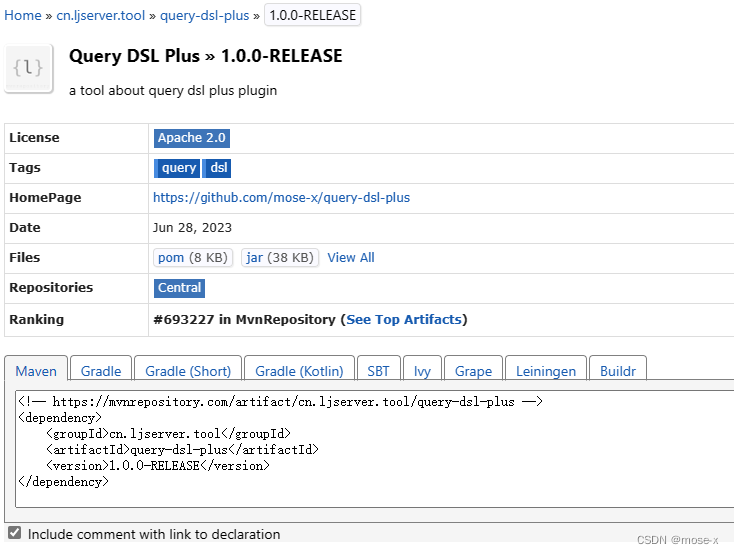

# Maven简介

https://maven.apache.org/docs/history.html Maven官网

https://search.maven.org 中央仓库搜索网站

https://mvnrepository.com 工程搜索

https://repository.sonatype.org/index.html#nexus-search;quick~derby 仓库搜索

Maven本质上是一个插件框架，MAVEN中每个构建任务实际上是由插件完成，插件是在pom.xml中使用plugins标签定义的，每个插件可以包含多个目标。


## 在项目中如何导入jar包？

- 下载jar包 （mvn）
- 将下载的jar包拷贝到项目中（WEB-INF/lib）
- 选择jar文件--右键--Add as Library


## 传统导入jar包的方式存在什么问题？

- 步骤多（相对）——`繁琐`
- 在不同的项目中如果需要相同的jar包，需要分别存储这个jar文件——`冗余`、`项目体积大`
- 在不同的环境下可能因为jar文件版本不一致导致项目无法运行（重新配置）——`移植性差`


## 项目生命周期

项目从编译到运行的整个过程

完整的生命周期：清理缓存—校验—编译—测试—打包—安装—部署

IDEA提供了一键构建项目的功能，但是如果我们需要自定义的生命周期管理，却没有现成的工具（清理缓存）


## Maven简介

Maven是一个基于项目对象模型（project object model，简称 `POM`）用于进行项目的依赖管理、生命周期管理的工具软件。

**核心功能**

- 依赖管理

- 生命周期管理

- 聚合工程


# Maven安装及配置

## Maven下载

http://maven.apache.org/download.cgi


## Maven安装


### window安装

Maven是基于Java语言进行开发的，因此依赖JDK（建议JDK1.7+）

开箱即用：直接解压即可

- 解压（d:/mvn）
- 目录结构：
  - bin  存放指令文件（Maven提供了一个mvn指令）
  - boot 包含了一个类加载框架的jar文件
  - conf  包含了Maven的核心配置文件settings.xml
  - lib  存放了maven运行所需的jar文件


### MacOS安装

```shell
$ brew install maven
$ mvn -v
```

如果上述安装过程提示如下信息

```properties
The JAVA_HOME environment variable is not defined correctly,
this environment variable is needed to run this program.
```

可以按如下操作解决：

**Zsh (/bin/zsh):** 在 `~/.zshenv` 文件中追加如下内容：

```shell
export JAVA_HOME=$(/usr/libexec/java_home)
```

**Bash (/bin/bash):** 在 `~/.bash_profile` 文件中追加如下内容：

```shell
export JAVA_HOME=$(/usr/libexec/java_home)
```


## 配置环境变量

- `M2_HOME` D:\mvn\apache-maven-3.6.3

- `Path` 增加 %M2_HOME%\bin

| 测试                                                  |
| ----------------------------------------------------- |
|  |


# Maven的项目结构

使用Maven进行项目还有一个好处：无论使用什么样 的开发工具（eclipse/idea）项目的结构是统一的。


## Maven的项目结构

```ini
name(项目名称)
--src
  --main (存放项目的源文件)
    --java (存放java代码，相当于传统项目中的src目录)
    --resources (存放配置文件和静态资源的目录，相当于传统项目的web目录)
  --test (存放项目的单元测试代码)
    --java（测试代码）
--pom.xml
```


## pom.xml

Maven可以根据pom文件的配置，对项目进行依赖管理。如果需要在当前项目中添加依赖，只需在pom.xml文件中进行依赖配置即可。

```xml
<?xml version="1.0" encoding="utf-8"?>
<project xmlns="http://maven.apache.org/POM/4.0.0"
         xmlns:xsi="http://www.w3.org/2001/XMLSchema-instance"
         xsi:schemaLocation="http://maven.apache.org/POM/4.0.0 http://maven.apache.org/xsd/maven-4.0.0.xsd">
    <!--指定项目模型版本-->
	<modelVersion>4.0.0</modelVersion>
    <groupId>com.qfedu</groupId>
    <artifactId>name</artifactId>
    <version>1.0.0</version>
    
    <!--配置当前项目的依赖-->
    <dependencies>
    </dependencies>
</project>
```

Maven中的项目信息是由 `<groupId>` 企业标识、`<artifactId>` 项目标识、`<version>` 版本三部分组成。

配置依赖找到依赖的坐标，添加`<dependencies></dependencies>`标签即可。

```xml
<dependency>
    <groupId>mysql</groupId>
    <artifactId>mysql-connector-java</artifactId>
    <version>5.1.47</version>
</dependency>
```


# 构件

在 Maven 中，构件（Artifact）是指被构建生成的文件，例如编译后的类文件、JAR 文件、WAR 文件、POM 文件等。构件是 Maven 项目的构建结果，它们由 Maven 插件根据项目的配置和规则生成。

1）GroupID（组织ID）：用于唯一标识组织或项目组

2）Artifact（构件ID）：用于唯一标识构件或项目。

3）Version（版本号）：用于标识构件的不同版本


# 依赖管理


## Maven依赖管理的流程


## Maven仓库介绍

1. 本地仓库（Local Repository）：本地仓库是位于开发者本地计算机上的一个目录，用于存储 Maven 下载的依赖库。默认情况下，本地仓库位于用户主目录下的 ".m2" 目录。本地仓库用于缓存项目所需的依赖库，以便在构建过程中重复使用，也可以用来部署本地构件；
2. 中央仓库（Central Repository）：中央仓库是 Maven 社区维护的一个公共仓库，包含了大量的开源依赖库。当 Maven 构建项目时，如果在本地仓库中找不到所需的依赖库，它会自动从中央仓库下载并存储到本地仓库中。中央仓库是 Maven 默认使用的主要依赖库存储位置；
3. 远程仓库（Remote Repository）：远程仓库是指位于网络上的其他仓库，它可以是公共的（例如中央仓库）、私有的或第三方维护的仓库。在项目的 POM 文件中，你可以指定其他远程仓库的位置，以获取特定的依赖库。Maven 会根据配置自动从远程仓库下载所需的依赖库，并存储到本地仓库中；
4. 仓库管理器（Repository Manager）：仓库管理器是一个用于管理和提供仓库服务的工具或平台。它可以用于创建私有仓库、代理远程仓库、缓存和共享依赖库等。一些流行的仓库管理器包括 Nexus、Artifactory 和 Archiva；
5. 私服：企业搭建的供内部使用的maven仓库；

这些仓库概念一起构成了 Maven 构建和依赖管理的基础。通过本地仓库和远程仓库的结合，Maven 可以方便地下载、缓存和共享依赖库，使项目的构建过程更加高效和可靠。

| maven仓库                                             |
| ----------------------------------------------------- |
|  |


## Maven仓库配置

在 `maven_home/conf/settings.xml` 中进行配置

**配置本地仓库**

```xml
<localRepository>d:\repo</localRepository>
```

**配置公共仓库**

```xml
<mirrors>
	<mirror>
		<id>nexus-aliyun</id>
		<mirrorOf>central</mirrorOf>
		<name>Nexus aliyun</name>
		<url>http://maven.aliyun.com/nexus/content/groups/public</url>
	 </mirror>
</mirrors>
```


# 生命周期

每个任务实际上是由插件完成，插件是在pom.xml中使用plugins标签定义的，每个插件可以包含多个目标\<goal>。

MAVEN定义了三个标准的生命周期（clean、default/build、site），每个生命周期又包含了一系列**阶段**，生命周期中的某个阶段和插件的目标进行了默认绑定，当然生命周期的阶段与插件目标也支持自定义绑定。

| 生命周期 | 描述         | 阶段数量(个) |
| -------- | ------------ | ------------ |
| clean    | 用于清理项目 | 3            |
| default  | 用于构建项目 | 23           |
| clean    | 用于建立站点 | 4            |


mvn validate 验证，验证项目是正确的并且所有的信息是可用的；

mvn clean 清理，清理项目缓存输出，一般是target文件夹被删除；

mvn compile 编译，将java源文件编译成.class文件；

mvn test 测试，生成测试报告，运行test目录下的所有单元测试；

mvn package 打包，将项目打成jar、war或者pom；

mvn verify 验证，运行任何检查，验证包是否有效且达到质量标准；

mvn install 安装，将当前项目安装到本地maven库，供其他项目依赖；

mvn site：生成项目的文档网站，方便团队成员或用户查看和了解项目的结构、文档、报告等信息；

mvn deploy部署，在构建环境中完成，复制最终的包到远程库。

执行后面的命令会自动执行前面的命令，比如执行mvn package时会执行validate、clean、compile、test、package五个阶段。

Maven有三套相互独立的生命周期，分别是clean、default和site。每个生命周期包含一些阶段（phase），阶段是有顺序的，后面的阶段依赖于前面的阶段。


## **clean生命周期**

包含三个阶段（phase）：


## default（或build）生命周期

共有23个阶段：


例如想要执行package阶段，那么maven会把default生命周期中package之前的阶段都顺序执行一遍，但不会执行clean生命周期中的阶段。


## **site生命周期**

共有4个阶段


## 运行阶段

可以在工程根目录下（必须包含pom.xml）执行mvn命令来运行maven生命周期的阶段

```shell
$ mvn compile
```

命令默认执行deault生命周期的compile之前的所有阶段（含compile阶段），共7个阶段

```shell
$ mvn clean package
```

命令默认执行clean生命周期的clean之前的所有阶段（含clean阶段）和default生命周期package之前的所有阶段（含package阶段），共2 + 17个阶段。


# 插件

MAVEN是一个依赖插件执行的框架，生命周期中每个阶段实际上是由插件完成，插件是在pom.xml中使用plugins标签定义的，每个插件可以包含多个目标。


## 运行插件

用户可以通过两种方式调用Maven插件目标。

第一种方式：

将插件目标与生命周期阶段（lifecycle phase）绑定，这样用户在命令行只是输入生命周期阶段而已，例如Maven默认将maven-compiler-plugin的compile目标与compile生命周期阶段绑定，因此命令mvn compile实际上是先定位到compile这一生命周期阶段，然后再根据绑定关系调用maven-compiler-plugin的compile目标。

第二种方式：

直接在命令行指定要执行的插件目标，例如mvn archetype:generate 就表示调用maven-archetype-plugin的generate目标，这种带冒号的调用方式与生命周期无关。

可使用 “插件名:目标名” 的形式直接运行某插件中的某个目标。

```shell
$ mvn dependency:copy-dependencies
```

命令默认执行了dependency插件的copy-dependencies目标。

阶段和插件目标也可以同时使用：

```shell
$ mvn clean dependency:copy-dependencies package
```

命令默认执行clean生命周期的clean之前的所有阶段（含clean阶段）、dependency插件的copy-dependencies目标、default生命周期package之前的所有阶段（含package阶段）。


## 指定版本

可以在运行mvn命令时指定maven插件的版本，格式如下：

```shell
$ mvn groupID:artifactID:version:goal
```

例如：

```shell
$ mvn org.sonarsource.scanner.maven:sonar-maven-plugin:3.7.0.1746:sonar
```


## maven-surefire-plugin

官网：https://maven.apache.org/surefire/maven-surefire-plugin/index.html

maven-surefire-plugin是maven里执行测试用例的插件，不显示配置就会用默认配置。 这个插件的surefire:test命令会默认绑定maven执行的test阶段。

默认情况下，Surefire插件将自动包含具有以下通配符模式的所有测试类：

- `"**/Test*.java"`-包括其所有子目录和所有以“测试”开头的Java文件名。
- `"**/*Test.java"`-包括其所有子目录和以“测试”结尾的所有Java文件名。
- `"**/*Tests.java"`-包括其所有子目录和所有以“测试”结尾的Java文件名。
- `"**/*TestCase.java"`-包括其所有子目录和以“TestCase”结尾的所有Java文件名。

如果测试类不遵循默认的通配符模式，则通过配置Surefire插件来覆盖它们，并指定要包含（或排除）或其他模式的测试。

```xml
<build>
   <plugins>
     <plugin>
       <groupId>org.apache.maven.plugins</groupId>
       <artifactId>maven-surefire-plugin</artifactId>
       <version>2.20</version>
       <configuration>
         <!-- 包含 -->
         <includes>
           <include>Sample.java</include>
         </includes>
         <!-- 排除 -->
         <excludes>
           <exclude>**/Abstract*.java</exclude>
         </excludes>
         
         <!-- 提高单元测试速度 -->
         	<argLine>-Xmx2G -XX:MaxPermSize=1G -XX:-UseSplitVerifier</argLine>
          <failIfNoTests>false</failIfNoTests>
          <parallel>classesAndMethods</parallel>
          <useUnlimitedThreads>true</useUnlimitedThreads>
       </configuration>
     </plugin>
   </plugins>
</build>
```

```
<plugin>
                <artifactId>maven-surefire-plugin</artifactId>
                <version>2.22.0</version>
                <configuration>
                    <argLine>-Xmx2G -XX:MaxPermSize=1G -XX:-UseSplitVerifier -XX:-TieredCompilation -XX:TieredStopAtLevel=1</argLine>
                    <parallel>methods</parallel>
                    <forkCount>3C</forkCount>
                    <reuseForks>true</reuseForks>
                    <threadCount>20</threadCount>
                </configuration>
            </plugin>

```


# 命令


## 选项


| 选项 | 长选项                               | 说明                                                         |
| ---- | ------------------------------------ | ------------------------------------------------------------ |
| -V   | --show-version                       | 显示版本信息后继续执行Maven其他目标                          |
| -v   | --version                            | 显示版本信息<br>这两个选项输出相同的版本信息，但-v选项在打印版本信息后会中断Maven处理。<br/>如果你想让Maven版本信息出现在构建输出的开始处，你应该使用-V选项。 |
| -P   | --activate-profiles<arg>             | 激活POM文件中的 profile，用逗号分隔多个 profile              |
| -o   | --offline                            | 离线模式工作，该参数可以阻止通过网络更新插件或依赖           |
| -f   | --file <file>                        | 强制使用备用的POM文件                                        |
| -s   | --settings <arg>                     | 用户配置文件的备用路径                                       |
| -gs  | --global-settings <file>             | 全局配置文件的备用路径                                       |
|      | **加密密码**                         | 下面的命令允许你使用Maven加密密码，然后存储到Maven settings文件里 |
| -emp | --encrypt-master-password <password> | 加密主安全密码                                               |
| -ep  | --encrypt-password <password>        | 加密服务器密码                                               |
|      | **失败处理**                         | 下面的选项控制，在多模块项目构建的中间阶段，Maven如何应对构建失败<br>-fn 和 -fae选项对于使用持续集成工具（例如Hunson）的多模块构建非常有用。 -ff 选项对于运行交互构建的开发者非常有用，因为开发者在开发周期中想得到快速的反馈。 |
| -fae | --fail-at-end                        | 仅影响构建结果，允许不受影响的构建继续                       |
| -ff  | --fail-fast                          | 遇到构建失败就停下来                                         |
| -fn  | --fail-never                         | 无论项目结果如何，构建从不失败                               |
|      | **日志级别**                         |                                                              |
| -e   | --errors                             | 产生执行错误相关消息，如果你是Maven开发者，或者你需要诊断Maven插件的一个错误，那么-e选项就会派上用场。如果你想报告Maven或Maven插件的一个未预料到的问题，你应该传递-X 和 -e命令行选项。 |
| -X   | --debug                              | 产生执行调试信息，选项会打印大量的调试日志消息，这个选项主要被Maven开发者和Maven插件开发者用来诊断在开发过程中碰到的Maven代码问题。如果你想诊断依赖或路径问题，-X 选项也非常有用 |
| -q   | --quiet                              | 仅仅显示错误，只有出现错误或问题，-q 选项才打印一条消息      |
|      | **批处理方式**                       |                                                              |
| -B   | --batch-mode                         | 在非交互（批处理）模式下运行<br>如果你需要在非交互、持续集成环境下运行Manve，必须要使用批处理模式。在非交互模式下运行，当Mven需要输入时，它不会停下来接受用户的输入，而是使用合理的默认值。 |
|      | **下载和验证**                       | 如果你关注安全，你就想带 -C选项运行Maven。Maven仓库为每个存储在仓库里的构件维护一个MD5 和 SHA1 校验码。如果构件的校验码不匹配下载的构件，Maven默认被配置成告警终端用户。如果传递-C 选项，当遇到带着错误校验码的构件，会引起Maven构建失败。如果你想确保Maven检查所有快照依赖的最新版本，-U选项非常有用。 |
| -C   | --strict-checksums                   | 如果校验码不匹配的话，构建失败                               |
| -c   | --lax-checksums                      | 如果校验码不匹配的话，产生告警                               |
| -U   | --update-snapshots                   | 在远程仓管更新发布版本或快照版本时，强制更新                 |
|      | **插件更新**                         | 选项告诉Maven，将如何从远程仓库更新（或不更新）Maven插件     |
| -npu | --no-plugin-updates                  | 对任何相关的注册插件，不进行最新检查。使用该选项使Maven表现出稳定行为，该稳定行为基于本地仓库当前可用的所有插件版本 |
| -cpu | -check-plugin-updates                | 对任何相关的注册插件，强制进行最新检查。强制Maven检查Maven插件的最新发布版本，即使在你的项目POM里明确规定了Maven插件版本，还是会强制更新 |
| -up  | --update-plugins                     | cpu的同义词                                                  |
|      | **下载方式**                         |                                                              |
| -npr | --no-plugin-registry                 | 对插件版本不使用~/.m2/plugin-registry.xml 里的配置，告诉Maven不要参考插件注册表 |
|      | **非递归构建**                       | 有时，你只想运行Maven构建，而不陷入项目子模块的构建          |
| -N   | --non-recursive                      | 阻止Maven构建子模块。仅仅构建当前目录包含的项目。<br>运行该命令行选项使Maven只为当前目录下的项目执行生命周期中的目标或步骤 |


## win10环境

可以使用命令行更改 Windows 10 中的字符集。可以使用 `chcp` 命令（"change code page"）来更改命令行的字符集。

下面是一些常用的字符集及其对应的命令：

- 437：美国 MS-DOS
- 65001：UTF-8
- 936：GBK

要将字符集更改为 UTF-8，你可以运行以下命令：

```shell
$ chcp 65001
```

执行maven命令

```shell
$ chcp 65001 & mvn -e clean jacoco:prepare-agent test sonar:sonar -Dsonar.projectKey=xxx -Dsonar.projectName=xxx -f pom.xml -s xxx/.m2/.settings.xml
```


# 基于IDEA的Maven使用


## 在IDEA中关联Maven

| maven配置                                             |
| ----------------------------------------------------- |
|  |
|  |

**说明：** IDEA本身集成了Maven，考虑到IDEA和Maven版本的兼容性，Idea不建议配置比默认版本更新的版本，建议使用IDEA自带的Maven。


## 使用IDEA创建Maven项目


### Java项目

| 创建Java项目                                          |
| ----------------------------------------------------- |
|  |
|  |
|  |


### web项目

**创建maven项目**：maven-demo2

**在pom.xml文件设置打包方式为war**

```xml
<?xml version="1.0" encoding="UTF-8"?>
<project xmlns="http://maven.apache.org/POM/4.0.0"
         xmlns:xsi="http://www.w3.org/2001/XMLSchema-instance"
         xsi:schemaLocation="http://maven.apache.org/POM/4.0.0 http://maven.apache.org/xsd/maven-4.0.0.xsd">
    <modelVersion>4.0.0</modelVersion>

    <groupId>com.qfedu</groupId>
    <artifactId>maven-demo2</artifactId>
    <version>1.0.0</version>

    <!--设置项目打包方式为war-->
    <packaging>war</packaging>

</project>
```

**完成web项目结构**


**配置web组件—Tomcat**


**部署web项目**


## 在IDEA中使用Maven进行依赖管理

### 查找依赖坐标

https://mvnrepository.com/


### 添加依赖

将依赖的坐标配置到项目的pom.xml文件`<dependencies></dependencies>`标签中。

```xml
<?xml version="1.0" encoding="UTF-8"?>
<project xmlns="http://maven.apache.org/POM/4.0.0"
         xmlns:xsi="http://www.w3.org/2001/XMLSchema-instance"
         xsi:schemaLocation="http://maven.apache.org/POM/4.0.0 http://maven.apache.org/xsd/maven-4.0.0.xsd">
    <modelVersion>4.0.0</modelVersion>
    <groupId>com.qfedu</groupId>
    <artifactId>maven-demo2</artifactId>
    <version>1.0.0</version>

    <!--设置项目打包方式为war-->
    <packaging>war</packaging>

    <dependencies>
        <!--在此位置配置项目中所需依赖的坐标 GAV-->
        <dependency>
            <groupId>com.google.code.gson</groupId>
            <artifactId>gson</artifactId>
            <version>2.8.5</version>
        </dependency>

        <dependency>
            <groupId>org.projectlombok</groupId>
            <artifactId>lombok</artifactId>
            <version>1.18.18</version>
            <scope>provided</scope>
        </dependency>
    </dependencies>
</project>
```


### 依赖范围

在通过`<dependency></dependency>`添加依赖时，可以通过`scope`标签配置当前依赖的适用范围。

- **test**  只在项目测试阶段引入当前依赖(编译、测试)

  ```xml
  <dependency>
      <groupId>junit</groupId>
      <artifactId>junit</artifactId>
      <version>4.13.2</version>
      <scope>test</scope>
  </dependency>
  ```

- **runtime** 只在运行时使用（运行、测试运行）；
- **provided** 在（编译、测试、运行）；
- **compile** 在（编译、测试、运行、打包）都引入；


## 在IDEA中使用Maven进行项目构建


### Maven项目构建生命周期说明

- clean 清理缓存  清理项目生成的缓存
- validate 校验  验证项目需要是正确的（项目信息、依赖）
- compile 编译  编译项目专供的源代码
- test 测试  运行项目中的单元测试
- package 打包  将项目编译后的代码打包成发布格式
- verify 检查  对集成测试的结果进行检查、确保项目的质量是达标的
- install 安装 将包安装到maven的本地仓库，以便在本地的其他项目中可以引用此项目（聚合工程）
- deploy  部署  将包安装到私服的仓库，以供其他开发人员共享


### IDEA进行生命周期管理

- 可视化

  

- 终端指令

  选择项目名称---右键---Open in Terminal

  mvn clean


# 私服

企业搭建供内部使用的一个Maven仓库

- 开发者需要依赖直接从私服下载；
- 私服可以实现企业内部依赖的共享：当企业开发了一个通用插件（jar），可以发布到私服，可以连接到当前私服的其他开发者就可以共享这个插件了；


## 私服搭建

可以通过专门的Maven仓库管理软件来搭建私服。例如：Apache Archiva、Nexus。


### 下载Nexus

官网 https://www.sonatype.com/

下载 https://help.sonatype.com/repomanager2/download


### 解压nexus


### 安装并运行nexus

- 进入到`nexus-2.14.11-01/bin`目录；

- 管理员身份打开cmd命令行，执行指令；

  


### 登录Nexus

私服管理器登录地址： http://localhost:8081/nexus；


私服中仓库类型


私服仓库组的配置


### 配置私服


1）在maven的settings.xml文件的`<server>`标签中

```xml
<!--配置连接私服所需的帐号和密码-->
<server> 
    <id>nexus-public</id> <!-- nexus的认证id -->
    <username>admin</username> <!--nexus中的用户名密码-->
    <password>admin123</password> 
</server>
```


2）在maven的settings.xml文件的`profiles`标签中

repository 和 pluginRepository的  id子标签的值，要和上面配置的server 的id子标签的值一致。

```xml
<profile> 
    <id>nexus</id> 
    <repositories> 
        <repository> 
            <id>nexus-public</id>      
            <name>Nexus Release Snapshot Repository</name>   
            <url>http://localhost:8081/nexus/content/groups/public/</url>
            <releases><enabled>true</enabled></releases> 
            <snapshots><enabled>true</enabled></snapshots> 
        </repository>
    </repositories> 
    <pluginRepositories>
        <pluginRepository> 
            <id>nexus-public</id> 
            <url>http://localhost:8081/nexus/content/groups/public/</url>
            <releases><enabled>true</enabled></releases> 
            <snapshots><enabled>true</enabled></snapshots> 
        </pluginRepository> 
    </pluginRepositories> 
</profile>
```


3）在maven的settings.xml文件的`activeProfiles`配置激活profile

```xml
 <activeProfiles>
	<activeProfile>nexus</activeProfile>
 </activeProfiles>
```


## Maven聚合工程


# 上传jar到中央仓库

参考以下链接：

https://cloud.tencent.com/developer/article/1929115

https://www.cnblogs.com/zimug/p/16575819.html

https://blog.csdn.net/qq_41011894/article/details/123406711

https://cloud.tencent.com/developer/article/2002816

https://blog.csdn.net/qq_23501739/article/details/131462588

https://developer.aliyun.com/article/935486


## 准备域名

因为maven仓库要求上传jar包，必须要有groupid，这个必须你自己真实用的一个域名，所以要先准备域名。方案如下：

- 可以用你自己的域名；

  如果有的话可以重复使用；

- 购买新的域名；

  购买流程：注册登录 https://www.gname.com/user ，挑选域名，支付宝付款，新建过户模版，将域名使用过户模版；

- 用github的域名；

  用github域名：注册一个github用户，io.github.XXX 就是后面用到的 groupid


## 注册账号

注册 sonatype  账号，地址：https://issues.sonatype.org/secure/Signup!default.jspa

填一下邮箱、姓名、用户名和密码后，点击sign up就完成了。


## 提交issue

登录完成后，语言可以选择中文，在system dashboard页面中，点击上方导航栏上的**新建按钮**，就可以创建一个 issue（工单）。

填写页面如下图所示：


填写完后，点击新建即可（上图由于是已经提交了的，所以是更新按钮）。


## 等待回复

等待几分钟后，就会收到 OSSRH 的回复，如下图所示：


主要问题是 groupId 必须是你自己真实有效控制的一个域名或你自己的Github帐号的域名。


## 验证域名


### 域名解析验证

如果是自己的域名，则需要在域名解析中增加 TXT的解析与项目主页，如下所示：


将对域名的请求转发到项目的主页链接上（就是前面在issue工单上填写的项目地址）。


### 验证GitHub帐号

如果 groupid 是 io.github.mose-x 这种git域名，则需要新建一个公开的git仓库，如下两个图（网上找的）


## 等待验证

域名验证操作完毕后，要到 sonatype 的工单页面点击 “waiting for Response” 按钮通知一下工作人员验证域名。


等待域名验证回复了，回复结果如下，则表示可以推送你的java工具了


## GPG密匙

接下来要用 gpg 生成秘钥，在后续包发布 jar 时会根据生成的秘钥进行校验，因为sonatype也需要对上传这一行为进行权健的校验，避免无意义或恶意上传文件的行为。


### 安装GPG

官网下载地址：https://www.gnupg.org/download/

window下安装：https://files.gpg4win.org/gpg4win-4.0.4.exe

MacOS下安装：`brew info gpg`


### 创建秘钥

```shell
# 查看版本来检查
$ gpg --version

# 生成密钥对
$ gpg --gen-key

# 查看生成的公钥
$ gpg --list-keys

# 将公钥发布到GPG密钥服务器
$ gpg --keyserver hkp://keyserver.ubuntu.com:11371 --send-keys 公钥ID

# 查询是否已将公钥发布到服务器
$ gpg --keyserver hkp://keyserver.ubuntu.com:11371 --recv-keys 公钥ID
```

在安装完成后，在命令行执行下面命令来生成一个秘钥：

```shell
$ gpg --gen-key
```

在生成的过程中，首先会要求输入姓名和邮箱地址，在命令行窗口下填完这两个信息后，还会弹窗要求输入一个密码：


这个密码非常重要，一定要记住，后面在项目deploy的时候还会用到。填完后继续，秘钥就会成功生成并保存在本地目录下了：


可以使用如下命令查看生成的密钥：

```shell
$ gpg --list-keys
```


如上图所示：红色边框选中的就是公钥ID


### 上传秘钥

在秘钥生成完后，我们需要把公钥上传到公共服务器供sonatype验证，可以通过下面的命令将公钥上传：

```shell
$ gpg --keyserver hkp://keyserver.ubuntu.com:11371 --send-keys 公钥ID
```

上传密钥有很大可能会出现失败情况，可以尝试上传到其他的存放公钥的服务器：

- keyserver.ubuntu.com
- pool.sks-keyservers.net
- keys.openpgp.org
- pgp.mit.edu
- keys.gnupg.net
- keyserver.ubuntu.com

端口都是11371，这些公钥服务器间会同步它们的数据给其他服务器，所以只要上传成功到其中一台就行。

如下所示是处理上传失败的方案：

```csharp
gpg --keyserver hkp://keyserver.ubuntu.com:11371 --send-keys 8D37F9F1AAB6ADE11D0CD04CE9A3D90D4B60CBF9
gpg: 正在发送密钥 8D37F9F1AAB6ADE11D0CD04CE9A3D90D4B60CBF9 到 hkp://keyserver.ubuntu.com
gpg: 发送至公钥服务器失败：No route to host
gpg: 发送至公钥服务器失败：No route to host

# 先使用命令 ping keys.gnupg.net 得到域名对应的IP地址：51.38.91.189
gpg --keyserver hkp://51.38.91.189:11371 --send-keys 8D37F9F1AAB6ADE11D0CD04CE9A3D90D4B60CBF9

# 验证密钥是否已成功上传
gpg --keyserver hkp://51.38.91.189:11371 --recv-keys 8D37F9F1AAB6ADE11D0CD04CE9A3D90D4B60CBF9
```


### maven设置

接下来需要修改本地maven的配置，为了保险起见，我建议大家最好同时修改.m2和conf目录下的配置文件，否则有可能出现一些奇怪的问题。


#### server

首先在配置文件中添加一个server节点，配置sonatype的用户名及密码：

```xml
<servers>
    <server>
        <id>ossrh</id>
        <username>${sonatype username}</username>
        <password>${sonatype password}</password>
    </server>
</servers>
```


#### profile

接着添加一个profie节点，配置gpg信息，这里就需要填入在生成gpg秘钥过程中，我们在弹窗中输入的密码了：

```xml
<profiles>
    <profile>
        <id>ossrh</id>
        <properties>
            <gpg.executable>gpg</gpg.executable>
            <gpg.passphrase>${弹窗输入的那个密码}</gpg.passphrase>
        </properties>
    </profile>
</profiles>
<activeProfiles>
    <activeProfile>ossrh</activeProfile>
</activeProfiles>
```

在修改完成后，可以在命令行窗口下，通过命令查看我们修改过的配置是否已经生效了：

```shell
mvn help:effective-settings
```

如果显示的内容和配置文件中的一样，那么恭喜，后面就只还剩下亿点点工作了。

6、 项目pom修改

在maven环境修改完成后，我们还需要对项目的pom文件进行一些修改。

a、基础信息

如果我们之前的代码中，groupId和sonatype上注册的不一致，那么需要修改项目的groupId改为一致。既然都要发布了，顺便也把version改为release版本吧。

```xml
<groupId>io.github.trunks2008</groupId>
<artifactId>ulquiorra-cache</artifactId>
<version>0.0.1-RELEASE</version>
```

distributionManagement
添加distributionManagement信息，声明要打包到sonatype的maven仓库中去。

```xml
<distributionManagement>
    <snapshotRepository>
        <id>ossrh</id>
        <url>https://s01.oss.sonatype.org/content/repositories/snapshots</url>
    </snapshotRepository>
    <repository>
        <id>ossrh</id>
        <url>https://s01.oss.sonatype.org/service/local/staging/deploy/maven2/</url>
    </repository>
</distributionManagement>
```

plugins

这里需要添加各种plugin插件，除了常用的maven-compiler和maven-deploy插件外，还需要下面几个关键插件：

● nexus-staging-maven-plugin：sonatype插件，用来将项目发布到中央仓库使用
● maven-source-plugin：生成java-source.jar文件
● maven-javadoc-plugin：生成java doc文档
● maven-gpg-plugin：对文件进行自动签名

使用到的全部插件详细配置如下，直接拷到项目中就可以使用：

```xml
<plugins>
    <plugin>
        <groupId>org.apache.maven.plugins</groupId>
        <artifactId>maven-compiler-plugin</artifactId>
        <version>3.8.1</version>
        <configuration>
            <source>${java.version}</source>
            <target>${java.version}</target>
            <encoding>UTF-8</encoding>
        </configuration>
    </plugin>
    <!-- sonatype插件，发布使用-->
    <plugin>
        <groupId>org.sonatype.plugins</groupId>
        <artifactId>nexus-staging-maven-plugin</artifactId>
        <version>1.6.7</version>
        <extensions>true</extensions>
        <configuration>
            <serverId>ossrh</serverId>
            <nexusUrl>https://s01.oss.sonatype.org/</nexusUrl>
            <autoReleaseAfterClose>true</autoReleaseAfterClose>
        </configuration>
    </plugin>

    <!-- 生成java source.jar -->
    <plugin>
        <groupId>org.apache.maven.plugins</groupId>
        <artifactId>maven-source-plugin</artifactId>
        <version>2.2.1</version>
        <executions>
            <execution>
                <id>attach-sources</id>
                <goals>
                    <goal>jar-no-fork</goal>
                </goals>
            </execution>
        </executions>
    </plugin>

    <!-- 生成java doc文档 -->
    <plugin>
        <groupId>org.apache.maven.plugins</groupId>
        <artifactId>maven-javadoc-plugin</artifactId>
        <version>2.9.1</version>
        <configuration>
            <show>private</show>
            <nohelp>true</nohelp>
            <charset>UTF-8</charset>
            <encoding>UTF-8</encoding>
            <docencoding>UTF-8</docencoding>
            <additionalparam>-Xdoclint:none</additionalparam>
        </configuration>
        <executions>
            <execution>
                <phase>package</phase>
                <goals>
                    <goal>jar</goal>
                </goals>
            </execution>
        </executions>
    </plugin>

    <!-- 工程文件自动签名-->
    <plugin>
        <groupId>org.apache.maven.plugins</groupId>
        <artifactId>maven-gpg-plugin</artifactId>
        <version>1.5</version>
        <executions>
            <execution>
                <id>sign-artifacts</id>
                <phase>verify</phase>
                <goals>
                    <goal>sign</goal>
                </goals>
            </execution>
        </executions>
    </plugin>

    <plugin>
        <groupId>org.apache.maven.plugins</groupId>
        <artifactId>maven-deploy-plugin</artifactId>
        <version>2.8.2</version>
    </plugin>
</plugins>
```

至于在idea中，插件经常下载失败报红线的问题，个人测试可以先加到dependencies中拉取下来，成功率能高不少…

开源签名证书

添加license信息，使用Apache Licene 2.0 协议就行。

```xml
<licenses>
    <license>
        <name>The Apache Software License, Version 2.0</name>
        <url>http://www.apache.org/licenses/LICENSE-2.0.txt</url>
        <distribution>repo</distribution>
    </license>
</licenses>
```

仓库信息

在这里填写一下项目的地址，把我们的github仓库地址贴上去就可以了。

```xml
<scm>
    <url>
        https://github.com/mose-x/query-dsl-plus
    </url>
    <connection>
        scm:git@github.com/mose-x/query-dsl-plus.git
    </connection>
    <developerConnection>
        scm:git@github.com/mose-x/query-dsl-plus.git
    </developerConnection>
</scm>
```

开发人员信息

补充开发者的个人信息，虽然估计也没什么人会联系我就是了。

```xml
<developers>
    <developer>
        <name>mose-x</name>
        <email>mose-x@qq.com</email>
        <organization>https://github.com/mose-x</organization>
        <timezone>+8</timezone>
    </developer>
</developers>
```

补充额外信息

```xml
<name>query-dsl-plus</name>
<description>a tool about bilayer cache</description>
<url>https://github.com/mose-x/query-dsl-plus</url>
```

打包发布

java程序中执行 clean deploy

```xml
mvn clean deploy -DskipTests 
  -Dmaven.wagon.http.ssl.insecure=true 
  -Dmaven.wagon.http.ssl.allowall=true
```

出现如下，即成功


并且在OSSRH中也能收到反馈


结果：



然后就是等待了！

账号密码和上面注册的ossrh一致
https://s01.oss.sonatype.org

一般30分钟后能查看
https://repo1.maven.org/maven2/

一般4小时后能查看
https://search.maven.org/

一般24小时后能查看
https://mvnrepository.com/