# Mcaven简介

Maven官网链接：https://maven.apache.org/docs/history.html 

Maven本质上是一个插件框架，MAVEN中每个构建任务实际上是由插件完成，插件是在pom.xml中使用plugins标签定义的，每个插件可以包含多个目标。

| 地址                             | 中文名                  | 说明                                                         |
| -------------------------------- | ----------------------- | ------------------------------------------------------------ |
| https://search.maven.org/        | Maven中央仓库的搜索引擎 | 允许开发者搜索和查找特定的Java库和依赖项。<br>通过第三方上传的jar一般4小时后能查看 |
| https://mvnrepository.com/       |                         | 用于查找Maven仓库中的Java库和依赖项的网站<br>上传jar后一般24小时后能查看 |
| https://repo1.maven.org/maven2/  | Maven中央仓库的一个镜像 | 中央仓库是Maven社区维护的官方仓库之一，包含了大量的Java库和依赖项<br>更新jar后一般30分钟后能查看 |
| https://s01.oss.sonatype.org     | sonatype仓库            | 上传jar包到第三方的Maven仓库sonatype                         |
| https://repository.sonatype.org/ |                         | 仓库搜索                                                     |


## 在项目中如何导入jar包？

- 下载jar包 （mvn）
- 将下载的jar包拷贝到项目中（WEB-INF/lib）
- 选择jar文件--右键--Add as Library


## 传统导入jar包的方式存在什么问题？

- 步骤多（相对）——`繁琐`
- 在不同的项目中如果需要相同的jar包，需要分别存储这个jar文件——`冗余`、`项目体积大`
- 在不同的环境下可能因为jar文件版本不一致导致项目无法运行（重新配置）——`移植性差`


## 项目生命周期

项目从编译到运行的整个过程

完整的生命周期：清理缓存—校验—编译—测试—打包—安装—部署

IDEA提供了一键构建项目的功能，但是如果我们需要自定义的生命周期管理，却没有现成的工具（清理缓存）


## Maven简介

Maven是一个基于项目对象模型（project object model，简称 `POM`）用于进行项目的依赖管理、生命周期管理的工具软件。

**核心功能**

- 依赖管理

- 生命周期管理

- 聚合工程


# Maven安装及配置

## Maven下载

http://maven.apache.org/download.cgi


## Maven安装


### window安装

Maven是基于Java语言进行开发的，因此依赖JDK（建议JDK1.7+）

开箱即用：直接解压即可

- 解压（d:/mvn）
- 目录结构：
  - bin  存放指令文件（Maven提供了一个mvn指令）
  - boot 包含了一个类加载框架的jar文件
  - conf  包含了Maven的核心配置文件settings.xml
  - lib  存放了maven运行所需的jar文件


### MacOS安装

```shell
$ brew install maven
$ mvn -v
```

如果上述安装过程提示如下信息

```properties
The JAVA_HOME environment variable is not defined correctly,
this environment variable is needed to run this program.
```

可以按如下操作解决：

**Zsh (/bin/zsh):** 在 `~/.zshenv` 文件中追加如下内容：

```shell
export JAVA_HOME=$(/usr/libexec/java_home)
```

**Bash (/bin/bash):** 在 `~/.bash_profile` 文件中追加如下内容：

```shell
export JAVA_HOME=$(/usr/libexec/java_home)
```


## 配置环境变量

- `M2_HOME` D:\mvn\apache-maven-3.6.3

- `Path` 增加 %M2_HOME%\bin

| 测试                                                  |
| ----------------------------------------------------- |
| 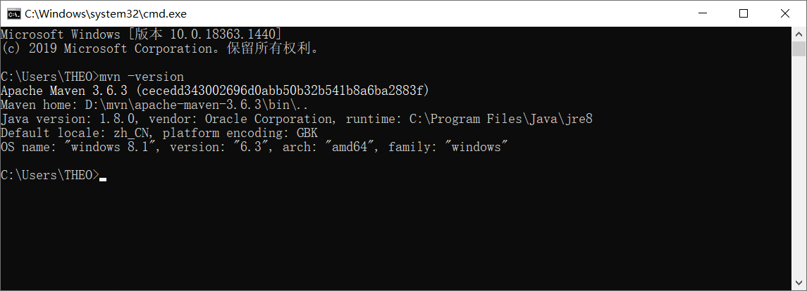 |


## setting.xml

settings.xml 是 Maven 的全局配置文件，包含类似本地仓库、远程仓库和联网使用的代理信息等配置。

settings.xml 文件一般存在于 Maven 的安装目录的 conf 子目录下面，或者是用户目录的 .m2 子目录下面。

用户目录下的 settings.xml 文件一般是不存在的，但是 Maven 允许我们在这里定义我们自己的 settings.xml，如果需要在这里定义我们自己的 settings.xml 的时候就可以把 Maven 安装目录下面的 settings.xml 文件拷贝到用户目录的 .m2 目录下，然后改成自己想要的样子。

```xml
<settings xmlns="http://maven.apache.org/SETTINGS/1.0.0"
          xmlns:xsi="http://www.w3.org/2001/XMLSchema-instance"
          xsi:schemaLocation="http://maven.apache.org/SETTINGS/1.0.0
                              https://maven.apache.org/xsd/settings-1.0.0.xsd">
    <localRepository/>
    <interactiveMode/>
    <usePluginRegistry/>
    <offline/>
    <pluginGroups/>
    <servers/>
    <mirrors/>
    <proxies/>
    <profiles/>
    <activeProfiles/>
</settings>
```

### LocalRepository

该值表示构建系统本地仓库的路径，**默认值**：~/.m2/repository。

```xml
<localRepository>${user.home}/.m2/repository</localRepository>
```

### InteractiveMode

表示 maven 是否需要和用户交互以获得输入，**默认值**：true。如果 maven 需要和用户交互以获得输入，则设置成 true，反之则为 false。

```xml
<interactiveMode>true</interactiveMode>
```

### UsePluginRegistry

表示 maven 是否需要使用 plugin-registry.xml 文件来管理插件版本。**默认值**：false。如果需要让 maven 使用文件 ~/.m2/plugin-registry.xml 来管理插件版本，则设为 true，反之则为 false。

```xml
<usePluginRegistry>false</usePluginRegistry>
```

### Offline

表示在 Maven 进行项目编译和部署等操作时是否允许 Maven 进行联网来下载所需要的信息。**默认值**：false。如果构建系统需要在离线模式下运行，则为 true，反之则为 false。

当由于网络设置原因或者安全因素，构建服务器不能连接远程仓库的时候，该配置就十分有用。

```xml
<offline>false</offline>
```

### PluginGroups

在 **pluginGroups** 元素下面可以定义一系列的 **pluginGroup** 元素。表示当通过 **plugin** 的前缀来解析 plugin 的时候到哪里寻找。**pluginGroup** 元素指定的是 **plugin** 的 **groupId**。

默认情况下，Maven 会自动把 **org.apache.maven.plugins** 和 **org.codehaus.mojo** 添加到 **pluginGroups **下。

```xml
<pluginGroups>
    <!-- plugin 的组织 Id（groupId） -->
    <pluginGroup>org.codehaus.mojo</pluginGroup>
</pluginGroups>
```

### Servers

仓库的下载和部署是在 pom.xml 文件中的 **repositories** 和 **distributionManagement** 元素中定义的。然而，一般类似用户名、密码（有些仓库访问是需要安全认证的）等信息不应该在 **pom.xml**文件中配置，这些信息可以配置在 **settings.xml** 中。

```XML
<!-- 配置服务端的一些设置。一些设置如安全证书不应该和 pom.xml 一起分发。这种类型的信息应该存在于构建服务器上的 settings.xml 文件中。 -->
<servers>
    <!-- 服务器元素包含配置服务器时需要的信息 -->
    <server>
        <!-- 这是 server 的 id（注意不是用户登陆的 id），该 id 与 distributionManagement 中 repository 元素的 id 相匹配。 -->
        <id>server001</id>
        <!-- 鉴权用户名。鉴权用户名和鉴权密码表示服务器认证所需要的登录名和密码。 -->
        <username>my_login</username>
        <!-- 鉴权密码。鉴权用户名和鉴权密码表示服务器认证所需要的登录名和密码。密码加密功能已被添加到 2.1.0 +。详情请访问密码加密页面 -->
        <password>my_password</password>
        <!-- 鉴权时使用的私钥位置。和前两个元素类似，私钥位置和私钥密码指定了一个私钥的路径（默认是 ${user.home}/.ssh/id_dsa）以及如果需要的话，一个密语。将来 passphrase 和 password 元素可能会被提取到外部，但目前它们必须在 settings.xml 文件以纯文本的形式声明。 -->
        <privateKey>${usr.home}/.ssh/id_dsa</privateKey>
        <!-- 鉴权时使用的私钥密码。 -->
        <passphrase>some_passphrase</passphrase>
        <!-- 文件被创建时的权限。如果在部署的时候会创建一个仓库文件或者目录，这时候就可以使用权限（permission）。这两个元素合法的值是一个三位数字，其对应了 unix 文件系统的权限，如 664，或者775。 -->
        <filePermissions>664</filePermissions>
        <!-- 目录被创建时的权限。 -->
        <directoryPermissions>775</directoryPermissions>
    </server>
</servers>
```

### Mirrors

用于定义一系列的远程仓库的镜像。

我们可以在 pom 中定义一个下载工件的时候所使用的远程仓库。但是有时候这个远程仓库会比较忙，所以这个时候人们就想着给它创建镜像以缓解远程仓库的压力，也就是说会把对远程仓库的请求转换到对其镜像地址的请求。

每个远程仓库都会有一个 id，这样我们就可以创建自己的 mirror 来关联到该仓库，那么以后需要从远程仓库下载工件的时候 Maven 就可以从我们定义好的 mirror 站点来下载，这可以很好的缓解我们远程仓库的压力。

在我们定义的 mirror 中每个远程仓库都只能有一个 mirror 与它关联，也就是说你不能同时配置多个 mirror 的 mirrorOf 指向同一个 repositoryId。

```xml
<mirrors>
    <!-- 给定仓库的下载镜像。 -->
    <mirror>
        <!-- 该镜像的唯一标识符。id 用来区分不同的 mirror 元素。 -->
        <id>mirrorId</id>
        <!-- 镜像名称 -->
        <name>PlanetMirror Australia</name>
        <!-- 该镜像的 URL。构建系统会优先考虑使用该 URL，而非使用默认的服务器 URL。 -->
        <url>http://downloads.planetmirror.com/pub/maven2</url>
        <!-- 被镜像的服务器的 id。例如，如果我们要设置了一个 Maven 中央仓库（http://repo.maven.apache.org/maven2/）的镜像，就需要将该元素设置成 central。这必须和中央仓库的 id central 完全一致。 -->
        <mirrorOf>repositoryId</mirrorOf>
    </mirror>
</mirrors>
```

### Proxies

用来配置不同的代理。

```XML
<proxies>
    <!-- 代理元素包含配置代理时需要的信息 -->
    <proxy>
        <!-- 代理的唯一定义符，用来区分不同的代理元素。 -->
        <id>myproxy</id>
        <!-- 该代理是否是激活的那个。true 则激活代理。当我们声明了一组代理，而某个时候只需要激活一个代理的时候，该元素就可以派上用处。 -->
        <active>true</active>
        <!-- 代理的协议。 协议://主机名:端口，分隔成离散的元素以方便配置。 -->
        <protocol>http</protocol>
        <!-- 代理的主机名。协议://主机名:端口，分隔成离散的元素以方便配置。 -->
        <host>proxy.somewhere.com</host>
        <!-- 代理的端口。协议://主机名:端口，分隔成离散的元素以方便配置。 -->
        <port>8080</port>
        <!-- 代理的用户名，用户名和密码表示代理服务器认证的登录名和密码。 -->
        <username>proxyuser</username>
        <!-- 代理的密码，用户名和密码表示代理服务器认证的登录名和密码。 -->
        <password>somepassword</password>
        <!-- 不该被代理的主机名列表。该列表的分隔符由代理服务器指定；例子中使用了竖线分隔符，使用逗号分隔也很常见。 -->
        <nonProxyHosts>*.google.com|ibiblio.org</nonProxyHosts>
    </proxy>
</proxies>
```

### Profiles

根据环境参数来调整构建配置的列表。

settings.xml 中的 profile 元素是 pom.xml 中 profile 元素的裁剪版本。它包含了 id、activation、repositories、pluginRepositories 和 properties元素。

这里的 profile 元素只包含这五个子元素是因为这里只关心构建系统这个整体（这正是 settings.xml 文件的角色定位），而非单独的项目对象模型设置。

如果一个 settings.xml 中的 profile 被激活，它的值会覆盖任何其它定义在 pom.xml 中带有相同 id 的 profile。当所有的约束条件都满足的时候就会激活这个 profile。

```xml
<profiles>
    <profile>
        <!-- profile 的唯一标识 -->
        <id>test</id>     
        <!-- 自动触发 profile 的条件逻辑 -->
        <activation>
            <activeByDefault>false</activeByDefault>
            <jdk>1.6</jdk>
            <os>
                <name>Windows 7</name>
                <family>Windows</family>
                <arch>x86</arch>
                <version>5.1.2600</version>
            </os>
            <property>
                <name>mavenVersion</name>
                <value>2.0.3</value>
            </property>
            <file>
                <exists>${basedir}/file2.properties</exists>
                <missing>${basedir}/file1.properties</missing>
            </file>
        </activation>
        <!-- 扩展属性列表 -->
        <properties />
        <!-- 远程仓库列表 -->
        <repositories />
        <!-- 插件仓库列表 -->
        <pluginRepositories />
        ...
    </profile>
</profiles>
```

### Activation

自动触发 profile 的条件逻辑。这是 profile中 最重要的元素。

跟 pom.xml 中的 profile 一样，settings.xml 中的 profile 也可以在特定环境下改变一些值，而这些环境是通过 activation 元素来指定的。activation 元素并不是激活 profile 的唯一方式。

settings.xml 文件中的 activeProfile 元素可以包含 profile 的 id。profile 也可以通过在命令行，使用-P标记和逗号分隔的列表来显式的激活（如，-P test）。

**jdk**：表示当 jdk 的版本满足条件的时候激活，在这里是 1.6。这里的版本还可以用一个范围来表示，如

```XML
<jdk>[1.4,1.7)</jdk> <!-- 表示1.4、1.5和1.6满足 -->
<jdk>[1.4,1.7]</jdk> <!-- 表示1.4、1.5、1.6和1.7满足 -->
```

**os**：表示当操作系统满足条件的时候激活。

**property**：property 是键值对的形式，表示当 Maven 检测到了这样一个键值对的时候就激活该 profile。

下面的示例表示当存在属性 hello 的时候激活该 profile。

```XML
<property>
    <name>hello</name>
</property>
```

下面的示例表示当属性 hello 的值为 world 的时候激活该 profile

```XML
<property>
    <name>hello</name>
    <value>world</value>
</property>
```

这个时候如果要激活该 profile 的话，可以在调用 Maven 指令的时候加上参数 hello 并指定其值为 world，如：

```SHELL
mvn compile –Dhello=world
```

**file**：表示当文件存在或不存在的时候激活，exists 表示存在，missing 表示不存在。如下面例子表示当文件 hello/world 不存在的时候激活该 profile。

```XML
<profile>
    <activation>
        <file>
            <missing>hello/world</missing>
        </file>
    </activation>
</profile>
```

**activeByDefault**：当其值为 true 的时候表示如果没有其他的 profile 处于激活状态的时候，该 profile 将自动被激活。

**properties**：用于定义属性键值对的。当该 profile 是激活状态的时候，properties 下面指定的属性都可以在 pom.xml 中使用。对应 profile 的扩展属性列表。
maven 属性和 ant 中的属性一样，可以用来存放一些值。这些值可以在 pom.xml 中的任何地方使用标记 ${X} 来使用，这里X是指属性的名称。属性有五种不同的形式，并且都能在 settings.xml 文件中访问。

```XML
<!--
  1. env.X: 在一个变量前加上"env."的前缀，会返回一个shell环境变量。例如,"env.PATH"指代了$path环境变量（在Windows上是%PATH%）。
  2. project.x：指代了POM中对应的元素值。例如: <project><version>1.0</version></project>通过${project.version}获得version的值。
  3. settings.x: 指代了settings.xml中对应元素的值。例如：<settings><offline>false</offline></settings>通过 ${settings.offline}获得offline的值。
  4. Java System Properties: 所有可通过java.lang.System.getProperties()访问的属性都能在POM中使用该形式访问，例如 ${java.home}。
  5. x: 在<properties/>元素中，或者外部文件中设置，以${someVar}的形式使用。
 -->
<properties>
    <user.install>${user.home}/our-project</user.install>
</properties>
```

### **repositories**

用于定义远程仓库的，当该 profile 是激活状态的时候，这里面定义的远程仓库将作为当前 pom 的远程仓库。它是 maven 用来填充构建系统本地仓库所使用的一组远程仓库。

```XML
<repositories>
    <!-- 包含需要连接到远程仓库的信息 -->
    <repository>
        <!-- 远程仓库唯一标识 -->
        <id>codehausSnapshots</id>
        <!-- 远程仓库名称 -->
        <name>Codehaus Snapshots</name>
        <!-- 如何处理远程仓库里发布版本的下载 -->
        <releases>
            <!-- true 或者 false 表示该仓库是否为下载某种类型构件（发布版，快照版）开启。 -->
            <enabled>false</enabled>
            <!-- 该元素指定更新发生的频率。Maven 会比较本地 POM 和远程 POM 的时间戳。这里的选项是：always（一直），daily（默认，每日），interval：X（这里X是以分钟为单位的时间间隔），或者 never（从不）。 -->
            <updatePolicy>always</updatePolicy>
            <!-- 当 Maven 验证构件校验文件失败时该怎么做 -ignore（忽略），fail（失败），或者 warn（警告）。 -->
            <checksumPolicy>warn</checksumPolicy>
        </releases>
        <!-- 如何处理远程仓库里快照版本的下载。有了 releases 和 snapshots 这两组配置，POM 就可以在每个单独的仓库中，为每种类型的构件采取不同的策略。例如，可能有人会决定只为开发目的开启对快照版本下载的支持。参见 repositories/repository/releases 元素 -->
        <snapshots>
            <enabled />
            <updatePolicy />
            <checksumPolicy />
        </snapshots>
        <!-- 远程仓库 URL，按 protocol://hostname/path 形式 -->
        <url>http://snapshots.maven.codehaus.org/maven2</url>
        <!-- 用于定位和排序构件的仓库布局类型，可以是 default（默认）或者 legacy（遗留）。Maven2 为其仓库提供了一个默认的布局；然而，Maven1.x 有一种不同的布局。我们可以使用该元素指定布局是 default（默认）还是 legacy（遗留）。 -->
        <layout>default</layout>
    </repository>
</repositories>
```

- releases、snapshots：这是对于工件的类型的限制；
- enabled：表示这个仓库是否允许这种类型的工件；
- updatePolicy：用来配置Maven从远程仓库检查更新的频率，默认值为daily，表示每天检查一次。其他可用的值包括：never-从不检查更新；always-每次构建都检查更新；interval:X-每隔X分钟检查一次更新；
- checksumPolicy：用来配置Maven检查校验和文件的策略。当构件被部署到Maven仓库中时会同时部署对应的校验和文件。在下载构建的时候，Maven会验证校验和文件。当checksumPolicy的值为默认的warn时，Maven会在执行构建时输出警告信息。为fail时，Maven遇到校验和错误就让构建失败；ignore，使Maven完全忽略校验和错误；


### **pluginRepositories**

在 Maven 中有两种类型的仓库，一种是存储工件的仓库，另一种就是存储 plugin 插件的仓库。

pluginRepositories 的定义和 repositories 的定义类似，表示 Maven 在哪些地方可以找到所需要的插件，只是 repository 是管理 jar 包依赖的仓库。

pluginRepositories 则是管理插件的仓库。

pluginRepositories 元素的结构和 repositories 元素的结构类似。每个 pluginRepository 元素指定一个 Maven 可以用来寻找新插件的远程地址。

maven 插件是一种特殊类型的构件。由于这个原因，插件仓库独立于工件仓库。

```xml
<activation>
    <!-- profile 默认是否激活的标识 -->
    <activeByDefault>false</activeByDefault>
    <!-- 当匹配的 jdk 被检测到，profile 被激活。例如，1.4 激活 JDK1.4，1.4.0_2，而 !1.4激活所有版本不是以 1.4 开头的 JDK。 -->
    <jdk>1.5</jdk>
    <!-- 当匹配的操作系统属性被检测到，profile 被激活。os 元素可以定义一些操作系统相关的属性。 -->
    <os>
        <!-- 激活 profile 的操作系统的名字 -->
        <name>Windows XP</name>
        <!-- 激活 profile 的操作系统所属家族(如 'windows') -->
        <family>Windows</family>
        <!-- 激活 profile 的操作系统体系结构 -->
        <arch>x86</arch>
        <!-- 激活 profile 的操作系统版本 -->
        <version>5.1.2600</version>
    </os>
    <!-- 如果 Maven 检测到某一个属性（其值可以在 POM 中通过 ${name} 引用），其拥有对应的 name = 值，Profile 就会被激活。如果值字段是空的，那么存在属性名称字段就会激活 profile，否则按区分大小写方式匹配属性值字段 -->
    <property>
        <!-- 激活 profile 的属性的名称 -->
        <name>mavenVersion</name>
        <!-- 激活 profile 的属性的值 -->
        <value>2.0.3</value>
    </property>
    <!-- 提供一个文件名，通过检测该文件的存在或不存在来激活 profile。missing 检查文件是否存在，如果不存在则激活 profile。另一方面，exists 则会检查文件是否存在，如果存在则激活 profile。 -->
    <file>
        <!-- 如果指定的文件存在，则激活 profile。 -->
        <exists>${basedir}/file2.properties</exists>
        <!-- 如果指定的文件不存在，则激活 profile。 -->
        <missing>${basedir}/file1.properties</missing>
    </file>
</activation>
```

### ActiveProfiles

**作用**：手动激活 profiles 的列表，按照 profile 被应用的顺序定义 activeProfile。

该元素包含了一组 activeProfile 元素，每个 activeProfile 都含有一个 profile id。任何在 activeProfile 中定义的 profile id，不论环境设置如何，其对应的 profile 都会被激活。如果没有匹配的 profile，则什么都不会发生。
例如，env-test 是一个 activeProfile，则在 pom.xml（或者 profile.xml）中对应 id 的 profile 会被激活。如果运行过程中找不到这样一个 profile，Maven 则会像往常一样运行。

```XML
<settings xmlns="http://maven.apache.org/SETTINGS/1.0.0" xmlns:xsi="http://www.w3.org/2001/XMLSchema-instance"
          xsi:schemaLocation="http://maven.apache.org/SETTINGS/1.0.0
                              https://maven.apache.org/xsd/settings-1.0.0.xsd">
    ...
    <activeProfiles>
        <!-- 要激活的profile id -->
        <activeProfile>env-test</activeProfile>
    </activeProfiles>
    ...
</settings>
```


# Maven的项目结构

使用Maven进行项目还有一个好处：无论使用什么样 的开发工具（eclipse/idea）项目的结构是统一的。


## Maven的项目结构

```ini
name(项目名称)
--src
  --main (存放项目的源文件)
    --java (存放java代码，相当于传统项目中的src目录)
    --resources (存放配置文件和静态资源的目录，相当于传统项目的web目录)
  --test (存放项目的单元测试代码)
    --java（测试代码）
--pom.xml
```


## pom.xml

Maven可以根据pom文件的配置，对项目进行依赖管理。如果需要在当前项目中添加依赖，只需在pom.xml文件中进行依赖配置即可。

```xml
<?xml version="1.0" encoding="utf-8"?>
<project xmlns="http://maven.apache.org/POM/4.0.0"
         xmlns:xsi="http://www.w3.org/2001/XMLSchema-instance"
         xsi:schemaLocation="http://maven.apache.org/POM/4.0.0 http://maven.apache.org/xsd/maven-4.0.0.xsd">
    <!--指定项目模型版本-->
	<modelVersion>4.0.0</modelVersion>
    <groupId>com.qfedu</groupId>
    <artifactId>name</artifactId>
    <version>1.0.0</version>
  	<!--查找顺序：relativePath元素中的地址–本地仓库–远程仓库, 设定一个空值将始终从仓库中获取，不从本地路径获取-->
    <relativePath/>
    
    <!--配置当前项目的依赖-->
    <dependencies>
    </dependencies>
</project>
```

Maven中的项目信息是由 `<groupId>` 企业标识、`<artifactId>` 项目标识、`<version>` 版本三部分组成。

配置依赖找到依赖的坐标，添加`<dependencies></dependencies>`标签即可。

```xml
<dependency>
    <groupId>mysql</groupId>
    <artifactId>mysql-connector-java</artifactId>
    <version>5.1.47</version>
</dependency>
```


# 构件

在 Maven 中，构件（Artifact）是指被构建生成的文件，例如编译后的类文件、JAR 文件、WAR 文件、POM 文件等。构件是 Maven 项目的构建结果，它们由 Maven 插件根据项目的配置和规则生成。


## GroupID

域名，用于唯一标识组织或项目组。

因为上传到maven中央仓库时会要求对这个域名进行验证，所以一定要使用自己拥有的域名。


## Artifact

构件ID：用于唯一标识构件或项目。


## Version

版本号：用于标识构件的不同版本


# 依赖管理


## Maven依赖管理的流程

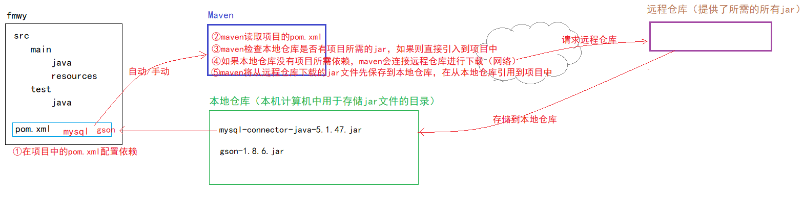


## Maven仓库介绍

1. 本地仓库（Local Repository）：本地仓库是位于开发者本地计算机上的一个目录，用于存储 Maven 下载的依赖库。默认情况下，本地仓库位于用户主目录下的 ".m2" 目录。本地仓库用于缓存项目所需的依赖库，以便在构建过程中重复使用，也可以用来部署本地构件；
2. 中央仓库（Central Repository）：中央仓库是 Maven 社区维护的一个公共仓库，包含了大量的开源依赖库。当 Maven 构建项目时，如果在本地仓库中找不到所需的依赖库，它会自动从中央仓库下载并存储到本地仓库中。中央仓库是 Maven 默认使用的主要依赖库存储位置；
3. 远程仓库（Remote Repository）：远程仓库是指位于网络上的其他仓库，它可以是公共的（例如中央仓库）、私有的或第三方维护的仓库。在项目的 POM 文件中，你可以指定其他远程仓库的位置，以获取特定的依赖库。Maven 会根据配置自动从远程仓库下载所需的依赖库，并存储到本地仓库中；
4. 仓库管理器（Repository Manager）：仓库管理器是一个用于管理和提供仓库服务的工具或平台。它可以用于创建私有仓库、代理远程仓库、缓存和共享依赖库等。一些流行的仓库管理器包括 Nexus、Artifactory 和 Archiva；
5. 私服：企业搭建的供内部使用的maven仓库；

这些仓库概念一起构成了 Maven 构建和依赖管理的基础。通过本地仓库和远程仓库的结合，Maven 可以方便地下载、缓存和共享依赖库，使项目的构建过程更加高效和可靠。

| maven仓库                                             |
| ----------------------------------------------------- |
| 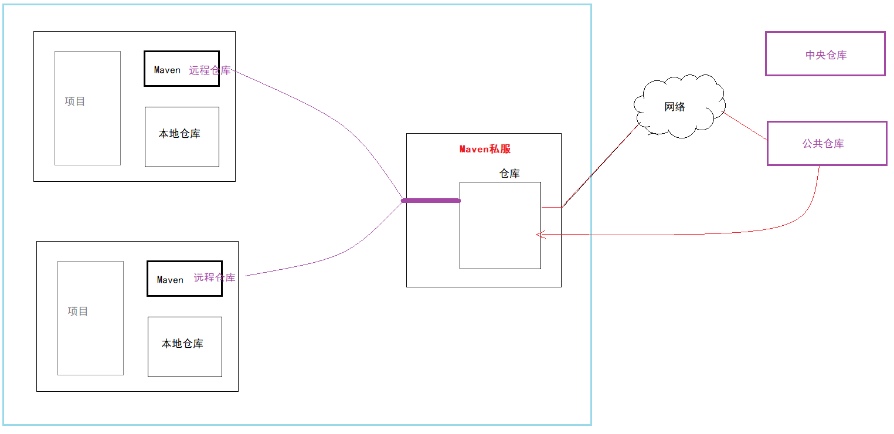 |


## Maven仓库配置

在 `maven_home/conf/settings.xml` 中进行配置

### 配置本地仓库

```xml
<localRepository>d:\repo</localRepository>
```

### 配置镜像

```xml
<mirrors>
	<mirror>
		<id>nexus-aliyun</id>
		<mirrorOf>central</mirrorOf>
		<name>Nexus aliyun</name>
		<url>http://maven.aliyun.com/nexus/content/groups/public</url>
	 </mirror>
</mirrors>
```

### 阿里中央仓库

```xml
<repository>  
    <id>alimaven</id>
    <name>aliyun maven</name>
    <url>http://maven.aliyun.com/nexus/content/groups/public/</url>
</repository>
```

### camunda.com 中央仓库

```xml
<repository>
    <id>activiti-repos2</id>  
    <name>Activiti Repository 2</name>  
    <url>https://app.camunda.com/nexus/content/groups/public</url>  
</repository>  
```

### spring.io 中央仓库

```xml
<repository>  
    <id>springsource-repos</id>  
    <name>SpringSource Repository</name>  
    <url>http://repo.spring.io/release/</url>
</repository>
```

### maven.apache.org

```xml
<repository>
    <id>central-repos</id>
    <name>Central Repository</name>
    <url>http://repo.maven.apache.org/maven2</url>
</repository>
```

### maven.org 中央仓库

```xml
<repository>
    <id>central-repos1</id>
    <name>Central Repository 2</name>
    <url>http://repo1.maven.org/maven2/</url>
</repository>
```

### alfresco.com 中央仓库（第3推荐使用）

```xml
<repository>
    <id>activiti-repos</id>
    <name>Activiti Repository</name>
    <url>https://maven.alfresco.com/nexus/content/groups/public</url>
</repository>  
```

### oschina 中央仓库（需要x墙哟）

```xml
<repository>  
    <id>oschina-repos</id>  
    <name>Oschina Releases</name>  
    <url>http://maven.oschina.net/content/groups/public</url>
</repository>  
```

### oschina thinkgem 中央仓库

```xml
<repository>
    <id>thinkgem-repos</id>
    <name>ThinkGem Repository</name>
    <url>http://git.oschina.net/thinkgem/repos/raw/master</url>
</repository> 
```

### java.net 中央仓库

```xml
<repository>
    <id>java-repos</id>
    <name>Java Repository</name>
    <url>http://download.java.net/maven/2/</url>
</repository>
```

### github.com 中央仓库

```xml
<repository>
    <id>thinkgem-repos2</id>
    <name>ThinkGem Repository 2</name>
    <url>https://raw.github.com/thinkgem/repository/master</url>
</repository>  
```

### jcenter仓库

是一个由 bintray.com维护的Maven仓库，可以在这里看到整个仓库的内容。

```http
https://oss.sonatype.org/content/repositories/releases/
```


## 依赖传递(Transitive Dependencies)

依赖传递(Transitive Dependencies)是Maven 2.0开始的提供的特性，依赖传递的好处是不言而喻的，可以让我们不需要去寻找和发现所必须依赖的库，而是将会自动将需要依赖的库帮我们加进来。

例如A依赖了B，B依赖了C和D，那么你就可以在A中，像主动依赖了C和D一样使用它们。并且传递的依赖是没有数量和层级的限制的，非常方便。

但依赖传递也不可避免的会带来一些问题，例如：
- 当依赖层级很深的时候，可能造成循环依赖（cyclic dependency）；
- 当依赖的数量很多的时候，依赖树会非常大；

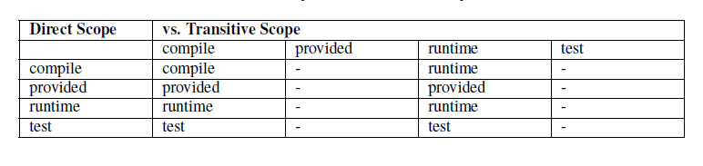


## 依赖调节(Dependency mediation)

依赖调节是为了解决版本不一致的问题(multiple versions)，并采取就近原则(nearest definition)。

举例来说，A项目通过依赖传递依赖了两个版本的D：

A -> B -> C -> ( D 2.0) , A -> E -> (D 1.0),

那么最终A依赖的D的version将会是1.0，因为1.0对应的层级更少，也就是更近。


## 依赖管理(Dependency management)

主要目的是进行版本管理，在父项目中使用 depedencyManagement 声明依赖，子工程引入依赖不需要声明版本。

如果不在子项目中声明依赖，是不会从父项目中继承下来的；

如果在子项目中引入了依赖，但是没有指定具体版本，这时候才会从父项目中继承相应依赖，以及相应的version和scope；

如果在子项目中引入了依赖，并且指定了版本号，那么会使用子项目中指定的版本，不再使用父项目指定的依赖版本号；

例如：

父工程是一个如下所示的POM工程：

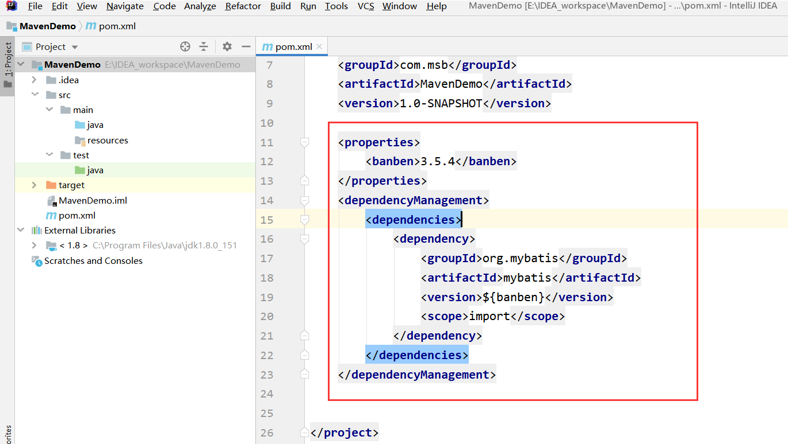

创建子工程：

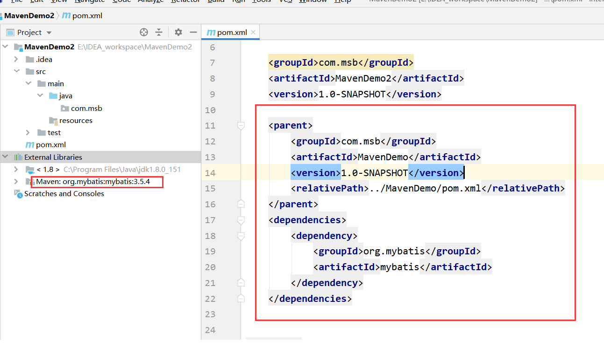

本质上：POM文件的继承 


## 依赖范围(Dependency scope)

- compile

  如果没有指定依赖范围时，默认使用 scope

  在项目的编译、测试、运行三种阶段都会使用，打包的时候通常需要包含进去。

- test

  只在maven的测试阶段有效。

  典型例子是JUnit，只有在编译测试代码及运行测试的时候才需要。

- provided

  依赖包在编译和测试阶段有效，打包的时候不会包进去。

  比如servlet-api，编译和测试项目的时候需要该依赖，但在运行项目的时候，由于容器已经提供，就不需要Maven重复地引入一遍。

- runtime

  表示依赖的包，在编译阶段不可用，在测试和运行阶段可以使用。

  一般scope为runntime。另外runntime的依赖通常和optional搭配使用，optional为true。我可以用A实现，也可以用B实现。

- system: 系统依赖范围。

  该依赖与三种classpath的关系，和provided依赖范围完全一致。

  但使用system范围依赖时必须通过systemPath元素显式地指定依赖文件的路径。

  由于此类依赖不是通过Maven仓库解析的，而且往往与本机系统绑定，可能造成构建的不可移植，因此应该谨慎使用。

  systemPath元素可以引用环境变量：

  ```xml
  <dependency>
        <groupId>com.system</groupId>
        <artifactId>foo</artifactId>
        <version>1.0</version>
        <scope>system</scope>
        <systemPath>${maven.home}/lib/foo.jar</systemPath>
    </dependency>
  ```

- import(Maven 2.0.9及以上): 导入依赖范围。

  注意：import scope只能用在dependencyManagement里面

  maven的继承和java是一样的，只能单继承。因此，父pom可能非常庞大，如果你想把依赖分类清晰的进行管理，就更不可能了。

  import scope依赖能解决这个问题。

  可以把Dependency Management放到用来单独管理依赖的pom中，然后在其他模块中用 import 引入依赖，就可以引入dependencyManagement。

  ```xml
  <project>
    <modelVersion>4.0.0</modelVersion>
    <groupId>com.test.sample</groupId>
    <artifactId>base-parent1</artifactId>
    <packaging>pom</packaging>
    <version>1.0.0-SNAPSHOT</version>
    
    <dependencyManagement>
      <dependencies>
        <dependency>
        <groupId>junit</groupId>
        <artifactid>junit</artifactId>
        <version>4.8.2</version>
      </dependency>
      
      <dependency>
        <groupId>log4j</groupId>
        <artifactid>log4j</artifactId>
        <version>1.2.16</version>
      </dependency>
      </dependencies>
    </dependencyManagement>
  </project>
  ```

  通过非继承的方式来引入这段依赖管理配置：

  ```XML
  <dependencyManagement>
    <dependencies>
    <dependency>
      <groupId>com.test.sample</groupId>
      <artifactid>base-parent1</artifactId>
      <version>1.0.0-SNAPSHOT</version>
      <type>pom</type>
      <scope>import</scope>
    </dependency>
    </dependencies>
  </dependencyManagement>
  
  <dependency>
    <groupId>junit</groupId>
    <artifactid>junit</artifactId>
    </dependency>
    <dependency>
    <groupId>log4j</groupId>
    <artifactid>log4j</artifactId>
  </dependency>
  ```

  

## 排除依赖(Excluded dependencies)

排除不需要从所依赖的项目中传递过来的依赖。

假设存在这样的依赖关系，A 依赖于 B，B 依赖于 X，B 又依赖于 Y。B 实现了两个特性，其中一个特性依赖于 X，另一个特性依赖于 Y，且两个特性是互斥的关系，用户无法同时使用两个特性，所以 A 需要排除 X，此时就可以在 A 中将间接依赖 X 排除。示例代码如下。

```xml
<project xmlns="http://maven.apache.org/POM/4.0.0" xmlns:xsi="http://www.w3.org/2001/XMLSchema-instance"
         xsi:schemaLocation="http://maven.apache.org/POM/4.0.0 http://maven.apache.org/xsd/maven-4.0.0.xsd">
    <modelVersion>4.0.0</modelVersion>
    <groupId>net.biancheng.www</groupId>
    <artifactId>A</artifactId>
    <version>1.0-SNAPSHOT</version>

    <dependencies>
        <dependency>
            <groupId>net.biancheng.www</groupId>
            <artifactId>B</artifactId>
            <version>1.0-SNAPSHOT</version>
            <exclusions>
                <!-- 设置排除 -->
                <!-- 排除依赖必须基于直接依赖中的间接依赖设置为可以依赖为 false -->
                <!-- 设置当前依赖中是否使用间接依赖 -->
                <exclusion>
                    <!--设置具体排除-->
                    <groupId>net.biancheng.www</groupId>
                    <artifactId>X</artifactId>
                </exclusion>
            </exclusions>
        </dependency>
    </dependencies>
</project>
```


排除父项目中的依赖

```xml
<dependency>
  <groupId>org.sonatype.sisu</groupId>
  <artifactId>sisu-inject-bean</artifactId>
  <exclusions>
    <exclusion>
      <groupId>*</groupId>
      <artifactId>*</artifactId>
    </exclusion>
  </exclusions>
</dependency>
```


## 可选依赖(Optional dependencies)

在Pom项目中通过配置，主动不把依赖传递给其他项目。

假设存在这样的依赖关系，A 依赖于 B，B 依赖于 X，B 又依赖于 Y。B 实现了两个特性，其中一个特性依赖于 X，另一个特性依赖于 Y，且两个特性是互斥的关系，用户无法同时使用两个特性， A 希望排除间接依赖 X，可以在 B 中将 X 设置为可选依赖。在 B 的 POM 关于 X 的依赖声明中使用 optional 元素，将其设置成可选依赖，示例配置如下。

```xml
<project xmlns="http://maven.apache.org/POM/4.0.0"
         xmlns:xsi="http://www.w3.org/2001/XMLSchema-instance"
         xsi:schemaLocation="http://maven.apache.org/POM/4.0.0 http://maven.apache.org/maven-v4_0_0.xsd">
    <modelVersion>4.0.0</modelVersion>
    <groupId>net.biancheng.www</groupId>
    <artifactId>B</artifactId>
    <packaging>jar</packaging>
    <version>1.0-SNAPSHOT</version>
    <dependencies>
        <dependency>
            <groupId>net.biancheng.www</groupId>
            <artifactId>X</artifactId>
            <version>1.0-SNAPSHOT</version>
            <!--设置可选依赖  -->
            <optional>true</optional>
        </dependency>
    </dependencies>
</project>
```


# 仓库管理

maven中的仓库分为两种，snapshot快照仓库和release发布仓库。

maven会根据版本号（pom文件中的version）中是否带有`-SNAPSHOT`来判断是快照版本还是正式版本。

如果是快照版，在 deploy 时会上传到快照仓库中。

如果是正式版自动上传到发布仓库中。


## 发布仓库（RELEASE）

发布仓库：是用来保存稳定的正式发行版本。

每次上传版本到发布仓库时，版本号必须是最新的，不能与仓库中已有版本号重复！


## 快照仓库（SNAPSHOT）

快照仓库：用于保存还在开发中或不稳定的版本。

每次发布版本到快照仓库时，版本号可以与仓库中已有的版本号重复！

快照仓库采用了一种特殊的版本管理方式，同一个版本号的快照可以上传到Maven仓库多次，但快照仓库会按上传的时间顺序对统一快照进行排序。如果pom依赖中指定了快照的版本号，则Maven 每次构建都会在远程仓库中检查同一版本号下的最新上传的快照jar包。


**上传快照方式：**

在pom文件中在该工程的版本号后加上`-SNAPSHOT`即可（注意这里必须是大写），如下所示：

```xml
<groupId>cc.mzone</groupId>
<artifactId>m1</artifactId>
<version>0.1-SNAPSHOT</version>
```

然后执行`mvn clean deploy` 上传jar包到maven仓库即可。

注意不能发布快照版到Maven中央仓库中，如下所示：

> Only *releases* can be uploaded to the Central Repository, that means files that won't change and that only depend on other files already released and available in the repository.
>
> 只有*releases*可以上传到中央存储库，这意味着文件不会更改，并且只依赖于存储库中已发布和可用的其他文件。


## 仓库配置

正式仓库与快照仓库的配置如下所示：

```xml
<distributionManagement>
    <snapshotRepository>
        <!-- 快照版本 -->
        <id>ossrh</id>
        <url>https://s01.oss.sonatype.org/content/repositories/snapshots/</url>
        <!-- 这里的 https://s01.oss.sonatype.org/ 是生成 sonatype 的issues工单时, 机器人评论的那个地址-->
    </snapshotRepository>
    <repository>
        <!-- 发布正式版 -->
        <id>ossrh</id>
        <url>https://s01.oss.sonatype.org/service/local/staging/deploy/maven2/</url>
    </repository>
</distributionManagement>
```

也需要在 setting.xml 文件里面定义用户名和密码

```xml
<services>
 <server>
    <id>ossrh</id>
		<username>user</username>
    <password>password</password>
 </server>
</servers>
```

如果发布仓库与快照仓库的`<id>`相同时，则只需要配置一个`<server>`，且`<id>`要与pom中发布仓库和快照仓库的`<id>`相同。

如果发布仓库与快照仓库的`<id>`不同时，则需要配置二个`<server>`，且`<id>`要分别与pom中发布仓库、快照仓库的`<id>`相同。


# 生命周期

每个任务实际上是由插件完成，插件是在pom.xml中使用plugins标签定义的，每个插件可以包含多个目标\<goal>。

注意如果绑定了多个插件目标，需要针对每个`<execution>`标签定义`<id>`标签（来区分不同的目标）。

MAVEN定义了三个标准的生命周期（clean、default/build、site），每个生命周期又包含了一系列**阶段**，生命周期中的某个阶段和插件的目标进行了默认绑定，当然生命周期的阶段与插件目标也支持自定义绑定。

| 生命周期 | 描述         | 阶段数量(个) |
| -------- | ------------ | ------------ |
| clean    | 用于清理项目 | 3            |
| default  | 用于构建项目 | 23           |
| clean    | 用于建立站点 | 4            |


mvn validate 验证，验证项目是正确的并且所有的信息是可用的；

mvn clean 清理，清理项目缓存输出，一般是target文件夹被删除；

mvn compile 编译，将java源文件编译成.class文件；

mvn test 测试，生成测试报告，运行test目录下的所有单元测试；

mvn package 打包，将项目打成jar、war或者pom；

mvn verify 验证，运行任何检查，验证包是否有效且达到质量标准；

mvn install 安装，将当前项目安装到本地maven库，供其他项目依赖；

mvn site：生成项目的文档网站，方便团队成员或用户查看和了解项目的结构、文档、报告等信息；

mvn deploy部署，在构建环境中完成，复制最终的包到远程库。

执行后面的命令会自动执行前面的命令，比如执行mvn package时会执行validate、clean、compile、test、package五个阶段。

Maven有三套相互独立的生命周期，分别是clean、default和site。每个生命周期包含一些阶段（phase），阶段是有顺序的，后面的阶段依赖于前面的阶段。


## **clean生命周期**

包含三个阶段（phase）：

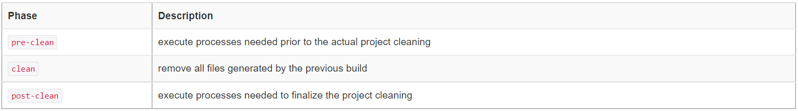


## default（或build）生命周期

共有23个阶段：

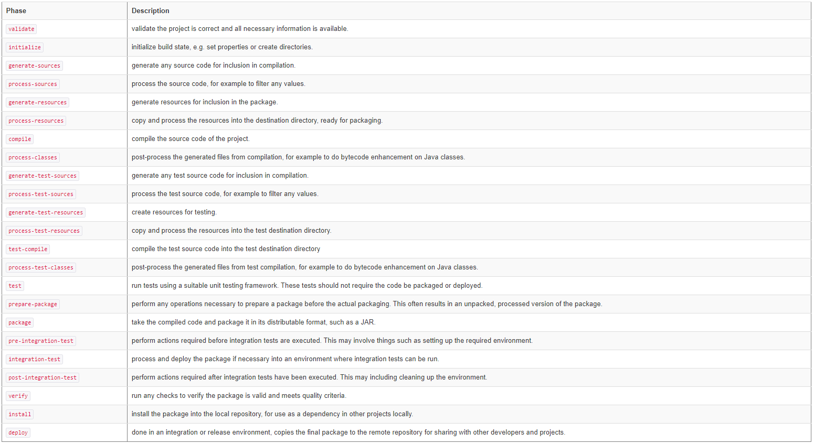

例如想要执行package阶段，那么maven会把default生命周期中package之前的阶段都顺序执行一遍，但不会执行clean生命周期中的阶段。


## **site生命周期**

共有4个阶段

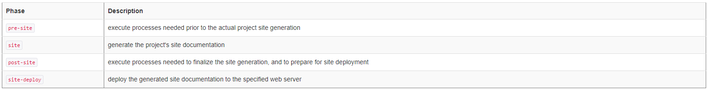


## 运行阶段

可以在工程根目录下（必须包含pom.xml）执行mvn命令来运行maven生命周期的阶段

```shell
$ mvn compile
```

命令默认执行deault生命周期的compile之前的所有阶段（含compile阶段），共7个阶段

```shell
$ mvn clean package
```

命令默认执行clean生命周期的clean之前的所有阶段（含clean阶段）和default生命周期package之前的所有阶段（含package阶段），共2 + 17个阶段。


# 插件

MAVEN是一个依赖插件执行的框架，生命周期中每个阶段实际上是由插件完成，插件是在pom.xml中使用plugins标签定义的，每个插件可以包含多个目标。


## 运行插件

用户可以通过两种方式调用Maven插件目标。

### 绑定运行

将插件目标与生命周期阶段（lifecycle phase）绑定，这样用户在命令行只是输入生命周期阶段而已，例如Maven默认将maven-compiler-plugin的compile目标与compile生命周期阶段绑定，因此命令mvn compile实际上是先定位到compile这一生命周期阶段，然后再根据绑定关系调用maven-compiler-plugin的compile目标。


### 直接运行

**可使用 “插件名:目标名” 的形式直接运行某插件中的某个目标。**

```shell
$ mvn dependency:copy-dependencies
```

命令默认执行了dependency插件的copy-dependencies目标。


### 混合运行

**阶段和插件目标也可以同时使用：**

```shell
$ mvn clean dependency:copy-dependencies package
```

命令默认执行clean生命周期的clean之前的所有阶段（含clean阶段）、dependency插件的copy-dependencies目标、default生命周期package之前的所有阶段（含package阶段）。


### 指定版本

可以在运行mvn命令时指定maven插件的版本，格式如下：

```shell
$ mvn groupID:artifactID:version:goal
```

例如：

```shell
$ mvn org.sonarsource.scanner.maven:sonar-maven-plugin:3.7.0.1746:sonar
```

如果希望执行本地仓库中，插件的最新版本，则version可以省略


### 简化调用

可以为插件分配快捷前缀，如果插件命名遵循了 `${prefix}-maven-plugin` 格式，则prefix自动为前缀。

例如插件信息如下：

```xml
<build>
  <plugins>
    <plugin>
      <groupId>sample.plugin</groupId>
      <artifactId>hello-maven-plugin</artifactId>
      <version>1.0-SNAPSHOT</version>
    </plugin>
  </plugins>
</build>
```

这个插件的调用命令可以简化为 `mvn sample.plugin:hello:sayhi`

可以将 groupId 添加到 `settings.xml` 的 `pluginGroups`标签中，如下：

```xml
<pluginGroups>
    <pluginGroup>sample.plugin</pluginGroup>
</pluginGroups>
```

这样就可以进一步省略组标识，调用命令简化为 `mvn hello:sayhi`


## 插件仓库

与项目依赖构件一样，插件同样基于坐标存储在 maven 仓库中，插件仓库使用 pluginRepositories 标签进行定义。

MAVEN内置的插件仓库如下：

```xml
<pluginRepositories>
   <pluginRepository>
       <id>central</id>
       <name>Maven Plugin Repository</name>
       <url>http://repo1.maven.org/maven2</url>
       <layout>default</layout>
       <snapshots>
           <enabled>false</enabled>
       </snapshots>
       <releases>
           <updatePolicy>never</updatePolicy>
       </releases>
   </pluginRepository>
</pluginRepositories>
```

一般情况下中央仓库包含了常用的插件，无需再配置其他的插件仓库。当项目使用的插件无法在中央仓库找到，或者自己编写了插件，这个时候可以在pom.xml或者settings.xml中加入其他的插件仓库配置。

**插件仓库的请求顺序**：本地仓库 -> 中央仓库(MAVEN缺省的远程插件仓库)  -> 远程仓库


## maven-surefire-plugin

官网：https://maven.apache.org/surefire/maven-surefire-plugin/index.html

`maven-surefire-plugin` 插件是 Apache Maven 构建工具的一个插件，主要用于执行项目中的单元测试。能够自动查找并运行项目中的测试类，并报告测试结果。以下是关于 `maven-surefire-plugin` 插件的一些重要信息：

1. **配置插件**：你可以在项目的 `pom.xml` 文件中配置 `maven-surefire-plugin` 插件，以定义测试的执行方式和其他相关设置。
2. **自动测试发现**：插件会自动查找项目中的测试类，通常测试类的命名约定是以 "Test" 结尾，例如 `MyClassTest.java`。
3. **支持多种测试框架**：`maven-surefire-plugin` 支持多种测试框架，包括 JUnit、TestNG 等。你可以选择适合你项目的测试框架，并配置插件以执行相应的测试。
4. **并行测试**：插件支持并行执行测试，这可以加速测试运行。你可以配置并发测试的线程数。
5. **报告生成**：插件会生成测试报告，包括测试通过率、测试失败、错误和跳过的测试等信息。这些报告通常位于 `target/surefire-reports` 目录下。
6. **超时和失败策略**：你可以配置测试超时时间，以及对于测试失败的策略，例如是否继续执行其他测试。
7. **参数传递**：你可以向测试类传递参数，这对于配置测试环境非常有用。

不显示配置就会用默认配置。 这个插件的surefire:test命令会默认绑定maven执行的test阶段。

默认情况下，Surefire插件将自动包含具有以下通配符模式的所有测试类：

- `"**/Test*.java"`-包括其所有子目录和所有以“测试”开头的Java文件名。
- `"**/*Test.java"`-包括其所有子目录和以“测试”结尾的所有Java文件名。
- `"**/*Tests.java"`-包括其所有子目录和所有以“测试”结尾的Java文件名。
- `"**/*TestCase.java"`-包括其所有子目录和以“TestCase”结尾的所有Java文件名。

如果测试类不遵循默认的通配符模式，则通过配置Surefire插件来覆盖它们，并指定要包含（或排除）或其他模式的测试。

```xml
<build>
   <plugins>
     <plugin>
       <groupId>org.apache.maven.plugins</groupId>
       <artifactId>maven-surefire-plugin</artifactId>
       <version>2.20</version>
       <configuration>
         <!-- 包含 -->
         <includes>
           <include>Sample.java</include>
         </includes>
         <!-- 排除 -->
         <excludes>
           <exclude>**/Abstract*.java</exclude>
         </excludes>
         
         <!-- 提高单元测试速度 -->
         	<argLine>-Xmx2G -XX:MaxPermSize=1G -XX:-UseSplitVerifier</argLine>
          <failIfNoTests>false</failIfNoTests>
          <parallel>classesAndMethods</parallel>
          <useUnlimitedThreads>true</useUnlimitedThreads>
       </configuration>
     </plugin>
   </plugins>
</build>
```

```
<plugin>
                <artifactId>maven-surefire-plugin</artifactId>
                <version>2.22.0</version>
                <configuration>
                    <argLine>-Xmx2G -XX:MaxPermSize=1G -XX:-UseSplitVerifier -XX:-TieredCompilation -XX:TieredStopAtLevel=1</argLine>
                    <parallel>methods</parallel>
                    <forkCount>3C</forkCount>
                    <reuseForks>true</reuseForks>
                    <threadCount>20</threadCount>
                </configuration>
            </plugin>

```


## maven-deploy-plugin

用于发布deploy包到maven仓库的插件。

对于不需要发布的包的处理：

```xml
<plugin>
    <groupId>org.apache.maven.plugins</groupId>
    <artifactId>maven-deploy-plugin</artifactId>
    <configuration>
        <skip>true</skip> <!-- 禁用插件 -->
    </configuration>
</plugin>
```


## maven-jar-plugin

打包插件

```XML
<plugin>
    <groupId>org.apache.maven.plugins</groupId>
    <artifactId>maven-jar-plugin</artifactId>
    <executions>
        <execution>
            <id>default-jar</id>
            <phase>none</phase> <!-- 禁用打包插件 -->
        </execution>
    </executions>
</plugin>
```


## maven-install-plugin

本地仓库安装插件

```xml
<plugin>
    <groupId>org.apache.maven.plugins</groupId>
    <artifactId>maven-install-plugin</artifactId>
    <configuration>
        <skip>true</skip> <!-- 禁用安装插件 -->
    </configuration>
</plugin>
```


## flatten-maven-plugin

从Maven 3.5.0-beta-1开始，使用这个插件可以在父工程与子模块的pom中，使用 `${revision}, ${sha1} ${changelist}` 变量作为版本占位符。

这样仅修改变量的值（如在运行mvn命令时指定）即可实现版本整体切换。

如果提示POM中有版本号错误，则重启下idea编辑器，重新执行`mvn clean install`

插件目标：

|                 |                                                              |
| --------------- | ------------------------------------------------------------ |
| flatten:clean   | 删除flatten插件生成的 .flattened-pom.xml<br>flattenedPomFilename: 插件生成的pom的名字，默认为` .flattened-pom.xml` <br>outputDirectory：插件生成pom的目录，默认为 ${project.basedir} |
| flatten:flatten | 在`resources-process`生成` .flattened-pom.xml`，并在install/deploy时替换原始pom.xml<br>flattenedPomFilename: 插件生成的pom的名字，默认为 .flattened-pom.xml<br/>outputDirectory：插件生成pom的目录，默认为 ${project.basedir}<br/>updatePomFile: packing=pom的module也进行reversion变量替换，默认为false<br/>flattenMode：用来定义生成 .flattened-pom.xml所包含的元素，常用值有：<br/>oss：开源软件常用，除了repositories/pluginRepositories外其他所有FlattenDescriptor定义的元素都生成<br/>ossrh：所有FlattenDescriptor定义的元素都生成<br/>bom：在ossrh基础上增加dependencyManagement和properties<br/>defaults：除了repositories其他所有FlattenDescriptor定义的元素都不生成<br/>clean：所有FlattenDescriptor定义的元素都不生成<br/>fatjar：所有FlattenDescriptor定义的元素和dependencies都不生成<br/>resolveCiFriendliesOnly：只替换原始pom中的revision, sha1 and changelist，其他否保持原样<br>常用oss/ossrh/resolveCiFriendliesOnly |

例如:

```xml
<groupId>icu.etl</groupId>
<artifactId>easyetl-dependencies</artifactId>
<version>${revision}</version>
...
<revision>2.0.0</revision>
...
<plugin>
    <groupId>org.codehaus.mojo</groupId>
    <artifactId>flatten-maven-plugin</artifactId>
    <version>1.2.7</version>
    <configuration>
        <updatePomFile>true</updatePomFile>
        <flattenMode>resolveCiFriendliesOnly</flattenMode>
    </configuration>
    <executions>
        <execution>
            <id>flatten</id>
            <phase>process-resources</phase>
            <goals>
                <goal>flatten</goal>
            </goals>
        </execution>
        <execution>
            <id>flatten-clean</id>
            <phase>clean</phase>
            <goals>
                <goal>clean</goal>
            </goals>
        </execution>
    </executions>
</plugin>
```


## maven-help-plugin

查看maven插件信息

```shell
mvn help:describe -Dplugin="groupId:artifactId:version"
```

命令行加上`-Ddetail`参数可以查看插件更详细的信息

```shell
mvn help:describe -Dplugin=icu.etl:easyetl-maven-plugin:2.0.0-SNAPSHOT -Ddetail
```

在得知插件前缀之后，可以简化命令

```shell
mvn help:describe -Dplugin=compiler
# 其中 compiler 是 maven-compiler-plugin 插件的前缀
```


## 插件开发


### 属性

#### 内置属性

```java
${basedir}表示项目根目录，即包含pom.xml文件的目录
${version}表示项目版本
${project.basedir}同${basedir};
${project.baseUri}表示项目文件地址;
${maven.build.timestamp}表示项目构件开始时间;
${maven.build.timestamp.format}表示属性${maven.build.timestamp}的展示格式,默认值为yyyyMMdd-HHmm,可自定义其格式,其类型可参考Java.text.SimpleDateFormat。用法如下：
<properties>
	<maven.build.timestamp.format>yyyy-MM-dd HH:mm:ss</maven.build.timestamp.format>
</properties>
```


#### 引用POM中的属性

```java
${project.build.sourceDirectory}:项目的主源码目录，默认为src/main/java/.
${project.build.testSourceDirectory}:项目的测试源码目录，默认为/src/test/java/.
${project.build.directory}:项目构建输出目录，默认为target/.
${project.outputDirectory}:项目主代码编译输出目录，默认为target/classes/.
${project.testOutputDirectory}:项目测试代码编译输出目录，默认为target/testclasses/.
${project.groupId}:项目的groupId.
${project.artifactId}:项目的artifactId.
${project.version}:项目的version,于${version}等价 
${project.build.finalName}:项目打包输出文件的名称，默认 为${project.artifactId}${project.version}
```


#### 自定属性

```xml
<project>
  <properties>
      <my.pro>proname</my.pro>
  </properties>
</project>
```

可以在依赖中使用自定义属性

```xml
<dependency>
  <groupId>org.springframework</groupId>
  <artifactId>spring-jdbc</artifactId>
  <version>${my.pro}</version> 
</dependency>
```


#### setting.xml文件属性

可以在pomx.xml中以 `settings.` 开头，来使用 settting.xml 中的属性

```properties
${settings.localRepository}：表示本地仓库的地址
```


#### java系统属性

```properties
${user.home}表示用户目录
```

使用mvn help:system命令可查看所有的Java系统属性;


#### 使用环境变量

可以在pomx.xml中以 `env.` 开头，来使用 Java系统属性

```xml
${env.JAVA_HOME}表示JAVA_HOME环境变量的值
```


### 参数

```xml
<plugin>
    <groupId>icu.etl</groupId>
    <artifactId>easyetl-maven-plugin</artifactId>
    <version>${easyetl.project.version}</version>
    <extensions>true</extensions>
    <executions>
        <execution>
            <id>uninstall-project</id>
            <phase>clean</phase>
            <goals>
                <goal>uninstall</goal>
            </goals>
        </execution>
    </executions>
    <configuration>
        <version>all</version> <!-- version对应插件目标的参数名 -->
    </configuration>
</plugin>
```


### 注解

```java
import org.apache.maven.execution.MavenSession;
import org.apache.maven.plugin.AbstractMojo;
import org.apache.maven.plugin.MojoExecution;
import org.apache.maven.plugin.descriptor.PluginDescriptor;
import org.apache.maven.plugins.annotations.Component;
import org.apache.maven.plugins.annotations.Execute;
import org.apache.maven.plugins.annotations.InstantiationStrategy;
import org.apache.maven.plugins.annotations.LifecyclePhase;
import org.apache.maven.plugins.annotations.Mojo;
import org.apache.maven.plugins.annotations.Parameter;
import org.apache.maven.plugins.annotations.ResolutionScope;
import org.apache.maven.project.MavenProject;
import org.apache.maven.settings.Settings;
 
// 此Mojo对应的目标的名称
@Mojo( name = "<goal-name>",
       aggregator = <false|true>, 
       configurator = "<role hint>",
       // 执行策略
       executionStrategy = "<once-per-session|always>",
       inheritByDefault = <true|false>,
       // 实例化策略
       instantiationStrategy = InstantiationStrategy.<strategy>,
       // 如果用户没有在POM中明确设置此Mojo绑定到的phase，那么绑定一个MojoExecution到那个phase
       defaultPhase = LifecyclePhase.<phase>,
       // 在运行mojo之前必须解析所有指定范围的依赖，如maven-surefire-plugin的test目标带有requiresDependencyResolution test标注，表示执行测试前，所有测试范围的依赖必须得到解析
       requiresDependencyResolution = ResolutionScope.<scope>,
       // 
       requiresDependencyCollection = ResolutionScope.<scope>,
       // 为true时，该目标就只能通过命令行直接调用（而非绑定到生命周期阶段）,默认为false
       requiresDirectInvocation = <false|true>,
       // 提示此Mojo不能在离线模式下运行,默认false
       requiresOnline = <false|true>,
       // 该目标是否必须在一个maven项目中运行（如测试插件用于测试其他项目），默认为true。大部分插件目标需依赖一个项目才能运行，但是，maven-help-plugin的system目标例外，它用来显示系统属性和环境变量信息，无需实际项目。
       requiresProject = <true|false>,
       // 提示此Mojo是否线程安全，线程安全的Mojo支持在并行构建中被并发的调用
       threadSafe = <false|true> ) // (since Maven 3.0)
       // 当mojo在多模块项目上运行时，该标注表示目标只会在顶层模块运行。
       aggregator
       
 
// 何时执行此Mojo
@Execute( goal = "<goal-name>",           // 在运行该目标之前，让maven运行另外一个目标。如果是本插件目标，则直接调用目标名称，否则，使用“prefix:goal”
          phase = LifecyclePhase.<phase>, // 在运行该目标前，让maven先运行一个并行的生命周期，到指定的阶段为止。到phase执行完，才执行插件目标
          lifecycle = "<lifecycle-id>" )  // 在运行该目标前，让maven先运行一个自定义的生命周期，到指定的阶段为止。
public class MyMojo
    extends AbstractMojo
{
    
    @Parameter( name = "parameter", // 参数名
                // 在POM中可使用别名来配置参数
                alias = "myAlias",
                property = "a.property", // 可以使用 -Da.property= 来设置参数值
                defaultValue = "an expression, possibly with ${variables}", // 默认值
                readonly = <false|true>, // 只读，不能修改参数值
                required = <false|true> ) // true表示必须设置这个参数
    private String parameter;
 
    @Component( role = MyComponentExtension.class,
                hint = "..." )
    private MyComponent component;
 
    @Parameter( defaultValue = "${session}", readonly = true )
    private MavenSession session;
 
    @Parameter( defaultValue = "${project}", readonly = true )
    private MavenProject project;
 
    @Parameter( defaultValue = "${mojoExecution}", readonly = true )
    private MojoExecution mojo;
 
    @Parameter( defaultValue = "${plugin}", readonly = true )
    private PluginDescriptor plugin;
 
    @Parameter( defaultValue = "${settings}", readonly = true )
    private Settings settings;
 
    @Parameter( defaultValue = "${project.basedir}", readonly = true )
    private File basedir;
 
    @Parameter( defaultValue = "${project.build.directory}", readonly = true )
    private File target;
 
    public void execute()
    {
    }
}
```


#### @Mojo

`inheritByDefault` 属性用于指定插件目标（Mojo）是否应该默认继承自父类的配置信息。这个属性允许您控制插件目标是否应该继承父级插件目标的配置，以便在子模块中无需再次定义相同的配置。

`inheritByDefault` 属性接受一个布尔值，通常有两个主要选项：

1. `true`：表示插件目标应该默认继承自父类的配置信息。这意味着如果父模块中已经定义了插件目标的配置，子模块可以继承这些配置而无需再次定义。
2. `false`：表示插件目标不应该默认继承自父类的配置信息。这意味着子模块需要在自己的配置中明确定义插件目标的配置，而不会继承父模块的配置。

以下是一个示例，演示如何在 `@Mojo` 注解中使用 `inheritByDefault` 属性：

```
javaCopy code
import org.apache.maven.plugin.AbstractMojo;
import org.apache.maven.plugins.annotations.Mojo;

@Mojo(name = "myMojo", inheritByDefault = true)
public class MyMojo extends AbstractMojo {

    // 插件目标的配置
}
```

在上面的示例中，我们将 `inheritByDefault` 设置为 `true`，表示 `myMojo` 插件目标默认会继承自父模块的配置信息。

这个属性通常用于帮助管理多模块项目中的插件配置。如果在多个子模块中使用相同的插件目标，并且希望它们默认继承自父模块的配置，那么将 `inheritByDefault` 设置为 `true` 可以减少重复配置的工作。但如果需要在子模块中覆盖父模块的配置，仍然可以在子模块的插件配置中明确定义相应的配置信息。

----

`configurator` 属性用于指定一个定制的配置器（configurator）类，该配置器类允许您自定义如何解析和应用插件配置。通常情况下，Maven 插件的配置是通过注解和 Java Bean 属性来定义的，但有时候，您可能希望更灵活地处理配置信息或执行自定义逻辑。

通过指定 `configurator` 属性，您可以提供一个类，该类实现了 `org.codehaus.plexus.configuration.PlexusConfiguration` 接口，以自定义配置的解析和处理。这样，您可以在配置信息到达插件时执行自定义的逻辑。

以下是一个示例，演示如何在 `@Mojo` 注解中使用 `configurator` 属性：

```
javaCopy code
import org.apache.maven.plugin.AbstractMojo;
import org.apache.maven.plugins.annotations.Mojo;
import org.codehaus.plexus.configuration.PlexusConfiguration;

@Mojo(name = "myMojo", configurator = "custom.MyConfigurator")
public class MyMojo extends AbstractMojo {

    private String customProperty;

    public void execute() {
        getLog().info("Custom Property: " + customProperty);
    }

    public void setCustomProperty(String customProperty) {
        this.customProperty = customProperty;
    }
}
```

在上面的示例中，我们指定了 `configurator` 属性为 `"custom.MyConfigurator"`，这意味着使用了一个自定义的配置器类 `custom.MyConfigurator`。

然后，您需要在指定的配置器类中实现自定义配置的解析和处理逻辑，该类必须实现 `org.codehaus.plexus.configuration.PlexusConfiguration` 接口。这个自定义配置器类负责将插件配置信息映射到插件类的属性。示例中没有提供完整的自定义配置器类代码，因为具体的实现取决于您的需求。

通过使用 `configurator` 属性，您可以更灵活地控制插件的配置过程，允许您执行自定义的逻辑，处理特殊的配置需求，或者与外部系统集成。但请注意，这是一种高级用法，通常只在需要特定配置处理的情况下才会使用。大多数 Maven 插件可以通过简单的 Java Bean 属性和注解来定义和处理配置，而不需要自定义配置器。

----

`@Mojo` 注解中的 `aggregator` 属性用于指定 Maven 插件是否应该以聚合（aggregator）方式运行。聚合插件是一种特殊类型的插件，它可以在 Maven 多模块项目中的顶层项目上执行，然后将该操作传播到所有子模块。

当您设置 `aggregator` 属性时，它接受一个布尔值，用于确定插件是否应该以聚合方式运行。通常，您将此属性设置为 `true` 或 `false`。

以下是两种可能的情况：

1. `aggregator = true`： 如果将 `aggregator` 设置为 `true`，则插件将以聚合方式运行。这意味着插件会首先在顶层项目上执行，然后传播到所有子模块，每个子模块都会执行相同的插件操作。这对于需要在整个多模块项目中执行某些操作的插件非常有用。

   ```
   javaCopy code
   import org.apache.maven.plugin.AbstractMojo;
   import org.apache.maven.plugins.annotations.Mojo;
   
   @Mojo(name = "myAggregatorMojo", aggregator = true)
   public class MyAggregatorMojo extends AbstractMojo {
   
       public void execute() {
           // 在聚合模式下执行的插件逻辑
       }
   }
   ```

2. `aggregator = false`（或未设置）： 如果将 `aggregator` 设置为 `false` 或者根本未设置（默认情况），则插件将在每个子模块上独立运行，不会传播到父项目或其他子模块。这对于只需要在单个子模块上执行操作的插件非常有用。

   ```
   javaCopy code
   import org.apache.maven.plugin.AbstractMojo;
   import org.apache.maven.plugins.annotations.Mojo;
   
   @Mojo(name = "myNonAggregatorMojo")
   public class MyNonAggregatorMojo extends AbstractMojo {
   
       public void execute() {
           // 在非聚合模式下执行的插件逻辑
       }
   }
   ```

要根据插件的具体需求和多模块项目的结构来决定是否将插件设置为聚合模式。聚合插件通常用于执行涉及整个项目的操作，而非聚合插件则用于执行与单个模块相关的操作。

----

 `requiresDependencyResolution` 属性用于指定 Maven 插件在执行时是否需要解析项目的依赖关系（dependency resolution）。这个属性允许您明确告诉 Maven 插件系统，在插件执行之前是否需要解析项目的依赖关系以及解析的级别。

`requiresDependencyResolution` 属性接受以下几个可能的值：

1. `ResolutionScope.NONE`（默认值）：插件不需要解析项目的依赖关系。这是默认值，适用于大多数插件，特别是那些不依赖于项目的依赖关系的插件。
2. `ResolutionScope.COMPILE`：插件需要解析项目的编译依赖关系。这意味着插件需要访问项目的编译依赖项，包括编译时需要的 JAR 文件等。
3. `ResolutionScope.RUNTIME`：插件需要解析项目的运行时依赖关系。这包括编译时和运行时需要的依赖项，通常是项目的类路径依赖。
4. `ResolutionScope.TEST`：插件需要解析项目的测试依赖关系。这包括编译、运行和测试时需要的所有依赖项。

例如，如果您的 Maven 插件需要访问项目的运行时依赖关系（包括类路径中的所有依赖项），您可以将 `requiresDependencyResolution` 属性设置为 `ResolutionScope.RUNTIME`，如下所示：

```java
import org.apache.maven.plugin.AbstractMojo;
import org.apache.maven.plugins.annotations.Mojo;
import org.apache.maven.plugins.annotations.ResolutionScope;

@Mojo(name = "myMojo", requiresDependencyResolution = ResolutionScope.RUNTIME)
public class MyMojo extends AbstractMojo {

    public void execute() {
        // 在这里可以访问项目的运行时依赖关系
    }
}
```

这将告诉 Maven 在执行插件之前解析项目的运行时依赖关系。根据插件的具体需求，您可以选择不同的解析级别。

注意：如果您的插件不需要访问项目的依赖关系，或者只需要部分依赖关系，可以将 `requiresDependencyResolution` 设置为适当的级别，以提高插件的性能。

-------------

`@Mojo` 注解中的 `requiresDependencyCollection` 属性用于指定 Maven 插件在执行时是否需要获取项目的依赖集合信息。这个属性允许您明确告诉 Maven 插件系统，在插件执行之前是否需要获取项目的依赖集合以及获取的级别。

`requiresDependencyCollection` 属性接受以下几个可能的值：

1. `DependencyResolution.NONE`（默认值）：插件不需要获取项目的依赖集合信息。这是默认值，适用于大多数插件，特别是那些不需要依赖集合信息的插件。
2. `DependencyResolution.INCLUDE`：插件需要获取项目的依赖集合信息。这意味着插件需要访问项目的依赖集合，包括依赖的坐标、范围等信息。

例如，如果您的 Maven 插件需要访问项目的依赖集合信息，以获取有关项目依赖的更多信息，您可以将 `requiresDependencyCollection` 属性设置为 `DependencyResolution.INCLUDE`，如下所示：

```
javaCopy code
import org.apache.maven.plugin.AbstractMojo;
import org.apache.maven.plugins.annotations.Mojo;
import org.apache.maven.plugins.annotations.DependencyResolution;

@Mojo(name = "myMojo", requiresDependencyCollection = DependencyResolution.INCLUDE)
public class MyMojo extends AbstractMojo {

    public void execute() {
        // 在这里可以访问项目的依赖集合信息
    }
}
```

这将告诉 Maven 在执行插件之前获取项目的依赖集合信息。根据插件的具体需求，您可以选择不同的依赖集合级别。

请注意，使用 `requiresDependencyCollection` 属性获取依赖集合信息可能会导致一定的性能开销，因为 Maven 需要在插件执行之前检索和处理依赖信息。因此，只有在插件确实需要这些信息时才应该设置为 `DependencyResolution.INCLUDE`。如果插件不需要依赖集合信息，将其保持为默认值 `DependencyResolution.NONE` 可以提高插件的性能。

-----


#### @Parameter

以下是一个示例

```java
import org.apache.maven.plugin.AbstractMojo;
import org.apache.maven.plugins.annotations.Mojo;
import org.apache.maven.plugins.annotations.Parameter;

@Mojo(name = "myMojo")
public class MyMojo extends AbstractMojo {

    @Parameter(property = "myPlugin.myParameter", defaultValue = "default-value", alias = "aliasName")
    private String myParameter; // 参数名叫 myParameter

    public void execute() {
        getLog().info("The value of myParameter is: " + myParameter);
    }
}
```

在上面的示例中，我们在 `@Parameter` 注解中为 `myParameter` 参数指定了一个别名 `"aliasName"`。这意味着用户可以在配置插件时使用 `myParameter` 或 `aliasName` 来设置参数的值，例如：

```xml
<configuration>
    <myParameter>custom-value</myParameter>
</configuration>
```

或

```xml
<configuration>
    <aliasName>custom-value</aliasName>
</configuration>
```

无论用户使用哪个名称，参数的值都将设置为 "custom-value"。

使用别名可以帮助提高插件的可用性和易用性，因为它允许用户选择他们更喜欢的名称来配置参数，而不仅仅受限于参数的原始名称。

-----

`@Parameter` 注解中的 `readonly` 属性用于指定插件参数是否为只读（read-only）。只读参数表示用户无法在插件配置中更改它们的值，它们通常由插件本身设置或计算。只读参数在某些情况下很有用，例如，当插件需要根据项目的其他属性自动计算某个值时。

以下是一个示例，演示如何在 `@Parameter` 注解中使用 `readonly` 属性：

```java
import org.apache.maven.plugin.AbstractMojo;
import org.apache.maven.plugins.annotations.Mojo;
import org.apache.maven.plugins.annotations.Parameter;

@Mojo(name = "myMojo")
public class MyMojo extends AbstractMojo {

    @Parameter(property = "myPlugin.readonlyParameter", readonly = true)
    private String readonlyParameter;

    public void execute() {
        getLog().info("The value of readonlyParameter is: " + readonlyParameter);
    }
}
```

在上面的示例中，我们在 `@Parameter` 注解中将 `readonly` 属性设置为 `true`，表示 `readonlyParameter` 参数是只读的。这意味着用户不能在插件配置中更改 `readonlyParameter` 的值，而是由插件自己设置或计算。

只读参数对于确保插件的一致性和可靠性非常有用，因为它们可以防止用户不经意地更改关键参数的值。如果插件的某个参数应该保持不变或由插件自行管理，那么可以考虑将其设置为只读。


### 执行

把插件的groupId添加到默认搜索的group配置文件中， 配置文件在${user.home}/.m2/settings.xml

```xml
<pluginGroups>
  <pluginGroup>sample.plugin</pluginGroup>
</pluginGroups>
```

此时，可以按以下格式执行

```shell
mvn hello:sayhi
```

按下面配置，执行compile阶段的时候，会执行sayhi目标。

```XML
<build>
  <plugins>
    <plugin>
      <groupId>sample.plugin</groupId>
      <artifactId>hello-maven-plugin</artifactId>
      <version>1.0-SNAPSHOT</version>
      <executions>
        <execution>
          <phase>compile</phase>
          <goals>
            <goal>sayhi</goal>
          </goals>
        </execution>
      </executions>
    </plugin>
  </plugins>
</build>
```

#### 查看插件的参数

大部分插件都支持help目标，输出插件支持的参数，如查看[javadoc](https://so.csdn.net/so/search?q=javadoc&spm=1001.2101.3001.7020)插件的javadoc目标的参数，执行下面的命令

```shell
mvn javadoc:help -Ddetail -Dgoal=javadoc
```

#### 通过命令行执行指定execution

```shell
mvn myqyeryplugin:queryMojo@execution1
```


### 类信息

FlattenDescriptor定义的pom.xml元素有：

```XML
modelVersion
groupId
artifactId
version
packaging
licenses
dependencies
profiles
name
description
url
inceptionYear
organization
scm
developers
contributors
mailingLists
pluginRepositories
issueManagement
ciManagement
distributionManagement
prerequisites
repositories
parent
build
dependencyManagement
properties
modules
reporting
```


### 内置绑定

Maven为实现快速构建、有一套内置的插件绑定。

常用的jar的构建过程：

```properties
process-resources	resources:resources
compile	compiler:compile
process-test-resources	resources:testResources
test-compile	compiler:testCompile
test	surefire:test
package	ejb:ejb or ejb3:ejb3 or jar:jar or par:par or rar:rar or war:war
install	install:install
deploy	deploy:deploy
```


### 自定义绑定

允许自己掌控插件目标与生命周期的结合，下面以生成项目主代码的源码jar为例。

```xml
<build>  
    <plugins>  
        <plugin>  
            <groupId>org.apache.maven.plugins</groupId>  
            <artifactId>maven-source-plugin</artifactId>  
            <version>2.1.1</version>  
            <executions>  
                <execution>  
                    <id>attach-sources</id>  
                    <phase>verify</phase>  
                    <goals>  
                        <goal>jar-no-fork</goal>  
                    </goals>
                </execution>
            </executions>
        </plugin>  
    </plugins>  
</build>  
```

一个生命周期阶段能绑定到多个插件目标，同理，一个插件目标也能绑定到多个生命周期阶段。


# profile

原文链接：https://blog.csdn.net/justry_deng/article/details/100537571

profiles是maven从POM4.0开始提供的一种新的特性，允许maven根据不同的环境采用不同的maven配置。

一个profiles标签中可以有很多个profile，只需要根据不同的项目环境，激活不同的profile即可。

每个profile标签中可以包含`<properties>`，`dependencies`，`<build>`，`<modules>`，`<dependencyManagement>`，`<pluginRepositories>`，`<distributionManagement>`等标签。

如果profile没有激活，则profile标签中配置的其他标签都是未激活、未被使用的。

**激活profile的方式有以下几种**

## 命令激活

使用mvn ... -P xxx 来指定激活id为xxx的profile。

如下所示：

```xml
<!-- 使用mvn ... -P xxx指令，指定激活id为xxx的profile -->
<profiles>
    <!-- 测试环境 -->
    <profile>
        <!-- profile唯一id -->
        <id>test-id</id>
        <!-- 引入fastjson依赖 -->
        <dependencies>
            <!-- fastjson -->
            <dependency>
                <groupId>com.alibaba</groupId>
                <artifactId>fastjson</artifactId>
                <version>1.2.58</version>
            </dependency>
        </dependencies>
    </profile>
 
    <!-- 生产环境 -->
    <profile>
        <!-- profile唯一id -->
        <id>prod-id</id>
        <!-- 引入lombok依赖 -->
        <dependencies>
            <!-- lombok -->
            <dependency>
                <groupId>org.projectlombok</groupId>
                <artifactId>lombok</artifactId>
                <optional>true</optional>
            </dependency>
        </dependencies>
    </profile>
</profiles>
```

打包时通过maven指令`mvn clean deploy -P test-id` 来激活profile。

如果需要激活多个profile的话，使用逗号隔开多个profile的id即可，如:`mvn clean deploy -P test-id,prod-id` 


## activation标签激活

activation标签，允许我们定义默认激活配置、定义条件激活（满足什么条件就进行激活）配置。


### activeByDefault默认激活

默认激活级别最低！

一旦其他某个激活指令（mvn指令激活或activation的其他条件激活）生效时，那么默认激活指令就会失效。

```xml
<!-- ************** 设置默认激活 ************** -->
<profiles>
    <!-- 测试环境 -->
    <profile>
        <id>test-id</id>
        <activation>
            <!-- 设置默认激活 -->
            <activeByDefault>true</activeByDefault>
        </activation>
        <dependencies>
            <dependency>
                <groupId>com.alibaba</groupId>
                <artifactId>fastjson</artifactId>
                <version>1.2.58</version>
            </dependency>
        </dependencies>
    </profile>
 
    <!-- 生产环境 -->
    <profile>
        <id>prod-id</id>
        <dependencies>
            <dependency>
                <groupId>org.projectlombok</groupId>
                <artifactId>lombok</artifactId>
                <optional>true</optional>
            </dependency>
        </dependencies>
    </profile>
</profiles>
```


### 根据jdk激活

```xml
<!-- ************** 根据jdk激活 ************** -->
<profiles>
    <!-- 测试环境 -->
    <profile>
        <id>test-id</id>
        <dependencies>
            <dependency>
                <groupId>com.alibaba</groupId>
                <artifactId>fastjson</artifactId>
                <version>1.2.58</version>
            </dependency>
        </dependencies>
    </profile>
 
    <!-- 生产环境 -->
    <profile>
        <id>prod-id</id>
        <activation>
            <!--
               当jdk的版本号是以下面的值开头时， 激活此profile
               即:当jdk的版本号是startWith下面的值时，激活此profile
             -->
            <jdk>1.8.0_</jdk>
            <!--
                还可以取反，当jdk的版本号 不是 startWith下面的值时，激活此配置
             -->
            <!-- <jdk>!1.8</jdk> -->
        </activation>
        <dependencies>
            <dependency>
                <groupId>org.projectlombok</groupId>
                <artifactId>lombok</artifactId>
                <optional>true</optional>
            </dependency>
        </dependencies>
    </profile>
</profiles>
```


### 根据os激活

```xml
<!-- ************** 根据os激活 ************** -->
<profiles>
    <!-- 测试环境 -->
    <profile>
        <id>test-id</id>
        <dependencies>
            <dependency>
                <groupId>com.alibaba</groupId>
                <artifactId>fastjson</artifactId>
                <version>1.2.58</version>
            </dependency>
        </dependencies>
    </profile>
 
    <!-- 生产环境 -->
    <profile>
        <id>prod-id</id>
        <activation>
            <!--
                当操作系统满足下述所有条件时，激活
                注: 如果有多个条件，那么必须所有条件都满足时，才会激活对应的profile
             -->
            <os>
                <!-- 操作系统名，如【Windows 10】 -->
                <name>Windows 10</name>
                <!-- 操作系统隶属， 如【windows】、【unix】 -->
                <family>windows</family>
                <!-- 操作系统的体系结构，如【amd64】 -->
                <arch>amd64</arch>
                <!-- 操作系统版本号，如【10.0】 -->
                <version>10.0</version>
            </os>
        </activation>
        <dependencies>
            <dependency>
                <groupId>org.projectlombok</groupId>
                <artifactId>lombok</artifactId>
                <optional>true</optional>
            </dependency>
        </dependencies>
    </profile>
</profiles
```

对于os的基本信息，可以这样获取：

```java
/**
 * 获取操作系统信息
 *
 * @date 2019/9/4 11:21
 */
private static void osInfo() {
    Properties osProperties = System.getProperties();
    // name-操作系统名，如【Windows 10】
    System.out.println(osProperties.get("os.name"));
 
    // family-操作系统隶属， 如【windows】、【unix】, 可根据name来获取
    System.out.println(
            osProperties.get("os.name").toString().startsWith("Window") ? "windows" : "unix"
    );
 
    // arch-操作系统的体系结构，如【amd64】
    System.out.println(osProperties.get("os.arch"));
 
    // version-操作系统版本号，如【10.0】
    System.out.println(osProperties.get("os.version"));
}
```


### 根文件激活

```xml
<!-- ************** 根据file存在与否激活 ************** -->
<profiles>
    <!-- 测试环境 -->
    <profile>
        <id>test-id</id>
        <dependencies>
            <dependency>
                <groupId>com.alibaba</groupId>
                <artifactId>fastjson</artifactId>
                <version>1.2.58</version>
            </dependency>
        </dependencies>
    </profile>
 
    <!-- 生产环境 -->
    <profile>
        <id>prod-id</id>
        <!--
            根据文件存在与否， 来激活profile
            注:文件路径可以是绝对路径，也可以是相对路径(相对pom.xml的路径)。
            注:在exists标签里，如果写绝对路径，不要使用${project.basedir}或
               ${pom.basedir};经本人测试，在exists标签里使用${}取不到值。
            注:missing与exists最好不要同时使用。 如果同时使用的话，missing就
               会形同虚设，是否激活此profile完全由exists决定,。
        -->
        <activation>
            <file>
                <!-- 相对路径示例 -->
                <exists>src/main/resources/xyza.yml</exists>
                <!-- <missing>src/main/resources/abcd.yml</missing> -->
 
                <!-- 绝对路径示例 -->
                <!-- <exists>C:/Users/JustryDeng/Desktop/zx-lw.log</exists> -->
                <!-- <missing>/usr/apps/file/info.properties</missing> -->
            </file>
        </activation>
        <dependencies>
            <dependency>
                <groupId>org.projectlombok</groupId>
                <artifactId>lombok</artifactId>
                <optional>true</optional>
            </dependency>
        </dependencies>
    </profile>
</profiles>
```


## 根据maven指令-D参数激活

```xml
<!-- ************** 根据 maven指令参数-D 激活 ************** -->
<profiles>
    <!-- 测试环境 -->
    <profile>
        <id>test-id</id>
        <dependencies>
            <dependency>
                <groupId>com.alibaba</groupId>
                <artifactId>fastjson</artifactId>
                <version>1.2.58</version>
            </dependency>
        </dependencies>
    </profile>
 
    <!-- 生产环境 -->
    <profile>
        <id>prod-id</id>
        <activation>
            <!--
                maven指令参数-D激活
                注:与根据maven指令参数-P 指定profile的id进行激活类似
            -->
            <property>
                <name>pk</name>
                <value>pv</value>
            </property>
        </activation>
        <dependencies>
            <dependency>
                <groupId>org.projectlombok</groupId>
                <artifactId>lombok</artifactId>
                <optional>true</optional>
            </dependency>
        </dependencies>
    </profile>
</profiles>
```

打包时通过maven指令`mvn clean deploy -D pk=pv ` 来激活profile。

如果想激活多个profile，可以这样：`mvn clean deploy -D pk=pv -D pk1=pv1`


## 激活方式

可以在项目的pom.xml中可以对profile进行配置激活。

可以在当前用户下的`.m2/settings.xml`文件里，对profile进行配置激活。

可以在maven安装目录下的`conf/settings.xml`文件里，对profile进行配置激活。

上述三者的区别是：

在项目的pom.xml中配置profile，那么配置的profile只对该项目有效；

在用户下的`.m2/settings.xml`文件里配置profile，那么配置的profile只对该用户下的(所有)项目有效；

在maven安装目录下的`conf/settings.xml`文件里配置profile，那么配置的profile对使用该maven程序的所有项目有效。


# 命令


## 查看有效POM

```shell
mvn help:effective-pom
```


## 选项


| 选项 | 长选项                               | 说明                                                         |
| ---- | ------------------------------------ | ------------------------------------------------------------ |
| -V   | --show-version                       | 显示版本信息后继续执行Maven其他目标                          |
| -v   | --version                            | 显示版本信息<br>这两个选项输出相同的版本信息，但-v选项在打印版本信息后会中断Maven处理。<br/>如果你想让Maven版本信息出现在构建输出的开始处，你应该使用-V选项。 |
| -P   | --activate-profiles<arg>             | 激活POM文件中的 profile，用逗号分隔多个 profile              |
| -o   | --offline                            | 离线模式工作，该参数可以阻止通过网络更新插件或依赖           |
| -f   | --file <file>                        | 强制使用备用的POM文件                                        |
| -s   | --settings <arg>                     | 用户配置文件的备用路径                                       |
| -gs  | --global-settings <file>             | 全局配置文件的备用路径                                       |
|      | **加密密码**                         | 下面的命令允许你使用Maven加密密码，然后存储到Maven settings文件里 |
| -emp | --encrypt-master-password <password> | 加密主安全密码                                               |
| -ep  | --encrypt-password <password>        | 加密服务器密码                                               |
|      | **失败处理**                         | 下面的选项控制，在多模块项目构建的中间阶段，Maven如何应对构建失败<br>-fn 和 -fae选项对于使用持续集成工具（例如Hunson）的多模块构建非常有用。 -ff 选项对于运行交互构建的开发者非常有用，因为开发者在开发周期中想得到快速的反馈。 |
| -fae | --fail-at-end                        | 仅影响构建结果，允许不受影响的构建继续                       |
| -ff  | --fail-fast                          | 遇到构建失败就停下来                                         |
| -fn  | --fail-never                         | 无论项目结果如何，构建从不失败                               |
|      | **日志级别**                         |                                                              |
| -e   | --errors                             | 产生执行错误相关消息，如果你是Maven开发者，或者你需要诊断Maven插件的一个错误，那么-e选项就会派上用场。如果你想报告Maven或Maven插件的一个未预料到的问题，你应该传递-X 和 -e命令行选项。 |
| -X   | --debug                              | 产生执行调试信息，选项会打印大量的调试日志消息，这个选项主要被Maven开发者和Maven插件开发者用来诊断在开发过程中碰到的Maven代码问题。如果你想诊断依赖或路径问题，-X 选项也非常有用 |
| -q   | --quiet                              | 仅仅显示错误，只有出现错误或问题，-q 选项才打印一条消息      |
|      | **批处理方式**                       |                                                              |
| -B   | --batch-mode                         | 在非交互（批处理）模式下运行<br>如果你需要在非交互、持续集成环境下运行Manve，必须要使用批处理模式。在非交互模式下运行，当Mven需要输入时，它不会停下来接受用户的输入，而是使用合理的默认值。 |
|      | **下载和验证**                       | 如果你关注安全，你就想带 -C选项运行Maven。Maven仓库为每个存储在仓库里的构件维护一个MD5 和 SHA1 校验码。如果构件的校验码不匹配下载的构件，Maven默认被配置成告警终端用户。如果传递-C 选项，当遇到带着错误校验码的构件，会引起Maven构建失败。如果你想确保Maven检查所有快照依赖的最新版本，-U选项非常有用。 |
| -C   | --strict-checksums                   | 如果校验码不匹配的话，构建失败                               |
| -c   | --lax-checksums                      | 如果校验码不匹配的话，产生告警                               |
| -U   | --update-snapshots                   | 在远程仓管更新发布版本或快照版本时，强制更新                 |
|      | **插件更新**                         | 选项告诉Maven，将如何从远程仓库更新（或不更新）Maven插件     |
| -npu | --no-plugin-updates                  | 对任何相关的注册插件，不进行最新检查。使用该选项使Maven表现出稳定行为，该稳定行为基于本地仓库当前可用的所有插件版本 |
| -cpu | -check-plugin-updates                | 对任何相关的注册插件，强制进行最新检查。强制Maven检查Maven插件的最新发布版本，即使在你的项目POM里明确规定了Maven插件版本，还是会强制更新 |
| -up  | --update-plugins                     | cpu的同义词                                                  |
|      | **下载方式**                         |                                                              |
| -npr | --no-plugin-registry                 | 对插件版本不使用~/.m2/plugin-registry.xml 里的配置，告诉Maven不要参考插件注册表 |
|      | **非递归构建**                       | 有时，你只想运行Maven构建，而不陷入项目子模块的构建          |
| -N   | --non-recursive                      | 阻止Maven构建子模块。仅仅构建当前目录包含的项目。<br>运行该命令行选项使Maven只为当前目录下的项目执行生命周期中的目标或步骤 |


## win10环境

可以使用命令行更改 Windows 10 中的字符集。可以使用 `chcp` 命令（"change code page"）来更改命令行的字符集。

下面是一些常用的字符集及其对应的命令：

- 437：美国 MS-DOS
- 65001：UTF-8
- 936：GBK

要将字符集更改为 UTF-8，你可以运行以下命令：

```shell
$ chcp 65001
```

执行maven命令

```shell
$ chcp 65001 & mvn -e clean jacoco:prepare-agent test sonar:sonar -Dsonar.projectKey=xxx -Dsonar.projectName=xxx -f pom.xml -s xxx/.m2/.settings.xml
```


# 与Springboot集成

比如想在SpringBoot中向使用POM中的属性，可在application.yml或者application.properties上用@project.XXX@

使用如下插件：

```xml
<plugin>
    <groupId>org.apache.maven.plugins</groupId>
    <artifactId>maven-resources-plugin</artifactId>
    <version>3.3.1</version>
    <configuration>
        <delimiters>@</delimiters>
        <useDefaultDelimiters>false</useDefaultDelimiters>
    </configuration>
</plugin>
```

build下面的

```xml
<resources>
    <resource>
        <directory>src/main/resources</directory>
        <filtering>true</filtering>
    </resource>
</resources>
```

在yaml的配置文件中像如下使用Maven版本号:

```yaml
project:
  version: @project.version@
```


# 基于IDEA的Maven使用


## 在IDEA中关联Maven

| maven配置                                             |
| ----------------------------------------------------- |
|  |
|  |

**说明：** IDEA本身集成了Maven，考虑到IDEA和Maven版本的兼容性，Idea不建议配置比默认版本更新的版本，建议使用IDEA自带的Maven。


## 使用IDEA创建Maven项目


### Java项目

| 创建Java项目                                          |
| ----------------------------------------------------- |
| 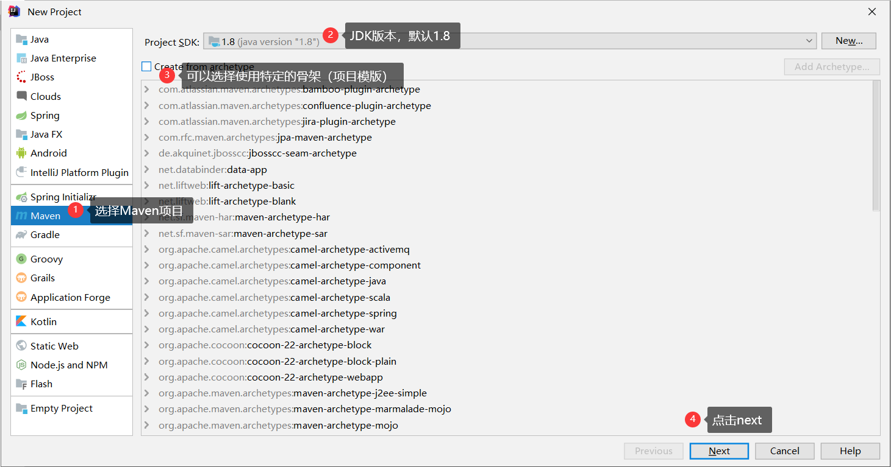 |
|  |
| 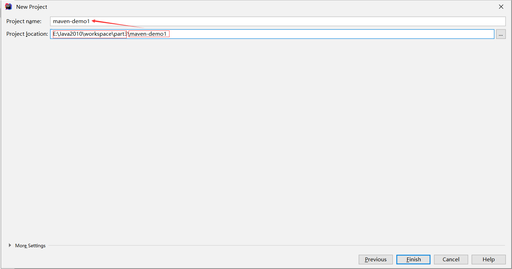 |


### web项目

**创建maven项目**：maven-demo2

**在pom.xml文件设置打包方式为war**

```xml
<?xml version="1.0" encoding="UTF-8"?>
<project xmlns="http://maven.apache.org/POM/4.0.0"
         xmlns:xsi="http://www.w3.org/2001/XMLSchema-instance"
         xsi:schemaLocation="http://maven.apache.org/POM/4.0.0 http://maven.apache.org/xsd/maven-4.0.0.xsd">
    <modelVersion>4.0.0</modelVersion>

    <groupId>com.qfedu</groupId>
    <artifactId>maven-demo2</artifactId>
    <version>1.0.0</version>

    <!--设置项目打包方式为war-->
    <packaging>war</packaging>

</project>
```

**完成web项目结构**


**配置web组件—Tomcat**


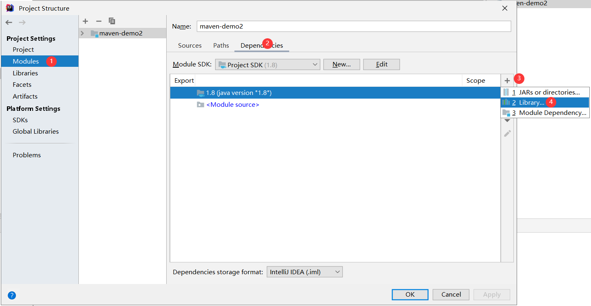


**部署web项目**


## 在IDEA中使用Maven进行依赖管理

### 查找依赖坐标

https://mvnrepository.com/


### 添加依赖

将依赖的坐标配置到项目的pom.xml文件`<dependencies></dependencies>`标签中。

```xml
<?xml version="1.0" encoding="UTF-8"?>
<project xmlns="http://maven.apache.org/POM/4.0.0"
         xmlns:xsi="http://www.w3.org/2001/XMLSchema-instance"
         xsi:schemaLocation="http://maven.apache.org/POM/4.0.0 http://maven.apache.org/xsd/maven-4.0.0.xsd">
    <modelVersion>4.0.0</modelVersion>
    <groupId>com.qfedu</groupId>
    <artifactId>maven-demo2</artifactId>
    <version>1.0.0</version>

    <!--设置项目打包方式为war-->
    <packaging>war</packaging>

    <dependencies>
        <!--在此位置配置项目中所需依赖的坐标 GAV-->
        <dependency>
            <groupId>com.google.code.gson</groupId>
            <artifactId>gson</artifactId>
            <version>2.8.5</version>
        </dependency>

        <dependency>
            <groupId>org.projectlombok</groupId>
            <artifactId>lombok</artifactId>
            <version>1.18.18</version>
            <scope>provided</scope>
        </dependency>
    </dependencies>
</project>
```


### 依赖范围

在通过`<dependency></dependency>`添加依赖时，可以通过`scope`标签配置当前依赖的适用范围。

- **test**  只在项目测试阶段引入当前依赖(编译、测试)

  ```xml
  <dependency>
      <groupId>junit</groupId>
      <artifactId>junit</artifactId>
      <version>4.13.2</version>
      <scope>test</scope>
  </dependency>
  ```

- **runtime** 只在运行时使用（运行、测试运行）；
- **provided** 在（编译、测试、运行）；
- **compile** 在（编译、测试、运行、打包）都引入；


## 在IDEA中使用Maven进行项目构建


### Maven项目构建生命周期说明

- clean 清理缓存  清理项目生成的缓存
- validate 校验  验证项目需要是正确的（项目信息、依赖）
- compile 编译  编译项目专供的源代码
- test 测试  运行项目中的单元测试
- package 打包  将项目编译后的代码打包成发布格式
- verify 检查  对集成测试的结果进行检查、确保项目的质量是达标的
- install 安装 将包安装到maven的本地仓库，以便在本地的其他项目中可以引用此项目（聚合工程）
- deploy  部署  将包安装到私服的仓库，以供其他开发人员共享


### IDEA进行生命周期管理

- 可视化

  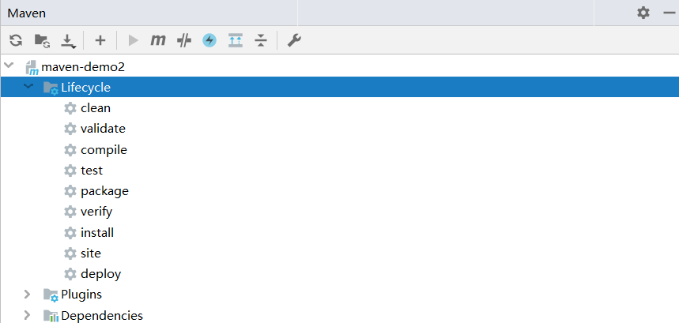

- 终端指令

  选择项目名称---右键---Open in Terminal

  mvn clean


## idea解除Maven项目

选中项目的pom.xml文件，右键，如下图：

依次点击【Add as Maven Project】——>【Unlink Maven Projects】，如下图：

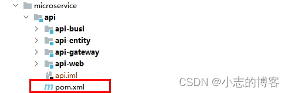

在弹出的【Unlink Maven Projects】窗口中，点击【Remove】


# 私服

企业搭建供内部使用的一个Maven仓库

- 开发者需要依赖直接从私服下载；
- 私服可以实现企业内部依赖的共享：当企业开发了一个通用插件（jar），可以发布到私服，可以连接到当前私服的其他开发者就可以共享这个插件了；


## 私服搭建

可以通过专门的Maven仓库管理软件来搭建私服。例如：Apache Archiva、Nexus。


### 下载Nexus

官网 https://www.sonatype.com/

下载 https://help.sonatype.com/repomanager2/download


### 解压nexus


### 安装并运行nexus

- 进入到`nexus-2.14.11-01/bin`目录；

- 管理员身份打开cmd命令行，执行指令；

  


### 登录Nexus

私服管理器登录地址： http://localhost:8081/nexus；

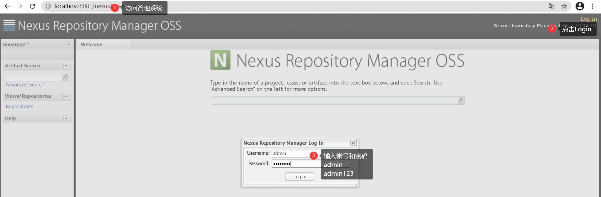

私服中仓库类型

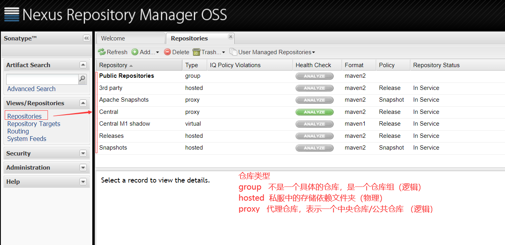

私服仓库组的配置

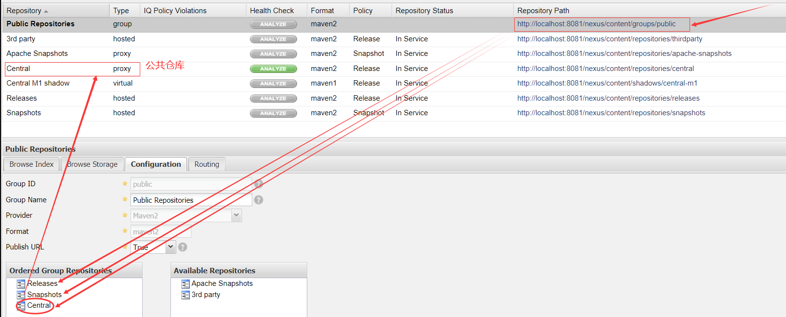

### 配置私服


1）在maven的settings.xml文件的`<server>`标签中

```xml
<!--配置连接私服所需的帐号和密码-->
<server> 
    <id>nexus-public</id> <!-- nexus的认证id -->
    <username>admin</username> <!--nexus中的用户名密码-->
    <password>admin123</password> 
</server>
```


2）在maven的settings.xml文件的`profiles`标签中

repository 和 pluginRepository的  id子标签的值，要和上面配置的server 的id子标签的值一致。

```xml
<profile> 
    <id>nexus</id> 
    <repositories> 
        <repository> 
            <id>nexus-public</id>      
            <name>Nexus Release Snapshot Repository</name>   
            <url>http://localhost:8081/nexus/content/groups/public/</url>
            <releases><enabled>true</enabled></releases> 
            <snapshots><enabled>true</enabled></snapshots> 
        </repository>
    </repositories> 
    <pluginRepositories>
        <pluginRepository> 
            <id>nexus-public</id> 
            <url>http://localhost:8081/nexus/content/groups/public/</url>
            <releases><enabled>true</enabled></releases> 
            <snapshots><enabled>true</enabled></snapshots> 
        </pluginRepository> 
    </pluginRepositories> 
</profile>
```


3）在maven的settings.xml文件的`activeProfiles`配置激活profile

```xml
 <activeProfiles>
	<activeProfile>nexus</activeProfile>
 </activeProfiles>
```


## Maven聚合工程

参考：https://zhuanlan.zhihu.com/p/592916489


### 简介

Maven 中可以创建 父工程（pom工程），子工程（非pom工程）

在 Maven 父工程中可以创建多个子工程，通过父工程对各个子工程做jar的统一管理和统一构建。

聚合工程的项目结构如下图所示：

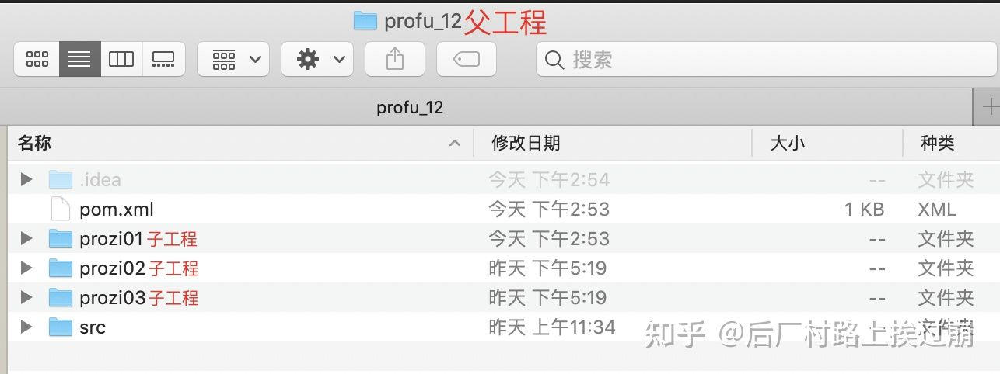


### 为什么

- 方便jar包管理,在父工程中管理依赖包,对版本做统一控制
- 方便构建,在父工程中执行构建命令,子工程会自动构建


### 创建聚合工程

#### 创建父工程

1. 创建父工程,修改pom文件(packaging 类型 修改为pom)

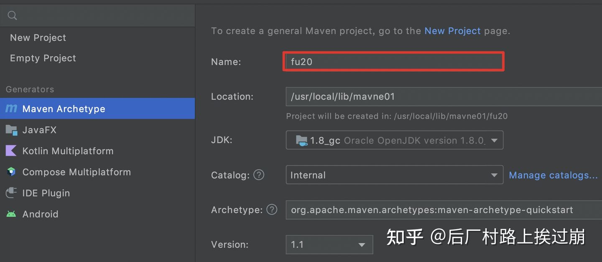

创建父工程

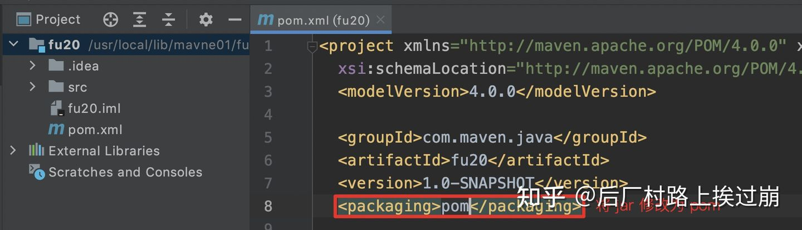

修改pom文件

2.查看pom.xml

```xml
    <!-- 打包方式必须指定为 pom方式,表示父工程 -->
    <packaging>pom</packaging>

    <!-- 表示 所管理的子工程-->
    <modules>
        <module>prozi01</module>
        <module>prozi02</module>
        <module>prozi03</module>
    </modules>
```


#### 创建子工程

1. File -> New -> Module...

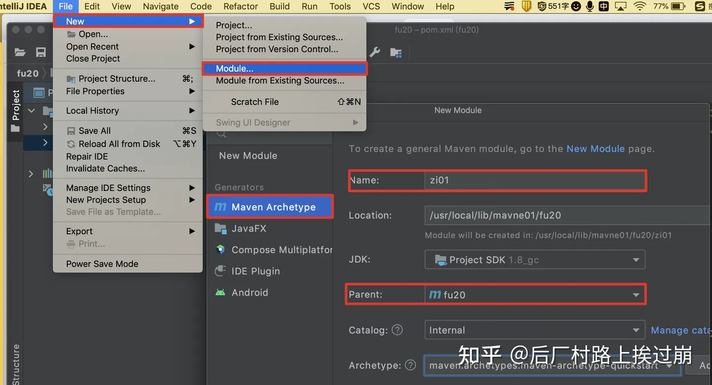

创建Module

查看pom.xml

```xml
    <!-- 父工程坐标 -->
    <parent>
        <groupId>com.maven.java</groupId>
        <artifactId>profu</artifactId>
        <version>1.0-SNAPSHOT</version>
    </parent>


    <!-- 子工程坐标(如果 groupId、version和父工程一致,子工程坐标可以省略)-->
    <!--    <groupId>com.maven.java</groupId>-->
    <artifactId>prozi01</artifactId>
    <!--    <version>1.0-SNAPSHOT</version>-->
    <!--    <packaging>jar</packaging>-->
```

父子项目关联，例如下图所示：

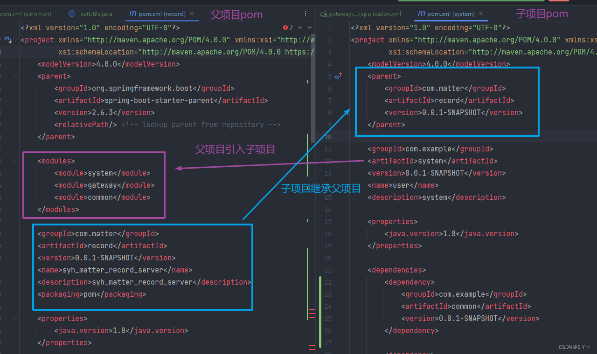


### 依赖统一管理


#### 父子工程中依赖的优先级

在父工程、子工程中配置 相同jar的不同版本，子工程优先使用本工程pom中配置的jar版本

如果子工程没有配置依赖，则使用父工程配置的jar版本。

```xml
<!-- fu工程 -->
<dependency>
    <groupId>com.gc.maven</groupId>
    <artifactId>pro01</artifactId>
    <version>v1</version>
</dependency>

<!-- zi01工程-->
<dependency>
    <groupId>com.gc.maven</groupId>
    <artifactId>pro01</artifactId>
    <version>v2</version>
</dependency>

<!-- zi02工程-->
<dependency>
    <groupId>com.gc.maven</groupId>
    <artifactId>pro01</artifactId>
    <version>v3</version>
</dependency>
```


#### dependencyManagement 标签

```xml
    <!-- 父工程中指定jar的版本信息 -->
    <!-- 被管理的依赖并没有真正的被引入到工程-->
    <dependencyManagement>

        <dependencies>
            <!-- zi01工程-->
            <dependency>
                <groupId>com.gc.maven</groupId>
                <artifactId>pro01</artifactId>
                <version>v1</version>
            </dependency>
        </dependencies>

    </dependencyManagement>

    <!-- 子工程中 使用 dependencyManagement中的依赖-->
    <dependencies>

        <!-- 子工程中引用父工程的依赖信息时,可以把版本号去掉 -->
        <!-- 具体版本号由 父工程中指定-->
        <dependency>
            <groupId>com.gc.maven</groupId>
            <artifactId>pro01</artifactId>
        </dependency>

    </dependencies>
```


### 怎样实现 统一构建的

```xml
    <!-- 通过 父工程pom文件中 配置的model,进行构建 -->
    <modules>
        <module>prozi03</module>
        <module>prozi02</module>
        <module>prozi01</module>
    </modules>

mvn dependency:list
[INFO] Scanning for projects...
[INFO] ------------------------------------------------------------------------
[INFO] Reactor Build Order:
[INFO] 
[INFO] profu                                                              [pom]
[INFO] prozi03                                                            [jar]
[INFO] prozi02                                                            [jar]
[INFO] prozi01                                                            [jar]
```


# 上传jar到中央仓库

参考以下链接：

https://cloud.tencent.com/developer/article/1929115

https://www.cnblogs.com/zimug/p/16575819.html

https://blog.csdn.net/qq_41011894/article/details/123406711

https://cloud.tencent.com/developer/article/2002816

https://blog.csdn.net/qq_23501739/article/details/131462588

https://developer.aliyun.com/article/935486


## 准备域名

因为maven仓库要求上传jar包，必须要有groupid，这个必须你自己真实用的一个域名，所以要先准备域名。方案如下：

- 可以用你自己的域名；

  如果有的话可以重复使用；

- 购买新的域名；

  购买流程：注册登录 https://www.gname.com/user ，挑选域名，支付宝付款，新建过户模版，将域名使用过户模版；

- 用github的域名；

  用github域名：注册一个github用户，io.github.XXX 就是后面用到的 groupid


## 注册账号

访问地址：https://issues.sonatype.org/secure/Signup!default.jspa，注册 sonatype  账号，之后一定要用帐号与密码登录sonatype仓库（https://s01.oss.sonatype.org/#welcome）来验证一下新帐号能登录仓库（有时候会因为系统原因导致新帐号不能登录sonatype仓库），如果不能登录则不能继续向下执行，需要重新注册一个新sonatype帐号。

注册页面填一下邮箱、姓名、用户名和密码后，点击sign up就完成了。

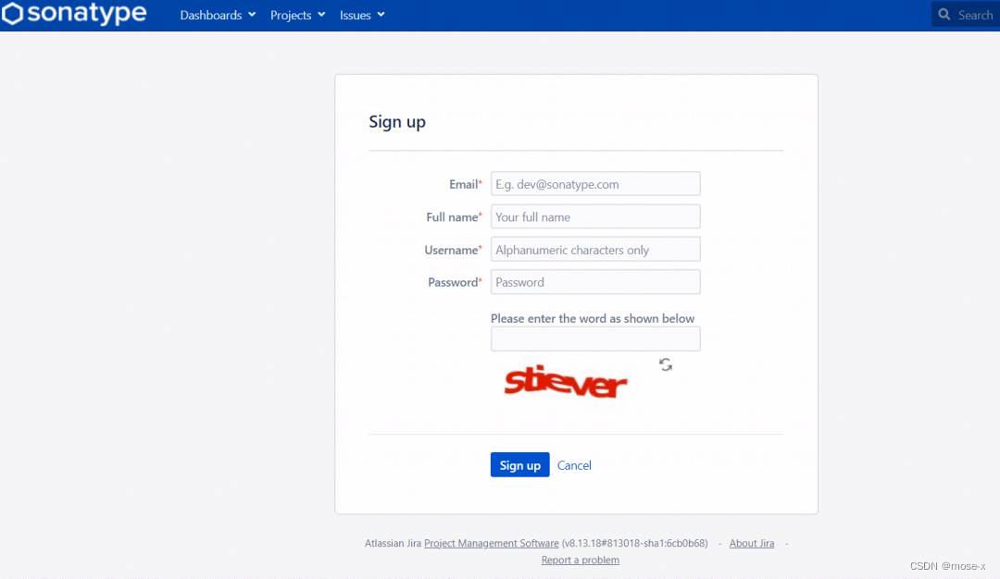


## 提交issue

登录完成后，语言可以选择中文，在system dashboard页面中，点击上方导航栏上的**新建按钮**，就可以创建一个 issue（工单）。

填写页面如下图所示：

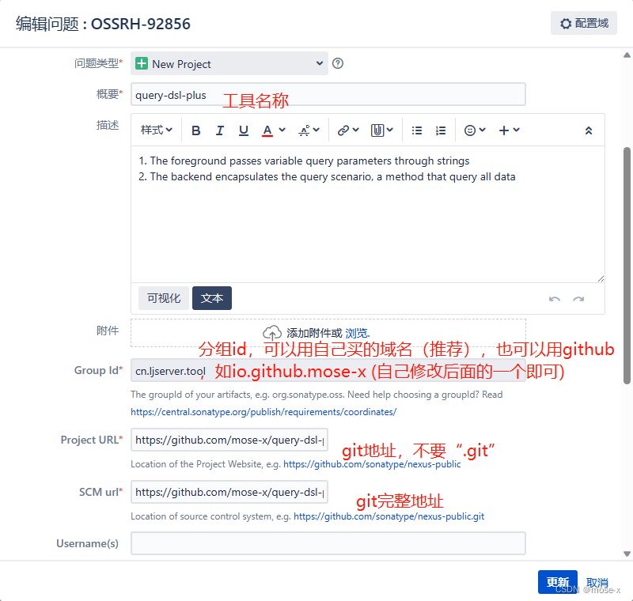

填写完后，点击新建即可（上图由于是已经提交了的，所以是更新按钮）。


## 等待回复

等待几分钟后，就会收到 OSSRH 的回复，如下图所示：

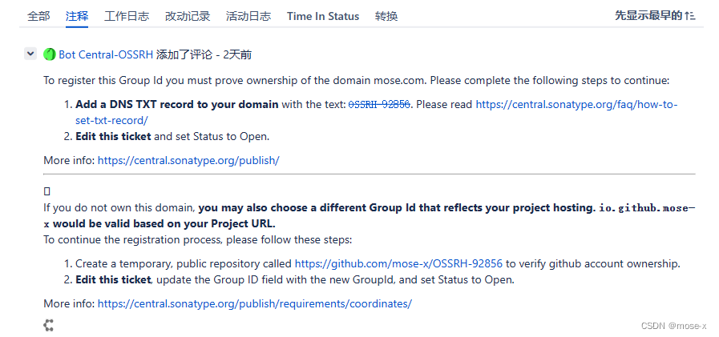

主要问题是 groupId 必须是你自己真实有效控制的一个域名或你自己的Github帐号的域名。


## 验证域名


### 域名解析验证

参考官方：https://central.sonatype.org/faq/how-to-set-txt-record/

如果是自己的域名，则需要在域名解析中增加 TXT的解析与项目主页，如下所示：

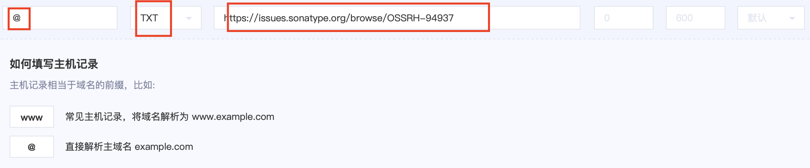

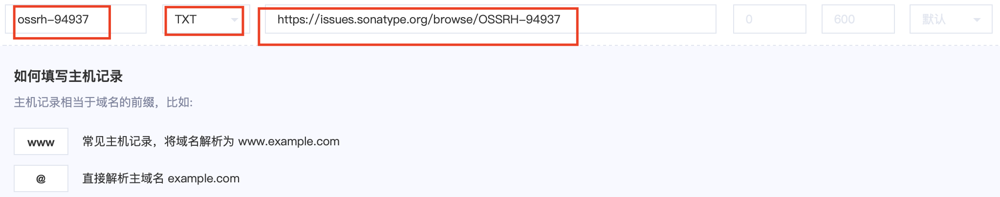

将对域名的请求转发到项目的主页链接上（就是前面在issue工单上填写的项目地址）。

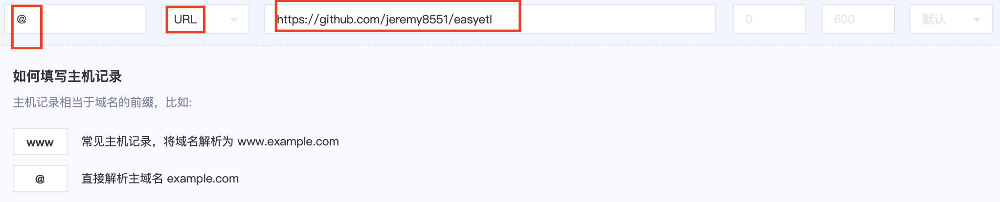

验证域名解析是否成功

```shell
$ nslookup -type=TXT ossrh-94937.etl.icu

Server:		172.20.10.1
Address:	172.20.10.1#53

Non-authoritative answer:
ossrh-95002.etl.icu	text = "https://issues.sonatype.org/browse/OSSRH-94937"
```


### 验证GitHub帐号

如果 groupid 是 io.github.mose-x 这种git域名，则需要新建一个公开的git仓库，如下两个图（网上找的）

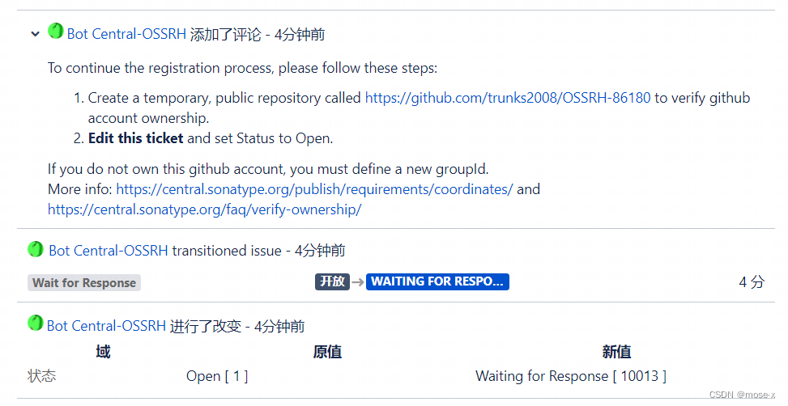


## 等待验证

域名验证操作完毕后，要到 sonatype 的工单页面点击 “waiting for Response” 按钮通知一下工作人员验证域名。


等待域名验证回复了，回复结果如下，则表示可以推送你的java工具了

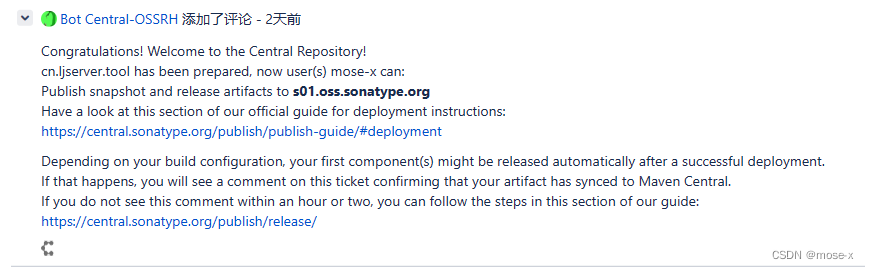


## GPG签名

接下来要用 gpg 生成秘钥，在后续包发布 jar 时会根据生成的秘钥进行校验，因为sonatype也需要对上传这一行为进行权健的校验，避免无意义或恶意上传文件的行为。


### 安装GPG

官网下载地址：https://www.gnupg.org/download/

window下安装：https://files.gpg4win.org/gpg4win-4.0.4.exe

MacOS下安装运行命令：`brew info gpg`


### 创建秘钥

```shell
# 查看版本来检查
$ gpg --version

# 生成密钥对
$ gpg --gen-key

# 查看生成的公钥
$ gpg --list-keys

# 将公钥发布到GPG密钥服务器
$ gpg --keyserver hkp://keyserver.ubuntu.com:11371 --send-keys 公钥ID

# 查询是否已将公钥发布到服务器
$ gpg --keyserver hkp://keyserver.ubuntu.com:11371 --recv-keys 公钥ID

# 删除密钥：先删私钥，再删除公钥
$ gpg --delete-secret-keys [uid]
$ gpg --delete-keys [uid]

# 导出公钥
$ gpg -a -o public-file.key --export [uid]
# 导出私钥
$ gpg -a -o private-file.key --export-secret-keys [uid]
# 导入公钥或私钥
$ gpg --import xxxx.key
```

在安装完成后，在命令行执行下面命令来生成一个秘钥：

```shell
$ gpg --gen-key
```

在生成的过程中，首先会要求输入姓名和邮箱地址，在命令行窗口下填完这两个信息后，还会弹窗要求输入一个密码：

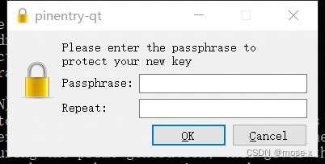

这个密码非常重要，一定要记住，后面在项目deploy的时候还会用到。填完后继续，秘钥就会成功生成并保存在本地目录下了：


可以使用如下命令查看生成的密钥：

```shell
$ gpg --list-keys
```

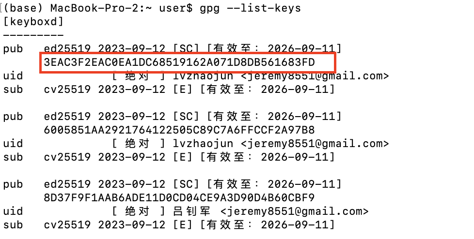

如上图所示：红色边框选中的就是公钥ID


### 上传秘钥

在秘钥生成完后，我们需要把公钥上传到公共服务器供sonatype验证，可以通过下面的命令将公钥上传：

```shell
$ gpg --keyserver hkp://keyserver.ubuntu.com:11371 --send-keys 公钥ID
```

上传密钥有很大可能会出现失败情况，可以尝试上传到其他的存放公钥的服务器：

- keyserver.ubuntu.com
- pool.sks-keyservers.net
- keys.openpgp.org
- pgp.mit.edu
- keys.gnupg.net
- keyserver.ubuntu.com

端口都是11371，这些公钥服务器间会同步它们的数据给其他服务器，所以只要上传成功到其中一台就行。

如下所示是处理上传失败的方案：

```csharp
gpg --keyserver hkp://keyserver.ubuntu.com:11371 --send-keys 8D37F9F1AAB6ADE11D0CD04CE9A3D90D4B60CBF9
gpg: 正在发送密钥 8D37F9F1AAB6ADE11D0CD04CE9A3D90D4B60CBF9 到 hkp://keyserver.ubuntu.com
gpg: 发送至公钥服务器失败：No route to host
gpg: 发送至公钥服务器失败：No route to host

# 先使用命令 ping keyserver.ubuntu.com 得到域名对应的IP地址：185.125.188.27
gpg --keyserver hkp://185.125.188.27:11371 --send-keys 8D37F9F1AAB6ADE11D0CD04CE9A3D90D4B60CBF9

# 验证密钥是否已成功上传
gpg --keyserver hkp://185.125.188.27:11371 --recv-keys 8D37F9F1AAB6ADE11D0CD04CE9A3D90D4B60CBF9
```


## Maven

安装 apache-maven-3.3.1，下载地址: https://repo.maven.apache.org/maven2/org/apache/maven/apache-maven/3.3.1/


### 配置setting.xml

在你本地的仓库目录（如：/Users/xxx/.m2/settings.xml）下新建setting.xml文件，内容如下：

```xml
<?xml version="1.0" encoding="UTF-8"?>
<settings xmlns="http://maven.apache.org/SETTINGS/1.0.0"
          xmlns:xsi="http://www.w3.org/2001/XMLSchema-instance"
          xsi:schemaLocation="http://maven.apache.org/SETTINGS/1.0.0 http://maven.apache.org/xsd/settings-1.0.0.xsd">

    <!-- apache-maven-3.3.1 下载地址: https://repo.maven.apache.org/maven2/org/apache/maven/apache-maven/3.3.1/ -->
    <pluginGroups></pluginGroups>

    <proxies></proxies>

    <servers>
        <server>
            <id>ossrh</id>
            <username>xxx</username> <!-- sonatype帐号 -->
            <password>xxx</password> <!-- sonatype帐号密码 -->
        </server>
    </servers>

    <mirrors></mirrors>

    <profiles>
        <profile>
            <id>ossrh</id>
            <properties>
                <gpg.executable>gpg</gpg.executable>
                <gpg.passphrase>xxx</gpg.passphrase> <!-- GPG签名的密码 -->
            </properties>
        </profile>
    </profiles>

    <!-- 激活 ossrh <profile> -->
    <activeProfiles>
        <activeProfile>ossrh</activeProfile>
    </activeProfiles>

</settings>
```


### 配置Maven环境

在Idea的设置中搜索 “Maven”，按下图所示的配置 “Maven home path” 与 “User settings file”

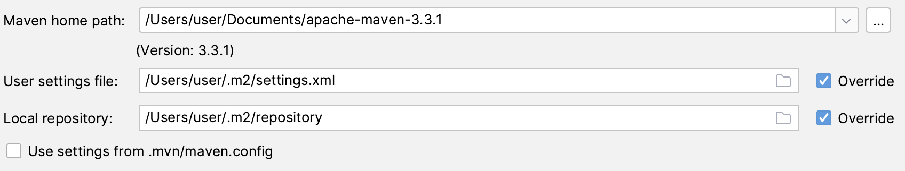


### 修改pom.xml

pom.xml中需要添加各种插件，除了常用的maven-compiler和maven-deploy插件外，还需要下面几个关键插件：

● nexus-staging-maven-plugin：sonatype插件，用来将项目发布到中央仓库使用

● maven-source-plugin：生成java-source.jar文件

● maven-javadoc-plugin：生成java doc文档

● maven-gpg-plugin：对文件进行自动签名

下面是我的工程pom.xml文件，直接拷到你的项目中修改下项目信息就可以使用：

```xml
<project xmlns="http://maven.apache.org/POM/4.0.0"
         xmlns:xsi="http://www.w3.org/2001/XMLSchema-instance"
         xsi:schemaLocation="http://maven.apache.org/POM/4.0.0 http://maven.apache.org/xsd/maven-4.0.0.xsd">
    <modelVersion>4.0.0</modelVersion>

    <!-- 项目信息 -->
    <groupId>icu.etl</groupId>
    <artifactId>easyetl</artifactId>
    <version>1.0.2</version>
    <packaging>jar</packaging>
    <name>easyetl</name>
    <url>https://github.com/jeremy8551/easyetl</url>
    <description>A simple and easy-to-use ETL tool</description>

    <!-- 插件属性 -->
    <properties>
        <project.build.sourceEncoding>GBK</project.build.sourceEncoding>
        <maven.compiler.source>1.8</maven.compiler.source>
        <maven.compiler.target>1.8</maven.compiler.target>
        <maven.compiler.charset>GBK</maven.compiler.charset>
        <maven.test.skip>true</maven.test.skip>
        <maven.javadoc.failOnError>false</maven.javadoc.failOnError>
        <maven.javadoc.skip>false</maven.javadoc.skip>
    </properties>

    <!-- Apache Licene 2.0 开源软件许可证 -->
    <licenses>
        <license>
            <name>The Apache Software License, Version 2.0</name>
            <url>http://www.apache.org/licenses/LICENSE-2.0.txt</url>
            <distribution>repo</distribution>
        </license>
    </licenses>

    <!-- Source Code Management，源代码版本管理信息 -->
    <scm>
        <!-- connection 用于一般用户访问代码仓库的URL，通常用于只读访问 -->
        <connection>scm:git:https://github.com/jeremy8551/easyetl.git</connection>
        <!-- developerConnection：用于开发者访问代码仓库的URL，可以读写 -->
        <developerConnection>scm:git:https://github.com/jeremy8551/easyetl.git</developerConnection>
        <!-- url：项目的Web页面或信息页面的URL -->
        <url>https://github.com/jeremy8551/easyetl</url>
    </scm>

    <!-- issue -->
    <issueManagement>
        <system>Github Issue</system>
        <url>https://github.com/jeremy8551/easyetl/issues</url>
    </issueManagement>

    <!-- 开发人员 -->
    <developers>
        <developer>
            <name>jeremy8551</name>
            <email>jeremy8551@qq.com</email>
            <timezone>+8</timezone>
            <roles>
                <role>Developer</role>
            </roles>
        </developer>
    </developers>

    <dependencies>
        <!-- 测试工具包 -->
        <dependency>
            <groupId>junit</groupId>
            <artifactId>junit</artifactId>
            <version>4.12</version>
            <scope>test</scope>
            <optional>true</optional>
        </dependency>

        <!-- servlet 规范 -->
        <dependency>
            <groupId>javax.servlet</groupId>
            <artifactId>javax.servlet-api</artifactId>
            <version>3.1.0</version>
            <scope>provided</scope>
            <optional>true</optional>
        </dependency>

        <!-- db2 数据库驱动 -->
        <dependency>
            <groupId>com.ibm.db2.jcc</groupId>
            <artifactId>db2jcc</artifactId>
            <version>db2jcc4</version>
            <scope>test</scope>
            <optional>true</optional>
        </dependency>

        <!-- slf4j日志门面 -->
        <dependency>
            <groupId>org.slf4j</groupId>
            <artifactId>slf4j-api</artifactId>
            <version>2.0.9</version>
            <optional>true</optional>
        </dependency>

        <!-- logback日志 -->
        <dependency>
            <groupId>ch.qos.logback</groupId>
            <artifactId>logback-classic</artifactId>
            <version>1.3.6</version>
            <optional>true</optional>
        </dependency>
    </dependencies>

    <build>
        <finalName>easyetl</finalName>
        <plugins>
            <!-- 单元测试插件 -->
            <plugin>
                <groupId>org.apache.maven.plugins</groupId>
                <artifactId>maven-surefire-plugin</artifactId>
                <version>2.12.4</version>
                <configuration>
                    <skip>${maven.test.skip}</skip>
                </configuration>
            </plugin>

            <!-- 编译插件 -->
            <plugin>
                <groupId>org.apache.maven.plugins</groupId>
                <artifactId>maven-compiler-plugin</artifactId>
                <version>3.8.1</version>
                <configuration>
                    <source>${maven.compiler.source}</source>
                    <target>${maven.compiler.target}</target>
                </configuration>
            </plugin>

            <!-- 生成 Javadoc 的jar文件 -->
            <plugin>
                <groupId>org.apache.maven.plugins</groupId>
                <artifactId>maven-javadoc-plugin</artifactId>
                <version>3.5.0</version>
                <executions>
                    <execution>
                        <phase>package</phase>
                        <goals>
                            <goal>jar</goal>
                        </goals>
                    </execution>
                </executions>
                <configuration>
                    <!-- 配置不需要校验的包名,用半角逗号分隔 -->
                    <!-- https://maven.apache.org/plugins/maven-javadoc-plugin/examples/exclude-package-names.html -->
                    <excludePackageNames>icu.jsch.*,icu.apache.*</excludePackageNames>
                    <tags>
                        <tag>
                            <!-- https://maven.apache.org/plugins/maven-javadoc-plugin/examples/tag-configuration.html -->
                            <name>createtime</name> <!-- 自定义 @createtime 标记，屏蔽生成javadoc时的错误信息 -->
                            <placement>a</placement> <!-- 指定标签的放置位置，a表示能在所有位置使用 -->
                            <head>创建时间:</head> <!-- 定义标签的前缀，例如 "作者:" 或 "版本:" -->
                        </tag>
                    </tags>
                    <!--                    <show>private</show>-->
                    <!--                    <nohelp>true</nohelp>-->
                    <!--                    <charset>UTF-8</charset>-->
                    <!--                    <encoding>UTF-8</encoding>-->
                    <!--                    <docencoding>UTF-8</docencoding>-->
                    <!--                    <additionalparam>-Xdoclint:none</additionalparam>-->
                </configuration>
            </plugin>
        </plugins>
    </build>

    <profiles>
        <!-- 将deploy配置作为一个profile，在执行deploy命令时激活这个profile: clean deploy -P release -->
        <profile>
            <id>release</id>
            <build>
                <plugins>
                    <!-- 插件用于生成源码jar文件 -->
                    <plugin>
                        <groupId>org.apache.maven.plugins</groupId>
                        <artifactId>maven-source-plugin</artifactId>
                        <version>3.2.1</version>
                        <executions>
                            <execution>
                                <phase>package</phase>
                                <goals>
                                    <goal>jar-no-fork</goal>
                                </goals>
                            </execution>
                        </executions>
                    </plugin>

                    <!-- 插件用于生成Javadoc的jar文件 -->
                    <plugin>
                        <groupId>org.apache.maven.plugins</groupId>
                        <artifactId>maven-javadoc-plugin</artifactId>
                        <version>3.4.1</version>
                        <executions>
                            <execution>
                                <phase>package</phase>
                                <goals>
                                    <goal>jar</goal>
                                </goals>
                                <configuration>
                                    <doclint>none</doclint> <!-- 禁用DocLint检查,屏蔽警告和报错信息 -->
                                </configuration>
                            </execution>
                        </executions>
                    </plugin>

                    <!-- GPG签名插件,对项目最后生成的jar包进行签名 -->
                    <plugin>
                        <groupId>org.apache.maven.plugins</groupId>
                        <artifactId>maven-gpg-plugin</artifactId>
                        <version>3.0.1</version>
                        <executions>
                            <execution>
                                <phase>verify</phase> <!-- 验证阶段 -->
                                <goals>
                                    <goal>sign</goal> <!-- 插件目标: 在验证阶段执行 GPG 签名操作 -->
                                </goals>
                            </execution>
                        </executions>
                    </plugin>

                    <!-- sonatype插件，用于登录验证、上传jar到sonatype的maven仓库 -->
                    <plugin>
                        <groupId>org.sonatype.plugins</groupId>
                        <artifactId>nexus-staging-maven-plugin</artifactId>
                        <version>1.6.7</version>
                        <extensions>true</extensions>
                        <configuration>
                            <serverId>ossrh</serverId>
                            <!-- 这里的 https://s01.oss.sonatype.org/ 是生成 sonatype 的issues工单时, 机器人评论的那个地址-->
                            <nexusUrl>https://s01.oss.sonatype.org/</nexusUrl>
                            <autoReleaseAfterClose>true</autoReleaseAfterClose>
                        </configuration>
                    </plugin>
                </plugins>
            </build>

            <!-- 项目jar包分发管理信息 -->
            <distributionManagement>
                <snapshotRepository>
                    <!-- 快照版本 -->
                    <id>ossrh</id>
                    <url>https://s01.oss.sonatype.org/content/repositories/snapshots/</url>
                    <!-- 这里的 https://s01.oss.sonatype.org/ 是生成 sonatype 的issues工单时, 机器人评论的那个地址-->
                </snapshotRepository>
                <repository>
                    <!-- 发布正式版 -->
                    <id>ossrh</id>
                    <url>https://s01.oss.sonatype.org/service/local/staging/deploy/maven2/</url>
                </repository>
            </distributionManagement>
        </profile>
    </profiles>

</project>
```

在修改完成后，运行下面命令，查看配置是否已经生效了：

```shell
$ mvn help:effective-settings
```


## deploy与验证

```shell
clean deploy -P release
```

出现如下，即成功

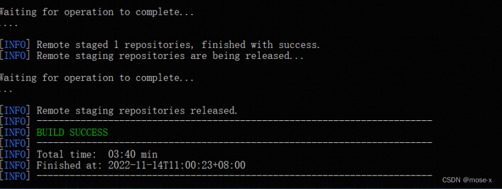

并且在OSSRH中也能收到反馈

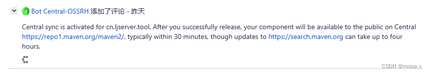


立即可以登录到sonatype的仓库验证：https://s01.oss.sonatype.org

等待一段时间后可以到中央仓库 https://repo1.maven.org/maven2/ 查询jar包是否成功上传。

等待一段时间后到Maven中央仓库的搜索引擎 https://search.maven.org/ 查询jar包是否成功上传。
