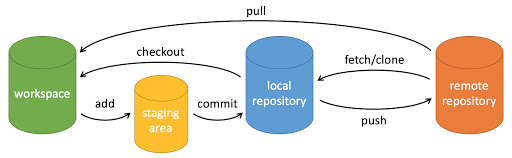
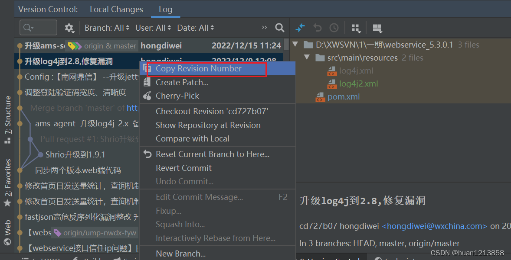
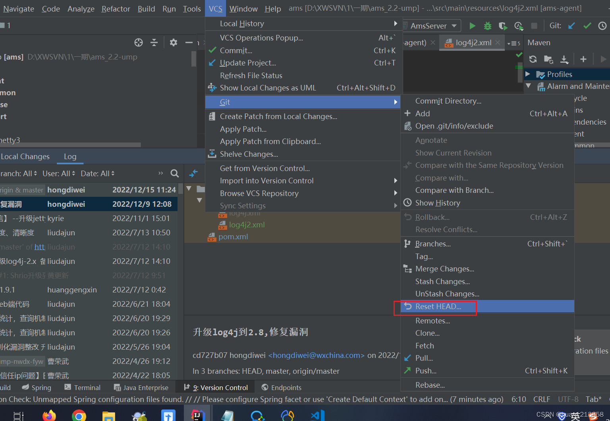
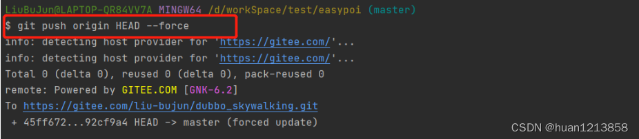
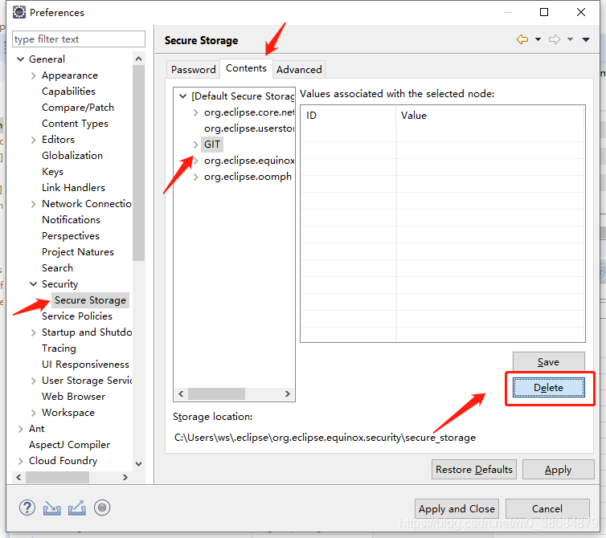

# 简介

Git 是一个开源的分布式版本控制系统，用于敏捷高效地处理任何或小或大的项目。

Git 是 Linus Torvalds 为了帮助管理 Linux 内核开发而开发的一个开放源码的版本控制软件。

Git 与常用的版本控制工具 CVS，Subversion（SVN）等不同，采用了分布式版本库的方式，而且只在本地安装Git即可，无需服务器端的Git。

[Git下载地址](https://git-scm.com/downloads)

Git 由工作区、版本库、暂存区组成，工作流程如下图所示：



## 工作区（Working Directory）

就是 Eclipse 或 Idea 中能看到的目录及文件。


## 版本库（commit History）

工作区有一个隐藏目录 `.git` 是 Git 的版本库。


## 暂存区（Stage/Index）

版本库中的暂存区英文叫 stage 或 index。一般存放在 `.git` 目录下的 index 文件（.git/index）中，所以把暂存区有时也叫作索引（index）。


## 远程仓库（remote repository）

下面这个图展示了工作区、版本库中的暂存区和版本库之间的关系：


图中左侧为工作区，右侧为版本库。在版本库中标记为 "index" 的区域是暂存区（stage/index），标记为 "master" 的是 master 分支所代表的目录树。

图中我们可以看出此时 "HEAD" 实际是指向 master 分支的一个"游标"。所以图示的命令中出现 HEAD 的地方可以用 master 来替换。

图中的 objects 标识的区域为 Git 的对象库，实际位于 ".git/objects" 目录下，里面包含了创建的各种对象及内容。

当对工作区修改（或新增）的文件执行 git add 命令时，暂存区的目录树被更新，同时工作区修改（或新增）的文件内容被写入到对象库中的一个新的对象中，而该对象的ID被记录在暂存区的文件索引中。

当执行提交操作（git commit）时，暂存区的目录树写到版本库（对象库）中，master 分支会做相应的更新。即 master 指向的目录树就是提交时暂存区的目录树。

当执行 git reset HEAD 命令时，暂存区的目录树会被重写，被 master 分支指向的目录树所替换，但是工作区不受影响。

当执行 git checkout . 或者 git checkout -- \<file> 命令时，会用暂存区全部或指定的文件替换工作区的文件。这个操作很危险，会清除工作区中未添加到暂存区中的改动。


# 基础命令


## git init

向一个目录中添加 Git 版本库，即在 directory 目录下生成一个 `.git` 子目录。

```shell
$ git init [directory]
```

将当前目录中添加 Git 版本库：

```shell
$ git init
```


**选项 --bare**

初始化远程服务器仓库时，可以使用下面命令建立一个中心仓库（裸仓库，没有工作区）。

中心仓库中没有工作区，只保存历史提交的版本信息，中心仓库所在目录约定以 `.git` 结尾，不允许进行各种命令（add、push、commit），但可以使用 `git show` 命令查看提交内容。

```shell
$ git init --bare test.git
```


## git clone

从 Git 仓库中拷贝项目到当前目录：

```shell
$ git clone <Git仓库>
```

从 Git 仓库中拷贝项目到指定目录：

```shell
$ git clone <Git仓库> <本地目录路径>
```

例如：

```shell
$ git clone https://gitee.com/jeremy8551/UniversalScriptEngine.git UniversalScriptEngine
```

支持多种协议，包括 ssh、git、https 等，其中最常用的是 ssh，因为速度较快，还可以配置公钥免输入密码。各种写法如下：

```shell
$ git clone git@github.com:jeremy8551/UniversalScriptEngine.git         --SSH协议
$ git clone git://github.com/jeremy8551/UniversalScriptEngine.git       --GIT协议
$ git clone https://gitee.com/jeremy8551/UniversalScriptEngine.git      --HTTPS协议
```


**选项 --bare**

使用选项 --bare 可以将现有仓库导出为一个中心仓库（裸仓库，没有工作区）：

```shell
$ git clone --bare <Git仓库> <本地目录路径>
```


## git config

```shell
语法: git config [<options>]        

文件位置        
    --global                  # 使用全局配置文件
    --system                  # 使用系统配置文件
    --local                   # 使用版本库配置文件
    -f, --file <file>         # 使用给定的配置文件
    --blob <blob-id>          # 从给定的对象中读取配置

动作        
    --get                     #get value: name [value-regex] 获得值：[值]名[正则表达式]
    --get-all                 #get all values: key [value-regex] 获得所有值：[值]名[正则表达式]
    --get-regexp              #get values for regexp: name-regex [value-regex] 得到的值根据正则
    --get-urlmatch            #get value specific for the URL: section[.var] URL 为URL获取特定的值
    --replace-all             #replace all matching variables: name value [value_regex] 替换所有匹配的变量：名称值[ value_regex ]
    --add                     #add a new variable: name value 添加一个新变量：name值
    --unset                   #remove a variable: name [value-regex] 删除一个变量名[值]：正则表达式
    --unset-all               #remove all matches: name [value-regex] 删除所有匹配的正则表达式：名称[值]
    --rename-section          #rename section: old-name new-name 重命名部分：旧名称 新名称
    --remove-section          #remove a section: name 删除部分：名称
    -l, --list                #list all 列出所有
    -e, --edit                #open an editor 打开一个编辑器
    --get-color               #find the color configured: slot [default] 找到配置的颜色：插槽[默认]
    --get-colorbool           #find the color setting: slot [stdout-is-tty] 发现颜色设置：槽[ stdout是TTY ]

类型        
    --bool                    # value is "true" or "false"    值是“真”或“假”。
    --int                     # value is decimal number    值是十进制数。
    --bool-or-int             # value is --bool or --int    值--布尔或int
    --path                    # value is a path (file or directory name)    值是路径（文件或目录名）

其它        
    -z, --null                # terminate values with NUL byte 终止值与null字节
    --name-only               # show variable names only 只显示变量名
    --includes                # respect include directives on lookup 尊重包括查找指令
    --show-origin             # show origin of config (file, standard input, blob, command line) 显示配置（文件、标准输入、数据块、命令行）的来源
```

Git 有三个级别的配置信息：本地级别的配置、全局级别的配置、系统级别的配置。


### 级别


**选项 --local**

使用选项 --local 表示本地级配置文件，默认保存在当前版本库下面 `.git\config` 文件内，且仅对当前仓库有效，不影响其他的仓库。

优先级最高。


**选项 --global**

使用选项 --global 表示使用全局配置文件，包含当前用户拥有的仓库配置信息，每个用户的全局级配置相互隔离的。默认保存在当前用户的根目录下的 `.gitconfig` 文件内。windows 通常保存在 `C:\Users\xxxx\.gitconfig`，linux 为 `/home/xxx/.gitconfig`


**选项 --system**

使用选项 --system 表示使用系统级配置文件，配置文件位置在 Git 安装目录下的 `etc/gitconfig`，含有系统里每位用户及用户所拥有的仓库的配置信息。

优先度最低。


### 获取所有配置项

```shell
$ git config --system --list        // 查看系统config
```

```shell
$ git config --global --list        // 查看当前用户（global）配置
```

```shell
$ git config --local  --list        // 查看当前仓库配置信息
```

若不指定配置级别，则会返回3个级别的配置，从上往下按系统级别、全局级别、本地级别的顺序进行输出显示。


### 获取配置项

获取某一项配置信息时若不指定级别，则会从本地级开始一级一级往上查找直到配置不存在。即：先从本地级配置中开始查找配置项，若本地级不存在则往上从全局级别配置查找，若全局级别还是不存在该配置项就从系统级配置查找，若还是不存在则返回空。

```shell
$ git config --global get key
```


### 设置配置项

如果设置某一项配置时若不指定级别，那么默认会保存到本地级的配置文件中，不加任何选项时相当于使用 `--local` 选项。

```shell
$ git config [--local|--global|--system] key value
```


### 删除配置项

与设置配置项一样，删除配置项若不指定级别，默认使用 `--local` 级别。指定级别则删除该级别的配置文件中的配置项。

```shell
$ git config [--local|--global|--system] --unset key
```


### 编辑配置文件

```shell
$ git config -e [--local|--global|--system]
```


## git add

添加一个或多个文件到暂存区：

```shell
$ git add [file1] [file2] ...
```

添加指定目录（及其子目录）到暂存区：

```shell
$ git add [dir]
```

将当前目录下的所有文件添加到暂存区：

```shell
$ git add .
```

将当前目录下的 `.c` 结尾的文件添加到暂存区：

```shell
$ git add *.c
```


**选项 -A**

-A，--all add changes from all tracked and untracked files 添加所有跟踪和未跟踪文件的更改。

使用 -A 选项会监控工作区的状态树，会把工作区的所有变化提交到暂存区，包括修改（modified）、新文件（Untracked files）、删除的文件（deleted）。使用 `.` 在 git 2.x 也可以达到一样的效果，但在 git 1.x 中不同的是 `.` 不会监控删除的文件。

```shell
$ git add -A
```

等同于

```shell
$ git add .
```


**选项 -u**

-u，--update update tracked files 只更新已被跟踪文件。只添加已修改或被删除的文件，新文件不会被添加到缓存区。

```shell
$ git add -u
```


## git commit

将暂存区中的所有文件提交到版本区（基于当前分支生成一个快照，head指向最新的快照）：

```shell
$ git commit -m [message]
```

将暂存区中的指定文件提交到本地仓库中：

```shell
$ git commit [file1] [file2] ... -m [message]
```

打开编辑器，并允许更改最后一次提交消息

```shell
git commit --amend
```


**选项 -m**

选项值表示提交时所带的注释信息，在 linux 中注释信息可以使用半角单引号扩住，而在 windows 中注释信息使用半角双引号扩住。

所以在 git bash 中 `git commit -m '提交说明'` 这样是可以的，在 windows 命令行中就要使用双引号 `git commit -m "提交说明"`


**选项 -a**

使用 -a 选项时表示无需执行 git add，可直接提交到本地仓库。但也只是对修改和删除文件有效， 新文件还是要 git add，不然就是 untracked 状态。

```shell
$ git commit -a -m [message]
```


## git reset

用于回退版本，可以退回到某一次提交的版本。

格式：

```shell
$ git reset [--soft | --mixed | --hard] [HEAD]
```


**选项 --mixed**

是默认值，所以可不用带这个选项。是指重置整个暂存区，将暂存区恢复到上一次提交时的状态，但工作区文件内容保持不变。

```shell
$ git reset [HEAD]
```

例如：

```shell
$ git reset HEAD^            # 回退所有内容到上一个版本  
$ git reset HEAD^ hello.php  # 回退 hello.php 文件的版本到上一个版本  
$ git reset 052e             # 回退到指定版本
```


**选项 --soft**

表示用于回退到某个版本：

```shell
$ git reset --soft HEAD
```

例如：

```shell
$ git reset --soft HEAD~3   # 回退到上上上的版本
```


**选项 --hard**

撤销工作区中所有未提交的修改内容，将暂存区与工作区都回退到上一次版本，并删除之前的所有信息提交：

```shell
$ git reset --hard HEAD
```

例如：

```shell
$ git reset --hard HEAD~3           # 回退上上上一个版本  
$ git reset –hard bae128            # 回退到某个版本回退点之前的所有信息
$ git reset --hard origin/master    # 将本地的状态回退到和远程的一样
```

**注意：**谨慎使用 **–-hard** 参数，会删除回退点之前的所有信息。

**HEAD说明：**

- HEAD 表示当前版本；
- HEAD^ 上一个版本；
- HEAD^^ 上上一个版本；
- HEAD^^^ 上上上一个版本；
- 以此类推...

可以使用～数字表示

- HEAD~0 表示当前版本；
- HEAD~1 上一个版本；
- HEAD^2 上上一个版本；
- HEAD^3 上上上一个版本；
- 以此类推...


## git rm

从暂存区和工作区中删除指定文件：

```shell
usage: git rm [<options>] [--] <file>...

    -n, --dry-run         dry run，排练删除操作
    -q, --quiet           do not list removed files，不回显被删除的文件信息
    --cached              only remove from the index，将文件从 index 删除，变成 Untracked 状态，依然是没有提交
    -f, --force           override the up-to-date check，强制删除
    -r                    allow recursive removal，递归删除目录中的子文件与子目录
    --ignore-unmatch      exit with a zero status even if nothing matched，即使没有匹配项，也以零状态退出
```

递归删除目录下的所有文件和子目录：

```shell
git rm –r *
```

直接从暂存区删除文件，工作区则不做出改变：

```shell
git rm --cached <file>
```


## git status

用于查看工作区中文件的状态

```shell
$ git status
```


**选项 -s**

使用 **-s** 参数来获得简短的输出结果。

```shell
$ git status -s
```


## git diff

比较文件在暂存区和工作区的差异：

```shell
$ git diff [file]
```

显示暂存区和上一次提交（commit）的差异：

```shell
$ git diff --cached [file]
$ git diff --staged [file]
```

显示两次提交之间的差异：

```shell
$ git diff [first-branch]...[second-branch]
```


## git mv

用于移动或重命名一个文件、目录或软连接。

```shell
$ git mv [file] [newfile]
```


可以移动文件（目录）到另一个目录中。

```shell
$ git mv fileOrDir parentDir/newFileName
```


**选项 -k**

`--force`，即使目标存在，也要强制重命名或移动文件


**选项 -f**

如果新文件名已经存在，但还是要重命名它，可以使用 **-f** 选项：

```shell
$ git mv -f [file] [newfile]
```


**选项 -n**

`--dry-run`
没做什么; 只显示会发生什么


**选项 -v**
`--verbose`
报告移动文件的名称。


## git log（查看日志）

查看历史提交记录

```shell
$ git log
```


## git blame （查看历史）

以列表形式查看指定文件的历史修改记录。

```shell
$ git blame <file>
```


# 分支管理

分支实际上是指向快照的指针，分支代表一条独立的开发线，使用分支意味着可从主分支上分离开来，然后在不影响主分支的同时继续工作。


## HEAD

Git 中的 HEAD 可以理解为一个指针，可以在命令行中输入 `cat .git/HEAD` 查看当前 HEAD 指向哪儿，一般指向当前工作目录所在分支的最新提交。如果HEAD指向的是一个引用，可以通过 `git symbolic-ref HEAD` 查看具体的指向。


## git branch

显示当前所有（本地）的分支。

```shell
$ git branch
```

前面有 `*` 表示当前分支。这意味着如果当前修改了，那么就基础当前分支向前移动。


创建分支：

```shell
$ git branch 分支名
```


**选项 -a**

查看全部分支（包含本地和远程）

```shell
$ git branch -a
```


**选项 -v**

查看每一个（本地）分支的最后一次提交

```shell
$ git branch -v
```


**选项 -b**

创建并切换到新的分支

```
git checkout -b <分支名>
```


**选项 -M**

-M：是 --move --force的缩写。

--move(-m)：Move/[rename](https://so.csdn.net/so/search?q=rename&spm=1001.2101.3001.7020) a branch.

--force(-f)：即使新命名的branch名存在也执行。


**选项 --merged**

查看哪些（本地）分支已经合并到当前（本地）分支

```shell
$ git branch --merged
```

在这个列表中分支名字前没有 * 号的分支通常可以使用 `git branch -d ` 删除掉：已经将分支整合到了另一个分支，所以删除后并不会失去任何东西。


查看当前已合并到 master 分支的有哪些

```shell
$ git branch --merged master
```


**选项 --no-merged**

查看哪些（本地）分支还没有合并到当前（本地）分支

```shell
$ git branch --no-merged
```

因为包含了还未合并的工作，尝试使用 git branch -d 命令删除时会失败，如果真的想要删除分支并丢掉那些工作，如同帮助信息里所指出的，可以使用 -D 选项强制删除。


查看当前未合并到 master 分支的有哪些

```shell
$ git branch --no-merged master
```


**选项 -d **

删除分支，删除本地已合并的分支

```shell
$ git branch -d 分支名
```


## git checkout


### 切换文件

更新工作区的指定文件，使其和暂存区保持一致：

```shell
$ git checkout -- <file>
```

同时更新工作区和暂存区的指定文件，使其和指定提交保持一致：

```shell
$ git checkout <commit> <file>
```

更新当前目录（和子目录）的所有文件，和暂存区保持一致：

```shell
$ git checkout .
```

更新工作区和暂存区的指定文件，使其和当前提交保持一致，也就是会把工作区和暂存区中对该文件的修改全部撤销，恢复到上一次 `git commit` 后的状态：

```shell
$ git checkout HEAD <file>
```

更新工作区和暂存区当前目录下的所有文件，使其和当前提交保持一致：

```shell
$ git checkout HEAD .
```

分离头模式，如下所示用主分支中上上次提交的内容，替换暂存区和以及工作区中的文件：

```shell
$ git checkout master^^
```


### 切换分支

当切换分支的时候，Git 会用该分支的最后提交的快照替换你的工作目录的内容， 所以多个分支不需要多个目录。

```shell
$ git checkout 分支名
```


**选项 -b**

如果分支已经存在，会提示分支已经存在。

```shell
$ git checkout -b <branch> [<start-point>]
```


**选项 -B**

如果要创建的分支已经存在，那么会把该分支重置到指定的 start-point 上。

```shell
$ git checkout -B <branch> [<start-point>]
```


## git merge

一旦分支有了独立内容，可能会希望将分支内容合并到主分支，可使用以下命令将分支合并到当前分支中去。

合并分支命令：

```shell
$ git merge 分支名
```

合并完后就可以删除分支。


## 合并冲突

如果将一个分支合并到主分支时，文件内容与主分支冲突了，需要手动去修改冲突内容，然后用 `git add` 表示文件冲突已经解决


# 远程命令


## git remote

显示远程仓库：

```shell
$ git remote show https://gitee.com/jeremy8551/UniversalScriptEngine.git
* remote https://gitee.com/jeremy8551/UniversalScriptEngine.git
  Fetch URL: https://gitee.com/jeremy8551/UniversalScriptEngine.git
  Push  URL: https://gitee.com/jeremy8551/UniversalScriptEngine.git
  HEAD branch: master
  Local ref configured for 'git push':
    master pushes to master (local out of date)
```

添加远程仓库：

```shell
$ git remote add origin https://gitee.com/jeremy8551/UniversalScriptEngine.git
```

查看远程仓库：

```shell
$ git remote -v
origin	https://gitee.com/jeremy8551/UniversalScriptEngine.git (fetch)
origin	https://gitee.com/jeremy8551/UniversalScriptEngine.git (push)
```

删除远程仓库：

```shell
$ git remote rm origin
```

修改远程仓库：

```shell
$ git remote rename origin origin_new
```


## git push

将本地的分支上传到远程仓库

```shell
$ git push <远程主机名> <本地分支名>:<远程分支名>
```

如果本地分支名与远程分支名相同，则可以省略冒号：

```shell
$ git push <远程主机名> <本地分支名>
```

如果本地版本与远程版本有差异，但又要强制推送可以使用 --force 参数：

```shell
$ git push --force origin master
```

删除远程分支可以使用 --delete 选项，以下命令表示删除 origin 上的 master 远程分支：

```shell
$ git push origin --delete master
```


## git pull

从远程获取代码并合并本地的版本，其实就是 `git fetch` 和 `git merge FETCH_HEAD` 的简写。

```shell
$ git pull <远程主机名> <远程分支名>:<本地分支名>
```

将远程主机 origin 的 master 分支拉取过来，与本地的 brantest 分支合并：

```shell
$ git pull origin master:brantest
```

如果远程分支是与当前分支合并，则冒号后面的部分可以省略：

```shell
$ git pull origin master
```


## git fetch

会获取远程仓库的最新提交、分支和标签等信息，并将其更新到本地仓库的远程跟踪分支（remote-tracking branches）中。意思是将远程仓库的变更保存在本地，但不会自动修改你的工作区或当前所在分支。而 git pull 命令可以获取远程仓库的最新信息，并自动将远程分支合并到你的当前分支，从而更新你的工作区（这是二者区别）。

使用 git fetch 后，你可以查看远程分支的更新情况，比较本地分支与远程分支的差异，然后决定是否进行合并操作。


# 标签管理

项目完成了某个阶段，希望永远记住那个特别的提交快照，可以使用标签命令添加标记。

```shell
NAME
       git-tag - Create, list, delete or verify a tag object signed with GPG

SYNOPSIS
       git tag [-a | -s | -u <keyid>] [-f] [-m <msg> | -F <file>]
               <tagname> [<commit> | <object>]
       git tag -d <tagname>...
       git tag [-n[<num>]] -l [--contains <commit>] [--no-contains <commit>]
               [--points-at <object>] [--column[=<options>] | --no-column]
               [--create-reflog] [--sort=<key>] [--format=<format>]
               [--[no-]merged [<commit>]] [<pattern>...]
       git tag -v [--format=<format>] <tagname>...

DESCRIPTION
       Add a tag reference in refs/tags/, unless -d/-l/-v is given to delete, list or verify tags.

       Unless -f is given, the named tag must not yet exist.

       If one of -a, -s, or -u <keyid> is passed, the command creates a tag object, and requires a tag
       message. Unless -m <msg> or -F <file> is given, an editor is started for the user to type in the
       tag message.

       If -m <msg> or -F <file> is given and -a, -s, and -u <keyid> are absent, -a is implied.

       Otherwise just a tag reference for the SHA-1 object name of the commit object is created (i.e. a
       lightweight tag).

       A GnuPG signed tag object will be created when -s or -u <keyid> is used. When -u <keyid> is not
       used, the committer identity for the current user is used to find the GnuPG key for signing. The
       configuration variable gpg.program is used to specify custom GnuPG binary.

       Tag objects (created with -a, -s, or -u) are called "annotated" tags; they contain a creation date,
       the tagger name and e-mail, a tagging message, and an optional GnuPG signature. Whereas a
       "lightweight" tag is simply a name for an object (usually a commit object).

       Annotated tags are meant for release while lightweight tags are meant for private or temporary
       object labels. For this reason, some git commands for naming objects (like git describe) will
       ignore lightweight tags by default.

OPTIONS
       -a, --annotate
           Make an unsigned, annotated tag object

       -s, --sign
           Make a GPG-signed tag, using the default e-mail address's key.

       -u <keyid>, --local-user=<keyid>
           Make a GPG-signed tag, using the given key.

       -f, --force
           Replace an existing tag with the given name (instead of failing)

       -d, --delete
           Delete existing tags with the given names.

       -v, --verify
```

Git 使用的标签有两种类型：轻量级的（lightweight）和含附注的（annotated）。

轻量级标签就像是个不会变化的分支，实际上就是一个指向特定提交对象的引用。

而含附注标签，实际上是存储在仓库中的一个独立对象，具有自身的校验和信息，包含着标签的名字，电子邮件地址和日期，以及标签说明，标签本身也允许使用 GNU Privacy Guard (GPG) 来签署或验证。

一般我们都建议使用含附注型的标签，以便保留相关信息，当然，如果只是临时性加注标签，或者不需要旁注额外信息，用轻量级标签也没问题。

## 创建标签

```shell
$ git tag v1.0
```


## 查看已有标签

```shell
$ git tag
v1.0
```


## 删除标签

```shell
$ git tag -d v1.1
Deleted tag ‘v1.1’ (was 91388f0)
```


## 查看此版本所修改的内容

```shell
$ git show v1.0
commit 91388f0883903ac9014e006611944f6688170ef4
Author: "syaving" <"819044347@qq.com">
Date: Fri Dec 16 02:32:05 2016 +0800
commit dir
diff –git a/readme b/readme
index 7a3d711..bfecb47 100644
— a/readme
+++ b/readme
@@ -1,2 +1,3 @@
text
hello git
+use commit
[root@Git git]# git log –oneline
91388f0 commit dir
e435fe8 add readme
2525062 add readme
```


## 选项 -a

选项意为"创建一个带注解的标签"。 不用 -a 选项也可以执行的，但不会记录标签是什么时候打的，谁打的，也不会让你添加个标签的注解。 

```shell
git tag -a <tagname> -m "标签说明"
```

PGP签名标签命令：

```shell
git tag -s <tagname> -m "标签说明"
```


# 客户端配置

删除用户根目录下的 .ssh 文件夹

```shell
$ git config --global user.name "John Doe"
$ git config --global user.email "your@email.com"

# 生成ssh
$ ssh-keygen -t rsa -C "your@email.com"
# 命令执行后，先按一个回车（指定 ssh 配置目录），再输入密码，再确认密码.
# 在用户根目录下会生成 .ssh/id_rsa.pub 文件，将文件中的内容复制到git服务器上的ssh公钥中.

$ ssh -T git@github.com
```


# 使用场景


## 创建新的分支

```shell
$ git init # 初始化当前目录

$ git add . # 添加当前目录下的所有文件

$ git commit -m "init" # 首次提交

$ git remote add origin git@github.com:... # 项目的ssh链接

$ git remote -v  # 查看关联的远程仓库链接

$ git branch -M Idea_JDK8  # 强制使用 Idea_JDK8 分支

$ git push -u origin Idea_JDK8 # 提交到 Idea_JDK8 分支上
```


# Idea编辑器


## 撤销Commit

在Idea的Git工具栏中，可以看到显示当前分支、commit记录、commit信息等内容。

在commit信息处，右击出现“Reset Current Branch to Here”、“Revert”、“Rollback”等选项。

其中，“Reset Current Branch to Here”撤销当前commit并将代码库重置到当前commit，相当于回退到了当前commit之前的状态；

“Revert”则会生成一次新的commit来撤销之前的commit操作；

“Rollback”则相当于撤销掉当前commit并回到上一次commit的状态。


## 修改已提交注释

1、项目右键 git -> show history
2、选中想要修改comment的 [commit](https://so.csdn.net/so/search?q=commit&spm=1001.2101.3001.7020)，右键 Edit Commit Message 或 F2（win10）


## 撤销 push 操作

右键 git 提交的历史记录中要回退到的版本号（就是要回退到哪个版本），点击”Copy Revsion Number”



选择“Reset HEAD”，Reset Type选择Hard，To Commit位置填入上一步复制的Revsion Number，点击Reset



进入项目所在文件，右键空白位置，选择 Git Batch Here，执行

```shell
$ git push origin HEAD --force
```




# Eclipse配置

找到在操作系统用户的根目录下的 `C:/用户/.gitconfig` 文件，增加如下内容：

```ini
[credential]
	helper = store
```

在Eclipse安全策略中删除 Git 内容



重启 Eclipse 重新提交输入 Git 用户与密码。


# 常见问题

## kex_exchange_identification: Connection closed by remote host Connection closed by 198.18.0.114 port

在拉取Github仓库的时候遇到了协议报错 ：

```shell
$ git fetch --prune --all --verbose
 
Fetching origin
kex_exchange_identification: Connection closed by remote host
Connection closed by 198.18.0.114 port 22
fatal: Could not read from remote repository.
 
Please make sure you have the correct access rights
and the repository exists.
error: could not fetch origin
```

第一种：

可以放弃SSH方式， 换用HTTPS方式来读取和拉取代码。

第二种：

坚持使用SSH方式，在 {用户}/.ssh/ 目录下建立config文本文档，输入以下代码，端口指向443即可。

```txt
Host github.com
Hostname ssh.github.com
Port 443
```

