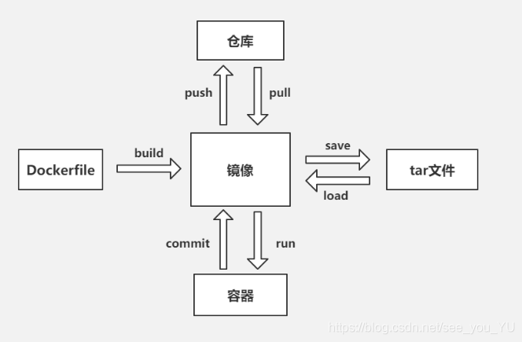
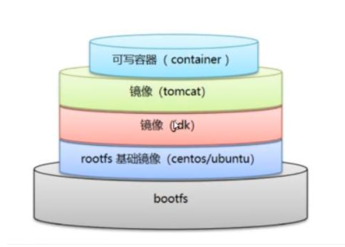
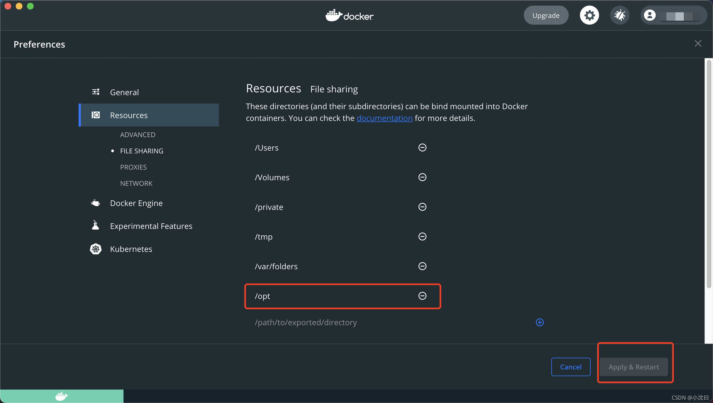

参考：https://www.jianshu.com/p/4508784f6ddc


# 概念

- Docker 官方主页: [https://www.docker.com](https://www.docker.com/)
- Docker 官方博客: https://blog.docker.com/
- Docker 官方文档: https://docs.docker.com/
- Docker Store: [https://store.docker.com](https://store.docker.com/)
- Docker Cloud: [https://cloud.docker.com](https://cloud.docker.com/)
- Docker Hub: [https://hub.docker.com](https://hub.docker.com/)
- Docker 的源代码仓库: https://github.com/moby/moby
- Docker 发布版本历史: https://docs.docker.com/release-notes/
- Docker 常见问题: https://docs.docker.com/engine/faq/
- Docker 远端应用 API: https://docs.docker.com/develop/sdk/


Docker是一个使用Go语言开发的开源的应用容器引擎，遵从 Apache2.0 协议开源。

Docker可以让开发者打包应用以及依赖包到一个轻量级、可移植的容器中，然后发布到 Linux 机器上，也可以实现虚拟化。

Docker容器是完全使用沙箱机制，容器相互之间不会有任何交互，且容器的性能开销极低。

Docker从 17.03 版本之后分为 CE（Community Edition: 社区版） 和 EE（Enterprise Edition: 企业版），使用社区版就可以了。



|       概念        | 说明                                                         |
| :---------------: | :----------------------------------------------------------- |
|  镜像（Images）   | 镜像是用于创建Docker容器的模板；<br>比如官方镜像 ubuntu:16.04 就包含了完整的一套 Ubuntu16.04 最小系统的 root 文件系统 |
| 容器（Container） | 容器是镜像运行时的实体，可以是一个或一组应用。               |
| 客户端（Client）  | 客户端通过命令行或者其他工具使用[Docker SDK](https://docs.docker.com/develop/sdk/)与Docker的守护进程通信。 |
|   主机（Host）    | 一个物理机或虚拟机，用于执行Docker守护进程和容器。           |
| 仓库（Registry）  | Docker仓库是用来保存镜像的，类似于编程开发中的代码仓库；<br/>比如：[DockerHub](https://hub.docker.com)镜像仓库；<br/>一个docker仓库中可以包含多个仓库（Repository）；<br/>每个仓库可以包含多个标签（Tag），每个标签对应一个镜像；<br/>通常，一个仓库会包含同一个软件不同版本的镜像，而标签代表镜像的各个版本； |
|  机器（Machine）  | Docker Machine是一个简化Docker安装的命令行工具。<br/>通过一个简单的命令行，就可在相应的平台上安装Docker，比如：VirtualBox、 Digital Ocean、Microsoft Azure |


## 镜像

操作系统分为内核与用户空间。以Linux系统为例，内核启动后，会挂载**root**文件系统为其提供空间支持。

镜像（Image）就好比是一个**root**文件系统，其特殊性主要体现在以下两个方面：

- Docker镜像为容器的运行提供所需的程序、库、资料、配置等文件的同时，还准备了一些配置参数（比如匿名卷、环境变量、用户等）；
- Docker镜像不包含任何动态数据，其内容在创建之后就不会被修改；


### 分层存储



因为镜像包含操作系统完整的**root**文件系统，这导致其体积通常很大。鉴于此缺点，Docker在Union FS技术的基础上，采用了**分层存储架**构的设计理念，**分层存储**的特征使得镜像可以复用、镜像的定制变的更为容易。可以使用之前创建好的镜像作为基础层，然后进一步添加新的层，以定制自己所需要的内容，构建新的镜像。

- 镜像的构建：层层构建，前一层是后一层的基础；
- 每一层构建完成后，就不会再发生变化，后一层上的任何改变只发生在当前层。比如，我们在当前层删除前一层的文件，实际的操作并不删除前一层的文件，而是删除当前层标记的上一层文件信息；
- 在构建Docker镜像时，每一层尽量只包含该层要添加的东西，任何额外的东西应该在该层构建结束前清除掉。


## 容器

镜像（Image）和容器（Container）的关系，就像是面向对象编程中的类和实例，即通过镜像来创建容器。容器可以被创建、启动、停止、删除、暂停。Docker使用客户端-服务器（C/S）架构模式，使用远程API来管理和创建Docker容器。


容器的实质是进程，但与直接在宿主执行的进程不同，容器进程运行与自己独立的**命名空间**，因此容器可以有自己的**root**文件系统、网络配置、进程空间、用户ID空间。容器内的进程是运行在一个隔离的环境中，使用起来就像在一个独立于宿主的系统下操作一样，而使得容器具有了封装性。想比较与直接在宿主中运行，容器的运行更加安全。容器也是分层存储的，每个容器的运行时，是以镜像为基础层，在此基础上创建一个当前容器的存储层。容器存储层的生命周期和容器一样，即容器消亡时，容器存储层也随之消亡，任何保存与容器存储层的信息也会丢失掉。根据Docker的设计思想，容器不应该向其存储层写入任何数据，也就是所谓的**无状态化**。所有的文件写入操作应该使用如下两种方式：

- 数据卷（Volume）
- 绑定宿主目录

在数据卷或绑定宿主目录位置上的读写都会跳过容器存储层，而直接对宿主或网络存储发生读写，这样处理的方式会其性能和稳定性更高。

注意：数据卷的生存周期独立于容器，即容器消亡，数据卷不会消亡。


## 仓库

Docker仓库提供了一个集中的存储、分发镜像的服务，使得构建的Docker镜像不仅可以在当前宿主机上运行，还可以在其他服务器上使用。

一个Docker仓库中可以包含多个仓库（Repository）；每个仓库可以包含多个标签（Tag），每个标签对应一个镜像。

**仓库中镜像命名格式**：通常为了便于仓库管理，一个仓库会包含一个软件不同版本的镜像，而标签可用于标识不同版本。即我们可以通过`<仓库名>:<Tag>`的格式来标识仓库中的镜像，如果不给出标签，则会使用默认的`latest`标签；

**仓库的命名格式**：仓库名通常以两段路径形式给出，比如`liang/nginx-proxy`，前面的`liang`标识Docker仓库多用户环境下的用户名，后者的`nginx-proxy`对应于软件名。

**Doker公开服务**是开放给用户使用、允许用户管理镜像的仓库服务。用户可以免费上传、下载公开的镜像，还可以提供收费服务供用户管理私有镜像。最常用的公开Docker仓库服务包括：

- **Docker Hub**：官方默认的Docker仓库，其拥有大量的高质量官方镜像；
- **CoreOS的Quay.io**：CoreOS相关的镜像；Google的Google Container Registry, Kubernetes的镜像使用的是这个服务；

通常，国内访问这些服务会很慢，因此国内的一些云端服务商提供了针对Docker Hub的镜像服务，这就是我们常说的`镜像服务加速器`。常见的有**阿里云加速器**、**DaoCloud加速器**，通过它们我们可以支持从国内的地址下载Docker Hub上的镜像。

相应的，国内也有一些云服务商提供的类似于Docker Hub的公开服务：

- 时速云镜像仓库；
- 网易云镜像服务；
- DaoCloud镜像市场；
- 阿里云镜像库；

### 私有仓库

Docker官方提供了开源Docker Registry镜像，可以直接使用作为私有Registry服务。开源Docker Registry镜像只提供了Docker Registry API的服务端实现，不过这也足够支持`docker`命令了，不影响其使用。但是开源的Docker仓库镜像服务没有图形界面、镜像维护、用户管理、访问控制等高级功能。将来如果遇到需要这些高级服务的场景，可以查阅有关官方的商业化版本Docker Trusted Registry服务。


详见[Docker命令教程](https://m.runoob.com/docker)


# 基础命令


## 查看版本

打印版本信息并退出

```shell
docker -v
```

输出结果：

```shell
Docker version 20.10.22, build 3a2c30b
```

显示 docker 版本信息

```shell
docker version [OPTIONS]
-f 指定返回值的模板文件。
```

例如：

```shell
user@Mac-mini ~ % docker version
Client:
 Cloud integration: v1.0.29
 Version:           20.10.22
 API version:       1.41
 Go version:        go1.18.9
 Git commit:        3a2c30b
 Built:             Thu Dec 15 22:28:41 2022
 OS/Arch:           darwin/arm64
 Context:           default
 Experimental:      true                                         # 是否是实验室功能

Server: Docker Desktop 4.16.2 (95914)
 Engine:
  Version:          20.10.22
  API version:      1.41 (minimum version 1.12)
  Go version:       go1.18.9
  Git commit:       42c8b31
  Built:            Thu Dec 15 22:25:43 2022
  OS/Arch:          linux/arm64
  Experimental:     false
 containerd:
  Version:          1.6.14
  GitCommit:        9ba4b250366a5ddde94bb7c9d1def331423aa323
 runc:
  Version:          1.1.4
  GitCommit:        v1.1.4-0-g5fd4c4d
 docker-init:
  Version:          0.19.0
  GitCommit:        de40ad0
```


## 系统信息

```shell
docker info [OPTIONS]
```

输出结果：

```shell
Client:
 Context:    default
 Debug Mode: false
 Plugins:
  buildx: Docker Buildx (Docker Inc., v0.10.0)
  compose: Docker Compose (Docker Inc., v2.15.1)
  dev: Docker Dev Environments (Docker Inc., v0.0.5)
  extension: Manages Docker extensions (Docker Inc., v0.2.17)
  sbom: View the packaged-based Software Bill Of Materials (SBOM) for an image (Anchore Inc., 0.6.0)
  scan: Docker Scan (Docker Inc., v0.23.0)

Server:
 Containers: 1
  Running: 1
  Paused: 0
  Stopped: 0
 Images: 1
 Server Version: 20.10.22
 Storage Driver: overlay2
  Backing Filesystem: extfs
  Supports d_type: true
  Native Overlay Diff: true
  userxattr: false
 Logging Driver: json-file
 Cgroup Driver: cgroupfs
 Cgroup Version: 2
 Plugins:
  Volume: local
  Network: bridge host ipvlan macvlan null overlay
  Log: awslogs fluentd gcplogs gelf journald json-file local logentries splunk syslog
 Swarm: inactive
 Runtimes: runc io.containerd.runc.v2 io.containerd.runtime.v1.linux
 Default Runtime: runc
 Init Binary: docker-init
 containerd version: 9ba4b250366a5ddde94bb7c9d1def331423aa323
 runc version: v1.1.4-0-g5fd4c4d
 init version: de40ad0
 Security Options:
  seccomp
   Profile: default
  cgroupns
 Kernel Version: 5.15.49-linuxkit
 Operating System: Docker Desktop
 OSType: linux
 Architecture: aarch64
 CPUs: 4
 Total Memory: 9.717GiB
 Name: docker-desktop
 ID: 3BRD:DKDE:ORCR:I45H:BKE5:HZQZ:W4RQ:MJ3X:57XW:MJWP:ZT5Y:WCTA
 Docker Root Dir: /var/lib/docker
 Debug Mode: false
 HTTP Proxy: http.docker.internal:3128
 HTTPS Proxy: http.docker.internal:3128
 No Proxy: hubproxy.docker.internal
 Registry: https://index.docker.io/v1/
 Labels:
 Experimental: false
 Insecure Registries:
  hubproxy.docker.internal:5000
  127.0.0.0/8
 Live Restore Enabled: false
```


## 查看帮助

```shell
docker --help

docker run --help
```


## 启动docker

```
systemctl start docker
```


## 关闭docker

```
systemctl stop docker
```


## 重启docker

```
systemctl restart docker
```


## 开机自启动

```
systemctl enable docker
```


## 查看运行状态

```
systemctl status docker
```


# 镜像仓库


## 登陆仓库

登陆到一个Docker镜像仓库，如果未指定镜像仓库地址，默认为官方仓库 Docker Hub

```shell
docker login [OPTIONS] [SERVER]

OPTIONS:
-u 	登陆的用户名
-p 	登陆的密码
```

例如：

```
docker login -u 用户名 -p 密码
```


## 退出仓库

登出一个Docker镜像仓库，如果未指定镜像仓库地址，默认为官方仓库 Docker Hub

```shell
docker logout [OPTIONS] [SERVER]

OPTIONS:
-u 	登陆的用户名
-p 	登陆的密码
```

例如：

```
docker logout
```


## 搜索镜像

可通过命令行搜索镜像、在[官网](https://hub.docker.com/)上搜索镜像、在阿里云平台上搜索镜像

```shell
docker search [OPTIONS] TERM

OPTIONS:
--automated :只列出 automated build类型的镜像；
--no-trunc :显示完整的镜像描述；
-f <过滤条件>:列出收藏数不小于指定值的镜像。

输出项:
NAME：镜像名
DESCRIPTION：镜像描述
STARS：收藏次数
OFFICIAL：官方镜像
AUTOMATED：自动构建
```

例如：

```shell
docker search -f stars=10 nacos # 选项表示搜索条件 镜像被收藏次数大于等于10的
```

输出结果：

```shell
NAME                         DESCRIPTION                                     STARS         OFFICIAL     AUTOMATED
nacos/nacos-server           This project contains a Docker image meant t…   343                             [OK]
zhusaidong/nacos-server-m1   Nacos Server for Apple MacOS M1                 15 
```


## 下载镜像

```shell
docker pull [OPTIONS] NAME[:TAG|@DIGEST]

OPTIONS:
-a 	拉取所有 tagged 镜像
--disable-content-trust 	忽略镜像的校验,默认开启
```

可以通过 `<仓库名>:<标签>` 的格式来指定具体是这个哪个版本的镜像，如果不给出标签，将以**latest**作为默认标签。

```shell
docker pull nacos/nacos-server
```

输出结果：

```shell
Using default tag: latest
latest: Pulling from nacos/nacos-server
2d473b07cdd5: Pull complete 
cee47fd629ae: Pull complete 
84a2014f8cf0: Pull complete 
c6b323bb84ba: Pull complete 
054ba3dd31ca: Pull complete 
499f0fb6edda: Pull complete 
44f7142cdeb2: Pull complete 
16c455a3adda: Pull complete 
37ab0ca7ea67: Pull complete 
4f4fb700ef54: Pull complete 
Digest: sha256:be794368c96f90e42a6dd9f288d3fb12d69608cebd782eb091a489ccb48cfd28
Status: Downloaded newer image for nacos/nacos-server:latest
docker.io/nacos/nacos-server:latest
```


## 上传镜像

```shell
docker push [OPTIONS] NAME[:TAG]

OPTIONS:
--disable-content-trust :忽略镜像的校验,默认开启
```


# 容器管理


## 创建容器并运行

```shell
docker run [OPTIONS] IMAGE [COMMAND] [ARG...]

OPTIONS:
-a 	stdin: 指定标准输入输出内容类型，可选 STDIN/STDOUT/STDERR 三项；
-it 表示与容器进行交互式启动；
-i	以交互模式运行容器，通常与 -t 同时使用；
-P 	随机端口映射，容器内部端口随机映射到主机的端口；
-p 	指定端口映射，格式：宿主机端口:容器端口；
-d 	表示后台运行容器 （守护式运行），并返回容器ID；
-h "mars"	指定容器的hostname；
-m	设置容器使用的内存最大值；
-t 	为容器重新分配一个伪输入终端，通常与 -i 同时使用；
-e username="ritchie"，设置环境变量；
-v 或 --volume 绑定一个卷，将容器内的指定文件夹挂载到宿主机指定目录，格式：宿主机文件存储位置:容器内文件位置；
--name=""	为容器指定一个名称；
--dns 8.8.8.8，指定容器使用的DNS服务器，默认和宿主一致；
--dns-search example.com，指定容器DNS搜索域名，默认和宿主一致；
-env-file=[] 从指定文件读入环境变量；
--cpuset="0-2" or --cpuset="0,1,2"，绑定容器到指定CPU运行；
--net="bridge"，指定容器的网络连接类型，支持 bridge/host/none/container四种类型；
--link=[]		添加链接到另一个容器；
--expose=[]	开放一个端口或一组端口；
ARG 参数或交互路径，比如：/bin/bash
```

例如：

- 使用镜像nginx:latest以后台模式启动一个容器，并将容器命名为mynginx

  ```shell
  $ docker run --name mynginx -d nginx:latest
  ```

- 使用镜像 nginx:latest 以后台模式启动一个容器，并将容器的80端口映射到主机随机端口

  ```shell
  $ docker run -P -d nginx:latest
  ```

- 使用镜像 nginx:latest 以后台模式启动一个容器，将容器的 80 端口映射到主机的 80 端口，主机的目录 /data1 映射到容器的 /data

  ```shell
  $ docker run -p 80:80 -v /data1:/data -d nginx:latest
  ```

- 绑定容器的 8080 端口，并将其映射到本地主机 127.0.0.1 的 80 端口上

  ```shell
  $ docker run -p 127.0.0.1:80:8080/tcp ubuntu bash
  ```

- 使用镜像nginx:latest以交互模式启动一个容器,在容器内执行/bin/bash命令

  ```shell
  $ docker run -it nginx:latest /bin/bash
  ```

- 启动 mysql 镜像

  ```shell
  $ docker run -it -d --name mysql -p 8888:6379 -v 宿主机文件存储位置:容器内文件位置 mysql:5.7 /bin/bash
  ```

- 在容器中安装新程序

  ```shell
  $ docker run 镜像ID apt-get install -y -name
  ```

- 在容器中运行echo命令

  ```shell
  $ docker run 镜像ID echo "hello wrold"
  ```

- 交互式进入容器中

  ```shell
  $ docker run -i -t 镜像ID /bin/bash
  ```

- 安装 nacos

  ```shell
  $ docker run \
  -d \
  --platform linux/amd64 \
  --name nacos \
  -p 8848:8848 \
  --privileged=true \
  --restart=always \
  -e JVM_XMS=256m \
  -e JVM_XMX=256m \
  -e MODE=standalone \
  -e PREFER_HOST_MODE=hostname \
  -v /Users/user/mydata/nacos/logs:/home/nacos/logs \
  -v /Users/user/mydata/nacos/init.d/custom.properties:/home/nacos/init.d/custom.properties \
  nacos/nacos-server
  ```

  


## 创建容器不运行

创建一个新的容器但不启动它

```shell
docker create [OPTIONS] IMAGE [COMMAND] [ARG...]
```

例如：使用镜像 nginx:latest 创建一个容器，并将容器命名为 myrunoob

```shell
docker create --name myrunoob nginx:latest
```

输出结果：

```shell
09b93464c2f75b7b69f83d56a9cfc23ceb50a48a9db7652ee4c27e3e2cb1961f
```


## 删除容器

```shell
docker rm [OPTIONS] CONTAINER [CONTAINER...]

OPTIONS:
-f	通过 SIGKILL 信号强制删除一个运行中的容器；
-l  移除容器间的网络连接，而非容器本身；
-v 	删除与容器关联的卷；
```

例如：

```shell
# 强制删除容器
docker rm -f 容器名/容器ID

# 强制删除多个容器
docker rm -f 容器名/容器ID 容器名/容器ID 容器名/容器ID

# 强制删除全部容器
docker rm -f $(docker ps -aq)

# 移除容器 nginx01 对容器 db01 的连接，连接名 db
docker rm -l db

# 删除容器 nginx01 并删除容器挂载的数据卷：
docker rm -v nginx01
```


优雅地删除镜像的最佳做法是：先停止容器，再删除容器，最后删除镜像。

优雅地删除容器的最佳做法是：先停止容器，再删除容器。


删除指定容器

```shell
docker rm -f <containerid>
```


删除未启动成功的容器

```
docker rm $(docker ps -a|grep Created|awk '{print $1}')
```

或

```shell
docker rm $(docker ps -qf status=created)
```


删除退出状态的容器

```shell
docker rm $(docker ps -a|grep Exited|awk '{print $1}')
```

或

```shell
docker rm $(docker ps -qf status=exited)
```


首先需要停止所有的容器

```shell
docker stop $(docker ps -a -q)
```


删除所有的容器(只删除单个时把后面的变量改为container id即可)

```shell
docker rm $(docker ps -a -q)
```


删除所有容器

```shell
docker rm -f $(docker ps -aq)
```


## 启动容器

```java
docker start [OPTIONS] CONTAINER [CONTAINER...]
```


## 停止容器

```java
docker stop [OPTIONS] CONTAINER [CONTAINER...]
```


## 重启容器

```java
docker restart [OPTIONS] CONTAINER [CONTAINER...]
```


## 暂停容器

```shell
docker pause CONTAINER [CONTAINER...]
```

例如：

```shell
docker pause db01
```


## 恢复容器

```shell
docker unpause CONTAINER [CONTAINER...]
```

例如：

```shell
docker unpause db01
```


## 杀掉容器

```shell
docker kill [OPTIONS] CONTAINER [CONTAINER...]

OPTIONS:
-s	向容器发送一个信号
```

例如：杀掉运行中的容器 mynginx

```shell
docker kill -s KILL mynginx
```


## 进入容器

```shell
docker exec -it 5f39bcf1dbad /bin/bash # 访问容器ID是 5f39bcf1dbad 的容器
```


## 执行命令

```shell
docker exec [OPTIONS] CONTAINER COMMAND [ARG...]

OPTIONS:
-d 	分离模式: 在后台运行
-i 	即使没有附加也保持STDIN 打开
-t 	分配一个伪终端
```

查看容器环境变量

```shell
docker exec {containerID} env
```


## 容器列表

```shell
docker ps [OPTIONS]

OPTIONS:
-a	列出所有容器，包括未运行的容器；
-f 	根据条件过滤显示的内容
-l	显示最近创建的容器；
-n  列出最近创建的 n 个容器，必须有选项值；
-q	静默模式，只显示容器编号；
-s 	显示总的文件大小；
--format		指定返回值的模板文件
--no-trunc	不截断输出

输出详情介绍：
CONTAINER ID: 容器 ID
IMAGE: 使用的镜像；
COMMAND: 启动容器时运行的命令；
CREATED: 容器的创建时间；
STATUS: 容器状态，共有7种状态：
  created（已创建）
  restarting（重启中）
  running（运行中）
  removing（迁移中）
  paused（暂停）
  exited（停止）
  dead（死亡）
PORTS: 容器的端口信息和使用的连接类型（tcp\udp）；
NAMES: 自动分配的容器名称；
```

输出结果：

```shell
CONTAINER ID   IMAGE                COMMAND                  CREATED          STATUS          PORTS                    NAMES
930d69ebf43d   nacos/nacos-server   "bin/docker-startup.…"   21 minutes ago   Up 21 minutes   0.0.0.0:8848->8848/tcp   nacos
```


## 查看容器内进程

```shell
docker top [OPTIONS] CONTAINER [ps OPTIONS]
```

容器运行时不一定有/bin/bash终端来交互执行top命令，而且容器还不一定有top命令，可以使用docker top来实现查看container中正在运行的进程。

```shell
docker top mymysql
```

输出结果：

```
UID    PID    PPID    C      STIME   TTY  TIME       CMD
999    40347  40331   18     00:58   ?    00:00:02   mysqld
```

查看所有运行容器的进程信息

```shell
for i in  `docker ps |grep Up|awk '{print $1}'`;do echo \ &&docker top $i; done
```


## 查看元数据

```shell
docker inspect [OPTIONS] NAME|ID [NAME|ID...]

OPTIONS:
-f 	指定返回值的模板文件；
-s 	显示总的文件大小；
--type 	为指定类型返回JSON；
```

例如：获取正在运行的容器 mysql 的 IP

```shell
runoob@runoob:~$ docker inspect mysql:5.6
[
    {
        "Id": "sha256:2c0964ec182ae9a045f866bbc2553087f6e42bfc16074a74fb820af235f070ec",
        "RepoTags": [
            "mysql:5.6"
        ],
        "RepoDigests": [],
        "Parent": "",
        "Comment": "",
        "Created": "2016-05-24T04:01:41.168371815Z",
        "Container": "e0924bc460ff97787f34610115e9363e6363b30b8efa406e28eb495ab199ca54",
        "ContainerConfig": {
            "Hostname": "b0cf605c7757",
            "Domainname": "",
            "User": "",
            "AttachStdin": false,
            "AttachStdout": false,
            "AttachStderr": false,
            "ExposedPorts": {
                "3306/tcp": {}
            },
...
```

输出结果：

```shell
$ docker inspect --format='{{range .NetworkSettings.Networks}}{{.IPAddress}}{{end}}' mymysql
172.17.0.3
```


## 连接容器

进入正在运行中的容器

```shell
$ docker attach [OPTIONS] CONTAINER
```

要attach上去的容器必须正在运行，可以同时连接上同一个container来共享屏幕（与screen命令的attach类似）。

例如：容器mynginx将访问日志指到标准输出，连接到容器查看访问信息

```shell
$ docker attach --sig-proxy=false mynginx
```

输出结果：

```shell
192.168.239.1 - - [10/Jul/2016:16:54:26 +0000] "GET / HTTP/1.1" 304 0 "-" "Mozilla/5.0 (Windows NT 6.1; WOW64) AppleWebKit/537.36 (KHTML, like Gecko) Chrome/45.0.2454.93 Safari/537.36" "-"
```


## 容器事件

从服务器获取实时事件

```shell
docker events [OPTIONS]

OPTIONS:
-f	根据条件过滤事件；
--since	从指定的时间戳后显示所有事件；
--until	流水时间显示到指定的时间为止；
```

例如：显示docker 2016年7月1日后的所有事件。

```shell
$ docker events --since="1467302400"
```

输出结果：

```
2016-07-08T19:44:54.501277677+08:00 network connect 66f958fd13dc4314ad20034e576d5c5eba72e0849dcc38ad9e8436314a4149d4 (container=b8573233d675705df8c89796a2c2687cd8e36e03646457a15fb51022db440e64, name=bridge, type=bridge)
2016-07-08T19:44:54.723876221+08:00 container start b8573233d675705df8c89796a2c2687cd8e36e03646457a15fb51022db440e64 (image=nginx:latest, name=elegant_albattani)
2016-07-08T19:44:54.726110498+08:00 container resize b8573233d675705df8c89796a2c2687cd8e36e03646457a15fb51022db440e64 (height=39, image=nginx:latest, name=elegant_albattani, width=167)
2016-07-08T19:46:22.137250899+08:00 container die b8573233d675705df8c89796a2c2687cd8e36e03646457a15fb51022db440e64 (exitCode=0, image=nginx:latest, name=elegant_albattani)
...
```


## 容器日志

获取容器的日志

```shell
docker logs [OPTIONS] CONTAINER

OPTIONS:
-f	跟踪日志输出
-t	显示时间戳
--tail	仅列出最新N条容器日志
--since	显示某个开始时间的所有日志
```

例如：跟踪查看容器mynginx的日志输出

```shell
$ docker logs -f mynginx
```

输出结果：

```
192.168.239.1 - - [10/Jul/2016:16:53:33 +0000] "GET / HTTP/1.1" 200 612 "-" "Mozilla/5.0 (Windows NT 6.1; WOW64) AppleWebKit/537.36 (KHTML, like Gecko) Chrome/45.0.2454.93 Safari/537.36" "-"
2016/07/10 16:53:33 [error] 5#5: *1 open() "/usr/share/nginx/html/favicon.ico" failed (2: No such file or directory), client: 192.168.239.1, server: localhost, request: "GET /favicon.ico HTTP/1.1", host: "192.168.239.130", referrer: "http://192.168.239.130/"
192.168.239.1 - - [10/Jul/2016:16:53:33 +0000] "GET /favicon.ico HTTP/1.1" 404 571 "http://192.168.239.130/" "Mozilla/5.0 (Windows NT 6.1; WOW64) AppleWebKit/537.36 (KHTML, like Gecko) Chrome/45.0.2454.93 Safari/537.36" "-"
192.168.239.1 - - [10/Jul/2016:16:53:59 +0000] "GET / HTTP/1.1" 304 0 "-" "Mozilla/5.0 (Windows NT 6.1; WOW64) AppleWebKit/537.36 (KHTML, like Gecko) Chrome/45.0.2454.93 Safari/537.36" "-"
...
```


## 阻塞容器

阻塞运行直到容器停止，然后打印出它的退出代码。

```shell
docker wait [OPTIONS] CONTAINER [CONTAINER...]
```


## 导出容器

将文件系统作为一个tar归档文件导出到指定位置

```shell
docker export [OPTIONS] CONTAINER

OPTIONS:
-o :将输入内容写到文件。
```

例如：将id为a404c6c174a2的容器按日期保存为tar文件。

```shell
$ docker export -o mysql-`date +%Y%m%d`.tar a404c6c174a2
```


## 容器端口

用于列出指定的容器的端口映射，或者查找将 PRIVATE_PORT NAT 到面向公众的端口。

```shell
docker port [OPTIONS] CONTAINER [PRIVATE_PORT[/PROTO]]
```

例如：查看容器 mymysql 的端口映射情况

```shell
$ docker port mymysql
```

输出结果：

```shell
3306/tcp -> 0.0.0.0:3306
```


## 显示容器资源

显示容器资源的使用情况，包括：CPU、内存、网络 I/O 等。

```shell
docker stats [OPTIONS] [CONTAINER...]

OPTIONS:
--all , -a :显示所有的容器，包括未运行的；
--format :指定返回值的模板文件；
--no-stream :展示当前状态就直接退出了，不再实时更新；
--no-trunc :不截断输出；

输出结果项:
CONTAINER ID 与 NAME: 容器 ID 与名称；
CPU % 与 MEM %: 容器使用的 CPU 和内存的百分比；
MEM USAGE / LIMIT: 容器正在使用的总内存，以及允许使用的内存总量；
NET I/O: 容器通过其网络接口发送和接收的数据量；
BLOCK I/O: 容器从主机上的块设备读取和写入的数据量；
PIDs: 容器创建的进程或线程数；
```

例如：

```shell
docker stats
```

输出结果：

```shell
CONTAINER ID        NAME                                    CPU %               MEM USAGE / LIMIT     MEM %               NET I/O             BLOCK I/O           PIDS
b95a83497c91        awesome_brattain                        0.28%               5.629MiB / 1.952GiB   0.28%               916B / 0B           147kB / 0B          9
67b2525d8ad1        foobar                                  0.00%               1.727MiB / 1.952GiB   0.09%               2.48kB / 0B         4.11MB / 0B         2
e5c383697914        test-1951.1.kay7x1lh1twk9c0oig50sd5tr   0.00%               196KiB / 1.952GiB     0.01%               71.2kB / 0B         770kB / 0B          1
4bda148efbc0        random.1.vnc8on831idyr42slu578u3cr      0.00%               1.672MiB / 1.952GiB   0.08%               110kB / 0B          578kB / 0B          2
```


## 从容器创建镜像

从已经创建的容器中提取镜像，并提交：

```shell
docker commit [OPTIONS] CONTAINER [REPOSITORY[:TAG]]

OPTIONS:
-a 	提交的镜像作者；
-c 	使用Dockerfile指令来创建镜像；
-m 	提交时的说明文字；
-p 	在commit时，将容器暂停；
```

例如：

```shell
docker commit -m="First Image" -a="keke" 7a15f99695c0 keke/unbantu:17.10.0

- 7a15f99695c0 ：这个是容器id（不是镜像id）；
- keke/unbantu:17.10.0： 创建的镜像名和tag；
```


## 从容器复制

用于容器与主机之间的数据拷贝

```shell
docker cp [OPTIONS] CONTAINER:SRC_PATH DEST_PATH|-
docker cp [OPTIONS] SRC_PATH|- CONTAINER:DEST_PATH

OPTIONS:
-L	保持源目标中的链接
```

例如：

```shell
docker cp f9e29e8455a5:/tmp/yum.log /root
```

将主机/www/runoob目录拷贝到容器96f7f14e99ab的/www目录下

```shell
docker cp /www/runoob 96f7f14e99ab:/www/
```

将主机/www/runoob目录拷贝到容器96f7f14e99ab中，目录重命名为www

```shell
docker cp /www/runoob 96f7f14e99ab:/www
```

将容器96f7f14e99ab的/www目录拷贝到主机的/tmp目录中。

```shell
docker cp  96f7f14e99ab:/www /tmp/
```


## 比对容器

检查容器里文件结构的更改

```shell
docker diff [OPTIONS] CONTAINER
```

例如：查看容器mymysql的文件结构更改

```shell
docker diff mymysql
```

输出结果：

```shell
A /logs
A /mysql_data
C /run
C /run/mysqld
A /run/mysqld/mysqld.pid
A /run/mysqld/mysqld.sock
C /tmp
```


## 退出容器

```shell
exit 或 ctrl+p+q 
```


# 镜像管理


## 镜像列表

```shell
docker images
```

输出结果：

```shell
REPOSITORY           TAG       IMAGE ID       CREATED       SIZE
nacos/nacos-server   latest    440657d52bc3   5 weeks ago   1.07GB
```

单独显示某个镜像：

```shell
docker images 镜像名
```


## 删除镜像

```shell
docker rmi 镜像名/镜像ID
或
docker image rm 镜像名称/镜像ID
```


## 修改镜像

```shell
docker tag [OPTIONS] IMAGE[:TAG] [REGISTRYHOST/][USERNAME/]NAME[:TAG]
```

例如：将镜像ubuntu:15.10标记为runoob/ubuntu:v3

```shell
docker tag ubuntu:15.10 runoob/ubuntu:v3
docker images runoob/ubuntu:v3
```

输出结果：

```
REPOSITORY          TAG                 IMAGE ID            CREATED             SIZE
runoob/ubuntu       v3                  4e3b13c8a266        3 months ago        136.3 MB
```


## 导出镜像

将镜像导出为压缩文件，可以将镜像转移并存储，可通过导入镜像命令加载压缩文件。

```shell
docker save 镜像名/镜像ID -o 镜像保存的位置
```


## 导入镜像

将镜像文件导入到Docker中，使其恢复为一个镜像。

```shell
docker load -i 镜像保存文件位置
```


## 从归档文件创建镜像

从归档文件中创建镜像

```shell
docker import [OPTIONS] file|URL|- [REPOSITORY[:TAG]]

OPTIONS:
-c 	应用docker 指令创建镜像；
-m 	提交时的说明文字；
```

例如：从镜像归档文件my_ubuntu_v3.tar创建镜像，命名为runoob/ubuntu:v4

```
docker import my_ubuntu_v3.tar runoob/ubuntu:v4
```

输出结果：

```
sha256:63ce4a6d6bc3fabb95dbd6c561404a309b7bdfc4e21c1d59fe9fe4299cbfea39
```


## 查看创建历史

查看指定镜像的创建历史

```shell
docker history [OPTIONS] IMAGE

OPTIONS:
-H 	以可读的格式打印镜像大小和日期，默认为true；
-q :仅列出提交记录ID；
--no-trunc :显示完整的提交记录；
```

例如：查看本地镜像runoob/ubuntu:v3的创建历史

```shell
docker history runoob/ubuntu:v3
```

输出结果：

```
IMAGE             CREATED           CREATED BY                                      SIZE      COMMENT
4e3b13c8a266      3 months ago      /bin/sh -c #(nop) CMD ["/bin/bash"]             0 B                 
<missing>         3 months ago      /bin/sh -c sed -i 's/^#\s*\(deb.*universe\)$/   1.863 kB            
<missing>         3 months ago      /bin/sh -c set -xe   && echo '#!/bin/sh' > /u   701 B               
<missing>         3 months ago      /bin/sh -c #(nop) ADD file:43cb048516c6b80f22   136.3 MB
```


# 创建镜像


## DockerBuild命令

```shell
docker build [OPTIONS] PATH | URL | -

OPTIONS:
--build-arg=[] :设置镜像创建时的变量；
--cpu-shares :设置 cpu 使用权重；
--cpu-period :限制 CPU CFS周期；
--cpu-quota :限制 CPU CFS配额；
--cpuset-cpus :指定使用的CPU id；
--cpuset-mems :指定使用的内存 id；
--disable-content-trust :忽略校验，默认开启；
-f :指定要使用的Dockerfile路径；
--force-rm :设置镜像过程中删除中间容器；
--isolation :使用容器隔离技术；
--label=[] :设置镜像使用的元数据；
-m :设置内存最大值；
--memory-swap :设置Swap的最大值为内存+swap，"-1"表示不限swap；
--no-cache :创建镜像的过程不使用缓存；
--pull :尝试去更新镜像的新版本；
--quiet, -q :安静模式，成功后只输出镜像 ID；
--rm :设置镜像成功后删除中间容器；
--shm-size :设置/dev/shm的大小，默认值是64M；
--ulimit :Ulimit配置。
--squash :将 Dockerfile 中所有的操作压缩为一层。
--tag, -t: 镜像的名字及标签，通常 name:tag 或者 name 格式；可以在一次构建中为一个镜像设置多个标签。
--network: 默认 default。在构建期间设置RUN指令的网络模式
```

使用当前目录的 **Dockerfile** 创建镜像：

```shell
docker build -t runoob/ubuntu:v1 .
# 标签为 runoob/ubuntu:v1
```

使用**URL**上的 **Dockerfile** 创建镜像：

```shell
docker build github.com/creack/docker-firefox
```

可以指定 **Dockerfile** 文件的位置：

```shell
docker build -f /path/to/a/Dockerfile .
```

在 Docker 守护进程执行 Dockerfile 中的指令前，首先会对 Dockerfile 进行语法检查，有语法错误时会返回：

```shell
docker build -t test/myapp .
Sending build context to Docker daemon 2.048 kB
Error response from daemon: Unknown instruction: RUNCMD
```


## Dockerfile文件

Dockerfile是一个组合映像命令的文本，可以使用在命令行中调用任何命令；Docker通过dockerfile中的指令自动生成镜像。

镜像的分层是由Dockerfile中的每一条指令构成。


### 编写规则

- 文件名必须是 Dockerfile；
- Dockerfile中所用的所有文件一定要和Dockerfile文件在同一级父目录下；
- Dockerfile中相对路径默认都是Dockerfile所在的目录；
- Dockerfile中一能写到一行的指令，一定要写到一行，因为每条指令都被视为一层，层多了执行效率就慢；
- Dockerfile中指令大小写不敏感，但指令都用大写（约定俗成）；
- Dockerfile 非注释行第一行必须是 FROM；

- Dockerfile 工作空间目录下支持隐藏文件(.dockeringore)，类似于git的.gitingore；


### 编写规范

- 选⽤最⼩化基础镜像

  编写 Dockerfile 时，通常使⽤⼀个通⽤的容器镜像作为基础镜像，例如： eclipse-temurin:8-alpine ，选⽤最

  ⼩化基础镜像，即只包含项⽬确实需要的系统⼯具和库的镜像，较⼩的基础镜像可以确保在⼀个新节点上拉起容器

  时有更快的启动时间（节省了从镜像仓库拉取镜像的⽹络请求时间），并且能够最⼩化系统的攻击⾯，确保所⽤的

  操作系统是安全的，⼀般推荐采⽤以 alpine 系统为基础的基础镜像。

- 避免不需要的包

  为了降低复杂性、减少依赖、减少安全⻛险、减⼩镜像⽂件⼤⼩、节约构建时间，应该避免构建镜像过程中安装任何不必要的包，例如：不需要在应⽤镜像内包含⽂本编辑器（vim）等。

- 每个容器只运⾏⼀个进程或应⽤

  尽管单个容器确实可以运⾏多个应⽤程序，但出于以下原因，需要尽可能考虑遵循“每个容器⼀个应⽤程序“（以下简称单进程容器）的最佳实践：

  - 单进程容器架构更简单，⽔平伸缩更加容易，⽐如，在⼀个容器内同时包含 tomcat 和 mysql 等，容器的⽔ 平伸缩就会变得⾮常复杂甚⾄⽆法进⾏⽔平伸缩。
  - 单进程容器的排障更简单，进⾏问题排查时，不必对容器内整个系统的各个部分进⾏排查，使应⽤更具有可移 植性和可预测性。
  - 单进程容器使应⽤程序的⽣命周期管理更灵活，应⽤进程即容器主进程，应⽤异常退出容器即会⾃动销毁并重 新启动，使应⽤拥有故障⾃愈的能⼒。
  - 从安全性和隔离性⻆度来看，单进程容器能够提供更安全的服务和应⽤程序间的隔离，以保持更稳定的安全状 态。

- 构建时使⽤.dockerignore ⽂件

  使⽤ Dockerfile 构建镜像时建议将 Dockerfile 放置⼀个新的空⽬录下，将构建所需要的⽂件添加到该⽬录中，为 了提⾼构建镜像的效率，可以在该⽬录下新建⼀个 .dockerignore ⽂件来指定要忽略的⽂件和目录。 .dockerignore ⽂件的排除模式语法和 git 的 .gitignore ⽂件相似。

- 最⼩化镜像层数

  构建镜像时，Dockerfile 的每⼀条 RUN 指令都会在镜像上构建⼀层，为了减⼩镜像⽂件⼤⼩，建议在 Dockerfile可读性（也包括⻓期的可维护性）和减⼩层数之间做⼀个平衡，⽐如，将多个 RUN 指令进⾏合并执⾏（通过 &&符串连多条 shell 命令），可有效减少镜像的层数。

- 合理使⽤构建缓存；

  镜像的构建过程中，会顺序执⾏ Dockerfile 中的指令，在执⾏每条指令之前，会先从缓存中查找是否已经存在可重 ⽤的镜像，如果有就使⽤现存的镜像，不再重复创建，以加快镜像构建过程。如果不想在构建过程中使⽤缓存，可 在 docker build 命令中使⽤ --no-cache=true 选项，镜像缓存的基本规则包含：

  - 从⼀个基础镜像开始（FROM 指令指定），下⼀条指令将和该基础镜像的所有⼦镜像进⾏匹配，检查这些⼦ 镜像被创建时使⽤的指令是否和被检查的指令完全⼀样。如果不是，则缓存失效。
  - 在⼤多数情况下，只需要简单地对⽐ Dockerfile 中的指令和⼦镜像。然⽽，有些指令需要更多的检查和解 释。
  - 对于 ADD 和 COPY 指令，镜像中对应⽂件的内容也会被检查，每个⽂件都会计算出⼀个校验和。⽂件的最后 修改时间和最后访问时间不会纳⼊校验。在缓存的查找过程中，会将这些校验和和已存在镜像中的⽂件校验和 进⾏对⽐。如果⽂件有任何改变，⽐如内容和元数据，则缓存失效。
  - 除了 ADD 和 COPY 指令，缓存匹配过程不会查看临时容器中的⽂件来决定缓存是否匹配。例如，当执⾏完 RUN apt-get -y update 指令后，容器中⼀些⽂件被更新，但 Docker 不会检查这些⽂件。这种情况下，只有 指令字符串本身被⽤来匹配缓存。
  - ⼀旦缓存失效，所有后续的 Dockerfile 指令都将产⽣新的镜像，缓存不会被使⽤。

- 让应⽤程序容器内进程ID=1

  当⼀个容器被销毁（即停⽌运⾏）时，操作系统会发送 SIGTERM 给容器内的1号进程（pid=1，可通过 ps -ef 命令查看），1号进程进程接收到信号后可进⾏容器终⽌前的资源释放等处理操作。 例如：构建镜像时，可利⽤系统的 exec 命令特性，为应⽤启动编写独⽴的 shell 脚本⽂件，以 exec 形式启动相关 进程。

- 合理利⽤环境变量

  应⽤镜像应具有环境⽆关性，即需要确保可以在可预测的任何环境中都⽆需重新构建应⽤镜像即可直接运⾏容器，与环境相关的相关数据应尽可能的通过环境变量⽅式在镜像中引⽤，以确保容器的可移植性和可运维能⼒。例如：JVM启动参数 JAVA_OPTS（ -Xmxn 、 -Xmsn 、 -Dproperty=value 等）、或 Spring Boot 的分区配置定义（spring.profiles.active指定的分区名）等。

  出于安全考虑，应禁⽌将应⽤密钥（如：数据库密码、API访问凭据等）保存⾄镜像内。

- 设置健康检查

  可以在K8S层面设置也可以在Dockerfile层面设置。

  

### 实例

```dockerfile
# Build the manager binary
FROM golang:1.16 as builder
WORKDIR /workspace

ARG go_proxy=https://goproxy.cn
ENV GO111MODULE=on \
    GOPROXY=${go_proxy} \
    CGO_ENABLED=0

# Copy the Go Modules manifests
COPY go.mod go.mod
COPY go.sum go.sum
# cache deps before building and copying source so that we don't need to re-download as much
# and so that source changes don't invalidate our downloaded layer
# ENV GOPROXY https://goproxy.cn/
RUN go mod download

# Copy the go source
COPY main.go main.go

#COPY api/ api/
COPY controllers/ controllers/
COPY pkg/ pkg/

# Build
RUN go build -ldflags '-w -s' -a -o manager main.go

# Use distroless as minimal base image to package the manager binary
# Refer to https://github.com/GoogleContainerTools/distroless for more details
# FROM gcr.azk8s.cn/distroless/static:latest
FROM alpine:3.14

RUN  sed -i 's/dl-cdn.alpinelinux.org/mirrors.ustc.edu.cn/g' /etc/apk/repositories && apk update && apk add subversion

WORKDIR /
COPY --from=builder /workspace/manager .
# USER nonroot:nonroot

ENTRYPOINT ["/manager"]
```


```dockerfile
FROM golang:1.15-alpine as builder
WORKDIR /app
COPY test.go  /app
RUN go build -o test test.go

FROM alpine:3.16

RUN apk --no-cache --update add \
    python3 cmd:pip3 vim curl python3-dev gcc musl-dev openssh skopeo openjdk8 zip make

COPY requirements.txt .
COPY test.zip .
RUN pip3 install --upgrade pip && pip3 install -r /requirements.txt \
    && unzip -o -d . /test.zip && rm -f test.zip

COPY --from=builder /app/test /usr/local/bin/test

WORKDIR /app
COPY . /app
RUN rm -f /app/test.zip

CMD ["/app/docker-run-cmd.sh"]
```


```dockerfile
# Version 1.0
# Base images 基础镜像
FROM centos:alpine

#MAINTAINER 维护者信息
LABEL maintainer="test@test.io"

#ENV 设置环境变量
ENV LANG en_US.UTF-8
ENV LC_ALL en_US.UTF-8

#RUN 执行以下命令
RUN curl -so /etc/yum.repos.d/Centos-7.repo http://mirrors.aliyun.com/repo/Centos-7.repo
RUN yum install -y  python36 python3-devel gcc pcre-devel zlib-devel make net-tools

#工作目录
WORKDIR /opt/app

#拷贝文件至工作目录
COPY . .

#安装nginx
RUN tar -zxf nginx-1.13.7.tar.gz -C /opt  && cd /opt/nginx-1.13.7 && ./configure --prefix=/usr/local/nginx \
&& make && make install && ln -s /usr/local/nginx/sbin/nginx /usr/bin/nginx

RUN cp app.conf /usr/local/nginx/conf/app.conf

#安装依赖的插件
RUN pip3 install -i http://mirrors.aliyun.com/pypi/simple/ --trusted-host mirrors.aliyun.com -r requirements.txt

RUN chmod +x run.sh && rm -rf ~/.cache/pip

#EXPOSE 映射端口
EXPOSE 8002

#容器启动时执行命令
CMD ["./run.sh"]
```


## Dockerfile指令


### FROM

设置基础镜像

```dockerfile
FROM <image>:<tag> [as other_name] 
# tag可选；不写默认是latest版
```

- `FROM`是Dockerfile文件开篇第一个非注释行代码
- 用于为镜像文件构建过程指定基础镜像，后续的指令都基于该基础镜像环境运行
- 基础镜像可以是任何一个镜像文件；
- `scratch` 表示空镜像，`FROM scratch`：表示使用空镜像；
- `as other_name`是可选的，通常用于多阶段构建（有利于减少镜像大小）
- 使用是通过`--from other_name`使用,例如`COPY --from other_name`；

从0构建镜像可以参考 centos7 官方镜像的制作步骤：[https://github.com/CentOS/sig-cloud-instance-images/tree/b2d195220e1c5b181427c3172829c23ab9cd27eb/docker](https://links.jianshu.com/go?to=https%3A%2F%2Fgithub.com%2FCentOS%2Fsig-cloud-instance-images%2Ftree%2Fb2d195220e1c5b181427c3172829c23ab9cd27eb%2Fdocker)


### LABEL

设置镜像描述信息

```dockerfile
LABEL author="zp wang <test@qq.com>"
LABEL describe="test image"

# 或
LABEL author="zp wang <test@qq.com>" describe="test image"

# 或
LABEL author="zp wang <test@qq.com>" \
      describe="test image"
```

- `LABEL`指令用来给镜像以键值对的形式添加一些元数据信息
- 可以替代`MAINTAINER`指令
- 会集成基础镜像中的`LABEL`，key相同会被覆盖


### MAINTAINER

添加作者信息（慢慢废弃）

```dockerfile
MAINTAINER zp wang <test@163.com>
```


### COPY

```dockerfile
COPY <src> <dest>
# src 要复制的源文件或目录，支持通配符
# src 必须在build所在路径或子路径下，不能是其父目录
# src 是目录。其内部的文件和子目录都会递归复制，但<src>目录本身不会被复制
# 如果指定了多个<src>或使用了通配符，这<dest>必须是一个目录，且必须以/结尾
# <dest>目标路径，即镜像中文件系统的路径
# <dest>如果不存在会自动创建，包含其父目录路径也会被创建

COPY ["<src>", "<src>", ... "<dest>"]

```

例子：

```dockerfile
# 拷贝一个文件，testDir下所有文件和目录都会被递归复制
COPY testFile /opt/

# 拷贝一个目录，目标路径要写testDir，否则会复制到/opt下
COPY testDir /opt/testDir
```


### ADD

从构建宿主机复制文件到镜像中，类似于**COPY**指令，但**ADD**支持**tar**文件还可以使用**URL**路径。

```dockerfile
ADD <src> <dest>

ADD ["<src>","<src>"... "<dest>"]
```

`<src>`如果是一个压缩文件(tar)，会被解压为一个目录，如果是通过**URL**下载一个tar文件，则不会自动解压。

`<src>`如果是多个，或使用了通配符，则`<dest>`必须是以`/`结尾的目录，否则`<src>`会被作为一个普通文件，`<src>`的内容将被写入到`<dest>`


### WORKDIR

设置工作目录，类似于cd命令，为了改变当前的目录域。

使用 **WORKDIR** 命令后，**RUN**、**CMD**、**ENTRYPOINT**、**COPY**、**ADD**等命令都在此目录下作为当前工作目录。

```dockerfile
WORKDIR /opt
```

如果设置的目录不存在，则会自动创建目录（包括父目录）；

一个Dockerfile中WORKDIR可以出现多次，其路径也可以为相对路径，相对路径是基于前一个 **WORKDIR** 路径；

**WORKDIR** 也可以调用 **ENV** 命令设置的变量；


### ENV

设置镜像中的环境变量。

```dockerfile
# 一次设置一个
ENV <key> <value>

# 一次设置多个
ENV <key>=<value> <key1>=<value1> <key2>=<value2> .....
```

使用环境变量的方式：

```dockerfile
$varname
${varname}
${varname:-default value}           # 设置一个默认值，如果varname未被设置，值为默认值
${varname:+default value}           # 设置默认值；不管值存不存在都使用默认值
```


### USER

设置启动容器的用户。

```dockerfile
# 使用用户名
USER testuser

# 使用用户的UID
USER UID
```


### RUN

镜像构建时执行的命令。

```dockerfile
# 语法1，shell 形式
RUN command1 && command2

# 语法2，exec 形式
RUN ["executable","param1","[aram2]"]
```

**RUN** 指令指定的命令是否可以执行取决于基础镜像。

shell形式：默认使用 `/bin/sh -c` 执行后面的命令，可以使用 `&&` 或 `\` 连接多个命令。

exec形式：命令会被解析为JSON串，所以必须使用双引号阔住。也不会调用shell解析，但可运行在不包含shell命令的基础镜像中。

`RUN ["echo","$HOME"] ` 这样的指令 `$HOME` 并不会被解析，必须这样写： `RUN ["/bin/sh","-c","echo $HOME"]`。

**RUN** 在下一次建构期间，会优先查找本地缓存，若不想使用缓存可以通过 `--no-cache` 选项不适用缓存。

```dockerfile
docker build --no-cache
```

例子：

```dockerfile
RUN echo 1 && echo 2 

RUN echo 1 && echo 2 \
    echo 3 && echo 4

RUN ["/bin/bash","-c","echo hello world"]
```


### EXPOSE

为容器打开指定的监听端口以实现与外部通信。

这个命令更像是一个说明，并不会直接暴露端口，使用 `docker run` 时还要用 `-P` 选项指定才可以。

```dockerfile
EXPOSE <port>/<protocol>

# <port>：端口号
# <protocol>：协议类型，默认TCP协议，tcp/udp/http/https
```

例子：

```dockerfile
EXPOSE 80
EXPOSE 80/http
EXPOSE 2379/tcp
```


### VOLUME

实现挂载功能，将宿主机目录挂载到容器中。

类似于 `docker run -v /host_data /container_data`

一般不需要在 **Dockerfile** 中写明，且在 **Kubernetes** 场景几乎没有用。

```dockerfile
VOLUME ["/data"] # [“/data”]可以是一个JsonArray ，也可以是多个值
```

例子：

```dockerfile
VOLUME /var/log 
VOLUME /var/log /opt
```


### CMD

为容器设置默认启动命令或参数，**CMD** 运行结束后容器将终止。

一个 **Dockerfile** 只有顺序向下的最后一个 **CMD** 命令生效；

```dockerfile
# 语法1，shell形式
# 默认 /bin/sh -c
# 此时运行为 shell 的子进程，能使用 shell 的操作符（if、环境变量、? *通配符等）；
# 因为进程在容器中的 PID!=1，所以该进程不能接受到外部传入的停止信号 `docker stop`；
CMD command param1 param2 ...


# 语法2，exec形式
# 不会以 /bin/sh -c 运行（非shell子进程），因此不支持 shell 的操作符；
# 如果运行的命令依赖 shell 特性，则可手动启动 CMD ["/bin/sh","-c","executable","param1"...]
CMD ["executable","param1","param2"]

# 语法3,还是exec形式，为 ENTRYPOINT 指定参数：(as default parameters to ENTRYPOINT)
# 不会以 /bin/sh -c 运行（非shell子进程），因此不支持 shell 的操作符；
CMD ["param1","param2"]
```

例子：

```dockerfile
CMD ["/bin/echo","this is a test."]
```

构建镜像：

```shell
docker build -t echo-test .
```

创建并运行容器：

```shell
docker run --name=echo-test echo-test
```

输出内容：

```shell
this is a test.
```

当使用 `docker run` 命令创建容器时，如果指定了参数，就会把 **CMD** 指令覆盖掉。如使用如下命令创建并运行容器时：

```dockerfile
docker run --name=echo-test echo-test /bin/bash
```

输出内容：无，因为 **CMD** 指定的命令被 `/bin/bash` 覆盖了。


### ENTRYPOINT

指令用于启动父进程（即`PID=1`），后面跟的参数被当做子进程来启动；

**ENTRYPOINT** 设置的命令不会被 `docker run` 命令行指定的参数覆盖，指定的命令行会被当做参数传递给 **ENTRYPOINT** 指定的程序；

`docker run` 命令的 `--entrypoint` 选项可以覆盖 **Dockerfile** 文件中的 **ENTRYPOINT** 指令；

如果 **Dockerfile** 文件中有多个 **ENTRYPOINT**，则只有最后一个生效；

与 **CMD** 指令的区别在于 **ENTRYPOINT** 用于指定启动父进程（即`PID=1`）；

可以把会变动的参数写到 **CMD** 指令中，而把那些不需要变动的参数写到 **ENTRYPOINT** 指令中。使用 `docker run` 命令时使用参数来覆盖 **CMD** 指令内容。

默认 **ENTRYPOINT** 并不是 `["/bin/sh","-c"]`，而应该是默认为空，使用时需要手动指定 `"/bin/sh","-c"`。

```dockerfile
# 语法1，shell形式
ENTRYPOINT command

# 语法2，exec形式
# 会屏蔽掉 docker run 后面指定的参数和 CMD 中指定的参数。
ENTRYPOINT ["/bin/sh","param1","param2"]
```

**CMD **和 **ENTRYPOINT** 指令组合情况说明：

|                           | No ENTRYPOINT        | ENTRYPOINT exec_entry p1_entry      | ENTRYPOINT ["exec_entry","p1_entry"]           |
| ------------------------- | -------------------- | ----------------------------------- | ---------------------------------------------- |
| No CMD                    | error,not allowed    | /bin/sh -c exec_entry <br>p1_entry  | exec_entry p1_entry                            |
| CMD ["exec_cmd","p1_cmd"] | exec_cmd <br/>p1_cmd | /bin/sh -c exec_entry <br/>p1_entry | exec_entry p1_entry <br/>exec_cmd p1_cmd       |
| CMD ["p1_cmd","p2_cmd"]   | p1_cmd <br/>p2_cmd   | /bin/sh -c exec_entry <br/>p1_entry | exec_entry p1_entry p1_cmd p2_cmd              |
| CMD exec_cmd p1_cmd       | exec_cmd <br/>p1_cmd | /bin/sh -c exec_entry <br/>p1_entry | exec_entry p1_entry /bin/sh -c exec_cmd p1_cmd |

例子：

写一个用于构建 `nginx` 基础镜像的 `Dockerfile`：

```dockerfile
FROM centos:latest
RUN yum -q -y update && yum -q -y upgrade \
    &&  yum install -y nginx
    &&  yum clean all
EXPOSE 80
ENTRYPOINT ["nginx"]
CMD ["-c","/etc/nginx.conf"]
```

`ENTRYPOINT 指令` 指定了镜像的启动方式为 `nginx` 命令，需要的话可以通过在 `docker run` 中指定 `--entrypoint` 进行覆盖。

```shell
docker run -it -p 81:80 --name=nginx-base --entrypoint /bin/bash nginx-base:v1
```

`CMD 指令` 指定了 `nginx` 启动时默认使用的配置文件位置，如果有需要，可以在 `docker run` 命令创建容器时重新指定配置文件的位置。


### ARG

为构建过程，指定的环境变量。

```dockerfile
ARG name[=default value]
```

- `ARG` 指令定义的参数，在构建过程以`docker build --build-arg test_name=test` 形式赋值；
- 若 `ARG `中没有设置默认值，构建时将抛出警告：`[Warning] One or more build-args..were not consumed`
- 默认参数：`HTTP_PROXY`/`http_proxy`/`HTTPS_PROXY`/`https_proxy`/`FTP_PROXY`/`ftp_proxy`/`NO_PROXY`/`no_proxy`
- 默认参数，可以在 `--build-arg ` 选项值中直接使用；

例子：

```dockerfile
ARG test_name
ARG nother_name=wzp
```


### ONBUILD

可以为镜像添加一个触发器，其参数可以是任意一个Dockerfile指令。

对于使用该 **Dockerfile** 构建的镜像不会触发，只有当其他 **Dockerfile** 以当前镜像作为基础镜像时被触发。

例如：`Dockfile A` 构建了镜像A，`Dockfile B`中设置`FROM A`，此时构建镜像B是会触发运行`ONBUILD`设置的指令。

```dockerfile
ONBUILD <dockerfile_exec> <param1> <param2>
```

例子：

```dockerfile
ONBUILD RUN mkdir mydir
```


### STOPSINGAL

设置停止时要发送给PID=1进程的信号。

目的是为了让容器内的应用程序在接收到信号后，可以先做一些事情，实现容器的平滑退出。

如果不做任何处理，容器将在一段时间之后强制退出，可能会造成业务的强制中断。

这个时间默认是10s。

默认的停止信号为：SIGTERM，也可以通过 `docker run -s` 指定。

```dockerfile
STOPSIGNAL signal
```


### HEALTHCHECK

指定容器健康检查命令。

如果一个镜像指定了 **HEALTHCHECK** 指令后，启动容器后初始状态会为 starting，在 **HEALTHCHECK** 指令检查成功后变为 healthy，如果连续一定次数失败，则会变为 **unhealthy**。

如果指令出现多次，只有最后一次生效；


```dockerfile
HEALTHCHECK [OPTIONS] CMD command

OPTIONS选项：
  --interval=30：两次健康检查的间隔，默认为 30 秒；
  --timeout=30：健康检查命令运行的超时时间，超过视为失败，默认30秒；
  --retries=3：指定失败多少次视为unhealth，默认3次
  
返回值
  0：成功；  1：失败；  2：保留
```

例子：

```dockerfile
# 示例
HEALTHCHECK --interval=5s --timeout=3s \
    CMD curl -fs http://localhost/ || exit 1        # 如果执行不成功返回1
```


### SHELL

指定shell形式的默认值

SHELL 指令可以指定 RUN、ENTRYPOINT、CMD 指令的 shell，Linux 中默认为 `["/bin/sh", "-c"] `，Windows默认 `["CMD","/S","/C"]`

通常用于构建Windows用的镜像

```dockerfile
SHELL ["/bin/bash","-c"]

SHELL ["powershell", "-command"]
```

例子：

```dockerfile
# 比如在Windows时，默认shell是["CMD","/S","/C"]
RUN powershell -command Execute-MyCmdlet -param1 "c:\foo.txt"

# docker调用的是cmd /S /C powershell -command Execute-MyCmdlet -param1 "c:\foo.txt"
RUN ["powershell", "-command", "Execute-MyCmdlet", "-param1 \"c:\\foo.txt\""]

# 这样虽然没有调用cmd.exe 但写起来比较麻烦，所以可以通过SHELL  ["powershell", "-command"] 这样省去前边的powershell -command
```


# Docker Compose

[学习连接](https://ibit.tech/archives/docker-redis-pattern#1什么是docker-compose)

[官网地址](https://docs.docker.com/compose/)

Docker Compose 由 python 编写，实际调用了docker服务提供的API来对容器进行管理，可以解决容器编排问题，将项目中到的一组容器放到一起。只要所在平台支持docker API，就可以在其上利用Compose来进行编排。


## 服务（Service）

一个应用的容器，实际上可以包括若干运行相同镜像的容器实例。


## 项目（project）

由一组关联的应用容器组成的一个完整业务单元，在 docker-compose.yml 文件中定义。

Compose默认管理对象是项目，通过子命令对项目中的一组容器进行便捷的生命周期管理。

docker-compose.yml 配置文件代表一个项目


## 安装

只有在linux平台上安装Docker时没有安装Comose，在windows与Macos上默认Docker与Compose一起安装。


## 配置


```yaml
version: "3.9"
services:
  web:
    build: .
    ports:
      - "8000:5000"
    volumes:
      - .:/code
    environment:
      FLASK_DEBUG: "true"
  redis:
    image: "redis:alpine"
```

version属性代表docker compose的版本号。https://docs.docker.com/compose/compose-file/compose-versioning/

volumes属性表示将宿主机的目录挂载到容器中的指定目录下，主要宿主机中的目录必须已经存在。


# 常见问题


## not shared from the host and is not known to Docker

问题：

```shell
docker run -e ES_JAVA_OPTS="-Xms256m -Xmx256m" -d -p 9200:9200 -p 9300:9300 -v ${ES_SINGLE}/config/es-single.yml:/usr/share/elasticsearch/config/elasticsearch.yml -v ${ES_SINGLE}/data:/usr/share/elasticsearch/data --name st_es elasticsearch:7.14.2
ab5c7ba2e09062d54f22b7de6e0c444acfa3e5413ed5abe911eb2b96d61d0358
docker: Error response from daemon: Mounts denied: 
The path /opt/workspace/work/es/single/config/es-single.yml is not shared from the host and is not known to Docker.
You can configure shared paths from Docker -> Preferences... -> Resources -> File Sharing.
See https://docs.docker.com/desktop/mac for more info.
```

解决：

在Docker中添加文件共享，具体操作如下图所示




