# 简介

MySQL 是世界上最受欢迎的开源数据库。凭借其可靠性、易用性和性能，MySQL 已成为 Web 应用程序的数据库优先选择。

Mysql官方提供了二种不同的版本：

- 社区版

  Mysql Community Server，免费，Mysql不提供任何支持；

- 商业版

  Mysql Enterprise Edition，收费，可以使用30天，Mysql官方提供技术支持；


## 组成

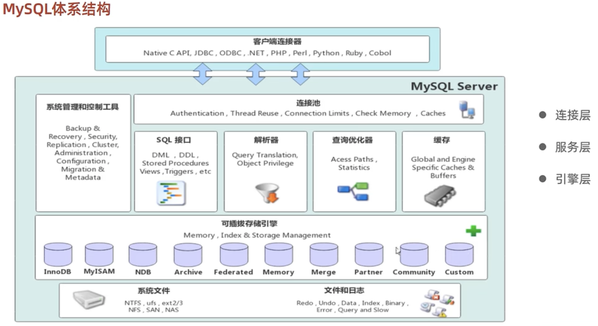


### DBMS


### 数据库


### 数据库表


# 环境搭建


## docker

社区地址 https://hub.docker.com/_/mysql?tab=tags

查看 MySQL 的可用版本

```shell
$ docker search mysql
NAME                            DESCRIPTION                                     STARS     OFFICIAL   AUTOMATED
mysql                           MySQL is a widely used, open-source relation…   13786     [OK]       
mariadb                         MariaDB Server is a high performing open sou…   5264      [OK]       
phpmyadmin                      phpMyAdmin - A web interface for MySQL and M…   734       [OK]       
percona                         Percona Server is a fork of the MySQL relati…   599       [OK]       
databack/mysql-backup           Back up mysql databases to... anywhere!         81                   
bitnami/mysql                   Bitnami MySQL Docker Image                      80                   [OK]
linuxserver/mysql-workbench                                                     48                   
ubuntu/mysql                    MySQL open source fast, stable, multi-thread…   41                   
linuxserver/mysql               A Mysql container, brought to you by LinuxSe…   38                   
circleci/mysql                  MySQL is a widely used, open-source relation…   28                   
google/mysql                    MySQL server for Google Compute Engine          23                   [OK]
rapidfort/mysql                 RapidFort optimized, hardened image for MySQL   14                   
bitnami/mysqld-exporter                                                         4                    
ibmcom/mysql-s390x              Docker image for mysql-s390x                    2                    
vitess/mysqlctld                vitess/mysqlctld                                1                    [OK]
newrelic/mysql-plugin           New Relic Plugin for monitoring MySQL databa…   1                    [OK]
rapidfort/mysql8-ib             RapidFort optimized, hardened image for MySQ…   0                    
rapidfort/mysql-official        RapidFort optimized, hardened image for MySQ…   0                    
mirantis/mysql                                                                  0                    
docksal/mysql                   MySQL service images for Docksal - https://d…   0                    
hashicorp/mysql-portworx-demo                                                   0                    
cimg/mysql                                                                      0                    
eclipse/mysql                   Mysql 5.7, curl, rsync                          0                    [OK]
drud/mysql                                                                      0                    
silintl/mysql-backup-restore    Simple docker image to perform mysql backups…   0                    [OK]
```

拉取官方的最新版本的镜像：

```shell
$ docker pull mysql:latest
```

创建目录

```shell
$ mkdir -p ~/mysql/conf
$ mkdir -p ~/mysql/data
```

启动容器

```shell
$ docker run -d \
--name mysql \
-p 3306:3306 \
-v ~/mysql/conf:/etc/mysql/conf.d \
-v ~/mysql/data:/var/lib/mysql \
-e MYSQL_ROOT_PASSWORD=root \
mysql
```

进入 MySQL 容器

```shell
$ docker exec -it mysql /bin/bash
```

登陆 MySQL 数据库

```shell
$ mysql -u root -p

# 添加远程登录用户
$ CREATE USER 'admin'@'%' IDENTIFIED WITH mysql_native_password BY 'admin';
$ GRANT ALL PRIVILEGES ON *.* TO 'admin'@'%';
```

查看并选择数据库

```shell
$ show databases;
$ use mysql;
```

修改加密方式并退出 Mysql 和 Mysql 容器

```shell
$ select host,user,plugin from user;
$ alter user 'root'@'%' identified with mysql_native_password by 'root';
$ exit
```


## 客户端

[DBeaver for MacOS](https://dbeaver.io/download/)


# 命令


## mysql

```shell
$ mysql [options] [database]

-u, --user=name            # 执行用户名
-p, --password[=name]      # 指定密码
-h, --host=name            # 指定服务器IP
-P, --port=port            # 指定连接端口
-e, --execute=name         # 执行sql语句并退出
-V, --version.             # 查看版本信息
```

```shell
$ mysql -uroot -proot -e 'show databases'
```


## mysqladmin

可以检查服务器的配置和当前状态，创建和删除数据库等。

```shell
$ mysqladmin -uroot -proot version
```

查看系统变量

```shell
$ mysqladmin -uroot -proot variables
```


## load

```shell
# 客户端连接mysql服务器时，加上选项 --local-infile
$ mysql --local-infile -u root -p

# 设置全局参数为 local_infile 为1，开启从本地文件加载到数据库表的开关
set global local_infile=1;

$ load data local infile '/home/user/file/test.txt' into table `tablename` fields terminated by ',' lines terminated by '\n';
```


## mysqldump

可以备份数据库，在不同数据库之间迁移数据，备份内容包含创建表、插入表的SQL

```shell
$ mysqldump -uroot -proot [options] db_name [table_name] > ddl.sql
$ mysqldump -uroot -proot [options] --database/-B db_name [db1 db2 ..]
$ mysqldump -uroot -proot [options] --all-databases/-A

--single-transaction选项表示不加锁的一致性数据备份

--add-drop-database           # 在每个数据库创建语句前面加上 drop database 语句
--add-drop-table              # 在每个表创建语句前面加上 drop table，默认开启，不开启（--skip-add-drop-table）
-n, --no-create-db            # 不包含数据库的创建语句
-t, --no-create-info          # 不包含表的创建语句
-d, --no-data                 # 不包含数据
-T, --tab=name                # 自动生成二个文件，一个.sql，一个.txt
```


## import

数据导入工具，用来导入 `mysqldump -T` 命令导出的文本文件。

```shell
$ mysqlimport [options] db_name textfile1 [textfile2 ..]
```


## source

数据导入工具，用来导入 `mysqldump -T` 命令导出的sql文件。

```shell
$ source /home/user/mysql/xxxx.sql
```


## ibd2sdi

查看ibd文件中的信息（表结构、数据）

```shell
$ ibd2sdi test.ibd
```


## mysqlbinlog

可以用文本形式打开服务器生成二进制日志。

```shell
$ mysqlbinlog [options] log-file1 log-file2 ..

-d, --database=name                             # 指定数据库名
-o, --offset=#                                  # 忽略掉日志中的前n行命令
-r, --result-file=name                          # 将输出的文本格式日志，输出到指定文件
-s, --short-form                                # 显示简单个事，忽略掉一些内容
--start-datetime=date1 --stop-datetime=date2    # 指定日期间隔内的所有日志
--start-position=pos1  --stop-position=pos2     # 指定位置间隔内的所有日志
```


## mysqlshow

对象查找工具，很快的查找存在那些数据库、数据库中的表、表中的列或索引信息。

```shell
$ mysqlshow [options] [db_name [table_name [col_name]]]

--count # 显示数据库及表的统计信息
-i      # 显示指定数据库或表的状态信息
```


------


# 数据类型

支持字符串、数值类型、日期时间类型。

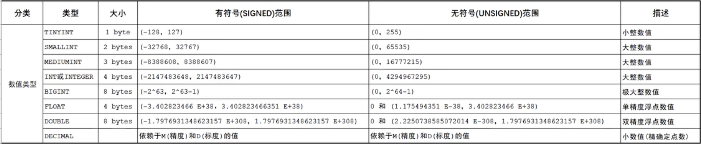

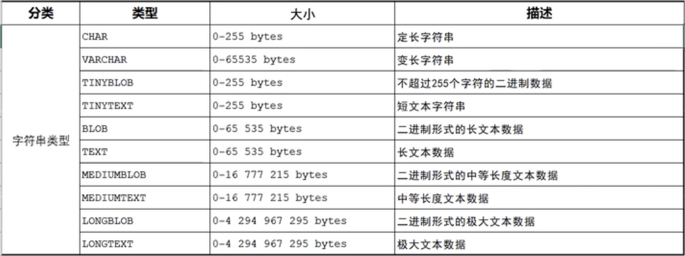


------


# SQL

SQL可以单行或多行书写，以分号结尾。

可以使用空格或缩进来增强语句的可读性。

MYSQL中SQL语句不区分大小写，关键字建议使用大写。

单行注释：-\-注释内容 或 # 注释内容（MYSQL独有）

多行注释：/* 注释内容 */


## DDL

英文 Data Definition Language，数据定义语言。


### 查询所有数据库

```sql
show databases
```


### 查询当前数据库

```sql
select databases();
```


### 创建数据库

```sql
create database [if not exists] 数据库名 [default charset 字符集] [collate 排序规则];
```


### 删除数据库

```sql
drop database [if exists] 数据库名;
```


### 使用数据库

```sql
USE 数据库;
```


### 查询所有表

```sql
show tables;
```


### 查看表结构

```sql
DESC 表名;
```


### 查询建表语句

```sql
show create table 表名;
```


### 对表添加字段

```sql
alter table 表名 add 字段名 类型(长度) [comment 注释] [约束];
```


### 修改表中字段类型

```sql
alter table 表名 modify 字段名 新数据类型(长度);
```


### 修改字段名和类型

```sql
alter table 表名 change 旧字段名 新字段名 类型(长度) [comment 注释] [约束];
```


### 删除字段

```sql
alter table 表名 drop 字段名；
```


### 修改表名

```sql
alter table 表名 rename to 新表名;
```


### 删除表

```sql
drop table [if exists] 表名;
```


### 重新建表

```sql
truncate table 表名;
```


### 创建索引

```sql
create [unique|fulltext] index 索引名 on 表名 (索引字段名, ..);
```


### 创建前缀索引

可以将字符串中的一部分建立索引，可以大大节省索引空间和提高索引效率。

```sql
create index 索引名 on table(字段名(n));
```

公式中的n可以使用如下规则选择，以下计算结果越接近1表示性能是最好的。

```sql
select count(distinct name) / count(*) from table;
select count(distinct substring(name, 1, 3)) / count(*) from table;
```


### 查看索引

```sql
show index from 表名;
```


### 删除索引

```sql
drop index 索引名 on 表名;
```


## DML

英文 Data Manipulation Language，数据库管理语言，用来对数据库表中数据记录进行增删查该操作。


### 添加数据

给指定字段添加数据

```sql
insert into 表名(字段名1, 字段名2, ..) values (值1，值2, ..);
```

给表中所有字段添加值

```sql
insert into 表名 values (值1，值2, ..);
```

批量添加数据

```sql
insert into 表名(字段名1, 字段名2, ..) values (值1，值2, ..),(值1，值2, ..),(值1，值2, ..);
```

```sql
insert into 表名 values (值1，值2, ..),(值1，值2, ..),(值1，值2, ..);
```


### 修改数据

```sql
update 表名 set 字段名1=值1, 字段名2=值2, ... [where 条件];
```


### 删除数据

```sql
delete from 表名 [where 条件];
```


## DQL

英文 Data QueryLanguage，数据查询语言，是用来查询数据库表中数据的。

```sql
select
	字段列表
from 
	表名列表
where
	条件列表
group by
	分组字段列表
having
	分组后的条件列表
order by 
	排序字段列表
limit
	分页参数
```

- 基本查询

- 条件查询（where）

- 聚合函数（sum、count、max、min、avg）

- 分组查询（group by）

- 排序查询（order by）

- 分页查询

  ```sql
  limit 起始位置从0开始, 查询记录数
  ```

  ```sql
  limit 起始位置从0开始
  ```

- 去重查询（distinct）


### union

把多个SQL查询结果集合并为一个新的查询结果集，会将多个结果集中的重复数据剔除掉。


### union all

把多个SQL查询结果集合并为一个新的查询结果集，但不会过滤掉重复数据。


### 标量子查询

是指子查询返回的结果是单个值（数字、字符串、日期等）。

```sql
select * from table where name=(select name from table1 where id=1);
```


### 列子查询

是指子查询返回的结果是一列。

```sql
select * from table where id in (select id from table1 where name like '%军%');
```


### 行子查询

是指子查询返回的结果可以是一行。

```sql
select * from table where (id,name) in (select id,name from table1 where name id=1);
```


### 表子查询

是指子查询返回的结果是多行多列。

```sql
select * from table where (id,name) in (select id,name from table1 where like '%军%');
```


## DCL

英文 Data Control Language，数据库控制语言，使用来管理数据库用户，控制数据库的访问权。


### 管理用户

查询用户

```sql
select * from user;
```

创建用户

```sql
create user '用户名'@'主机名' indentified by '密码';
```

修改用户密码

```sql
alter user '用户名'@'主机名' indentified with mysql_native_password by '新密码'；
```

删除用户

```sql
drop user '用户名'@'主机名';
```


### 权限控制

MYSQL中定义了很多权限，常用权限如下图所示：


查询权限

```sql
show grant for '用户名'@'主机名';
```

授予权限

```sql
grant 权限列表 on 数据库名.表名 to '用户名'@'主机名';
```

撤销权限

```sql
revoke 权限列表 on 数据库名.表名 from '用户名'@'主机名';
```


## SQL提示

建议查询优化器使用指定的索引：

```sql
explain select * from table use index(索引名) where id=1;
```

强制查询优化器不用指定的索引：

```sql
explain select * from table ignore index(索引名) where id=2;
```

强制查询优化器使用指定的索引：

```sql
explain select * from table force index(索引名) where id=2;
```


## 性能分析工具


### SQL执行频率

通过如下命令可以查看当前数据库的insert、update、delete、select的访问频次。

```sql
show [session|global] status like 'Com_______';
```

session表示查看当前会话的执行频率，global表示查看数据库中SQL执行频率。


### 慢查询日志

[详见慢SQL日志](#慢SQL日志)


### profile详情

查看sql语句在各个阶段的耗时情况。

先通过 have_profiling 参数查看MYSQL是否支持profile操作。

```sql
select @@have_profiling;
```

默认 profiling 是关闭的，可以通过set语句在session/global级别开启profiling：

```sql
set profiling=1;
```

然后执行一系列的SQL语句，然后通过如下语句查看SQL的耗时情况

```sql
# 查看每个SQL的query_id 与耗时
show profiles;

# 查看指定的 query_id 的SQL语句各个阶段的耗时情况
show profile for query query_id;

# 查看指定的 query_id 的SQL语句CPU的使用情况
show profile cpu for query query_id;
```


### 查看执行计划

通过在SQL语句前使用 explain 或 desc 可以查看SQL的执行计划。

执行计划中字段意义：

id：语句查询的序号，如果值越大，越先执行。如果值相同，从上到下执行。

select_type：simple（简单表）、primary（主查询）、union（语句中第二个select语句）、subquery（where条件中的子查询）。

type：连接类型，性能由高到低是 null、system、const、eq_ref、ref、range、index、all。

possible_key：可能用到的索引名集合。

key：实际用到的索引，null表示没有用到索引。

Key_len：表示索引中使用的字节数，长度越短越好。

rows：可能影响的行数，在innodb中是一个预估值。

Filtered：表示返回结果的行数占读取行数的百分比，值越大越好。

Extra：`useing index condition` 表示需要回表查询数据。`using where; using index` 表示使用了索引，且返回字段在索引中都能找到，不需要回表查询。

using index：通过有序索引直接扫描，返回有序数据。

using filesort：是指凡是不是通过索引直接排序，而返回的结构。

using temporary：使用临时表，性能比较低。


## 性能优化原则


### 最左前缀约定

是指查询从索引的最左字段开始，并且不跳过索引中的列，如果跳跃某一列，则索引将部分失效。


### 范围查询

联合索引中，出现范围查询（> <）范围查询右侧列索引会失效。尽量使用 >= <= 运算符。


### 索引列运算

如果在索引列上执行运算操作，则不会使用字段上的索引。


### 字符串不加引号

如果字符串型的字段二端不加单引号，则会导致不会使用索引。


### 模糊匹配

如果在尾部进行模糊匹配，则索引不会失效。如果在头部进行模糊匹配，则索引会失效。


### or条件

or 关键字二端的字段，一端有索引，一端没有索引，那么索引都不会起作用。只有二端的字段都有索引时，索引才会起作用。


### 数据分布影响

如果查询优化器评估使用索引比全表扫描要慢，则不使用索引。


### 使用覆盖索引

查询使用了索引，并且索引会覆盖返回的所有列（注意索引中一定包含了主键所在的列）。减少使用 select \* from 

尽量使用联合索引而非单列索引，索引尽量覆盖查询结果中的字段，避免回表查询。


### 索引设计优化

针对数据量大，且查询比较频繁的表建立索引。

针对 where、group by、order by 语句中的字段建立索引。

尽量选择区分度较高的列（字段值中不容易出现重复数据）作为索引。尽量建立唯一索引，区分度越高，索引使用效率越高。

如果字符串或大文本字段较长，可以建立前缀索引。

尽量使用联合索引，且要完全覆盖查询结果集中的列。

要控制索引数量，因为索引会影响数据插入和删除的效率。

如果索引列中不可能出现null值，则建表的时候可以使用not null约束，有利于查询优化器生成最优的执行计划。


### 数据插入优化

使用批量插入方式。

手动提交事物。

主键顺序插入，按从小到大顺序插入，可以避免页分裂和页合并操作所消耗的时间。

大批量数据可以使用load命令将文件一次性加载到数据库表中。


### 主键设计优化

尽量降低主键长度。

插入数据时，尽量选择顺序插入，防止页分裂和页合并操作。

避免对主键的修改。


### order by 优化

遵循最左前缀原则。

多字段排序，一个升序，一个降序，在创建联合索引时要指定字段的asc与desc。

如果不可避免的出现filesort，可以适当增加缓冲区大小 sort_buffer_size（默认256k）


### group by 优化

遵循最左前缀原则。

可以通过索引提高效率。


### limit 优化

可以通过覆盖索引+子查询的方式来优化

```sql
select a.* from table1 a, (select id from table1 limit 900000, 100) b where a.id = b.id
```


### count(\*) 优化

Myisam引擎会保存表的总行数，在执行 `select count(*) from table` 速度会很快。

InnoDB引擎会进行全表扫描来实时统计表中总行数。

效率从高到低：count(\*) $\approx$ count(1) > count(主键) > count(字段)


### update 优化

对一条记录进行更新时，where条件中的字段如果没有索引，则会对表加表锁，而不是行锁。

如果更新记录时 where 条件中字段是索引字段，则会对表加行锁。


------


# 函数


## 字符串

https://www.cnblogs.com/shoshana-kong/p/16490871.html

| 函数名称                                                 | 作 用                                                        |
| -------------------------------------------------------- | ------------------------------------------------------------ |
| [LENGTH](http://c.biancheng.net/mysql/length.html)       | 计算字符串长度函数，返回字符串的字节长度                     |
| [CONCAT](http://c.biancheng.net/mysql/concat.html)       | 合并字符串函数，返回结果为连接参数产生的字符串，参数可以使一个或多个 |
| [INSERT](http://c.biancheng.net/mysql/insert.html)       | 替换字符串函数                                               |
| [LOWER](http://c.biancheng.net/mysql/lower.html)         | 将字符串中的字母转换为小写                                   |
| [UPPER](http://c.biancheng.net/mysql/upper.html)         | 将字符串中的字母转换为大写                                   |
| [LEFT](http://c.biancheng.net/mysql/left.html)           | 从左侧字截取符串，返回字符串左边的若干个字符                 |
| [RIGHT](http://c.biancheng.net/mysql/right.html)         | 从右侧字截取符串，返回字符串右边的若干个字符                 |
| [TRIM](http://c.biancheng.net/mysql/trim.html)           | 删除字符串左右两侧的空格                                     |
| [REPLACE](http://c.biancheng.net/mysql/replace.html)     | 字符串替换函数，返回替换后的新字符串                         |
| [SUBSTRING](http://c.biancheng.net/mysql/substring.html) | 截取字符串，返回从指定位置开始的指定长度的字符换             |
| [REVERSE](http://c.biancheng.net/mysql/reverse.html)     | 字符串反转（逆序）函数，返回与原始字符串顺序相反的字符串     |

| 函数名                                                       | 返回值 | 说明                                                         |
| ------------------------------------------------------------ | ------ | ------------------------------------------------------------ |
| UPPER(列\|字符串)                                            |        | 将字符串每个字符转为大写                                     |
| LOWER(列\|字符串)                                            |        | 将字符串每个字符转为小写                                     |
| CONCAT(str1，str2，. . . )                                   |        | 将所有字符串连接成一个字符串                                 |
| REPLACE(列\|字符串，旧字符串，新字符串)                      |        | 使用新字符串替换旧字符串                                     |
| LENGTH(列\|字符串)                                           |        | 求字符串长度                                                 |
| SUBSTR(列\|字符串，开始点[，长度])                           |        | 字符串截取                                                   |
| LEFT(str，len)                                               |        | 获取字符串左边len个字符组成的字符串                          |
| RIGHT(str，len)                                              |        | 获取字符串右边len个字符组成的字符串                          |
| MID(str，pos，len)                                           |        | 获取字符串中从pos(第几个)位置开始，长度为len的字符串         |
| ASCII(字符)                                                  |        | 返回与指定字符对应的十进制整数                               |
| CHR(数字)                                                    |        | 返回与整数对应的字符                                         |
| RPAD(列\|字符串，长度，填充字符) LPAD(列\|字符串，长度，填充字符) |        | 用指定的字符在字符串右或左填充                               |
| LTRIM(字符串)、RTRIM(字符串)                                 |        | 去掉字符串左或右的空格                                       |
| RTRIM                                                        |        | 用在类似于UPDATE这样的SQL语句中时，没有尾部空格的行将不会发生变化。此函数是多字节安全(multibyte-safe) 的函数。要想去掉字符的前导空格(leading space) ,请使用RTRIM( )函数。要想去掉字符的前导空格(leading space)和结尾空格(railing space)，请使用TRIM( )函数。 |
| TRIM(列\|字符串)                                             |        | 去掉字符串左右空格                                           |
| INSTR(列\|字符串，要查找的字符串，开始位置，出现位置)        |        | 查找一个子字符串是否在指定的位置上出现                       |
| UNHEX                                                        |        | 此函数将十六进制数字转换成与之等价的字符。它执行的是HEX( )函数的方向操作， 从MySQL 4.1 .2版本开始引入了该函数。 |
| UNCOMPRESSED _LENGTH                                         |        | 此函数返回给定的压缩字符串在压缩前时字符串的长度。你可以使用COMPRESS( )函数压缩字符串。从MySQL 4.1版本开始引入了该函数。 |
| UNCOMPRESS                                                   |        | 此函数的返回值为相应于给定的压缩字符串进行解压缩后得到的字符串，它的功能恰好与COMPRESS( )函数相反。 这个函数要求MySQL已经使用压缩库(如，zlib) 对它编译过。如果给定的字符串是未压缩的字符串或者MySQL没有使用zlib压缩，那么它的返回值为NULL.从MySQL 4.1.1版本开始引入了该函数。 |
| REVERSE                                                      |        | 该函数返回参数string中的字符，但是其顺序和字符顺序相反。它是多字节安全(multibyte-safe)的函数 |
| REPEAT                                                       |        | 此函数返回多个由第一个参数指定的字符串(string) ，重复的次数为第二个参数中指定的参数count。如果count的值小于1，那么它的返回值为空字符串。如果其中有一个参数值为NULL,那么它的返回值也为NULL。 |
| QUOTE                                                        |        | 此函数接受一个用单引号括起来的字符串，它的返回值为字符串，在SQL语句中我们可以安全地使用该字符串。字符串中包含的如下符号可以被反斜线引用：单引号、反斜线符号、ASCII NULL和Control-Z。当从公共Web界面接受值时，这是一个非常安全的措施 |


## 数值型

| 函数名称                                                     | 作 用                                                      |
| ------------------------------------------------------------ | ---------------------------------------------------------- |
| [ABS](http://c.biancheng.net/mysql/abc.html)                 | 求绝对值                                                   |
| [SQRT](http://c.biancheng.net/mysql/sqrt.html)               | 求二次方根                                                 |
| [MOD](http://c.biancheng.net/mysql/mod.html)                 | 求余数                                                     |
| [CEIL 和 CEILING](http://c.biancheng.net/mysql/ceil_celing.html) | 两个函数功能相同，都是返回不小于参数的最小整数，即向上取整 |
| [FLOOR](http://c.biancheng.net/mysql/floor.html)             | 向下取整，返回值转化为一个BIGINT                           |
| [RAND](http://c.biancheng.net/mysql/rand.html)               | 生成一个0~1之间的随机数，传入整数参数是，用来产生重复序列  |
| [ROUND](http://c.biancheng.net/mysql/round.html)             | 对所传参数进行四舍五入                                     |
| [SIGN](http://c.biancheng.net/mysql/sign.html)               | 返回参数的符号                                             |
| [POW 和 POWER](http://c.biancheng.net/mysql/pow_power.html)  | 两个函数的功能相同，都是所传参数的次方的结果值             |
| [SIN](http://c.biancheng.net/mysql/sin.html)                 | 求正弦值                                                   |
| [ASIN](http://c.biancheng.net/mysql/asin.html)               | 求反正弦值，与函数 SIN 互为反函数                          |
| [COS](http://c.biancheng.net/mysql/cos.html)                 | 求余弦值                                                   |
| [ACOS](http://c.biancheng.net/mysql/acos.html)               | 求反余弦值，与函数 COS 互为反函数                          |
| [TAN](http://c.biancheng.net/mysql/tan.html)                 | 求正切值                                                   |
| [ATAN](http://c.biancheng.net/mysql/atan.html)               | 求反正切值，与函数 TAN 互为反函数                          |
| [COT](http://c.biancheng.net/mysql/cot.html)                 | 求余切值                                                   |


## 日期时间

| 函数名称                                                     | 作 用                                                        |
| ------------------------------------------------------------ | ------------------------------------------------------------ |
| [CURDATE 和 CURRENT_DATE](http://c.biancheng.net/mysql/curdate_current_date.html) | 两个函数作用相同，返回当前系统的日期值                       |
| [CURTIME 和 CURRENT_TIME](http://c.biancheng.net/mysql/curtime_current_time.html) | 两个函数作用相同，返回当前系统的时间值                       |
| [NOW 和 SYSDATE](http://c.biancheng.net/mysql/now_sysdate.html) | 两个函数作用相同，返回当前系统的日期和时间值                 |
| [UNIX_TIMESTAMP](http://c.biancheng.net/mysql/unix_timestamp.html) | 获取UNIX时间戳函数，返回一个以 UNIX 时间戳为基础的无符号整数 |
| [FROM_UNIXTIME](http://c.biancheng.net/mysql/from_unixtime.html) | 将 UNIX 时间戳转换为时间格式，与UNIX_TIMESTAMP互为反函数     |
| [MONTH](http://c.biancheng.net/mysql/month.html)             | 获取指定日期中的月份                                         |
| [MONTHNAME](http://c.biancheng.net/mysql/monthname.html)     | 获取指定日期中的月份英文名称                                 |
| [DAYNAME](http://c.biancheng.net/mysql/dayname.html)         | 获取指定曰期对应的星期几的英文名称                           |
| [DAYOFWEEK](http://c.biancheng.net/mysql/dayofweek.html)     | 获取指定日期对应的一周的索引位置值                           |
| [WEEK](http://c.biancheng.net/mysql/week.html)               | 获取指定日期是一年中的第几周，返回值的范围是否为 0〜52 或 1〜53 |
| [DAYOFYEAR](http://c.biancheng.net/mysql/dayofyear.html)     | 获取指定曰期是一年中的第几天，返回值范围是1~366              |
| [DAYOFMONTH](http://c.biancheng.net/mysql/dayofmonth.html)   | 获取指定日期是一个月中是第几天，返回值范围是1~31             |
| [YEAR](http://c.biancheng.net/mysql/year.html)               | 获取年份，返回值范围是 1970〜2069                            |
| [TIME_TO_SEC](http://c.biancheng.net/mysql/time_to_sec.html) | 将时间参数转换为秒数                                         |
| [SEC_TO_TIME](http://c.biancheng.net/mysql/sec_to_time.html) | 将秒数转换为时间，与TIME_TO_SEC 互为反函数                   |
| [DATE_ADD 和 ADDDATE](http://c.biancheng.net/mysql/date_add_adddate.html) | 两个函数功能相同，都是向日期添加指定的时间间隔               |
| [DATE_SUB 和 SUBDATE](http://c.biancheng.net/mysql/date_sub_subdate.html) | 两个函数功能相同，都是向日期减去指定的时间间隔               |
| [ADDTIME](http://c.biancheng.net/mysql/addtime.html)         | 时间加法运算，在原始时间上添加指定的时间                     |
| [SUBTIME](http://c.biancheng.net/mysql/subtime.html)         | 时间减法运算，在原始时间上减去指定的时间                     |
| [DATEDIFF](http://c.biancheng.net/mysql/datediff.html)       | 获取两个日期之间间隔，返回参数 1 减去参数 2 的值             |
| [DATE_FORMAT](http://c.biancheng.net/mysql/date_format.html) | 格式化指定的日期，根据参数返回指定格式的值                   |
| [WEEKDAY](http://c.biancheng.net/mysql/weekday.html)         | 获取指定日期在一周内的对应的工作日索引                       |


## 聚合函数

| 函数名称                                         | 作用                             |
| ------------------------------------------------ | -------------------------------- |
| [MAX](http://c.biancheng.net/mysql/max.html)     | 查询指定列的最大值               |
| [MIN](http://c.biancheng.net/mysql/min.html)     | 查询指定列的最小值               |
| [COUNT](http://c.biancheng.net/mysql/count.html) | 统计查询结果的行数               |
| [SUM](http://c.biancheng.net/mysql/sum.html)     | 求和，返回指定列的总和           |
| [AVG](http://c.biancheng.net/mysql/avg.html)     | 求平均值，返回指定列数据的平均值 |


## 流程控制

| 函数名称                                           | 作用           |
| -------------------------------------------------- | -------------- |
| [IF](http://c.biancheng.net/mysql/if.html)         | 判断，流程控制 |
| [IFNULL](http://c.biancheng.net/mysql/ifnull.html) | 判断是否为空   |
| [CASE](http://c.biancheng.net/mysql/case.html)     | 搜索语句       |


------


# 约束

约束是作用于表中字段上的，可以在创建表和修改表时添加约束。

| MySQL关键字 | 含义               |                                                    |
| ----------- | ------------------ | -------------------------------------------------- |
| 非空约束    | NOT NULL           | 数据列不允许包含NULL值                             |
| 默认约束    | DEFAULT            | 保存数据时，如果值为null，则采用默认值             |
| 主键约束    | PRIMARY KEY        | 要求非空且唯一                                     |
| 外键约束    | FOREIGN KEY        | 在二张表之间建立连接关系，保证数据的一致性和完整性 |
| 唯一约束    | UNIQUE             | 保证字段的所有值唯一、不重复                       |
| 自增长约束  | AUTO_INCREMENT     | 自动递增，适用于整数类型 UNSIGNED 无符号           |
| 字符集约束  | CHARACTER SET name | 指定一个字符集                                     |
| 检查约束    | CHECK              | 保证字段值满足某一个条件（8.0.16之后的版本）       |

外键约束

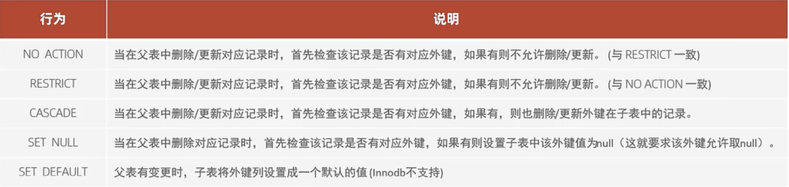

语句：

```sql
alter table 表名 add constraint 外键名称 foreign key (外键字段) references 主表名(主表字段名) on update cascade on delete cascade;
```


------


# 存储引擎

是存储数据、建立索引、更新/查询数据等技术实现。存储引擎是基于表的，而不是基于数据库，所以也被称为表类型。

查看所有引擎

```sql
show engines;
```

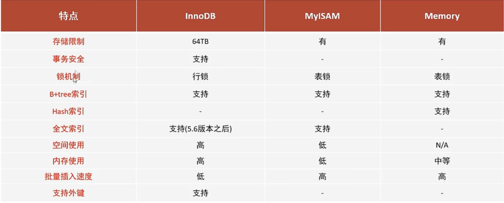


## InnoDB

是一种兼顾高可用性与高性能的通用存储引擎，在 MYSQL5.5 之后，是默认的 MYSQL 存储引擎。

DML遵循ACID模型（原子性- undolog，持久性-redolog，一致性-undo log+redo log，隔离性：锁+mvcc），支持事物。

行级锁，提高并发访问性能。

支持外键约束，保证数据的完整性和正确性。

支持奔溃恢复的特性。

索引（B+树索引与文本索引）和数据都存储在同一个文件内。


### 总体架构


### 逻辑存储结构

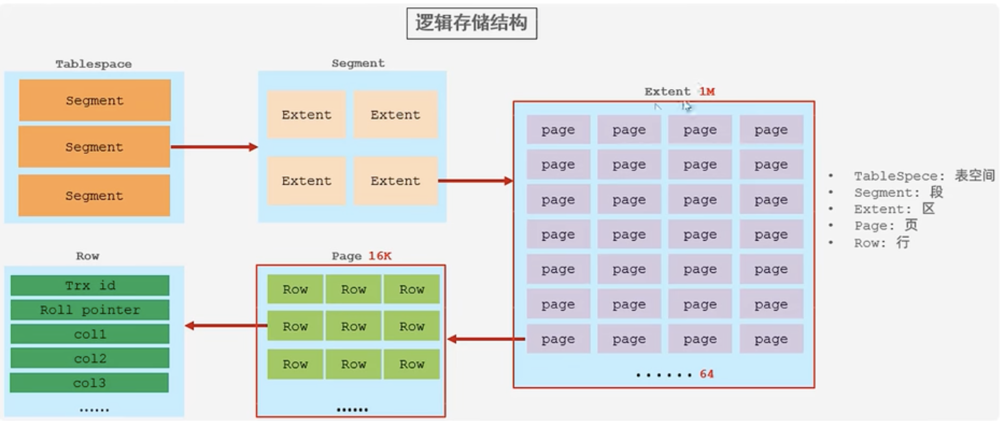


#### 表空间

ibd文件，一个mysql实例可以有多个表空间，用于存储：表结构、数据、索引等。


#### 段

分为数据段（leaf node segement）、索引段（non-leaf node segment）、回滚段（rollback segment）、Innodb是索引组织表，数据段就是B+树的叶子结点，索引段就是B+树非叶子结点，段可以管理多个区。


#### 区

是表空间中的单元结构，每个区的大小为1M，每个区中有64个连续的页（16K）。


#### 页

是Innodb引擎磁盘管理的最小单元，每个页16K，为了保证页的连续，引擎每次申请4-5个区。页中数据是按行存储的。


#### 行

数据是按行存放的，除了数据还会有如下属性：

Trx_id：最后一个事务的ID编号。

Roll_pointer：每次对某条记录改动时，都会把旧版本写入到undo日志中。然后这个隐藏列就相当于一个指针，可以找到修改前的记录。


### 内存架构


#### Buffer Pool

缓冲池是指主内存中的一个区域，可以缓存磁盘上经常操作的真实数据。在执行增删改操作时，先操作缓冲池中的数据，然后在以一定频率刷到磁盘中。从而减少磁盘IO，加快了处理速度。

缓冲池以page为单位，底层采用链表的数据结构管理Page，根据状态，将Page分为三种类型：

- free page：空闲page，未被使用；
- clean page：被使用page，数据没有被修改过；
- dirty page：脏页，被使用的page。数据被修改过，页中数据与磁盘数据不一致；


#### Change Buffer

更改缓冲区，针对非唯一的二级索引页，在执行DML语句时，如果这些数据页在缓冲池中不存在的时候，不会直接操作硬盘，会将数据变更存储在更改缓冲区中，在未来数据被读取时，再将数据合并恢复到缓冲池中，再将合并后的数据刷新到磁盘中。


#### 自适应hash

英文 Adaptive Hash Index，自适应hash索引，用于优化对Buffer Pool数据的查询。Innodb存储引擎会监控对表上各索引页的查询，如果观察到hash索引可以提高查询速度，则建立hash索引，这个过程称为自适应hash索引。

参数：

adaptive_hash_index


#### 日志缓冲区

用来保存要写入磁盘的log日志（redo log、undo log），默认16M，日志缓冲区中的内容会定期刷新到磁盘。如果需要更新、插入、删除多行的事务，增加日志缓冲区大小可以节省IO时间。

参数：

Innodb_log_buffer_size：缓冲区大小。

Innodb_flush_log_at_trx_commit：日志刷新到磁盘的时机，1表示日志在每次事务提交时写入并刷入到磁盘；0表示每秒将日志写入并刷新到磁盘一次；2日志在每次提交事务后写入，并每秒刷新到磁盘一次。


### 磁盘结构


#### 系统表空间

英文 System Tablespace，主要存放更改缓冲区中的时间，参数：innodb_data_file_path（系统表空间文件）


#### 独立表空间

File-Per-Table Tablespace，是一个设置值，是指每个表的表空间都是存储在独立的文件中。

参数：

Innodb_file_per_table：每张表有独立的表空间文件开关，不会在系统表空间存放，默认是开启的。


#### 通用表空间

General Tablespaces，需要通过以下语句创建通用表空间，在创建表时，可以指定表空间。

```sql
create tablespace 表空间名 add datafile '表空间文件名' engine=引擎名;
```

```sql
create table .. tablespace 表空间名；
```


#### 撤销表空间

Undo Tablespaces，MYsql实例在初始化时会自动创建2个（undo_001与undo_002）默认的undo表空间（初始16M），用于存储undo log日志。


#### 临时表空间

Temporary Tablespaces，存储用户创建的临时表数据。innodb中分为会话表空间和临时表空间。


#### 双写缓冲区

Doublewrite Buffer Files：双写缓冲区文件，innodb引擎将数据页从缓冲池刷新到磁盘前，先将数据页写入到双写缓冲区中，在系统异常时恢复数据。

\#ib_16384_0.dblwr与\#ib_16384_1.dblwr就是双写缓冲区文件。


### 后台线程

作用就是异步的将缓冲区中的数据刷新回磁盘中，保持数据的一致性。


#### Master Thread

核心后台线程，负责调度其他线程，还负责将缓冲池中数据异步刷新回磁盘中，包括脏页的刷新、合并插入缓存、undo页的回放。


#### IO Thread

在innodb中大量使用了AIO来处理IO请求，可以极大提高数据库性能，而IO Thread负责这些IO请求的回调。


#### Purge Thread

在事务提交后，undo log就没有用了，使用这个线程来回收。


#### Page Cleaner Thread

协助 Master Thread 刷新脏页到磁盘的线程，可以减轻 Master Thread 的工作压力，减少阻塞。


### redo log

重做日志，记录的是事务提交时数据页的物理修改，用来实现事务的持久性。当事务提交后会把所有修改信息保存到该日志文件中，用于刷新脏页到磁盘发生错误时，进行数据恢复使用。

分为2部分：

重做日志缓冲（redo log buffer）：内存中的结构。

重做日志文件（redo log file）：在磁盘中。

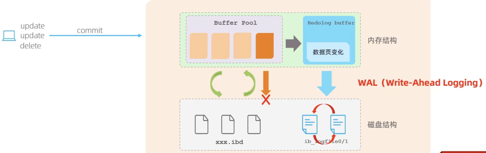


### undo log

回滚日志，用于记录被修改前的操作，二个作用：用于回滚事务和MVCC（多版本并发控制）。记录的是逻辑日志，记录每个sql对应的反向的操作。保证了原子性。存储时使用rollback segment回滚段（内部1024个undo log segment）。


### MVCC机制

英文 Multi-Version Concurrency Control，多版本并发控制。具体实现依赖于隐式字段、undo log日志、readView。实现了事务的隔离性。


#### 当前读

读取的记录是最新版本，还要保证其他事物不能修改当前记录，会对记录加锁。

`select * from table lock in share mode`，共享锁，是一种当前读的行为。

`select * from table for update|insert|delete`，排他锁，是一种当前读行为。


#### 快照读

读取当前可见的记录数据，作为快照，不加锁，非阻塞读。

- RC：每次select 都是一次快照读；
- RR：开启事务后，第一个语句才是快照读；
- Serial：快照读会退化为当前读；


#### 隐式字段

是表中记录中的隐藏字段

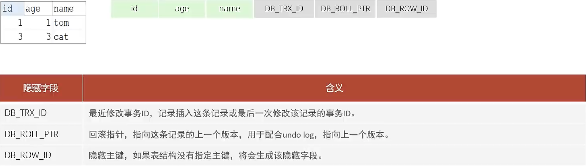


#### undo log

是指不同事务或相同事务对同一条记录进行修改，会导致该记录的undo log生成一条记录版本链表，链表的头部是最新的旧记录，尾部是最早的旧记录。

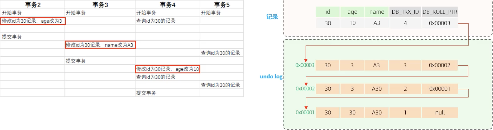


#### readView

读视图，是快照读SQL执行时MVCC提取数据的依据，记录并维护当前活跃的事务ID。

包含了四个核心字段：


不同隔离级别，生成ReadView的时机不同：

RC：在事务中每一次快照读时，生成readView。

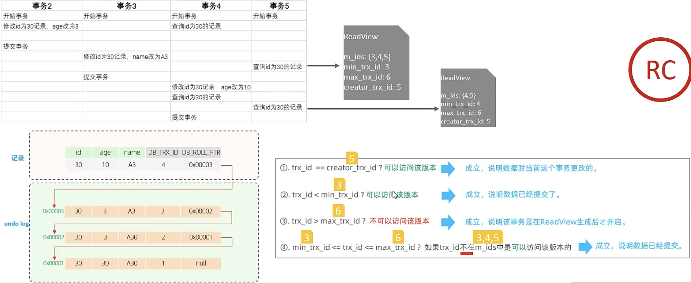

RR：仅在事务中第一次快照读时，生成ReadView。

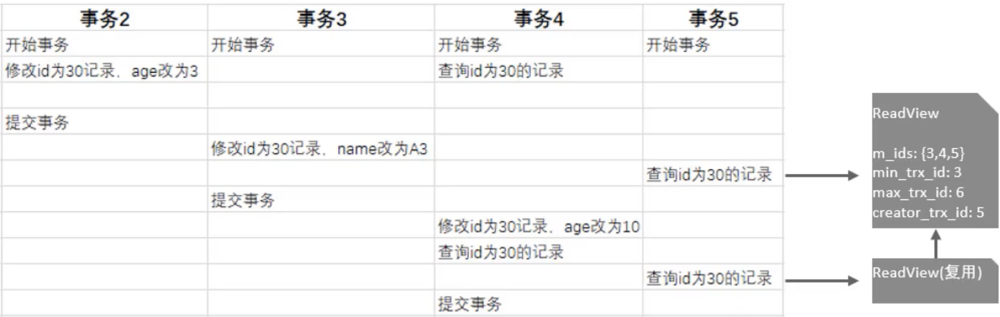


## Myisam

不支持外键，支持表锁，不支持行锁，访问速度比较快。

文件：

\*.sdi存储表结构信息（JSON格式数据）       

\*.MYD存储数据       

\*.MYI存储索引（B+树索引、R-Tree索引、文本索引）

适合读操作和插入操作频繁的场景，不适合频繁更新和删除数据。


## Memory

数据存储在内存中的，可以作为临时表或缓存使用。

支持Hash索引与B+树索引的。


------


# 索引


## 索引结构

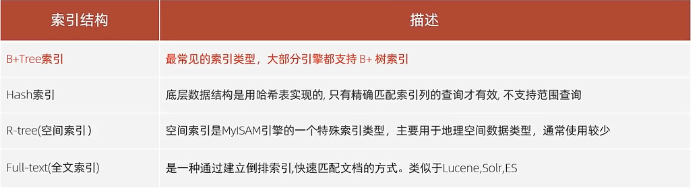


### 存储引擎

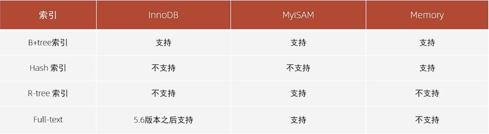


### 为什么用B+树？

Hash索引，只支持等值比较（= in），不支持排序与范围查询（between > < …）。B树中，叶子结点和非叶子结点都会保存数据，导致一页中存储的健值减少，指针跟着减少，保存同样数据时，只能增加数的高度，导致性能降低。而在B+树中，非叶子结点是不存储数据的，只保存健值与指针，自然的非叶子结点中存储的健值要比B树中多，也就是说B+树的层级会更少，效率会更高。B+树相对于B树增加了指向相邻结点的双向指针，提高了区间访问与排序的性能。


## 索引分类


聚集索引选取规则：

- 如果存在主键，则主键索引就是聚集索引；
- 如果不存在主键，则使用第一个唯一索引作为聚集索引；
- 如果没有主键和唯一索引，则Innodb引擎会自动生成一个rowid作为隐藏的聚集索引；

回表查询：是指通过二级索引查询到对应的主键，再根据主键值再到聚集索引中查找对应的行信息。


------


# 视图


## 创建视图

```sql
create [or replace] view 视图名 as select * from table [with [cascaded|local] check option];
```

`with check option` 表示视图检查正在更改（插入、更新、删除）的每行，检查数据是否符合视图定义时的条件，默认 cascaded。

检查选项：

没有CHECK OPTION：不检查本视图的条件，但需要满足相关视图的条件。

cascaded：会级联检查视图依赖的其他视图，并逐级进行检查。

local：需要满足本视图的条件和本视图相关视图的条件才可更新。（同CASCADED）

注意只有视图中一行数据与表中一行数据是一对一关系时，才可以通过视图来更新表中数据。


## 查询视图

```sql
show create view 视图名;
```


## 修改视图

```sql
alter view 视图名 as select * from table [with [cascaded|local] check option];
```

```sql
create or replace view 视图名 as select * from table [with [cascaded|local] check option];
```


## 删除视图

```sql
drop view [if exists] 视图名;
```


# 存储过程


## 查看状态

```sql
show procedure status;
```


## 查看DDL

```sql
show create procedure 存储过程名;
```


## 创建

```sql
create procedure 存储过程名([参数列表])
begin
	-- SQL语句
end;
```


## 删除

```sql
drop procedure 存储过程名;
```


## 调用

```sql
call 存储过程名([参数]);
```


## 参数类型

```sql
create procedure 存储过程名(in/out/inout 参数名 参数类型)
```


## 系统变量

系统变量：Mysql提供的服务器层面变量，分为全局变量（global，在所有会话中都可以访问）、会话变量（session）。

查看系统变量

```sql
show [session|global] variables;
show [session|global] variables like '...'; -- 模糊查找系统变量名
select @@[session|gloabl] 系统变量名;
```

设置系统变量

```sql
set [session|global] 系统变量名=值;
set @@[session|global] 系统变量名=值;
```


## 用户变量

```sql
set @var_name=10;
select @var_name;
```


## 局部变量

```sql
declare 变量名 变量类型[default ..];
```


## case 语句

```sql
case value
	when 条件 then 值
	else 值
end case;
```


## If 语句

```sql
if 条件1 then
	..
elseif 条件2 then
	..
else
	..
end if;
```


## while语句

```sql
while 条件 do
...
end while;
```


## Repeat 语句

```sql
repeat
	...
	until 条件
end repeat;
```


## 条件处理语句

```sql
declare <continue|exit> Handler for condition_value [, condition_value] ... statement;
```

sqlstate value：状态码，如 0200。

sqlwarning：所有以 01 开头的sqlstate代码的简写。

not found：所有以 02 开头的sqlstate代码的简写。

sqlexception：所有没有被sqlwarning或not found捕获的sqlstate代码的简写。


## 游标

```sql
declare 游标名 cursor for select * from table;
```

打开游标

```sql
open 游标名;
```

获取游标记录

```sql
fetch 游标名 into 变量[, 变量];
```

关闭游标

```sql
close 游标名;
```


## 函数

```sql
create function 函数名([参数列表])
returns type [characteristic ..]
begin
	...
	return ...;
end;
```

characteristic说明：

Determinstic：相同的输入参数产生相同的结果。

no sql：不包含sql语句。

reads sql data：包含读取数据的语句，但不包含写入数据的语句。


------


# 锁

锁是在并发场景中解决数据一致性和有效性的机制。全剧锁、表级锁、行级锁。


## 全局锁

对整个数据库实例加锁，典型使用场景是数据库全库备份，对所有表进行锁定。


加全局锁

```sql
flush tables with read lock;
```

解锁

```sql
unlock tables;
```


## 表锁

锁住整个表，应该在innodb、myisam、BDB引擎中。

表共享读锁（read lock），会阻塞其他客户端的写，不会阻塞其他客户端的读。

表独占写锁（write lock），会阻塞其他客户端的写，会阻塞其他客户端的读。

加锁语法：

```sql
lock tables 表名.. read/write;
```

释放锁或断开连接：

```sql
unlock tables;
```


## 元数据锁

英文 meta data lock，简称 MDL，元数据可以理解为表结构。

当对一张表执行增删改操作时，加MDL读锁，当对表结构执行变更操作时，加MDL写锁。

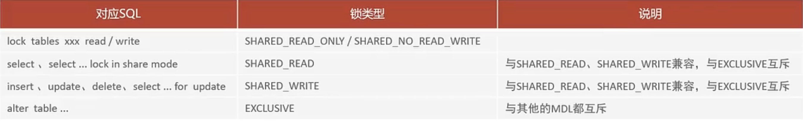


## 意向锁

意向锁是为了避免DML期间行锁与表锁冲突的问题，在Innodb中引入了意向锁，使用意向锁减少了表锁对数据库表中逐行的锁检查消耗。

意向共享锁（IS）：由语句 `select .. lock in share mode` 添加。与表锁共享锁兼容，与表锁排他锁互斥。

意向拍他锁（IX）：由 `insert、update、delete、select .. for update` 添加。与表锁共享锁和排他锁互斥。意向锁之间不会互斥。

通过以下SQL查看意向锁与行锁的加锁情况：

```sql
select object_schema,object_name,index_name,lock_type,lock_mode,lock_data from performance_schema.data_locks;
```


## 行锁

英文 Record Lock，在Innodb引擎中，锁住一行数据，防止其他事物对此行进行 update 和 delete，并发度高。在RR、RC隔离级别下支持。

共享锁（S）：共享锁之间兼容，共享锁和排他锁互斥。

拍他锁（X）：一个事物获取了排他锁，其他事物就不能得到共享锁和排他锁。


## 间隙锁

英文 Gap Lock，锁住索引记录的间隙（不包含该记录），确保索引记录间隙不变，防止其他事物在整个间隙中insert，产生幻读，在RR隔离级别下支持。

间隙锁唯一目的就是防止其他事务在间隙中插入数据，间隙锁可以共存，一个事物采用的间隙锁不会阻止另一个事物在同一间隙上采用间隙锁。


## 临键锁

英文 Next-Key Lock，行锁和间隙锁组合，同时锁住数据，并锁住数据前面的间隙Gap，在RR隔离级别下支持。


------


# 系统数据库

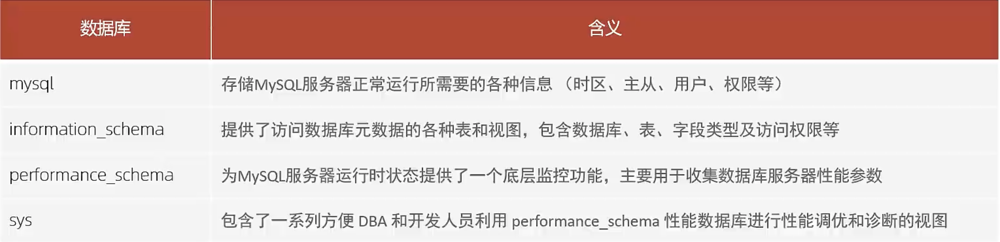


------


# 日志


## 错误日志

用于记录mysql启动、停止、运行过程中发生严重错误的相关信息。如果数据库故障无法使用，可以首先查看次日志。

该日志默认时开启了的，默认存放在 `/var/log` 默认的日志文件名为 mysqld.log，也可以用如下命令查看：

```sql
show variables like '%log_error%';
```


## 二进制日志

BINLOG，用于记录所有DDL、DML语句，但不包含数据查询语句（DML、SHOW）。在遇到灾难时可以用于恢复数据，可以用在mysql的主从复制。

```sql
show variables like '%log_bin%';
```

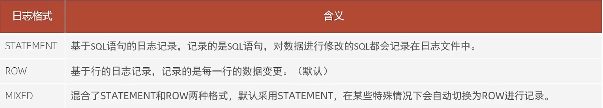

```sql
show variables like '%binlog_format%';
```

可以通过以下三种方式删除无用的binlog日志文件：

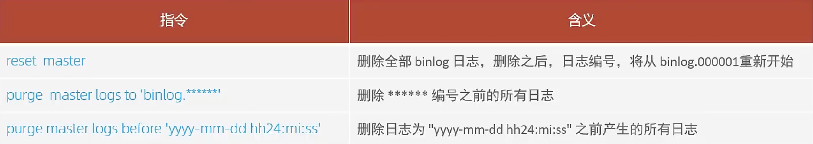

也可以在配置文件中配置binlog日志的过期时间，过期后自动删除。

```sql
show variables like '%binlog_expire_logs_seconds%';
```


## 查询日志

用于记录所有查询语句，默认情况下，查询日志是未开启的。

查看相关参数：

```sql
show variables like '%general%';
```

可以在 `/etc/my.cnf` 配置文件中，添加如下内容：

```ini
# 开启查询日志，
general_log=1

# 设置日志的文件名，如果没有指定，默认的文件名为 host_name.log
general_log_file=mysql_query.log
```


## 慢SQL日志

慢查询日志记录了所有执行时间超过了指定参数的所有SQL语句的日志。

默认情况下慢查询日志是关闭的，需要在 `/etc/my.cnf` 配置文件中配置如下信息：

```ini
# 开启慢SQL日志
slow_query_log=1

# 设置慢SQL执行时间为2秒，超过2秒会作为慢SQL保存到日志中
long_query_time=2

# 记录执行较慢的管理语句，默认是关闭的
log_slow_admin_statements=1

# 记录执行较慢的未使用索引的语句，默认是关闭的
log_queries_not_using_indexs=1
```

配置完后，需要重启mysql，可以在慢SQL日志文件 `/var/lib/mysql/localhost-slow.log` 中查看。


------


# 参数

MERGE_THRESHOLD：合并页的阀值，可以统一设置，也可以在创建索引的时候指定。

sort_buffer_size：order by排序使用的缓冲区大小，默认256K。

secure_file_priv：用于控制LOAD DATA, SELECT …OUTFILE, LOAD_FILE()的使用权限。

secure_file_priv 设置值为 NULL 时，表示限制mysqld不允许导入或导出。

secure_file_priv 设置值为 /dir目录时，表示限制mysqld只能在/dir目录中执行导入导出，其他目录不能执行。

secure_file_priv 没有值时，表示不限制mysqld在任意目录的导入导出，不建议这么设置，不安全。


------


# 主从复制

是指将数据库的DDL、DML语句通过binlog传给从库，然后从库执行这些binlog日志，达到主从数据库保持数据同步的目的。

可以一主多从复制，从库也可以同步数据给其他库。


## 原理


如图所示，主从复制分三步：

- 主库在事务提交时，会把数据变更保存在binlog中；
- 从库的IOThread线程读取主库的binlog日志，写入到从库的relay log中；
- 从库执行relay log中的记录；


## 搭建


### 主库配置

先在防火墙中开放3306端口

```shell
# 开放指定3306端口
firewall-cmd --zone=public --add-port=3306/tcp -permanent
firewall-cmd -reload

# 关闭服务器防火墙
systemctl stop firewalld
systemctl disable firewalld
```

安装MYSQL服务

主库配置，新建 `~/mysql/conf/my.cnf` 

```ini
[mysqld]
# 同一局域网内注意要唯一
server-id=1024

# 开启二进制日志功能，可以随便取（关键）
log-bin=mysql-bin

# 设置值为 NULL 时，表示限制 mysqld 不允许导入或导出
# 设置值为一个具体的目录时，表示限制 mysqld 只能在指定目录中执行导入导出，其他目录不能执行
# 没有值时，表示不限制mysqld在任意目录的导入导出，不建议这么设置，不安全
secure_file_priv=/var/lib/mysql

# 设置密码规则
default_authentication_plugin=mysql_native_password

# 最大连接数设置 根据实际需要 自行调整
max_connections=1000 
```

启动容器

```shell
$ docker run -d \
--name mysql \
-p 3306:3306 \
-v ~/mysql/conf:/etc/mysql/conf.d \
-v ~/mysql/data:/var/lib/mysql \
-e MYSQL_ROOT_PASSWORD=root \
mysql
```

查看容器IP，并记住这个IP，在配置从库时会用到

```shell
$ docker inspect --format={{.NetworkSettings.IPAddress}} mysql
172.17.0.3
```

进入mysql容器

```shell
$ docker exec -it mysql /bin/bash
```

登陆 MYSQL，创建远程连接的账号，并授予主从复制权限

```shell
$ mysql -u root -p

# 创建一个专用于主从同步的用户，用户可以在任意主机连接主库
create user 'repl'@'%'identified with mysql_native_password by 'repl';

# 为用户分配主从复制权限
GRANT REPLICATION SLAVE, REPLICATION CLIENT ON *.* TO 'repl'@'%';

# plugin是caching_sha2_password 会导致连接不上，修改为 mysql_native_password 可解决
# ALTER USER 'repl'@'%' IDENTIFIED WITH mysql_native_password BY 'repl';
```

通过指令，查看二进制日志坐标

```sql
show master status;
+------------------+----------+--------------+------------------+-------------------+
| File             | Position | Binlog_Do_DB | Binlog_Ignore_DB | Executed_Gtid_Set |
+------------------+----------+--------------+------------------+-------------------+
| mysql-bin.000003 |     2119 |              |                  |                   |
+------------------+----------+--------------+------------------+-------------------+
1 row in set (0.00 sec)
```

字段含义说明：

file：从哪个日志文件开始推送日志文件；

position：从哪个位置开始推送日志；

binlog_ignore_db：指定不需要同步的数据库；


### 从库配置

修改配置文件 `~/mysql/conf1/my.cnf`

```ini
[mysqld]
# 设置server_id,注意要唯一
server-id=1022 

# 开启二进制日志功能，以备Slave作为其它Slave的Master时使用
log-bin=mysql-slave-bin   

# relay_log 配置中继日志
relay_log=edu-mysql-relay-bin

# 设置值为 NULL 时，表示限制 mysqld 不允许导入或导出
# 设置值为一个具体的目录时，表示限制 mysqld 只能在指定目录中执行导入导出，其他目录不能执行
# 没有值时，表示不限制mysqld在任意目录的导入导出，不建议这么设置，不安全
secure_file_priv=/var/lib/mysql

# 设置密码规则
default_authentication_plugin=mysql_native_password

# 最大连接数设置 根据实际需要 自行调整
max_connections=1000
```

启动从库的容器

```shell
$ docker run -d \
--name mysql1 \
-p 3307:3307 \
-v ~/mysql/conf1:/etc/mysql/conf.d \
-v ~/mysql/data1:/var/lib/mysql \
-e MYSQL_ROOT_PASSWORD=root \
mysql
```

进入mysql容器

```shell
$ docker exec -it mysql1 /bin/bash

$ mysql -u root -p
```

在 MYSQL 8.0.23 之后使用如下语法在从库中设置主库。

```sql
change replication source to source_host='172.17.0.4', source_user='repl', source_password='repl', source_log_file='mysql-bin.000004', source_log_pos=157;
```

在 MYSQL 8.0.23 之前使用如下语句：

```sql
change master to master_host='172.17.0.3', matster_user='repl', master_password='repl', master_log_file='mysql-bin.000003', master_log_pos=157;
```


master_port：Master的端口号，指的是容器的端口号；

master_user：用于数据同步的用户；

master_password：用于同步的用户的密码；

master_log_file：指定slave从哪个日志文件开始复制数据，即上文中提到的File字段的值；

master_log_pos：从哪个Position开始读，即上文中提到的Position字段的值；

master_connect_retry：如果连接失败，重试的时间间隔，单位是秒，默认是60秒；

开启同步操作

```sql
start slave;   # 8.0.22之前
start replica; # 8.0.22之后
```

查看主从同步状态

```sql
show slave   status\G; # 8.0.22之前
show replica status\G; # 8.0.22之后
```

如下所示，输出结果中 `Slave_IO_Running` 与 `Slave_SQL_Running` 值为 Yes 表示主从复制启动成功！

```shell
$ show slave status\G;
*************************** 1. row ***************************
               Slave_IO_State: Waiting for source to send event
                  Master_Host: 172.17.0.3
                  Master_User: repl
                  Master_Port: 3306
                Connect_Retry: 60
              Master_Log_File: mysql-bin.000003
          Read_Master_Log_Pos: 157
               Relay_Log_File: edu-mysql-relay-bin.000002
                Relay_Log_Pos: 326
        Relay_Master_Log_File: mysql-bin.000003
             Slave_IO_Running: Yes
            Slave_SQL_Running: Yes
              Replicate_Do_DB: 
          Replicate_Ignore_DB: 
           Replicate_Do_Table: 
       Replicate_Ignore_Table: 
      Replicate_Wild_Do_Table: 
  Replicate_Wild_Ignore_Table: 
                   Last_Errno: 0
                   Last_Error: 
                 Skip_Counter: 0
          Exec_Master_Log_Pos: 157
              Relay_Log_Space: 540
              Until_Condition: None
               Until_Log_File: 
                Until_Log_Pos: 0
           Master_SSL_Allowed: No
           Master_SSL_CA_File: 
           Master_SSL_CA_Path: 
              Master_SSL_Cert: 
            Master_SSL_Cipher: 
               Master_SSL_Key: 
        Seconds_Behind_Master: 0
Master_SSL_Verify_Server_Cert: No
                Last_IO_Errno: 0
                Last_IO_Error: 
               Last_SQL_Errno: 0
               Last_SQL_Error: 
  Replicate_Ignore_Server_Ids: 
             Master_Server_Id: 100
                  Master_UUID: e9fc6a01-abaa-11ed-a624-0242ac110003
             Master_Info_File: mysql.slave_master_info
                    SQL_Delay: 0
          SQL_Remaining_Delay: NULL
      Slave_SQL_Running_State: Replica has read all relay log; waiting for more updates
           Master_Retry_Count: 86400
                  Master_Bind: 
      Last_IO_Error_Timestamp: 
     Last_SQL_Error_Timestamp: 
               Master_SSL_Crl: 
           Master_SSL_Crlpath: 
           Retrieved_Gtid_Set: 
            Executed_Gtid_Set: 
                Auto_Position: 0
         Replicate_Rewrite_DB: 
                 Channel_Name: 
           Master_TLS_Version: 
       Master_public_key_path: 
        Get_master_public_key: 0
            Network_Namespace: 
1 row in set, 1 warning (0.00 sec)

ERROR: 
No query specified
```


#### 取消主从复制

以下命令在从库上执行，可以取消主从复制

```sql
# 停止从库上的主从复制
stop slave;

# 删除所有主从复制配置
reset slave all;

# 查看主从复制状态
show replica status\G;
```


