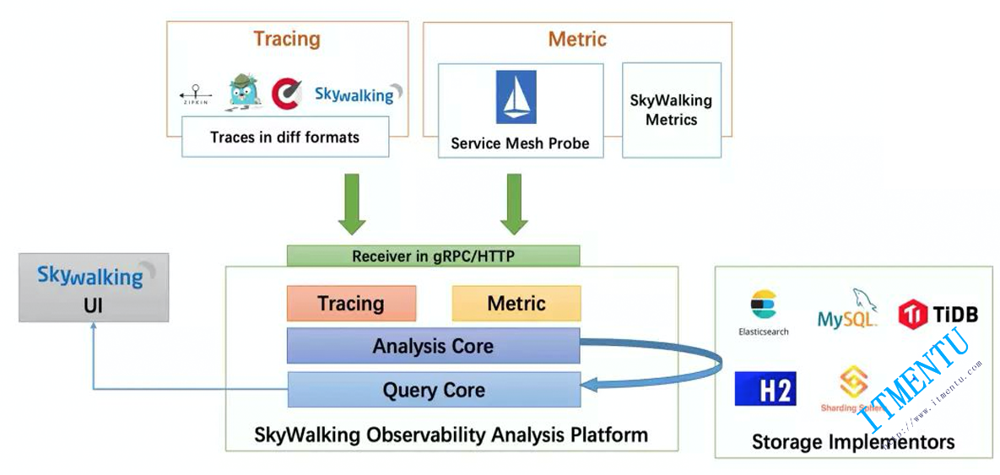

SkyWalking

# 组成

## Agent（探针）

Agent 运行在各个服务实例中，负责采集服务实例的 Trace 、Metrics 等数据，然后通过 gRPC 方式上报给 SkyWalking 后端。

## OAP

SkyWalking 的后端服务，其主要责任有两个。

一个是负责接收 Agent 上报上来的 Trace、Metrics 等数据，交给 Analysis Core （涉及 SkyWalking OAP 中的多个模块）进行流式分析，最终将分析得到的结果写入持久化存储中。SkyWalking 可以使用 ElasticSearch、H2、MySQL 等作为其持久化存储，一般线上使用 ElasticSearch 集群作为其后端存储。
另一个是负责响应 SkyWalking UI 界面发送来的查询请求，将前面持久化的数据查询出来，组成正确的响应结果返回给 UI 界面进行展示。

## UI 界面

SkyWalking 前后端进行分离，该 UI 界面负责将用户的查询操作封装为 GraphQL 请求提交给 OAP 后端触发后续的查询操作，待拿到查询结果之后会在前端负责展示。
