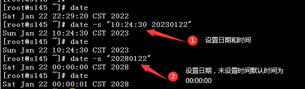
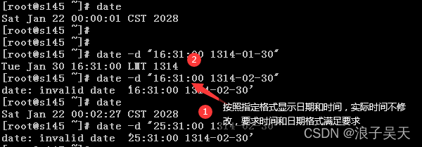

参考： https://blog.csdn.net/carefree2005/article/details/122637730

原文链接：https://blog.csdn.net/cnds123321/article/details/125242668


# 命令


## set

命令主要是显示系统中已经存在的变量和修改选项。

语法：

```shell
set [-abefhkmnptuvxBCHP] [-o option-name] [--] [arg ...]
```

```shell
-a	allexport, 标示已修改的变量，以供输出至环境变量
-b	notify, 使被中止的后台程序立刻回报执行状态
-B	braceexpand	启用brace expansion。默认启用。
-C	noclobber	重定向所产生的文件无法覆盖已存在的文件。‘>’, ‘>&’, ‘<>’
-d	Shell预设会用杂凑表记忆使用过的指令，以加速指令的执行。使用-d参数可取消。
-e	若指令传回值不等于0，则立即退出shell
-f	取消使用通配符
-h	自动记录函数的所在位置
-H	Shell可利用”!”加<指令编号>的方式来执行history中记录的指令
-k	指令所给的参数都会被视为此指令的环境变量
-l	记录for循环的变量名称
-m	monitor, 使用监视模式, 启用Job control
-n	noexec, 只读取指令，而不实际执行, 通常用于检查脚本语法。
-p	privileged, 启动优先顺序模式, 启用 privileged 模式，$BASH_ENV 和 $ENV文件不会被执行，SHELLOPTS, BASHOPTS, CDPATH and GLOBIGNORE 变量被忽略
-P	physical, 启动-P参数后，执行指令时，会以实际的文件或目录来取代符号连接
-t	执行完随后的指令，即退出shell
-u	nounset, 当执行时使用到未定义过的变量，则显示错误信息
-v	verbose, 显示shell所读取的输入值
-x	xtrace, 执行指令后，会先显示该指令及所下的参数
```

- `set -x`：这个命令用于启用 Bash 脚本的调试模式。一旦启用，Bash 将在执行脚本时显示每个命令的执行结果和扩展的值（例如变量替换之后的值）。这对于跟踪脚本中发生的问题和错误非常有用。
- `set -v`：这个命令用于启用脚本中每个命令的详细信息。它会显示脚本中的每个命令，以及命令中的变量替换和扩展。这有助于了解脚本的执行过程。

启用 `set -xv` 后，你会看到在脚本执行时每个命令都会显示在标准输出，并在每行前面显示 `+`。这可以帮助你识别脚本中的问题，特别是在脚本比较复杂时。

set -x 是开启，set +x是关闭，set -o是查看 (xtrace，追踪一段代码的显示情况）


## exec

命令可以将标准输出、错误输出、自定义描述符进行重定向。

```
#！/bin/bash
set -xv
exec 1>mylog 2>&1
```


## ls

按文件大小排序

```shell
$ ls -l |sort -n -k5
```


得到文件大小，单位字节

```shell
zs=`ls -l $1.dat | awk -F" " '{print $5}'`
```


## wc

得到文件的行数

```shell
hs=`wc -l $1.dat | awk -F" " '{print $1}'`
```


## date

语法

```shell
用法：#date [参数选项] [+格式]
或者：date [-u|–utc|–universal] [MMDDhhmm[[CC]YY][.ss]]
```

```
参数	参数说明
-d, --date=STRING	显示 datestr 中所设定的时间 (非系统时间)
-s, --set=STRING	将系统时间设为 datestr 中所设定的时间
-u, --utc, --universal	打印或设置协调世界时（UTC）
–version	显示版本编号
–help	显示辅助讯息

符号	符号说明
%	印出 %
%n	下一行
%t	跳格
%H	小时(00…23)
%I	小时(01…12)
%k	小时(0…23)
%l	小时(1…12)
%M	分钟(00…59)
%p	显示本地 AM 或 PM
%r	直接显示时间 (12 小时制，格式为 hh:mm:ss [AP]M)
%R	24小时制方式显示时间，相当于%H:%M
%s	从 1970 年 1 月 1 日 00:00:00 UTC 到目前为止的秒数
%S	秒(00…60)
%T	直接显示时间 (24 小时制)
%X	相当于 %H:%M:%S
%z	数字方式显示时区
%Z	字母缩写方式显示时区


符号	符号说明
%a	星期几 ，缩写(Sun…Sat)
%A	星期几 ，完整英文星期(Sunday…Saturday)
%b	月份 (Jan…Dec)
%B	月份 (January…December)
%c	直接显示日期与时间
%d	日 (01…31)
%D	直接显示日期 (mm/dd/yy)
%e	一个月中的第几天，类似%_d
%F	完整的日期，相当于%Y-%m-%d
%h	同 %b
%j	一年中的第几天 (001…366)
%m	月份 (01…12)
%u	一周中的第几天 (1…7) (1是星期一)
%U	一年中的第几周 (00…53) (以 Sunday 为一周的第一天的情形)
%w	一周中的第几天 (0…6)(0是星期天)
%W	一年中的第几周 (00…53) (以 Monday 为一周的第一天的情形)
%x	直接显示日期 (mm/dd/yy)
%y	年份的最后两位数字 (00.99)
%Y	完整年份 (0000…9999)
```


打印当前日期

```shell
date +"%Y-%m-%d %H:%M:%S"
```

查看系统日期及时间

```shell
[root@s145 ~]# date
Sat Jan 22 15:08:12 CST 2022
```

以YYYY-MM-DD显示日期

```shell
[root@s145 ~]# date +%F
2022-01-22
```

以MM/DD/YY显示日期

```shell
[root@s145 ~]# date +%D
01/22/22
```

以MM/DD/YYYY显示日期

```shell
[root@s145 ~]# date +%x
01/22/2022
```

获取系统年份、月份、日子

```shell
[root@s145 ~]# date +%Y
2022
[root@s145 ~]# date +%m
01
[root@s145 ~]# date +%d
22
```

获取系统星期值

```shell
[root@s145 ~]# date +%a
Sat
[root@s145 ~]# date +%A
Saturday
[root@s145 ~]# date +%u
6
[root@s145 ~]# date +%w
6
```

获取系统时区

```shell
[root@s145 ~]# date +%z
+0800
[root@s145 ~]# date +%Z
CST
```

查询当前日期是一年中的第几周

```shell
[root@s145 ~]# date +%W
03
[root@s145 ~]# date +%U
03
```

获取系统时间

```shell
[root@s145 ~]# date +%T
15:51:42
[root@s145 ~]# date +%X
03:53:30 PM
```

显示十二小时制时间

```shell
[root@s145 ~]# date +%r
03:51:58 PM
```

显示24小时制时间

```shell
[root@s145 ~]# date +%R
15:52
```

按照指定样式显示时间

```shell
[root@s145 ~]# date +%H-%M.%S
15-55.07
[root@s145 ~]# date +%H.%M.%S
15.55.10
```

从 1970 年 1 月 1 日 00:00:00 UTC 到目前为止的秒数

```shell
[root@s145 ~]# date +%s
1642838148
```

设置系统时间


设置时间及日期



按照指定格式显示时间和日期



日期和时间分行显示

```shell
[root@s145 ~]# date +%F%n%T
2022-01-22
16:36:51
```

按照字符串的设置显示日期


## mkdir

用于在 Linux 和 Unix 操作系统中创建新的目录（文件夹）

- `p` 或 `--parents`：递归创建目录，如果指定的目录路径中的父目录不存在，也会一并创建。这对于创建多层嵌套的目录结构非常有用。

  ```
  bashCopy code
  mkdir -p /path/to/nested/directories
  ```

- `-m` 或 `--mode`：指定新创建目录的权限模式。可以使用八进制数字来表示权限。

  ```
  bashCopy code
  mkdir -m 755 mydirectory
  ```

- `--help`：显示帮助信息，列出 `mkdir` 命令的选项和用法。

  ```
  bashCopy code
  mkdir --help
  ```

- `--version`：显示 `mkdir` 命令的版本信息。

  ```
  bashCopy code
  mkdir --version
  ```

- `Z`：在 SELinux 启用的系统上，该选项将为新目录设置安全上下文。

  ```
  bashCopy code
  mkdir -Z mydir
  ```

- `-context`：在 SELinux 启用的系统上，该选项允许你明确指定目录的安全上下文。

  ```
  bashCopy code
  mkdir --context=my_context mydir
  ```

- `-e`：指定错误时的行为。默认情况下，`mkdir` 会忽略已存在的目录，但使用 `-e` 选项可以使 `mkdir` 显示错误消息。

  ```
  bashCopy code
  mkdir -e existing_directory
  ```

请注意，具体可用的选项可能会根据操作系统和 `mkdir` 版本而有所不同。你可以使用 `man mkdir` 命令来查看本地系统上 `mkdir` 命令的手册页，以获取更多选项和用法信息。


## curl

是一个用于在命令行下发送 HTTP 请求的工具，它支持多种协议，包括 HTTP、HTTPS、FTP 等。

```shell
$ curl -F "https://gitee.com/jeremy8551/UniversalScriptEngine.git"
```

1. **基本选项：**
   - `-X`：指定请求方法（GET、POST、PUT 等）。
   - `-H`：设置请求头。
   - `-d`：发送 POST 请求的数据。
   - `-F`：发送文件上传的数据。
   - `-A`：设置 User-Agent。
   - `-e`：设置 Referer。
   - `--url`：指定请求的 URL。
2. **输出选项：**
   - `-i`：包含响应头。
   - `-I`：只获取响应头，不下载内容。
   - `-o`：将输出保存到文件。
3. **连接选项：**
   - `--connect-timeout`：设置连接超时时间。
   - `--max-time`：设置请求最大执行时间。
4. **认证选项：**
   - `-u`：设置用户名和密码。
5. **代理选项：**
   - `--proxy`：设置代理。
   - `--proxy-user`：设置代理用户名和密码。
6. **SSL/TLS 选项：**
   - `--insecure`：忽略 SSL 证书验证。
   - `--cert`：指定客户端证书。
   - `--key`：指定客户端证书的私钥。
   - `--cacert`：指定 CA 证书。
7. **其他选项：**
   - `-s`：静默模式，不显示进度信息。
   - `-v`：详细模式，显示详细的请求和响应信息。
   - `--help`：显示帮助信息。

这只是一些常用的选项，实际上 `curl` 支持非常多的选项，可以根据具体的需求选择合适的选项来发送定制化的 HTTP 请求。要获取更详细的信息，你可以在命令行输入 `curl --help` 或者查阅 `curl` 的官方文档。


## awk

```shell
$ awk -F" " '{print $1}'
```


查看linux文件的大小

```shell
$ zs=`ls -l $1.dat | awk -F" " '{print $5}'`
```


## chown

用于更改文件所有者和所属组的命令。、

```shell
$ chown [options] [owner][:group] file(s)
```

- `-c`选项：仅在更改时显示操作信息。
- `-R`选项：递归地更改指定目录下的所有子目录和文件的所有者和所属组。
- `-v`选项：显示操作信息，包括更改的详细说明。

- `owner`: 新的所有者的用户名。
- `group`: 新的所属组的组名。如果未提供，则默认为与当前所有者相同的组。
- `file(s)`: 要更改所有者和所属组的文件或目录路径。可以指定一个或多个文件/目录。


```shell
$ chown -R cdapinst2:cdapinst1 /db2data/nas/cdap
```


## chmod

`chmod` 是一个在 Unix 和类 Unix 系统上使用的命令，用于修改文件或目录的权限。

用于控制文件或目录的读、写和执行权限，以及设置特定的权限属性。

命令的基本语法如下：

```shell
$ chmod [options] mode file(s)
```

其中，`options` 是一些额外的选项，`mode` 是要设置的权限模式，而 `file(s)` 则是要修改权限的文件或目录的名称。

以下是一些常见的 `chmod` 命令选项：

1. `-c, --changes`：仅在文件权限实际发生变化时才显示更改。
2. `-f, --silent, --quiet`：在发生错误时不显示错误消息。
3. `-v, --verbose`：显示详细的操作信息，包括所有文件的权限修改。
4. `-R, --recursive`：递归地修改目录及其子目录中的文件权限。
5. `--preserve-root`：仅在递归修改时保护根目录的权限。
6. `--reference=file`：使用指定文件的权限作为模板，并将其应用于目标文件或目录。
7. `-u, --users`：添加权限给文件的所有者。
8. `-g, --groups`：添加权限给文件的所属组。
9. `-o, --others`：添加权限给其他用户。
10. `-a, --access-time`：只更改访问时间。
11. `-m, --modify-time`：只更改修改时间。
12. `--version`：显示 `chmod` 命令的版本信息。


权限模式 `mode` 可以使用不同的表示方式来指定权限。以下是一些常见的权限表示方式：

1. **符号模式（Symbolic Mode）**：使用符号来表示权限的添加和移除。常用的符号包括 `+`（添加权限）、`-`（移除权限）和 `=`（设置权限）。例如：
   - `chmod +r file`：添加读权限。
   - `chmod -w file`：移除写权限。
   - `chmod =x file`：设置只有执行权限。
2. **绝对模式（Absolute Mode）**：使用数字来表示权限。每个权限位都有一个对应的数字值：读（4）、写（2）、执行（1）。组合不同的权限可以得到不同的数字，然后将它们相加来设置权限。例如：
   - `chmod 644 file`：设置文件为所有者可读写，其他用户只可读取。
   - `chmod 755 directory`：设置目录为所有者可读写执行，其他用户只可读取和执行。

除了基本的权限修改，`chmod` 还支持一些其他选项和功能，例如递归修改目录下所有文件的权限、修改文件的所有者和所属组等。

请注意，`chmod` 命令需要在具有足够权限的用户下执行，否则可能会出现权限不足的错误。错误使用 `chmod` 命令可能会导致文件系统的安全性问题，因此在使用时要谨慎操作。

要获取更详细的信息和示例，您可以在终端中输入 `man chmod` 查看命令的手册页面。


## find

是在 Unix 和类 Unix 操作系统上用于在文件系统中搜索文件和目录的工具。

可以按照指定的条件在文件系统中查找文件，并执行指定的操作。

```shell
$ find [路径] [选项] [表达式]
```

以下是 "find" 命令的基本用法和一些常见选项：

- **-name 模式：** 按照文件名匹配模式搜索文件。
- **-type 类型：** 按照文件类型搜索，如 f（普通文件）、d（目录）等。
- **-user 用户：** 按照文件所有者搜索。
- **-group 组：** 按照文件所属组搜索。
- **-size [+|-]大小：** 按照文件大小搜索。大小可以以字节（默认）、K（KB）、M（MB）、G（GB）等为单位。
- **-mtime [+|-]天数：** 按照文件修改时间搜索。+ 表示大于，- 表示小于。
- **-exec 命令 {} ;：** 对搜索到的每个文件执行指定的命令。
- **-print：** 打印搜索到的文件路径。
- **-delete：** 删除搜索到的文件。
- **-maxdepth 层数：** 限制搜索的最大深度。
- **-mindepth 层数：** 限制搜索的最小深度。

```shell
# 在当前目录及其子目录中搜索所有扩展名为 ".txt" 的文件
find . -name "*.txt"

# 在 /home 目录中搜索所有类型为普通文件（非目录）且大小大于 1MB 的文件
find /home -type f -size +1M

# 在 /var/log 目录中搜索修改时间在最近 7 天内的文件，并打印文件路径
find /var/log -mtime -7 -print

# 在 /tmp 目录中搜索所有以 "temp" 开头的文件，并删除它们
find /tmp -name "temp*" -delete
```

要查看完整的选项列表和详细信息，您可以在终端上键入 "man find" 或 "find --help"。

请注意，"find" 命令非常强大，但在使用时请小心，以免意外删除或修改文件。


## df

显示有关文件系统上可用磁盘空间的信息。

```shell
$ df [选项] [文件系统]
```

以下是一些常用的参数和选项：

1. **a, --all：** 显示所有文件系统，包括没有可用块的文件系统。
2. **-B, --block-size=SIZE：** 指定要使用的块大小，以字节为单位。默认情况下，df使用1K块。
3. **-h, --human-readable：** 以易读的方式显示磁盘使用信息，使用K、M、G等单位而不是字节。
4. **-H, --si：** 类似于-h选项，但是使用国际单位制的前缀（例如KB、MB、GB）而不是二进制前缀（例如KiB、MiB、GiB）。
5. **-i, --inodes：** 显示文件系统的索引节点使用情况，而不是磁盘空间使用情况。
6. **-k：** 以KB为单位显示磁盘使用信息。这是一个与POSIX标准不兼容的选项。
7. **-l, --local：** 仅显示本地文件系统，不包括NFS、AFS等远程文件系统。
8. **-P, --portability：** 生成固定宽度的输出，以便于处理或分析。
9. **-t, --type=TYPE：** 仅显示指定类型的文件系统。您可以提供多个文件系统类型，用逗号分隔。
10. **-T, --print-type：** 显示文件系统的类型，例如ext4、NTFS等。
11. **--sync：** 在显示信息之前，同步文件系统。
12. **--help：** 显示帮助信息。
13. **--version：** 显示版本信息。

```shell
# 显示所有已挂载文件系统的磁盘使用情况（以易读的方式）
df -h

# 仅显示 ext4 类型的文件系统磁盘使用情况
df -t ext4

# 以 KB 为单位显示所有文件系统的磁盘使用情况
df -k

# 显示文件系统的索引节点使用情况
df -i
```


## sed

```shell
$ sed -i "s/BABEL_DEFAULT_LOCALE = \"en/BABEL_DEFAULT_LOCALE = \"zh/g" ./app/superset/config.py
```


## cat

```shell
$ cat ./app/superset/config.py | grep zh
```


## nslookup

Name Server Lookup，是一个用于查询域名系统（DNS）信息的命令行工具。通常用于获取特定主机名或域名的IP地址、域名的邮件交换记录（MX记录）、域名服务器的信息等。以下是一些常用的 `nslookup` 命令及其用法：


1. **查询特定主机名的IP地址**：

   ```
   Copy code
   nslookup example.com
   ```

2. **查询特定IP地址的主机名**：

   ```
   Copy code
   nslookup 8.8.8.8
   ```

3. **查询域名的邮件交换记录（MX记录）**：

   ```
   bashCopy code
   nslookup -type=MX example.com
   ```

4. **查询域名的所有DNS记录**：

   ```
   bashCopy code
   nslookup -type=ANY example.com
   ```

5. **指定特定DNS服务器进行查询**：

   ```
   Copy code
   nslookup example.com dns.example-server.com
   ```

6. **进入交互模式**（可以在该模式下连续查询多个主机名或域名）：

   ```
   shellCopy code
   nslookup
   > set type=MX
   > example.com
   > set type=A
   > example2.com
   > exit
   ```

请注意，随着时间的推移，DNS查询工具和命令可能会有变化。

在某些系统中，可能会推荐使用其他工具（例如 `dig`）来执行更高级的DNS查询。要获取当前系统上的具体信息，可以在命令行中键入 `nslookup` 并查阅相关帮助信息。


## ifconfig

查看系统IP等网络信息


## declare

```shell
$ declare [options] variable=value
```

- `-r`选项：将变量声明为只读，即不能被修改。
- `-i`选项：将变量声明为整数，这样在赋值时会自动进行整数转换。
- `-a`选项：将变量声明为数组。
- `-f`选项：将变量声明为函数。
- `-x`选项：将变量导出为环境变量，使其在子进程中也可用。

例如，下面的命令将声明一个只读整数变量：

```shell
$ declare -r -i my_variable=42
```


# 复合命令


## 逻辑AND命令

```shell
command1 && command2
```


## 逻辑OR命令

```shell
command1 || command2
```


## 组条命令

```shell
{ command1; command2; }
```


## 删除三天以上修改的文件

```shell
$ find /nas/test -type f -mtime +3|xargs rm -rf
```


# 语法


## 变量


### 系统变量

```shell
$n  $1 表示第一个参数，$2 表示第二个参数 ...  
$#  命令行参数的个数  
$0  当前程序的名称  
$?  前一个命令或函数的返回码
$*  以"参数1 参数2 ... " 形式保存所有参数  
$@  以"参数1" "参数2" ... 形式保存所有参数  
$$  本程序的(进程ID号)PID  
$!  上一个命令的PID  
```

例如：

```
#!/bin/sh
if [ $# -ne 2 ] ; then
echo "Usage: $0 string file";
exit 1;
fi
grep $1 $2 ;
if [ $? -ne 0 ] ; then
echo "Not Found \"$1\" in $2";
exit 1;
fi
echo "Found \"$1\" in $2";上面的例子中使用了$0 $1 $2 $# $? 等变量，下面是程序的解释： 
```

下面是程序的解释： 
	1.判断运行参数个数，如果不等于2，显示使用"用法帮助", 其中 $0 表示就是脚本自己。 
	2.用grep 在$2 文件中查找$1 字符串。 
	3.判断前一个命令运行后的返回值(一般成功都会返回0, 失败都会返回非0)。 
	4.如果没有成功显示没找到相关信息，否则显示找到了。 
	5.其中\"表示转义，在"" 里面还需要显示"号，则需要加上转义符\"


### 用户变量

用户定义的变量必须由字母数字及下划线组成，并且变量名的第一个字符不能为数字，与其它UNIX名字一样,变量名是大小写敏感的。

注意：变量和'='之间不要有空格，'='和赋值也不要有空格，否则shell不会认为变量被定义

```shell
name="Winter"
WINTER=$name
echo "Hello $WINTER !"
```

readonly 表示一个变量只能读不能改。

如：

```shell
readonly a=2 
```


### 环境变量

shell环境变量是所有shell 程序都会接受的参数。

shell程序运行时，都会接收一组变量，这组变量就是环境变量。

常用的环境变量： 

```shell
PATH           命令搜索路径,以冒号为分隔符.注意与DOS下不同的是, 当前目录不在系统路径里  
HOME           用户home目录的路径名,是cd命令的默认参数  
COLUMNS        定义了命令编辑模式下可使用命令行的长度  
EDITOR         默认的行编辑器  
VISUAL         默认的可视编辑器  
FCEDIT         命令fc使用的编辑器  
HISTFILE       命令历史文件  
HISTSIZE       命令历史文件中最多可包含的命令条数  
HISTFILESIZE   命令历史文件中包含的最大行数  
IFS            定义SHELL使用的分隔符  
LOGNAME        用户登录名  
MAIL           指向一个需要SHELL监视其修改时间的文件.当该文件修改后, SHELL将发消息You hava mail给用户  
MAILCHECK      SHELL检查MAIL文件的周期,单位是秒  
MAILPATH       功能与MAIL类似.但可以用一组文件,以冒号分隔,每个文件后可跟一个问号和一条发向用户的消息  
SHELL          SHELL的路径名  
TERM           终端类型  
TMOUT          SHELL自动退出的时间,单位为秒,若设为0则禁止SHELL自动退出  
PROMPT_COMMAND 指定在主命令提示符前应执行的命令  
PS1            主命令提示符  
PS2            二级命令提示符,命令执行过程中要求输入数据时用  
PS3            select的命令提示符  
PS4            调试命令提示符  
MANPATH        寻找手册页的路径,以冒号分隔  
LD_LIBRARY_PATH  寻找库的路径,以冒号分隔  
```

如果希望把定义的变量让其他所有的shell程序都能使用，也就是定义新的环境变量。只要使用export关键词就可以了。

例如：

```shell
export MY_NAME=Winter
export PATH=/home/winter/bin:$PATH
```

Shell设置添加去除显示当前值注解
shNAME=value1
export NAMENAME=value2:$NAMEunset NAMEset(internal)或者env(exported)


 

## 数组

shell变量中还能设置数组，但是不同的shell版本有不同数组赋值方法，而bourne shell 中不支持数组方式。

因此，如果不是十分需要，还是建议你不要使用数组。shell有两种赋值方式，

第一种是直接用下标赋值：  

```shell
name[0]="Tom"
name[1]="Tomy"
name[2]="John"
```

另一种方式对于不同的shell版本不一样。bash中赋值：

```shell
#!/usr/local/bin/bash
name=("Tom" "Tomy" "John")
for i in 0 1 2
do
	echo $i:${name[$i]} ;
done;
```


## 命令代换


有二种形式：使用反引号``或$()

```shell
$ DATE=`date`
```

```shell
$ DATE=$(date)
```


## 算术代换

格式：$(())，用于算术计算，$(())中的Shell变量取值将转换成整数，$(())中只能用+-*/和()运算符，并且只能做整数运算。

例如：

```shell
$ VAR=45
$ echo $(($VAR+3))
```


## 类型声明

shell编程是以"#"为注释，但对"#!/bin/sh"却不是。
`#!/bin/sh` 是对shell的声明，说明你所用的是那种类型的shell及其路径所在。


### 默认SHELL

如果没有声明，则脚本将在默认的shell中执行，默认shell是由 /etc/passwd 中的配置信息决定的。

查看默认shell的命令： 

more /etc/passwd

查看用户所在行就明白了


### shell怎么切换？ 

假设现在想用ksh了，仅仅执行一下: /usr/bin/ksh 或者 /bin/ksh ，你的命令解释器就变成ksh了。

那么在shell编程的时候怎么指定呢？你只需要在第一行加入#!/usr/bin/ksh 或者 #!/bin/ksh 就可以了,其它的雷同. 

这里顺便说一下 /usr/bin 和 /bin的区别，/bin 会放置一些普通用户不让使用的命令，

所以它的目录权限可能会更严一些， 如果没有权限使用这目录就可以用 /usr/bin 了。 


## 定义函数

函数由两部分组成：函数名和函数体。

```SHELL
function_name() {
	函数体
}
```

函数可以放在同一个文件中作为一段代码，也可以放在只包含函数的单独文件中。

所有函数在使用前必须定义。

如需提前从函数中返回，可以使用return。可以带返回值，0为无错误，1为有错误。如果没有返回值，则返回最后状态命令。

如果想在脚本中检测函数返回状态，可以检测$?。

如果函数将从测试结果中反馈输出，那么可以使用替换命令可保存结果。如：

variable_nam=function_name

如果想在SHELL中使用函数，则创建函数文件。文件头包括#!/bin/sh。文件名可以任意选取。

一旦文件载入SHELL，就可以在命令行或脚本中调用函数。可以用set命令查看所有定义的函数。

如需卸载函数，则使用unset命令。

定位文件格式为:

```
./pathname/filename
```

在命令行下使用

. filename

载入函数文件。


### 函数中的局部变量

可以使用local关键字在shell函数中声明局部变量，局部变量将局限在函数的作用范围内。此外，函数可以访问全局作用范围内的其他shell变量。

如果一个局部变量和一个全局变量的名字相同，前者就会覆盖后者，但仅限于函数的作用范围之内。例如

```shell
#!/bin/sh
text_var = "test 1"
function_name() {
  local text_var = "test 2"
  echo $text_var
}
```


### 调用函数、输入参数

调用一个函数的格式：函数名[空格]参数

在函数中可以用特殊变量$1,$2 取得传入函数的参数

传回SHELL脚本,$1,$2恢复到调用函数之前的状态

$1：表示第一个参数

```shell
#!/bin/sh

# 这个函数用来取某个月份的上一个月的最后一天的日期
lastdate() {
    DateString=$1
    Year=`echo $DateString | cut -b 1-4`
    Month=`echo $DateString | cut -b 5-6`

    if [ $Month -eq 1 ]; then
        Month=12
        Year=`expr $Year - 1`
    else
        Month=`expr $Month - 1`
    fi

    Cal=`cal $Month $Year`
    Yesterday=`echo $Cal | awk '{print $NF}'` # $NF 是域记录个数，加了$符号表示最后一个域
    echo "$Year/$Month/$Yesterday"
}

lastdate 200303
lastdate `date +%Y%m`
```


### 函数返回值

用全局变量得到函数中要返回的值

在函数中可以用return设置返回状态，return后跟数值n(0-255)，n不设置则默认为0

$?是shell变量,表示**最后一次执行命令**的退出状态 0为成功，非0为失败

```shell
havefun () {
  echo 'fun!'
  return 123
}
havefun
RET=$?
```


用 echo 输出

在函数的最后，用echo命令把变量输出到stdio中，调用函数时格式：ret(变量名)=`function_name(函数名)`

注意：function_name 一定要用反引号引起来，表示命令的执行

例如：

```shell
#!/bin/sh
getAnswer() {
  echo 'answer'
}

ret=`getAnswer`
```


## 中括号

1. **双中括号 `[[]]`**:

   双中括号是 Bash 特有的条件测试语法。提供了更丰富的条件测试功能，包括支持字符串比较、模式匹配、逻辑运算等。

   双中括号通常用于更复杂的条件测试。

   示例：

   ```
   bashCopy code
   if [[ $var == "value" ]]; then
       # 这里执行条件为真的操作
   fi
   ```

   双中括号支持更丰富的操作符和比较，如 `==`（字符串相等）、`!=`（字符串不相等）、`-eq`（数值相等）等。

2. **单中括号 `[]`**:

   单中括号是传统的条件测试语法，也被称为方括号。它们提供了一些基本的条件测试功能，通常用于简单的条件测试。单中括号用于比较字符串或检查变量是否为空。

   示例：

   ```
   bashCopy code
   if [ "$var" = "value" ]; then
       # 这里执行条件为真的操作
   fi
   ```

   单中括号支持基本的操作符，如 `=`（字符串相等）和 `-n`（检查字符串是否非空）。

总的来说，如果你需要进行复杂的条件测试，如字符串模式匹配、逻辑运算等，通常更倾向于使用双中括号 `[[...]]`。而对于简单的条件测试，单中括号 `[...]` 足够用了。注意，在条件测试中，要特别小心处理空变量，以避免潜在的问题。


## 小括号

将当前日期和时间保存到一个变量中，可以使用以下方式：

```shell
formatted_date=$(date +"%Y-%m-%d %H:%M:%S")
echo $formatted_date
```

上述命令将格式化的日期和时间保存到 `formatted_date` 变量中，并将其显示在终端上。这对于在脚本中记录日期时间或生成时间戳等操作非常有用。
