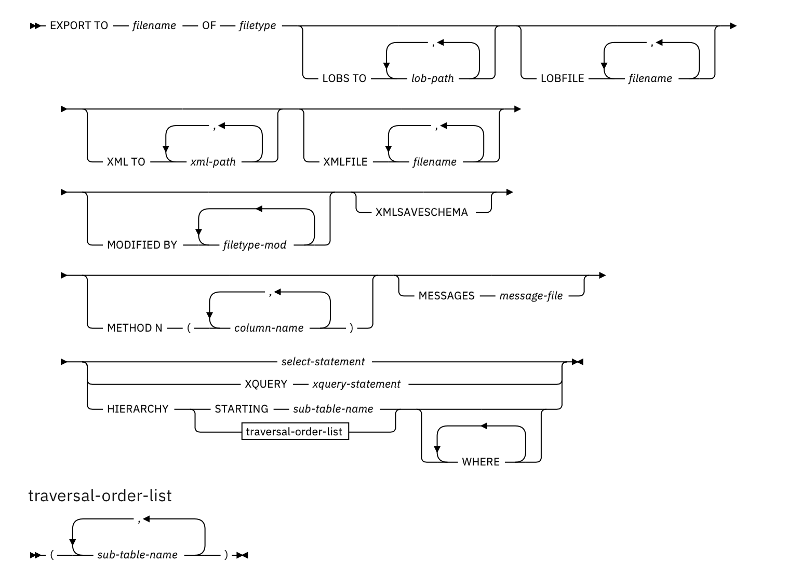

参考链接：https://blog.csdn.net/RodJohnsonDoctor/article/details/4323514

参考链接：https://blog.csdn.net/zhj4615/article/details/81133996


# 系统表

```
syscat.tables -- 表信息
sysibm.systables ---表信息
syscat.datapartitions --分区表信息
syscat.datapartitionexpression --分区表分区字段字段信息
```


# 常用命令


```shell
db2 CONNECT TO DBNAME USER name USING password
```


```shell
db2 "DECLARE C1 CURSOR FOR SELECT * FROM FECHNER.SRCTAB"
db2 "LOAD FROM C1 OF CURSOR MESSAGES C:\load_sales.msg INSERT INTO FECHNER.SALES
NONRECOVERABLE"
```


## 执行脚本

```shell
db2 –tvf script.sql
```


## 表空间相关

```shell
db2 list tablespaces
```


## 快速清空表

```shell
db2 "alter table name activate not logged initially with empty table"
```


```shell
db2 load from /dev/null of del replace into tablename;
```


```shell
db2 import from /dev/null of del replace into tablename;
```


## JDBC执行命令

```java
call SYSPROC.ADMIN_CMD('RUNSTATS ON TABLE BHCSP.BHC_CL2_ALL_I ON COLUMNS (creditAccntId,billingId,termNo,targetRepaymentDate,finishDate) WITH DISTRIBUTION ON KEY COLUMNS');
```


## 数据库配置

```shell
db2 get db cfg for sample
db2 update db cfg using dlchktime 10000
```


## 解决死锁

```sql
-- 查询死锁进程ID与相关信息
select agent_id, a.* from sysibmadm.locks_held a with ur;

-- 也可以查询锁快照
db2 get snapshot for locks on sample;

--杀掉死锁进程
db2 "force application(agent_id)"
```


### 打开快照

```SHELL
db2 get monitor switches
db2 update monitor switches using lock on statement on
create event monitor mymonitor for deadlocks,statements write to file '/home/user/temp' 
set event monitor mymonitor state 1
db2evmon - path '/home/user/dir'
```


### 查询某个应用的锁快照

```sql
db2 get snapshot for locks on for application agentid appl-handler;
```


### 查看动态sql语句快照信息

```SHELL
db2 get snapshot for dynamic sql on dbname
```


## 索引优化

```shell
db2 "RUNSTATS ON TABLE BHCSP.BHC_CL2_ALL_I ON COLUMNS (creditAccntId,billingId,termNo,targetRepaymentDate,finishDate) WITH DISTRIBUTION ON KEY COLUMNS"
db2 "reorg indexes all for table BHCSP.BHC_CL2_ALL_I ALLOW READ ACCESS"
db2 "RUNSTATS ON TABLE BHCSP.BHC_CL2_ALL_I ON COLUMNS (creditAccntId,billingId,termNo,targetRepaymentDate,finishDate) WITH DISTRIBUTION ON KEY COLUMNS"
```


## 不记日志

```shell
# 关闭自动提交
db2 "update command options using c off"

# 关闭某个表上的日志
db2 "alter table CDAP.table activate not logged initially"

# 执行sql语句
db2 "delete from tablename"

# 提交事物，提交后表上的日志功能自动打开
db2 commit

# 打开自动提交
db2 "update command options using c on"
```


## Runstats命令

用于统计数据库表的统计信息，以帮助查询优化器生成更好的执行计划。

在表上的所有列上执行统计操作

```sql
runstats on table [模式名].[表名] with distribution and detailed indexes all
```


## export命令

官方链接：https://www.ibm.com/docs/zh/db2/11.5?topic=commands-export



**命令参数**

- **TO** filename

  指定要将数据导出到的文件的名称。 如果未指定文件的完整路径，那么导出实用程序将使用当前目录和缺省驱动器作为目标。 如果指定了现有文件的名称，那么导出实用程序将覆盖该文件的内容; 它不会附加该信息。

- **OF** filetype

  指定输出文件中数据的格式:DEL (定界 ASCII 格式) ，由各种 数据库管理器 和文件管理器程序使用。IXF (集成交换格式， PC 版本) 是专有二进制格式。

- **LOBS TO** lob-path

  指定要在其中存储 LOB 文件的目录的一条或多条路径。 每个 LOB 路径必须至少有一个文件，并且每个文件必须至少包含一个 LOB。 可以指定的最大路径数为 999。 此设置隐式激活 `LOBSINFILE` 行为。

- **LOBFILE** filename

  为 LOB 文件指定一个或多个基本文件名。 当为第一个名称耗尽名称空间时，将使用第二个名称，依此类推。 此设置隐式激活 `LOBSINFILE` 行为。在导出操作期间创建 LOB 文件时，将通过将当前基本名称从此列表追加到当前路径 (从 lob-path) 来构造文件名。 然后，必须附加要启动的三位数序号以及三个字符标识 `lob`。 例如，如果当前 LOB 路径是目录 /u/foo/lob/path/，而当前 LOB 文件名是 `bar`，那么创建的 LOB 文件是 /u/foo/lob/path/bar.001.lob， /u/foo/lob/path/bar.002.lob等。 使用 999 时， LOB 文件名中的三位数序号增大到四位数，使用 9999 时，四位数增大到五位数，依此类推。

- **XML TO** xml-path

  指定要在其中存储 XML 文件的目录的一个或多个路径。 每个 XML 路径至少有一个文件，每个文件至少包含一个 XQuery 数据模型 (XDM) 实例。 如果指定了多条路径，那么 XDM 实例将在路径之间均匀分布。

- **XMLFILE** filename

  为 XML 文件指定一个或多个基本文件名。 当为第一个名称耗尽名称空间时，将使用第二个名称，依此类推。在导出操作期间创建 XML 文件时，通过将当前基本名称从此列表追加到当前路径 (从 xml-path) 来构造文件名。 然后，必须附加一个三位数的序号以及三个字符的标识 `xml`。 例如，如果当前 XML 路径是目录 /u/foo/xml/path/，而当前 XML 文件名是 `bar`，那么创建的 XML 文件是 /u/foo/xml/path/bar.001.xml， /u/foo/xml/path/bar.002.xml等。

- **MODIFIED BY** filetype-mod

  指定文件类型修饰符选项。 请参阅 [导出实用程序的文件类型修饰符](https://www.ibm.com/docs/zh/db2/11.5?topic=commands-export#r0008303__d19e717)。

- **XMLSAVESCHEMA**

  指定必须为所有 XML 列保存 XML 模式信息。 对于插入时针对 XML 模式验证的每个导出的 XML 文档，该模式的标准 SQL 标识存储为 SCH 属性。 此属性存储在相应的 XML 数据说明符 (XDS) 中。 如果未针对 XML 模式验证导出的文档，或者模式对象不再存在于数据库中，那么在相应的 XDS 中不包含 SCH 属性。SQL 标识的模式和名称部分存储为 SYSCAT.XSROBJECTS 目录表对应于 XML 模式。**XMLSAVESCHEMA** 选项与未生成格式正确的 XML 文档的 XQuery 序列不兼容。

- **METHOD N** column-name

  指定要在输出文件中使用的一个或多个列名。 如果未指定此参数，那么将使用表中的列名。 此参数仅对 IXF 文件有效，但在导出分层数据时无效。

- **MESSAGES** message-file

  指定导出操作期间发生的警告和错误消息的目标。 如果该文件存在，那么导出实用程序将追加该信息。 如果省略 message-file ，那么会将消息写入标准输出。

- select-statement

  指定返回要导出的数据的 SELECT 或 XQUERY 语句。 如果该语句导致错误，那么会将消息写入消息文件 (或标准输出)。 如果错误代码为 SQL0012W， SQL0347W， SQL0360W， SQL0437W或 SQL1824W之一，那么导出操作将继续执行; 否则将停止。如果 SELECT 语句的格式为 SELECT * FROM tablename ，并且表包含隐式隐藏列，那么必须显式指定是否在导出操作中包含隐藏列的数据。 使用下列其中一种方法来指示是否包含隐藏列的数据：使用其中一个隐藏列文件类型修饰符: 当导出包含隐藏列的数据时指定 **implicitlyhiddeninclude** ，否则指定 **implicitlyhiddenmissing** 。`db2 export to t.del of del modified by implicitlyhiddeninclude   select * from t`当数据移动实用程序迂到具有隐式隐藏列的表时，请在客户机端使用 DB2_DMU_DEFAULT 注册表变量来设置缺省行为。`db2set DB2_DMU_DEFAULT=IMPLICITLYHIDDENINCLUDE db2 export to t.del of del select * from t `

- **HIERARCHY STARTING** sub-table-name

  使用缺省遍历顺序 (针对 ASC 或 DEL 文件的 OUTER 顺序，或存储在 PC/IXF 数据文件中的顺序) ，从 sub-table-name开始导出子层次结构。

- **HIERARCHY** traversal-order-list

  使用指定的遍历顺序导出子层次结构。 所有子表都必须以 PRE-ORDER 方式列出。 第一个子表名用作 SELECT 语句的目标表名。


## load 命令

官方链接：https://www.ibm.com/docs/en/db2/11.5?topic=commands-load-using-admin-cmd

数据的导入方法有 insert，import，load 三种，其中load不需要写日志(或很少日志)，不做检查约束和参照完整性约束，不触发Trigger，锁的时间比较短，因此特别适合大数据量的导入。

除了使用命令，还可以使用`ADMIN_CMD`存储过程执行load命令，但有些参数与选项可能跟命令不太一样。


### load的4个阶段

load过程分为4个阶段：load/build/delete/index copy。

load阶段是将源文件parser成物理数据存储的格式，直接装入到页中，而不通过db2引擎，load阶段会检查表定义，违背定义的数据不会装入到表中。

build阶段建议索引（如果装入表有索引的话），会检查唯一性约束，违背了唯一性的数据会在delete阶段删除。

index copy阶段将index数据从指定的临时表空间拷贝到初始的表空间里，index copy只适应于allow read access场景。

load的4个阶段会记录在messages文件里。


### online and offline load

缺省情况下，load过程不允许其他应用访问表，即 `allow no access`或叫 `offline load`（离线加载）。Allow read access，或叫online load(在线加载），只有在 load ... insert into 的时候才允许使用，其他应用读到的数据是加载前的数据，load ... replace into会将数据先删除，再load，只能是离线加载。


### 使用案例

使用案例：

```shell
db2 load from /home/user/file.del of del modified by dumpfile=<path>/dump warningcount 100 messages out.msg replace into sampletable for exception calpar.exp
```

此命令会产生四个输出，sampletable 为目标表，messages 记录load的4个阶段，dumpfile 记录违背表定义的数据，exception table记录违背唯一性约束的数据（exception table需要在load之前创建，表定义为目标表+timestamp type column+clob type column）。


解除 load pending 状态

```
db2 load from /home/user/file.del of del modified by dumpfile=<path>/dump warningcount 100 messages out.msg terminate into calpar for exception calpar.exp
```


### 语法树


### load表的状态

load可能出现的几种状态，某一时刻可能会同时处于几种状态。只有当表是normal状态时，表才能进行正常的增删改查操作。

normal: 正常状态

set integrity pending: 如果目标表有check约束或reference约束，那么Load后此表处于set integrity pending，表明表有约束还未检查，稍后解释。

load in progress:load正在数据加载过程中。

load pending:数据提交前出现了故障，需要通过load..terminate,load..replace或load..restart解除暂挂状态

read access only:目标表数据是可以读的，当load时指定了allow read access，那表就会处于read access only状态

unavailable:表可能被删除了或从backup中恢复了。

unknown:通过load..query命令无法得知表的状态。


### 查看表的状态

(1).当表处于load pending的时候，需要检查pending的原因，然后通过load..terminate终止load操作，或通过load..replace将表数据清空，或通过load..restart重启load操作。记住不要删除load的临时数据文件。load pending的原因很多，如表空间没有足够的空间等。

(2).当表处于set integrity pending状态的时候，意味着要求用户去检查数据的一致性(check constraint和reference constraint)。可通过 set integrity for <table_name> immediate checked将set integrity pending去掉。

(3).load..replace会将数据先清空，再load数据。如果中间出现故障，那么通过load..terminate命令后，表里的数据会变空，因此建议load之前进行数据库备份或单表备份。


### load的COPY选项

COPY可以理解为备份，主要针对前滚恢复，即当数据库处于归档日志情况下。由于load不记日志，需要备份才能进行恢复。

Load支持三种COPY选项，COPY NO（缺省），COPY YES，和NONRECOVERABLE。

COPY NO ：此选项会导致load表所在的表空间处于backup pending状态，可以读数据，但不能对表进行增删改。load操作一旦开始，表就会处于backup pending状态，即使终止Load,也不会使表空间脱离此状态。load完成后，需要进行表空间backup。

COPY YES: 此选项会将load变化的数据进行自动备份。在前滚恢复阶段（rollforward)，会使用这个备份重建load过程产生的数据。

NONRECOVERABLE：此选项表明此表是不能通过rollforward恢复的,当rollforward完成后，此表只能被删除或从备份介质中恢复。此选项不会使表空间处于backup pending状态，也不会产生数据的备份。


### load的步骤

- 创建表和索引
- 建异常表(exception table)
- 备份db或tablespace
- load ..dumpfile ..messages ..exception
- 验证dumpfile,messages和异常表
- backup tablespace if logretain=on and copy NO
- set integrity (if table has check or reference constraints)
- 更新statistics，便于优化器选择最优执行计划。


## rebind命令

```shell
db2rbind db_name -l log_filename all -u username -p password
```


# 参数配置


## 兼容性设置

DB2默认情况下不支持`LIMIT x`关键字。 但是从DB2 v9.7.2开始，[support for `LIMIT x` can be enabled](http://freedb2.com/2010/07/14/top-3-ways-to-return-top-10-rows-by-an-sql-query/)通过[DB2_COMPATIBILITY_VECTOR registry variable](http://pic.dhe.ibm.com/infocenter/db2luw/v9r7/index.jsp?topic=/com.ibm.db2.luw.apdv.porting.doc/doc/r0052867.html)：

```shell
db2set DB2_COMPATIBILITY_VECTOR=MYS
db2stop
db2start
```


支持的 Oracle 兼容性功能：

```shell
db2set DB2_COMPATIBILITY_VECTOR=ORA
db2stop
db2start
```


ROWNUM 伪列 (0x01) 和 DUAL 表 (0x02) 支持：

```shell
db2set DB2_COMPATIBILITY_VECTOR=03
```


禁用所有兼容性功能：

```shell
db2set DB2_COMPATIBILITY_VECTOR=
```


如果在启用下列任何功能后创建数据库，然后禁用所有兼容性功能，那么仍会针对此数据库启用这些功能：

- NUMBER 数据类型
- VARCHAR2 数据类型
- 将 DATE 数据类型作为 TIMESTAMP(0)
- 创建与 Oracle 数据字典兼容的视图


# 分区表


## 创建分区

创建分区使用的表空间

```shell
db2 create tablespace dms_d1 managed by database using (file 'c:\ts1' 10000);
db2 create tablespace dms_d2 managed by database using (file 'c:\ts2' 10000);
db2 create tablespace dms_d3 managed by database using (file 'c:\ts3' 10000);
db2 create tablespace dms_d4 managed by database using (file 'c:\ts4' 10000);
db2 create tablespace dms_i1 managed by database using (file 'c:\ts5' 10000);
```

创建分区：

```sql
CREATE TABLE LINEITEM
(l_orderkey           DECIMAL(10,0) NOT NULL,
 l_partkey            INTEGER,
 l_suppkey            INTEGER,
 l_linenumber         INTEGER,
 l_quantity           DECIMAL(12,2),
 l_extendedprice      DECIMAL(12,2),
 l_discount           DECIMAL(12,2),
 l_tax                DECIMAL(12,2),
 l_returnflag         CHAR(1),
 l_linestatus         CHAR(1),
 l_shipdate           DATE,
 l_commitdate         DATE,
 l_receiptdate        DATE,
 l_shipinstruct       CHAR(25),
 l_shipmode           CHAR(10),
 l_comment            VARCHAR(44))
INDEX IN DMS_I1
PARTITION BY RANGE(l_shipdate)
( PART JAN1992 STARTING '1/1/1992'  ENDING '30/6/1992' IN DMS_D1,
  PART JULY1992 STARTING '1/7/1992' ENDING '31/12/1992' IN DMS_D2,
  PART JAN 1993 STARTING '1/1/1993' ENDING '30/6/1993' IN DMS_D3,
  PART JULY1993 STARTING '1/7/1993' ENDING '31/12/1993' IN DMS_D4);
```


## 创建分区索引

```shell
db2 "create index I_LINEITEM on LINEITEM(L_SHIPDATE) in DMS_I1"
```


使用下面的 SQL 检验和该表相关联的索引的位置：

```shell
db2 "select tabname, index_tbspace from syscat.tables where tabname = 'LINEITEM'"
```


## 添加新分区


添加一个新分区

```shell
ALTER TABLE 表名 ADD PARTITION 字段名 STARTING '2012-12-01' ENDING '2012-12-31';
```


此命令执行后，临时分区表PAR T_OTHER，将不以表的方式存在，而是作为PART_MAIN表的一个分区。

```sql
ALTER TABLE PART_MAIN ATTACH PARTITION P201212 STARTING '2012-12-01' ENDING '2012-12-31' FROM PART_OTHER;
```


使用如下命令来说明为 LINEITEM 表创建的分区范围：

```
db2 describe data partitions for table LINEITEM
```


## 设置权限

为原表新增加的分区，设置访问权限

```sql
SET INTEGRITY FOR PART_MAIN ALLOW WRITE ACCESS IMMEDIATE CHECKED;
```


## 查询分区

可以使用以下命令查询分区信息：

```sql
SELECT PARTITION_NAME, PARTITION_NUMBER FROM SYSIBM.SYSPARTITIONSTAT WHERE TABLE_SCHEMA = '<schema_name>' AND TABLE_NAME = '<table_name>';
```


或者使用下面sql查询指定分区信息

```sql
select t.DATAPARTITIONNAME from syscat.datapartitions t where tabname = '?' with ur
```


## 删除分区数据


### 删除分区数据

```sql
DELETE FROM <schema_name>.<table_name> PARTITION (<partition_number>);
```

其中 `<schema_name>`、`<table_name>` 和 `<partition_number>` 分别是要删除数据的表所在的模式、表名和分区号。


### 删除多个分区

请在 DELETE 语句中使用多个 PARTITION 子句，如下所示：

```sql
DELETE FROM <schema_name>.<table_name> PARTITION (<partition_number_1>, <partition_number_2>, ..., <partition_number_n>);
```


### 移动到新表

detach效率较高，将分区数据移动到新表中。

```
db2 "alter table T_PERFORM detach partition PART221 into table perform_PART221";

-- 删除临时表
db2 drop tableperform_PART221;

-- detach之后必须commit不然会报结构不完善的错误
commit;
```

