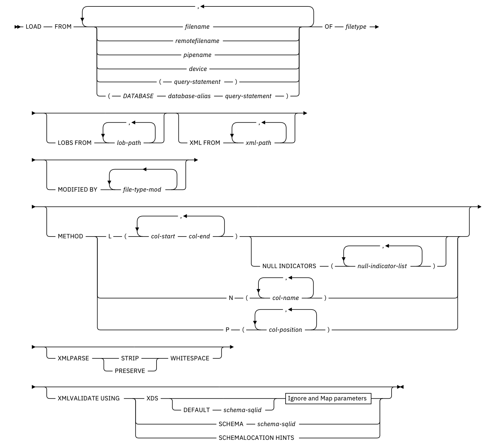
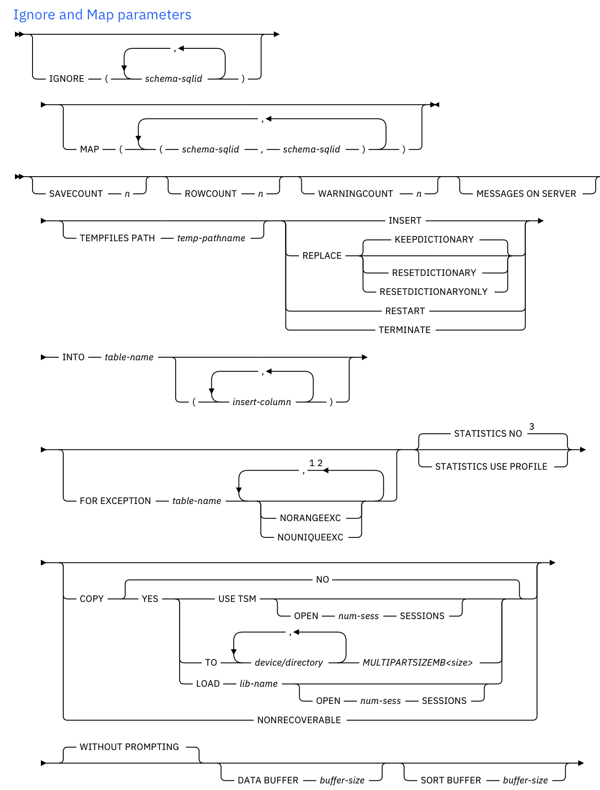

# 常用命令


```shell
db2 CONNECT TO DBNAME USER name USING password
```


```shell
db2 "DECLARE C1 CURSOR FOR SELECT * FROM FECHNER.SRCTAB"
db2 "LOAD FROM C1 OF CURSOR MESSAGES C:\load_sales.msg INSERT INTO FECHNER.SALES
NONRECOVERABLE"
```


## 快速清空表

```shell
db2 "alter table name activate not logged initially with empty table"
```


```shell
db2 load from /dev/null of del replace into tablename;
```


```shell
db2 import from /dev/null of del replace into tablename;
```


## JDBC执行命令

```java
call SYSPROC.ADMIN_CMD('RUNSTATS ON TABLE BHCSP.BHC_CL2_ALL_I ON COLUMNS (creditAccntId,billingId,termNo,targetRepaymentDate,finishDate) WITH DISTRIBUTION ON KEY COLUMNS');
```


## 数据库配置

```shell
db2 get db cfg for sample
db2 update db cfg using dlchktime 10000
```


## 解决死锁

```sql
-- 查询死锁进程ID与相关信息
select agent_id, a.* from sysibmadm.locks_held a with ur;

-- 也可以查询锁快照
db2 get snapshot for locks on sample;

--杀掉死锁进程
db2 "force application(agent_id)"
```


查询某个应用的锁快照

```sql
db2 get snapshot for locks on for application agentid appl-handler;
```


## 索引优化

```shell
db2 "RUNSTATS ON TABLE BHCSP.BHC_CL2_ALL_I ON COLUMNS (creditAccntId,billingId,termNo,targetRepaymentDate,finishDate) WITH DISTRIBUTION ON KEY COLUMNS"
db2 "reorg indexes all for table BHCSP.BHC_CL2_ALL_I ALLOW READ ACCESS"
db2 "RUNSTATS ON TABLE BHCSP.BHC_CL2_ALL_I ON COLUMNS (creditAccntId,billingId,termNo,targetRepaymentDate,finishDate) WITH DISTRIBUTION ON KEY COLUMNS"
```


## load

官方链接：https://www.ibm.com/docs/en/db2/11.5?topic=commands-load-using-admin-cmd






# 参数配置


## 兼容性设置

DB2默认情况下不支持`LIMIT x`关键字。 但是从DB2 v9.7.2开始，[support for `LIMIT x` can be enabled](http://freedb2.com/2010/07/14/top-3-ways-to-return-top-10-rows-by-an-sql-query/)通过[DB2_COMPATIBILITY_VECTOR registry variable](http://pic.dhe.ibm.com/infocenter/db2luw/v9r7/index.jsp?topic=/com.ibm.db2.luw.apdv.porting.doc/doc/r0052867.html)：

```shell
db2set DB2_COMPATIBILITY_VECTOR=MYS
db2stop
db2start
```


支持的 Oracle 兼容性功能：

```shell
db2set DB2_COMPATIBILITY_VECTOR=ORA
db2stop
db2start
```


ROWNUM 伪列 (0x01) 和 DUAL 表 (0x02) 支持：

```shell
db2set DB2_COMPATIBILITY_VECTOR=03
```


禁用所有兼容性功能：

```shell
db2set DB2_COMPATIBILITY_VECTOR=
```


如果在启用下列任何功能后创建数据库，然后禁用所有兼容性功能，那么仍会针对此数据库启用这些功能：

- NUMBER 数据类型
- VARCHAR2 数据类型
- 将 DATE 数据类型作为 TIMESTAMP(0)
- 创建与 Oracle 数据字典兼容的视图