# Docker安装

搜索 Jenkins 镜像

```shell
docker search jenkins
```

拉去镜像

```shell
docker image pull jenkins/jenkins
```

创建挂载目录

```shell
$ mkdir ~/jenkins
```

启动 Jenkins 容器

```shell
docker run -d \
    -p 9001:8080 \
    -p 60000:50000 \
    -v ~/jenkins:/var/jenkins_home \
    -v ~/Documents/apache-maven-3.9.3:/usr/local/maven \
    -v ~/Documents/jdk1.8.0_401:/usr/local/java \
    -v /etc/localtime:/etc/localtime \
    --restart=always \
    --privileged=true \
    --name=jenkins \
    jenkins/jenkins
    
docker run -d \
    -p 9001:8080 \
    -p 60000:50000 \
    -v ~/jenkins:/var/jenkins_home \
    -v ~/Documents/apache-maven-3.9.3:/usr/local/maven \
    -v ~/Documents/jdk1.8.0_401:/usr/local/java \
    -v /etc/localtime:/etc/localtime \
    -e LANG=zh_CN.UTF-8 \
    -e file.encoding=UTF-8 \
    --restart=always \
    --privileged=true \
    --name=jenkins \
    jenkins/jenkins
```

-d：后台运行容器；

-p 9001:8080：将容器的 8080 端口映射到服务器的 9001端口；

-p 50000:50000：将容器的 50000 端口映射到服务器的 50000 端口 好像与jenkins相关；

-v /usr/local/jenkins:/var/jenkins_home：将容器中 Jenkins 的工作目录挂载到服务器的 /usr/local/jenkins；

-v /etc/localtime:/etc/localtime：让容器使用和服务器同样的时间设置；

–restart=always：设置容器的重启策略为 Docker 重启时自动重启；

–name=jenkins：给容器起别名

jenkins/jenkins：镜像名称

查看容器：

```shell
user@MacBook-Pro ~ % docker ps -la
CONTAINER ID   IMAGE             COMMAND                  CREATED         STATUS         PORTS                                              NAMES
77083324c359   jenkins/jenkins   "/usr/bin/tini -- /u…"   3 minutes ago   Up 3 minutes   0.0.0.0:9001->8080/tcp, 0.0.0.0:60000->50000/tcp   jenkins
```

跟踪 jenkins 日志

```shell
docker logs jenkins
```

重新启动jenkins

```shell
docker run -d jenkins/jenkins 
```

登陆地址:

```
http://127.0.0.1:9001/login?from=%2F
```

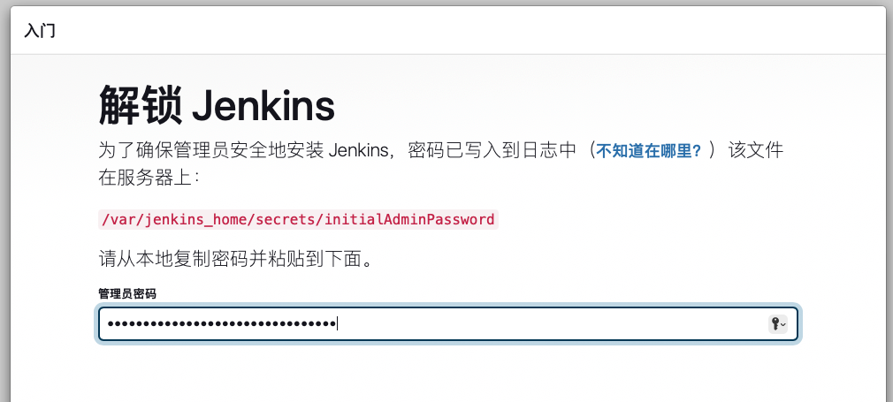

查看初始密码：

```
cat ~/jenkins/secret/initialAdminPassword
```

填入初始密码后，点击确定出现如下界面表示成功进入系统

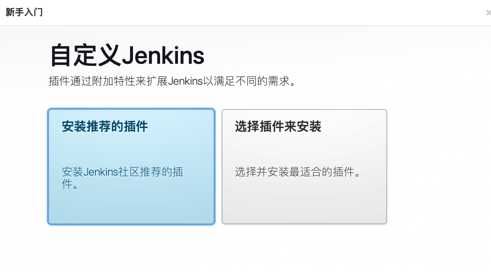

选择第一个安装jenkins插件：

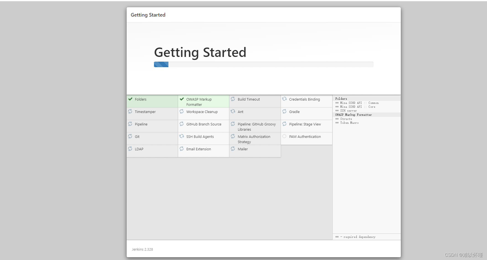

等待自动安装插件，安装完成后会出现如下界面：

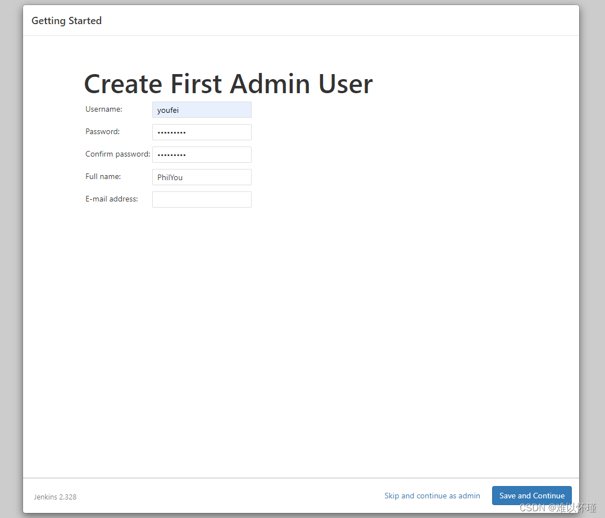

确认jenkins连接

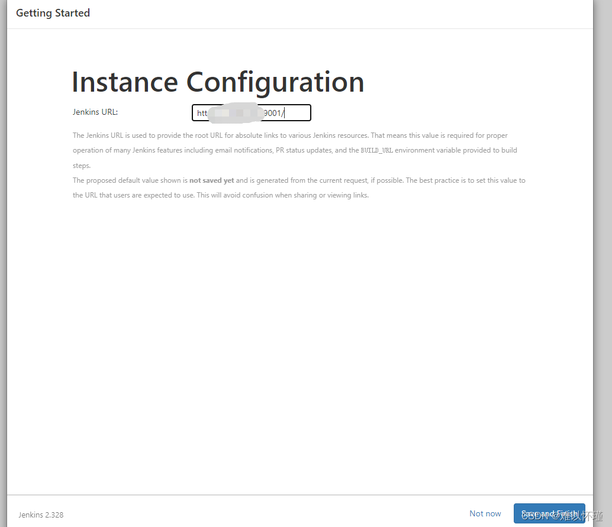

进入jenkins！ 看到此界面就是成功

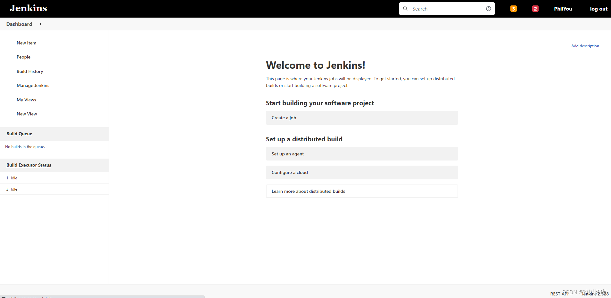


# 中文汉化


## 安装插件

点击【**Manage Jenkins**】选项。

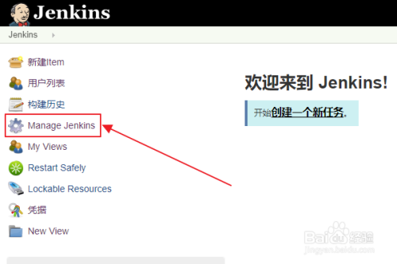


点击【**Manage Plugins**】选项。

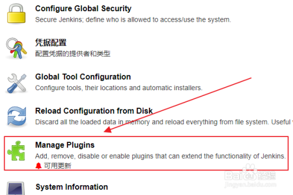


点击【**可选插件**】选项。

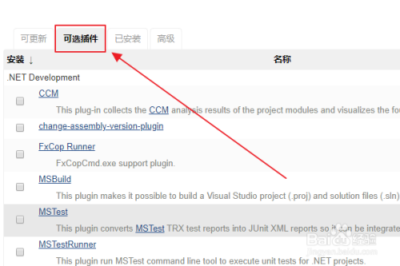


勾选【插件选项】，点击【直接安装】选项。此处安装插件完成之后，需要【**重启Jenkins**】来【**生效插件**】。

重启方式：在URL后加上【**/restart**】，点击【**回车**】，点击【**是**】即可。

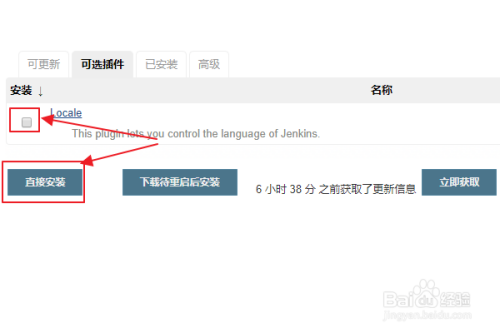

待重启完后之后，再次登录即可。


## 设置中文

点击【**Manage Jenkins**】选项。


点击【**Configure System**】选项。

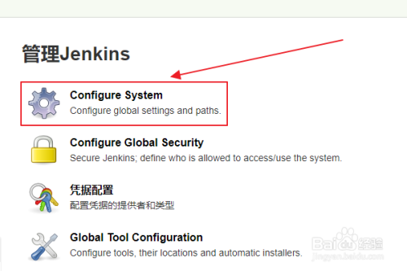


找到【**Locale**】选项，输入【**zh_CN**】,勾选下面的选项，最后点击【**应用**】即可。

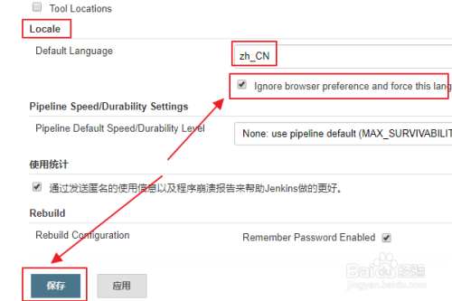


