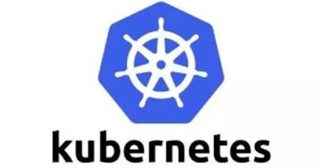
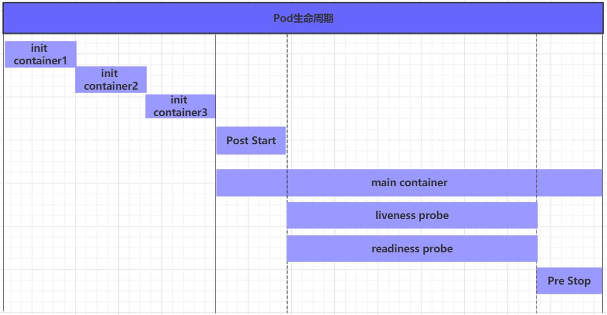
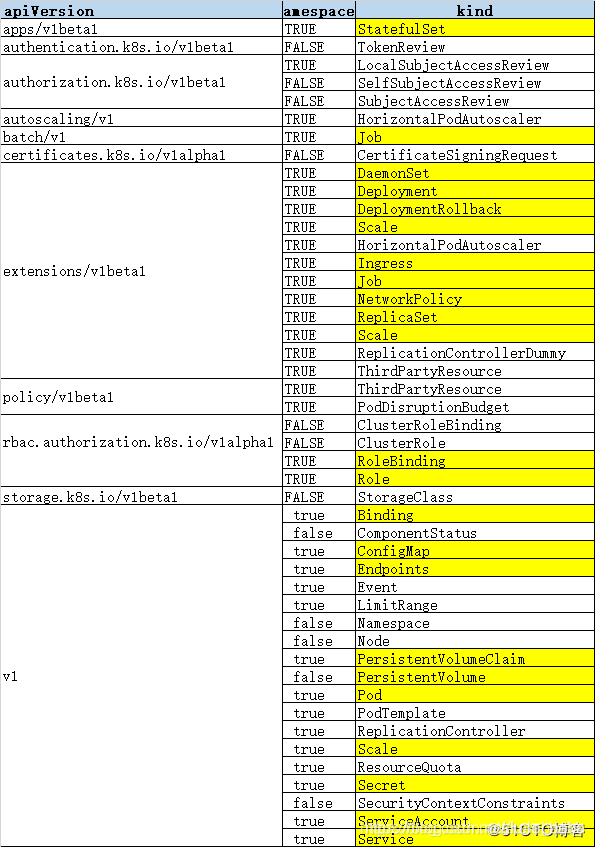

# Kubernetes介绍


## 应用部署方式演变

在部署应用程序的方式上，主要经历了三个时代：

- **传统部署**：互联网早期，会直接将应用程序部署在物理机上

  优点：简单，不需要其它技术的参与
  
  缺点：不能为应用程序定义资源使用边界，很难合理地分配计算资源，而且程序之间容易产生影响

- **虚拟化部署**：可以在一台物理机上运行多个虚拟机，每个虚拟机都是独立的一个环境

  优点：程序环境不会相互产生影响，提供了一定程度的安全性
  
  缺点：增加了操作系统，浪费了部分资源

- **容器化部署**：与虚拟化类似，但是共享了操作系统

  优点：
  
  可以保证每个容器拥有自己的文件系统、CPU、内存、进程空间等。
  
  运行应用程序所需要的资源都被容器包装，并和底层基础架构解耦。
  
  容器化的应用程序可以跨云服务商、跨Linux操作系统发行版进行部署。


容器化部署方式给带来很多的便利，但是也会出现一些问题，比如说：

- 一个容器故障停机了，怎么样让另外一个容器立刻启动去替补停机的容器
- 当并发访问量变大的时候，怎么样做到横向扩展容器数量

这些容器管理的问题统称为**容器编排**问题，为了解决这些容器编排问题，就产生了一些容器编排的软件：

- **Swarm**：Docker自己的容器编排工具；
- **Mesos**：Apache的一个资源统一管控的工具，需要和Marathon结合使用；
- **Kubernetes**：Google开源的的容器编排工具；


## kubernetes简介



 

kubernetes，是一个全新的基于容器技术的分布式架构领先方案，是谷歌严格保密十几年的秘密武器----Borg系统的一个开源版本，于2014年9月发布第一个版本，2015年7月发布第一个正式版本。

kubernetes的本质是**一组服务器集群**，可以在集群的每个节点上运行特定的程序，来对节点中的容器进行管理。目的是实现资源管理的自动化，主要提供了以下功能：

- **自我修复**：一旦某一个容器崩溃，能够在1秒左右迅速启动新的容器
- **弹性伸缩**：可以根据需要，自动对集群中正在运行的容器数量进行调整
- **服务发现**：服务可以通过自动发现的形式找到其所依赖的服务
- **负载均衡**：如果一个服务起动了多个容器，能够自动实现请求的负载均衡
- **版本回退**：如果发现新发布的程序版本有问题，可以立即回退到原来的版本
- **存储编排**：可以根据容器自身的需求自动创建存储卷


## kubernetes组件

一个 kubernetes 集群主要是由**控制节点（master）**、**工作节点（node）**构成，每个节点上都会安装不同的组件。

**master：集群的控制平面，负责集群的决策 ( 管理 )**

- **ApiServer** : 资源操作的唯一入口，接收用户输入的命令，提供认证、授权、API注册和发现等机制
- **Scheduler** : 负责集群资源调度，按照预定的调度策略将Pod调度到相应的node节点上
- **ControllerManager** : 负责维护集群的状态，比如程序部署安排、故障检测、自动扩展、滚动更新等
- **Etcd** ：负责存储集群中各种资源对象的信息

**node：集群的数据平面，负责为容器提供运行环境 ( 干活 )**

- **Kubelet** : 负责维护容器的生命周期，即通过控制 docker，来创建、更新、销毁容器；
- **KubeProxy** : 负责提供集群内部的服务发现和负载均衡；
- **Docker** : 负责节点上容器的各种操作；


下面，以部署一个nginx服务来说明 kubernetes 系统各个组件调用关系：

1. 首先要明确，一旦kubernetes环境启动之后，master和node都会将自身的信息存储到etcd数据库中

2. 一个nginx服务的安装请求会首先被发送到master节点的apiServer组件

3. apiServer组件会调用scheduler组件来决定到底应该把这个服务安装到哪个node节点上

   在此时，它会从etcd中读取各个node节点的信息，然后按照一定的算法进行选择，并将结果告知apiServer

4. apiServer调用controller-manager去调度Node节点安装nginx服务

5. kubelet接收到指令后，会通知docker，然后由docker来启动一个nginx的pod

   pod是kubernetes的最小操作单元，容器必须跑在pod中至此，

6. 一个nginx服务就运行了，如果需要访问nginx，就需要通过kube-proxy来对pod产生访问的代理

这样，外界用户就可以访问集群中的nginx服务了


## kubernetes概念

**Master**：集群控制节点，每个集群需要至少一个 master 节点负责集群的管控；

**Node**：工作负载节点，由master分配容器到这些node工作节点上，然后node节点上的docker负责容器的运行；

**Pod**：kubernetes的最小控制单元，容器都是运行在pod中的，一个pod中可以有1个或者多个容器；

**Controller**：控制器，通过它来实现对pod的管理，比如启动pod、停止pod、伸缩pod的数量等等；

**Service**：pod对外服务的统一入口，下面可以维护者同一类的多个pod；

**Label**：标签，用于对 pod 进行分类，同一类pod会拥有相同的标签；

**NameSpace**：命名空间，用来隔离pod的运行环境；


# kubernetes集群环境搭建


## 前置知识点

目前生产部署Kubernetes 集群主要有两种方式：

**kubeadm**

Kubeadm 是一个K8s 部署工具，提供kubeadm init 和kubeadm join，用于快速部署Kubernetes 集群。

官方地址：https://kubernetes.io/docs/reference/setup-tools/kubeadm/kubeadm/

**二进制包**

从 github 下载发行版的二进制包，手动部署每个组件，组成Kubernetes 集群。

Kubeadm 降低部署门槛，但屏蔽了很多细节，遇到问题很难排查。如果想更容易可控，推荐使用二进制包部署Kubernetes 集群，虽然手动部署麻烦点，期间可以学习很多工作原理，也利于后期维护。


## kubeadm 部署方式介绍

kubeadm 是官方社区推出的一个用于快速部署 kubernetes 集群的工具，这个工具能通过两条指令完成一个 kubernetes 集群的部署：

- 创建一个Master 节点kubeadm init
- 将Node 节点加入到当前集群中$ kubeadm join <Master 节点的IP 和端口>


## 安装要求

在开始之前，部署Kubernetes 集群机器需要满足以下几个条件：

- 一台或多台机器，操作系统CentOS7.x-86_x64
- 硬件配置：2GB 或更多RAM，2 个CPU 或更多CPU，硬盘30GB 或更多
- 集群中所有机器之间网络互通
- 可以访问外网，需要拉取镜像
- 禁止swap 分区


## 最终目标

- 在所有节点上安装Docker 和kubeadm
- 部署Kubernetes Master
- 部署容器网络插件
- 部署Kubernetes Node，将节点加入Kubernetes 集群中
- 部署Dashboard Web 页面，可视化查看Kubernetes 资源


## 准备环境

 


| 角色         | IP地址      | 组件                              |
| :----------- | :---------- | :-------------------------------- |
| k8s-master01 | 192.168.5.3 | docker，kubectl，kubeadm，kubelet |
| k8s-node01   | 192.168.5.4 | docker，kubectl，kubeadm，kubelet |
| k8s-node02   | 192.168.5.5 | docker，kubectl，kubeadm，kubelet |


## 系统初始化


### 设置系统主机名以及 Host 文件的相互解析

```shell
hostnamectl set-hostname k8s-master01 && bash
hostnamectl set-hostname k8s-node01 && bash
hostnamectl set-hostname k8s-node02 && bash
```

```shell
cat <<EOF>> /etc/hosts
192.168.5.3     k8s-master01
192.168.5.4     k8s-node01
192.168.5.5     k8s-node02
EOF
```

```shell
scp /etc/hosts root@192.168.5.4:/etc/hosts 
scp /etc/hosts root@192.168.5.5:/etc/hosts 
```


### 安装依赖文件（所有节点都要操作）

```shell
yum install -y conntrack ntpdate ntp ipvsadm ipset jq iptables curl sysstat libseccomp wget vim net-tools git
```


### 设置防火墙为 Iptables 并设置空规则（所有节点都要操作）

```shell
systemctl stop firewalld && systemctl disable firewalld

yum -y install iptables-services && systemctl start iptables && systemctl enable iptables && iptables -F && service iptables save
```


### 关闭 SELINUX（所有节点都要操作）

```shell
swapoff -a && sed -i '/ swap / s/^\(.*\)$/#\1/g' /etc/fstab

setenforce 0 && sed -i 's/^SELINUX=.*/SELINUX=disabled/' /etc/selinux/config
```


### 调整内核参数，对于 K8S（所有节点都要操作）

```shell
modprobe br_netfilter

cat <<EOF> kubernetes.conf 
net.bridge.bridge-nf-call-iptables=1
net.bridge.bridge-nf-call-ip6tables=1
net.ipv4.ip_forward=1
net.ipv4.tcp_tw_recycle=0
vm.swappiness=0 # 禁止使用 swap 空间，只有当系统 OOM 时才允许使用它
vm.overcommit_memory=1 # 不检查物理内存是否够用
vm.panic_on_oom=0 # 开启 OOM
fs.inotify.max_user_instances=8192
fs.inotify.max_user_watches=1048576
fs.file-max=52706963
fs.nr_open=52706963
net.ipv6.conf.all.disable_ipv6=1
net.netfilter.nf_conntrack_max=2310720
EOF

cp kubernetes.conf /etc/sysctl.d/kubernetes.conf

sysctl -p /etc/sysctl.d/kubernetes.conf
```


### 调整系统时区（所有节点都要操作）

```shell
# 设置系统时区为 中国/上海
timedatectl set-timezone Asia/Shanghai
# 将当前的 UTC 时间写入硬件时钟
timedatectl set-local-rtc 0
# 重启依赖于系统时间的服务
systemctl restart rsyslog
systemctl restart crond
```


### 设置 rsyslogd 和 systemd journald（所有节点都要操作）

```shell
# 持久化保存日志的目录
mkdir /var/log/journal 
mkdir /etc/systemd/journald.conf.d
cat > /etc/systemd/journald.conf.d/99-prophet.conf <<EOF
[Journal]
# 持久化保存到磁盘
Storage=persistent

# 压缩历史日志
Compress=yes

SyncIntervalSec=5m
RateLimitInterval=30s
RateLimitBurst=1000

# 最大占用空间 10G
SystemMaxUse=10G

# 单日志文件最大 200M
SystemMaxFileSize=200M

# 日志保存时间 2 周
MaxRetentionSec=2week

# 不将日志转发到 syslog
ForwardToSyslog=no
EOF

systemctl restart systemd-journald
```


### kube-proxy 开启 ipvs 的前置条件（所有节点都要操作）

```shell
cat <<EOF> /etc/sysconfig/modules/ipvs.modules 
#!/bin/bash
modprobe -- ip_vs
modprobe -- ip_vs_rr
modprobe -- ip_vs_wrr
modprobe -- ip_vs_sh
modprobe -- nf_conntrack_ipv4
EOF

chmod 755 /etc/sysconfig/modules/ipvs.modules && bash /etc/sysconfig/modules/ipvs.modules && lsmod | grep -e ip_vs -e nf_conntrack_ipv4
```


### 安装 Docker 软件（所有节点都要操作）

```shell
yum install -y yum-utils device-mapper-persistent-data lvm2

yum-config-manager --add-repo http://mirrors.aliyun.com/docker-ce/linux/centos/docker-ce.repo

yum install -y docker-ce

## 创建 /etc/docker 目录
mkdir /etc/docker

cat > /etc/docker/daemon.json <<EOF
{
"exec-opts": ["native.cgroupdriver=systemd"],
"log-driver": "json-file",
"log-opts": {
"max-size": "100m"
}
}
EOF
mkdir -p /etc/systemd/system/docker.service.d
# 重启docker服务
systemctl daemon-reload && systemctl restart docker && systemctl enable docker
```
上传文件到``` /etc/yum.repos.d/ ```目录下，也可以 代替 ``` yum-config-manager --add-repo http://mirrors.aliyun.com/docker-ce/linux/centos/docker-ce.repo ``` 命令

docker-ce.repo

```shell
[docker-ce-stable]
name=Docker CE Stable - $basearch
baseurl=https://mirrors.aliyun.com/docker-ce/linux/centos/$releasever/$basearch/stable
enabled=1
gpgcheck=1
gpgkey=https://mirrors.aliyun.com/docker-ce/linux/centos/gpg

[docker-ce-stable-debuginfo]
name=Docker CE Stable - Debuginfo $basearch
baseurl=https://mirrors.aliyun.com/docker-ce/linux/centos/$releasever/debug-$basearch/stable
enabled=0
gpgcheck=1
gpgkey=https://mirrors.aliyun.com/docker-ce/linux/centos/gpg

[docker-ce-stable-source]
name=Docker CE Stable - Sources
baseurl=https://mirrors.aliyun.com/docker-ce/linux/centos/$releasever/source/stable
enabled=0
gpgcheck=1
gpgkey=https://mirrors.aliyun.com/docker-ce/linux/centos/gpg

[docker-ce-test]
name=Docker CE Test - $basearch
baseurl=https://mirrors.aliyun.com/docker-ce/linux/centos/$releasever/$basearch/test
enabled=0
gpgcheck=1
gpgkey=https://mirrors.aliyun.com/docker-ce/linux/centos/gpg

[docker-ce-test-debuginfo]
name=Docker CE Test - Debuginfo $basearch
baseurl=https://mirrors.aliyun.com/docker-ce/linux/centos/$releasever/debug-$basearch/test
enabled=0
gpgcheck=1
gpgkey=https://mirrors.aliyun.com/docker-ce/linux/centos/gpg

[docker-ce-test-source]
name=Docker CE Test - Sources
baseurl=https://mirrors.aliyun.com/docker-ce/linux/centos/$releasever/source/test
enabled=0
gpgcheck=1
gpgkey=https://mirrors.aliyun.com/docker-ce/linux/centos/gpg

[docker-ce-nightly]
name=Docker CE Nightly - $basearch
baseurl=https://mirrors.aliyun.com/docker-ce/linux/centos/$releasever/$basearch/nightly
enabled=0
gpgcheck=1
gpgkey=https://mirrors.aliyun.com/docker-ce/linux/centos/gpg

[docker-ce-nightly-debuginfo]
name=Docker CE Nightly - Debuginfo $basearch
baseurl=https://mirrors.aliyun.com/docker-ce/linux/centos/$releasever/debug-$basearch/nightly
enabled=0
gpgcheck=1
gpgkey=https://mirrors.aliyun.com/docker-ce/linux/centos/gpg

[docker-ce-nightly-source]
name=Docker CE Nightly - Sources
baseurl=https://mirrors.aliyun.com/docker-ce/linux/centos/$releasever/source/nightly
enabled=0
gpgcheck=1
gpgkey=https://mirrors.aliyun.com/docker-ce/linux/centos/gpg
```


### 安装 Kubeadm （所有节点都要操作）

```shell
cat <<EOF > /etc/yum.repos.d/kubernetes.repo
[kubernetes]
name=Kubernetes
baseurl=http://mirrors.aliyun.com/kubernetes/yum/repos/kubernetes-el7-x86_64
enabled=1
gpgcheck=0
repo_gpgcheck=0
gpgkey=http://mirrors.aliyun.com/kubernetes/yum/doc/yum-key.gpg
http://mirrors.aliyun.com/kubernetes/yum/doc/rpm-package-key.gpg
EOF

yum install -y kubelet kubeadm kubectl && systemctl enable kubelet
```


## 部署Kubernetes Master


### 初始化主节点（主节点操作）

```shell
kubeadm init --apiserver-advertise-address=192.168.5.3 --image-repository registry.aliyuncs.com/google_containers --kubernetes-version v1.21.1 --service-cidr=10.96.0.0/12 --pod-network-cidr=10.244.0.0/16

mkdir -p $HOME/.kube

sudo cp -i /etc/kubernetes/admin.conf $HOME/.kube/config

sudo chown $(id -u):$(id -g) $HOME/.kube/config
```


### 加入主节点以及其余工作节点

```shell
kubeadm join 192.168.5.3:6443 --token h0uelc.l46qp29nxscke7f7 \
        --discovery-token-ca-cert-hash sha256:abc807778e24bff73362ceeb783cc7f6feec96f20b4fd707c3f8e8312294e28f 
```


### 部署网络

```shell
kubectl apply -f https://raw.githubusercontent.com/coreos/flannel/master/Documentation/kube-flannel.yml
```

下边是文件

```yaml
---
apiVersion: policy/v1beta1
kind: PodSecurityPolicy
metadata:
  name: psp.flannel.unprivileged
  annotations:
    seccomp.security.alpha.kubernetes.io/allowedProfileNames: docker/default
    seccomp.security.alpha.kubernetes.io/defaultProfileName: docker/default
    apparmor.security.beta.kubernetes.io/allowedProfileNames: runtime/default
    apparmor.security.beta.kubernetes.io/defaultProfileName: runtime/default
spec:
  privileged: false
  volumes:
  - configMap
  - secret
  - emptyDir
  - hostPath
  allowedHostPaths:
  - pathPrefix: "/etc/cni/net.d"
  - pathPrefix: "/etc/kube-flannel"
  - pathPrefix: "/run/flannel"
  readOnlyRootFilesystem: false
  # Users and groups
  runAsUser:
    rule: RunAsAny
  supplementalGroups:
    rule: RunAsAny
  fsGroup:
    rule: RunAsAny
  # Privilege Escalation
  allowPrivilegeEscalation: false
  defaultAllowPrivilegeEscalation: false
  # Capabilities
  allowedCapabilities: ['NET_ADMIN', 'NET_RAW']
  defaultAddCapabilities: []
  requiredDropCapabilities: []
  # Host namespaces
  hostPID: false
  hostIPC: false
  hostNetwork: true
  hostPorts:
  - min: 0
    max: 65535
  # SELinux
  seLinux:
    # SELinux is unused in CaaSP
    rule: 'RunAsAny'
---
kind: ClusterRole
apiVersion: rbac.authorization.k8s.io/v1
metadata:
  name: flannel
rules:
- apiGroups: ['extensions']
  resources: ['podsecuritypolicies']
  verbs: ['use']
  resourceNames: ['psp.flannel.unprivileged']
- apiGroups:
  - ""
  resources:
  - pods
  verbs:
  - get
- apiGroups:
  - ""
  resources:
  - nodes
  verbs:
  - list
  - watch
- apiGroups:
  - ""
  resources:
  - nodes/status
  verbs:
  - patch
---
kind: ClusterRoleBinding
apiVersion: rbac.authorization.k8s.io/v1
metadata:
  name: flannel
roleRef:
  apiGroup: rbac.authorization.k8s.io
  kind: ClusterRole
  name: flannel
subjects:
- kind: ServiceAccount
  name: flannel
  namespace: kube-system
---
apiVersion: v1
kind: ServiceAccount
metadata:
  name: flannel
  namespace: kube-system
---
kind: ConfigMap
apiVersion: v1
metadata:
  name: kube-flannel-cfg
  namespace: kube-system
  labels:
    tier: node
    app: flannel
data:
  cni-conf.json: |
    {
      "name": "cbr0",
      "cniVersion": "0.3.1",
      "plugins": [
        {
          "type": "flannel",
          "delegate": {
            "hairpinMode": true,
            "isDefaultGateway": true
          }
        },
        {
          "type": "portmap",
          "capabilities": {
            "portMappings": true
          }
        }
      ]
    }
  net-conf.json: |
    {
      "Network": "10.244.0.0/16",
      "Backend": {
        "Type": "vxlan"
      }
    }
---
apiVersion: apps/v1
kind: DaemonSet
metadata:
  name: kube-flannel-ds
  namespace: kube-system
  labels:
    tier: node
    app: flannel
spec:
  selector:
    matchLabels:
      app: flannel
  template:
    metadata:
      labels:
        tier: node
        app: flannel
    spec:
      affinity:
        nodeAffinity:
          requiredDuringSchedulingIgnoredDuringExecution:
            nodeSelectorTerms:
            - matchExpressions:
              - key: kubernetes.io/os
                operator: In
                values:
                - linux
      hostNetwork: true
      priorityClassName: system-node-critical
      tolerations:
      - operator: Exists
        effect: NoSchedule
      serviceAccountName: flannel
      initContainers:
      - name: install-cni
        image: quay.io/coreos/flannel:v0.14.0
        command:
        - cp
        args:
        - -f
        - /etc/kube-flannel/cni-conf.json
        - /etc/cni/net.d/10-flannel.conflist
        volumeMounts:
        - name: cni
          mountPath: /etc/cni/net.d
        - name: flannel-cfg
          mountPath: /etc/kube-flannel/
      containers:
      - name: kube-flannel
        image: quay.io/coreos/flannel:v0.14.0
        command:
        - /opt/bin/flanneld
        args:
        - --ip-masq
        - --kube-subnet-mgr
        resources:
          requests:
            cpu: "100m"
            memory: "50Mi"
          limits:
            cpu: "100m"
            memory: "50Mi"
        securityContext:
          privileged: false
          capabilities:
            add: ["NET_ADMIN", "NET_RAW"]
        env:
        - name: POD_NAME
          valueFrom:
            fieldRef:
              fieldPath: metadata.name
        - name: POD_NAMESPACE
          valueFrom:
            fieldRef:
              fieldPath: metadata.namespace
        volumeMounts:
        - name: run
          mountPath: /run/flannel
        - name: flannel-cfg
          mountPath: /etc/kube-flannel/
      volumes:
      - name: run
        hostPath:
          path: /run/flannel
      - name: cni
        hostPath:
          path: /etc/cni/net.d
      - name: flannel-cfg
        configMap:
          name: kube-flannel-cfg
```


## 测试kubernetes 集群


### 部署nginx 测试

```shell
kubectl create deployment nginx --image=nginx

kubectl expose deployment nginx --port=80 --type=NodePort

kubectl get pod,svc
```


# 资源管理


## 资源管理介绍

在 kubernetes 中，所有的内容都抽象为资源，用户需要通过操作资源来管理 kubernetes。

> kubernetes的本质上就是一个集群系统，用户可以在集群中部署各种服务，所谓的部署服务，其实就是在kubernetes集群中运行一个个的容器，并将指定的程序跑在容器中。
>
> kubernetes的最小管理单元是pod而不是容器，所以只能将容器放在`Pod`中，而kubernetes一般也不会直接管理Pod，而是通过`Pod控制器`来管理Pod的。
>
> Pod可以提供服务之后，就要考虑如何访问Pod中服务，kubernetes提供了`Service`资源实现这个功能。
>
> 当然，如果Pod中程序的数据需要持久化，kubernetes还提供了各种`存储`系统。


> 学习 kubernetes 的核心，就是学习如何对集群上的 `Pod`、`Pod控制器`、`Service`、`存储` 等各种资源进行操作。


## 资源管理方式

- 命令式对象管理

  直接使用命令去操作 kubernetes 资源。

  `kubectl run nginx-pod --image=nginx:1.17.1 --port=80`

- 命令式对象配置

  通过命令配置和配置文件去操作 kubernetes 资源。

  `kubectl create/patch -f nginx-pod.yaml`

- 声明式对象配置

  通过 apply 命令和配置文件去操作 kubernetes 资源。
  
  `kubectl apply -f nginx-pod.yaml`

| 类型           | 操作对象 | 适用环境 | 优点           | 缺点                             |
| :------------- | :------- | :------- | :------------- | :------------------------------- |
| 命令式对象管理 | 对象     | 测试     | 简单           | 只能操作活动对象，无法审计、跟踪 |
| 命令式对象配置 | 文件     | 开发     | 可以审计、跟踪 | 项目大时，配置文件多，操作麻烦   |
| 声明式对象配置 | 目录     | 开发     | 支持目录操作   | 意外情况下难以调试               |


### 命令式对象管理


**kubectl命令**

kubectl是kubernetes集群的命令行工具，通过它能够对集群本身进行管理，并能够在集群上进行容器化应用的安装部署。kubectl命令的语法如下：

```
kubectl [command] [type] [name] [flags]
```

**comand**：指定要对资源执行的操作，例如create、get、delete

**type**：指定资源类型，比如deployment、pod、service

**name**：指定资源的名称，名称大小写敏感

**flags**：指定额外的可选参数

```shell
# 查看所有pod
kubectl get pod 

# 查看某个pod
kubectl get pod pod_name

# 查看某个pod,以yaml格式展示结果
kubectl get pod pod_name -o yaml
```

**资源类型**

kubernetes 中所有的内容都抽象为资源，可以通过下面的命令进行查看:

```
kubectl api-resources
```

经常使用的资源有下面这些：

| 资源分类      | 资源名称                 | 缩写    | 资源作用        |
| :------------ | :----------------------- | :------ | :-------------- |
| 集群级别资源  | nodes                    | no      | 集群组成部分    |
| namespaces    | ns                       | 隔离Pod |                 |
| pod资源       | pods                     | po      | 装载容器        |
| pod资源控制器 | replicationcontrollers   | rc      | 控制pod资源     |
|               | replicasets              | rs      | 控制pod资源     |
|               | deployments              | deploy  | 控制pod资源     |
|               | daemonsets               | ds      | 控制pod资源     |
|               | jobs                     |         | 控制pod资源     |
|               | cronjobs                 | cj      | 控制pod资源     |
|               | horizontalpodautoscalers | hpa     | 控制pod资源     |
|               | statefulsets             | sts     | 控制pod资源     |
| 服务发现资源  | services                 | svc     | 统一pod对外接口 |
|               | ingress                  | ing     | 统一pod对外接口 |
| 存储资源      | volumeattachments        |         | 存储            |
|               | persistentvolumes        | pv      | 存储            |
|               | persistentvolumeclaims   | pvc     | 存储            |
| 配置资源      | configmaps               | cm      | 配置            |
|               | secrets                  |         | 配置            |

**操作**

kubernetes 允许对资源进行多种操作，可以通过 `--help` 查看详细的操作命令

```
kubectl --help
```

经常使用的操作有下面这些：

| 命令分类   | 命令         | 翻译                        | 命令作用                     |
| :--------- | :----------- | :-------------------------- | :--------------------------- |
| 基本命令   | create       | 创建                        | 创建一个资源                 |
|            | edit         | 编辑                        | 编辑一个资源                 |
|            | get          | 获取                        | 获取一个资源                 |
|            | patch        | 更新                        | 更新一个资源                 |
|            | delete       | 删除                        | 删除一个资源                 |
|            | explain      | 解释                        | 展示资源文档                 |
| 运行和调试 | run          | 运行                        | 在集群中运行一个指定的镜像   |
|            | expose       | 暴露                        | 暴露资源为Service            |
|            | describe     | 描述                        | 显示资源内部信息             |
|            | logs         | 日志输出容器在 pod 中的日志 | 输出容器在 pod 中的日志      |
|            | attach       | 缠绕进入运行中的容器        | 进入运行中的容器             |
|            | exec         | 执行容器中的一个命令        | 执行容器中的一个命令         |
|            | cp           | 复制                        | 在Pod内外复制文件            |
|            | rollout      | 首次展示                    | 管理资源的发布               |
|            | scale        | 规模                        | 扩(缩)容Pod的数量            |
|            | autoscale    | 自动调整                    | 自动调整Pod的数量            |
| 高级命令   | apply        | rc                          | 通过文件对资源进行配置       |
|            | label        | 标签                        | 更新资源上的标签             |
| 其他命令   | cluster-info | 集群信息                    | 显示集群信息                 |
|            | version      | 版本                        | 显示当前Server和Client的版本 |

下面以一个 `namespace/pod` 的创建和删除简单演示下命令的使用：

```shell
# 创建一个namespace
[root@master ~]# kubectl create namespace dev
namespace/dev created

# 获取namespace
[root@master ~]# kubectl get ns
NAME              STATUS   AGE
default           Active   21h
dev               Active   21s
kube-node-lease   Active   21h
kube-public       Active   21h
kube-system       Active   21h

# 在此namespace下创建并运行一个nginx的Pod
[root@master ~]# kubectl run pod --image=nginx:latest -n dev
kubectl run --generator=deployment/apps.v1 is DEPRECATED and will be removed in a future version. Use kubectl run --generator=run-pod/v1 or kubectl create instead.
deployment.apps/pod created

# 查看新创建的pod
[root@master ~]# kubectl get pod -n dev
NAME  READY   STATUS    RESTARTS   AGE
pod   1/1     Running   0          21s

# 删除指定的pod
[root@master ~]# kubectl delete pod pod-864f9875b9-pcw7x
pod "pod" deleted

# 删除指定的namespace
[root@master ~]# kubectl delete ns dev
namespace "dev" deleted
```


### 命令式对象配置

命令式对象配置就是使用命令配合配置文件一起来操作 kubernetes 资源。

1）创建一个 `nginxpod.yaml`

```yaml
apiVersion: v1
kind: Namespace
metadata:
  name: dev

---

apiVersion: v1
kind: Pod
metadata:
  name: nginxpod
  namespace: dev
spec:
  containers:
  - name: nginx-containers
    image: nginx:latest
```

2）执行create命令，创建资源：

```yaml
[root@master ~]# kubectl create -f nginxpod.yaml
namespace/dev created
pod/nginxpod created
```

此时发现创建了两个资源对象，分别是namespace和pod

3）执行get命令，查看资源：

```shell
[root@master ~]#  kubectl get -f nginxpod.yaml
NAME            STATUS   AGE
namespace/dev   Active   18s

NAME            READY   STATUS    RESTARTS   AGE
pod/nginxpod    1/1     Running   0          17s
```

这样就显示了两个资源对象的信息

4）执行delete命令，删除资源：

```shell
[root@master ~]# kubectl delete -f nginxpod.yaml
namespace "dev" deleted
pod "nginxpod" deleted
```

此时发现两个资源对象被删除了

```
总结:
    命令式对象配置的方式操作资源，可以简单的认为：命令  +  yaml配置文件（里面是命令需要的各种参数）
```


### 声明式对象配置

声明式对象配置跟命令式对象配置很相似，但是它只有一个命令apply。

```shell
# 首先执行一次kubectl apply -f yaml文件，发现创建了资源
[root@master ~]#  kubectl apply -f nginxpod.yaml
namespace/dev created
pod/nginxpod created

# 再次执行一次kubectl apply -f yaml文件，发现说资源没有变动
[root@master ~]#  kubectl apply -f nginxpod.yaml
namespace/dev unchanged
pod/nginxpod unchanged
```

```
总结:
    其实声明式对象配置就是使用apply描述一个资源最终的状态（在yaml中定义状态）
    使用apply操作资源：
        如果资源不存在，就创建，相当于 kubectl create
        如果资源已存在，就更新，相当于 kubectl patch
```

> 扩展：kubectl可以在node节点上运行吗 ?

kubectl的运行是需要进行配置的，它的配置文件是$HOME/.kube，如果想要在node节点运行此命令，需要将master上的.kube文件复制到node节点上，即在master节点上执行下面操作：

```shell
scp  -r  HOME/.kube   node1: HOME/
```

> 使用推荐: 三种方式应该怎么用 ?

创建/更新资源 使用声明式对象配置 kubectl apply -f XXX.yaml

删除资源 使用命令式对象配置 kubectl delete -f XXX.yaml

查询资源 使用命令式对象管理 kubectl get(describe) 资源名称


# Pod

Pod是 Kubernetes 进行管理的最小单元，程序要运行必须部署在容器中，而容器必须存在于 Pod 中。

Pod 可以认为是对容器的封装，一个 Pod 中可以存在一个或者多个容器。

Kubernetes 在集群启动之后，集群中的各个组件也都是以 Pod 方式运行的。

如下图所示，每个 Pod 都可以包含多个业务容器与一个 Pause 容器。


## Pod 种类

1. 自主式 Pod：Kubernetes 直接创建出来的 Pod，这种 Pod 删除后就没有了，也不会重建；
2. 控制器创建的 Pod：Kubernetes 通过控制器创建的 Pod，这种 Pod 删除了之后还会自动重建；


## Pause（根容器）

每个 Pod 都会有的一个**根容器**。

- Pause 容器会作为第一个容器启动，并且会一直运行，直到该 Pod 被删除或终止；
- Pause 容器在运行时不会执行任何操作，其主要功能是持续监听一个特定的信号，以保持整个 Pod 的运行状态；
- Pause 容器可以作为一个依据，用来评估整个 Pod 的健康状态；
- 其他容器（即业务容器）将被设置为使用该 Pause 容器的网络命名空间和 IPC（Inter-Process Communication，进程间通信）命名空间，从而实现容器之间的网络和通信隔离；
- Pause 容器的创建和管理是由 Kubernetes 自动完成的，用户通常不需要手动干预；
- Pause 容器是 Kubernetes 通过实现容器的运行时约定来实现 Pod 生命周期管理的关键组件之一；
- Pause 容器的存在是为了维护 Pod 的持久性和稳定性，确保即使在容器故障或节点故障时，Pod 也能够正常运行；


## 生命周期

将 Pod 对象从创建、运行、停止的这段时间范围称为生命周期，步骤如下所示。


### Pod 创建过程


1. 用户通过 kubectl 或其他 api 客户端提交需要创建的 Pod 信息给 apiServer；
2. apiServer 开始生成 Pod 对象的信息，并将信息存入 etcd，然后返回确认信息至客户端；
3. apiServer 开始反映 etcd 中的 Pod 对象的变化，其他组件使用 watch 机制来跟踪检查 apiServer 上的变动；
4. scheduler 发现有新的 Pod 对象要创建，开始为 Pod 分配主机并将结果信息更新至 apiServer；
5. Node 节点上的 kubelet 发现有 Pod 调度过来，尝试调用 docker 启动容器，并将结果回送至 apiServer；
6. apiServer 将接收到的 Pod 状态信息存入 etcd 中；


### Pod 运行过程



1. 运行初始化容器（init container）

   初始化容器会在主容器之前运行。在 Pod 启动时，Kubernetes 首先启动所有的初始化容器，并等待它们成功完成后，才会启动主容器。只有当所有初始化容器都成功完成时，主容器才会被调度和启动；

2. 容器启动前钩子（preStart）

   preStart 钩子会在容器内部的进程启动之前执行，允许用户自定义容器启动前执行的一些操作，如加载配置、准备环境等；

3. 运行主容器（main container）

   启动主容器中的（Pid=1）进程；

4. 容器启动后钩子（PostStart）

   一旦主容器成功启动，PostStart 钩子将被触发执行，PostStart 钩子允许用户定义一些在容器启动后执行的一些操作；

5. 容器的存活性探测（liveness probe）

   一旦主容器成功启动，并且 PostStart 钩子被触发执行后，Kubernetes 将启动存活性探测；

   存活性探测定期检查容器内的应用程序是否在运行，以确保容器的健康状态；

6. 就绪性探测（readiness probe）

   一旦容器的存活性探测成功并且容器已成功启动，Kubernetes 将启动就绪性探测；

   就绪性探测检查容器是否已准备好接受流量，只有当容器的就绪性探测成功后，Kubernetes 才会将流量路由到该容器；

7. 启动探测（Startup Probe）

   Kubernetes 1.16+引入，用于确保在容器启动并运行应用程序之前不会检查就绪探针。

8. 容器终止前钩子（pre stop）

   当容器需要被终止时（例如，Pod 被删除、容器更新等），Kubernetes 将会触发 PreStop 钩子；

   PreStop 钩子允许用户自定义一些在容器终止前执行的一些操作，如清理工作或准备工作；


### Pod 终止过程

1. 用户向 apiServer 发送删除 Pod 对象的命令；
2. apiServcer 中的 Pod 对象信息会随着时间的推移而更新，在宽限期内（默认30s），Pod 被视为 dead；
3. 将 Pod 标记为 terminating 状态；
4. kubelet 在监控到 Pod 对象转为 terminating 状态的同时启动 Pod 关闭过程；
5. 端点控制器监控到 Pod 对象的关闭行为时，将其从所有匹配到此端点的 Service 资源的端点列表中移除；
6. 如果当前 Pod 对象定义了 preStop 钩子处理器，则在其标记为 terminating 后即会以同步的方式启动执行；
7. Pod 对象中的容器进程收到停止信号；
8. 宽限期结束后，若 Pod 中还存在仍在运行的进程，那么 Pod 对象会收到立即终止的信号；
9. kubelet 请求 apiServer 将此 Pod 资源的宽限期设置为零，从而完成删除操作，此时 Pod 对于用户已不可见；


## Pod 状态

- 挂起（Pending）：apiserver 已经创建了 Pod 资源对象，但尚未被调度完成或者仍处于下载镜像的过程中；
- 运行中（Running）：Pod 已经被调度至某节点，并且所有容器都已经被 kubelet 创建完成；
- 成功（Succeeded）：Pod 中的所有容器都已经成功终止并且不会被重启；
- 失败（Failed）：所有容器都已经终止，但至少有一个容器终止失败，即容器返回了一个非零值；
- 未知（Unknown）：apiserver 无法正常获取到 Pod 对象的状态信息，通常由网络通信失败所导致；


## 资源清单

```shell
apiVersion: v1     #必选，版本号，例如v1
kind: Pod       　 #必选，资源类型，例如 Pod
metadata:       　 #必选，元数据
  name: string     #必选，Pod名称
  namespace: string  #Pod所属的命名空间,默认为"default"
  labels:       　　  #自定义标签列表
    - name: string      　          
spec:  #必选，Pod中容器的详细定义
  containers:  #必选，Pod中容器列表
  - name: string   #必选，容器名称
    image: string  #必选，容器的镜像名称
    imagePullPolicy: [ Always|Never|IfNotPresent ]  #获取镜像的策略 
    command: [string]   #容器的启动命令列表，如不指定，使用打包时使用的启动命令
    args: [string]      #容器的启动命令参数列表
    workingDir: string  #容器的工作目录
    volumeMounts:       #挂载到容器内部的存储卷配置
    - name: string      #引用pod定义的共享存储卷的名称，需用volumes[]部分定义的的卷名
      mountPath: string #存储卷在容器内mount的绝对路径，应少于512字符
      readOnly: boolean #是否为只读模式
    ports: #需要暴露的端口库号列表
    - name: string        #端口的名称
      containerPort: int  #容器需要监听的端口号
      hostPort: int       #容器所在主机需要监听的端口号，默认与Container相同
      protocol: string    #端口协议，支持TCP和UDP，默认TCP
    env:   #容器运行前需设置的环境变量列表
    - name: string  #环境变量名称
      value: string #环境变量的值
    resources: #资源限制和请求的设置
      limits:  #资源限制的设置
        cpu: string     #Cpu的限制，单位为core数，将用于docker run --cpu-shares参数
        memory: string  #内存限制，单位可以为Mib/Gib，将用于docker run --memory参数
      requests: #资源请求的设置
        cpu: string    #Cpu请求，容器启动的初始可用数量
        memory: string #内存请求,容器启动的初始可用数量
    lifecycle: #生命周期钩子
        postStart: #容器启动后立即执行此钩子,如果执行失败,会根据重启策略进行重启
        preStop: #容器终止前执行此钩子,无论结果如何,容器都会终止
    livenessProbe:  #对Pod内各容器健康检查的设置，当探测无响应几次后将自动重启该容器
      exec:       　 #对Pod容器内检查方式设置为exec方式
        command: [string]  #exec方式需要制定的命令或脚本
      httpGet:       #对Pod内个容器健康检查方法设置为HttpGet，需要制定Path、port
        path: string
        port: number
        host: string
        scheme: string
        HttpHeaders:
        - name: string
          value: string
      tcpSocket:     #对Pod内个容器健康检查方式设置为tcpSocket方式
         port: number
       initialDelaySeconds: 0       #容器启动完成后首次探测的时间，单位为秒
       timeoutSeconds: 0    　　    #对容器健康检查探测等待响应的超时时间，单位秒，默认1秒
       periodSeconds: 0     　　    #对容器监控检查的定期探测时间设置，单位秒，默认10秒一次
       successThreshold: 0
       failureThreshold: 0
       securityContext:
         privileged: false
  restartPolicy: [Always | Never | OnFailure]  #Pod的重启策略
  nodeName: <string> #设置NodeName表示将该Pod调度到指定到名称的node节点上
  nodeSelector: obeject #设置NodeSelector表示将该Pod调度到包含这个label的node上
  imagePullSecrets: #Pull镜像时使用的secret名称，以key：secretkey格式指定
  - name: string
  hostNetwork: false   #是否使用主机网络模式，默认为false，如果设置为true，表示使用宿主机网络
  volumes:   #在该pod上定义共享存储卷列表
  - name: string    #共享存储卷名称 （volumes类型有很多种）
    emptyDir: {}       #类型为emtyDir的存储卷，与Pod同生命周期的一个临时目录。为空值
    hostPath: string   #类型为hostPath的存储卷，表示挂载Pod所在宿主机的目录
      path: string      　　        #Pod所在宿主机的目录，将被用于同期中mount的目录
    secret:       　　　#类型为secret的存储卷，挂载集群与定义的secret对象到容器内部
      scretname: string  
      items:     
      - key: string
        path: string
    configMap:         #类型为configMap的存储卷，挂载预定义的configMap对象到容器内部
      name: string
      items:
      - key: string
        path: string
```

```shell
#小提示：
#   在这里，可通过一个命令来查看每种资源的可配置项
#   kubectl explain 资源类型         查看某种资源可以配置的一级属性
#   kubectl explain 资源类型.属性     查看属性的子属性
[root@k8s-master01 ~]# kubectl explain pod
KIND:     Pod
VERSION:  v1
FIELDS:
   apiVersion   <string>
   kind <string>
   metadata     <Object>
   spec <Object>
   status       <Object>

[root@k8s-master01 ~]# kubectl explain pod.metadata
KIND:     Pod
VERSION:  v1
RESOURCE: metadata <Object>
FIELDS:
   annotations  <map[string]string>
   clusterName  <string>
   creationTimestamp    <string>
   deletionGracePeriodSeconds   <integer>
   deletionTimestamp    <string>
   finalizers   <[]string>
   generateName <string>
   generation   <integer>
   labels       <map[string]string>
   managedFields        <[]Object>
   name <string>
   namespace    <string>
   ownerReferences      <[]Object>
   resourceVersion      <string>
   selfLink     <string>
   uid  <string>
```

在 kubernetes 中基本所有资源的一级属性都是一样的，主要包含5部分：

- apiVersion <string> 版本，由kubernetes内部定义，版本号必须可以用 kubectl api-versions 查询到
- kind <string> 类型，由kubernetes内部定义，版本号必须可以用 kubectl api-resources 查询到
- metadata <Object> 元数据，主要是资源标识和说明，常用的有name、namespace、labels等
- spec <Object> 描述，这是配置中最重要的一部分，里面是对各种资源配置的详细描述
- status <Object> 状态信息，里面的内容不需要定义，由kubernetes自动生成

在上面的属性中，spec是接下来研究的重点，继续看下它的常见子属性:

- containers <[]Object> 容器列表，用于定义容器的详细信息
- nodeName <String> 根据nodeName的值将pod调度到指定的Node节点上
- nodeSelector <map[]> 根据NodeSelector中定义的信息选择将该Pod调度到包含这些label的Node 上
- hostNetwork <boolean> 是否使用主机网络模式，默认为false，如果设置为true，表示使用宿主机网络
- volumes <[]Object> 存储卷，用于定义Pod上面挂在的存储信息
- restartPolicy <string> 重启策略，表示Pod在遇到故障的时候的处理策略


## initContainers（初始化容器）

初始化容器是在 Pod 的主容器启动之前运行的容器，初始化容器主要是做一些主容器的前置工作。

如果初始化容器运行失败，那么 kubernetes 需要重启这个初始化容器，直到成功运维完毕为止。

如果有多个初始化容器，则会按照定义的顺序执行它们（当且仅当前一个成功之后，下一个初始化容器才能运行）。


### 使用案例

现在要以主容器来运行 nginx，但是要求在运行 nginx 之前先要能够连接上 mysql 和 redis 所在服务器。

mysql 服务地址： `192.168.5.14` 

redis 服务地址： `192.168.5.15` 

创建 `pod-initcontainer.yaml`

```yaml
apiVersion: v1
kind: Pod
metadata:
  name: pod-initcontainer
  namespace: dev
spec:
  containers:
  - name: main-container
    image: nginx:1.17.1
    ports: 
    - name: nginx-port
      containerPort: 80
  initContainers:
  - name: test-mysql
    image: busybox:1.30
    command: ['sh', '-c', 'until ping 192.168.5.14 -c 1 ; do echo waiting for mysql...; sleep 2; done;']
  - name: test-redis
    image: busybox:1.30
    command: ['sh', '-c', 'until ping 192.168.5.15 -c 1 ; do echo waiting for reids...; sleep 2; done;']
```

执行 yaml 文件

```shell
# 创建pod
[root@k8s-master01 ~]# kubectl create -f pod-initcontainer.yaml
pod/pod-initcontainer created

# 查看pod状态
# 发现pod卡在启动第一个初始化容器过程中，后面的容器不会运行
root@k8s-master01 ~]# kubectl describe pod  pod-initcontainer -n dev
........
Events:
  Type    Reason     Age   From               Message
  ----    ------     ----  ----               -------
  Normal  Scheduled  49s   default-scheduler  Successfully assigned dev/pod-initcontainer to node1
  Normal  Pulled     48s   kubelet, node1     Container image "busybox:1.30" already present on machine
  Normal  Created    48s   kubelet, node1     Created container test-mysql
  Normal  Started    48s   kubelet, node1     Started container test-mysql

# 动态查看pod
[root@k8s-master01 ~]# kubectl get pods pod-initcontainer -n dev -w
NAME                             READY   STATUS     RESTARTS   AGE
pod-initcontainer                0/1     Init:0/2   0          15s
pod-initcontainer                0/1     Init:1/2   0          52s
pod-initcontainer                0/1     Init:1/2   0          53s
pod-initcontainer                0/1     PodInitializing   0          89s
pod-initcontainer                1/1     Running           0          90s

# 接下来新开一个shell，为当前服务器新增两个ip，观察pod的变化
[root@k8s-master01 ~]# ifconfig ens33:1 192.168.5.14 netmask 255.255.255.0 up
[root@k8s-master01 ~]# ifconfig ens33:2 192.168.5.15 netmask 255.255.255.0 up
```


## Hooks（钩子机制）

在 Kubernetes 中，钩子用于在容器生命周期中的特定时间点执行用户定义的操作。

钩子可以用来执行一些初始化或清理操作，如加载配置、启动辅助服务、执行数据库备份等。

钩子分为两种类型：初始化钩子和终止钩子。


### preStart（启动前钩子）

**执行时间**：在容器启动之前立即执行。

**钩子用途**：适合于在容器启动之前执行的操作，例如在容器中的进程启动之前执行某些预处理任务。preStart 钩子通常用于执行一些必要的设置或准备工作，以确保容器在启动时能够顺利运行。

**注意事项**：preStart 钩子也是异步执行的，即容器的启动不会被阻塞或延迟。


### postStart（启动后钩子）

**执行时间**：在容器启动之后立即执行。

**钩子用途**：适合于在容器启动后立即执行的操作，但在容器中的进程启动之前。通常用于执行一些初始化操作，如加载配置、准备环境、启动辅助服务等。

**注意事项**：postStart 钩子是异步执行的，即容器的启动不会被阻塞或延迟。


### preStop（终止前钩子）

允许用户在容器终止之前，执行用户自定义的某些操作。

终止钩子执行完成之后，容器将成功终止，在其完成之前会阻塞删除容器的操作。


### 使用案例

创建 `pod-hook-exec.yaml`

```yaml
apiVersion: v1
kind: Pod
metadata:
  name: pod-hook-exec
  namespace: dev
spec:
  containers:
  - name: main-container
    image: nginx:1.17.1
    ports:
    - name: nginx-port
      containerPort: 80
    lifecycle:
      postStart: 
        exec: # 在容器启动的时候执行一个命令，修改掉nginx的默认首页内容
          command: ["/bin/sh", "-c", "echo postStart... > /usr/share/nginx/html/index.html"]
      preStop:
        exec: # 在容器停止之前停止nginx服务
          command: ["/usr/sbin/nginx","-s","quit"]
```

执行 yaml 文件

```shell
# 创建pod
[root@k8s-master01 ~]# kubectl create -f pod-hook-exec.yaml
pod/pod-hook-exec created

# 查看pod
[root@k8s-master01 ~]# kubectl get pods  pod-hook-exec -n dev -o wide
NAME           READY   STATUS     RESTARTS   AGE    IP            NODE    
pod-hook-exec  1/1     Running    0          29s    10.244.2.48   node2   

# 访问pod
[root@k8s-master01 ~]# curl 10.244.2.48
postStart...
```


## Probe（容器探针）

按 Kubernetes 的启动的先后顺序，提供了如下三种探针：


### Startup Probe（启动探针）

在 Kubernetes 1.16+  alpha 版增加了启动探针，用来判断容器内的应用程序是否已启动。

如果提供了启动探测，则禁用所有其他探测，直到启动探针成功为止。

如果启动探测失败，kubelet 将杀死容器，容器将服从其重启策略。

如果容器没有提供启动探测，则默认状态为成功。

案例：

```yaml
apiVersion: v1
kind: Pod
metadata:
  name: probe-demo
spec:
  containers:
  - name: probe-demo-container
    image: k8s.gcr.io/liveness
    args:
    - /server
    livenessProbe:
      httpGet:
        path: /healthz
        port: 8080
        httpHeaders:
          - name: Custom-Header
            value: Healthy-App
      initialDelaySeconds: 5
      periodSeconds: 5
    readinessProbe:
      httpGet:
        path: /healthz
        port: 8080
      initialDelaySeconds: 5
      periodSeconds: 5
    startupProbe:
      httpGet:
        path: /healthz
        port: 8080
      initialDelaySeconds: 5
      periodSeconds: 5
      failureThreshold: 10
```


### readiness probes（就绪探针）

用于检测容器内的应用程序是否已启动完毕。

Kubernetes 根据就绪探针来决定：是否将外部请求转发给容器进行处理。

Kubernetes 不会转发流量给未就绪的 Pod 容器。


### liveness probes（存活探针）

用于检测应用实例当前是否处于正常运行状态。

Kubernetes 根据存活探针来决定：是否要重启容器。

使用命令查看 livenessProbe 探针的使用说明：

```shell
[root@k8s-master01 ~]# kubectl explain pod.spec.containers.livenessProbe
FIELDS:
   exec <Object>  
   tcpSocket    <Object>
   httpGet      <Object>
   initialDelaySeconds  <integer> 
   timeoutSeconds       <integer>  
   periodSeconds        <integer>  
   failureThreshold     <integer>  
   successThreshold     <integer>  
```


## 容器重启策略

重启策略适用于 Pod 中的所有容器，一旦容器存活探测检测容器失败，Kubernetes 就会对容器进行重启，重启策略有以下几种：

重启策略由 Pod 的 `spec.restartPolicy` 字段定义。

首次需要重启的容器，将在其需要时立即进行重启。

再次需要重启的容器，将由 kubelet 延迟一段时间后进行，且反复的重启操作的延迟时长以此为10s、20s、40s、80s、160s 和 300s，300s是最大延迟时长。


### Always

当容器终止时，无论其退出代码是什么，Kubernetes 都将尝试重启容器，这也是默认值；


### OnFailure

仅当容器以非零值退出时，Kubernetes 才会尝试重启容器。如果容器以零值退出，则不会重启容器。


### Never 

Kubernetes 不会尝试重启容器。一旦容器终止，它将保持在该状态，直到手动删除或重新调度 Pod。


### 使用案例

创建 `pod-restartpolicy.yaml`

```yaml
apiVersion: v1
kind: Pod
metadata:
  name: pod-restartpolicy
  namespace: dev
spec:
  containers:
  - name: nginx
    image: nginx:1.17.1
    ports:
    - name: nginx-port
      containerPort: 80
    livenessProbe:
      httpGet:
        scheme: HTTP
        port: 80
        path: /hello
  restartPolicy: Never # 设置重启策略为Never
```

执行 yaml 文件

```shell
# 创建Pod
[root@k8s-master01 ~]# kubectl create -f pod-restartpolicy.yaml
pod/pod-restartpolicy created

# 查看Pod详情，发现nginx容器失败
[root@k8s-master01 ~]# kubectl  describe pods pod-restartpolicy  -n dev
......
  Warning  Unhealthy  15s (x3 over 35s)  kubelet, node1     Liveness probe failed: HTTP probe failed with statuscode: 404
  Normal   Killing    15s                kubelet, node1     Container nginx failed liveness probe
  
# 多等一会，再观察pod的重启次数，发现一直是0，并未重启   
[root@k8s-master01 ~]# kubectl  get pods pod-restartpolicy -n dev
NAME                   READY   STATUS    RESTARTS   AGE
pod-restartpolicy      0/1     Running   0          5min42s
```


## Pod 调度机制

在默认情况下，一个 Pod 在哪个 Node 节点上运行，是由 Scheduler 组件采用相应的算法计算出来的，这个过程是不受人工控制的。

但是在实际使用中，在很多情况下想控制某些 Pod 部署在特定的节点上，那么应该怎么做呢？

这就要求了解 Kubernetes 对 Pod 的调度规则，Kubernetes 提供了四大类调度方式：


### 自动调度

Pod 运行在哪个节点上完全由 Scheduler 经过一系列的算法计算得出。


### 定向调度

定向调度，指的是利用在 Pod 上声明 nodeName 或者 nodeSelector 属性，以此将 Pod 调度到期望的 Node 节点上。

注意，这里的调度是强制的，这就意味着即使要调度的目标 Node 不存在，也会向上面进行调度，只不过 Pod 运行失败而已。


#### NodeName

NodeName 用于强制约束将 Pod 调度到指定的 Name 的 Node 节点上。

这种方式，其实是直接跳过 Scheduler 的调度逻辑，直接将 Pod 调度到指定名称的节点。

使用案例：

创建 `pod-nodename.yaml`

```yaml
apiVersion: v1
kind: Pod
metadata:
  name: pod-nodename
  namespace: dev
spec:
  containers:
  - name: nginx
    image: nginx:1.17.1
  nodeName: node1 # 指定调度到node1节点上
```

执行 yaml 文件

```shell
#创建Pod
[root@k8s-master01 ~]# kubectl create -f pod-nodename.yaml
pod/pod-nodename created

#查看Pod调度到NODE属性，确实是调度到了node1节点上
[root@k8s-master01 ~]# kubectl get pods pod-nodename -n dev -o wide
NAME           READY   STATUS    RESTARTS   AGE   IP            NODE      ......
pod-nodename   1/1     Running   0          56s   10.244.1.87   node1     ......   

# 接下来，删除pod，修改nodeName的值为node3（并没有node3节点）
[root@k8s-master01 ~]# kubectl delete -f pod-nodename.yaml
pod "pod-nodename" deleted
[root@k8s-master01 ~]# vim pod-nodename.yaml
[root@k8s-master01 ~]# kubectl create -f pod-nodename.yaml
pod/pod-nodename created

#再次查看，发现已经向Node3节点调度，但是由于不存在node3节点，所以pod无法正常运行
[root@k8s-master01 ~]# kubectl get pods pod-nodename -n dev -o wide
NAME           READY   STATUS    RESTARTS   AGE   IP       NODE    ......
pod-nodename   0/1     Pending   0          6s    <none>   node3   ......           
```


#### NodeSelector

NodeSelector 用于将 Pod 调度到添加了指定标签的 Node 节点上。

是通过 Kubernetes 的 label-selector 机制实现的，也就是说，在 Pod 创建之前，会由 scheduler 使用 MatchNodeSelector 调度策略进行label匹配，找出目标 Node 节点，然后将 Pod 调度到目标节点，该匹配规则是强制约束。

使用案例：

首先分别为 Node 节点添加标签

```shell
[root@k8s-master01 ~]# kubectl label nodes node1 nodeenv=pro
node/node2 labeled
[root@k8s-master01 ~]# kubectl label nodes node2 nodeenv=test
node/node2 labeled
```

创建 `pod-nodeselector.yaml`

```yaml
apiVersion: v1
kind: Pod
metadata:
  name: pod-nodeselector
  namespace: dev
spec:
  containers:
  - name: nginx
    image: nginx:1.17.1
  nodeSelector: 
    nodeenv: pro # 指定调度到具有nodeenv=pro标签的节点上
```

执行 yaml 文件

```shell
#创建Pod
[root@k8s-master01 ~]# kubectl create -f pod-nodeselector.yaml
pod/pod-nodeselector created

#查看Pod调度到NODE属性，确实是调度到了node1节点上
[root@k8s-master01 ~]# kubectl get pods pod-nodeselector -n dev -o wide
NAME               READY   STATUS    RESTARTS   AGE     IP          NODE    ......
pod-nodeselector   1/1     Running   0          47s   10.244.1.87   node1   ......

# 接下来，删除pod，修改nodeSelector的值为nodeenv: xxxx（不存在打有此标签的节点）
[root@k8s-master01 ~]# kubectl delete -f pod-nodeselector.yaml
pod "pod-nodeselector" deleted
[root@k8s-master01 ~]# vim pod-nodeselector.yaml
[root@k8s-master01 ~]# kubectl create -f pod-nodeselector.yaml
pod/pod-nodeselector created

#再次查看，发现pod无法正常运行,Node的值为none
[root@k8s-master01 ~]# kubectl get pods -n dev -o wide
NAME               READY   STATUS    RESTARTS   AGE     IP       NODE    
pod-nodeselector   0/1     Pending   0          2m20s   <none>   <none>

# 查看详情,发现node selector匹配失败的提示
[root@k8s-master01 ~]# kubectl describe pods pod-nodeselector -n dev
.......
Events:
  Type     Reason            Age        From               Message
  ----     ------            ----       ----               -------
  Warning  FailedScheduling  <unknown>  default-scheduler  0/3 nodes are available: 3 node(s) didn't match node selector.
```


### 亲和性调度（Affinity）

亲和性调度是在 NodeSelector 的基础之上的进行了扩展，可以通过配置的形式，实现优先选择满足条件的 Node 进行调度，如果没有，也可以调度到不满足条件的节点上，使调度更加灵活。

使用场景：

1. **亲和性**

   如果两个应用频繁交互，那就有必要利用亲和性让两个应用的尽可能的靠近，这样可以减少因网络通信而带来的性能损耗；

2. **反亲和性**

   当应用采用多副本部署时，有必要采用反亲和性让各个应用实例打散分布在各个 Node 节点上，可以提高服务的高可用性；


#### NodeAffinity（Node亲和性）

以 Node 节点为目标，解决 Pod 可以调度到哪些 Node 的问题。


#### PodAffinity（Pod亲和性）

解决 Pod 可以和哪些已存在的 Pod 部署在同一个拓扑域中。


#### PodAntiAffinity（Pod反亲和性）

解决 Pod 不能和哪些已存在 Pod 部署在同一个拓扑域。


### 污点（Taints）和容忍（Toleration）

前面的调度方式都是站在 Pod 的角度上，通过在 Pod 上添加属性，来确定 Pod 是否要调度到指定的 Node 上。

可以站在 Node 的角度上，通过在 Node 上添加**污点**属性，来决定是否允许 Pod 调度过来。

Node 被设置上污点之后就和 Pod 之间存在了一种相斥的关系，进而拒绝 Pod 调度进来，甚至可以将已经存在的 Pod 驱逐出去。

使用 kubeadm 搭建的 k8s 集群，默认就会给 master 节点添加一个污点标记，所以 pod 就不会调度到 master 节点上。


#### Taints（污点）

污点的格式为：`key=value:effect`, key 和 value 是污点的标签。

effect 描述污点的作用，支持如下三个选项：

1. **PreferNoSchedule**

   将尽量不要把 Pod 调度到具有该污点的 Node 上，除非没有其他节点可调度；

2. **NoSchedule**

   不会把 Pod 调度到具有该污点的 Node 上，但不会影响当前 Node 上已存在的 Pod；

3. **NoExecute**

   不会把 Pod 调度到具有该污点的 Node 上，同时也会将 Node 上已存在的 Pod 驱离；


**使用命令设置与去除污点**

使用 kubectl 设置和去除污点的命令示例如下：

```shell
# 设置污点
kubectl taint nodes node1 key=value:effect

# 去除污点
kubectl taint nodes node1 key:effect-

# 去除所有污点
kubectl taint nodes node1 key-
```

接下来，演示下污点的效果：

1. 准备节点 Node1（为了演示效果更加明显，暂时停止 Node2节点）
2. 为 Node1 节点设置一个污点: `tag=heima:PreferNoSchedule`；然后创建 pod1
3. 修改为 Node1 节点设置一个污点: `tag=heima:NoSchedule`；然后创建 pod2（pod1 正常 pod2 失败）
4. 修改为 Node1 节点设置一个污点: `tag=heima:NoExecute`；然后创建 pod3 ( 3个pod都失败 )

```shell
# 为node1设置污点(PreferNoSchedule)
[root@k8s-master01 ~]# kubectl taint nodes node1 tag=heima:PreferNoSchedule

# 创建pod1
[root@k8s-master01 ~]# kubectl run taint1 --image=nginx:1.17.1 -n dev
[root@k8s-master01 ~]# kubectl get pods -n dev -o wide
NAME                      READY   STATUS    RESTARTS   AGE     IP           NODE   
taint1-7665f7fd85-574h4   1/1     Running   0          2m24s   10.244.1.59   node1    

# 为node1设置污点(取消PreferNoSchedule，设置NoSchedule)
[root@k8s-master01 ~]# kubectl taint nodes node1 tag:PreferNoSchedule-
[root@k8s-master01 ~]# kubectl taint nodes node1 tag=heima:NoSchedule

# 创建pod2
[root@k8s-master01 ~]# kubectl run taint2 --image=nginx:1.17.1 -n dev
[root@k8s-master01 ~]# kubectl get pods taint2 -n dev -o wide
NAME                      READY   STATUS    RESTARTS   AGE     IP            NODE
taint1-7665f7fd85-574h4   1/1     Running   0          2m24s   10.244.1.59   node1 
taint2-544694789-6zmlf    0/1     Pending   0          21s     <none>        <none>   

# 为node1设置污点(取消NoSchedule，设置NoExecute)
[root@k8s-master01 ~]# kubectl taint nodes node1 tag:NoSchedule-
[root@k8s-master01 ~]# kubectl taint nodes node1 tag=heima:NoExecute

# 创建pod3
[root@k8s-master01 ~]# kubectl run taint3 --image=nginx:1.17.1 -n dev
[root@k8s-master01 ~]# kubectl get pods -n dev -o wide
NAME                      READY   STATUS    RESTARTS   AGE   IP       NODE     NOMINATED 
taint1-7665f7fd85-htkmp   0/1     Pending   0          35s   <none>   <none>   <none>    
taint2-544694789-bn7wb    0/1     Pending   0          35s   <none>   <none>   <none>     
taint3-6d78dbd749-tktkq   0/1     Pending   0          6s    <none>   <none>   <none>     
```


#### Toleration（容忍）

可以在 Node 上添加污点用于拒绝 Pod 调度上来，但是如果就是想将一个 Pod 调度到一个有污点的 Node 上去就要使用到**容忍**。

污点就是拒绝，容忍就是忽略，Node通过污点拒绝pod调度上去，Pod通过容忍忽略拒绝。


## Pod 控制器

Kubernetes 一般都是通过 Pod 控制器来控制 Pod 的管理（创建、删除、更新）。

在 Kubernetes 中有很多类型的 Pod 控制器，每种都有自己的适合的场景。

在 Kubernetes 中，有几种不同类型的 Pod 控制器，用于管理 Pod 的生命周期和行为。

以下是一些常见的 Pod 控制器，每个控制器都有自己的用途和适用场景。根据应用程序的要求和部署需求，可以选择适当的 Pod 控制器来管理 Pod。

1. **Deployment**
   
   Deployment 是 Kubernetes 中最常用的 Pod 控制器之一。它用于管理可扩展的、自我修复的应用程序副本集。Deployment 允许定义副本数量、更新策略，并提供滚动更新和版本回退功能。
   
2. **StatefulSet**
   
   StatefulSet 用于部署有状态应用程序，例如数据库、缓存和消息队列。与 Deployment 不同，StatefulSet 为每个 Pod 分配了唯一的标识符，并且在创建、删除或更新 Pod 时，保持每个 Pod 的稳定性。
   
3. **DaemonSet**
   
   DaemonSet 用于在每个节点上运行一个 Pod 的副本。它通常用于运行节点级别的系统服务，例如日志收集器、监控代理等。DaemonSet 会确保在集群中的每个节点上运行一个 Pod 的副本。
   
4. **Job**
   
   Job 用于一次性或定期执行任务，例如批处理任务、数据处理任务等。Job 保证其中的 Pod 成功运行一次，并且在完成后终止。如果需要执行一次性任务或按需任务，可以使用 Job 控制器。
   
5. **CronJob**
   
   CronJob 用于定期执行任务，类似于 Linux 中的 cron 作业。CronJob 允许根据预定的时间表调度 Job，并且可以设置任务的重试策略和失败处理方式。


# Namespace（命名空间）

命名空间是一种将 Kubernetes 资源对象分组和隔离的机制。

命名空间允许用户在同一个集群中创建多个虚拟的、逻辑上隔离的工作环境，每个命名空间可以包含一组特定的资源对象，如 Pod、Service、Deployment 等。


1. **资源隔离**

   命名空间允许用户将资源对象进行逻辑上的分组和隔离，不同命名空间中的资源对象彼此独立，不会直接影响到其他命名空间中的对象；

   默认情况下，kubernetes 集群中的所有的Pod都是可以相互访问的；

   在实际中，可能不想让两个 Pod 之间进行互相的访问，那此时就可以将两个 Pod 划分到不同的 Namespace 下；

   kubernetes 通过将集群内部的资源分配到不同的命名空间中，可以形成逻辑上的**组**，以方便不同的组的资源进行隔离使用和管理；

2. **资源限制**

   通过命名空间，用户可以为每个命名空间定义资源配额和限制，如 CPU、内存、存储等，以确保资源的合理分配和使用；

3. **多租户支持**

   命名空间使得 Kubernetes 集群可以支持多个租户或团队共享使用，每个租户可以拥有自己的一组命名空间，并在其中管理和运行自己的应用程序；

   可以通过 Kubernetes 的授权机制，将不同的 Namespace 交给不同租户进行管理，这样就实现了多租户的资源隔离；

   能结合 Kubernetes 的资源配额机制，限定不同租户能占用的资源，例如 CPU 使用量、内存使用量等等，来实现租户可用资源的管理；

4. **访问控制**

   通过 Kubernetes 的 RBAC（基于角色的访问控制）机制，可以对命名空间中的资源对象进行细粒度的访问控制和权限管理，以保障安全性；

5. **环境隔离**

   命名空间可以用于将不同环境（如开发、测试、生产）中的资源对象分隔开来，以确保环境之间的隔离和安全；


## 默认命名空间

Kubernetes 启动后，会默认创建几个命名空间，如 `default`、`kube-system` 等，同时也允许用户自定义和创建新的命名空间来满足不同的管理和使用需求。

在创建 Kubernetes 资源对象时，可以选择将其放置在特定的命名空间中，如果不指定命名空间，默认会放置在名为 `default` 命名空间中。

```shell
[root@master ~]# kubectl get namespace
NAME              STATUS   AGE
default           Active   45h     #  所有未指定Namespace的对象都会被分配在default命名空间
kube-node-lease   Active   45h     #  集群节点之间的心跳维护，v1.13开始引入
kube-public       Active   45h     #  此命名空间下的资源可以被所有人访问（包括未认证用户）
kube-system       Active   45h     #  所有由Kubernetes系统创建的资源都处于这个命名空间
```


## 查看命名空间

```shell
# 1 查看所有的ns  命令：kubectl get ns
[root@master ~]# kubectl get ns
NAME              STATUS   AGE
default           Active   45h
kube-node-lease   Active   45h
kube-public       Active   45h     
kube-system       Active   45h     

# 2 查看指定的ns   命令：kubectl get ns ns名称
[root@master ~]# kubectl get ns default
NAME      STATUS   AGE
default   Active   45h

# 3 指定输出格式  命令：kubectl get ns ns名称  -o 格式参数
# kubernetes支持的格式有很多，比较常见的是wide、json、yaml
[root@master ~]# kubectl get ns default -o yaml
apiVersion: v1
kind: Namespace
metadata:
  creationTimestamp: "2021-05-08T04:44:16Z"
  name: default
  resourceVersion: "151"
  selfLink: /api/v1/namespaces/default
  uid: 7405f73a-e486-43d4-9db6-145f1409f090
spec:
  finalizers:
  - kubernetes
status:
  phase: Active
  
# 4 查看ns详情  命令：kubectl describe ns ns名称
[root@master ~]# kubectl describe ns default
Name:         default
Labels:       <none>
Annotations:  <none>
Status:       Active  # Active 命名空间正在使用中  Terminating 正在删除命名空间

# ResourceQuota 针对namespace做的资源限制
# LimitRange针对namespace中的每个组件做的资源限制
No resource quota.
No LimitRange resource.
```


## 创建命名空间

```shell
# 创建 namespace
[root@master ~]# kubectl create ns dev
namespace/dev created
```


## 删除命名空间

```shell
# 删除 namespace
[root@master ~]# kubectl delete ns dev
namespace "dev" deleted
```


## 使用yaml方式创建

创建 `ns-dev.yaml`

```yaml
apiVersion: v1
kind: Namespace
metadata:
  name: dev
```

执行 yaml 文件

```shell
kubectl create -f ns-dev.yaml
```

删除命名空间

```shell
kubectl delete -f ns-dev.yaml
```


# Service（网络服务）

在 Kubernetes 中可以通过 Pod 的 IP 来访问 Pod 中的应用程序，每个 Pod 都会分配一个单独的 Pod IP，然而却存在如下两问题：

- Pod IP 会随着 Pod 的重建产生变化；
- Pod IP 仅仅是集群内可见的虚拟IP，外部无法访问；

为了解决以上问题，Kubernetes 提供了 Service 资源，Service 会对提供同一个服务的多个 POD 进行聚合（Service 可以看作是一组同类 Pod **对外的访问接口**），并且提供一个统一的入口地址。通过访问 Service 的入口地址就能访问到后面的pod服务。


## 运行机制

Service 只是一个概念，实现 Service 访问控制的是 kube-proxy 服务进程。

每个 Node 节点上都运行着一个 kube-proxy 服务进程。

当创建 Service 的时候会通过 api-server 向 etcd 写入创建的 Service 信息，而 kube-proxy 会基于监听的机制发现这种 Service 的变动，然后**会将最新的 Service 信息转换成对应的访问规则**，这样就实现了 Serivce 的访问控制逻辑。


```
# 10.97.97.97:80 是service提供的访问入口
# 当访问这个入口的时候，可以发现后面有三个pod的服务在等待调用，
# kube-proxy会基于rr（轮询）的策略，将请求分发到其中一个pod上去
# 这个规则会同时在集群内的所有节点上都生成，所以在任何一个节点上访问都可以。
[root@node1 ~]# ipvsadm -Ln
IP Virtual Server version 1.2.1 (size=4096)
Prot LocalAddress:Port Scheduler Flags
  -> RemoteAddress:Port           Forward Weight ActiveConn InActConn
TCP  10.97.97.97:80 rr
  -> 10.244.1.39:80               Masq    1      0          0
  -> 10.244.1.40:80               Masq    1      0          0
  -> 10.244.2.33:80               Masq    1      0          0
```

kube-proxy 目前支持三种工作模式：


### userspace 模式

kube-proxy 会为每一个 Service 创建一个监听端口，发向 Cluster IP 的请求被 Iptables 规则重定向到 kube-proxy 监听端口上，kube-proxy 根据 LB 算法选择一个提供服务的 Pod 并和其建立链接，以将请求转发到 Pod 上。  

在该模式下 kube-proxy 充当了一个四层负责均衡器的角色。由于 kube-proxy 运行在命名空间中，在进行转发处理时会增加内核和用户空间之间的数据拷贝，虽然比较稳定，但是效率比较低。


### iptables 模式

kube-proxy 为 service 后端的每个 Pod 创建对应的 iptables 规则，直接将发向 Cluster IP 的请求重定向到一个 Pod IP。

该模式下 kube-proxy 不承担四层负责均衡器的角色，只负责创建 iptables 规则。

该模式的优点是较 userspace 模式效率更高，但不能提供灵活的 LB 策略，当后端 Pod 不可用时也无法进行重试。


### ipvs 模式

ipvs 模式和 iptables 类似，kube-proxy 监控 Pod 的变化并创建相应的 ipvs 规则。

ipvs 相对 iptables 转发效率更高。除此以外，ipvs支持更多的 LB 算法。


```shell
# 此模式必须安装ipvs内核模块，否则会降级为iptables
# 开启ipvs
[root@k8s-master01 ~]# kubectl edit cm kube-proxy -n kube-system
# 修改mode: "ipvs"
[root@k8s-master01 ~]# kubectl delete pod -l k8s-app=kube-proxy -n kube-system
[root@node1 ~]# ipvsadm -Ln
IP Virtual Server version 1.2.1 (size=4096)
Prot LocalAddress:Port Scheduler Flags
  -> RemoteAddress:Port           Forward Weight ActiveConn InActConn
TCP  10.97.97.97:80 rr
  -> 10.244.1.39:80               Masq    1      0          0
  -> 10.244.1.40:80               Masq    1      0          0
  -> 10.244.2.33:80               Masq    1      0          0
```


## 资源清单

```yaml
kind: Service  # 资源类型
apiVersion: v1  # 资源版本
metadata: # 元数据
  name: service # 资源名称
  namespace: dev # 命名空间
spec: # 描述
  selector: # 标签选择器，用于确定当前service代理哪些pod
    app: nginx
  type: # Service类型，指定service的访问方式
  clusterIP:  # 虚拟服务的ip地址
  sessionAffinity: # session亲和性，支持ClientIP、None两个选项
  ports: # 端口信息
    - protocol: TCP 
      port: 3017  # service端口
      targetPort: 5003 # pod端口
      nodePort: 31122 # 主机端口
```


## Serivce类型


### ClusterIP

默认值，是 Kubernetes 系统自动分配的虚拟 IP，只能在集群内部访问。


#### 使用yaml创建

创建 `service-clusterip.yaml`

```yaml
apiVersion: v1
kind: Service
metadata:
  name: service-clusterip
  namespace: dev
spec:
  selector:
    app: nginx-pod
  clusterIP: 10.97.97.97 # service的ip地址，如果不写，默认会生成一个
  type: ClusterIP
  ports:
  - port: 80  # Service端口       
    targetPort: 80 # pod端口
```

执行 yaml 文件

```shell
# 创建service
[root@k8s-master01 ~]# kubectl create -f service-clusterip.yaml
service/service-clusterip created

# 查看service
[root@k8s-master01 ~]# kubectl get svc -n dev -o wide
NAME                TYPE        CLUSTER-IP    EXTERNAL-IP   PORT(S)   AGE   SELECTOR
service-clusterip   ClusterIP   10.97.97.97   <none>        80/TCP    13s   app=nginx-pod

# 查看service的详细信息
# 在这里有一个Endpoints列表，里面就是当前service可以负载到的服务入口
[root@k8s-master01 ~]# kubectl describe svc service-clusterip -n dev
Name:              service-clusterip
Namespace:         dev
Labels:            <none>
Annotations:       <none>
Selector:          app=nginx-pod
Type:              ClusterIP
IP:                10.97.97.97
Port:              <unset>  80/TCP
TargetPort:        80/TCP
Endpoints:         10.244.1.39:80,10.244.1.40:80,10.244.2.33:80
Session Affinity:  None
Events:            <none>

# 查看ipvs的映射规则
[root@k8s-master01 ~]# ipvsadm -Ln
TCP  10.97.97.97:80 rr
  -> 10.244.1.39:80               Masq    1      0          0
  -> 10.244.1.40:80               Masq    1      0          0
  -> 10.244.2.33:80               Masq    1      0          0

# 访问10.97.97.97:80观察效果
[root@k8s-master01 ~]# curl 10.97.97.97:80
10.244.2.33
```

删除 Service 服务

```shell
kubectl delete -f service-clusterip.yaml
```


#### 使用命令创建

```shell
# 暴露Service
[root@master ~]# kubectl expose deploy nginx --name=svc-nginx1 --type=ClusterIP --port=80 --target-port=80 -n dev
service/svc-nginx1 exposed

# 查看service
[root@master ~]# kubectl get svc svc-nginx1 -n dev -o wide
NAME         TYPE        CLUSTER-IP       EXTERNAL-IP   PORT(S)   AGE     SELECTOR
svc-nginx1   ClusterIP   10.109.179.231   <none>        80/TCP    3m51s   run=nginx

# 这里产生了一个CLUSTER-IP，这就是service的IP，在Service的生命周期中，这个地址是不会变动的
# 可以通过这个IP访问当前service对应的POD
[root@master ~]# curl 10.109.179.231:80
<!DOCTYPE html>
<html>
<head>
<title>Welcome to nginx!</title>
</head>
<body>
<h1>Welcome to nginx!</h1>
.......
</body>
</html>
```

使用命令删除 Service

```shell
kubectl delete svc svc-nginx1 -n dev
```


**Endpoint**

Endpoint 是 Kubernetes 中的一个资源对象，存储在 etcd 中，用来记录一个 Service 对应的所有 Pod 的访问地址。

Endpoint 是根据 Service 配置文件中 selector 描述产生的。

一个 Service 由一组 Pod 组成，这些 Pod 通过 Endpoints 暴露出来，**Endpoints 是实现Service服务的端点集合**。

换句话说，Service 和 Pod 之间的联系是通过 Endpoints 实现的。


**负载分发策略**

对 Service 的访问被分发到了后端的 Pod 上去，目前 Kubernetes 提供了两种负载分发策略：

- 如果不定义，默认使用 kube-proxy 的策略，比如随机、轮询；

- 基于客户端地址的会话保持模式：来自同一个客户端发起的所有请求都会转发到固定的一个Pod上。

  此模式可以使在 spec 中添加 `sessionAffinity:ClientIP` 选项；

```shell
# 查看ipvs的映射规则【rr 轮询】
[root@k8s-master01 ~]# ipvsadm -Ln
TCP  10.97.97.97:80 rr
  -> 10.244.1.39:80               Masq    1      0          0
  -> 10.244.1.40:80               Masq    1      0          0
  -> 10.244.2.33:80               Masq    1      0          0

# 循环访问测试
[root@k8s-master01 ~]# while true;do curl 10.97.97.97:80; sleep 5; done;
10.244.1.40
10.244.1.39
10.244.2.33
10.244.1.40
10.244.1.39
10.244.2.33

# 修改分发策略----sessionAffinity:ClientIP

# 查看ipvs规则【persistent 代表持久】
[root@k8s-master01 ~]# ipvsadm -Ln
TCP  10.97.97.97:80 rr persistent 10800
  -> 10.244.1.39:80               Masq    1      0          0
  -> 10.244.1.40:80               Masq    1      0          0
  -> 10.244.2.33:80               Masq    1      0          0

# 循环访问测试
[root@k8s-master01 ~]# while true;do curl 10.97.97.97; sleep 5; done;
10.244.2.33
10.244.2.33
10.244.2.33
  
# 删除service
[root@k8s-master01 ~]# kubectl delete -f service-clusterip.yaml
service "service-clusterip" deleted
```


### HeadLiness

在某些场景中，开发人员可能不想使用 Service 提供的负载均衡功能，而希望自己来控制负载均衡策略。

针对以上情况，Kubernetes 提供了 HeadLiness Service。

HeadLiness Service 不会分配 Cluster IP，如果想要访问 Service，只能通过 Service 的域名进行查询。

创建 `service-headliness.yaml`

```yaml
apiVersion: v1
kind: Service
metadata:
  name: service-headliness
  namespace: dev
spec:
  selector:
    app: nginx-pod
  clusterIP: None # 将clusterIP设置为None，即可创建headliness Service
  type: ClusterIP
  ports:
  - port: 80    
    targetPort: 80
```

执行 yaml 文件

```shell
# 创建service
[root@k8s-master01 ~]# kubectl create -f service-headliness.yaml
service/service-headliness created

# 获取service， 发现CLUSTER-IP未分配
[root@k8s-master01 ~]# kubectl get svc service-headliness -n dev -o wide
NAME                 TYPE        CLUSTER-IP   EXTERNAL-IP   PORT(S)   AGE   SELECTOR
service-headliness   ClusterIP   None         <none>        80/TCP    11s   app=nginx-pod

# 查看service详情
[root@k8s-master01 ~]# kubectl describe svc service-headliness  -n dev
Name:              service-headliness
Namespace:         dev
Labels:            <none>
Annotations:       <none>
Selector:          app=nginx-pod
Type:              ClusterIP
IP:                None
Port:              <unset>  80/TCP
TargetPort:        80/TCP
Endpoints:         10.244.1.39:80,10.244.1.40:80,10.244.2.33:80
Session Affinity:  None
Events:            <none>

# 查看域名的解析情况
[root@k8s-master01 ~]# kubectl exec -it pc-deployment-66cb59b984-8p84h -n dev /bin/sh
/ # cat /etc/resolv.conf
nameserver 10.96.0.10
search dev.svc.cluster.local svc.cluster.local cluster.local

[root@k8s-master01 ~]# dig @10.96.0.10 service-headliness.dev.svc.cluster.local
service-headliness.dev.svc.cluster.local. 30 IN A 10.244.1.40
service-headliness.dev.svc.cluster.local. 30 IN A 10.244.1.39
service-headliness.dev.svc.cluster.local. 30 IN A 10.244.2.33
```


### NodePort

ClusterIP 与 HeadLiness 类型的 Service 只有集群内部才可以访问。

NodePort 可通过指定 Node 上的端口将 Service 暴露给外部，然后外部就可通过 `NodeIp:NodePort` 来访问 Service 了。


#### 使用yaml创建

创建 `service-nodeport.yaml`

```yaml
apiVersion: v1
kind: Service
metadata:
  name: service-nodeport
  namespace: dev
spec:
  selector:
    app: nginx-pod
  type: NodePort # service类型
  ports:
  - port: 80
    nodePort: 30002 # 指定绑定的node的端口(默认的取值范围是：30000-32767), 如果不指定，会默认分配
    targetPort: 80
```

执行 yaml 文件

```shell
# 创建service
[root@k8s-master01 ~]# kubectl create -f service-nodeport.yaml
service/service-nodeport created

# 查看service
[root@k8s-master01 ~]# kubectl get svc -n dev -o wide
NAME               TYPE       CLUSTER-IP      EXTERNAL-IP   PORT(S)       SELECTOR
service-nodeport   NodePort   10.105.64.191   <none>        80:30002/TCP  app=nginx-pod

# 接下来可以通过电脑主机的浏览器去访问集群中任意一个nodeip的30002端口，即可访问到pod
```


#### 使用命令创建

```shell
# 上面创建的Service的type类型为ClusterIP，这个ip地址只用集群内部可访问
# 如果需要创建外部也可以访问的Service，需要修改type为NodePort
[root@master ~]# kubectl expose deploy nginx --name=svc-nginx2 --type=NodePort --port=80 --target-port=80 -n dev
service/svc-nginx2 exposed

# 此时查看，会发现出现了NodePort类型的Service，而且有一对Port（80:31928/TC）
[root@master ~]# kubectl get svc  svc-nginx2  -n dev -o wide
NAME          TYPE        CLUSTER-IP       EXTERNAL-IP   PORT(S)        AGE    SELECTOR
svc-nginx2    NodePort    10.100.94.0      <none>        80:31928/TCP   9s     run=nginx

# 接下来就可以通过集群外的主机访问 节点IP:31928访问服务了
# 例如在的电脑主机上通过浏览器访问下面的地址
http://192.168.5.4:31928/
```


### LoadBalancer

LoadBalancer 和 NodePort 很相似，目的都是向外部暴露一个端口，区别在于 LoadBalancer 会在集群的外部再来做一个负载均衡设备，而这个设备需要外部环境支持的，外部服务发送到这个设备上的请求，会被设备负载之后转发到集群中。


### ExternalName

ExternalName 是把集群外部的服务引入到集群内部，这样就可以在集群内部直接使用外部的服务了。

实现机制：通过 `externalName` 属性指定外部服务的地址，然后在集群内部访问此 Service 就可以访问到外部的服务了。


```shell
apiVersion: v1
kind: Service
metadata:
  name: service-externalname
  namespace: dev
spec:
  type: ExternalName # service类型
  externalName: www.baidu.com  # 改成ip地址也可以
```

```shell
# 创建service
[root@k8s-master01 ~]# kubectl  create -f service-externalname.yaml
service/service-externalname created

# 域名解析
[root@k8s-master01 ~]# dig @10.96.0.10 service-externalname.dev.svc.cluster.local
service-externalname.dev.svc.cluster.local. 30 IN CNAME www.baidu.com.
www.baidu.com.          30      IN      CNAME   www.a.shifen.com.
www.a.shifen.com.       30      IN      A       39.156.66.18
www.a.shifen.com.       30      IN      A       39.156.66.14
```


# Ingress

Service 对集群之外暴露服务的主要方式有两种：NotePort 和 LoadBalancer，但是这两种方式，都有一定的缺点：

- NodePort 方式的缺点是会占用很多集群机器的端口，那么当集群服务变多的时候，这个缺点就愈发明显；
- LB 方式的缺点是每个 Service 需要一个LB，浪费、麻烦，并且需要 Kubernetes 之外设备的支持；

为解决以上问题 Kubernetes 提供了 Ingress 资源对象。

Ingress 只需要一个 NodePort 或者一个 LB 就可以满足暴露多个 Service 的需求。工作机制大致如下图表示：


实际上 Ingress 相当于一个 7 层的负载均衡器，是 Kubernetes 对反向代理的一个抽象，工作原理类似于 Nginx。

可以理解成在 **Ingress里建立诸多映射规则，Ingress Controller通过监听这些配置规则并转化成Nginx的反向代理配置 , 然后对外部提供服务**。

在这里有两个核心概念：

- **Ingress**: Kubernetes 中的一个API 资源对象，作用是定义请求如何转发到 Service 的规则；
- **Ingress controller**：具体实现反向代理及负载均衡的程序，对 ingress 定义的规则进行解析，根据配置的规则来实现请求转发，实现方式有很多，比如 Nginx、Contour、Haproxy 等；

Ingress（以 Nginx 为例）的工作原理如下：

1. 用户编写 Ingress 规则，说明哪个域名对应 Kubernetes 集群中的哪个 Service；
2. Ingress 控制器动态感知 Ingress 服务规则的变化，然后生成一段对应的 Nginx 反向代理配置；
3. Ingress 控制器会将生成的 Nginx 配置写入到一个运行着的 Nginx 服务中，并动态更新；
4. 到此为止，其实真正在工作的就是一个 Nginx 了，内部配置了用户定义的请求转发规则；


## 搭建ingress环境

```shell
# 创建文件夹
[root@k8s-master01 ~]# mkdir ingress-controller
[root@k8s-master01 ~]# cd ingress-controller/

# 获取ingress-nginx，本次案例使用的是0.30版本
[root@k8s-master01 ingress-controller]# wget https://raw.githubusercontent.com/kubernetes/ingress-nginx/nginx-0.30.0/deploy/static/mandatory.yaml
[root@k8s-master01 ingress-controller]# wget https://raw.githubusercontent.com/kubernetes/ingress-nginx/nginx-0.30.0/deploy/static/provider/baremetal/service-nodeport.yaml

# 修改mandatory.yaml文件中的仓库
# 修改quay.io/kubernetes-ingress-controller/nginx-ingress-controller:0.30.0
# 为quay-mirror.qiniu.com/kubernetes-ingress-controller/nginx-ingress-controller:0.30.0
# 创建ingress-nginx
[root@k8s-master01 ingress-controller]# kubectl apply -f ./

# 查看ingress-nginx
[root@k8s-master01 ingress-controller]# kubectl get pod -n ingress-nginx
NAME                                           READY   STATUS    RESTARTS   AGE
pod/nginx-ingress-controller-fbf967dd5-4qpbp   1/1     Running   0          12h

# 查看service
[root@k8s-master01 ingress-controller]# kubectl get svc -n ingress-nginx
NAME            TYPE       CLUSTER-IP     EXTERNAL-IP   PORT(S)                      AGE
ingress-nginx   NodePort   10.98.75.163   <none>        80:32240/TCP,443:31335/TCP   11h
```


## 准备service和pod

为了后面的实验比较方便，创建如下图所示的模型


创建 `tomcat-nginx.yaml`

```yaml
apiVersion: apps/v1
kind: Deployment
metadata:
  name: nginx-deployment
  namespace: dev
spec:
  replicas: 3
  selector:
    matchLabels:
      app: nginx-pod
  template:
    metadata:
      labels:
        app: nginx-pod
    spec:
      containers:
      - name: nginx
        image: nginx:1.17.1
        ports:
        - containerPort: 80

---

apiVersion: apps/v1
kind: Deployment
metadata:
  name: tomcat-deployment
  namespace: dev
spec:
  replicas: 3
  selector:
    matchLabels:
      app: tomcat-pod
  template:
    metadata:
      labels:
        app: tomcat-pod
    spec:
      containers:
      - name: tomcat
        image: tomcat:8.5-jre10-slim
        ports:
        - containerPort: 8080

---

apiVersion: v1
kind: Service
metadata:
  name: nginx-service
  namespace: dev
spec:
  selector:
    app: nginx-pod
  clusterIP: None
  type: ClusterIP
  ports:
  - port: 80
    targetPort: 80

---

apiVersion: v1
kind: Service
metadata:
  name: tomcat-service
  namespace: dev
spec:
  selector:
    app: tomcat-pod
  clusterIP: None
  type: ClusterIP
  ports:
  - port: 8080
    targetPort: 8080
```

执行 yaml 文件

```shell
# 创建
[root@k8s-master01 ~]# kubectl create -f tomcat-nginx.yaml

# 查看
[root@k8s-master01 ~]# kubectl get svc -n dev
NAME             TYPE        CLUSTER-IP   EXTERNAL-IP   PORT(S)    AGE
nginx-service    ClusterIP   None         <none>        80/TCP     48s
tomcat-service   ClusterIP   None         <none>        8080/TCP   48s
```


## Http代理

创建 `ingress-http.yaml`

```yaml
apiVersion: extensions/v1beta1
kind: Ingress
metadata:
  name: ingress-http
  namespace: dev
spec:
  rules:
  - host: nginx.itheima.com
    http:
      paths:
      - path: /
        backend:
          serviceName: nginx-service
          servicePort: 80
  - host: tomcat.itheima.com
    http:
      paths:
      - path: /
        backend:
          serviceName: tomcat-service
          servicePort: 8080
```

执行 yaml 文件

```shell
# 创建
[root@k8s-master01 ~]# kubectl create -f ingress-http.yaml
ingress.extensions/ingress-http created

# 查看
[root@k8s-master01 ~]# kubectl get ing ingress-http -n dev
NAME           HOSTS                                  ADDRESS   PORTS   AGE
ingress-http   nginx.itheima.com,tomcat.itheima.com             80      22s

# 查看详情
[root@k8s-master01 ~]# kubectl describe ing ingress-http  -n dev
...
Rules:
Host                Path  Backends
----                ----  --------
nginx.itheima.com   / nginx-service:80 (10.244.1.96:80,10.244.1.97:80,10.244.2.112:80)
tomcat.itheima.com  / tomcat-service:8080(10.244.1.94:8080,10.244.1.95:8080,10.244.2.111:8080)
...

# 接下来,在本地电脑上配置host文件,解析上面的两个域名到192.168.109.100(master)上
# 然后,就可以分别访问tomcat.itheima.com:32240  和  nginx.itheima.com:32240 查看效果了
```


## Https代理

创建证书

```shell
# 生成证书 tls.crt
openssl req -x509 -sha256 -nodes -days 365 -newkey rsa:2048 -keyout tls.key -out tls.crt -subj "/C=CN/ST=BJ/L=BJ/O=nginx/CN=itheima.com"

# 创建密钥
kubectl create secret tls tls-secret --key tls.key --cert tls.crt
```

创建 `ingress-https.yaml`

```yaml
apiVersion: extensions/v1beta1
kind: Ingress
metadata:
  name: ingress-https
  namespace: dev
spec:
  tls:
    - hosts:
      - nginx.itheima.com
      - tomcat.itheima.com
      secretName: tls-secret # 指定秘钥
  rules:
  - host: nginx.itheima.com
    http:
      paths:
      - path: /
        backend:
          serviceName: nginx-service
          servicePort: 80
  - host: tomcat.itheima.com
    http:
      paths:
      - path: /
        backend:
          serviceName: tomcat-service
          servicePort: 8080
```

执行 yaml 文件

```shell
# 创建
[root@k8s-master01 ~]# kubectl create -f ingress-https.yaml
ingress.extensions/ingress-https created

# 查看
[root@k8s-master01 ~]# kubectl get ing ingress-https -n dev
NAME            HOSTS                                  ADDRESS         PORTS     AGE
ingress-https   nginx.itheima.com,tomcat.itheima.com   10.104.184.38   80, 443   2m42s

# 查看详情
[root@k8s-master01 ~]# kubectl describe ing ingress-https -n dev
...
TLS:
  tls-secret terminates nginx.itheima.com,tomcat.itheima.com
Rules:
Host              Path Backends
----              ---- --------
nginx.itheima.com  /  nginx-service:80 (10.244.1.97:80,10.244.1.98:80,10.244.2.119:80)
tomcat.itheima.com /  tomcat-service:8080(10.244.1.99:8080,10.244.2.117:8080,10.244.2.120:8080)
...

# 下面可以通过浏览器访问https://nginx.itheima.com:31335 和 https://tomcat.itheima.com:31335来查看了
```


# 数据存储

在前面已经提到，容器的生命周期可能很短，会被频繁地创建和销毁。那么容器在销毁时，保存在容器中的数据也会被清除。这种结果对用户来说，在某些情况下是不乐意看到的。为了持久化保存容器的数据，kubernetes引入了Volume的概念。

Volume是Pod中能够被多个容器访问的共享目录，它被定义在Pod上，然后被一个Pod里的多个容器挂载到具体的文件目录下，kubernetes通过Volume实现同一个Pod中不同容器之间的数据共享以及数据的持久化存储。Volume的生命容器不与Pod中单个容器的生命周期相关，当容器终止或者重启时，Volume中的数据也不会丢失。

kubernetes的Volume支持多种类型，比较常见的有下面几个：

- 简单存储：EmptyDir、HostPath、NFS
- 高级存储：PV、PVC
- 配置存储：ConfigMap、Secret


## 基本存储


### EmptyDir

EmptyDir是最基础的 Volume 类型，一个 EmptyDir 就是 Host 上的一个空目录。

EmptyDir是在Pod被分配到Node时创建的，它的初始内容为空，并且无须指定宿主机上对应的目录文件，因为kubernetes会自动分配一个目录，当Pod销毁时， EmptyDir中的数据也会被永久删除。 EmptyDir用途如下：

- 临时空间，例如用于某些应用程序运行时所需的临时目录，且无须永久保留
- 一个容器需要从另一个容器中获取数据的目录（多容器共享目录）

接下来，通过一个容器之间文件共享的案例来使用一下EmptyDir。

在一个Pod中准备两个容器nginx和busybox，然后声明一个Volume分别挂在到两个容器的目录中，然后nginx容器负责向Volume中写日志，busybox中通过命令将日志内容读到控制台。


创建一个volume-emptydir.yaml

```yaml
apiVersion: v1
kind: Pod
metadata:
  name: volume-emptydir
  namespace: dev
spec:
  containers:
  - name: nginx
    image: nginx:1.17.1
    ports:
    - containerPort: 80
    volumeMounts:  # 将logs-volume挂在到nginx容器中，对应的目录为 /var/log/nginx
    - name: logs-volume
      mountPath: /var/log/nginx
  - name: busybox
    image: busybox:1.30
    command: ["/bin/sh","-c","tail -f /logs/access.log"] # 初始命令，动态读取指定文件中内容
    volumeMounts:  # 将logs-volume 挂在到busybox容器中，对应的目录为 /logs
    - name: logs-volume
      mountPath: /logs
  volumes: # 声明volume， name为logs-volume，类型为emptyDir
  - name: logs-volume
    emptyDir: {}
```

```shell
# 创建Pod
[root@k8s-master01 ~]# kubectl create -f volume-emptydir.yaml
pod/volume-emptydir created

# 查看pod
[root@k8s-master01 ~]# kubectl get pods volume-emptydir -n dev -o wide
NAME                  READY   STATUS    RESTARTS   AGE      IP       NODE   ...... 
volume-emptydir       2/2     Running   0          97s   10.42.2.9   node1  ......

# 通过podIp访问nginx
[root@k8s-master01 ~]# curl 10.42.2.9
......

# 通过kubectl logs命令查看指定容器的标准输出
[root@k8s-master01 ~]# kubectl logs -f volume-emptydir -n dev -c busybox
10.42.1.0 - - [27/Jun/2021:15:08:54 +0000] "GET / HTTP/1.1" 200 612 "-" "curl/7.29.0" "-"
```

### HostPath

上节课提到，EmptyDir中数据不会被持久化，它会随着Pod的结束而销毁，如果想简单的将数据持久化到主机中，可以选择HostPath。

HostPath就是将Node主机中一个实际目录挂在到Pod中，以供容器使用，这样的设计就可以保证Pod销毁了，但是数据依据可以存在于Node主机上。


创建一个volume-hostpath.yaml：

```yaml
apiVersion: v1
kind: Pod
metadata:
  name: volume-hostpath
  namespace: dev
spec:
  containers:
  - name: nginx
    image: nginx:1.17.1
    ports:
    - containerPort: 80
    volumeMounts:
    - name: logs-volume
      mountPath: /var/log/nginx
  - name: busybox
    image: busybox:1.30
    command: ["/bin/sh","-c","tail -f /logs/access.log"]
    volumeMounts:
    - name: logs-volume
      mountPath: /logs
  volumes:
  - name: logs-volume
    hostPath: 
      path: /root/logs
      type: DirectoryOrCreate  # 目录存在就使用，不存在就先创建后使用
```

```
关于type的值的一点说明：
    DirectoryOrCreate 目录存在就使用，不存在就先创建后使用
    Directory   目录必须存在
    FileOrCreate  文件存在就使用，不存在就先创建后使用
    File 文件必须存在 
    Socket  unix套接字必须存在
    CharDevice  字符设备必须存在
    BlockDevice 块设备必须存在
```

```shell
# 创建Pod
[root@k8s-master01 ~]# kubectl create -f volume-hostpath.yaml
pod/volume-hostpath created

# 查看Pod
[root@k8s-master01 ~]# kubectl get pods volume-hostpath -n dev -o wide
NAME                  READY   STATUS    RESTARTS   AGE   IP             NODE   ......
pod-volume-hostpath   2/2     Running   0          16s   10.42.2.10     node1  ......

#访问nginx
[root@k8s-master01 ~]# curl 10.42.2.10

# 接下来就可以去host的/root/logs目录下查看存储的文件了
###  注意: 下面的操作需要到Pod所在的节点运行（案例中是node1）
[root@node1 ~]# ls /root/logs/
access.log  error.log

# 同样的道理，如果在此目录下创建一个文件，到容器中也是可以看到的
```

### NFS

HostPath可以解决数据持久化的问题，但是一旦Node节点故障了，Pod如果转移到了别的节点，又会出现问题了，此时需要准备单独的网络存储系统，比较常用的用NFS、CIFS。

NFS是一个网络文件存储系统，可以搭建一台NFS服务器，然后将Pod中的存储直接连接到NFS系统上，这样的话，无论Pod在节点上怎么转移，只要Node跟NFS的对接没问题，数据就可以成功访问。


1）首先要准备nfs的服务器，这里为了简单，直接是master节点做nfs服务器

```shell
# 在nfs上安装nfs服务
[root@nfs ~]# yum install nfs-utils -y

# 准备一个共享目录
[root@nfs ~]# mkdir /root/data/nfs -pv

# 将共享目录以读写权限暴露给192.168.5.0/24网段中的所有主机
[root@nfs ~]# vim /etc/exports
[root@nfs ~]# more /etc/exports
/root/data/nfs     192.168.5.0/24(rw,no_root_squash)

# 启动nfs服务
[root@nfs ~]# systemctl restart nfs
```

2）接下来，要在的每个node节点上都安装下nfs，这样的目的是为了node节点可以驱动nfs设备

```shell
# 在node上安装nfs服务，注意不需要启动
[root@k8s-master01 ~]# yum install nfs-utils -y
```

3）接下来，就可以编写pod的配置文件了，创建volume-nfs.yaml

```yaml
apiVersion: v1
kind: Pod
metadata:
  name: volume-nfs
  namespace: dev
spec:
  containers:
  - name: nginx
    image: nginx:1.17.1
    ports:
    - containerPort: 80
    volumeMounts:
    - name: logs-volume
      mountPath: /var/log/nginx
  - name: busybox
    image: busybox:1.30
    command: ["/bin/sh","-c","tail -f /logs/access.log"] 
    volumeMounts:
    - name: logs-volume
      mountPath: /logs
  volumes:
  - name: logs-volume
    nfs:
      server: 192.168.5.6  #nfs服务器地址
      path: /root/data/nfs #共享文件路径
```

4）最后，运行下pod，观察结果

```shell
# 创建pod
[root@k8s-master01 ~]# kubectl create -f volume-nfs.yaml
pod/volume-nfs created

# 查看pod
[root@k8s-master01 ~]# kubectl get pods volume-nfs -n dev
NAME                  READY   STATUS    RESTARTS   AGE
volume-nfs        2/2     Running   0          2m9s

# 查看nfs服务器上的共享目录，发现已经有文件了
[root@k8s-master01 ~]# ls /root/data/
access.log  error.log
```


## 高级存储

前面已经学习了使用NFS提供存储，此时就要求用户会搭建NFS系统，并且会在yaml配置NFS。

由于kubernetes支持的存储系统有很多，要求客户全都掌握，显然不现实。

为了能够屏蔽底层存储实现的细节，方便用户使用引入PV和PVC两种资源对象。

PV（Persistent Volume）是持久化卷的意思，是对底层的共享存储的一种抽象。

一般情况下PV由kubernetes管理员进行创建和配置，它与底层具体的共享存储技术有关，并通过插件完成与共享存储的对接。

PVC（Persistent Volume Claim）是持久卷声明的意思，是用户对于存储需求的一种声明。

换句话说，PVC其实就是用户向kubernetes系统发出的一种资源需求申请。


使用了PV和PVC之后，工作可以得到进一步的细分：

- 存储：存储工程师维护
- PV： kubernetes管理员维护
- PVC：kubernetes用户维护


### PV

PV是存储资源的抽象，下面是资源清单文件:

```yaml
apiVersion: v1  
kind: PersistentVolume
metadata:
  name: pv2
spec:
  nfs: # 存储类型，与底层真正存储对应
  capacity:  # 存储能力，目前只支持存储空间的设置
    storage: 2Gi
  accessModes:  # 访问模式
  storageClassName: # 存储类别
  persistentVolumeReclaimPolicy: # 回收策略
```

PV 的关键配置参数说明：

- **存储类型**

  底层实际存储的类型，kubernetes支持多种存储类型，每种存储类型的配置都有所差异

- **存储能力（capacity）**

目前只支持存储空间的设置( storage=1Gi )，不过未来可能会加入IOPS、吞吐量等指标的配置

- **访问模式（accessModes）**

  用于描述用户应用对存储资源的访问权限，访问权限包括下面几种方式：

  - ReadWriteOnce（RWO）：读写权限，但是只能被单个节点挂载
  - ReadOnlyMany（ROX）： 只读权限，可以被多个节点挂载
  - ReadWriteMany（RWX）：读写权限，可以被多个节点挂载

  `需要注意的是，底层不同的存储类型可能支持的访问模式不同`

- **回收策略（persistentVolumeReclaimPolicy）**

  当PV不再被使用了之后，对其的处理方式。目前支持三种策略：

  - Retain （保留） 保留数据，需要管理员手工清理数据
  - Recycle（回收） 清除 PV 中的数据，效果相当于执行 rm -rf /thevolume/*
  - Delete （删除） 与 PV 相连的后端存储完成 volume 的删除操作，当然这常见于云服务商的存储服务

  `需要注意的是，底层不同的存储类型可能支持的回收策略不同`

- **存储类别**

  PV可以通过storageClassName参数指定一个存储类别

  - 具有特定类别的PV只能与请求了该类别的PVC进行绑定
  - 未设定类别的PV则只能与不请求任何类别的PVC进行绑定

- **状态（status）**

  一个 PV 的生命周期中，可能会处于4中不同的阶段：

  - Available（可用）： 表示可用状态，还未被任何 PVC 绑定
  - Bound（已绑定）： 表示 PV 已经被 PVC 绑定
  - Released（已释放）： 表示 PVC 被删除，但是资源还未被集群重新声明
  - Failed（失败）： 表示该 PV 的自动回收失败

**实验**

使用NFS作为存储，来演示PV的使用，创建3个PV，对应NFS中的3个暴露的路径。

1) 准备NFS环境

```shell
# 创建目录
[root@nfs ~]# mkdir /root/data/{pv1,pv2,pv3} -pv

# 暴露服务
[root@nfs ~]# more /etc/exports
/root/data/pv1     192.168.5.0/24(rw,no_root_squash)
/root/data/pv2     192.168.5.0/24(rw,no_root_squash)
/root/data/pv3     192.168.5.0/24(rw,no_root_squash)

# 重启服务
[root@nfs ~]#  systemctl restart nfs
```

2) 创建pv.yaml

```yaml
apiVersion: v1
kind: PersistentVolume
metadata:
  name:  pv1
spec:
  capacity: 
    storage: 1Gi
  accessModes:
  - ReadWriteMany
  persistentVolumeReclaimPolicy: Retain
  nfs:
    path: /root/data/pv1
    server: 192.168.5.6
---
apiVersion: v1
kind: PersistentVolume
metadata:
  name:  pv2
spec:
  capacity: 
    storage: 2Gi
  accessModes:
  - ReadWriteMany
  persistentVolumeReclaimPolicy: Retain
  nfs:
    path: /root/data/pv2
    server: 192.168.5.6 
---
apiVersion: v1
kind: PersistentVolume
metadata:
  name:  pv3
spec:
  capacity: 
    storage: 3Gi
  accessModes:
  - ReadWriteMany
  persistentVolumeReclaimPolicy: Retain
  nfs:
    path: /root/data/pv3
    server: 192.168.5.6
```

```shell
# 创建 pv
[root@k8s-master01 ~]# kubectl create -f pv.yaml
persistentvolume/pv1 created
persistentvolume/pv2 created
persistentvolume/pv3 created

# 查看pv
[root@k8s-master01 ~]# kubectl get pv -o wide
NAME   CAPACITY   ACCESS MODES  RECLAIM POLICY  STATUS      AGE   VOLUMEMODE
pv1    1Gi        RWX            Retain        Available    10s   Filesystem
pv2    2Gi        RWX            Retain        Available    10s   Filesystem
pv3    3Gi        RWX            Retain        Available    9s    Filesystem
```


### PVC

PVC是资源的申请，用来声明对存储空间、访问模式、存储类别需求信息。下面是资源清单文件:

```yaml
apiVersion: v1
kind: PersistentVolumeClaim
metadata:
  name: pvc
  namespace: dev
spec:
  accessModes: # 访问模式
  selector: # 采用标签对PV选择
  storageClassName: # 存储类别
  resources: # 请求空间
    requests:
      storage: 5Gi
```

PVC 的关键配置参数说明：

- **访问模式（accessModes）**

  用于描述用户应用对存储资源的访问权限

- **选择条件（selector）**

  通过Label Selector的设置，可使PVC对于系统中己存在的PV进行筛选

- **存储类别（storageClassName）**

  PVC在定义时可以设定需要的后端存储的类别，只有设置了该class的pv才能被系统选出

- **资源请求（Resources ）**

  描述对存储资源的请求

**实验**

1) 创建pvc.yaml，申请pv

```yaml
apiVersion: v1
kind: PersistentVolumeClaim
metadata:
  name: pvc1
  namespace: dev
spec:
  accessModes: 
  - ReadWriteMany
  resources:
    requests:
      storage: 1Gi
---
apiVersion: v1
kind: PersistentVolumeClaim
metadata:
  name: pvc2
  namespace: dev
spec:
  accessModes: 
  - ReadWriteMany
  resources:
    requests:
      storage: 1Gi
---
apiVersion: v1
kind: PersistentVolumeClaim
metadata:
  name: pvc3
  namespace: dev
spec:
  accessModes: 
  - ReadWriteMany
  resources:
    requests:
      storage: 1Gi
```

```shell
# 创建pvc
[root@k8s-master01 ~]# kubectl create -f pvc.yaml
persistentvolumeclaim/pvc1 created
persistentvolumeclaim/pvc2 created
persistentvolumeclaim/pvc3 created

# 查看pvc
[root@k8s-master01 ~]# kubectl get pvc  -n dev -o wide
NAME   STATUS   VOLUME   CAPACITY   ACCESS MODES   STORAGECLASS   AGE   VOLUMEMODE
pvc1   Bound    pv1      1Gi        RWX                           15s   Filesystem
pvc2   Bound    pv2      2Gi        RWX                           15s   Filesystem
pvc3   Bound    pv3      3Gi        RWX                           15s   Filesystem

# 查看pv
[root@k8s-master01 ~]# kubectl get pv -o wide
NAME  CAPACITY ACCESS MODES  RECLAIM POLICY  STATUS    CLAIM       AGE     VOLUMEMODE
pv1    1Gi        RWx        Retain          Bound    dev/pvc1    3h37m    Filesystem
pv2    2Gi        RWX        Retain          Bound    dev/pvc2    3h37m    Filesystem
pv3    3Gi        RWX        Retain          Bound    dev/pvc3    3h37m    Filesystem   
```

2) 创建pods.yaml, 使用pv

```yaml
apiVersion: v1
kind: Pod
metadata:
  name: pod1
  namespace: dev
spec:
  containers:
  - name: busybox
    image: busybox:1.30
    command: ["/bin/sh","-c","while true;do echo pod1 >> /root/out.txt; sleep 10; done;"]
    volumeMounts:
    - name: volume
      mountPath: /root/
  volumes:
    - name: volume
      persistentVolumeClaim:
        claimName: pvc1
        readOnly: false
---
apiVersion: v1
kind: Pod
metadata:
  name: pod2
  namespace: dev
spec:
  containers:
  - name: busybox
    image: busybox:1.30
    command: ["/bin/sh","-c","while true;do echo pod2 >> /root/out.txt; sleep 10; done;"]
    volumeMounts:
    - name: volume
      mountPath: /root/
  volumes:
    - name: volume
      persistentVolumeClaim:
        claimName: pvc2
        readOnly: false
```

```shell
# 创建pod
[root@k8s-master01 ~]# kubectl create -f pods.yaml
pod/pod1 created
pod/pod2 created

# 查看pod
[root@k8s-master01 ~]# kubectl get pods -n dev -o wide
NAME   READY   STATUS    RESTARTS   AGE   IP            NODE   
pod1   1/1     Running   0          14s   10.244.1.69   node1   
pod2   1/1     Running   0          14s   10.244.1.70   node1  

# 查看pvc
[root@k8s-master01 ~]# kubectl get pvc -n dev -o wide
NAME   STATUS   VOLUME   CAPACITY   ACCESS MODES      AGE   VOLUMEMODE
pvc1   Bound    pv1      1Gi        RWX               94m   Filesystem
pvc2   Bound    pv2      2Gi        RWX               94m   Filesystem
pvc3   Bound    pv3      3Gi        RWX               94m   Filesystem

# 查看pv
[root@k8s-master01 ~]# kubectl get pv -n dev -o wide
NAME   CAPACITY   ACCESS MODES   RECLAIM POLICY   STATUS   CLAIM       AGE     VOLUMEMODE
pv1    1Gi        RWX            Retain           Bound    dev/pvc1    5h11m   Filesystem
pv2    2Gi        RWX            Retain           Bound    dev/pvc2    5h11m   Filesystem
pv3    3Gi        RWX            Retain           Bound    dev/pvc3    5h11m   Filesystem

# 查看nfs中的文件存储
[root@nfs ~]# more /root/data/pv1/out.txt
node1
node1
[root@nfs ~]# more /root/data/pv2/out.txt
node2
node2
```


### 生命周期

PVC和PV是一一对应的，PV和PVC之间的相互作用遵循以下生命周期：

- **资源供应**：管理员手动创建底层存储和PV

- **资源绑定**：用户创建PVC，kubernetes负责根据PVC的声明去寻找PV，并绑定

  在用户定义好PVC之后，系统将根据PVC对存储资源的请求在已存在的PV中选择一个满足条件的

  - 一旦找到，就将该PV与用户定义的PVC进行绑定，用户的应用就可以使用这个PVC了
  - 如果找不到，PVC则会无限期处于Pending状态，直到等到系统管理员创建了一个符合其要求的PV

  PV一旦绑定到某个PVC上，就会被这个PVC独占，不能再与其他PVC进行绑定了

- **资源使用**：用户可在pod中像volume一样使用pvc

  Pod使用Volume的定义，将PVC挂载到容器内的某个路径进行使用。

- **资源释放**：用户删除pvc来释放pv

  当存储资源使用完毕后，用户可以删除PVC，与该PVC绑定的PV将会被标记为“已释放”，但还不能立刻与其他PVC进行绑定。通过之前PVC写入的数据可能还被留在存储设备上，只有在清除之后该PV才能再次使用。

- **资源回收**：kubernetes根据pv设置的回收策略进行资源的回收

  对于PV，管理员可以设定回收策略，用于设置与之绑定的PVC释放资源之后如何处理遗留数据的问题。只有PV的存储空间完成回收，才能供新的PVC绑定和使用


## 配置存储


### ConfigMap

ConfigMap 是一种比较特殊的存储卷，主要作用是用来存储配置信息的。

创建 `configmap.yaml`

```yaml
apiVersion: v1
kind: ConfigMap
metadata:
  name: configmap
  namespace: dev
data:
  info: |
    username:admin
    password:123456
```

使用 `configmap.yaml` 创建 configmap

```shell
# 创建configmap
[root@k8s-master01 ~] # kubectl create -f configmap.yaml
configmap/configmap created

# 查看configmap详情
[root@k8s-master01 ~] # kubectl describe cm configmap -n dev
Name:         configmap
Namespace:    dev
Labels:       <none>
Annotations:  <none>

Data
====
info:
----
username:admin
password:123456

Events:  <none>
```

创建一个 `pod-configmap.yaml` 将上面创建的 configmap 挂载进去

```yaml
apiVersion: v1
kind: Pod
metadata:
  name: pod-configmap
  namespace: dev
spec:
  containers:
  - name: nginx
    image: nginx:1.17.1
    volumeMounts: # 将configmap挂载到目录
    - name: config
      mountPath: /configmap/config
  volumes: # 引用configmap
  - name: config
    configMap:
      name: configmap
```

创建POD

```shell
# 创建pod
[root@k8s-master01 ~] # kubectl create -f pod-configmap.yaml
pod/pod-configmap created

# 查看pod
[root@k8s-master01 ~] # kubectl get pod pod-configmap -n dev
NAME            READY   STATUS    RESTARTS   AGE
pod-configmap   1/1     Running   0          6s

# 进入容器
[root@k8s-master01 ~] # kubectl exec -it pod-configmap -n dev /bin/sh
# cd /configmap/config/
# ls
info
# more info
username:admin
password:123456

# 可以看到映射已经成功，每个configmap都映射成了一个目录
# key--->文件     value---->文件中的内容
# 此时如果更新configmap的内容, 容器中的值也会动态更新
```


### Secret

在 kubernetes 中，还存在一种和 ConfigMap 非常类似的对象，称为Secret对象。

主要用于存储敏感信息，例如密码、秘钥、证书等等。

1. 首先使用 base64 对数据进行编码

   ```shell
   [root@k8s-master01 ~]# echo -n 'admin' | base64 #准备username
   YWRtaW4=
   [root@k8s-master01 ~]# echo -n '123456' | base64 #准备password
   MTIzNDU2
   ```


2. 接下来编写 secret.yaml

   ```yaml
   apiVersion: v1
   kind: Secret
   metadata:
     name: secret
     namespace: dev
   type: Opaque
   data:
     username: YWRtaW4=
     password: MTIzNDU2
   ```

   创建 secret

   ```shell
   # 创建 secret
   [root@k8s-master01 ~]# kubectl create -f secret.yaml
   secret/secret created
   
   # 查看 secret 详情
   [root@k8s-master01 ~]# kubectl describe secret secret -n dev
   Name:         secret
   Namespace:    dev
   Labels:       <none>
   Annotations:  <none>
   Type:  Opaque
   Data
   ====
   password:  6 bytes
   username:  5 bytes
   ```


3. 创建 `pod-secret.yaml` 将上面创建的 secret 挂载进去

   ```yaml
   apiVersion: v1
   kind: Pod
   metadata:
     name: pod-secret
     namespace: dev
   spec:
     containers:
     - name: nginx
       image: nginx:1.17.1
       volumeMounts: # 将secret挂载到目录
       - name: config
         mountPath: /secret/config
     volumes:
     - name: config
       secret:
         secretName: secret
   ```

   使用 `pod-secret.yaml` 创建 POD

   ```shell
   # 创建pod
   [root@k8s-master01 ~]# kubectl create -f pod-secret.yaml
   pod/pod-secret created
   
   # 查看pod
   [root@k8s-master01 ~]# kubectl get pod pod-secret -n dev
   NAME            READY   STATUS    RESTARTS   AGE
   pod-secret      1/1     Running   0          2m28s
   
   # 进入容器，查看secret信息，发现已经自动解码了
   [root@k8s-master01 ~]# kubectl exec -it pod-secret /bin/sh -n dev
   
   # ls /secret/config/
   password  username
   
   # more /secret/config/username
   admin
   
   # more /secret/config/password
   123456
   ```

   至此，已经实现了利用 secret 实现了信息的编码。

   使用命令对文件进行转码

   ```shell
   certutil -decode redisconf.conf redisconf_decode.conf
   ```

   

# 安全认证


## 访问控制概述

Kubernetes作为一个分布式集群的管理工具，保证集群的安全性是其一个重要的任务。所谓的安全性其实就是保证对Kubernetes的各种**客户端**进行**认证和鉴权**操作。

**客户端**

在Kubernetes集群中，客户端通常有两类：

- **User Account**：一般是独立于kubernetes之外的其他服务管理的用户账号。
- **Service Account**：kubernetes管理的账号，用于为Pod中的服务进程在访问Kubernetes时提供身份标识。


**认证、授权与准入控制**

ApiServer是访问及管理资源对象的唯一入口。任何一个请求访问ApiServer，都要经过下面三个流程：

- Authentication（认证）：身份鉴别，只有正确的账号才能够通过认证
- Authorization（授权）： 判断用户是否有权限对访问的资源执行特定的动作
- Admission Control（准入控制）：用于补充授权机制以实现更加精细的访问控制功能。


## 认证管理

Kubernetes集群安全的最关键点在于如何识别并认证客户端身份，它提供了3种客户端身份认证方式：

- HTTP Base认证：通过用户名+密码的方式认证

  ```
      这种认证方式是把“用户名:密码”用BASE64算法进行编码后的字符串放在HTTP请求中的Header Authorization域里发送给服务端。服务端收到后进行解码，获取用户名及密码，然后进行用户身份认证的过程。
  ```

- HTTP Token认证：通过一个Token来识别合法用户

  ```
      这种认证方式是用一个很长的难以被模仿的字符串--Token来表明客户身份的一种方式。每个Token对应一个用户名，当客户端发起API调用请求时，需要在HTTP Header里放入Token，API Server接到Token后会跟服务器中保存的token进行比对，然后进行用户身份认证的过程。
  ```

- HTTPS证书认证：基于CA根证书签名的双向数字证书认证方式

  ```
      这种认证方式是安全性最高的一种方式，但是同时也是操作起来最麻烦的一种方式。
  ```


**HTTPS认证大体分为3个过程：**

1. 证书申请和下发

   ```
     HTTPS通信双方的服务器向CA机构申请证书，CA机构下发根证书、服务端证书及私钥给申请者
   ```

2. 客户端和服务端的双向认证

   ```
     1> 客户端向服务器端发起请求，服务端下发自己的证书给客户端，
        客户端接收到证书后，通过私钥解密证书，在证书中获得服务端的公钥，
        客户端利用服务器端的公钥认证证书中的信息，如果一致，则认可这个服务器
     2> 客户端发送自己的证书给服务器端，服务端接收到证书后，通过私钥解密证书，
        在证书中获得客户端的公钥，并用该公钥认证证书信息，确认客户端是否合法
   ```

3. 服务器端和客户端进行通信

   ```
     服务器端和客户端协商好加密方案后，客户端会产生一个随机的秘钥并加密，然后发送到服务器端。
     服务器端接收这个秘钥后，双方接下来通信的所有内容都通过该随机秘钥加密
   ```

> 注意: Kubernetes允许同时配置多种认证方式，只要其中任意一个方式认证通过即可


## 授权管理

授权发生在认证成功之后，通过认证就可以知道请求用户是谁， 然后Kubernetes会根据事先定义的授权策略来决定用户是否有权限访问，这个过程就称为授权。

每个发送到ApiServer的请求都带上了用户和资源的信息：比如发送请求的用户、请求的路径、请求的动作等，授权就是根据这些信息和授权策略进行比较，如果符合策略，则认为授权通过，否则会返回错误。

API Server目前支持以下几种授权策略：

- AlwaysDeny：表示拒绝所有请求，一般用于测试
- AlwaysAllow：允许接收所有请求，相当于集群不需要授权流程（Kubernetes默认的策略）
- ABAC：基于属性的访问控制，表示使用用户配置的授权规则对用户请求进行匹配和控制
- Webhook：通过调用外部REST服务对用户进行授权
- Node：是一种专用模式，用于对kubelet发出的请求进行访问控制
- RBAC：基于角色的访问控制（kubeadm安装方式下的默认选项）

RBAC(Role-Based Access Control) 基于角色的访问控制，主要是在描述一件事情：**给哪些对象授予了哪些权限**

其中涉及到了下面几个概念：

- 对象：User、Groups、ServiceAccount
- 角色：代表着一组定义在资源上的可操作动作(权限)的集合
- 绑定：将定义好的角色跟用户绑定在一起


RBAC引入了4个顶级资源对象：

- Role、ClusterRole：角色，用于指定一组权限
- RoleBinding、ClusterRoleBinding：角色绑定，用于将角色（权限）赋予给对象

**Role、ClusterRole**

一个角色就是一组权限的集合，这里的权限都是许可形式的（白名单）。

```yaml
# Role只能对命名空间内的资源进行授权，需要指定nameapce
kind: Role
apiVersion: rbac.authorization.k8s.io/v1beta1
metadata:
  namespace: dev
  name: authorization-role
rules:
- apiGroups: [""]  # 支持的API组列表,"" 空字符串，表示核心API群
  resources: ["pods"] # 支持的资源对象列表
  verbs: ["get", "watch", "list"] # 允许的对资源对象的操作方法列表
```

```yaml
# ClusterRole可以对集群范围内资源、跨namespaces的范围资源、非资源类型进行授权
kind: ClusterRole
apiVersion: rbac.authorization.k8s.io/v1beta1
metadata:
 name: authorization-clusterrole
rules:
- apiGroups: [""]
  resources: ["pods"]
  verbs: ["get", "watch", "list"]
```

需要详细说明的是，rules中的参数：

- apiGroups: 支持的API组列表

  ```
  "","apps", "autoscaling", "batch"
  ```

- resources：支持的资源对象列表

  ```
  "services", "endpoints", "pods","secrets","configmaps","crontabs","deployments","jobs",
  "nodes","rolebindings","clusterroles","daemonsets","replicasets","statefulsets",
  "horizontalpodautoscalers","replicationcontrollers","cronjobs"
  ```

- verbs：对资源对象的操作方法列表

  ```
  "get", "list", "watch", "create", "update", "patch", "delete", "exec"
  ```

**RoleBinding、ClusterRoleBinding**

角色绑定用来把一个角色绑定到一个目标对象上，绑定目标可以是User、Group或者ServiceAccount。

```yaml
# RoleBinding可以将同一namespace中的subject绑定到某个Role下，则此subject即具有该Role定义的权限
kind: RoleBinding
apiVersion: rbac.authorization.k8s.io/v1beta1
metadata:
  name: authorization-role-binding
  namespace: dev
subjects:
- kind: User
  name: heima
  apiGroup: rbac.authorization.k8s.io
roleRef:
  kind: Role
  name: authorization-role
  apiGroup: rbac.authorization.k8s.io
```

```yaml
# ClusterRoleBinding在整个集群级别和所有namespaces将特定的subject与ClusterRole绑定，授予权限
kind: ClusterRoleBinding
apiVersion: rbac.authorization.k8s.io/v1beta1
metadata:
 name: authorization-clusterrole-binding
subjects:
- kind: User
  name: heima
  apiGroup: rbac.authorization.k8s.io
roleRef:
  kind: ClusterRole
  name: authorization-clusterrole
  apiGroup: rbac.authorization.k8s.io
```

**RoleBinding引用ClusterRole进行授权**

RoleBinding可以引用ClusterRole，对属于同一命名空间内ClusterRole定义的资源主体进行授权。

```
    一种很常用的做法就是，集群管理员为集群范围预定义好一组角色（ClusterRole），然后在多个命名空间中重复使用这些ClusterRole。这样可以大幅提高授权管理工作效率，也使得各个命名空间下的基础性授权规则与使用体验保持一致。
```

```yaml
# 虽然authorization-clusterrole是一个集群角色，但是因为使用了RoleBinding
# 所以heima只能读取dev命名空间中的资源
kind: RoleBinding
apiVersion: rbac.authorization.k8s.io/v1beta1
metadata:
  name: authorization-role-binding-ns
  namespace: dev
subjects:
- kind: User
  name: heima
  apiGroup: rbac.authorization.k8s.io
roleRef:
  kind: ClusterRole
  name: authorization-clusterrole
  apiGroup: rbac.authorization.k8s.io
```

**实战：创建一个只能管理dev空间下Pods资源的账号**

1) 创建账号

```shell
# 1) 创建证书
[root@k8s-master01 pki]# cd /etc/kubernetes/pki/
[root@k8s-master01 pki]# (umask 077;openssl genrsa -out devman.key 2048)

# 2) 用apiserver的证书去签署
# 2-1) 签名申请，申请的用户是devman,组是devgroup
[root@k8s-master01 pki]# openssl req -new -key devman.key -out devman.csr -subj "/CN=devman/O=devgroup"     
# 2-2) 签署证书
[root@k8s-master01 pki]# openssl x509 -req -in devman.csr -CA ca.crt -CAkey ca.key -CAcreateserial -out devman.crt -days 3650

# 3) 设置集群、用户、上下文信息
[root@k8s-master01 pki]# kubectl config set-cluster kubernetes --embed-certs=true --certificate-authority=/etc/kubernetes/pki/ca.crt --server=https://192.168.109.100:6443

[root@k8s-master01 pki]# kubectl config set-credentials devman --embed-certs=true --client-certificate=/etc/kubernetes/pki/devman.crt --client-key=/etc/kubernetes/pki/devman.key

[root@k8s-master01 pki]# kubectl config set-context devman@kubernetes --cluster=kubernetes --user=devman

# 切换账户到devman
[root@k8s-master01 pki]# kubectl config use-context devman@kubernetes
Switched to context "devman@kubernetes".

# 查看dev下pod，发现没有权限
[root@k8s-master01 pki]# kubectl get pods -n dev
Error from server (Forbidden): pods is forbidden: User "devman" cannot list resource "pods" in API group "" in the namespace "dev"

# 切换到admin账户
[root@k8s-master01 pki]# kubectl config use-context kubernetes-admin@kubernetes
Switched to context "kubernetes-admin@kubernetes".
```

2） 创建Role和RoleBinding，为devman用户授权

```yaml
kind: Role
apiVersion: rbac.authorization.k8s.io/v1beta1
metadata:
  namespace: dev
  name: dev-role
rules:
- apiGroups: [""]
  resources: ["pods"]
  verbs: ["get", "watch", "list"]
  
---

kind: RoleBinding
apiVersion: rbac.authorization.k8s.io/v1beta1
metadata:
  name: authorization-role-binding
  namespace: dev
subjects:
- kind: User
  name: devman
  apiGroup: rbac.authorization.k8s.io
roleRef:
  kind: Role
  name: dev-role
  apiGroup: rbac.authorization.k8s.io
```

```shell
[root@k8s-master01 pki]# kubectl create -f dev-role.yaml
role.rbac.authorization.k8s.io/dev-role created
rolebinding.rbac.authorization.k8s.io/authorization-role-binding created
```

3) 切换账户，再次验证

```shell
# 切换账户到devman
[root@k8s-master01 pki]# kubectl config use-context devman@kubernetes
Switched to context "devman@kubernetes".

# 再次查看
[root@k8s-master01 pki]# kubectl get pods -n dev
NAME                                 READY   STATUS             RESTARTS   AGE
nginx-deployment-66cb59b984-8wp2k    1/1     Running            0          4d1h
nginx-deployment-66cb59b984-dc46j    1/1     Running            0          4d1h
nginx-deployment-66cb59b984-thfck    1/1     Running            0          4d1h

# 为了不影响后面的学习,切回admin账户
[root@k8s-master01 pki]# kubectl config use-context kubernetes-admin@kubernetes
Switched to context "kubernetes-admin@kubernetes".
```


## 准入控制

通过了前面的认证和授权之后，还需要经过准入控制处理通过之后，apiserver才会处理这个请求。

准入控制是一个可配置的控制器列表，可以通过在Api-Server上通过命令行设置选择执行哪些准入控制器：

```
--admission-control=NamespaceLifecycle,LimitRanger,ServiceAccount,PersistentVolumeLabel,
                      DefaultStorageClass,ResourceQuota,DefaultTolerationSeconds
```

只有当所有的准入控制器都检查通过之后，apiserver才执行该请求，否则返回拒绝。

当前可配置的Admission Control准入控制如下：

- AlwaysAdmit：允许所有请求
- AlwaysDeny：禁止所有请求，一般用于测试
- AlwaysPullImages：在启动容器之前总去下载镜像
- DenyExecOnPrivileged：它会拦截所有想在Privileged Container上执行命令的请求
- ImagePolicyWebhook：这个插件将允许后端的一个Webhook程序来完成admission controller的功能。
- Service Account：实现ServiceAccount实现了自动化
- SecurityContextDeny：这个插件将使用SecurityContext的Pod中的定义全部失效
- ResourceQuota：用于资源配额管理目的，观察所有请求，确保在namespace上的配额不会超标
- LimitRanger：用于资源限制管理，作用于namespace上，确保对Pod进行资源限制
- InitialResources：为未设置资源请求与限制的Pod，根据其镜像的历史资源的使用情况进行设置
- NamespaceLifecycle：如果尝试在一个不存在的namespace中创建资源对象，则该创建请求将被拒绝。当删除一个namespace时，系统将会删除该namespace中所有对象。
- DefaultStorageClass：为了实现共享存储的动态供应，为未指定StorageClass或PV的PVC尝试匹配默认的StorageClass，尽可能减少用户在申请PVC时所需了解的后端存储细节
- DefaultTolerationSeconds：这个插件为那些没有设置forgiveness tolerations并具有notready:NoExecute和unreachable:NoExecute两种taints的Pod设置默认的“容忍”时间，为5min
- PodSecurityPolicy：这个插件用于在创建或修改Pod时决定是否根据Pod的security context和可用的PodSecurityPolicy对Pod的安全策略进行控制


# DashBoard

之前在kubernetes中完成的所有操作都是通过命令行工具kubectl完成的。其实，为了提供更丰富的用户体验，kubernetes还开发了一个基于web的用户界面（Dashboard）。用户可以使用Dashboard部署容器化的应用，还可以监控应用的状态，执行故障排查以及管理kubernetes中各种资源。


## 部署Dashboard

1) 下载yaml，并运行Dashboard

```shell
# 下载yaml
[root@k8s-master01 ~]# wget  https://raw.githubusercontent.com/kubernetes/dashboard/v2.0.0/aio/deploy/recommended.yaml

# 修改kubernetes-dashboard的Service类型
kind: Service
apiVersion: v1
metadata:
  labels:
    k8s-app: kubernetes-dashboard
  name: kubernetes-dashboard
  namespace: kubernetes-dashboard
spec:
  type: NodePort  # 新增
  ports:
    - port: 443
      targetPort: 8443
      nodePort: 30009  # 新增
  selector:
    k8s-app: kubernetes-dashboard

# 部署
[root@k8s-master01 ~]# kubectl create -f recommended.yaml

# 查看namespace下的kubernetes-dashboard下的资源
[root@k8s-master01 ~]# kubectl get pod,svc -n kubernetes-dashboard
NAME                                            READY   STATUS    RESTARTS   AGE
pod/dashboard-metrics-scraper-c79c65bb7-zwfvw   1/1     Running   0          111s
pod/kubernetes-dashboard-56484d4c5-z95z5        1/1     Running   0          111s

NAME                               TYPE       CLUSTER-IP      EXTERNAL-IP  PORT(S)         AGE
service/dashboard-metrics-scraper  ClusterIP  10.96.89.218    <none>       8000/TCP        111s
service/kubernetes-dashboard       NodePort   10.104.178.171  <none>       443:30009/TCP   111s
```

2）创建访问账户，获取token

```shell
# 创建账号
[root@k8s-master01-1 ~]# kubectl create serviceaccount dashboard-admin -n kubernetes-dashboard

# 授权
[root@k8s-master01-1 ~]# kubectl create clusterrolebinding dashboard-admin-rb --clusterrole=cluster-admin --serviceaccount=kubernetes-dashboard:dashboard-admin

# 获取账号token
[root@k8s-master01 ~]#  kubectl get secrets -n kubernetes-dashboard | grep dashboard-admin
dashboard-admin-token-xbqhh        kubernetes.io/service-account-token   3      2m35s

[root@k8s-master01 ~]# kubectl describe secrets dashboard-admin-token-xbqhh -n kubernetes-dashboard
Name:         dashboard-admin-token-xbqhh
Namespace:    kubernetes-dashboard
Labels:       <none>
Annotations:  kubernetes.io/service-account.name: dashboard-admin
              kubernetes.io/service-account.uid: 95d84d80-be7a-4d10-a2e0-68f90222d039

Type:  kubernetes.io/service-account-token

Data
====
namespace:  20 bytes
token:      eyJhbGciOiJSUzI1NiIsImtpZCI6ImJrYkF4bW5XcDhWcmNGUGJtek5NODFuSXl1aWptMmU2M3o4LTY5a2FKS2cifQ.eyJpc3MiOiJrdWJlcm5ldGVzL3NlcnZpY2VhY2NvdW50Iiwia3ViZXJuZXRlcy5pby9zZXJ2aWNlYWNjb3VudC9uYW1lc3BhY2UiOiJrdWJlcm5ldGVzLWRhc2hib2FyZCIsImt1YmVybmV0ZXMuaW8vc2VydmljZWFjY291bnQvc2VjcmV0Lm5hbWUiOiJkYXNoYm9hcmQtYWRtaW4tdG9rZW4teGJxaGgiLCJrdWJlcm5ldGVzLmlvL3NlcnZpY2VhY2NvdW50L3NlcnZpY2UtYWNjb3VudC5uYW1lIjoiZGFzaGJvYXJkLWFkbWluIiwia3ViZXJuZXRlcy5pby9zZXJ2aWNlYWNjb3VudC9zZXJ2aWNlLWFjY291bnQudWlkIjoiOTVkODRkODAtYmU3YS00ZDEwLWEyZTAtNjhmOTAyMjJkMDM5Iiwic3ViIjoic3lzdGVtOnNlcnZpY2VhY2NvdW50Omt1YmVybmV0ZXMtZGFzaGJvYXJkOmRhc2hib2FyZC1hZG1pbiJ9.NAl7e8ZfWWdDoPxkqzJzTB46sK9E8iuJYnUI9vnBaY3Jts7T1g1msjsBnbxzQSYgAG--cV0WYxjndzJY_UWCwaGPrQrt_GunxmOK9AUnzURqm55GR2RXIZtjsWVP2EBatsDgHRmuUbQvTFOvdJB4x3nXcYLN2opAaMqg3rnU2rr-A8zCrIuX_eca12wIp_QiuP3SF-tzpdLpsyRfegTJZl6YnSGyaVkC9id-cxZRb307qdCfXPfCHR_2rt5FVfxARgg_C0e3eFHaaYQO7CitxsnIoIXpOFNAR8aUrmopJyODQIPqBWUehb7FhlU1DCduHnIIXVC_UICZ-MKYewBDLw
ca.crt:     1025 bytes
```

3）通过浏览器访问Dashboard的UI

在登录页面上输入上面的token


出现下面的页面代表成功


## 使用DashBoard

本章节以 Deployment 为例演示DashBoard的使用。

**查看**

选择指定的命名空间`dev`，然后点击`Deployments`，查看dev空间下的所有deployment


**扩缩容**

在`Deployment`上点击`规模`，然后指定`目标副本数量`，点击确定


**编辑**

在`Deployment`上点击`编辑`，然后修改`yaml文件`，点击确定


**查看Pod**

点击`Pods`, 查看pods列表


**操作Pod**

选中某个Pod，可以对其执行日志（logs）、进入执行（exec）、编辑、删除操作


> Dashboard提供了kubectl的绝大部分功能，这里不再一一演示


# YAML

YAML 文件中的属性取决于要定义的对象类型，不同类型的 Kubernetes 资源对象具有不同的属性。


## apiVersion

用于指定 Kubernetes API 的版本，不同的 API 资源可能会有不同的版本，而 `apiVersion` 就是用来指定资源所使用的 API 版本的。

格式通常是 `{group}/{version}`，其中：

- `group` 表示资源所属的 API 组，例如：`apps` 表示该资源属于 `apps` API 组；
- `version` 表示 API 的版本，例如：`v1` 表示资源使用的是 `v1` 版本的 API；

使用案例：

```yaml
apiVersion: apps/v1
```




## kind


### ReplicaSet（RS）

控制器能保证副本数量一直维持在期望值，会持续监听 Pod 的运行状态，一旦Pod发生故障，就会重启或重建。

控制器支持对 Pod 数量的扩缩容和镜像版本的升降级。


#### 使用案例

创建 `pc-replicaset.yaml` 

```yaml
apiVersion: apps/v1
kind: ReplicaSet   
metadata:
  name: pc-replicaset
  namespace: dev
spec:
  replicas: 3
  selector: 
    matchLabels:
      app: nginx-pod
  template:
    metadata:
      labels:
        app: nginx-pod
    spec:
      containers:
      - name: nginx
        image: nginx:1.17.1
```

执行 yaml 文件

```shell
# 创建rs
[root@k8s-master01 ~]# kubectl create -f pc-replicaset.yaml
replicaset.apps/pc-replicaset created

# 查看rs
# DESIRED:期望副本数量  
# CURRENT:当前副本数量  
# READY:已经准备好提供服务的副本数量
[root@k8s-master01 ~]# kubectl get rs pc-replicaset -n dev -o wide
NAME          DESIRED   CURRENT READY AGE   CONTAINERS   IMAGES             SELECTOR
pc-replicaset 3         3       3     22s   nginx        nginx:1.17.1       app=nginx-pod

# 查看当前控制器创建出来的pod
# 这里发现控制器创建出来的pod的名称是在控制器名称后面拼接了-xxxxx随机码
[root@k8s-master01 ~]# kubectl get pod -n dev
NAME                          READY   STATUS    RESTARTS   AGE
pc-replicaset-6vmvt   1/1     Running   0          54s
pc-replicaset-fmb8f   1/1     Running   0          54s
pc-replicaset-snrk2   1/1     Running   0          54s
```


#### 扩缩容

```shell
# 编辑rs的副本数量，修改spec:replicas: 6即可
[root@k8s-master01 ~]# kubectl edit rs pc-replicaset -n dev
replicaset.apps/pc-replicaset edited

# 查看pod
[root@k8s-master01 ~]# kubectl get pods -n dev
NAME                          READY   STATUS    RESTARTS   AGE
pc-replicaset-6vmvt   1/1     Running   0          114m
pc-replicaset-cftnp   1/1     Running   0          10s
pc-replicaset-fjlm6   1/1     Running   0          10s
pc-replicaset-fmb8f   1/1     Running   0          114m
pc-replicaset-s2whj   1/1     Running   0          10s
pc-replicaset-snrk2   1/1     Running   0          114m

# 当然也可以直接使用命令实现
# 使用scale命令实现扩缩容， 后面--replicas=n直接指定目标数量即可
[root@k8s-master01 ~]# kubectl scale rs pc-replicaset --replicas=2 -n dev
replicaset.apps/pc-replicaset scaled

# 命令运行完毕，立即查看，发现已经有4个开始准备退出了
[root@k8s-master01 ~]# kubectl get pods -n dev
NAME                       READY   STATUS        RESTARTS   AGE
pc-replicaset-6vmvt   0/1     Terminating   0          118m
pc-replicaset-cftnp   0/1     Terminating   0          4m17s
pc-replicaset-fjlm6   0/1     Terminating   0          4m17s
pc-replicaset-fmb8f   1/1     Running       0          118m
pc-replicaset-s2whj   0/1     Terminating   0          4m17s
pc-replicaset-snrk2   1/1     Running       0          118m

#稍等片刻，就只剩下2个了
[root@k8s-master01 ~]# kubectl get pods -n dev
NAME                       READY   STATUS    RESTARTS   AGE
pc-replicaset-fmb8f   1/1     Running   0          119m
pc-replicaset-snrk2   1/1     Running   0          119m
```


#### 镜像升级

```shell
# 编辑rs的容器镜像 - image: nginx:1.17.2
[root@k8s-master01 ~]# kubectl edit rs pc-replicaset -n dev
replicaset.apps/pc-replicaset edited

# 再次查看，发现镜像版本已经变更了
[root@k8s-master01 ~]# kubectl get rs -n dev -o wide
NAME                DESIRED  CURRENT   READY   AGE    CONTAINERS   IMAGES        ...
pc-replicaset       2        2         2       140m   nginx         nginx:1.17.2  ...

# 同样的道理，也可以使用命令完成这个工作
# kubectl set image rs rs名称 容器=镜像版本 -n namespace
[root@k8s-master01 ~]# kubectl set image rs pc-replicaset nginx=nginx:1.17.1  -n dev
replicaset.apps/pc-replicaset image updated

# 再次查看，发现镜像版本已经变更了
[root@k8s-master01 ~]# kubectl get rs -n dev -o wide
NAME                 DESIRED  CURRENT   READY   AGE    CONTAINERS   IMAGES            ...
pc-replicaset        2        2         2       145m   nginx        nginx:1.17.1 ... 
```


#### 删除ReplicaSet

```shell
# 使用kubectl delete命令会删除此RS以及它管理的Pod
# 在kubernetes删除RS前，会将RS的replicasclear调整为0，等待所有的Pod被删除后，在执行RS对象的删除
[root@k8s-master01 ~]# kubectl delete rs pc-replicaset -n dev
replicaset.apps "pc-replicaset" deleted
[root@k8s-master01 ~]# kubectl get pod -n dev -o wide
No resources found in dev namespace.

# 如果希望仅仅删除RS对象（保留Pod），可以使用kubectl delete命令时添加--cascade=false选项（不推荐）。
[root@k8s-master01 ~]# kubectl delete rs pc-replicaset -n dev --cascade=false
replicaset.apps "pc-replicaset" deleted
[root@k8s-master01 ~]# kubectl get pods -n dev
NAME                  READY   STATUS    RESTARTS   AGE
pc-replicaset-cl82j   1/1     Running   0          75s
pc-replicaset-dslhb   1/1     Running   0          75s

# 也可以使用yaml直接删除(推荐)
[root@k8s-master01 ~]# kubectl delete -f pc-replicaset.yaml
replicaset.apps "pc-replicaset" deleted
```


### Deployment

从 V1.2 版本开始引入了 Deployment 控制器，Deployment 比 ReplicaSet 功能更加强大。

这种控制器并不直接管理 pod，而是通过管理 ReplicaSet 来简介管理 Pod，即：Deployment 管理 ReplicaSet，ReplicaSet 管理 Pod。


#### 功能

- 支持ReplicaSet的所有功能
- 支持发布的停止、继续
- 支持滚动升级和回滚版本


#### 资源清单

```yaml
apiVersion: apps/v1 # 版本号
kind: Deployment # 类型       
metadata: # 元数据
  name: # rs名称 
  namespace: # 所属命名空间 
  labels: #标签
    controller: deploy
spec: # 详情描述
  replicas: 3 # 副本数量
  revisionHistoryLimit: 3 # 保留历史版本
  paused: false # 暂停部署，默认是false
  progressDeadlineSeconds: 600 # 部署超时时间（s），默认是600
  strategy: # 策略
    type: RollingUpdate # 滚动更新策略
    rollingUpdate: # 滚动更新
      maxSurge: 30% # 最大额外可以存在的副本数，可以为百分比，也可以为整数
      maxUnavailable: 30% # 最大不可用状态的 Pod 的最大值，可以为百分比，也可以为整数
  selector: # 选择器，通过它指定该控制器管理哪些pod
    matchLabels:      # Labels匹配规则
      app: nginx-pod
    matchExpressions: # Expressions匹配规则
      - {key: app, operator: In, values: [nginx-pod]}
  template: # 模板，当副本数量不足时，会根据下面的模板创建pod副本
    metadata:
      labels:
        app: nginx-pod
    spec:
      containers:
      - name: nginx
        image: nginx:1.17.1
        ports:
        - containerPort: 80
```


#### 创建控制器

创建 `pc-deployment.yaml`

```yaml
apiVersion: apps/v1
kind: Deployment      
metadata:
  name: pc-deployment
  namespace: dev
spec: 
  replicas: 3
  selector:
    matchLabels:
      app: nginx-pod
  template:
    metadata:
      labels:
        app: nginx-pod
    spec:
      containers:
      - name: nginx
        image: nginx:1.17.1
```

创建 POD

```shell
# 创建deployment
[root@k8s-master01 ~]# kubectl create -f pc-deployment.yaml --record=true
deployment.apps/pc-deployment created

# 查看deployment
# UP-TO-DATE 最新版本的pod的数量
# AVAILABLE  当前可用的pod的数量
[root@k8s-master01 ~]# kubectl get deploy pc-deployment -n dev
NAME            READY   UP-TO-DATE   AVAILABLE   AGE
pc-deployment   3/3     3            3           15s

# 查看rs
# 发现rs的名称是在原来deployment的名字后面添加了一个10位数的随机串
[root@k8s-master01 ~]# kubectl get rs -n dev
NAME                       DESIRED   CURRENT   READY   AGE
pc-deployment-6696798b78   3         3         3       23s

# 查看pod
[root@k8s-master01 ~]# kubectl get pods -n dev
NAME                             READY   STATUS    RESTARTS   AGE
pc-deployment-6696798b78-d2c8n   1/1     Running   0          107s
pc-deployment-6696798b78-smpvp   1/1     Running   0          107s
pc-deployment-6696798b78-wvjd8   1/1     Running   0          107s
```


#### 扩缩容

```shell
# 变更副本数量为5个
[root@k8s-master01 ~]# kubectl scale deploy pc-deployment --replicas=5  -n dev
deployment.apps/pc-deployment scaled

# 查看deployment
[root@k8s-master01 ~]# kubectl get deploy pc-deployment -n dev
NAME            READY   UP-TO-DATE   AVAILABLE   AGE
pc-deployment   5/5     5            5           2m

# 查看pod
[root@k8s-master01 ~]#  kubectl get pods -n dev
NAME                             READY   STATUS    RESTARTS   AGE
pc-deployment-6696798b78-d2c8n   1/1     Running   0          4m19s
pc-deployment-6696798b78-jxmdq   1/1     Running   0          94s
pc-deployment-6696798b78-mktqv   1/1     Running   0          93s
pc-deployment-6696798b78-smpvp   1/1     Running   0          4m19s
pc-deployment-6696798b78-wvjd8   1/1     Running   0          4m19s

# 编辑deployment的副本数量，修改spec:replicas: 4即可
[root@k8s-master01 ~]# kubectl edit deploy pc-deployment -n dev
deployment.apps/pc-deployment edited

# 查看pod
[root@k8s-master01 ~]# kubectl get pods -n dev
NAME                             READY   STATUS    RESTARTS   AGE
pc-deployment-6696798b78-d2c8n   1/1     Running   0          5m23s
pc-deployment-6696798b78-jxmdq   1/1     Running   0          2m38s
pc-deployment-6696798b78-smpvp   1/1     Running   0          5m23s
pc-deployment-6696798b78-wvjd8   1/1     Running   0          5m23s
```


#### 镜像更新

deployment 支持两种更新策略：`重建更新 `和 `滚动更新` 可以通过 `strategy` 指定策略类型，支持两个属性：

```yaml
strategy：指定新的Pod替换旧的Pod的策略， 支持两个属性：
  type：指定策略类型，支持两种策略
    Recreate：在创建出新的Pod之前会先杀掉所有已存在的Pod
    RollingUpdate：滚动更新，就是杀死一部分，就启动一部分，在更新过程中，存在两个版本Pod
  rollingUpdate：当type为RollingUpdate时生效，用于为RollingUpdate设置参数，支持两个属性：
    maxUnavailable：用来指定在升级过程中不可用Pod的最大数量，默认为25%。
    maxSurge： 用来指定在升级过程中可以超过期望的Pod的最大数量，默认为25%。
```

重建更新

1) 编辑 pc-deployment.yaml，在 spec 节点下添加更新策略

```yaml
spec:
  strategy: # 策略
    type: Recreate # 重建更新
```

2) 创建 deploy 进行验证

```shell
# 变更镜像
[root@k8s-master01 ~]# kubectl set image deployment pc-deployment nginx=nginx:1.17.2 -n dev
deployment.apps/pc-deployment image updated

# 观察升级过程
[root@k8s-master01 ~]#  kubectl get pods -n dev -w
NAME                             READY   STATUS    RESTARTS   AGE
pc-deployment-5d89bdfbf9-65qcw   1/1     Running   0          31s
pc-deployment-5d89bdfbf9-w5nzv   1/1     Running   0          31s
pc-deployment-5d89bdfbf9-xpt7w   1/1     Running   0          31s

pc-deployment-5d89bdfbf9-xpt7w   1/1     Terminating   0          41s
pc-deployment-5d89bdfbf9-65qcw   1/1     Terminating   0          41s
pc-deployment-5d89bdfbf9-w5nzv   1/1     Terminating   0          41s

pc-deployment-675d469f8b-grn8z   0/1     Pending       0          0s
pc-deployment-675d469f8b-hbl4v   0/1     Pending       0          0s
pc-deployment-675d469f8b-67nz2   0/1     Pending       0          0s

pc-deployment-675d469f8b-grn8z   0/1     ContainerCreating   0          0s
pc-deployment-675d469f8b-hbl4v   0/1     ContainerCreating   0          0s
pc-deployment-675d469f8b-67nz2   0/1     ContainerCreating   0          0s

pc-deployment-675d469f8b-grn8z   1/1     Running             0          1s
pc-deployment-675d469f8b-67nz2   1/1     Running             0          1s
pc-deployment-675d469f8b-hbl4v   1/1     Running             0          2s
```

滚动更新

1) 编辑 pc-deployment.yaml 在 spec 节点下添加更新策略

```yaml
spec:
  strategy: # 策略
    type: RollingUpdate # 滚动更新策略
    rollingUpdate:
      maxSurge: 25% 
      maxUnavailable: 25%
```

2) 创建 deploy 进行验证

```shell
# 变更镜像
[root@k8s-master01 ~]# kubectl set image deployment pc-deployment nginx=nginx:1.17.3 -n dev 
deployment.apps/pc-deployment image updated

# 观察升级过程
[root@k8s-master01 ~]# kubectl get pods -n dev -w
NAME                           READY   STATUS    RESTARTS   AGE
pc-deployment-c848d767-8rbzt   1/1     Running   0          31m
pc-deployment-c848d767-h4p68   1/1     Running   0          31m
pc-deployment-c848d767-hlmz4   1/1     Running   0          31m
pc-deployment-c848d767-rrqcn   1/1     Running   0          31m

pc-deployment-966bf7f44-226rx   0/1     Pending             0          0s
pc-deployment-966bf7f44-226rx   0/1     ContainerCreating   0          0s
pc-deployment-966bf7f44-226rx   1/1     Running             0          1s
pc-deployment-c848d767-h4p68    0/1     Terminating         0          34m

pc-deployment-966bf7f44-cnd44   0/1     Pending             0          0s
pc-deployment-966bf7f44-cnd44   0/1     ContainerCreating   0          0s
pc-deployment-966bf7f44-cnd44   1/1     Running             0          2s
pc-deployment-c848d767-hlmz4    0/1     Terminating         0          34m

pc-deployment-966bf7f44-px48p   0/1     Pending             0          0s
pc-deployment-966bf7f44-px48p   0/1     ContainerCreating   0          0s
pc-deployment-966bf7f44-px48p   1/1     Running             0          0s
pc-deployment-c848d767-8rbzt    0/1     Terminating         0          34m

pc-deployment-966bf7f44-dkmqp   0/1     Pending             0          0s
pc-deployment-966bf7f44-dkmqp   0/1     ContainerCreating   0          0s
pc-deployment-966bf7f44-dkmqp   1/1     Running             0          2s
pc-deployment-c848d767-rrqcn    0/1     Terminating         0          34m

# 至此，新版本的pod创建完毕，就版本的pod销毁完毕
# 中间过程是滚动进行的，也就是边销毁边创建
```

滚动更新的过程：


镜像更新中rs的变化

```shell
# 查看rs,发现原来的rs的依旧存在，只是pod数量变为了0，而后又新产生了一个rs，pod数量为4
# 其实这就是deployment能够进行版本回退的奥妙所在，后面会详细解释
[root@k8s-master01 ~]# kubectl get rs -n dev
NAME                       DESIRED   CURRENT   READY   AGE
pc-deployment-6696798b78   0         0         0       7m37s
pc-deployment-6696798b11   0         0         0       5m37s
pc-deployment-c848d76789   4         4         4       72s
```


#### 版本回退

deployment 支持版本升级过程中的暂停、继续功能以及版本回退等诸多功能，下面具体来看.

kubectl rollout： 版本升级相关功能，支持下面的选项：

- status 显示当前升级状态
- history 显示 升级历史记录
- pause 暂停版本升级过程
- resume 继续已经暂停的版本升级过程
- restart 重启版本升级过程
- undo 回滚到上一级版本（可以使用--to-revision回滚到指定版本）

```shell
# 查看当前升级版本的状态
[root@k8s-master01 ~]# kubectl rollout status deploy pc-deployment -n dev
deployment "pc-deployment" successfully rolled out

# 查看升级历史记录
[root@k8s-master01 ~]# kubectl rollout history deploy pc-deployment -n dev
deployment.apps/pc-deployment
REVISION  CHANGE-CAUSE
1         kubectl create --filename=pc-deployment.yaml --record=true
2         kubectl create --filename=pc-deployment.yaml --record=true
3         kubectl create --filename=pc-deployment.yaml --record=true
# 可以发现有三次版本记录，说明完成过两次升级

# 版本回滚
# 这里直接使用--to-revision=1回滚到了1版本， 如果省略这个选项，就是回退到上个版本，就是2版本
[root@k8s-master01 ~]# kubectl rollout undo deployment pc-deployment --to-revision=1 -n dev
deployment.apps/pc-deployment rolled back

# 查看发现，通过nginx镜像版本可以发现到了第一版
[root@k8s-master01 ~]# kubectl get deploy -n dev -o wide
NAME            READY   UP-TO-DATE   AVAILABLE   AGE   CONTAINERS   IMAGES         
pc-deployment   4/4     4            4           74m   nginx        nginx:1.17.1   

# 查看rs，发现第一个rs中有4个pod运行，后面两个版本的rs中pod为运行
# 其实deployment之所以可是实现版本的回滚，就是通过记录下历史rs来实现的，
# 一旦想回滚到哪个版本，只需要将当前版本pod数量降为0，然后将回滚版本的pod提升为目标数量就可以了
[root@k8s-master01 ~]# kubectl get rs -n dev
NAME                       DESIRED   CURRENT   READY   AGE
pc-deployment-6696798b78   4         4         4       78m
pc-deployment-966bf7f44    0         0         0       37m
pc-deployment-c848d767     0         0         0       71m
```


#### 金丝雀发布

Deployment 控制器支持控制更新过程中的控制，如“暂停(pause)”或“继续(resume)”更新操作。

比如有一批新的 Pod 资源创建完成后立即暂停更新过程，此时，仅存在一部分新版本的应用，主体部分还是旧的版本。然后，再筛选一小部分的用户请求路由到新版本的Pod应用，继续观察能否稳定地按期望的方式运行。确定没问题之后再继续完成余下的Pod资源滚动更新，否则立即回滚更新操作。这就是所谓的金丝雀发布。

```shell
# 更新deployment的版本，并配置暂停deployment
[root@k8s-master01 ~]#  kubectl set image deploy pc-deployment nginx=nginx:1.17.4 -n dev && kubectl rollout pause deployment pc-deployment  -n dev
deployment.apps/pc-deployment image updated
deployment.apps/pc-deployment paused

#观察更新状态
[root@k8s-master01 ~]# kubectl rollout status deploy pc-deployment -n dev　
Waiting for deployment "pc-deployment" rollout to finish: 2 out of 4 new replicas have been updated...

# 监控更新的过程，可以看到已经新增了一个资源，但是并未按照预期的状态去删除一个旧的资源，就是因为使用了pause暂停命令

[root@k8s-master01 ~]# kubectl get rs -n dev -o wide
NAME                       DESIRED   CURRENT   READY   AGE     CONTAINERS   IMAGES         
pc-deployment-5d89bdfbf9   3         3         3       19m     nginx        nginx:1.17.1   
pc-deployment-675d469f8b   0         0         0       14m     nginx        nginx:1.17.2   
pc-deployment-6c9f56fcfb   2         2         2       3m16s   nginx        nginx:1.17.4   
[root@k8s-master01 ~]# kubectl get pods -n dev
NAME                             READY   STATUS    RESTARTS   AGE
pc-deployment-5d89bdfbf9-rj8sq   1/1     Running   0          7m33s
pc-deployment-5d89bdfbf9-ttwgg   1/1     Running   0          7m35s
pc-deployment-5d89bdfbf9-v4wvc   1/1     Running   0          7m34s
pc-deployment-6c9f56fcfb-996rt   1/1     Running   0          3m31s
pc-deployment-6c9f56fcfb-j2gtj   1/1     Running   0          3m31s

# 确保更新的pod没问题了，继续更新
[root@k8s-master01 ~]# kubectl rollout resume deploy pc-deployment -n dev
deployment.apps/pc-deployment resumed

# 查看最后的更新情况
[root@k8s-master01 ~]# kubectl get rs -n dev -o wide
NAME                       DESIRED   CURRENT   READY   AGE     CONTAINERS   IMAGES         
pc-deployment-5d89bdfbf9   0         0         0       21m     nginx        nginx:1.17.1   
pc-deployment-675d469f8b   0         0         0       16m     nginx        nginx:1.17.2   
pc-deployment-6c9f56fcfb   4         4         4       5m11s   nginx        nginx:1.17.4   

[root@k8s-master01 ~]# kubectl get pods -n dev
NAME                             READY   STATUS    RESTARTS   AGE
pc-deployment-6c9f56fcfb-7bfwh   1/1     Running   0          37s
pc-deployment-6c9f56fcfb-996rt   1/1     Running   0          5m27s
pc-deployment-6c9f56fcfb-j2gtj   1/1     Running   0          5m27s
pc-deployment-6c9f56fcfb-rf84v   1/1     Running   0          37s
```


#### 删除控制器

```shell
# 删除deployment，其下的rs和pod也将被删除
[root@k8s-master01 ~]# kubectl delete -f pc-deployment.yaml
deployment.apps "pc-deployment" deleted
```


### StatefulSet

管理有状态应用，与 Deployment 不同，StatefulSet 为每个 Pod 分配了唯一的标识符，并且在创建、删除、更新 Pod 时，保持每个 Pod 的稳定性。

主要用于部署有状态应用程序，例如数据库、缓存和消息队列等。这些应用程序通常需要持久化存储，并且具有唯一标识符（例如，节点名称、索引号等）。


### Horizontal Pod Autoscaler（HPA）

可以根据集群负载自动水平调整 Pod 的数量，实现削峰填谷；

Kubernetes 期望可以实现通过监测 Pod 的使用情况，实现 Pod 数量的自动调整，于是就产生了 Horizontal Pod Autoscaler（HPA）这种控制器。

HPA 可以获取每个 Pod 利用率，然后和 HPA 中定义的指标进行对比，同时计算出需要伸缩的具体值，最后实现 Pod 的数量的调整。

其实HPA 与之前的 Deployment 一样，也属于一种 Kubernetes 资源对象，通过追踪分析 RC 控制的所有目标 Pod 的负载变化情况，来确定是否需要针对性地调整目标 Pod 的副本数，这是 HPA 的实现原理。


接下来，我们来做一个实验

**1 安装metrics-server**

metrics-server 可以用来收集集群中的资源使用情况

```shell
# 安装git
[root@k8s-master01 ~]# yum install git -y
# 获取metrics-server, 注意使用的版本
[root@k8s-master01 ~]# git clone -b v0.3.6 https://github.com/kubernetes-incubator/metrics-server
# 修改deployment, 注意修改的是镜像和初始化参数
[root@k8s-master01 ~]# cd /root/metrics-server/deploy/1.8+/
[root@k8s-master01 1.8+]# vim metrics-server-deployment.yaml
按图中添加下面选项
hostNetwork: true
image: registry.cn-hangzhou.aliyuncs.com/google_containers/metrics-server-amd64:v0.3.6
args:
- --kubelet-insecure-tls
- --kubelet-preferred-address-types=InternalIP,Hostname,InternalDNS,ExternalDNS,ExternalIP
```


```shell
# 安装metrics-server
[root@k8s-master01 1.8+]# kubectl apply -f ./

# 查看pod运行情况
[root@k8s-master01 1.8+]# kubectl get pod -n kube-system
metrics-server-6b976979db-2xwbj   1/1     Running   0          90s

# 使用kubectl top node 查看资源使用情况
[root@k8s-master01 1.8+]# kubectl top node
NAME           CPU(cores)   CPU%   MEMORY(bytes)   MEMORY%
k8s-master01   289m         14%    1582Mi          54%       
k8s-node01     81m          4%     1195Mi          40%       
k8s-node02     72m          3%     1211Mi          41%  
[root@k8s-master01 1.8+]# kubectl top pod -n kube-system
NAME                              CPU(cores)   MEMORY(bytes)
coredns-6955765f44-7ptsb          3m           9Mi
coredns-6955765f44-vcwr5          3m           8Mi
etcd-master                       14m          145Mi
...
# 至此,metrics-server安装完成
```

**2 准备deployment和servie**

创建pc-hpa-pod.yaml文件，内容如下：

```yaml
apiVersion: apps/v1
kind: Deployment
metadata:
  name: nginx
  namespace: dev
spec:
  strategy: # 策略
    type: RollingUpdate # 滚动更新策略
  replicas: 1
  selector:
    matchLabels:
      app: nginx-pod
  template:
    metadata:
      labels:
        app: nginx-pod
    spec:
      containers:
      - name: nginx
        image: nginx:1.17.1
        resources: # 资源配额
          limits:  # 限制资源（上限）
            cpu: "1" # CPU限制，单位是core数
          requests: # 请求资源（下限）
            cpu: "100m"  # CPU限制，单位是core数
```

```shell
# 创建service
[root@k8s-master01 1.8+]# kubectl expose deployment nginx --type=NodePort --port=80 -n dev
```

```shell
# 查看
[root@k8s-master01 1.8+]# kubectl get deployment,pod,svc -n dev
NAME                    READY   UP-TO-DATE   AVAILABLE   AGE
deployment.apps/nginx   1/1     1            1           47s

NAME                         READY   STATUS    RESTARTS   AGE
pod/nginx-7df9756ccc-bh8dr   1/1     Running   0          47s

NAME            TYPE       CLUSTER-IP      EXTERNAL-IP   PORT(S)        AGE
service/nginx   NodePort   10.101.18.29   <none>        80:31830/TCP   35s
```

**3 部署HPA**

创建pc-hpa.yaml文件，内容如下：

```yaml
apiVersion: autoscaling/v1
kind: HorizontalPodAutoscaler
metadata:
  name: pc-hpa
  namespace: dev
spec:
  minReplicas: 1  #最小pod数量
  maxReplicas: 10 #最大pod数量
  targetCPUUtilizationPercentage: 3 # CPU使用率指标
  scaleTargetRef:   # 指定要控制的nginx信息
    apiVersion: apps/v1
    kind: Deployment
    name: nginx
```

```shell
# 创建hpa
[root@k8s-master01 1.8+]# kubectl create -f pc-hpa.yaml
horizontalpodautoscaler.autoscaling/pc-hpa created

# 查看hpa
    [root@k8s-master01 1.8+]# kubectl get hpa -n dev
NAME     REFERENCE          TARGETS   MINPODS   MAXPODS   REPLICAS   AGE
pc-hpa   Deployment/nginx   0%/3%     1         10        1          62s
```

**4 测试**

使用压测工具对service地址`192.168.5.4:31830`进行压测，然后通过控制台查看 HPA 和 Pod 变化

HPA 变化

```shell
[root@k8s-master01 ~]# kubectl get hpa -n dev -w
NAME   REFERENCE      TARGETS  MINPODS  MAXPODS  REPLICAS  AGE
pc-hpa  Deployment/nginx  0%/3%   1     10     1      4m11s
pc-hpa  Deployment/nginx  0%/3%   1     10     1      5m19s
pc-hpa  Deployment/nginx  22%/3%   1     10     1      6m50s
pc-hpa  Deployment/nginx  22%/3%   1     10     4      7m5s
pc-hpa  Deployment/nginx  22%/3%   1     10     8      7m21s
pc-hpa  Deployment/nginx  6%/3%   1     10     8      7m51s
pc-hpa  Deployment/nginx  0%/3%   1     10     8      9m6s
pc-hpa  Deployment/nginx  0%/3%   1     10     8      13m
pc-hpa  Deployment/nginx  0%/3%   1     10     1      14m
```

Deployment 变化

```shell
[root@k8s-master01 ~]# kubectl get deployment -n dev -w
NAME    READY   UP-TO-DATE   AVAILABLE   AGE
nginx   1/1     1            1           11m
nginx   1/4     1            1           13m
nginx   1/4     1            1           13m
nginx   1/4     1            1           13m
nginx   1/4     4            1           13m
nginx   1/8     4            1           14m
nginx   1/8     4            1           14m
nginx   1/8     4            1           14m
nginx   1/8     8            1           14m
nginx   2/8     8            2           14m
nginx   3/8     8            3           14m
nginx   4/8     8            4           14m
nginx   5/8     8            5           14m
nginx   6/8     8            6           14m
nginx   7/8     8            7           14m
nginx   8/8     8            8           15m
nginx   8/1     8            8           20m
nginx   8/1     8            8           20m
nginx   1/1     1            1           20m
```

Pod 变化

```
[root@k8s-master01 ~]# kubectl get pods -n dev -w
NAME                     READY   STATUS    RESTARTS   AGE
nginx-7df9756ccc-bh8dr   1/1     Running   0          11m
nginx-7df9756ccc-cpgrv   0/1     Pending   0          0s
nginx-7df9756ccc-8zhwk   0/1     Pending   0          0s
nginx-7df9756ccc-rr9bn   0/1     Pending   0          0s
nginx-7df9756ccc-cpgrv   0/1     ContainerCreating   0          0s
nginx-7df9756ccc-8zhwk   0/1     ContainerCreating   0          0s
nginx-7df9756ccc-rr9bn   0/1     ContainerCreating   0          0s
nginx-7df9756ccc-m9gsj   0/1     Pending             0          0s
nginx-7df9756ccc-g56qb   0/1     Pending             0          0s
nginx-7df9756ccc-sl9c6   0/1     Pending             0          0s
nginx-7df9756ccc-fgst7   0/1     Pending             0          0s
nginx-7df9756ccc-g56qb   0/1     ContainerCreating   0          0s
nginx-7df9756ccc-m9gsj   0/1     ContainerCreating   0          0s
nginx-7df9756ccc-sl9c6   0/1     ContainerCreating   0          0s
nginx-7df9756ccc-fgst7   0/1     ContainerCreating   0          0s
nginx-7df9756ccc-8zhwk   1/1     Running             0          19s
nginx-7df9756ccc-rr9bn   1/1     Running             0          30s
nginx-7df9756ccc-m9gsj   1/1     Running             0          21s
nginx-7df9756ccc-cpgrv   1/1     Running             0          47s
nginx-7df9756ccc-sl9c6   1/1     Running             0          33s
nginx-7df9756ccc-g56qb   1/1     Running             0          48s
nginx-7df9756ccc-fgst7   1/1     Running             0          66s
nginx-7df9756ccc-fgst7   1/1     Terminating         0          6m50s
nginx-7df9756ccc-8zhwk   1/1     Terminating         0          7m5s
nginx-7df9756ccc-cpgrv   1/1     Terminating         0          7m5s
nginx-7df9756ccc-g56qb   1/1     Terminating         0          6m50s
nginx-7df9756ccc-rr9bn   1/1     Terminating         0          7m5s
nginx-7df9756ccc-m9gsj   1/1     Terminating         0          6m50s
nginx-7df9756ccc-sl9c6   1/1     Terminating         0          6m50s
```


### DaemonSet（DS）

在集群中的指定 Node 上运行且仅运行一个副本，一般用于守护进程类的任务。

可以保证在集群中的每一台（或指定）节点上都运行一个副本，一般适用于日志收集、节点监控等场景。


DaemonSet 控制器的特点：

- 每当向集群中添加一个节点时，指定的 Pod 副本也将添加到该节点上；
- 当节点从集群中移除时，Pod 也就被垃圾回收了；

下面先来看下 DaemonSet 的资源清单文件

```yaml
apiVersion: apps/v1 # 版本号
kind: DaemonSet # 类型       
metadata: # 元数据
  name: # rs名称 
  namespace: # 所属命名空间 
  labels: #标签
    controller: daemonset
spec: # 详情描述
  revisionHistoryLimit: 3 # 保留历史版本
  updateStrategy: # 更新策略
    type: RollingUpdate # 滚动更新策略
    rollingUpdate: # 滚动更新
      maxUnavailable: 1 # 最大不可用状态的 Pod 的最大值，可以为百分比，也可以为整数
  selector: # 选择器，通过它指定该控制器管理哪些pod
    matchLabels:      # Labels匹配规则
      app: nginx-pod
    matchExpressions: # Expressions匹配规则
      - {key: app, operator: In, values: [nginx-pod]}
  template: # 模板，当副本数量不足时，会根据下面的模板创建pod副本
    metadata:
      labels:
        app: nginx-pod
    spec:
      containers:
      - name: nginx
        image: nginx:1.17.1
        ports:
        - containerPort: 80
```

创建 `pc-daemonset.yaml`

```yaml
apiVersion: apps/v1
kind: DaemonSet      
metadata:
  name: pc-daemonset
  namespace: dev
spec: 
  selector:
    matchLabels:
      app: nginx-pod
  template:
    metadata:
      labels:
        app: nginx-pod
    spec:
      containers:
      - name: nginx
        image: nginx:1.17.1
```

执行 yaml 文件

```shell
# 创建daemonset
[root@k8s-master01 ~]# kubectl create -f  pc-daemonset.yaml
daemonset.apps/pc-daemonset created

# 查看daemonset
[root@k8s-master01 ~]#  kubectl get ds -n dev -o wide
NAME        DESIRED  CURRENT  READY  UP-TO-DATE  AVAILABLE   AGE   CONTAINERS   IMAGES         
pc-daemonset   2        2        2      2           2        24s   nginx        nginx:1.17.1   

# 查看pod,发现在每个Node上都运行一个pod
[root@k8s-master01 ~]#  kubectl get pods -n dev -o wide
NAME                 READY   STATUS    RESTARTS   AGE   IP            NODE    
pc-daemonset-9bck8   1/1     Running   0          37s   10.244.1.43   node1     
pc-daemonset-k224w   1/1     Running   0          37s   10.244.2.74   node2      

# 删除daemonset
[root@k8s-master01 ~]# kubectl delete -f pc-daemonset.yaml
daemonset.apps "pc-daemonset" deleted
```


### Job

这种控制器创建出来的 Pod 只要完成任务就立即退出，不需要重启或重建，用于执行一次性任务。

主要用于负责**批量处理（一次要处理指定数量任务）**短暂的**一次性(每个任务仅运行一次就结束)**任务。

特点如下：

- 当 Job 创建的 Pod 执行成功结束时，Job 将记录成功结束的 Pod 数量；
- 当成功结束的 Pod 达到指定的数量时，Job 将完成执行；


Job 的资源清单文件：

```yaml
apiVersion: batch/v1 # 版本号
kind: Job # 类型       
metadata: # 元数据
  name: # rs名称 
  namespace: # 所属命名空间 
  labels: #标签
    controller: job
spec: # 详情描述
  completions: 1 # 指定job需要成功运行Pods的次数。默认值: 1
  parallelism: 1 # 指定job在任一时刻应该并发运行Pods的数量。默认值: 1
  activeDeadlineSeconds: 30 # 指定job可运行的时间期限，超过时间还未结束，系统将会尝试进行终止。
  backoffLimit: 6 # 指定job失败后进行重试的次数。默认是6
  manualSelector: true # 是否可以使用selector选择器选择pod，默认是false
  selector: # 选择器，通过它指定该控制器管理哪些pod
    matchLabels:      # Labels匹配规则
      app: counter-pod
    matchExpressions: # Expressions匹配规则
      - {key: app, operator: In, values: [counter-pod]}
  template: # 模板，当副本数量不足时，会根据下面的模板创建pod副本
    metadata:
      labels:
        app: counter-pod
    spec:
      restartPolicy: Never # 重启策略只能设置为Never或者OnFailure
      containers:
      - name: counter
        image: busybox:1.30
        command: ["bin/sh","-c","for i in 9 8 7 6 5 4 3 2 1; do echo $i;sleep 2;done"]
```

```
关于重启策略设置的说明：
    如果指定为OnFailure，则job会在pod出现故障时重启容器，而不是创建pod，failed次数不变
    如果指定为Never，则job会在pod出现故障时创建新的pod，并且故障pod不会消失，也不会重启，failed次数加1
    如果指定为Always的话，就意味着一直重启，意味着job任务会重复去执行了，当然不对，所以不能设置为Always
```

创建 `pc-job.yaml`

```yaml
apiVersion: batch/v1
kind: Job      
metadata:
  name: pc-job
  namespace: dev
spec:
  manualSelector: true
  selector:
    matchLabels:
      app: counter-pod
  template:
    metadata:
      labels:
        app: counter-pod
    spec:
      restartPolicy: Never
      containers:
      - name: counter
        image: busybox:1.30
        command: ["bin/sh","-c","for i in 9 8 7 6 5 4 3 2 1; do echo $i;sleep 3;done"]
```

执行 yaml 文件

```shell
# 创建job
[root@k8s-master01 ~]# kubectl create -f pc-job.yaml
job.batch/pc-job created

# 查看job
[root@k8s-master01 ~]# kubectl get job -n dev -o wide  -w
NAME     COMPLETIONS   DURATION   AGE   CONTAINERS   IMAGES         SELECTOR
pc-job   0/1           21s        21s   counter      busybox:1.30   app=counter-pod
pc-job   1/1           31s        79s   counter      busybox:1.30   app=counter-pod

# 通过观察pod状态可以看到，pod在运行完毕任务后，就会变成Completed状态
[root@k8s-master01 ~]# kubectl get pods -n dev -w
NAME           READY   STATUS     RESTARTS      AGE
pc-job-rxg96   1/1     Running     0            29s
pc-job-rxg96   0/1     Completed   0            33s

# 接下来，调整下pod运行的总数量和并行数量 即：在spec下设置下面两个选项
#  completions: 6 # 指定job需要成功运行Pods的次数为6
#  parallelism: 3 # 指定job并发运行Pods的数量为3
#  然后重新运行job，观察效果，此时会发现，job会每次运行3个pod，总共执行了6个pod
[root@k8s-master01 ~]# kubectl get pods -n dev -w
NAME           READY   STATUS    RESTARTS   AGE
pc-job-684ft   1/1     Running   0          5s
pc-job-jhj49   1/1     Running   0          5s
pc-job-pfcvh   1/1     Running   0          5s
pc-job-684ft   0/1     Completed   0          11s
pc-job-v7rhr   0/1     Pending     0          0s
pc-job-v7rhr   0/1     Pending     0          0s
pc-job-v7rhr   0/1     ContainerCreating   0          0s
pc-job-jhj49   0/1     Completed           0          11s
pc-job-fhwf7   0/1     Pending             0          0s
pc-job-fhwf7   0/1     Pending             0          0s
pc-job-pfcvh   0/1     Completed           0          11s
pc-job-5vg2j   0/1     Pending             0          0s
pc-job-fhwf7   0/1     ContainerCreating   0          0s
pc-job-5vg2j   0/1     Pending             0          0s
pc-job-5vg2j   0/1     ContainerCreating   0          0s
pc-job-fhwf7   1/1     Running             0          2s
pc-job-v7rhr   1/1     Running             0          2s
pc-job-5vg2j   1/1     Running             0          3s
pc-job-fhwf7   0/1     Completed           0          12s
pc-job-v7rhr   0/1     Completed           0          12s
pc-job-5vg2j   0/1     Completed           0          12s

# 删除job
[root@k8s-master01 ~]# kubectl delete -f pc-job.yaml
job.batch "pc-job" deleted
```


### CronJob（CJ）

这种控制器创建的 Pod 负责周期性任务控制，不需要持续后台运行；

以 Job 控制器资源为其管控对象，并借助它管理 Pod 资源对象，Job 控制器定义的作业任务在其控制器资源创建之后便会立即执行，但CronJob 可以以类似于 Linux 操作系统的周期性任务作业计划的方式控制其运行**时间点**及**重复运行**的方式。也就是说，**CronJob可以在特定的时间点(反复的)去运行 Job 任务**。


CronJob的资源清单文件：

```yaml
apiVersion: batch/v1beta1 # 版本号
kind: CronJob # 类型       
metadata: # 元数据
  name: # rs名称 
  namespace: # 所属命名空间 
  labels: #标签
    controller: cronjob
spec: # 详情描述
  schedule: # cron格式的作业调度运行时间点,用于控制任务在什么时间执行
  concurrencyPolicy: # 并发执行策略，用于定义前一次作业运行尚未完成时是否以及如何运行后一次的作业
  failedJobHistoryLimit: # 为失败的任务执行保留的历史记录数，默认为1
  successfulJobHistoryLimit: # 为成功的任务执行保留的历史记录数，默认为3
  startingDeadlineSeconds: # 启动作业错误的超时时长
  jobTemplate: # job控制器模板，用于为cronjob控制器生成job对象;下面其实就是job的定义
    metadata:
    spec:
      completions: 1
      parallelism: 1
      activeDeadlineSeconds: 30
      backoffLimit: 6
      manualSelector: true
      selector:
        matchLabels:
          app: counter-pod
        matchExpressions: 规则
          - {key: app, operator: In, values: [counter-pod]}
      template:
        metadata:
          labels:
            app: counter-pod
        spec:
          restartPolicy: Never 
          containers:
          - name: counter
            image: busybox:1.30
            command: ["bin/sh","-c","for i in 9 8 7 6 5 4 3 2 1; do echo $i;sleep 20;done"]
```

```yaml
需要重点解释的几个选项：
schedule: cron表达式，用于指定任务的执行时间
    */1    *      *    *     *
    <分钟> <小时> <日> <月份> <星期>

    分钟 值从 0 到 59.
    小时 值从 0 到 23.
    日 值从 1 到 31.
    月 值从 1 到 12.
    星期 值从 0 到 6, 0 代表星期日
    多个时间可以用逗号隔开； 范围可以用连字符给出；*可以作为通配符； /表示每...
concurrencyPolicy:
    Allow:   允许Jobs并发运行(默认)
    Forbid:  禁止并发运行，如果上一次运行尚未完成，则跳过下一次运行
    Replace: 替换，取消当前正在运行的作业并用新作业替换它
```

创建 `pc-cronjob.yaml`

```yaml
apiVersion: batch/v1beta1
kind: CronJob
metadata:
  name: pc-cronjob
  namespace: dev
  labels:
    controller: cronjob
spec:
  schedule: "*/1 * * * *"
  jobTemplate:
    metadata:
    spec:
      template:
        spec:
          restartPolicy: Never
          containers:
          - name: counter
            image: busybox:1.30
            command: ["bin/sh","-c","for i in 9 8 7 6 5 4 3 2 1; do echo $i;sleep 3;done"]
```

执行 yaml 文件

```shell
# 创建cronjob
[root@k8s-master01 ~]# kubectl create -f pc-cronjob.yaml
cronjob.batch/pc-cronjob created

# 查看cronjob
[root@k8s-master01 ~]# kubectl get cronjobs -n dev
NAME         SCHEDULE      SUSPEND   ACTIVE   LAST SCHEDULE   AGE
pc-cronjob   */1 * * * *   False     0        <none>          6s

# 查看job
[root@k8s-master01 ~]# kubectl get jobs -n dev
NAME                    COMPLETIONS   DURATION   AGE
pc-cronjob-1592587800   1/1           28s        3m26s
pc-cronjob-1592587860   1/1           28s        2m26s
pc-cronjob-1592587920   1/1           28s        86s

# 查看pod
[root@k8s-master01 ~]# kubectl get pods -n dev
pc-cronjob-1592587800-x4tsm   0/1     Completed   0          2m24s
pc-cronjob-1592587860-r5gv4   0/1     Completed   0          84s
pc-cronjob-1592587920-9dxxq   1/1     Running     0          24s


# 删除cronjob
[root@k8s-master01 ~]# kubectl  delete -f pc-cronjob.yaml
cronjob.batch "pc-cronjob" deleted
```

 

### Secret

在 Kubernetes 中，`kind: Secret` 是一种资源类型，用于存储敏感信息，如密码、API 密钥、证书等。Secret 是 Kubernetes 中一种重要的资源对象，用于安全地管理和传输敏感数据。

Secret 可以用于各种情况，例如：

1. 存储数据库密码、API 密钥等敏感信息，以便在 Pod 中使用。
2. 存储 TLS 证书和私钥，用于加密通信。
3. 存储其他类型的敏感信息，如 OAuth 令牌等。

Secret 在 Kubernetes 中以 YAML 格式进行定义，通常会包含以下几个重要字段：

- `apiVersion`：表示 Secret 对象的 API 版本。
- `kind`：表示资源类型，即 Secret。
- `metadata`：包含了 Secret 的元数据，如名称、命名空间、标签等。
- `type`：指定了 Secret 的类型，例如 `Opaque`、`kubernetes.io/tls` 等。
- `data`：包含了实际的密文数据，以 Base64 编码的形式存储。

资源清单：

- apiVersion
- kind
- metadata
  - name
  - namespace
  - labels
  - annotations
- type
- data

以下是一个简单示例：

```yaml
apiVersion: v1
kind: Secret
metadata:
  name: my-secret
type: Opaque
data:
  username: YWRtaW4=
  password: cGFzc3dvcmQ=
```

在这个示例中，我们定义了一个名为 `my-secret` 的 Secret，其中包含了两个键值对：`username` 和 `password`。对应的值分别是 Base64 编码后的用户名和密码。在实际使用时，Pod 可以通过挂载 Secret 来获取这些敏感信息，并在容器内部使用。


## type

是 Secret 资源对象的一个属性，用于指定 Secret 的类型。

`type` 属性的值可以是以下几种之一：


### Opaque

在 Kubernetes 的 Secret 对象中，`type: Opaque` 是一种 Secret 类型，用于存储任意类型的密文数据。

`Opaque` 类型的 Secret 并不对存储的数据进行特定的编码或处理，而是将数据以原始形式存储，并且假定用户自己知道如何处理这些数据。

`Opaque` 类型的 Secret 可以用于存储任何形式的敏感数据，例如密码、API 密钥、证书、配置文件等。Kubernetes 不会对这些数据进行处理或解析，而是以原始形式存储，并将其提供给需要访问的 Pod。

下面是一个 `Opaque` 类型的 Secret 的简单示例：

```yaml
apiVersion: v1
kind: Secret
metadata:
  name: my-secret
type: Opaque
data:
  username: YWRtaW4=
  password: cGFzc3dvcmQ=
```

在这个示例中，我们定义了一个名为 `my-secret` 的 `Opaque` 类型的 Secret，其中包含了两个键值对：`username` 和 `password`。这些值都是经过 Base64 编码的原始数据。在实际使用时，Pod 可以通过挂载 Secret 来获取这些敏感信息，并在容器内部使用。由于这是 `Opaque` 类型的 Secret，Kubernetes 不会对这些数据进行任何处理，而是以原始形式提供给 Pod。


### kubernetes.io/service-account-token

这种类型的 Secret 用于存储与 ServiceAccount 相关的令牌信息。Kubernetes 使用这些令牌来授权和认证服务之间的通信。


### kubernetes.io/dockerconfigjson

这种类型的 Secret 用于存储 Docker 仓库的认证信息，通常用于拉取镜像时进行身份验证。


### kubernetes.io/basic-auth

这种类型的 Secret 用于存储基本身份验证（Basic Authentication）的用户名和密码信息，用于认证和授权对外部服务的访问。


### kubernetes.io/ssh-auth

这种类型的 Secret 用于存储 SSH 密钥信息，通常用于访问远程服务器或进行 Git 代码仓库的认证。


## metadata

在 Kubernetes 中，`metadata` 是用于描述资源对象元数据的字段，它包含了一些关于资源对象的基本信息和属性。

下面是 `metadata` 字段下常见的属性：


### name

资源对象的名称。这是一个必需的属性，用于唯一标识资源对象。


### namespace

资源对象所属的命名空间。如果未指定，则资源对象将被放置在默认的 `default` 命名空间中。


### labels

一组键值对，用于对资源对象进行分类和标记。Labels 通常用于选择和筛选资源对象。

用途：

- 元信息
- Pod 控制器和 Service 可通过 label selector 控制 pod 生命周期
- 对k8s调度产生影响（控制哪个节点运行哪些pod，不运行哪些pod）
- 影响 Network Policy


Label的特点：

- 一个Label会以 key/value 键值对的形式附加到各种对象上，如 Node、Pod、Service等；
- 一个资源对象可以定义任意数量的 Label ，同一个 Label 也可以被添加到任意数量的资源对象上去；
- Label通常在资源对象定义时确定，当然也可以在对象创建后动态添加或者删除；


可以通过 Label 实现资源的多维度分组，以便灵活、方便地进行资源分配、调度、配置、部署等管理工作。

一些常用的Label 示例如下：

- 版本标签："version":"release", "version":"stable"......
- 环境标签："environment":"dev"，"environment":"test"，"environment":"pro"
- 架构标签："tier":"frontend"，"tier":"backend"


标签定义完毕之后，还要考虑到标签的选择，这就要使用到 Label Selector，即：

Label 用于给某个资源对象定义标识

Label Selector用于查询和筛选拥有某些标签的资源对象

当前有两种Label Selector：

- 基于等式的Label Selector

  name = slave: 选择所有包含Label中key="name"且value="slave"的对象

  env != production: 选择所有包括Label中的key="env"且value不等于"production"的对象

- 基于集合的Label Selector

  name in (master, slave): 选择所有包含Label中的key="name"且value="master"或"slave"的对象

  name not in (frontend): 选择所有包含Label中的key="name"且value不等于"frontend"的对象

标签的选择条件可以使用多个，此时将多个Label Selector进行组合，使用逗号","进行分隔即可。例如：

name=slave，env!=production

name not in (frontend)，env!=production

**命令方式**

```shell
# 为pod资源打标签
[root@master ~]# kubectl label pod nginx-pod version=1.0 -n dev
pod/nginx-pod labeled

# 为pod资源更新标签
[root@master ~]# kubectl label pod nginx-pod version=2.0 -n dev --overwrite
pod/nginx-pod labeled

# 查看标签
[root@master ~]# kubectl get pod nginx-pod  -n dev --show-labels
NAME        READY   STATUS    RESTARTS   AGE   LABELS
nginx-pod   1/1     Running   0          10m   version=2.0

# 筛选标签
[root@master ~]# kubectl get pod -n dev -l version=2.0  --show-labels
NAME        READY   STATUS    RESTARTS   AGE   LABELS
nginx-pod   1/1     Running   0          17m   version=2.0
[root@master ~]# kubectl get pod -n dev -l version!=2.0 --show-labels
No resources found in dev namespace.

# 删除标签
[root@master ~]# kubectl label pod nginx-pod version- -n dev
pod/nginx-pod labeled
```

**配置方式**

```yaml
apiVersion: v1
kind: Pod
metadata:
  name: nginx
  namespace: dev
  labels:
    version: "3.0" 
    env: "test"
spec:
  containers:
  - image: nginx:latest
    name: pod
    ports:
    - name: nginx-port
      containerPort: 80
      protocol: TCP
```

然后就可以执行对应的更新命令了：kubectl apply -f pod-nginx.yaml


### annotations

一组键值对，用于附加额外的元数据信息到资源对象中，可以包含任意类型的数据，常用于存储描述性信息、文档、备注等。

注释性信息，不影响k8s调度。

可以被程序引用获取信息。

使用案例：

```yaml
apiVersion: v1
kind: Pod
metadata:
  name: mypod
  annotations:
    description: "This is my pod"
    owner: "John Doe"
    link: "https://example.com"
spec:
  containers:
  - name: mycontainer
    image: nginx:latest
```

命令方式使用：

```shell
$ kubectl annotate <resource> foo=bar
```


### uid

是 Pod、Service、ReplicationController 等资源对象的一个字段，确保该资源对象在集群中有唯一标识符。

这个字段是只读的，不能手动设置或更改，由 Kubernetes 自动分配并在对象创建时自动生成。

使用案例：

```yaml
apiVersion: v1
kind: Pod
metadata:
  name: mypod
  uid: abcdef12-3456-7890-abcd-1234567890ab
spec:
  containers:
  - name: mycontainer
    image: nginx
```


### creationTimestamp

用于指示该对象创建的时间戳，以 RFC3339 格式（即 ISO8601 格式）表示，精确到秒级别。

通常出现在资源对象的 `metadata` 部分，用于记录该对象被创建的时间。

这个字段是只读的，不能手动设置或更改，由 Kubernetes 自动分配并在对象创建时自动生成。

使用案例：

```yaml
apiVersion: v1
kind: Pod
metadata:
  name: mypod
  creationTimestamp: "2022-03-30T10:00:00Z"
spec:
  containers:
  - name: mycontainer
    image: nginx
```


### generation

资源对象的版本号，每次修改资源对象时，此版本号会递增。

通常位于资源对象的 `metadata` 部分，用于标识对象的当前版本。

当对象被创建时，`generation` 字段的初始值为 1，每次对象被更新时，该字段的值都会递增。

使用案例：

```yaml
apiVersion: v1
kind: Pod
metadata:
  name: mypod
  generation: 3
spec:
  containers:
  - name: mycontainer
    image: nginx
```


### selfLink

资源对象的自链接，是一个指向 Kubernetes 中资源对象的 URL。

这个链接可以用于获取、修改或删除该资源对象，是对该对象的唯一标识。

通常使用在资源对象的 `metadata` 部分。

使用案例：

```yaml
apiVersion: v1
kind: Pod
metadata:
  name: mypod
  selfLink: /api/v1/namespaces/default/pods/mypod
spec:
  containers:
  - name: mycontainer
    image: nginx
```


### finalizers

一组终结器，用于指示 Kubernetes 资源对象在删除时需要执行的操作，可用于清理操作或确保资源对象的安全删除。

当删除 Pod 资源对象时，Kubernetes 会等待直到与 `finalizer` 的清理操作完成后，才会继续删除该 Pod。

使用案例：

```yaml
apiVersion: v1
kind: Pod
metadata:
  name: mypod
  finalizers:
  - my-finalizer
spec:
  containers:
  - name: mycontainer
    image: nginx
```


## spec


### serviceName

是 StatefulSet 控制器对象中的一个字段，用于指定关联的 Headless Service 的名称。

Headless Service 是一种特殊类型的 Kubernetes 服务，它没有 ClusterIP，也不会代理流量到任何 Pod。

相反仅用于服务发现，通过 DNS 记录提供 Pod 的网络标识符。

当 StatefulSet 与 Headless Service 关联时，StatefulSet 中的每个 Pod 都将拥有一个唯一的网络标识符（hostname），格式为 `<StatefulSet 名称>-<ordinal>.<Headless Service 名称>`。这样的网络标识符使得在有状态应用程序中，每个 Pod 都可以通过稳定的名称进行访问，并且具有与其关联的唯一标识符。

以下是示例用法：

```yaml
apiVersion: apps/v1
kind: StatefulSet
metadata:
  name: nginx
spec:
  serviceName: "nginx"  # 指定关联的 Headless Service 名称为 "nginx"
  replicas: 3
  selector:
    matchLabels:
      app: nginx
  template:
    metadata:
      labels:
        app: nginx
    spec:
      containers:
      - name: nginx
        image: nginx:latest
        ports:
        - containerPort: 80
```

在这个示例中，StatefulSet `nginx` 关联的 Headless Service 的名称为 `nginx`，这意味着与该 StatefulSet 关联的每个 Pod 都将具有 `<StatefulSet 名称>-<ordinal>.nginx` 的网络标识符。


### schedulerName

是 Pod 对象的一个字段，用于指定该 Pod 使用的调度器的名称。

调度器（Scheduler）是 Kubernetes 系统的组件之一，负责将 Pod 调度到集群中的节点上运行。

默认情况下，所有的 Pod 都由默认的调度器（通常是 kube-scheduler）进行调度。

使用案例：

```yaml
apiVersion: v1
kind: Pod
metadata:
  name: mypod
spec:
  schedulerName: my-custom-scheduler
  containers:
  - name: mycontainer
    image: nginx
```

在这个示例中，`mypod` Pod 的 `schedulerName` 字段被设置为 `my-custom-scheduler`，表示该 Pod 将由名为 `my-custom-scheduler` 的调度器进行调度。


### replicas

指定副本数量，其实就是当前 rs 控制器创建出来的 Pod 的数量，默认为1


### template

Pod 模板，就是 StatefulSet、Deployment、Job 等控制器创建 Pod 所使用的模板。

这个模板描述了 Pod 的配置，包括容器镜像、容器端口、环境变量、卷挂载等。

`template` 字段通常是一个嵌套的对象，包含以下几个子字段：

1. **metadata**：包含 Pod 的元数据，例如名称、标签等。
2. **spec**：描述了 Pod 的规格，包括容器和其他资源。
   - **containers**：一个列表，描述了要在 Pod 中运行的容器。
     - **name**：容器的名称。
     - **image**：容器的镜像名称。
     - **ports**：容器的端口配置。
     - **env**：容器的环境变量。
     - **volumeMounts**：容器的卷挂载配置等。
   - **volumes**：描述了 Pod 使用的卷配置。
   - 其他 Pod 相关的配置，如节点选择器、容器重启策略等。

以下是一个 StatefulSet 的 `template` 示例：

```yaml
apiVersion: apps/v1
kind: StatefulSet
metadata:
  name: nginx
spec:
  serviceName: "nginx"
  replicas: 3
  selector:
    matchLabels:
      app: nginx
  template:
    metadata:
      labels:
        app: nginx
    spec:
      containers:
      - name: nginx
        image: nginx:latest
        ports:
        - containerPort: 80
```

在这个示例中，`template` 字段定义了要创建的 Pod 的模板。该模板包含一个名为 `nginx` 的容器，使用 `nginx:latest` 镜像，并且在容器内部暴露端口 80。


### selector

选择器，作用是建立 Pod 控制器和 Pod 之间的关联关系，采用的 Label Selector 机制。

在 Pod 模板（template）上定义 label，在控制器上定义选择器，就可以表明当前控制器能管理哪些 Pod 了。


### nodeSelector

Node 节点调度使用的属性。

可以指定一个或多个标签键值对，以便 Kubernetes 调度器能够将特定的 Pod 调度到具有匹配标签的节点上。

每个 Kubernetes 节点都可以拥有自定义的标签，用于描述其特性、硬件配置或其他属性。

可以选择性地将 Pod 调度到具有特定标签的节点上，以便根据应用程序的需求进行节点选择。

在下面这个示例中 Pod 的`nodeSelector `字段包含两个键值对：`disk: ssd`和`gpu: true`。

```yaml
apiVersion: v1
kind: Pod
metadata:
  name: example-pod
spec:
  nodeSelector:
    disk: ssd
    gpu: true
  containers:
  - name: my-app-container
    image: nginx:latest
```


### dnsPolicy

Pod 里的 DNS 策略可以对每个 Pod 进行设置，如果 dnsPolicy 字段未设置，默认策略是 `ClusterFirst`。

使用案例：

```yaml
apiVersion: v1
kind: Pod
metadata:
  name: mypod
spec:
  containers:
  - name: mycontainer
    image: nginx
  dnsPolicy: ClusterFirst
```


#### Default

表示 Pod 的 DNS 配置会跟宿主机完全一致，也就是和 Node 上的 DNS 配置是一样的。


#### ClusterFirst

应用对接 `Kube-DNS/CoreDNS`。

这种场景下，容器既能够解析 Service 注册的集群内部域名，也能够解析发布到互联网上的外部域名。

如果 Pod 设置了 `HostNetwork=true` 则 ClusterFirst 就会被强制转换成 `Default`。


#### ClusterFirstWithHostNet

如果 Pod 是桥接的模式， dnsPolicy 将设置为 ClusterFirstWithHostNet，将同时继承 default 和 ClusterFirst 的 DNS 解析。


#### None

表示清除 Pod 预设的 DNS 配置，不会为 Pod 预先载入任何自身逻辑判断得到的 DNS 配置。

因此若要将 dnsPolicy 的值设为 None，为了避免 Pod 里面没有配置任何 DNS，最好再添加 dnsConfig 来描述自定义的 DNS 参数。


### restartPolicy

容器重启策略，适用于 Pod 中的所有容器。

使用案例：

```yaml
apiVersion: v1
kind: Pod
metadata:
  name: pod-restartpolicy
  namespace: dev
spec:
  containers:
  - name: nginx
    image: nginx:1.17.1
    ports:
    - name: nginx-port
      containerPort: 80
    livenessProbe:
      httpGet:
        scheme: HTTP
        port: 80
        path: /hello
  restartPolicy: Never # 设置重启策略为Never
```

重启策略有以下几种：


#### Always

当容器终止时，无论其退出代码是什么，Kubernetes 都将尝试重启容器，这也是默认值；


#### OnFailure

仅当容器以非零值退出时，Kubernetes 才会尝试重启容器。如果容器以零值退出，则不会重启容器。


#### Never

Kubernetes 不会尝试重启容器。一旦容器终止，它将保持在该状态，直到手动删除或重新调度 Pod。


### strategy

控制器对象的更新策略，这些策略决定了在更新控制器中的 Pod 时要采取的操作。

不同类型的控制器可能具有不同的更新策略选项，例如 Deployment 控制器具有 "RollingUpdate" 和 "Recreate" 两种更新策略。

使用案例：

```yaml
apiVersion: apps/v1
kind: Deployment
metadata:
  name: my-deployment
spec:
  replicas: 3
  strategy:
    type: RollingUpdate
    rollingUpdate:
      maxSurge: 1
      maxUnavailable: 1
  selector:
    matchLabels:
      app: my-app
  template:
    metadata:
      labels:
        app: my-app
    spec:
      containers:
      - name: my-container
        image: nginx
```

常见的更新策略包括：


#### type


##### Recreate

这是默认的更新策略，在更新控制器中的 Pod 时，会先删除旧的 Pod，然后再创建新的 Pod。

缺点：在更新期间可能会存在一段时间内的应用程序中断。


##### RollingUpdate

在更新控制器中的 Pod 时，会逐步地将新的 Pod 替换旧的 Pod，确保应用程序保持可用。

这种策略通过逐步替换 Pod 来实现滚动更新，从而最大程度地减少应用程序的中断时间。


###### maxUnavailable

指定在滚动更新期间可以同时不可用的最大 Pod 数量，可以使用百分比（如 "25%"）或整数值来指定。

例如，如果 `maxUnavailable` 设置为 1，则在进行滚动更新时最多可以终止一个 Pod。

默认情况下，`maxUnavailable` 的值为 25%。


###### maxSurge

指定在滚动更新期间可以额外创建的最大 Pod 数量，使用百分比（如 "25%"）或整数值来指定。

例如，如果 `maxSurge` 设置为 1，则在进行滚动更新时最多可以同时创建一个额外的 Pod。

默认情况下，`maxSurge` 的值为 25%。


### affinity

亲和性配置


#### nodeAffinity

使用命令查看 `NodeAffinity` 的可配置项：

```yaml
pod.spec.affinity.nodeAffinity
  requiredDuringSchedulingIgnoredDuringExecution # Node节点必须满足指定的所有规则才可以，相当于硬限制
    nodeSelectorTerms # 节点选择列表
      matchFields      # 按节点字段列出的节点选择器要求列表
      matchExpressions # 按节点标签列出的节点选择器要求列表(推荐)
        key    # 键
        values # 值
        operator # 关系符，支持 Exists, DoesNotExist, In, NotIn, Gt, Lt
  preferredDuringSchedulingIgnoredDuringExecution # 优先调度到满足指定的规则的Node，相当于软限制 (倾向)
    preference # 一个节点选择器项，与相应的权重相关联
      matchFields       # 按节点字段列出的节点选择器要求列表
      matchExpressions  # 按节点标签列出的节点选择器要求列表(推荐)
        key    # 键
        values # 值
        operator # 关系符 支持In, NotIn, Exists, DoesNotExist, Gt, Lt
	weight # 倾向权重，在范围1-100。
```

NodeAffinity 规则设置的注意事项：

1. 如果同时定义了 nodeSelector 和 nodeAffinity，那么必须两个条件都得到满足，Pod 才能运行在指定的 Node 上；
2. 如果 nodeAffinity 指定了多个 nodeSelectorTerms，那么只需要其中一个能够匹配成功即可；
3. 如果一个 nodeSelectorTerms 中有多个 matchExpressions ，则一个节点必须满足所有的才能匹配成功；
4. 如果一个 Pod 所在的 Node 在 Pod 运行期间其标签发生了改变，不再符合该 Pod 的节点亲和性需求，则系统将忽略此变化；


###### matchExpressions

关系符的使用说明:

```shell
- matchExpressions:
  - key: nodeenv              # 匹配存在标签的key为nodeenv的节点
    operator: Exists
  - key: nodeenv              # 匹配标签的key为nodeenv,且value是"xxx"或"yyy"的节点
    operator: In
    values: ["xxx","yyy"]
  - key: nodeenv              # 匹配标签的key为nodeenv,且value大于"xxx"的节点
    operator: Gt
    values: "xxx"
```


###### 使用案例

接下来演示一下 `requiredDuringSchedulingIgnoredDuringExecution` 

创建 `pod-nodeaffinity-required.yaml`

```yaml
apiVersion: v1
kind: Pod
metadata:
  name: pod-nodeaffinity-required
  namespace: dev
spec:
  containers:
  - name: nginx
    image: nginx:1.17.1
  affinity:  #亲和性设置
    nodeAffinity: #设置node亲和性
      requiredDuringSchedulingIgnoredDuringExecution: # 硬限制
        nodeSelectorTerms:
        - matchExpressions: # 匹配env的值在["xxx","yyy"]中的标签
          - key: nodeenv
            operator: In
            values: ["xxx","yyy"]
```

执行 yaml 文件

```shell
# 创建pod
[root@k8s-master01 ~]# kubectl create -f pod-nodeaffinity-required.yaml
pod/pod-nodeaffinity-required created

# 查看pod状态 （运行失败）
[root@k8s-master01 ~]# kubectl get pods pod-nodeaffinity-required -n dev -o wide
NAME                        READY   STATUS    RESTARTS   AGE   IP       NODE    ...... 
pod-nodeaffinity-required   0/1     Pending   0          16s   <none>   <none>  ......

# 查看Pod的详情
# 发现调度失败，提示node选择失败
[root@k8s-master01 ~]# kubectl describe pod pod-nodeaffinity-required -n dev
......
  Warning  FailedScheduling  <unknown>  default-scheduler  0/3 nodes are available: 3 node(s) didn't match node selector.
  Warning  FailedScheduling  <unknown>  default-scheduler  0/3 nodes are available: 3 node(s) didn't match node selector.

#接下来，停止pod
[root@k8s-master01 ~]# kubectl delete -f pod-nodeaffinity-required.yaml
pod "pod-nodeaffinity-required" deleted

# 修改文件，将values: ["xxx","yyy"]------> ["pro","yyy"]
[root@k8s-master01 ~]# vim pod-nodeaffinity-required.yaml

# 再次启动
[root@k8s-master01 ~]# kubectl create -f pod-nodeaffinity-required.yaml
pod/pod-nodeaffinity-required created

# 此时查看，发现调度成功，已经将pod调度到了node1上
[root@k8s-master01 ~]# kubectl get pods pod-nodeaffinity-required -n dev -o wide
NAME                        READY   STATUS    RESTARTS   AGE   IP            NODE  ...... 
pod-nodeaffinity-required   1/1     Running   0          11s   10.244.1.89   node1 ......
```

接下来再演示一下 `requiredDuringSchedulingIgnoredDuringExecution` ,

创建 `pod-nodeaffinity-preferred.yaml`

```yaml
apiVersion: v1
kind: Pod
metadata:
  name: pod-nodeaffinity-preferred
  namespace: dev
spec:
  containers:
  - name: nginx
    image: nginx:1.17.1
  affinity:  #亲和性设置
    nodeAffinity: #设置node亲和性
      preferredDuringSchedulingIgnoredDuringExecution: # 软限制
      - weight: 1
        preference:
          matchExpressions: # 匹配env的值在["xxx","yyy"]中的标签(当前环境没有)
          - key: nodeenv
            operator: In
            values: ["xxx","yyy"]
```

执行 yaml 文件

```shell
# 创建pod
[root@k8s-master01 ~]# kubectl create -f pod-nodeaffinity-preferred.yaml
pod/pod-nodeaffinity-preferred created

# 查看pod状态 （运行成功）
[root@k8s-master01 ~]# kubectl get pod pod-nodeaffinity-preferred -n dev
NAME                         READY   STATUS    RESTARTS   AGE
pod-nodeaffinity-preferred   1/1     Running   0          40s
```


#### PodAffinity

使用命令查看 `PodAffinity` 的可配置项：

```yaml
pod.spec.affinity.podAffinity
  requiredDuringSchedulingIgnoredDuringExecution  硬限制
    namespaces       指定参照pod的namespace
    topologyKey      指定调度作用域
    labelSelector    标签选择器
      matchExpressions  按节点标签列出的节点选择器要求列表(推荐)
        key    键
        values 值
        operator 关系符 支持In, NotIn, Exists, DoesNotExist.
      matchLabels    指多个matchExpressions映射的内容
  preferredDuringSchedulingIgnoredDuringExecution 软限制
    podAffinityTerm  选项
      namespaces      
      topologyKey
      labelSelector
        matchExpressions  
          key    键
          values 值
          operator
        matchLabels 
    weight 倾向权重，在范围1-100
```


###### topologyKey

用于指定调度时作用域，例如：

如果指定为 Kubernetes.io/hostname 那就是以 Node 节点为区分范围；

如果指定为 beta.kubernetes.io/os 则以 Node 节点的操作系统类型来区分；


###### 使用案例

接下来，演示下 `requiredDuringSchedulingIgnoredDuringExecution`

创建 `pod-podaffinity-target.yaml`

```yaml
apiVersion: v1
kind: Pod
metadata:
  name: pod-podaffinity-target
  namespace: dev
  labels:
    podenv: pro #设置标签
spec:
  containers:
  - name: nginx
    image: nginx:1.17.1
  nodeName: node1 # 将目标pod名确指定到node1上
```

执行 yaml 文件

```shell
# 启动目标pod
[root@k8s-master01 ~]# kubectl create -f pod-podaffinity-target.yaml
pod/pod-podaffinity-target created

# 查看pod状况
[root@k8s-master01 ~]# kubectl get pods  pod-podaffinity-target -n dev
NAME                     READY   STATUS    RESTARTS   AGE
pod-podaffinity-target   1/1     Running   0          4s
```

创建 `pod-podaffinity-required.yaml`

```yaml
apiVersion: v1
kind: Pod
metadata:
  name: pod-podaffinity-required
  namespace: dev
spec:
  containers:
  - name: nginx
    image: nginx:1.17.1
  affinity:  #亲和性设置
    podAffinity: #设置pod亲和性
      requiredDuringSchedulingIgnoredDuringExecution: # 硬限制
      - labelSelector:
          matchExpressions: # 匹配env的值在["xxx","yyy"]中的标签
          - key: podenv
            operator: In
            values: ["xxx","yyy"]
        topologyKey: kubernetes.io/hostname
```

上面配置表达的意思是：新 Pod 必须要与拥有标签 nodeenv=xxx 或者 nodeenv=yyy 的 Pod 在同一 Node 节点上，显然现在没有这样 Pod，接下来执行 yaml 文件。

```shell
# 启动pod
[root@k8s-master01 ~]# kubectl create -f pod-podaffinity-required.yaml
pod/pod-podaffinity-required created

# 查看pod状态，发现未运行
[root@k8s-master01 ~]# kubectl get pods pod-podaffinity-required -n dev
NAME                       READY   STATUS    RESTARTS   AGE
pod-podaffinity-required   0/1     Pending   0          9s

# 查看详细信息
[root@k8s-master01 ~]# kubectl describe pods pod-podaffinity-required  -n dev
......
Events:
  Type     Reason            Age        From               Message
  ----     ------            ----       ----               -------
  Warning  FailedScheduling  <unknown>  default-scheduler  0/3 nodes are available: 2 node(s) didn't match pod affinity rules, 1 node(s) had taints that the pod didn't tolerate.

# 接下来修改  values: ["xxx","yyy"]----->values:["pro","yyy"]
# 意思是：新Pod必须要与拥有标签nodeenv=xxx或者nodeenv=yyy的pod在同一Node上
[root@k8s-master01 ~]# vim pod-podaffinity-required.yaml

# 然后重新创建pod，查看效果
[root@k8s-master01 ~]# kubectl delete -f  pod-podaffinity-required.yaml
pod "pod-podaffinity-required" deleted
[root@k8s-master01 ~]# kubectl create -f pod-podaffinity-required.yaml
pod/pod-podaffinity-required created

# 发现此时Pod运行正常
[root@k8s-master01 ~]# kubectl get pods pod-podaffinity-required -n dev
NAME                       READY   STATUS    RESTARTS   AGE   LABELS
pod-podaffinity-required   1/1     Running   0          6s    <none>
```


#### podAntiAffinity

配置方式和选项跟 PodAffinty 是一样的，这里不再做详细解释，直接做一个测试案例。

创建 `pod-podantiaffinity-required.yaml`

```yaml
apiVersion: v1
kind: Pod
metadata:
  name: pod-podantiaffinity-required
  namespace: dev
spec:
  containers:
  - name: nginx
    image: nginx:1.17.1
  affinity:  #亲和性设置
    podAntiAffinity: #设置pod亲和性
      requiredDuringSchedulingIgnoredDuringExecution: # 硬限制
      - labelSelector:
          matchExpressions: # 匹配podenv的值在["pro"]中的标签
          - key: podenv
            operator: In
            values: ["pro"]
        topologyKey: kubernetes.io/hostname
```

上面配置表达的意思是：新 Pod 必须要与拥有标签 nodeenv=pro 的 Pod 不在同一 Node 上，运行测试一下。

```shell
# 创建pod
[root@k8s-master01 ~]# kubectl create -f pod-podantiaffinity-required.yaml
pod/pod-podantiaffinity-required created

# 查看pod
# 发现调度到了node2上
[root@k8s-master01 ~]# kubectl get pods pod-podantiaffinity-required -n dev -o wide
NAME                           READY   STATUS    RESTARTS   AGE   IP            NODE   .. 
pod-podantiaffinity-required   1/1     Running   0          30s   10.244.1.96   node2  ..
```


##### taints（污点）

用于定义 Node 节点的污点（Taints）。

`spec.taints` 是一个列表，每个元素代表一个污点。每个污点包含以下子选项：


###### key

污点的键，用于标识污点。必须是一个字符串。例如，`node-type`。


###### value

污点的值，可选的。如果未指定，则表示不限定值。必须是一个字符串。例如，`gpu`.


###### effect

污点的效果，指定了污点对 Pod 的影响。

有三种效果可选：

1. **PreferNoSchedule**

   将尽量不要把 Pod 调度到具有该污点的 Node 上，除非没有其他节点可调度；

2. **NoSchedule**

   不会把 Pod 调度到具有该污点的 Node 上，但不会影响当前 Node 上已存在的 Pod；

3. **NoExecute**

   不会把 Pod 调度到具有该污点的 Node 上，同时也会将 Node 上已存在的 Pod 驱离；


###### 使用案例

在这个示例中，节点 `node1` 被标记为具有一个名为 `node-type`，值为 `gpu` 的污点，并且这个污点的效果是 `NoSchedule`。

```yaml
apiVersion: v1
kind: Node
metadata:
  name: node1
spec:
  taints:
  - key: "node-type"
    value: "gpu"
    effect: "NoSchedule"
```


##### tolerations（容忍）

使用命令查看子选项：

```shell
[root@k8s-master01 ~]# kubectl explain pod.spec.tolerations
......
FIELDS:
   key       # 对应着要容忍的污点的键，空意味着匹配所有的键
   value     # 对应着要容忍的污点的值
   operator  # key-value的运算符，支持Equal和Exists（默认）
   effect    # 对应污点的effect，空意味着匹配所有影响
   tolerationSeconds   # 容忍时间, 当effect为NoExecute时生效，表示pod在Node上的停留时间
```


###### operator

关系符，支持 Exists、DoesNotExist、In、NotIn、Gt、Lt


###### effect

污点的效果，指定了污点对 Pod 的影响。

1. **PreferNoSchedule**

   将尽量不要把 Pod 调度到具有该污点的 Node 上，除非没有其他节点可调度；

2. **NoSchedule**

   不会把 Pod 调度到具有该污点的 Node 上，但不会影响当前 Node 上已存在的 Pod；

3. **NoExecute**

   不会把 Pod 调度到具有该污点的 Node 上，同时也会将 Node 上已存在的 Pod 驱离；


###### tolerationSeconds

单位秒，属性可选，如果未指定，则 Pod 将会立即放弃调度，不会等待特定时间。

容忍时间，当 effect 的值为 `NoExecute` 时生效，表示 Pod 在 Node 上的停留时间。


###### 使用案例

创建 `pod-toleration.yaml`

```yaml
apiVersion: v1
kind: Pod
metadata:
  name: pod-toleration
  namespace: dev
spec:
  containers:
  - name: nginx
    image: nginx:1.17.1
  tolerations:      # 添加容忍
  - key: "tag"        # 要容忍的污点的key
    operator: "Equal" # 操作符
    value: "heima"    # 容忍的污点的value
    effect: "NoExecute"   # 添加容忍的规则，这里必须和标记的污点规则相同
```

执行 yaml 文件

```shell
# 添加容忍之前的pod
[root@k8s-master01 ~]# kubectl get pods -n dev -o wide
NAME             READY   STATUS    RESTARTS   AGE   IP       NODE     NOMINATED 
pod-toleration   0/1     Pending   0          3s    <none>   <none>   <none>           

# 添加容忍之后的pod
[root@k8s-master01 ~]# kubectl get pods -n dev -o wide
NAME             READY   STATUS    RESTARTS   AGE   IP            NODE    NOMINATED
pod-toleration   1/1     Running   0          3s    10.244.1.62   node1   <none>        
```


### sessionAffinity

是 Service 对象的一个字段，用于确定客户端请求会路由给哪个 Pod 处理。

使用案例：

```yaml
apiVersion: v1
kind: Service
metadata:
  name: my-service
spec:
  selector:
    app: my-app
  ports:
  - protocol: TCP
    port: 80
    targetPort: 8080
  sessionAffinity: ClientIP
```


#### None

表示关闭会话保持功能，也就是客户端请求会被路由到任意的 Pod 实例，不考虑之前的请求。

这是默认策略。


#### ClientIP

相同 IP 地址的客户端请求将始终路由到相同的 Pod 实例，以保持会话的一致性。


### InitContainers

POD能够具有多个容器，应用运行在容器中，但是可能会有一个或多个优先于应用容器启动的init容器。Init容器是一种专用的容器，在应用程序容器运行之前运行，包括一些应用镜像中不存在的实用工具和安装脚本。

与普通POD容器不同的点：

- Init容器总是运行到成功完成为止；
- 如果POD的init容器失败，k8s会不断的重启该POD，直到init容器成功为止。但是，如果POD对应的restartPolicy为Never，则不会重新启动；
- 如果为一个POD指定了多个Init容器，那会按顺序一次运行一个。每个Init容器必须运行成功，下一个才能运行。当所有Init容器运行完毕，k8s会像开始运行应用容器；

应用场景：

- 进行应用的初始化，如：从Git或svn拉取应用最新配置或动态生成配置文件；
- 进行应用的依赖检查，如一些应用必须要先启动数据库，然后再启动web服务，此时可以在web应用pod内定义一个init容器，通过init容器去对数据库进行检测，一旦检测到数据库启动成功，就继续启动web应用POD；


### containers

使用命令查看属性：

```shell
[root@k8s-master01 ~]# kubectl explain pod.spec.containers
KIND:     Pod
VERSION:  v1
RESOURCE: containers <[]Object>   # 数组，代表可以有多个容器
FIELDS:
   name  <string>     # 容器名称
   image <string>     # 容器需要的镜像地址
   imagePullPolicy  <string> # 镜像拉取策略 
   command  <[]string> # 容器的启动命令列表，如不指定，使用打包时使用的启动命令
   args     <[]string> # 容器的启动命令需要的参数列表
   env      <[]Object> # 容器环境变量的配置
   ports    <[]Object>     # 容器需要暴露的端口号列表
   resources <Object>      # 资源限制和资源请求的设置
```


#### name

容器名称


#### image

镜像地址，格式通常是 `<Registry 地址>/<镜像名称>:<标签>`，可以根据实际情况指定镜像的完整名称和版本标签。

1. **镜像名称和标签**

   格式通常是 `<镜像名称>:<标签>`；

   其中，`<镜像名称>` 是 Docker 镜像的名称，`<标签>` 是 Docker 镜像的版本标签；

2. **镜像名称包含路径**

   可以在镜像名称中指定仓库路径，以指定从哪里获取镜像；

   例如：`docker.io/nginx`，其中 `docker.io` 是默认的 Docker Registry；

3. **带有摘要的镜像**

   可以使用镜像的摘要来指定特定版本的镜像；

   例如：`nginx@sha256:abcdef123456...`，其中 `sha256:abcdef123456...` 是镜像的摘要；

4. **私有仓库中的镜像**

   如果镜像位于私有 Docker Registry 中，可以在镜像名称中指定 Registry 的地址；

   例如：`registry.example.com/myimage:latest`，其中 `registry.example.com` 是私有 Registry 的地址；

5. **版本标签**

   标签是一个字符串，通常用于区分不同版本的镜像；

   例如：`latest`，`v1.2.3`，`stable` 等；


#### imagePullPolicy

镜像拉取策略如下：

1. Always：总是从远程仓库拉取镜像（一直远程下载）；
2. IfNotPresent：本地有则使用本地镜像，本地没有则从远程仓库拉取镜像（本地有就本地 本地没远程下载）；
3. Never：只使用本地镜像，从不去远程仓库拉取，本地没有就报错 （一直使用本地）；

默认值说明：

如果镜像 tag 为具体版本号， 默认策略是：IfNotPresent

如果镜像tag为：latest（最终版本） ，默认策略是always


#### command

容器的启动命令列表，如不指定，使用打包时使用的启动命令。

比如：

busybox （不是一个程序）是类似于一个工具类的集合，kubernetes 集群启动管理后，它会自动关闭。

解决方法就是让其一直在运行，这就用到了 command 配置。

创建 `pod-command.yaml`

```yaml
apiVersion: v1
kind: Pod
metadata:
  name: pod-command
  namespace: dev
spec:
  containers:
  - name: nginx
    image: nginx:1.17.1
  - name: busybox
    image: busybox:1.30
    command: ["/bin/sh","-c","touch /tmp/hello.txt;while true;do /bin/echo $(date +%T) >> /tmp/hello.txt; sleep 3; done;"]
```

解释下上面命令的意思：

```shell
# 表示使用 sh 执行命令
"/bin/sh","-c" 

# 表示创建一个/tmp/hello.txt 文件
touch /tmp/hello.txt; 

# 每隔3秒向文件中写入当前时间
while true;do /bin/echo $(date +%T) >> /tmp/hello.txt; sleep 3; done; 
```

执行 yaml 文件

```shell
# 创建Pod
[root@k8s-master01 pod]# kubectl create  -f pod-command.yaml
pod/pod-command created

# 查看Pod状态
# 此时发现两个pod都正常运行了
[root@k8s-master01 pod]# kubectl get pods pod-command -n dev
NAME          READY   STATUS   RESTARTS   AGE
pod-command   2/2     Runing   0          2s

# 进入pod中的busybox容器，查看文件内容
# 补充一个命令: kubectl exec  pod名称 -n 命名空间 -it -c 容器名称 /bin/sh  在容器内部执行命令
# 使用这个命令就可以进入某个容器的内部，然后进行相关操作了
# 比如，可以查看txt文件的内容
[root@k8s-master01 pod]# kubectl exec pod-command -n dev -it -c busybox /bin/sh
/ # tail -f /tmp/hello.txt
14:44:19
14:44:22
14:44:25
```


#### args

容器的启动命令需要的参数列表。

通过上面发现 command 已经可以完成启动命令和传递参数的功能，为什么这里还要提供一个 args 选项，用于传递参数呢?

这其实跟 Docker 有点关系，kubernetes 中的 command、args 两项其实是实现覆盖 Dockerfile 中 ENTRYPOINT 的功能。

1. 如果 command 和 args 均没有写，那么用 Dockerfile 的配置；
2. 如果 command 写了，但 args 没有写，那么 Dockerfile 默认的配置会被忽略，执行输入的 command；
3. 如果 command 没写，但 args 写了，那么 Dockerfile 中配置的 ENTRYPOINT的 命令会被执行，使用当前 args 的参数；
4. 如果 command 和 args 都写了，那么 Dockerfile 的配置被忽略，执行 command 并追加上 args 参数；


#### env

可以为 Pod 中的容器设置环境变量。

创建 `pod-env.yaml`

```yaml
apiVersion: v1
kind: Pod
metadata:
  name: pod-env
  namespace: dev
spec:
  containers:
  - name: busybox
    image: busybox:1.30
    command: ["/bin/sh","-c","while true;do /bin/echo $(date +%T);sleep 60; done;"]
    env: # 设置环境变量列表
    - name: "username"
      value: "admin"
    - name: "password"
      value: "123456"
```

执行 yaml 文件

```shell
# 创建Pod
[root@k8s-master01 ~]# kubectl create -f pod-env.yaml
pod/pod-env created

# 进入容器，输出环境变量
[root@k8s-master01 ~]# kubectl exec pod-env -n dev -c busybox -it /bin/sh
/ # echo $username
admin
/ # echo $password
123456
```

这种方式不是很推荐，推荐将这些配置单独存储在配置文件中，这种方式将在后面介绍。


#### ports

设置容器需要暴露的端口号列表，访问容器中应用程序需要使用的是 `Podip:containerPort`。

使用命令查看 ports 支持的子选项：

```shell
[root@k8s-master01 ~]# kubectl explain pod.spec.containers.ports
KIND:     Pod
VERSION:  v1
RESOURCE: ports <[]Object>
FIELDS:
   name         <string>  # 端口名称，如果指定，必须保证name在pod中是唯一的		
   containerPort<integer> # 容器要监听的端口(0<x<65536)
   hostPort     <integer> # 容器要在主机上公开的端口，如果设置，主机上只能运行容器的一个副本(一般省略) 
   hostIP       <string>  # 要将外部端口绑定到的主机IP(一般省略)
   protocol     <string>  # 端口协议。必须是UDP、TCP或SCTP。默认为“TCP”。
```

使用案例：

创建 `pod-ports.yaml`

```yaml
apiVersion: v1
kind: Pod
metadata:
  name: pod-ports
  namespace: dev
spec:
  containers:
  - name: nginx
    image: nginx:1.17.1
    ports: # 设置容器暴露的端口列表
    - name: nginx-port
      containerPort: 80
      protocol: TCP
```

执行 yaml 文件

```shell
# 创建Pod
[root@k8s-master01 ~]# kubectl create -f pod-ports.yaml
pod/pod-ports created

# 查看pod
# 在下面可以明显看到配置信息
[root@k8s-master01 ~]# kubectl get pod pod-ports -n dev -o yaml
......
spec:
  containers:
  - image: nginx:1.17.1
    imagePullPolicy: IfNotPresent
    name: nginx
    ports:
    - containerPort: 80
      name: nginx-port
      protocol: TCP
......
```


#### resources

资源限制和资源请求的设置。

容器中的应用程序要运行，肯定是要占用一定资源的，比如 CPU 和内存等，如果不对某个容器的资源做限制，那么就可能吃掉大量资源，导致其它容器无法运行。

针对这种情况，Kubernetes 提供了对内存和 CPU 的资源进行配额的机制，这种机制主要通过 resources 选项实现。

可以通过下面两个选项设置资源的上下限：

1. limits：用于限制运行时容器的最大占用资源，当容器占用资源超过 limits 时会被终止，并进行重启；
2. requests ：用于设置容器需要的最小资源，如果环境资源不够，容器将无法启动；

limits 和 requests 下的两个选项：


##### limits


###### cpu

表示CPU的核心数，可以为整数或小数；

0.5 表示一个 CPU 的一半；

后缀 m（表示千分之一的概念），100m=0.1


###### memory

表示内存大小，单位字节，可以使用 Gi、Mi、G、M 等形式；

K、M、G、T、P、E  是以 1000 为换算单位；

Ki、Mi、Gi、Ti、Pi、Ei 是以 1024 为换算单位；

使用案例：

创建 `pod-resources.yaml`

```yaml
apiVersion: v1
kind: Pod
metadata:
  name: pod-resources
  namespace: dev
spec:
  containers:
  - name: nginx
    image: nginx:1.17.1
    resources: # 资源配额
      limits:  # 限制资源（上限）
        cpu: "2" # CPU限制，单位是core数
        memory: "10Gi" # 内存限制
      requests: # 请求资源（下限）
        cpu: "1"  # CPU限制，单位是core数
        memory: "10Mi"  # 内存限制
```

执行 yaml 文件

```shell
# 运行Pod
[root@k8s-master01 ~]# kubectl create  -f pod-resources.yaml
pod/pod-resources created

# 查看发现pod运行正常
[root@k8s-master01 ~]# kubectl get pod pod-resources -n dev
NAME            READY   STATUS    RESTARTS   AGE  
pod-resources   1/1     Running   0          39s   

# 接下来，停止Pod
[root@k8s-master01 ~]# kubectl delete  -f pod-resources.yaml
pod "pod-resources" deleted

# 编辑pod，修改resources.requests.memory的值为10Gi
[root@k8s-master01 ~]# vim pod-resources.yaml

# 再次启动pod
[root@k8s-master01 ~]# kubectl create  -f pod-resources.yaml
pod/pod-resources created

# 查看Pod状态，发现Pod启动失败
[root@k8s-master01 ~]# kubectl get pod pod-resources -n dev -o wide
NAME            READY   STATUS    RESTARTS   AGE          
pod-resources   0/1     Pending   0          20s    

# 查看pod详情会发现，如下提示
[root@k8s-master01 ~]# kubectl describe pod pod-resources -n dev
......
Warning  FailedScheduling  35s   default-scheduler  0/3 nodes are available: 1 node(s) had taint {node-role.kubernetes.io/master: }, that the pod didn't tolerate, 2 Insufficient memory.(内存不足)
```


##### requests

###### cpu

###### memory


#### volumeMounts

用于将持久卷（Volume）挂载到容器的文件系统中。

通过 `volumeMounts`，容器可以访问持久卷中的数据，以便进行读取、写入或其他操作。

```yaml
apiVersion: v1
kind: Pod
metadata:
  name: mypod
spec:
  containers:
  - name: mycontainer
    image: nginx
    volumeMounts:
    - name: myvolume
      mountPath: /usr/share/nginx/html
      readOnly: true
  volumes:
  - name: myvolume
    emptyDir: {}
```


##### name

持久卷的名称，与 Pod 中的 `volumes` 字段中定义的持久卷的名称相对应。


##### mountPath

持久卷在容器中的挂载路径，即持久卷将被挂载到容器的哪个目录下。


##### readOnly

一个可选的布尔值，指定持久卷是否以只读方式挂载到容器中。

如果设置为 `true`，容器将无法向持久卷写入数据，只能读取其中的数据。


#### livenessprobe

用于检测容器是否仍然处于运行状态。

可以定期检查容器内的应用程序是否在运行，并根据检查结果决定是否需要重启容器。

通常在容器启动后立即开始执行，并持续在容器运行期间执行。


##### exec

在容器内执行一次命令或脚本，根据执行结果的退出码是否是零，来判断容器的启动状态是否正确。

```yaml
……
  livenessProbe:
    exec:
      command:
      - cat
      - /tmp/healthy
……
```

创建 `pod-liveness-exec.yaml`

```yaml
apiVersion: v1
kind: Pod
metadata:
  name: pod-liveness-exec
  namespace: dev
spec:
  containers:
  - name: nginx
    image: nginx:1.17.1
    ports: 
    - name: nginx-port
      containerPort: 80
    livenessProbe:
      exec:
        command: ["/bin/cat","/tmp/hello.txt"] # 执行一个查看文件的命令
```

执行 yaml 文件

```shell
# 创建Pod
[root@k8s-master01 ~]# kubectl create -f pod-liveness-exec.yaml
pod/pod-liveness-exec created

# 查看Pod详情
[root@k8s-master01 ~]# kubectl describe pods pod-liveness-exec -n dev
......
  Normal   Created    20s (x2 over 50s)  kubelet, node1     Created container nginx
  Normal   Started    20s (x2 over 50s)  kubelet, node1     Started container nginx
  Normal   Killing    20s                kubelet, node1     Container nginx failed liveness probe, will be restarted
  Warning  Unhealthy  0s (x5 over 40s)   kubelet, node1     Liveness probe failed: cat: can't open '/tmp/hello11.txt': No such file or directory
  
# 观察上面的信息就会发现nginx容器启动之后就进行了健康检查
# 检查失败之后，容器被kill掉，然后尝试进行重启（这是重启策略的作用，后面讲解）
# 稍等一会之后，再观察pod信息，就可以看到RESTARTS不再是0，而是一直增长
[root@k8s-master01 ~]# kubectl get pods pod-liveness-exec -n dev
NAME                READY   STATUS             RESTARTS   AGE
pod-liveness-exec   0/1     CrashLoopBackOff   2          3m19s

# 当然接下来，可以修改成一个存在的文件，比如/tmp/hello.txt，再试，结果就正常了......
```


##### tcpSocket

通过建立 TCP 连接来测试容器内的服务是否可用，并根据连接结果确定容器的启动状态。

```yaml
……      
  livenessProbe:
    tcpSocket:
      port: 8080
……
```

创建 `pod-liveness-tcpsocket.yaml`

```yaml
apiVersion: v1
kind: Pod
metadata:
  name: pod-liveness-tcpsocket
  namespace: dev
spec:
  containers:
  - name: nginx
    image: nginx:1.17.1
    ports: 
    - name: nginx-port
      containerPort: 80
    livenessProbe:
      tcpSocket:
        port: 8080 # 尝试访问8080端口
```

执行 yaml 文件

```shell
# 创建Pod
[root@k8s-master01 ~]# kubectl create -f pod-liveness-tcpsocket.yaml
pod/pod-liveness-tcpsocket created

# 查看Pod详情
[root@k8s-master01 ~]# kubectl describe pods pod-liveness-tcpsocket -n dev
......
  Normal   Scheduled  31s                            default-scheduler  Successfully assigned dev/pod-liveness-tcpsocket to node2
  Normal   Pulled     <invalid>                      kubelet, node2     Container image "nginx:1.17.1" already present on machine
  Normal   Created    <invalid>                      kubelet, node2     Created container nginx
  Normal   Started    <invalid>                      kubelet, node2     Started container nginx
  Warning  Unhealthy  <invalid> (x2 over <invalid>)  kubelet, node2     Liveness probe failed: dial tcp 10.244.2.44:8080: connect: connection refused
  
# 观察上面的信息，发现尝试访问8080端口,但是失败了
# 稍等一会之后，再观察pod信息，就可以看到RESTARTS不再是0，而是一直增长
[root@k8s-master01 ~]# kubectl get pods pod-liveness-tcpsocket  -n dev
NAME                     READY   STATUS             RESTARTS   AGE
pod-liveness-tcpsocket   0/1     CrashLoopBackOff   2          3m19s

# 当然接下来，可以修改成一个可以访问的端口，比如80，再试，结果就正常了......
```


##### httpGet

向容器内的 HTTP 端口发送 HTTP GET 请求，并根据响应状态码（200-399之间为正确）判断容器的启动状态。

```yaml
……
  livenessProbe:
    httpGet:
      path: / #URI地址
      port: 80 #端口号
      host: 127.0.0.1 #主机地址
      scheme: HTTP #支持的协议，http或者https
……
```

创建 `pod-liveness-httpget.yaml`

```yaml
apiVersion: v1
kind: Pod
metadata:
  name: pod-liveness-httpget
  namespace: dev
spec:
  containers:
  - name: nginx
    image: nginx:1.17.1
    ports:
    - name: nginx-port
      containerPort: 80
    livenessProbe:
      httpGet:  # 其实就是访问http://127.0.0.1:80/hello  
        scheme: HTTP #支持的协议，http或者https
        port: 80 #端口号
        path: /hello #URI地址
```

执行 yaml 文件

```shell
# 创建Pod
[root@k8s-master01 ~]# kubectl create -f pod-liveness-httpget.yaml
pod/pod-liveness-httpget created

# 查看Pod详情
[root@k8s-master01 ~]# kubectl describe pod pod-liveness-httpget -n dev
.......
  Normal   Pulled     6s (x3 over 64s)  kubelet, node1     Container image "nginx:1.17.1" already present on machine
  Normal   Created    6s (x3 over 64s)  kubelet, node1     Created container nginx
  Normal   Started    6s (x3 over 63s)  kubelet, node1     Started container nginx
  Warning  Unhealthy  6s (x6 over 56s)  kubelet, node1     Liveness probe failed: HTTP probe failed with statuscode: 404
  Normal   Killing    6s (x2 over 36s)  kubelet, node1     Container nginx failed liveness probe, will be restarted
  
# 观察上面信息，尝试访问路径，但是未找到,出现404错误
# 稍等一会之后，再观察pod信息，就可以看到RESTARTS不再是0，而是一直增长
[root@k8s-master01 ~]# kubectl get pod pod-liveness-httpget -n dev
NAME                   READY   STATUS    RESTARTS   AGE
pod-liveness-httpget   1/1     Running   5          3m17s

# 当然接下来，可以修改成一个可以访问的路径path，比如/，再试，结果就正常了......
```


##### initialDelaySeconds

容器启动后等待多少秒执行第一次探测。


##### timeoutSeconds

探测超时时间。默认1秒，最小1秒


##### periodSeconds

执行探测的频率。默认是10秒，最小1秒


##### failureThreshold

连续探测失败多少次才被认定为失败。默认是3。最小值是1


##### successThreshold

连续探测成功多少次才被认定为成功。默认是1


#### readinessprobe

用于检测容器是否已准备好接收流量。

可以检查容器内的应用程序是否已启动并且已准备好处理请求。

只有当容器的就绪性探测成功后，Kubernetes 才会将流量路由到该容器。

就绪性探测通常在容器启动后立即开始执行，并持续在容器运行期间执行。


##### exec

##### tcpSocket

##### httpGet

##### initialDelaySeconds

##### timeoutSeconds

##### periodSeconds

##### failureThreshold

##### successThreshold


#### startupprobe

在 Kubernetes 1.16+  alpha 版增加了启动探针，用来判断容器内的应用程序是否已启动。

如果提供了启动探测，则禁用所有其他探测，直到启动探针成功为止。

如果启动探测失败，kubelet 将杀死容器，容器将服从其重启策略。

如果容器没有提供启动探测，则默认状态为成功。


##### exec

##### tcpSocket

##### httpGet

##### initialDelaySeconds

##### timeoutSeconds

##### periodSeconds

##### failureThreshold

##### successThreshold


#### lifecycle

生命周期钩子允许您在 Pod 的不同阶段执行自定义操作，例如在容器启动前、容器启动后、容器终止前等时机执行一些任务。


##### prestart

启动前钩子

**执行时间**：在容器启动之前立即执行。

**钩子用途**：适合于在容器启动之前执行的操作，例如在容器中的进程启动之前执行某些预处理任务。preStart 钩子通常用于执行一些必要的设置或准备工作，以确保容器在启动时能够顺利运行。

**注意事项**：preStart 钩子也是异步执行的，即容器的启动不会被阻塞或延迟。


###### Exec

在容器内执行一次命令

```yaml
……
  lifecycle:
    postStart: 
      exec:
        command:
        - cat
        - /tmp/healthy
……
```


###### tcpSocket

在当前容器尝试建立 Socket 连接

```yaml
……      
  lifecycle:
    postStart:
      tcpSocket:
        port: 8080
……
```


###### httpGet

在当前容器中向指定的 Url 发起 HTTP 请求

```yaml
……
  lifecycle:
    postStart:
      httpGet:
        path: / #URI地址
        port: 80 #端口号
        host: 192.168.5.3 #主机地址
        scheme: HTTP #支持的协议，http或者https
……
```


##### poststart

启动后钩子。

**执行时间**：在容器启动之后立即执行。

**钩子用途**：适合于在容器启动后立即执行的操作，但在容器中的进程启动之前。通常用于执行一些初始化操作，如加载配置、准备环境、启动辅助服务等。

**注意事项**：postStart 钩子是异步执行的，即容器的启动不会被阻塞或延迟。


###### Exec

在容器内执行一次命令

```yaml
……
  lifecycle:
    postStart: 
      exec:
        command:
        - cat
        - /tmp/healthy
……
```


###### tcpSocket

在当前容器尝试建立 Socket 连接

```yaml
……      
  lifecycle:
    postStart:
      tcpSocket:
        port: 8080
……
```


###### httpGet

在当前容器中向指定的 Url 发起 HTTP 请求

```yaml
……
  lifecycle:
    postStart:
      httpGet:
        path: / #URI地址
        port: 80 #端口号
        host: 192.168.5.3 #主机地址
        scheme: HTTP #支持的协议，http或者https
……
```


##### prestop

终止前钩子

允许用户在容器终止之前，执行用户自定义的某些操作。

终止钩子执行完成之后，容器将成功终止，在其完成之前会阻塞删除容器的操作。


###### exec

在容器内执行一次命令

```yaml
……
  lifecycle:
    postStart: 
      exec:
        command:
        - cat
        - /tmp/healthy
……
```


###### tcpSocket

在当前容器尝试建立 Socket 连接

```yaml
……      
  lifecycle:
    postStart:
      tcpSocket:
        port: 8080
……
```


###### httpGet

在当前容器中向指定的 Url 发起 HTTP 请求

```yaml
……
  lifecycle:
    postStart:
      httpGet:
        path: / #URI地址
        port: 80 #端口号
        host: 192.168.5.3 #主机地址
        scheme: HTTP #支持的协议，http或者https
……
```


#### securityContext

可以在 Pod 或容器配置这个属性，用于指定安全上下文相关的设置，例如权限、特权、SELinux、AppArmor 等。

在 Pod 级别配置时，会应用到 Pod 中的所有容器。

在容器级别配置时，仅应用到该容器。

以下是一个示例：

```yaml
apiVersion: v1
kind: Pod
metadata:
  name: mypod
spec:
  securityContext:
    runAsUser: 1000
  containers:
  - name: mycontainer
    image: nginx
    securityContext:
      allowPrivilegeEscalation: false
```

在这个示例中，`runAsUser` 字段指定了容器以用户 ID 为 1000 的身份运行，`mycontainer` 容器还配置了 `securityContext`，其中 `allowPrivilegeEscalation` 字段被设置为 `false`，表示容器不允许特权提升。


##### runAsUser

指定容器以特定的用户身份运行。


##### runAsGroup

指定容器以特定的用户组身份运行。


##### privileged

指定容器是否具有特权访问主机系统。


##### capabilities

指定容器的 Linux 能力集。


##### readOnlyRootFilesystem

指定容器的根文件系统是否为只读。


##### allowPrivilegeEscalation

指定容器是否允许特权提升。


### hostAliases

在 Pod 内部使用自定义的主机名来解析特定的 IP 地址，而无需进行 DNS 查找。

通常用于以下情况：

1. **解决本地开发问题**

   当在本地开发环境中运行容器时，可能希望使用自定义的主机名来代替 IP 地址；

   使用 `hostAliases` 可以在 Pod 内部将自定义主机名映射到本地主机的 IP 地址；

2. **解决一些依赖于特定主机名的应用程序问题**

   某些应用程序可能依赖于特定的主机名进行通信；

   使用 `hostAliases` 可以将这些特定的主机名映射到正确的 IP 地址；

使用案例：

```yaml
apiVersion: v1
kind: Pod
metadata:
  name: example-pod
spec:
  containers:
  - name: my-app-container
    image: nginx:latest
  hostAliases:
  - ip: "192.168.1.100"
    hostnames:
    - "custom-hostname.local"
    - "alias-hostname.local"
```


### terminationGracePeriodSeconds

指定容器终止前等待的最长时间，即容器接收到终止信号后，Kubernetes 将等待指定的时间长度。

在这个期限内，容器需要完成清理操作、保存状态、关闭连接等操作，确保数据的完整性和一致性。

如果容器在优雅期限内无法终止，Kubernetes 将会强制终止容器，直接发送 `SIGKILL` 信号，从而立即结束容器进程。

单位：秒

使用案例：

```yaml
apiVersion: v1
kind: Pod
metadata:
  name: nginx
  namespace: default
spec:
  containers:
  - name: nginx
    image: nginx
  terminationGracePeriodSeconds: 30
```


### terminationMessagePath

用于指定容器终止时的消息路径。

当容器终止时，容器的退出信息（包括退出代码和退出消息）将被写入到指定路径（默认在 /dev/termination-log 下）的文件中。

容器终止消息将以 JSON 格式写入到指定的文件中。

使用案例：

```yaml
apiVersion: v1
kind: Pod
metadata:
  name: mypod
spec:
  containers:
  - name: mycontainer
    image: nginx
  terminationMessagePath: /dev/termination-log
```


### terminationMessagePolicy

用于指定容器终止消息的处理策略，可以决定容器终止消息是否会被保留在 Pod 中。

在下面这个案例中，`mypod` Pod 中的 `mycontainer` 容器定义了 `terminationMessagePolicy` 字段为 `File`，表示容器终止消息将被写入到 `/dev/termination-log` 文件中，并且该文件将保留在 Pod 中。

```
yamlCopy code
apiVersion: v1
kind: Pod
metadata:
  name: mypod
spec:
  containers:
  - name: mycontainer
    image: nginx
  terminationMessagePath: /dev/termination-log
  terminationMessagePolicy: File
```


#### File

表示容器终止消息将被写入到指定的文件中（通过 `terminationMessagePath` 字段指定），并且该文件将保留在 Pod 中。这是默认值。


#### FallbackToLogsOnError

表示如果容器终止消息无法写入到指定的文件中，则会将消息写入到容器的日志中。这种情况下，容器的日志可能包含了容器终止消息。容器日志通常会随着时间而自动轮转，因此消息不会一直保留在 Pod 中。


#### Never

表示容器终止消息不会被保留在 Pod 中，也不会写入到容器的日志中。这意味着容器终止消息将会丢失。


### progressDeadlineSeconds

可选配置，单位秒，默认600秒。

是 Pod 控制器的一个字段，用于指定控制器操作的最长时间，防止控制器操作无限期地挂起，导致系统处于不稳定状态。

当 Pod 控制器启动一个新的 Pod 或执行更新操作时，定期检查新 Pod 的运行状态，以确保 Pod 能够正常启动或更新到目标状态。

如果在指定的时间内控制器操作没有完成，则控制器操作将被标记为失败，并且控制器将尝试回滚到先前的稳定状态（如果已启用回滚功能）。

使用案例：

```yaml
yamlCopy code
apiVersion: apps/v1
kind: Deployment
metadata:
  name: my-deployment
spec:
  replicas: 3
  selector:
    matchLabels:
      app: my-app
  template:
    metadata:
      labels:
        app: my-app
    spec:
      containers:
      - name: my-container
        image: nginx
  progressDeadlineSeconds: 600
```

在这个示例中，`my-deployment` Deployment 中的 `progressDeadlineSeconds` 字段被设置为 600 秒，表示控制器操作的进度检查期限为 10 分钟。如果在 10 分钟内新的 Pod 无法正常启动并达到目标状态，则控制器将认为操作失败，并尝试回滚到先前的稳定状态。


### revisionHistoryLimit

用来指定可以保留的旧的 ReplicaSet 或 revision（版本） 的数量。默认所有旧的 Replicaset 都会被保留。如果删除了一个旧的 RepelicaSet，则 Deployment 将无法再回退到那个 revison。如果将该值设置为0，所有具有0个 Pod 副本的 ReplicaSet 都会被删除，这时候 Deployment 将无法回退，因为 revision history 都被清理掉了。

是 Pod 控制器对象使用的字段，用于限制 Pod 控制器中保留的旧副本集（ReplicaSet）的数量。

每次对 Pod 控制器进行更新（例如更改 Pod 模板或更新标签选择器）都会创建一个新的 ReplicaSet，并保留之前的 ReplicaSet 以用于回滚操作。

`revisionHistoryLimit` 字段（整数类型）用于控制保留的旧 ReplicaSet 的最大数量，以限制集群中的对象数量。如果新创建的 ReplicaSet 的数量超过了指定的限制，则较早的 ReplicaSet 将被自动删除。

使用案例：

```yaml
apiVersion: apps/v1
kind: Deployment
metadata:
  name: my-deployment
spec:
  replicas: 3
  selector:
    matchLabels:
      app: my-app
  template:
    metadata:
      labels:
        app: my-app
    spec:
      containers:
      - name: my-container
        image: nginx
  revisionHistoryLimit: 5
```

在这个示例中，`my-deployment` Pod 控制器中的 `revisionHistoryLimit` 字段被设置为 5，表示保留的旧 ReplicaSet 的最大数量为 5。

如果新创建的 ReplicaSet 的数量超过了 5 个，则较早的 ReplicaSet 将被自动删除，以保持集群中的对象数量在指定的限制内。


# 命令

遇到不懂的，用 kubectl explain … 命令查

