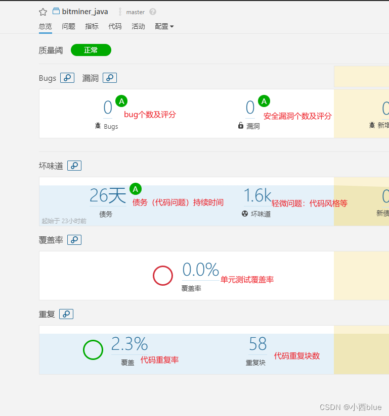
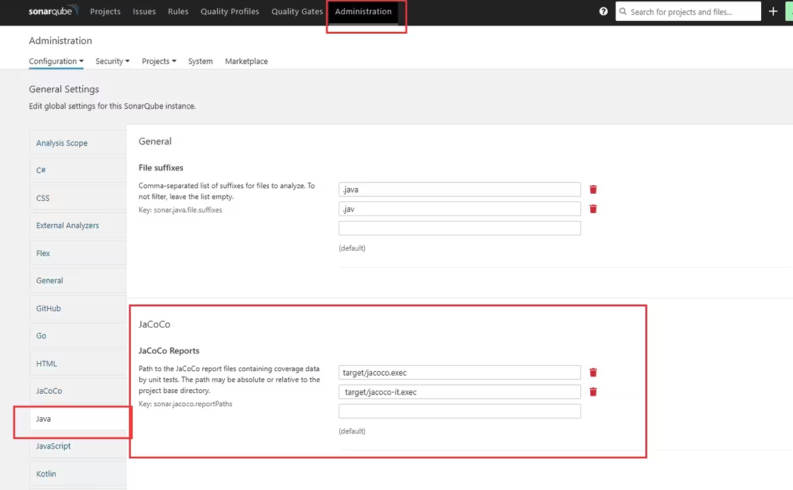

SonarQube

文章链接：https://www.bilibili.com/read/cv27631019/

# 界面介绍

## bugs

指的是代码中的一些错误或缺陷，这些错误可能会导致程序在运行时产生意外的行为或不正确的结果。

典型的 bug 包括空指针引用、未处理的异常、逻辑错误、算法错误等。这些问题可能导致应用程序崩溃、产生错误的结果或安全漏洞等。

## 漏洞

指的是代码中存在的安全漏洞或安全风险，这些漏洞可能会导致系统受到攻击或泄露敏感信息。

典型的漏洞包括 SQL 注入、跨站脚本攻击（XSS）、不安全的数据验证、身份验证漏洞等。

这些问题可能会导致系统受到攻击、数据泄露或用户身份盗用等安全风险。

## 债务（Technical Debt）

债务是指由于某些原因而产生的技术上的负担或缺陷。每一个问题，sonar都会计算出更改这个问题需要花费的时间。通过相加这些时间得出一个总的值称为债务

技术债务：https://blog.csdn.net/weixin_44025411/article/details/122815312

## 坏味道（Code Smells）

坏味道是指代码中存在的不良编程实践或不合理的代码设计，尽管它们不一定是错误，但可能导致代码难以理解、扩展、维护或出现潜在的 bug。这些问题通常包括重复代码、过度复杂的函数或类、不恰当的命名、长方法或函数、过度耦合的组件等。

## 覆盖率（Coverage）

代码覆盖率是一种衡量测试用例对代码的覆盖程度的指标。衡量了测试用例成功运行了代码的哪些部分，并计算出覆盖率百分比。

代码覆盖率可以分为不同的类型，如语句覆盖率、分支覆盖率、条件覆盖率等，描述了不同层次和类型的代码覆盖情况。

官方描述地址：https://docs.sonarsource.com/sonarqube/8.9/analyzing-source-code/test-coverage-and-execution/

SonarQube doesn't run your tests or generate reports. It only imports pre-generated reports.  —— 官方描述

粗糙的译文：SonarQube 不会运行您的测试或生成报告。仅导入预先生成的报告。

如果是 Java 语言，则要用 JaCoCo 生成代码测试覆盖率文件（jacoco.exec）。

在 sonar 的 Administration 页面这里，可以配置 `jacoco.exec` 文件的路径（相对于项目路径）。

## 单元测试数（Number of Unit Tests）

单元测试数是指项目中编写的单元测试的数量。单元测试是针对软件中最小的可测试单元（通常是函数、方法或类）进行的测试。

单元测试的数量通常被视为项目中测试质量和覆盖程度的一个指标，因为更多的单元测试意味着更多的代码路径被覆盖，有助于更全面地测试代码的逻辑和功能。

## 重复行（Duplicate Lines）：

重复行指的是代码文件中完全相同的连续行。这意味着在同一个文件中出现了相同的代码片段，可能是因为复制粘贴或者误操作导致的。

重复行通常在同一个文件中发现，并且它们通常具有相同的语法结构和功能逻辑。

解决重复行通常意味着合并这些行或者将它们提取为可重用的函数或方法，以减少代码冗余并提高可维护性。

## 重复块（Duplicate Blocks）：

重复块指的是在一个文件或多个文件中找到的相似但不完全相同的代码片段。这些代码块可能包含相同的逻辑结构，但其中的细节或变量名称可能略有不同。

重复块通常涉及更大范围的代码，并且通常表示存在设计上的重复或功能上的重复。

解决重复块的方法可能涉及将这些重复的逻辑提取为单独的函数、类或模块，以便代码可以被更好地重用，并且在需要修改时只需要修改一个地方。

重复行和重复块区别：重复行是完全相同的代码行，而重复块是相似但不完全相同的代码片段。

# 一级菜单

## 项目（Project）

在 SonarQube 中，项目是指要进行代码质量分析和监控的特定代码库或代码组。

每个项目都有一个唯一的标识符和项目名称，并且可以配置一系列的静态代码分析规则和设置。

以下是 SonarQube 中项目的一些重要概念：

1. **项目标识符（Project Key）**：

   项目标识符是每个项目的唯一标识符，用于在 SonarQube 中唯一标识一个项目。

   项目标识符通常是项目名称的缩写或简称。

2. **项目名称（Project Name）**：

   项目名称是对项目的简要描述或名称。

   用于在 SonarQube 中标识和显示项目，以便用户更容易地识别和管理项目。

3. **项目配置（Project Configuration）**：

   项目配置包括项目的静态代码分析规则、质量门标准、代码度量、分析设置等。

   可以根据项目的需求和特点配置不同的规则和设置。

4. **静态代码分析（Static Code Analysis）**：

   SonarQube 使用静态代码分析技术来分析项目的源代码，检测其中的问题和缺陷，并生成代码质量报告。

   通过静态代码分析，可以发现代码中的错误、漏洞、坏味道等问题，并提供改进建议。

5. **项目概览（Project Overview）**：

   项目概览页面提供了关于项目的总体信息和指标，包括代码质量指标、问题统计、技术债务、代码覆盖率等。

   这个页面让您可以快速了解项目的整体状态。

6. **质量门标准（Quality Gates）**：

   质量门标准是一组定义了项目质量阈值的规则集合。

   当项目的代码质量达到或超过这些阈值时，质量门标准视为通过，否则视为失败。

   这有助于团队确定项目是否符合预期的质量标准。

7. **历史记录（History）**：

   历史记录页面提供了项目分析结果的历史记录和趋势。

   可以在这里查看各种分析指标的变化趋势，并比较不同时间段的代码质量。

## 问题（Issues）

在 SonarQube 中，问题页面用于展示项目代码中的各种问题和缺陷。

这些问题可能包括代码错误、漏洞、代码坏味道等，会影响代码的质量、可维护性和安全性。

在问题页面中，会看到一系列问题条目，每个问题条目都包含了一条具体的问题信息。

以下是问题页面中常见的字段及其含义：

1. **验证性（Severity）**：

   表示问题的严重程度。

   常见的级别包括“Blocker”（阻塞）、“Critical”（严重）、“Major”（重要）、“Minor”（次要）和“Info”（信息）等。

   这有助于开发人员快速了解问题的严重程度。

2. **处理方式（Type）**：

   表示问题的类型，例如“Bug”（错误）、“Vulnerability”（漏洞）、“Code Smell”（坏味道）等。

   这有助于开发人员更好地理解问题的性质。

3. **状态（Status）**：

   表示问题的处理状态，如“Open”（打开）、“Confirmed”（已确认）、“Resolved”（已解决）和“Closed”（已关闭）等。

   这有助于跟踪问题的处理进度。

4. **新问题（New Issues）**：

   显示最近一次代码分析中发现的新问题的数量。这有助于团队了解代码的质量趋势，并及时采取行动来解决问题。

5. **规则（Rule）**：

   表示与问题相关联的 SonarQube 规则的名称或标识符。

   每个问题都与一个特定的规则相关联，该规则描述了问题的原因和如何解决。

6. **标签（Tags）**：

   用户自定义的标识，用于将问题分类或分组。可以为问题添加一个或多个标签，以便更好地组织和管理问题。

7. **项目（Project）**：

   表示问题所属的项目或代码库。在多项目环境中，可以从问题页面中筛选出特定项目的问题。

8. **负责人（Assignee）**：

   表示负责解决问题的开发人员。可以将问题分配给特定的团队成员，以便他们负责解决问题。

9. **作者（Author）**：

   表示与问题相关联的代码的作者。这有助于了解哪些开发人员负责引入了特定的问题。

10. **语言（Language）**：

    表示问题所涉及的编程语言。SonarQube 支持多种编程语言，包括 Java、JavaScript、C#、Python、C/C++ 等。这有助于开发人员确定问题的上下文和范围。

## 代码规则（Code Rules）

代码规则是用于静态代码分析的重要组成部分。

这些规则定义了代码应该符合的标准，帮助开发团队识别代码中的问题、缺陷和潜在风险。

SonarQube 对规则分类的维度如下：

- 编程语言：Java、Javascript、C# 等；
- 类型：Bug、漏洞、坏味道对其分类；
- 标签：eslint、correctness、cert等；
- 资源库：FindBugs  Java、SonarAnalyzer Java 等；
- 严重性分类：阻断、严重、主要、次要、提示；
- 状态分类：装备、废弃、Beta；
- 有效起始期分类；
- 模版：只显示模版、隐藏模版；
- 质量配置：FindBugs Java（内置）、Sonar way C#（内置）等；

以下是 SonarQube 中代码规则的一些重要信息：

1. **规则分类（Rule Categories）**：

   SonarQube 的代码规则被组织成不同的分类，以便开发团队更好地组织和浏览规则。

   常见的规则分类包括 Bug（错误）、Vulnerability（漏洞）、Code Smell（代码坏味道）、Security（安全）等。

2. **规则描述（Rule Description）**：

   每个代码规则都有一个描述，描述了规则的目的、检测的问题类型、规则的严重程度等。

   规则描述通常包含了示例代码和解释，帮助开发人员理解规则的含义和如何解决问题。

3. **规则严重程度（Rule Severity）**：

   代码规则通常根据问题的严重程度划分为不同的级别。

   例如“Blocker”（阻断）、“Critical”（严重）、“Major”（重要）、“Minor”（次要）和“Info”（信息）等。

   这有助于开发人员快速了解问题的紧急程度。

4. **规则标识符（Rule Key）**：

   每个代码规则都有一个唯一的标识符，通常称为规则键（Rule Key）。

   规则键是规则的唯一标识，可用于在 SonarQube 中引用和检索规则。

5. **启用/禁用规则（Rule Activation）**：

   在 SonarQube 中，您可以根据项目的需求和偏好启用或禁用特定的代码规则。

   这使得开发团队能够自定义规则集合，以满足特定的项目要求和标准。

6. **自定义规则（Custom Rules）**：

   SonarQube 还允许用户创建自定义代码规则，以满足特定项目或组织的需求。

   通过自定义规则，团队可以定义自己的代码标准和最佳实践，并将规则集成到静态代码分析中。

## 质量配置（Quality Profiles）

质量配置是用于定义项目或代码库的代码质量标准和规则集合的重要组件。

允许团队定义和管理代码分析所应用的规则、规则的严重程度以及其他配置选项。

以下是 SonarQube 中质量配置的一些重要信息：

1. **质量配置名称（Quality Profile Name）**：

   每个质量配置都有一个名称，用于标识和描述配置的目的。名称应该清晰明确，反映出配置所适用的场景或目标。

2. **质量配置规则集合（Quality Profile Rules）**：

   质量配置包含了一组代码规则，定义了代码质量标准和应用于项目的检测规则。

   这些规则集合根据项目的需要和要求进行定制，并根据问题的严重程度划分为不同的级别。

3. **质量配置严重程度（Quality Profile Severity）**：

   每个质量配置规则都有一个严重程度，表示问题的重要性或紧急程度。

   常见的严重程度包括“Blocker”（阻断）、“Critical”（严重）、“Major”（重要）、“Minor”（次要）和“Info”（信息）等。

4. **质量配置继承（Quality Profile Inheritance）**：

   质量配置可以通过继承机制实现重用和扩展。

   项目可以继承一个父级质量配置，并在其基础上添加、删除或修改规则，从而定制自己的质量配置。

5. **质量配置管理（Quality Profile Management）**：

   SonarQube 提供了丰富的工具和界面，用于管理质量配置。

   可以创建新的质量配置、复制现有的配置、导入/导出配置、编辑规则集合等。

6. **默认质量配置（Default Quality Profiles）**：

   SonarQube 允许您为每种支持的编程语言定义默认的质量配置。

   默认配置用于新项目或未明确指定质量配置的项目。

## 质量阀（Quality Gates）

是一系列对项目指标度量的条件，项目必须达到所有条件整体上通过了质量阀。

质量阀是一组定义了项目代码质量标准的规则集合。

用于评估项目代码是否符合预期的质量要求，并在达到或超过阈值时决定是否接受项目的提交。

以下是 SonarQube 中质量阀的一些重要信息：

1. **质量阀规则集合（Quality Gate Rules）**：

   质量阀包含了一组代码质量规则，这些规则定义了项目代码应该符合的标准。

   规则可以涵盖代码质量、安全性、可维护性等方面的要求。

2. **质量阀条件（Quality Gate Conditions）**：

   质量阀规则通常会定义一些条件，例如代码覆盖率、代码复杂度、问题数量等。

   这些条件用于评估项目代码的质量，并根据达到或超过阈值来判断代码是否通过质量阀。

3. **质量阀状态（Quality Gate Status）**：

   当项目的代码符合质量阀的所有条件时，质量阀的状态为“通过”。

   如果项目的代码未能满足其中一个或多个条件，则质量阀的状态为“失败”。

4. **质量阀结果（Quality Gate Result）**：

   质量阀评估结果会反映在代码提交或构建过程中。

   如果代码通过了质量阀的评估，则允许提交或构建继续进行；否则，可能会阻止提交或构建的进程，并提醒开发团队解决问题。

5. **质量阀管理（Quality Gate Management）**：

   SonarQube 提供了管理质量阀的界面，允许用户定义和配置质量阀。

   可以创建新的质量阀、编辑现有的阀、定义阀的条件等。

6. **默认质量阀（Default Quality Gates）**：

   SonarQube 允许您为每个项目定义默认的质量阀。

   默认阀通常是一组推荐的质量标准，用于评估项目代码的质量。

比如：

Bugs 要等于零

代码覆盖率 大于等于零

单元测试成功 等于100%

漏洞 等于零

