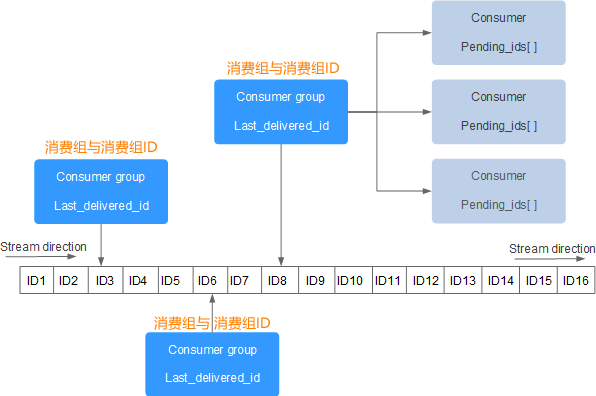

# 简介

[官网链接](https://redis.io)

[C语言中文网-Redis教程](http://c.biancheng.net/redis/bloom-filter.html)

[菜鸟网络-Redis教程](https://www.runoob.com/redis/redis-tutorial.html)


Redis 诞生于2009年，英文 Remote Dicotionary Server 远程词典服务器，是一个基于内存的健值型 NoSQL 数据库。


## 使用场景

一般作为数据缓冲使用，当应用程序试图去读取某个数据的时候，首先会尝试去 redis 里面去加载，如果命中就直接返回，如果没有命中，就从数据库里面去查询。查询到数据后再把这个数据填充到 Redis 里面去。


## 特征说明

- 健值型，支持多种不同数据结构，且有丰富的命令；
- 单线程，是指只用一个线程来处理所有的网络事件请求，这样就避免了多进程或者多线程切换导致的 CPU 消耗，也不用考虑各种锁的问题；
- 低延迟，速度快（基于内存、IO多路复用、良好编码）；
- 支持数据持久化；
- 支持主从集群、分片集群；
- 支持多语言客户端；


## 网络模型

Redis 采用 IO 多路复用模型（是指多个网络连接复用同一个线程）来处理客户端与服务端的连接，这种模型有三种实现方式，分别是 select、poll、epoll。

Redis 采用的是 epoll 的方式：当客户端空闲时，线程处于阻塞状态。当一个或多个 IO 事件触发时（客户端发起网路连接请求），线程就会从阻塞状态唤醒，并同时使用 `epoll` 来轮询触发事件，并依次提交给线程处理。


# NoSQL数据库

NoSQL 是指非结构化、无关联的、非SQL的数据库。


NoSQL 数据库查询语句不同：


## 健值型数据库


## 文档型数据库


## 图类型数据库


#  安装


## Docker 方式

在当前用户根目录下创建二个文件，conf（存放配置文件）、data（持久化文件数据备份目录）

```shell
$ mkdir -p ~/redis/{conf,data}
```

新建 `redis.conf` 文件

```shell
$ cat << EOF > /data/redis/conf/redis.conf
# RDB 持久化，快照保存频率
# 900秒内，如果超过1个key被修改，则发起快照保存
# 300秒内，如果超过10个key被修改，则发起快照保存
# 60秒内，如果1万个key被修改，则发起快照保存
save 900 1
save 300 10
save 60 10000

# 是否启用rdb文件压缩手段，默认为yes
rdbcompression yes

# yes表示在RDB出错后不能进行工作，no表示可以继续进行工作，可以通过info中的rdb_last_bgsave_status了解RDB持久化是否有错误
stop-writes-on-bgsave-error no

# 开启 AOF 持久化
appendonly yes

# 开启密码
requirepass root
EOF
```

下载的 redis 镜像

```shell
$ docker pull redis
Using default tag: latest
latest: Pulling from library/redis
5731adb3a4ab: Pull complete 
e78ad00da4bd: Pull complete 
acf81d284940: Pull complete 
c19f7ed7779d: Pull complete 
9df49c3f82f2: Pull complete 
cf4fe2915070: Pull complete 
Digest: sha256:6a59f1cbb8d28ac484176d52c473494859a512ddba3ea62a547258cf16c9b3ae
Status: Downloaded newer image for redis:latest
docker.io/library/redis:latest
```

启动容器，这时候就跟新安装 redis 采用默认配置启动一样，没有连接密码，默认端口 6379（确保本机 6379 端口没有被占用）。

```shell
$ docker run -d --name redis -p 6379:6379 \
-v ~/redis/conf/redis.conf:/redis.conf \
-v ~/redis/data:/data redis \
redis-server /redis.conf
```

- **-d：** 后台运行容器；
- **-name：** 容器命名；
- **-p：** 端口映射，`redis` 默认端口 `6379`；
- **-v：** 挂载目录；
- **redis-server /redis.conf：** 通过 `redis-server` 命令，启动我们自己挂载的配置文件，否则会使用默认的配置文件；

通过 redis-cli 连接测试使用 redis 服务

```shell
$ docker exec -it redis /bin/bash
```

启动 redis-cli 客户端

```shell
$ redis-cli
```

登陆 redis-cli 时，需要使用密码（因为在 redis.conf 配置文件中已设置了密码）

```shell
$ auth root
```

测试

```shell
$ set name lvzhaojun
$ get name
```

设置开机自启动 redis

```shell
$ docker update redis --restart=always
```

跟踪日志

```shell
$ docker logs -f -t --tail 100 redis
```


# 命令


## 常用命令

### Auth

命令用于检测给定的密码和配置文件中的密码是否相符。

```shell
$ AUTH PASSWORD
```


### Echo

命令用于打印给定的字符串。

```shell
$ ECHO message
```


### Ping

命令使用客户端向 Redis 服务器发送一个 PING ，如果服务器运作正常的话，会返回一个 PONG 。

通常用于测试与服务器的连接是否仍然生效，或者用于测量延迟值。

```shell
$ PING
```


### Quit

命令用于关闭与当前客户端与redis服务的连接。

一旦所有等待中的回复(如果有的话)顺利写入到客户端，连接就会被关闭。

```shell
$ QUIT
```


### Select

命令用于切换到指定的数据库，数据库索引号 index 用数字值指定，以 0 作为起始索引值。

```shell
$ SELECT index
```


## 客户端

### CLIENT LIST

以列表的形式返回所有连接到 Redis 服务器的客户端。

```shell
$ CLIENT LIST
```


### CLIENT SETNAME

设置当前连接的名称

```shell
$ CLIENT SETNAME connection-name	
```


### CLIENT GETNAME

获取通过 CLIENT SETNAME 命令设置的服务名称。

```shell
$ CLIENT GETNAME
```


### CLIENT PAUSE

挂起客户端连接，将所有客户端挂起指定的时间（以毫秒为计算）。

```shell
$ CLIENT PAUSE timeout
```


### CLIENT KILL

关闭客户端连接。

```shell
$ CLIENT KILL [ip：port] [ID client-id]
```


### CLIENT ID

返回当前客户端 ID。

```shell
$ CLIENT ID
```


### CLIENT REPLY

控制发送到当前连接的回复。

```shell
$ CLIENT REPLY <on|off|skip>
```


## 服务器

### BGREWRITEAOF

在后台以异步的方式执行一个 AOF 文件的重写操作，对源文件进行压缩，使其体积变小。
AOF 是实现数据持久化存储的方式之一。

```shell
$ BGREWRITEAOF
```


### BGSAVE

在后台执行初始化操作，并以异步的方式将当前数据库的数据保存到磁盘中。

```shell
$ BGSAVE
```


### COMMAND

返回所有 Redis 命令的详细描述信息。

```shell
$ COMMAND
```


### COMMAND COUNT

此命令用于获取 Redis 命令的总数。

```shell
$ COMMAND COUNT
```


### COMMAND GETKEYS

获取指定命令的所有键。

```shell
$ COMMAND GETKEYS
```


### INFO

获取 Redis 服务器的各种信息和统计数值。

```shell
$ INFO [section]
```


### COMMAND INFO

用于获取指定 Redis 命令的描述信息。

```shell
$ COMMAND INFO command-name [command-name ...]	
```


### CONFIG GET

获取指定配置参数的值。

```shell
$ CONFIG GET parameter
```


### CONFIG REWRITE

修改启动 Redis 服务器时所指定的 redis.conf 配置文件。

```shell
$ CONFIG REWRITE
```


### CONFIG SET

修改 Redis 配置参数，无需重启。

```shell
$ CONFIG SET parameter value
```


### CONFIG RESETSTAT

重置 INFO 命令中的某些统计数据。

```shell
$ CONFIG RESETSTAT
```


### DBSIZE

返回当前数据库中 key 的数量。

```shell
$ DBSIZE
```


### DEBUG OBJECT

获取 key 的调试信息。当 key 存在时，返回有关信息；当 key 不存在时，返回一个错误。

```shell
$ DEBUG OBJECT key
```


### DEBUG SEGFAULT

使用此命令可以让服务器崩溃。

```shell
$ DEBUG SEGFAULT
```


### FLUSHALL

清空数据库中的所有键。

```shell
$ FLUSHALL
```


### FLUSHDB

用于清空当前数据库的命令。

会删除当前选定的数据库中的所有键和对应的值，从而将数据库清空。

```shell
$ FLUSHDB
```


### LASTSAVE

返回最近一次 Redis 成功将数据保存到磁盘上的时间，以 UNIX 格式表示。

```shell
$ LASTSAVE
```


### MONITOR

实时打印出 Redis 服务器接收到的命令。

```shell
$ MONITOR
```


### ROLE

查看主从实例所属的角色，角色包括三种，分别是 master、slave、sentinel。

```shell
$ ROLE
```


### SAVE

执行数据同步操作，将 Redis 数据库中的所有数据以 RDB 文件的形式保存到磁盘中。
RDB 是 Redis 中的一种数据持久化方式。

```shell
$ SAVE
```


### SHUTDOWN

将数据同步到磁盘后，然后关闭服务器。

```shell
$ SHUTDOWN [NOSAVE] [SAVE]
```


### SLAVEOF

此命令用于设置主从服务器，使当前服务器转变成为指定服务器的从属服务器，或者将其提升为主服务器(执行 SLAVEOF NO ONE 命令)。

```shell
$ SLAVEOF host port
```


### SLOWLOG

用来记录查询执行时间的日志系统。

```shell
$ SLOWLOG subcommand [argument]	
```


### SYNC

用于同步主从服务器。

```shell
$ SYNC
```


### SWAPDB

用于交换同一 Redis 服务器上的两个数据库，可以实现访问其中一个数据库的客户端连接，也可以立即访问另外一个数据库的数据。

```shell
$ SWAPDB index index
```


### TIME

此命令用于返回当前服务器时间。

```shell
$ TIME
```


## 指令安全

有一些非常危险的命令，会对 Redis 的稳定以及数据安全造成非常严重的影响。比如 keys 指令会导致 Redis 卡顿，而 flushdb 和 flushall 会让 Redis 的所有数据全部清空。可以使用 rename-command 命令将某些危险的指令修改成特别的名称，用来避免人为误操作。

```ini
$ rename-command keys 123keys123
```

如果还想执行 keys 命令，那就需要在命令行输入123keys123。也可以将危险的命令重命名成空字符串，这样就无法执行这些危险的命令了。

```ini
$ rename-command flushall ""
```


# 数据类型

## string

字符串是一组字节，在 Redis 数据库中，字符串具有二进制安全（binary safe）特性，这意味着它的长度是已知的，不由任何其他终止字符决定的，一个字符串类型的值最多能够存储 512 MB 的内容。

```shell
$ set name "lvzhaojun"
$ get name
```


### SET 命令

用于设置给定 key 的值。如果 key 已经存储其他值， SET 就覆写旧值，且无视类型。

```shell
$ SET KEY_NAME VALUE
```


### Get 命令

用于获取指定 key 的值。如果 key 不存在，返回 nil 。如果key 储存的值不是字符串类型，返回一个错误。

```shell
$ GET KEY_NAME
```


### Getrange 命令

用于获取存储在指定 key 中字符串的子字符串。字符串的截取范围由 start 和 end 两个偏移量决定(包括 start 和 end 在内)。

```shell
$ GETRANGE KEY_NAME start end
```


### Getset 命令

用于设置指定 key 的值，并返回 key 的旧值。

```shell
$ GETSET KEY_NAME VALUE
```


### Getbit 命令

用于对 key 所储存的字符串值，获取指定偏移量上的位(bit)。

```shell
$ GETBIT KEY_NAME OFFSET
```


### Mget 命令

返回所有(一个或多个)给定 key 的值。 如果给定的 key 里面，有某个 key 不存在，那么这个 key 返回特殊值 nil 。

```shell
$ MGET KEY1 KEY2 .. KEYN
```


### Setbit 命令

用于对 key 所储存的字符串值，设置或清除指定偏移量上的位(bit)。

```shell
$ Setbit KEY_NAME OFFSET
```


### Setex 命令

为指定的 key 设置值及其过期时间。如果 key 已经存在， SETEX 命令将会替换旧的值。

```shell
$ SETEX KEY_NAME TIMEOUT VALUE
```


### Setnx 命令

**SET** if **N**ot e**X**ists，在指定的 key 不存在时，为 key 设置指定的值。

```shell
$ SETNX KEY_NAME VALUE
```


### Setrange 命令

用指定的字符串覆盖给定 key 所储存的字符串值，覆盖的位置从偏移量 offset 开始。

```shell
$ SETRANGE KEY_NAME OFFSET VALUE
```


### Strlen 命令

用于获取指定 key 所储存的字符串值的长度。当 key 储存的不是字符串值时，返回一个错误。

```shell
$ STRLEN KEY_NAME
```


### Mset 命令

用于同时设置一个或多个 key-value 对。

```shell
$ MSET key1 value1 key2 value2 .. keyN valueN
```


### Msetnx 命令

用于所有给定 key 都不存在时，同时设置一个或多个 key-value 对。

```shell
$ MSETNX key1 value1 key2 value2 .. keyN valueN
```


### Psetex 命令

以毫秒为单位设置 key 的生存时间。

```shell
$ PSETEX key1 EXPIRY_IN_MILLISECONDS value1
```


### Incr 命令

将 key 中储存的数字值增一。

如果 key 不存在，那么 key 的值会先被初始化为 0 ，然后再执行 INCR 操作。

如果值包含错误的类型，或字符串类型的值不能表示为数字，那么返回一个错误。

本操作的值限制在 64 位(bit)有符号数字表示之内。

```shell
$ INCR KEY_NAME
```


### Incrby 命令

将 key 中储存的数字加上指定的增量值。

如果 key 不存在，那么 key 的值会先被初始化为 0 ，然后再执行 INCRBY 命令。

如果值包含错误的类型，或字符串类型的值不能表示为数字，那么返回一个错误。

本操作的值限制在 64 位(bit)有符号数字表示之内。

```shell
$ INCRBY KEY_NAME INCR_AMOUNT
```


### Incrbyfloat 命令

为 key 中所储存的值加上指定的浮点数增量值。

如果 key 不存在，那么 INCRBYFLOAT 会先将 key 的值设为 0 ，再执行加法操作。

```shell
$ INCRBYFLOAT KEY_NAME INCR_AMOUNT
```


### Decr 命令

将 key 中储存的数字值减一。

如果 key 不存在，那么 key 的值会先被初始化为 0 ，然后再执行 DECR 操作。

如果值包含错误的类型，或字符串类型的值不能表示为数字，那么返回一个错误。

本操作的值限制在 64 位(bit)有符号数字表示之内。

```shell
$ DECR KEY_NAME
```


### Decrby 命令

将 key 所储存的值减去指定的减量值。

如果 key 不存在，那么 key 的值会先被初始化为 0 ，然后再执行 DECRBY 操作。

如果值包含错误的类型，或字符串类型的值不能表示为数字，那么返回一个错误。

本操作的值限制在 64 位(bit)有符号数字表示之内。

```shell
$ DECRBY KEY_NAME DECREMENT_AMOUNT
```


### Append 命令

用于为指定的 key 追加值。

如果 key 已经存在并且是一个字符串， APPEND 命令将 value 追加到 key 原来的值的末尾。

如果 key 不存在， APPEND 就简单地将给定 key 设为 value ，就像执行 SET key value 一样。

```shell
$ APPEND KEY_NAME NEW_VALUE
```


## hash（散列）

是一个 string 类型的 field 和 value 的映射表，hash 特别适合用于存储对象，一个 Hash 中最多包含 2^32-1 个键值对。


### HMSET 命令

创建 hash 对象并保存健值对信息：

```shell
$ HMSET KEY_NAME FIELD_NAME value1 FIELD_NAME1 value2 FIELD_NAME2 value3
```


### HGET 命令

返回 hash 对象中的健值信息：

```shell
$ HGET KEY_NAME FIELD_NAME
```


### HSET 命令

用于为哈希表中的字段赋值

```shell
$ HSET KEY_NAME FIELD_NAME VALUE
```


### HGETALL 命令

查看 hash 对象中的所有健值对信息：

```shell
$ HGETALL userid:1
```


### HDEL 命令

删除 hash 中的健值对

```shell
$ HDEL KEY_NAME FIELD1.. FIELDN
```


### HEXISTS 命令

查看哈希表的指定字段是否存在

```shell
$ HEXISTS KEY_NAME FIELD_NAME
```


### HINCRBY 命令

用于为哈希表中的字段值加上指定增量值，增量也可以为负数：

```shell
$ HINCRBY KEY_NAME FIELD_NAME INCR_BY_NUMBER 
```


### HINCRBYFLOAT 命令

用于为哈希表中的字段值加上指定浮点数增量值：

```shell
$ HINCRBYFLOAT key field increment
```


### HKEYS 命令

用于获取哈希表中的所有字段名（FIELD_NAME）

```shell
$ HKEYS key
```


### HLEN 命令

获取哈希表中字段（FIELD_NAME）的数量

```shell
$ HLEN KEY_NAME
```


### HSETNX 命令

用于为哈希表中不存在的的字段赋值

如果哈希表不存在，一个新的哈希表被创建并进行 HSET 操作。

如果字段已经存在于哈希表中，操作无效。

如果 key 不存在，一个新哈希表被创建并执行 HSETNX 命令。

```shell
$ HSETNX KEY_NAME FIELD VALUE
```


### HVALS 命令

返回哈希表所有的值

```shell
$ HVALS KEY_NAME
```


### HSCAN 命令

用于迭代哈希表中的键值对

```shell
$ HSCAN KEY_NAME cursor [MATCH pattern] [COUNT count]
```


## list（列表）

是简单的字符串列表，按照插入顺序排序。可以添加一个元素到列表的头部（左边）或者尾部（右边）。

列表最多可存储 2^32^ - 1 元素（4294967295, 每个列表可存储40多亿）。

### lpush 命令

创建list对象，并添加元素

```shell
$ lpush tlist element
```


### LRANGE 命令

打印显示list集合中的元素

```shell
$ LRANGE tlist 0 2
```


### BLPOP 命令

移出并获取列表的第一个元素， 如果列表没有元素会阻塞列表直到等待超时或发现可弹出元素为止。

```shell
$ BLPOP LIST1 LIST2 .. LISTN TIMEOUT
```


### BRPOPLPUSH 命令

从列表中取出最后一个元素，并插入到另外一个列表的头部； 如果列表没有元素会阻塞列表直到等待超时或发现可弹出元素为止。

```shell
$ BRPOPLPUSH LIST1 ANOTHER_LIST TIMEOUT
```


### LINDEX 命令

通过索引获取列表中的元素。你也可以使用负数下标，以 -1 表示列表的最后一个元素， -2 表示列表的倒数第二个元素，以此类推。

```shell
$ LINDEX KEY_NAME INDEX_POSITION
```


### LINSERT 命令

用于在列表的元素前或者后插入元素。当指定元素不存在于列表中时，不执行任何操作

```shell
$ LINSERT KEY_NAME BEFORE|AFTER pivot value
```


### LLEN 命令

用于返回列表的长度。如果列表 key 不存在，则 key 被解释为一个空列表，返回 0。如果 key 不是列表类型，返回一个错误。

```shell
$ LLEN KEY_NAME
```


### Lpop 命令

用于移除并返回列表的第一个元素。

```shell
$ Lpop KEY_NAME
```


### LPUSH 命令

将一个或多个值插入到列表头部。 如果 key 不存在，一个空列表会被创建并执行 LPUSH 操作。 当 key 存在但不是列表类型时，返回一个错误。

```shell
$ LPUSH KEY_NAME VALUE1.. VALUEN
```


### LPUSHX 命令

将一个值插入到已存在的列表头部，列表不存在的时操作无效。

```shell
$ LPUSHX KEY_NAME VALUE1.. VALUEN
```


### LRANGE 命令

返回列表中指定区间内的元素，区间以偏移量 START 和 END 指定。 其中 0 表示列表的第一个元素，1 表示列表的第二个元素，以此类推。 你也可以使用负数下标，以 -1 表示列表的最后一个元素，-2 表示列表的倒数第二个元素，以此类推。

```shell
$ LRANGE KEY_NAME START END
```


### LREM 命令

根据参数 count 的值，移除列表中与参数 VALUE 相等的元素。

count 的值可以是以下几种：

- count > 0 : 从表头开始向表尾搜索，移除与 VALUE 相等的元素，数量为 count；
- count < 0 : 从表尾开始向表头搜索，移除与 VALUE 相等的元素，数量为 count 的绝对值；
- count = 0 : 移除表中所有与 VALUE 相等的值；

```shell
$ LREM key count VALUE
```


### LSET 命令

通过索引来设置元素的值

```shell
$ LSET KEY_NAME INDEX VALUE
```


### Rpop 命令

用于移除列表的最后一个元素，返回值为移除的元素

```shell
$ RPOP KEY_NAME
```


### Rpoplpush 命令

用于移除列表的最后一个元素，并将该元素添加到另一个列表并返回

```shell
$ RPOPLPUSH SOURCE_KEY_NAME DESTINATION_KEY_NAME
```


### Rpush 命令

用于将一个或多个值插入到列表的尾部(最右边)，如果列表不存在，一个空列表会被创建并执行 RPUSH 操作。 当列表存在但不是列表类型时，返回一个错误。

```shell
$ RPUSH KEY_NAME VALUE1..VALUEN
```


### Rpushx 命令

用于将一个值插入到已存在的列表尾部(最右边)。如果列表不存在，操作无效

```shell
$ RPUSHX KEY_NAME VALUE1..VALUEN
```


## set

Set 是 String 类型的无序集合。集合成员是唯一的，这就意味着集合中不能出现重复的数据。

集合对象的编码可以是 intset 或者 hashtable。

集合是通过哈希表实现的，所以添加，删除，查找的复杂度都是 O(1)。

集合中最大的成员数为 2^32^ - 1 (4294967295, 每个集合可存储40多亿个成员)。


### Sadd 命令

将一个或多个成员元素加入到集合中，已经存在于集合的成员元素将被忽略。

```shell
$ SADD KEY_NAME VALUE1..VALUEN
```


### Scard 命令

返回集合中元素的数量

```shell
$ SCARD KEY_NAME
```


### Sdiff 命令

返回第一个集合与其他集合之间的差异，也可以认为说第一个集合中独有的元素。不存在的集合 key 将视为空集。

差集的结果来自前面的 FIRST_KEY ,而不是后面的 OTHER_KEY1，也不是整个 FIRST_KEY OTHER_KEY1..OTHER_KEYN 的差集。

```shell
$ SDIFF FIRST_KEY OTHER_KEY1..OTHER_KEYN
```


### Sdiffstore 命令

将给定集合之间的差集存储在指定的集合中，如果指定的集合 key 已存在，则会被覆盖。

```shell
$ SDIFFSTORE DESTINATION_KEY KEY1..KEYN
```


### Sinter 命令

返回给定所有给定集合的交集，不存在的集合 key 被视为空集。当给定集合当中有一个空集时，结果也为空集(根据集合运算定律)。

```shell
$ SINTER KEY KEY1..KEYN
```


### Sinterstore 命令

将给定集合之间的交集存储在指定的集合中，如果指定的集合已经存在，则将其覆盖。

```shell
$ SINTERSTORE DESTINATION_KEY KEY KEY1..KEYN
```


### Sismember 命令

判断成员元素是否是集合的成员。

```shell
$ SISMEMBER KEY VALUE
```


### Smembers 命令

返回集合中的所有的成员。 不存在的集合 key 被视为空集合。

```shell
$ SMEMBERS key
```


### Smove 命令

将指定成员 member 元素从 source 集合移动到 destination 集合。


### SMOVE 命令

是原子性操作，如果 source 集合不存在或不包含指定的 member 元素，则 SMOVE 命令不执行任何操作，仅返回 0 。否则， member 元素从 source 集合中被移除，并添加到 destination 集合中去。

当 destination 集合已经包含 member 元素时， SMOVE 命令只是简单地将 source 集合中的 member 元素删除。当 source 或 destination 不是集合类型时，返回一个错误。

```shell
$ SMOVE SOURCE DESTINATION MEMBER
```


### Spop 命令

用于移除集合中的指定 key 的一个或多个随机元素，移除后会返回移除的元素。

```shell
$ SPOP key [count]
```


### Srandmember 命令

用于返回集合中的一个随机元素。

从 Redis 2.6 版本开始， Srandmember 命令接受可选的 count 参数：

- 如果 count 为正数，且小于集合基数，那么命令返回一个包含 count 个元素的数组，数组中的元素各不相同。如果 count 大于等于集合基数，那么返回整个集合。
- 如果 count 为负数，那么命令返回一个数组，数组中的元素可能会重复出现多次，而数组的长度为 count 的绝对值。

该操作和 SPOP 相似，但 SPOP 将随机元素从集合中移除并返回，而 Srandmember 则仅仅返回随机元素，而不对集合进行任何改动。

```shell
$ SRANDMEMBER KEY [count]
```


### Srem 命令

用于移除集合中的一个或多个成员元素，不存在的成员元素会被忽略。

当 key 不是集合类型，返回一个错误。

在 Redis 2.4 版本以前， SREM 只接受单个成员值。

```shell
$ SREM KEY MEMBER1..MEMBERN
```


### Sunion 命令

返回给定集合的并集。不存在的集合 key 被视为空集。

```shell
$ SUNION KEY KEY1..KEYN
```


### Sunionstore 命令

将给定集合的并集存储在指定的集合 destination 中。如果 destination 已经存在，则将其覆盖。

```shell
$ SUNIONSTORE destination key [key ...]
```


### Sscan 命令

用于迭代集合中键的元素，Sscan 继承自 Scan。

- cursor - 游标；
- pattern - 匹配的模式；
- count - 指定从数据集里返回多少元素，默认值为 10；

```shell
$ SSCAN key cursor [MATCH pattern] [COUNT count]
```


## zset

有序集合和集合一样也是 string 类型元素的集合，且不允许重复的成员。

不同的是每个元素都会关联一个 double 类型的分数。redis 正是通过分数来为集合中的成员进行从小到大的排序。

有序集合的成员是唯一的，但分数（score）却可以重复。

集合是通过哈希表实现的，所以添加，删除，查找的复杂度都是 O(1)。 集合中最大的成员数为 2^32^ - 1 (4294967295, 每个集合可存储40多亿个成员)。


### Zadd 命令

用于将一个或多个成员元素及其分数值加入到有序集当中。

如果某个成员已经是有序集的成员，那么更新这个成员的分数值，并通过重新插入这个成员元素，来保证该成员在正确的位置上。

分数值可以是整数值或双精度浮点数。

如果有序集合 key 不存在，则创建一个空的有序集并执行 ZADD 操作。

当 key 存在但不是有序集类型时，返回一个错误。

**注意：** 在 Redis 2.4 版本以前， ZADD 每次只能添加一个元素。

```shell
$ ZADD KEY_NAME SCORE1 VALUE1.. SCOREN VALUEN
```


### Zcard 命令

用于计算集合中元素的数量

```shell
$ ZCARD KEY_NAME
```


### Zcount 命令

用于计算有序集合中指定分数区间的成员数量。

```shell
$ ZCOUNT key min max
```


### Zincrby 命令

对有序集合中指定成员的分数加上增量 increment

可以通过传递一个负数值 increment ，让分数减去相应的值，比如 ZINCRBY key -5 member ，就是让 member 的 score 值减去 5 。

当 key 不存在，或分数不是 key 的成员时， ZINCRBY key increment member 等同于 ZADD key increment member 。

当 key 不是有序集类型时，返回一个错误。

分数值可以是整数值或双精度浮点数。

```shell
$ ZINCRBY key increment member
```


### Zinterstore 命令

计算给定的一个或多个有序集的交集，其中给定 key 的数量必须以 numkeys 参数指定，并将该交集(结果集)储存到 destination 。

默认情况下，结果集中某个成员的分数值是所有给定集下该成员分数值之和。

```shell
$ ZINTERSTORE destination numkeys key [key ...] [WEIGHTS weight [weight ...]] [AGGREGATE SUM|MIN|MAX]
```


### Zlexcount 命令

在计算有序集合中指定字典区间内成员数量。

```shell
$ ZLEXCOUNT KEY MIN MAX
```


### Zrange 命令

返回有序集中，指定区间内的成员。

其中成员的位置按分数值递增(从小到大)来排序。

具有相同分数值的成员按字典序(lexicographical order )来排列。

如果你需要成员按

值递减(从大到小)来排列，请使用 [ZREVRANGE](https://www.runoob.com/redis/sorted-sets-zrevrange.html) 命令。

下标参数 start 和 stop 都以 0 为底，也就是说，以 0 表示有序集第一个成员，以 1 表示有序集第二个成员，以此类推。

你也可以使用负数下标，以 -1 表示最后一个成员， -2 表示倒数第二个成员，以此类推。

```shell
$ ZRANGE key start stop [WITHSCORES]
```


### Zrangebylex 命令

通过字典区间返回有序集合的成员。

```shell
$ ZRANGEBYLEX key min max [LIMIT offset count]
```


### Zrangebyscore 命令

返回有序集合中指定分数区间的成员列表。有序集成员按分数值递增(从小到大)次序排列。

具有相同分数值的成员按字典序来排列(该属性是有序集提供的，不需要额外的计算)。

默认情况下，区间的取值使用闭区间 (小于等于或大于等于)，你也可以通过给参数前增加 ( 符号来使用可选的开区间 (小于或大于)。

```shell
$ ZRANGEBYSCORE key min max [WITHSCORES] [LIMIT offset count]
```


### Zrank 命令

返回有序集中指定成员的排名。其中有序集成员按分数值递增(从小到大)顺序排列。

```shell
$ ZRANK key member
```


### Zrem 命令

用于移除有序集中的一个或多个成员，不存在的成员将被忽略。

当 key 存在但不是有序集类型时，返回一个错误。

**注意：** 在 Redis 2.4 版本以前， ZREM 每次只能删除一个元素。

```shell
$ ZREM key member [member ...]
```


### Zremrangebylex 命令

用于移除有序集合中给定的字典区间的所有成员

```shell
$ ZREMRANGEBYLEX key min max
```


### Zremrangebyrank 命令

用于移除有序集中，指定排名(rank)区间内的所有成员

```shell
$ ZREMRANGEBYRANK key start stop
```


### Zremrangebyscore 命令

用于移除有序集中，指定分数（score）区间内的所有成员。

```shell
$ ZREMRANGEBYSCORE key min max
```


### Zrevrange 命令

返回有序集中，指定区间内的成员。

其中成员的位置按分数值递减(从大到小)来排列。

具有相同分数值的成员按字典序的逆序(reverse lexicographical order)排列。

除了成员按分数值递减的次序排列这一点外， ZREVRANGE 命令的其他方面和 ZRANGE 命令一样。

```shell
$ ZREVRANGE key start stop [WITHSCORES]
```


### Zrevrangebyscore 命令

返回有序集中指定分数区间内的所有的成员。有序集成员按分数值递减(从大到小)的次序排列。

具有相同分数值的成员按字典序的逆序(reverse lexicographical order )排列。

除了成员按分数值递减的次序排列这一点外， ZREVRANGEBYSCORE 命令的其他方面和 ZRANGEBYSCORE 命令一样。

```shell
$ ZREVRANGEBYSCORE key max min [WITHSCORES] [LIMIT offset count]
```


### Zrevrank 命令

返回有序集中成员的排名。其中有序集成员按分数值递减(从大到小)排序。

排名以 0 为底，也就是说， 分数值最大的成员排名为 0 。


### ZRANK 命令

可以获得成员按分数值递增(从小到大)排列的排名。

```shell
$ ZREVRANK key member
```


### Zscore 命令

返回有序集中，成员的分数值。 如果成员元素不是有序集 key 的成员，或 key 不存在，返回 nil

```shell
$ ZSCORE key member
```


### Zunionstore 命令

计算给定的一个或多个有序集的并集，其中给定 key 的数量必须以 numkeys 参数指定，并将该并集(结果集)储存到 destination 。

默认情况下，结果集中某个成员的分数值是所有给定集下该成员分数值之和 。

```shell
$ ZUNIONSTORE destination numkeys key [key ...] [WEIGHTS weight [weight ...]] [AGGREGATE SUM|MIN|MAX]
```


### Zscan 命令

用于迭代有序集合中的元素（包括元素成员和元素分值）

```shell
$ ZSCAN key cursor [MATCH pattern] [COUNT count]
```


## HyperLogLog

在 Redis 2.8.9 版本中新增了 HyperLogLog 类型，是一种基数统计算法。


### 基数

一个集合中不重复的元素个数就表示该集合的基数，比如集合 {1, 2, 3, 1, 2}，基数集合为 {1, 2, 3} ，所以基数为 3。HyperLogLog 正是通过基数估计算法来统计输入元素的基数。


### 需求

在输入元素的数量或者体积非常非常大时，HyperLogLog 计算基数所需的空间总是固定的、并且是很小的，每个 HyperLogLog 键只需要花费 12 KB 内存，就可以计算接近 2^64^ 个不同元素的基数。这和计算基数时，元素越多耗费内存就越多的集合形成鲜明对比。

HyperLogLog 只会根据输入元素来计算基数，而不会储存输入元素本身，所以 HyperLogLog 不能像集合那样，返回输入的各个元素。


### Pfadd 命令

将所有元素参数添加到 HyperLogLog 数据结构中。

```shell
$ PFADD key element [element ...]
```


### Pfcount 命令

返回给定 HyperLogLog 的基数估算值。

```shell
$ PFCOUNT key [key ...]
```


### PFMERGE 命令

将多个 HyperLogLog 合并为一个 HyperLogLog ，合并后的 HyperLogLog 的基数估算值是通过对所有 给定 HyperLogLog 进行并集计算得出的。

```shell
$ PFMERGE destkey sourcekey [sourcekey ...]
```


## Stream（消息队列）

是在 Redis 5.0 中新增的一种数据类型，是一个具有消息发布/订阅功能的组件（即消息队列），类似于 broker/consumer（生产者/消费者）的数据结构。

Stream 消息队列主要由四部分组成，分别是：消息本身、生产者、消费者、消费组，对于前述三者很好理解，下面了解什么是消费组。

一个 Stream 队列可以拥有多个消费组，每个消费组中又包含了多个消费者，组内消费者之间存在竞争关系。当某个消费者消费了一条消息时，同组消费者，都不会再次消费这条消息。被消费的消息 ID 会被放入等待处理的 Pending_ids 中。每消费完一条信息，消费组的游标就会向前移动一位，组内消费者就继续去争抢下消息。


### 优点

Strean 除了拥有很高的性能和内存利用率外，最大的特点就是提供了消息的持久化存储，以及主从复制功能，从而解决了网络断开、Redis 宕机情况下，消息丢失的问题，即便是重启 Redis，存储的内容也会存在。


### 流程

<center><br/>图1：Redis Stream流程处理图</center>

- Stream direction

  表示数据流，是一个消息链，将所有的消息都串起来，每个消息都有一个唯一标识 ID 和对应的消息内容（Message content）；

- Consumer Group

  表示消费组，拥有唯一的组名，消息链上可以有多个消费组，一个消费组内拥有多个消费者，每一个消费者也有一个唯一的 ID 标识；

- last_delivered_id

  表示消费组游标，每个消费组都会有一个游标 last_delivered_id，任意一个消费者读取了消息都会使游标 last_delivered_id 往前移动；

- pending_ids

  官方称为 PEL，表示消费者的状态变量，用户记录当前已经被客户端读取的消息 ID，但是这些消息没有被 ACK。如果客户端没有 ACK，那么这个变量中的消息 ID 会越来越多，一旦被某个消息被 ACK，PEL 就开始减少；

- ACK

  英文 Acknowledge character，即确认字符，在数据通信中，接收方传递给发送方的一种传输类控制字符。表示发来的数据已确认接收无误。在 TCP/IP 协议中，如果接收方成功的接收到数据，那么会回复一个 ACK 数据。通常 ACK 信号有自己固定的格式，长度大小，由接收方回复给发送方；


### XADD

添加消息到末尾。


### XTRIM

对 Stream 流进行修剪，限制长度。


### XDEL

删除指定的消息。


### XLEN	

获取流包含的元素数量，即消息长度。


### XRANGE	

获取消息列表，会自动过滤已经删除的消息。


### XREVRANGE 	

反向获取消息列表，ID 从大到小。


### XREAD	

以阻塞或非阻塞方式获取消息列表。


### XGROUP CREATE	

创建消费者组。


### XREADGROUP GROUP

读取消费者组中的消息。


### XACK	

将消息标记为"已处理"。


### XGROUP SETID	

为消费者组设置新的最后递送消息ID。


### XGROUP DELCONSUMER	

删除消费者。


### XGROUP DESTROY	

删除消费者组。


### XPENDING	

显示待处理消息的相关信息。


### XCLAIM 	

转移消息的归属权。


### XINFO

查看 Stream 流、消费者和消费者组的相关信息。


### XINFO GROUPS	

查看消费者组的信息。


### XINFO STREAM 	

查看 Stream 流信息。


### XINFO CONSUMERS

查看组内消费者流信息。

```shell
$ XINFO CONSUMERS key group
```


## GEO（地理位置）

在 Redis 3.2 版本中，新增了存储地理位置信息的功能，即 GEO（英文全称 geographic），底层通过 Redis 有序集合（zset）实现。不过 Redis GEO 并没有与 zset 共用一套的命令，而是拥有自己的一套命令。


### GEOADD	

将指定的地理空间位置（纬度、经度、名称）添加到指定的 key 中。


### GEOPOS	

从 key 里返回所有给定位置元素的位置（即经度和纬度）


### GEODIST	

返回两个地理位置间的距离，如果两个位置之间的其中一个不存在， 那么命令返回空值。


### GEORADIUS	

根据给定地理位置坐标(经纬度)获取指定范围内的地理位置集合。


### GEORADIUSBYMEMBER	

根据给定地理位置(具体的位置元素)获取指定范围内的地理位置集合。


### GEOHASH	

获取一个或者多个的地理位置的 GEOHASH 值。


### ZREM

通过有序集合的 zrem 命令实现对地理位置信息的删除。


# 订阅

Redis 发布订阅（pub/sub）是一种消息通信模式：发送者 (pub) 发送消息，订阅者 (sub) 接收消息。

Redis 客户端可以订阅任意数量的频道。

下图展示了频道 channel1，以及订阅这个频道的三个客户端 —— client2 、 client5 和 client1 之间的关系：


当有新消息通过 PUBLISH 命令发送给频道 channel1 时， 这个消息就会被发送给订阅它的三个客户端：


## Subscribe 命令

用于订阅给定的一个或多个频道的信息

```shell
$ SUBSCRIBE channel [channel ...]
```


## Unsubscribe 命令

用于退订给定的一个或多个频道的信息

```shell
$ UNSUBSCRIBE channel [channel ...]
```


## Punsubscribe 命令

用于退订所有给定模式的频道

```shell
$ PUNSUBSCRIBE [pattern [pattern ...]]
```


## Publish 命令

用于将信息发送到指定的频道

```shell
$ PUBLISH channel message
```


## Pubsub 命令

用于查看订阅与发布系统状态，它由数个不同格式的子命令组成

```shell
$ PUBSUB <subcommand> [argument [argument ...]]
```


## Psubscribe 命令

订阅一个或多个符合给定模式的频道。

每个模式以 * 作为匹配符，比如 it* 匹配所有以 it 开头的频道( it.news 、 it.blog 、 it.tweets 等等)。 news.* 匹配所有以 news. 开头的频道( news.it 、 news.global.today 等等)，诸如此类。

```shell
$ PSUBSCRIBE pattern [pattern ...]
```


# 分区

分区技术（又称 Redis Partition）指的是将 Redis 中的数据进行拆分，然后把拆分后的数据分散到多个不同的 Redis 实例（安装了 Redis 的服务器）中，每个实例仅存储数据集的某一部分（一个子集），把这个过程称之为 Redis 分区操作。

分区技术有两个方面的优势，一是提升服务器的性能，二是提高了服务器的数据存储能力。


## 分区技术方法

- 范围分区

  是最简单、最有效的分区方法之一。所谓范围分区指的是将特定范围的 key 映射到指定的 Redis 实例上。key 的命名格式如下：

- 哈希分区

  ```shell
  id=hash(crc32(key))%N
  ```

  这里的 id 指的是 Redis 实例的编号，而 N 表示共有多少个 Redis 实例。


## 分区的实现方式

- 客户端分区 ： 对于一个给定的key，客户端直接选择正确的节点来进行读写。许多Redis客户端都实现了客户端分区；
- 代理辅助分区 ： 客户端发送请求到一个代理，由代理来和Redis通信，代理会根据我们的配置来选择正确的Redis实例；
- 查询路由 ： 你可以将你的查询发送到任何一个Redis实例，实例会将你的查询重定向到正确的服务器；


## 缺点

虽然 Redis 分区技术有诸多优势，但是它也存在一些不足之处。下面做简单介绍：

- 涉及操作多个 key 时，通常不被支持。这是由于批量操作的 key 会被映射到不同的 Redis 实例中，此时无法实现在一个实例中操作分散开的 key；
- 不支持包含多个 key 的 Redis 事务；
- 当使用分区的时候，数据的处理变的非常复杂，比如需要处理多个 .rdb 或者 .aof 存储文件，并且还需要从多个 Redis 实例中备份数据；
- 添加、删除实例变的复杂，比如 Redis 集群支持在运行时增加或减少实例，分区技术不支持这种功能。


# 管道

Pipeline，Redis 服务器是以单线程的方式来处理客户端的网络 IO 请求的。如果每执行一次请求都要创建和断开一次连接，就会消耗过多的时间，导致执行效率降低。因此 Redis 提供了 Pipeline（管道技术），使用该技术可以一次性向服务器发送多条命令，并返回多个执行结果。这样就节省了发送命令和创建连接的时间，从而提高了执行效率。

例如：

首先使用 PING 命令检查 Redis 是否正常工作，然后又分别使用了 SET/GET/INCR 命令，以及 sleep 阻塞 2 秒，最后将这些命令一次性的提交给 Redis 服务器，Redis 服务器在阻塞了 2 秒之后，一次性输出了所有命令的响应信息。

```shell
(echo -en "PING\r\n SET name www.biancheng\r\n GET name\r\n INCR num\r\n INCR num\r\n INCR num\r\n"; sleep 2)|nc localhost 6379
```


# 事务

事务可以一次执行多个命令， 并且带有以下三个重要的保证：

- 批量操作在发送 EXEC 命令前被放入队列缓存；
- 收到 EXEC 命令后进入事务执行，事务中任意命令执行失败，其余的命令依然被执行；
- 在事务执行过程，其他客户端提交的命令请求不会插入到事务执行命令序列中；

一个事务从开始到执行会经历以下三个阶段：

- 开始事务；
- 命令入队；
- 执行事务；


## Exec 命令

用于执行所有事务块内的命令

```shell
$ Exec
```


## Discard 命令

用于取消事务，放弃执行事务块内的所有命令

```shell
$ DISCARD
```


## Multi 命令

用于标记一个事务块的开始

事务块内的多条命令会按照先后顺序被放进一个队列当中，最后由 EXEC 命令原子性(atomic)地执行

```shell
$ Multi
```


## Unwatch 命令

用于取消 WATCH 命令对所有 key 的监视

```shell
$ UNWATCH
```


## Watch 命令

用于监视一个（或多个）key ，如果在事务执行之前这个（或这些）key 被其他命令所改动，那么事务将被打断

```shell
$ WATCH key [key ...]
```


以下是一个事务的例子，先以 MULTI 开始一个事务，然后将多个命令入队到事务中，最后由 EXEC 命令触发事务，一并执行事务中的所有命令：

```shell
$ MULTI
OK

$ SET book-name "Mastering C++ in 21 days"
QUEUED

$ GET book-name
QUEUED

$ SADD tag "C++" "Programming" "Mastering Series"
QUEUED

$ SMEMBERS tag
QUEUED

$ EXEC
1) OK
2) "Mastering C++ in 21 days"
3) (integer) 3
4) 1) "Mastering Series"
   2) "C++"
   3) "Programming"
```


# 脚本

Redis 脚本使用 Lua 解释器来执行脚本。 Redis 2.6 版本通过内嵌支持 Lua 环境。


## EVAL

命令使用 Lua 解释器执行脚本。

```shell
$ EVAL script numkeys key [key ...] arg [arg ...]
```


## Evalsha 

根据给定的 sha1 校验码，执行缓存在服务器中的脚本。

将脚本缓存到服务器的操作可以通过 SCRIPT LOAD 命令进行。

这个命令的其他地方，比如参数的传入方式，都和 EVAL 命令一样。

```shell
$ EVALSHA sha1 numkeys key [key ...] arg [arg ...]
```


## Script Exists 

用于校验指定的脚本是否已经被保存在缓存当中。

```shell
$ SCRIPT EXISTS sha1 [sha1 ...]
```


## Script Flush 

用于清除所有 Lua 脚本缓存。

```shell
$ SCRIPT FLUSH
```


## Script kill 

用于杀死当前正在运行的 Lua 脚本，当且仅当这个脚本没有执行过任何写操作时，这个命令才生效。

这个命令主要用于终止运行时间过长的脚本，比如一个因为 BUG 而发生无限循环的脚本。

SCRIPT KILL 执行之后，当前正在运行的脚本会被杀死，执行这个脚本的客户端会从 EVAL 命令的阻塞当中退出，并收到一个错误作为返回值。

```shell
$ SCRIPT KILL
```


## Script Load 

用于将脚本 script 添加到脚本缓存中，但并不立即执行这个脚本。

EVAL 命令也会将脚本添加到脚本缓存中，但是它会立即对输入的脚本进行求值。

如果给定的脚本已经在缓存里面了，那么不执行任何操作。

在脚本被加入到缓存之后，通过 EVALSHA 命令，可以使用脚本的 SHA1 校验和来调用这个脚本。

脚本可以在缓存中保留无限长的时间，直到执行 SCRIPT FLUSH 为止。

关于使用 Redis 对 Lua 脚本进行求值的更多信息，请参见 EVAL 命令。

```shell
$ SCRIPT LOAD script
```


# 布隆过滤器

布隆过滤器（Bloom Filter）是一个高空间利用率的概率性数据结构，由二进制向量（即位数组）和一系列随机映射函数（即哈希函数）两部分组成。

在 Redis 4.0 中引入了布隆过滤器，可以实现对海量数据的去重操作。

当用布隆过滤器判断出某个值是存在的时，只表示这个值有可能是存在的，会 1%的误判率。当过滤器判断某个值不存在时，那这个值肯定是不存在的。

- 元素添加过程

  当使用布隆过滤器添加 key 时，会使用不同的 hash 函数对 key 存储的元素值进行哈希计算，从而会得到多个哈希值。根据哈希值计算出一个整数索引值，将该索引值与位数组长度做取余运算，最终得到一个位数组位置，并将该位置的值变为 1；

- 判断元素是否存在

  首先对给定元素执行哈希计算，得到与添加元素时相同的位数组位置，判断所得位置是否都为 1，如果其中有一个为 0，那么说明元素不存在，若都为 1，则说明元素有可能存在；

- 为什么是有可能存在

  那些被置为 1 的位置也可能是由于其他元素的操作而改变的。比如，元素1 和 元素2，这两个元素同时将一个位置变为了 1。在这种情况下，就不能判定元素1一定存在，这是布隆过滤器存在误判的根本原因；

- 为什么会容忍误判

  相比于 Set 集合的去重功能而言，布隆过滤器在空间上能节省 90% 以上，但是不足之处是去重率大约在 99% 左右，也就是说有 1% 左右的误判率，这种误差是由布隆过滤器的自身结构决定的。如果想要节省空间，就需要牺牲 1% 的误判率，而且这种误判率，在处理海量数据时，几乎可以忽略；


## bf.add

只能添加元素到布隆过滤器。


## bf.exists

判断某个元素是否在于布隆过滤器中。


## bf.madd

同时添加多个元素到布隆过滤器。


## bf.mexists

同时判断多个元素是否存在于布隆过滤器中。


## bf.reserve

以自定义的方式设置布隆过滤器参数值，共有 3 个参数分别是 key、error_rate(错误率)、initial_size(初始大小)。


# 持久化

Redis 提供了两种持久化机制：第一种是 RDB，又称快照（snapshot）模式，第二种是 AOF 日志，也就追加模式。

AOF与RDB的差异

| RDB持久化                                                    | AOF持久化                                  |
| ------------------------------------------------------------ | ------------------------------------------ |
| 全量备份，一次保存整个数据库                                 | 增量备份，一次只保存一个修改数据库的命令   |
| 每次执行持久化操作的间隔时间较长                             | 保存的间隔默认为一秒钟（Everysec）         |
| 数据保存为二进制格式，其还原速度快                           | 使用文本格式还原数据，所以数据还原速度一般 |
| 执行 SAVE 命令时会阻塞服务器，但手动或者自动触发的 BGSAVE 不会阻塞服务器 | AOF持久化无论何时都不会阻塞服务器          |


## RDB持久化

RDB 即快照模式，是默认的数据持久化方式，会将数据库的快照保存在 dump.rdb 这个二进制文件中。

RDB 持久化提供了两种触发策略：一种是手动触发，另一种是自动触发。

- 手动触发策略

  手动触发是通过 `SAVE` 命令或者 `BGSAVE` 命令将内存数据保存到磁盘文件中；

- 自动触发策略

  是指在指定的时间内，数据发生了多少次变化时，会自动执行 `BGSAVE` 命令，自动触发的条件配置在了 Redis 的配置文件中；


## AOF持久化

AOF 叫追加模式，或日志模式，Redis 在收到客户端命令后，先进行相应的校验，如果没问题就立即将该命令存追加到 .aof 文件中，然后再执行命令。

AOF 这种数据记录方法叫做**增量复制**。

其默认存储文件为 `appendonly.aof`。因此只要服务器重新执行一次 `appendonly.aof` 文件，就可以实现还原数据的目的，这个过程被形象地称之为**命令重演**。

可以手动执行 `BGREWRITEAOF` 命令，重写 aof 文件，对 aof 文件大小进行瘦身，服务器不会被阻塞，可以继续处理命令，这个过程叫做**重写机制**。

可以在 redis.confi 配置文件中配置重写机制的自动触发条件，让 Redis 自动执行 `BGREWRITEAOF` 命令。


## 备份与恢复

使用 `SAVE` 命令创建当前数据库的备份文件，文件名默认为`dump.rdb`。

使用 `CONFIG GET dir` 命令查看恢复文件应该存储在那个目录下。

将备份文件 dump.rdb 移动到上一步得到目录，然后重启 Redis 服务器，即可进行数据还原。

还有一个 `BGSAVE` 命令，同样也可以创建 Redis 备份文件，与 `SAVE` 命令的不同之处在于，该命令在后台运行。


# 集群


## 主从模式

在软件的架构中，主从模式（Master-Slave）是使用较多的一种架构。主（Master）和从（Slave）分别部署在不同的服务器上，当主节点服务器写入数据时，同时也会将数据同步至从节点服务器，通常情况下，主节点负责写入数据，而从节点负责读取数据。

在主从模式下，主机与从机的数据的同步是自动完成的，这个数据同步的过程，又称为全量复制。

<center><br/>图：Redis 主从模式处理流程</center>


### 使用命令实现

首先启动一个主机服务，端口 6379

```shell
$ redis-server --port 6379
```

再启动一个端口为 6300 的从机并对接主机

```shell
$ redis-server --port 6300 --slaveof 127.0.0.1 6379
```

可以使用 `slaveof IP PORT` 命令将当前服务切换为从机，也可用 `slaveof no one` 命令将当前服务切换为主机。

缺点：

- 主从模式不具备自动容错和恢复功能，如果主节点宕机，Redis 集群将无法工作，此时需要人为干预，将从节点提升为主节点；
- 主机宕机前有一部分数据未能及时同步到从机，即使切换主机后也会造成数据不一致的问题，从而降低了系统的可用性；
- 因为只有一个主节点，所以其写入能力和存储能力都受到一定程度地限制；
- 在进行数据全量同步时，若同步的数据量较大可能会造卡顿的现象；


### 使用配置实现

在 redis.conf 配置文件中使用 `slaveof 127.0.0.1 6379` 指定主机的IP与端口。


## 哨兵模式

英文 Sentinel，弥补了主从模式的不足，通过哨兵来监控主机的工作状态是否正常，当主机发生故障时， 哨兵会自动进行 Failover（即故障转移），并将其监控的从机提升主服务器（master），从而保证了系统的高可用性。

<center><br/>图：Redis 哨兵模式处理流程</center>

如上图所示，哨兵节点会以每秒一次的频率对每个 Redis 节点发送 `PING` 命令，并通过回复来判断其运行状态。当哨兵监测到主服务器发生故障时，会自动在从节点中选择一台将机器，并其提升为主服务器，然后使用 PubSub 发布订阅模式，通知其他的从节点，修改配置文件，跟随新的主服务器。


### 安装sentinel

Sentinel 需要作为插件单独安装，安装方式如下：

```shell
sudo apt install redis-sentinel
```


### 搭建主从模式

接下来，在本地环境使用主从模式搭建一个拥有三台服务器的 Redis 集群，命令如下所示：

```shell
# 启动6379的redis服务器作为master主机:
$ sudo /etc/init.d/redis-server start

# 启动6380的redis服务器，设置为6379的slave:
redis-server --port 6380
$ redis-cli -p 6380
127.0.0.1:6380> slaveof 127.0.0.1 6379
OK

# 启动6381的redis服务器，设置为6379的salve
redis-server --port 6381
$ redis-cli -p 6381
$ slaveof 127.0.0.1 6379
```


### 配置sentinel哨兵

首先新建 sentinel.conf 文件，并对其进行配置，如下所示：

```
port 26379
Sentinel monitor biancheng 127.0.0.1 6379 1
```

配置文件说明如下：

```
port 26379 # sentinel监听端口，默认是26379，可以更改
sentinel monitor <master-name> <ip> <redis-port> <quorum>
```

第二个配置项表示：让 sentinel 去监控一个地址为 ip:port 的主服务器，这里的 master-name 可以自定义；<quorum> 是一个数字，表示当有多少个 sentinel 认为主服务器宕机时，它才算真正的宕机掉，通常数量为半数或半数以上才会认为主机已经宕机，<quorum> 需要根据 sentinel 的数量设置。


### 启动sentienl哨兵

```shell
方式一: 
$ redis-sentinel sentinel.conf

方式二: 
$ redis-server sentinel.conf --sentinel
```


### 停止主服务器服务

下面模拟主服务意外宕机的情况，首先直接将主服务器的 Redis 服务终止，然后查看从服务器是否被提升为了主服务器。执行以下命令：

```shell
$ sudo /etc/init.d/redis-server stop
```

执行完上述命令，您会发现 6381 称为了新的 master，而其余节点变成了它的从机，执行命令验证：

```shell
$ set webname www.biancheng.net
OK
```

哨兵的配置文件 sentinel.conf 也发生了变化：

```ini
# port 26379
# sentinel myid 4c626b6ff25dca5e757afdae2bd26a881a61a2b2
# Generated by CONFIG REWRITE
dir "/home/biancheng"
maxclients 4064
sentinel myid 4c626b6ff25dca5e757afdae2bd26a881a61a2b2
sentinel monitor biancheng 127.0.0.1 6379 1
sentinel config-epoch biancheng 2
sentinel leader-epoch biancheng 2
sentinel known-slave biancheng 127.0.0.1 6379
sentinel known-slave biancheng 127.0.0.1 6380
sentinel known-slave biancheng 127.0.0.1 6381
port 26379
sentinel current-epoch 2
```

如果您想开启多个哨兵，只需配置要多个 sentinel.conf 文件即可，一个配置文件开启一个。


### sentinel.conf 说明

| 配置项                                       | 参数类型                   | 说明                                                         |
| -------------------------------------------- | -------------------------- | ------------------------------------------------------------ |
| dir                                          | 文件目录                   | 哨兵进程服务的文件存放目录，默认为 /tmp。                    |
| port                                         | 端口号                     | 启动哨兵的进程端口号，默认为 26379。                         |
| sentinel down-after-milliseconds             | <服务名称><毫秒数(整数)>   | 在指定的毫秒数内，若主节点没有应答哨兵的 PING 命令，此时哨兵认为服务器主观下线，默认时间为 30 秒。 |
| sentinel parallel-syncs                      | <服务名称><服务器数(整数)> | 指定可以有多少个 Redis 服务同步新的主机，一般而言，这个数字越小同步时间越长，而越大，则对网络资源要求就越高。 |
| sentinel failover-timeout                    | <服务名称><毫秒数(整数)>   | 指定故障转移允许的毫秒数，若超过这个时间，就认为故障转移执行失败，默认为 3 分钟。 |
| sentinel notification-script                 | <服务名称><脚本路径>       | 脚本通知，配置当某一事件发生时所需要执行的脚本，可以通过脚本来通知管理员，例如当系统运行不正常时发邮件通知相关人员。 |
| sentinel auth-pass \<master-name> <password> | <服务器名称><密码>         | 若主服务器设置了密码，则哨兵必须也配置密码，否则哨兵无法对主从服务器进行监控。该密码与主服务器密码相同。 |


# 分布式锁

分布式锁并非是 Redis 独有，比如 MySQL 关系型数据库，以及 Zookeeper 分布式服务应用，这些都能实现分布式锁，只不过 Redis 是基于缓存实现的。

使用 SET 命令实现分布式锁

```shell
$ SET key value [expiration EX seconds|PX milliseconds] [NX|XX]
```

- EX second：设置键的过期时间为 second 秒。 SET key value EX second 效果等同于 SETEX key second value；
- PX millisecond：设置键的过期时间为毫秒。SET key value PX millisecond 效果等同于 PSETEX key millisecondvalue；
- NX：只在键不存在时，才对键进行设置操作。 SET key value NX 效果等同于 SETNX key value；
- XX：只在键已经存在时，才对键进行设置操作；

```shell
$ SET redis-lockname lock EX 60 NX
```


# 缓存问题


## 缓存穿透

是指当查询某个数据时，缓存没有命中，此时查询请求就会转向持久层数据库 MySQL，结果发现 MySQL 中也不存在该数据，MySQL 只能返回一个空对象，代表此次查询失败。如果这种类请求非常多，或者用户利用这种请求进行恶意攻击，就会给 MySQL 数据库造成很大压力，甚至于崩溃，这种现象就叫缓存穿透。

解决方案：

- 缓存空对象

  当 MySQL 返回空对象时， Redis 将该对象缓存起来，同时为其设置一个过期时间。当用户再次发起相同请求时，就会从缓存中拿到一个空对象，用户的请求被阻断在了缓存层，从而保护了后端数据库，但是这种做法也存在一些问题，虽然请求进不了 MSQL，但是这种策略会占用 Redis 的缓存空间。

- 布隆过滤器

  首先将用户可能会访问的热点数据存储在布隆过滤器中（也称缓存预热），当有一个用户请求到来时会先经过布隆过滤器，如果请求的数据，布隆过滤器中不存在，那么该请求将直接被拒绝，否则将继续执行查询。相较于第一种方法，用布隆过滤器方法更为高效、实用。其流程示意图如下：

  


## 缓存击穿

是指被查询的数据，在缓存中不存在，但是后端数据库却存在，这种现象出现原因是一般是由缓存中 key 过期导致的。比如一个热点数据 key，其无时无刻都在接受大量的并发访问，如果某一时刻这个 key 突然失效了，就致使大量的并发请求进入后端数据库，导致其压力瞬间增大。这种现象被称为缓存击穿。

解决方案：

- 改变过期时间

  设置热点数据永不过期。

- 分布式锁

  采用分布式锁的方法，重新设计缓存的使用方式，过程如下：

  - 上锁：当我们通过 key 去查询数据时，首先查询缓存，如果没有，就通过分布式锁进行加锁，第一个获取锁的进程进入后端数据库查询，并将查询结果缓到Redis 中。
  - 解锁：当其他进程发现锁被某个进程占用时，就进入等待状态，直至解锁后，其余进程再依次访问被缓存的 key。


## 缓存雪崩

是指缓存中大批量的 key 同时过期，而此时数据访问量又非常大，从而导致后端数据库压力突然暴增，甚至会挂掉，这种现象被称为缓存雪崩。其和缓存击穿不同，缓存击穿是在并发量特别大时，某一个热点 key 突然过期，而缓存雪崩则是大量的 key 同时过期，因此它们根本不是一个量级。

解决方案：

- 改变过期时间

  可以采用热点数据永不过期的方法，来减少大批量的 key 同时过期；

- 随机过期时间

  可以为 key 设置随机过期时间，避免 key 集中过期；


# 配置


## 常用配置

```ini
# 监听地址：默认 127.0.0.1 会导致只能在本地访问，修改为 0.0.0.0 可以在任意IP访问，生产环境上不要设置
bind 0.0.0.0

# 监听端口，默认为6379
port 6379

# 访问密码：设置这个属性并重启 redis，再访问 redis 需要使用密码
requirepass root

# 保护模式：默认开启，如果配置里没有指定 bind 和密码，开启该参数后，redis只能在本地进行访问，拒绝外部访问，如果开启了密码和bind，可以开启保护模式。否则最好关闭，设置为no
protected-mode yes

# 守护模式：yes 表示在后台运行
daemonize yes

# 当 redis 以守护线程的方式运行时，默认将 pid 写入 /var/run/reids.pid 文件
pidfile /var/run/reids.pid

# 数据库的数量：默认值是16，编号[0-15]，默认选择 0 号数据库
databases 16

# 最大内存：redis能使用的最大内存
maxmemory 512mb
```


## 客户端

```ini
# 客户端连接超时时间（单位秒）：超时后服务端会断开连接，为0表示没有超时时间，不能小于0
timeout 300

# 限制同时连接的客户端数量，默认是10000个客户端连接，由于redis不区分连接是客户端连接还是内部打开文件或者和slave连接等，所以maxclients最小建议设置到32。如果超过了maxclients，redis会给新的连接发送 ’max number of clients reached’ 并关闭连接
maxclients 10

# 指定 TCP 连接中已完成队列（完成三次握手之后）的长度，此值不能大于 Linux 系统定义的 /proc/sys/net/core/somaxconn 值，默认是511，而 Linux 的默认参数值是128。当系统并发量大并且客户端速度缓慢的时候，可以将这二个参数一起参考设定。该内核参数默认值一般是128，对于负载很大的服务程序来说大大的不够。一般会将它修改为2048或者更大。在 /etc/sysctl.conf 中添加 :net.core.somaxconn = 2048，然后在终端中执行 sysctl -p
tcp-backlog 511

# 如果设置不为0，就使用配置 TCP 的 SO_KEEPALIVE 值，使用 keepalive 有两个好处：检测挂掉的对端。降低中间设备出问题而导致网络看似连接却已经与对端端口的问题。在 Linux 内核中，设置了 keepalive，redis 会定时给对端发送 ack。检测到对端关闭需要两倍的设置值
tcp-keepalive 300

# 设置向客户端应答时，是否把较小的包合并为一个包发送，默认开启状态
glueoutputbuf yes
```


## 日志配置

```ini
# 日志文件：默认为空不记录日志，使用标准输出，即打印在命令行终端的端口上，默认在 dir 参数下
logfile ""

# 日志级别：等级分为4级，debug，revbose，notice（适合生产环境）、warning，默认为 notice
loglevel notice

# 记录 syslog 功能
syslog-enabled no

# syslog的标识符
syslog-ident redis

# 指定syslog设备，值可以是 USER 或 LOCAL0-LOCAL7
syslog-facility local0
```


## RDB快照

```ini
# RDB 核心规则配置：指定在多长时间内，有多少次更新操作，就将数据同步到数据文件，可以多个条件配合，save <seconds> <changes>
# 官方出厂配置默认是 900秒内有1个更改，300秒内有10个更改以及60秒内有10000个更改，则将内存中的数据快照写入磁盘，若不想用 RDB 方案，可以设置 save ""
save 900 1
save 300 10
save 60 10000
# 只要上述三个条件任意满足一个，服务器就会自动执行BGSAVE命令

# yes表示在RDB出错后不能进行工作，no表示可以继续进行工作，可以通过info中的rdb_last_bgsave_status了解RDB持久化是否有错误
stop-writes-on-bgsave-error yes

# 配置存储至本地数据库时是否压缩数据，默认为yes。Redis采用LZF压缩方式，但占用了一点CPU的时间。若关闭该选项，但会导致数据库文件变的巨大。建议开启
rdbcompression yes

# 是否校验RDB文件，从RDB格式的第五个版本开始，在RDB文件的末尾会带上CRC64的校验和。有利于文件的容错性，但是在保存RDB文件的时候，会有大概10%的性能损耗，所以如果追求高性能，可以关闭该配置
rdbchecksum yes

# 指定本地数据库、日志的路径，数据库镜像备份的文件放置的路径
dir .

# 指定本地数据库文件名，镜像备份文件的文件名，默认 dump.rdb
dbfilename dump.rdb
```


## AOF模式

```ini
# 默认no，yes表示redis会把所有接收到的命令追加到 appendonly.aof 文件中，当 redis 重启时，会从该文件恢复出之前的状态
appendonly yes

# AOF日志文件名，默认 appendonly.aof
appendfilename "appendonly.aof"

# AOF策略：
# no: 表示等操作系统进行数据缓存同步到磁盘（快）
# always: 表示每次更新操作后手动调用 fsync() 将数据写到磁盘（慢，安全）
# everysec: 表示每秒同步一次（折衷，默认值）
appendfsync everysec

# 表示触发AOF重写的最小文件体积，大于或等于64MB自动触发
auto-aof-rewrite-min-size 64mb

# 触发重写所需要的 aof 文件体积百分比，只有当 aof 文件的增量大于 100% 时才进行重写，也就是大一倍，比如，第一次重写时文件大小为 64M，那么第二次触发重写的体积为 128M，第三次重写为 256M，以此类推。如果将百分比值设置为 0 就表示关闭 AOF 自动重写功能
auto-aof-rewrite-percentage 100
```


## 主从复制

```ini
# 设置主节点 redis 信息，被追随的节点为主节点，追随的为从节点
replicaof <masterip> <masterport>

# 设置 slave 连接 master 时使用的密码
masterauth <master-password>

# 如果新 slave 连上来或重连的 slave 无法部分同步日志时，就会执行全量同步，master会生成rdb文件。共有二种方式：disk、socket
# disk：是指 master 创建一个新进程把rdb文件保存到磁盘，再把磁盘上的rdb文件传递给slave
# socket：是指 master 创建一个新进程，直接把rdb文件以socket的方式发给slave
# disk方式优势是多个 slave 能共享同一个rdb文件。socket方式就是每个slave顺序复制。在磁盘速度缓慢，网速快的情况下推荐用socket方式
# no表示使用 socket 方式复制，yes表示使用 disk 方式复制
repl-diskless-sync no

# diskless复制的延迟时间，一旦复制开始，节点不会再接收新slave的复制请求直到下一个rdb传输。所以最好等待一段时间，等更多的slave连上来
repl-diskless-sync-delay 5

# 设置 slave 在指定的时间间隔向服务器发送ping请求，默认10秒
repl-ping-slave-period 10

# 复制连接超时时间。master和slave都有超时时间的设置。master检测到slave上次发送的时间超过repl-timeout，即认为slave离线，清除该slave信息。slave检测到上次和master交互的时间超过repl-timeout，则认为master离线。需要注意的是repl-timeout需要设置一个比repl-ping-slave-period更大的值，不然会经常检测到超时
repl-timeout 60

# 默认no，即使用tcp nodelay。如果master设置了yes来禁止tcp nodelay设置，在把数据复制给slave的时候，会减少包的数量和更小的网络带宽。但是这也可能带来数据的延迟。默认推荐更小的延迟，但是在数据量传输很大的场景下，建议选择yes
repl-disable-tcp-nodelay no

# 复制缓冲区大小：这是一个环形复制缓冲区，用来保存最新复制的命令。这样在slave离线的时候，不需要完全复制master的数据，如果可以执行部分同步，只需要把缓冲区的部分数据复制给slave，就能恢复正常复制状态。缓冲区的大小越大，slave离线的时间可以更长，复制缓冲区只有在有slave连接的时候才分配内存。没有slave的一段时间，内存会被释放出来，默认1m
repl-backlog-size 1mb

# master没有slave一段时间会释放复制缓冲区的内存，repl-backlog-ttl用来设置该时间长度。单位秒
repl-backlog-ttl 3600

# 选举优先级：当master不可用时，Sentinel会根据slave的这个参数举行选举。最低的优先级的slave，当选master。而配置成0，永远不会被选举
replica-priority 100

# redis提供了可以让master停止写入的方式，如果配置了min-replicas-to-write，健康的slave的个数小于N，mater就禁止写入。master最少得有多少个健康的slave存活才能执行写命令。这个配置虽然不能保证N个slave都一定能接收到master的写操作，但是能避免没有足够健康的slave的时候，master不能写入来避免数据丢失。设置为0是关闭该功能
min-replicas-to-write 3

# 延迟小于 min-replicas-max-lag 秒的 slave 才认为是健康的 slave
min-replicas-max-lag 10

# yes(默认)：表示slave同master失去连接或者正在进行复制操作，slave会继续响应客户端的请求。
# no：表示INFO,replicaOF, AUTH, PING, SHUTDOWN, REPLCONF, ROLE, CONFIG,SUBSCRIBE, UNSUBSCRIBE,PSUBSCRIBE, PUNSUBSCRIBE, PUBLISH, PUBSUB,COMMAND, POST, HOST: and LATENCY命令之外的任何请求都会返回一个错误 ”SYNC with master in progress”
replica-serve-stale-data yes

# 作为 slave 默认情况下是只读的（yes），可以修改成NO（不建议）
replica-read-only yes
```


## 集群设置

```ini
# 指定是否启用虚拟内存机制，默认值为 no，简单的介绍一下，VM 机制将数据分页存放，由 Redis 将访问量较少的页即冷数据 swap 到磁盘上，访问多的页面由磁盘自动换出到内存中
vm_enabled no

vm_swap_file：设置虚拟内存的交换文件的路径

vm_max_momery：设置开启虚拟内存后，redis将使用的最大物理内存的大小，默认为0

vm_page_size：设置虚拟内存页的大小

vm_pages：设置交换文件的总的page数量

vm_max_thrrads：设置vm IO同时使用的线程数量
```


# 性能测试

为了解 Redis 在不同配置环境下的性能表现，Redis 提供了一种行性能测试工具 redis-benchmark（也称压力测试工具），通过同时执行多组命令实现对 Redis 的性能测试。

性能测试的作用是让我们了解 Redis 服务器的性能优劣。在实际的业务场景中，性能测试是必不可少的。在业务系统上线之前，需要清楚地了解 Redis 服务器的性能，从而避免发生某些意外情况，比如数据量过大会导致服务器宕机等。

```shell
$ redis-benchmark [option] [option value]
```

| 参数选项    | 说明                                          |
| ----------- | --------------------------------------------- |
| -h          | 指定服务器主机名                              |
| -p          | 指定服务器端口                                |
| -s          | 指定服务器 socket                             |
| -c          | 指定并发连接数                                |
| -n          | 指定请求的具体数量                            |
| -d          | 以字节的形式指定 SET/GET 值的数据大小         |
| -k          | 1 表示 keep alive；0 表示 reconnect，默认为 1 |
| -r          | SET/GET/INCR 使用随机 key, SADD 使用随机值    |
| -P          | Pipeline 请求                                 |
| -q          | 强制退出 Redis，仅显示 query/sec 值           |
| --csv       | 以 CSV 格式输出                               |
| -l          | 生成循环，永久执行测试                        |
| -t          | 仅运行以逗号分隔的测试命令列表                |
| -I（大写i） | 空闲模式，打开 N 个空闲连接并等待连接         |


# Java使用Redis

引入依赖

```xml
<dependency>
    <groupId>redis.clients</groupId>
    <artifactId>jedis</artifactId>
    <version>2.9.0</version>
</dependency>
```

编写 Java 类

```java
public class TestRedis {

	public static void main(String[] args) {
		Jedis jedis = new Jedis("127.0.0.1", 6379);
		System.out.println("连接" + ("OK".equalsIgnoreCase(jedis.auth("root")) ? "成功" : "失败"));
		System.out.println("服务正在运行: " + jedis.ping());
		
		// 字符串
		System.out.println("");
		System.out.println("");
		System.out.println("");
		jedis.set("name1", "lvzhaojun");
		System.out.println("redis 存储的字符串为: " + jedis.get("name1"));
		
		// 列表
		System.out.println("");
		System.out.println("");
		System.out.println("");
		jedis.lpush("listname", "listname1");
		jedis.lpush("listname", "listname2");
		jedis.lpush("listname", "listname3");
		jedis.lpush("listname", "listname4");
		List<String> list = jedis.lrange("listname", 0, 2);
		for (int i = 0; i < list.size(); i++) {
			System.out.println("列表元素为: " + list.get(i));
		}
		
		// Set
		System.out.println("");
		System.out.println("");
		System.out.println("");
		Set<String> keys = jedis.keys("*");
		Iterator<String> it = keys.iterator();
		while (it.hasNext()) {
			String key = it.next();
			System.out.println(key);
		}
	}
}
```


# 问题


## 保持redis与mysql数据一致


### 使用消息队列实现

- 应用程序更新 mysql 数据库中数据后；
- 更新 redis 中的数据；
- 如果更新 redis 失败，则通过消息队列实现异步重新更新 redis 数据；


### 通过Canal组件实现

监控mysql的binlog日志，把更新后的数据同步到redis里面。


### 对redis中数据加锁

如果业务场景不支持数据的短期不一致性，可以通过读写锁的方式来保证强一致性，在数据更新的时候，其他任何请求都无法访问缓存中的数据。直到数据更新完毕，从而保证了数据的强一致性。但在性能上会有一个影响。

