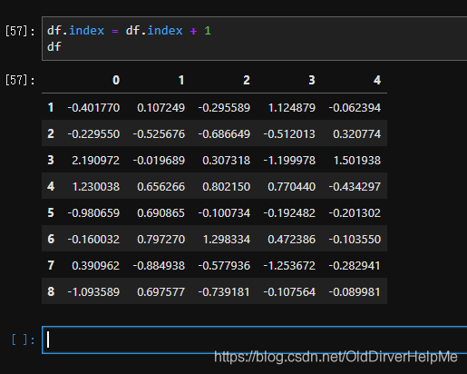

# fillna函数：

作用：补充缺失值

参数：fillna(inplace,method,limit,axis)


指定参数的情况下进行缺失值填充

1、inplace参数的取值：True、False

​    True：直接修改原对象

​    Fasle：创建一个副本，修改副本，原对象不变（缺失默认）

2、method参数的取值：{'pad','ffill','backfill','bfill','None'}

​    pad/ffill：用前一个非缺失值去填充该缺失值

​    backfill/bfill：用下一个非缺失值填充该缺失值

​    None：指定一个值去替换缺失值（缺失默认）

3、limit参数：限制填充个数

4、axis参数：修改填充方向





定位行列：data.loc[行索引, 列名]

只定位行：data.loc[行索引]
例如：
data.loc[3] 表示第4行的所有内容。

只定位列：data.loc[:, 列名]
例如：
data.loc[:, “列名1”]

根据条件定位： data.loc[data[“某个列名”] > 6]
定位某个列值大于6的所有行。

loc和at的区别：
loc可以取多个值，at只能取一个格子里面的值（类似于loc的定位行列的用法）。


# 遍历行
for index, row in df.iterrows():    # index表示索引， row是一个Series结构，可以通过列名或者列索引来获取每一个元素
    print(index)
    print(row['A'])           # 这样是第一列的数据
    print(row[-1])   # 最后一列的数据
    print(row[1])    # 第二列的数据


pandas: shape()获取Dataframe的行数和列数

返回列数：

```
df.shape[``1``]
```

返回行数：

```
df.shape[``0``]  或者：``len``(df)
```

返回形状，即几行几列的数组

```
dataframe.shape()
```

执行df.shape会返回一个元组，该元组的第一个元素代表行数，第二个元素代表列数，这就是这个数据的基本形状，也是数据的大小

```
import` `pandas as pd`` ` `df ``=` `pd.DataFrame([[``'liver'``,``'E'``,``89``,``21``,``24``,``64``],``          ``[``'Arry'``,``'C'``,``36``,``37``,``37``,``57``],``          ``[``'Ack'``,``'A'``,``57``,``60``,``18``,``84``],``          ``[``'Eorge'``,``'C'``,``93``,``96``,``71``,``78``],``          ``[``'Oah'``,``'D'``,``65``,``49``,``61``,``86``]``         ``], ``          ``columns ``=` `[``'name'``,``'team'``,``'Q1'``,``'Q2'``,``'Q3'``,``'Q4'``])`` ` `df.shape``# (5, 6)``# 共5行6列(索引不算)`` ` `df.shape[``0``] ``# 5``df.shape[``1``] ``# 6`` ` `# Series只有一个值``s ``=` `pd.Series([``'One'``,``'Two'``,``'Three'``])``s.shape ``# (3,)``s.shape[``0``] ``# 3
```

结果展示


pandas.DataFrame.expanding的用法

幼儿园一霸

于 2022-02-22 20:25:57 发布

3543
 收藏 7
文章标签： python 机器学习 深度学习
版权
一、基本格式

DataFrame.expanding(min_periods=1, center=None, axis=0, method='single')
函数功能：滚动计算

类似rolling函数，区别在于在rolling函数中“取数框”中的滚动计算数据是固定的，而在expanding函数中，设置最小的计算数，然后累计运算。

参数解释：

min_periods：选择滚动计算的最小数

二、举例

```
df = pd.DataFrame({"B": [0, 1, 2, np.nan, 4]})
 
df
     B
0  0.0
1  1.0
2  2.0
3  NaN
4  4.0
```


```
df.expanding(1).sum()
     B
0  0.0
1  1.0
2  3.0
3  3.0
4  7.0
```

表示最小从1个数据开始滚动，累加。

故第一行数据不变，

第二行数据=0（第一行）+1（第二行）

第三行数据=0（第一行）+1（第二行）+2（第三行数据）

第四行数据=0（第一行）+1（第二行）+2（第三行数据）+nan（第四行数据）

以此类推！

